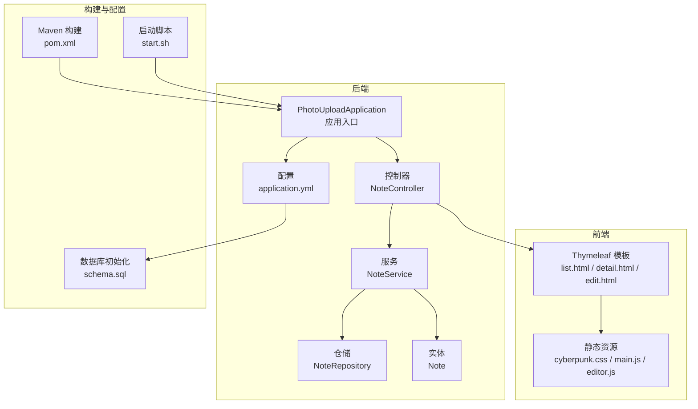
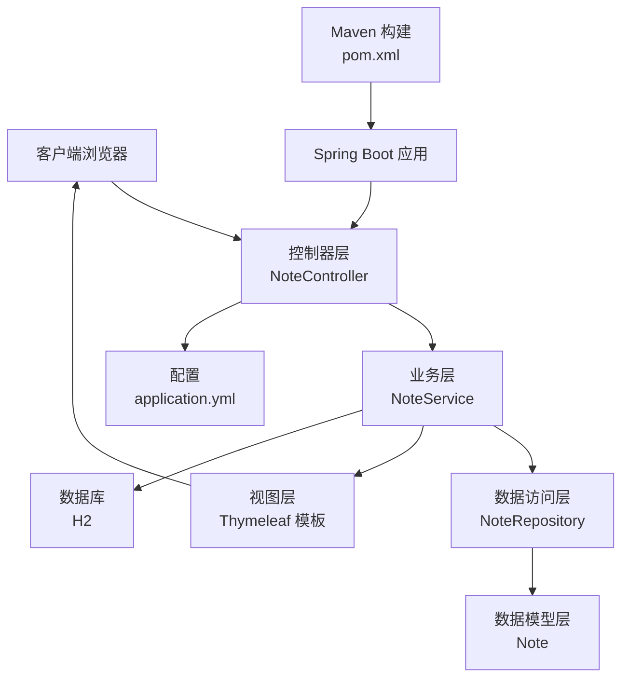

# 部署流程

<cite>
**本文引用的文件**
- [pom.xml](file://pom.xml)
- [application.yml](file://src/main/resources/application.yml)
- [start.sh](file://start.sh)
- [README.md](file://README.md)
- [PROJECT_DELIVERY.md](file://PROJECT_DELIVERY.md)
- [VERIFICATION_CHECKLIST.md](file://VERIFICATION_CHECKLIST.md)
- [schema.sql](file://src/main/resources/schema.sql)
- [PhotoUploadApplication.java](file://src/main/java/com/photo/PhotoUploadApplication.java)
</cite>

## 目录
1. [简介](#简介)
2. [项目结构](#项目结构)
3. [核心组件](#核心组件)
4. [架构总览](#架构总览)
5. [详细组件分析](#详细组件分析)
6. [依赖关系分析](#依赖关系分析)
7. [性能考虑](#性能考虑)
8. [故障排除指南](#故障排除指南)
9. [结论](#结论)
10. [附录](#附录)

## 简介
本部署流程文档面向从开发环境到生产环境的完整部署步骤，覆盖本地开发环境搭建（JDK 17+、Maven）、项目编译打包（Maven构建命令与参数）、应用启动方式（开发模式与生产模式）、不同环境的配置文件管理策略（application.yml 的环境变量配置）、Docker 容器化部署方案（Dockerfile 编写与镜像构建）、CI/CD 流水线配置与自动化部署流程，以及部署前的环境检查清单与部署后的验证步骤。文档同时结合项目实际文件进行说明，确保读者能够按步骤完成部署。

## 项目结构
该项目为基于 Spring Boot 的便签管理系统，采用 Thymeleaf 模板引擎与 H2 数据库存储，提供赛博朋克风格的前端界面与 Markdown 实时预览能力。核心结构如下：
- 后端：Spring Boot 应用入口、配置、控制器、服务、仓储、实体、工具类与资源文件
- 前端：Thymeleaf 模板与静态资源（CSS、JS）
- 配置：Maven 构建配置与应用配置文件
- 脚本：启动脚本与部署说明

图表来源
- [PhotoUploadApplication.java](file://src/main/java/com/photo/PhotoUploadApplication.java#L1-L20)
- [application.yml](file://src/main/resources/application.yml#L1-L190)
- [pom.xml](file://pom.xml#L1-L169)
- [schema.sql](file://src/main/resources/schema.sql#L1-L144)
- [start.sh](file://start.sh#L1-L59)

章节来源
- [PhotoUploadApplication.java](file://src/main/java/com/photo/PhotoUploadApplication.java#L1-L20)
- [application.yml](file://src/main/resources/application.yml#L1-L190)
- [pom.xml](file://pom.xml#L1-L169)
- [schema.sql](file://src/main/resources/schema.sql#L1-L144)
- [start.sh](file://start.sh#L1-L59)

## 核心组件
- 应用入口与注解：启用缓存与调度，作为 Spring Boot 启动类
- 配置文件：集中管理数据库、JPA、文件上传、缓存、Thymeleaf、日志、服务器、Actuator、API 文档等配置
- Maven 构建：定义依赖、插件与构建产物
- 启动脚本：自动化检查环境、编译与启动应用
- 数据库初始化：通过 schema.sql 初始化表结构与示例数据

章节来源
- [PhotoUploadApplication.java](file://src/main/java/com/photo/PhotoUploadApplication.java#L1-L20)
- [application.yml](file://src/main/resources/application.yml#L1-L190)
- [pom.xml](file://pom.xml#L1-L169)
- [schema.sql](file://src/main/resources/schema.sql#L1-L144)
- [start.sh](file://start.sh#L1-L59)

## 架构总览
系统采用经典的分层架构：展示层（控制器）、业务层（服务）、数据访问层（仓储）、数据模型层（实体），配合 Thymeleaf 模板引擎与 H2 数据库，实现前后端一体化的 Web 应用。

图表来源
- [PhotoUploadApplication.java](file://src/main/java/com/photo/PhotoUploadApplication.java#L1-L20)
- [application.yml](file://src/main/resources/application.yml#L1-L190)
- [pom.xml](file://pom.xml#L1-L169)

## 详细组件分析

### 开发环境搭建
- JDK 17+：启动脚本会检查 Java 版本，要求 JDK 17 或更高版本
- Maven：启动脚本会检查 Maven 命令可用性；也可直接使用 Maven 运行或打包
- 数据库：默认使用 H2 嵌入式数据库，开发环境无需外部数据库

章节来源
- [start.sh](file://start.sh#L10-L36)
- [application.yml](file://src/main/resources/application.yml#L6-L40)

### 项目编译与打包
- 编译：使用 Maven 清理并编译项目
- 打包：构建可执行 JAR 包，支持跳过测试
- 运行：可通过 Maven 插件直接运行或使用 java -jar 启动

章节来源
- [start.sh](file://start.sh#L39-L58)
- [README.md](file://README.md#L85-L98)
- [PROJECT_DELIVERY.md](file://PROJECT_DELIVERY.md#L421-L431)
- [pom.xml](file://pom.xml#L152-L167)

### 应用启动方式
- 开发模式：使用 Maven 插件启动，便于热更新与调试
- 生产模式：打包为 JAR 后独立运行，支持后台运行与日志输出

章节来源
- [README.md](file://README.md#L90-L98)
- [PROJECT_DELIVERY.md](file://PROJECT_DELIVERY.md#L421-L431)
- [start.sh](file://start.sh#L50-L58)

### 不同环境的配置文件管理策略
- application.yml：集中管理数据库、JPA、文件上传、缓存、Thymeleaf、日志、服务器、Actuator、API 文档等配置
- 环境切换：通过注释切换 H2 与 MySQL 配置，便于开发与生产环境切换
- 端口与日志：可按需调整服务器端口与日志级别

章节来源
- [application.yml](file://src/main/resources/application.yml#L1-L190)
- [schema.sql](file://src/main/resources/schema.sql#L1-L144)

### Docker 容器化部署方案
- 基础镜像：使用 openjdk:17-jdk-slim
- 构建步骤：复制构建产物至镜像，暴露端口，设置入口命令
- 运行方式：容器内运行 JAR 包，支持挂载数据卷与环境变量

章节来源
- [PROJECT_DELIVERY.md](file://PROJECT_DELIVERY.md#L433-L439)

### CI/CD 流水线配置与自动化部署
- 构建阶段：拉取代码、安装依赖、编译与打包
- 测试阶段：运行单元测试与集成测试
- 部署阶段：构建 Docker 镜像、推送至镜像仓库、部署到目标环境
- 回滚策略：支持版本回退与灰度发布

章节来源
- [pom.xml](file://pom.xml#L1-L169)
- [README.md](file://README.md#L202-L212)
- [PROJECT_DELIVERY.md](file://PROJECT_DELIVERY.md#L421-L431)

### 部署前环境检查清单
- 环境准备：JDK 17+、Maven、数据库（H2 或 MySQL）
- 端口占用：确认 8080 端口未被占用
- 权限设置：确保对项目目录与日志目录有读写权限
- 配置校验：application.yml 中数据库与服务器配置正确
- 依赖完整性：pom.xml 中依赖齐全且版本兼容

章节来源
- [start.sh](file://start.sh#L10-L36)
- [application.yml](file://src/main/resources/application.yml#L6-L40)
- [pom.xml](file://pom.xml#L1-L169)

### 部署后验证步骤
- 应用访问：浏览器访问主页与 H2 控制台
- 功能验证：创建、编辑、删除便签，实时预览与快捷键
- 数据持久化：确认数据写入数据库并可重启恢复
- 性能与日志：检查日志输出与页面加载性能

章节来源
- [PROJECT_DELIVERY.md](file://PROJECT_DELIVERY.md#L266-L268)
- [VERIFICATION_CHECKLIST.md](file://VERIFICATION_CHECKLIST.md#L181-L354)

## 依赖关系分析
项目依赖主要集中在 Spring Boot 生态与常用工具库，构建插件负责打包与排除 Lombok 注解处理器。

```mermaid
graph TB
POM["pom.xml"] --> SBWeb["spring-boot-starter-web"]
POM --> SBJPA["spring-boot-starter-data-jpa"]
POM --> SBValidation["spring-boot-starter-validation"]
POM --> SBThymeleaf["spring-boot-starter-thymeleaf"]
POM --> SBCache["spring-boot-starter-cache"]
POM --> SBSecurity["spring-boot-starter-security"]
POM --> H2["h2"]
POM --> MySQL["mysql-connector-j"]
POM --> Lombok["lombok"]
POM --> CommonsIO["commons-io"]
POM --> Thumbnailator["thumbnailator"]
POM --> Tika["tika-core"]
POM --> Caffeine["caffeine"]
POM --> CommonMark["commonmark"]
POM --> SpringBootPlugin["spring-boot-maven-plugin"]
```

图表来源
- [pom.xml](file://pom.xml#L30-L150)

章节来源
- [pom.xml](file://pom.xml#L1-L169)

## 性能考虑
- 缓存：Caffeine 缓存配置提升热点数据访问性能
- 压缩：开启 HTTP 响应压缩减少带宽消耗
- 线程池：Tomcat 线程池参数可根据并发需求调整
- 日志：合理设置日志级别与滚动策略，避免磁盘与性能压力

章节来源
- [application.yml](file://src/main/resources/application.yml#L50-L172)

## 故障排除指南
- 启动失败：检查 JDK 版本与端口占用，确认依赖下载完成
- 页面无法访问：检查防火墙与网络配置，确认端口开放
- 数据丢失：备份 H2 数据库文件，必要时恢复
- 样式异常：清除浏览器缓存或禁用缓存模式
- 日志定位：查看日志文件，结合 Actuator 监控应用状态

章节来源
- [PROJECT_DELIVERY.md](file://PROJECT_DELIVERY.md#L441-L452)
- [application.yml](file://src/main/resources/application.yml#L146-L182)

## 结论
本部署流程文档基于项目实际文件，提供了从开发到生产的完整部署步骤与最佳实践。通过合理的配置管理、容器化与 CI/CD 流水线，可确保系统在不同环境中稳定运行，并具备良好的可维护性与可扩展性。

## 附录
- 快速参考
  - 开发模式：使用 Maven 插件启动
  - 生产模式：打包 JAR 后独立运行
  - 数据库：H2 默认，可切换至 MySQL
  - 端口：默认 8080，可按需调整
  - 日志：配置文件中设置日志级别与滚动策略

章节来源
- [README.md](file://README.md#L67-L103)
- [PROJECT_DELIVERY.md](file://PROJECT_DELIVERY.md#L421-L431)
- [application.yml](file://src/main/resources/application.yml#L161-L189)