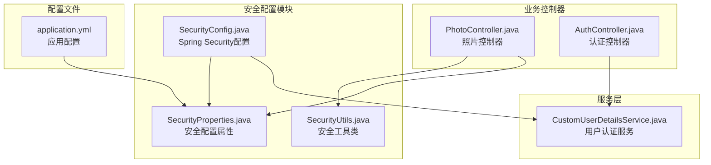
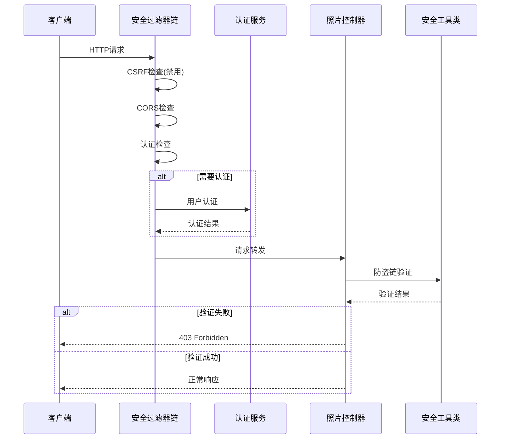
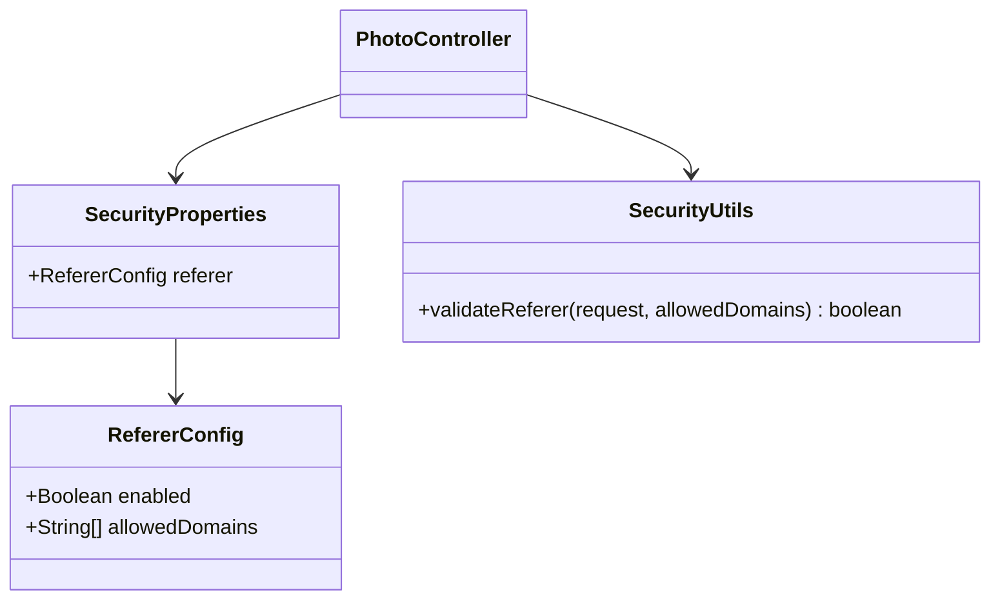
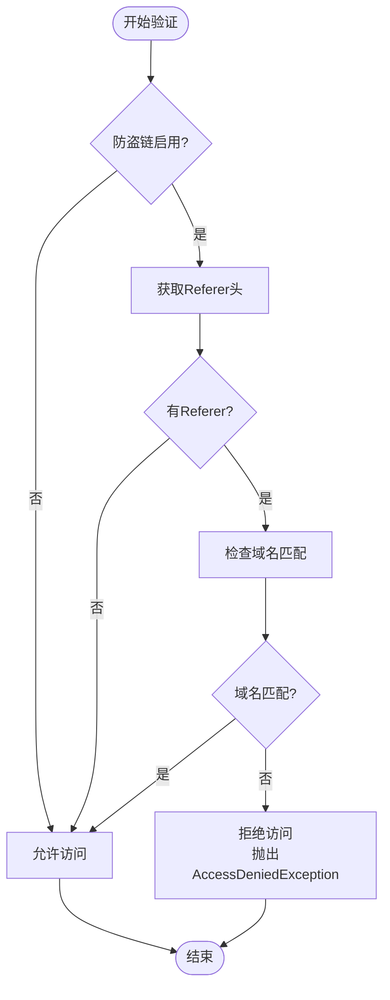
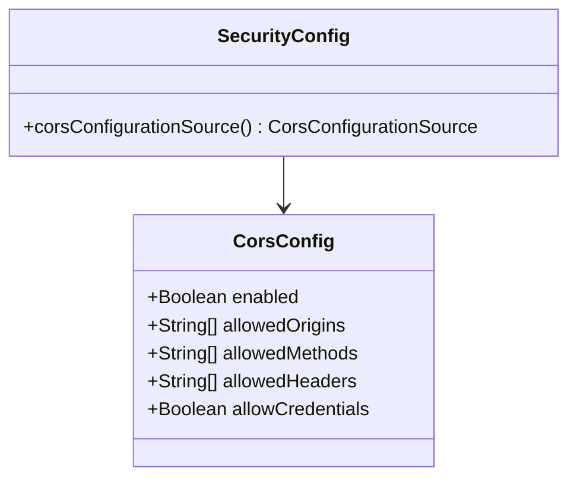
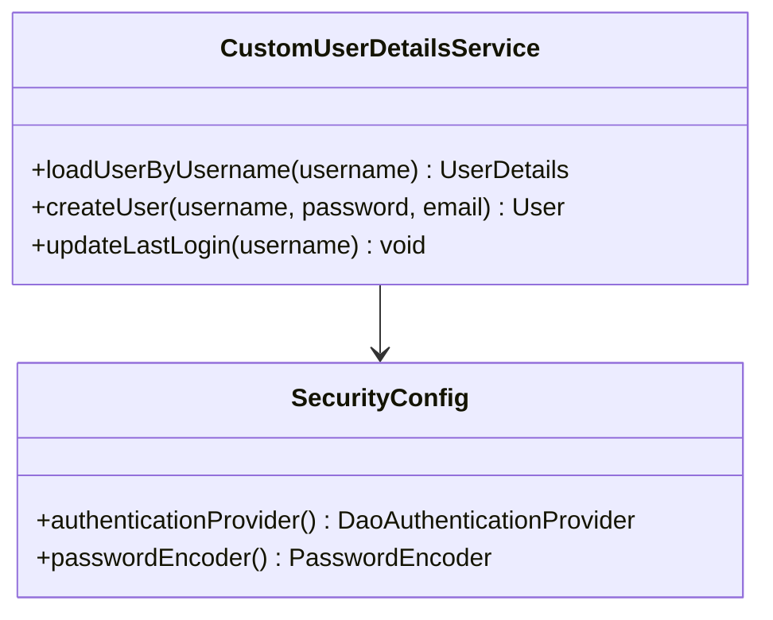
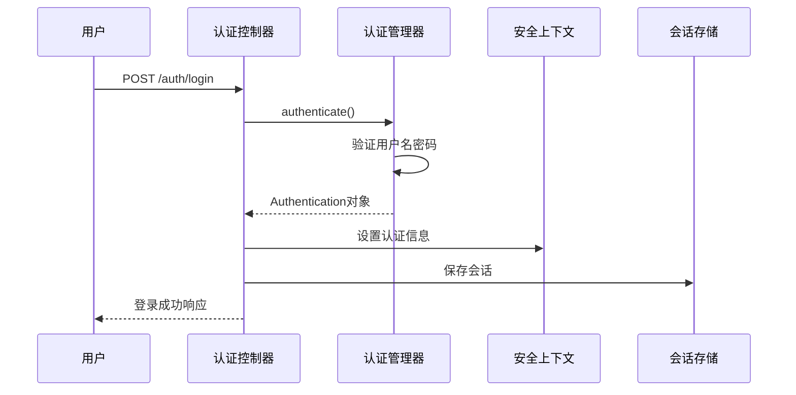
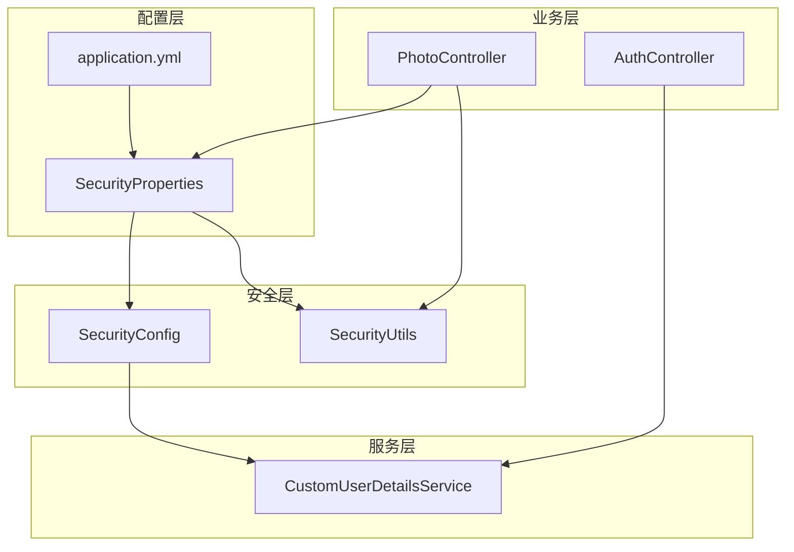

# 安全配置

<cite>
**本文档引用的文件**
- [SecurityConfig.java](file://src/main/java/com/photo/config/SecurityConfig.java)
- [SecurityProperties.java](file://src/main/java/com/photo/config/SecurityProperties.java)
- [SecurityUtils.java](file://src/main/java/com/photo/util/SecurityUtils.java)
- [application.yml](file://src/main/resources/application.yml)
- [PhotoController.java](file://src/main/java/com/photo/controller/PhotoController.java)
- [CustomUserDetailsService.java](file://src/main/java/com/photo/service/CustomUserDetailsService.java)
- [GlobalExceptionHandler.java](file://src/main/java/com/photo/exception/GlobalExceptionHandler.java)
- [AccessDeniedException.java](file://src/main/java/com/photo/exception/AccessDeniedException.java)
- [AuthController.java](file://src/main/java/com/photo/controller/AuthController.java)
- [SecurityUtilsTest.java](file://src/test/java/com/photo/util/SecurityUtilsTest.java)
- [LOGIN_GUIDE.md](file://LOGIN_GUIDE.md)
- [API_DOCUMENTATION.md](file://API_DOCUMENTATION.md)
</cite>

## 目录
1. [简介](#简介)
2. [项目结构](#项目结构)
3. [核心组件](#核心组件)
4. [架构概览](#架构概览)
5. [详细组件分析](#详细组件分析)
6. [依赖关系分析](#依赖关系分析)
7. [性能考虑](#性能考虑)
8. [故障排除指南](#故障排除指南)
9. [结论](#结论)
10. [附录](#附录)

## 简介

本文件详细介绍Spring Security在照片上传系统中的配置和应用，重点涵盖以下安全机制：

- **防盗链配置**：Referer验证、允许域名列表的安全机制
- **Token配置**：密钥、过期时间的身份认证设置
- **CORS跨域配置**：允许来源、方法、头部、凭证的详细参数
- **安全最佳实践**：配置验证方法和常见安全问题的解决方案
- **生产环境安全配置建议**：安全审计要点

## 项目结构

照片上传系统的安全配置主要分布在以下模块中：



**图表来源**
- [SecurityConfig.java](file://src/main/java/com/photo/config/SecurityConfig.java#L26-L58)
- [SecurityProperties.java](file://src/main/java/com/photo/config/SecurityProperties.java#L14-L31)
- [SecurityUtils.java](file://src/main/java/com/photo/util/SecurityUtils.java#L15-L167)

**章节来源**
- [SecurityConfig.java](file://src/main/java/com/photo/config/SecurityConfig.java#L1-L99)
- [SecurityProperties.java](file://src/main/java/com/photo/config/SecurityProperties.java#L1-L53)
- [application.yml](file://src/main/resources/application.yml#L119-L145)

## 核心组件

### Spring Security配置

系统采用Spring Security进行整体安全控制，主要配置包括：

- **CSRF禁用**：由于是RESTful API，禁用了CSRF保护
- **CORS配置**：动态从配置文件加载CORS设置
- **认证规则**：公开路径放行，其他路径需要认证
- **表单登录**：支持标准的表单认证流程

### 安全配置属性

安全配置通过`SecurityProperties`类集中管理，包含三个主要配置组：

- **防盗链配置**：控制Referer验证开关和允许域名列表
- **Token配置**：管理密钥和过期时间设置
- **CORS配置**：定义跨域访问策略

### 安全工具类

`SecurityUtils`提供了多种安全相关的实用方法：

- **XSS防护**：HTML内容转义
- **IP地址获取**：支持代理环境的真实IP识别
- **Referer验证**：防盗链检查
- **路径遍历防护**：文件名安全验证
- **访问权限检查**：文件访问权限验证

**章节来源**
- [SecurityConfig.java](file://src/main/java/com/photo/config/SecurityConfig.java#L36-L58)
- [SecurityProperties.java](file://src/main/java/com/photo/config/SecurityProperties.java#L15-L52)
- [SecurityUtils.java](file://src/main/java/com/photo/util/SecurityUtils.java#L15-L167)

## 架构概览

系统安全架构采用多层次防护策略：



**图表来源**
- [SecurityConfig.java](file://src/main/java/com/photo/config/SecurityConfig.java#L37-L55)
- [PhotoController.java](file://src/main/java/com/photo/controller/PhotoController.java#L92-L97)
- [SecurityUtils.java](file://src/main/java/com/photo/util/SecurityUtils.java#L62-L79)

## 详细组件分析

### 防盗链配置（Referer验证）

#### 配置机制

防盗链功能通过`SecurityProperties.RefererConfig`实现：



**图表来源**
- [SecurityProperties.java](file://src/main/java/com/photo/config/SecurityProperties.java#L32-L36)
- [SecurityUtils.java](file://src/main/java/com/photo/util/SecurityUtils.java#L62-L79)

#### 验证逻辑

防盗链验证采用宽松策略：

1. **空Referer处理**：允许无Referer的直接访问
2. **域名匹配**：检查Referer中是否包含允许的域名
3. **日志记录**：对非法访问进行警告日志

#### 应用场景

在照片预览接口中实施防盗链：



**图表来源**
- [PhotoController.java](file://src/main/java/com/photo/controller/PhotoController.java#L92-L97)
- [SecurityUtils.java](file://src/main/java/com/photo/util/SecurityUtils.java#L62-L79)

**章节来源**
- [SecurityProperties.java](file://src/main/java/com/photo/config/SecurityProperties.java#L32-L36)
- [SecurityUtils.java](file://src/main/java/com/photo/util/SecurityUtils.java#L62-L79)
- [PhotoController.java](file://src/main/java/com/photo/controller/PhotoController.java#L92-L97)

### Token配置（身份认证）

#### 配置结构

Token配置通过`SecurityProperties.TokenConfig`管理：

| 配置项 | 默认值 | 说明 |
|--------|--------|------|
| secret | your-secret-key | JWT密钥 |
| expiration | 86400 | 过期时间（秒），默认24小时 |

#### 当前实现状态

系统当前使用基于Session的认证而非JWT Token：

- **认证方式**：Spring Security表单认证
- **Token功能**：工具类提供简单的Token生成和验证
- **生产建议**：建议替换为JWT认证

**章节来源**
- [SecurityProperties.java](file://src/main/java/com/photo/config/SecurityProperties.java#L38-L42)
- [SecurityUtils.java](file://src/main/java/com/photo/util/SecurityUtils.java#L98-L111)

### CORS跨域配置

#### 配置参数

CORS配置通过`SecurityProperties.CorsConfig`实现：



**图表来源**
- [SecurityProperties.java](file://src/main/java/com/photo/config/SecurityProperties.java#L44-L51)
- [SecurityConfig.java](file://src/main/java/com/photo/config/SecurityConfig.java#L78-L92)

#### 默认配置

系统提供合理的默认CORS配置：

- **允许来源**：`http://localhost:3000`, `http://localhost:8080`
- **允许方法**：GET, POST, PUT, DELETE
- **允许头部**：`*`（通配符）
- **允许凭证**：true

#### 动态配置

CORS配置从`application.yml`动态加载：

**章节来源**
- [SecurityProperties.java](file://src/main/java/com/photo/config/SecurityProperties.java#L44-L51)
- [SecurityConfig.java](file://src/main/java/com/photo/config/SecurityConfig.java#L78-L92)
- [application.yml](file://src/main/resources/application.yml#L132-L144)

### 认证与授权

#### 用户认证服务

`CustomUserDetailsService`实现Spring Security的用户认证：



**图表来源**
- [CustomUserDetailsService.java](file://src/main/java/com/photo/service/CustomUserDetailsService.java#L18-L41)
- [SecurityConfig.java](file://src/main/java/com/photo/config/SecurityConfig.java#L65-L71)

#### 认证流程



**图表来源**
- [AuthController.java](file://src/main/java/com/photo/controller/AuthController.java#L47-L80)
- [CustomUserDetailsService.java](file://src/main/java/com/photo/service/CustomUserDetailsService.java#L27-L41)

**章节来源**
- [CustomUserDetailsService.java](file://src/main/java/com/photo/service/CustomUserDetailsService.java#L18-L70)
- [AuthController.java](file://src/main/java/com/photo/controller/AuthController.java#L23-L110)

## 依赖关系分析

系统安全配置的依赖关系如下：



**图表来源**
- [SecurityConfig.java](file://src/main/java/com/photo/config/SecurityConfig.java#L30-L34)
- [SecurityProperties.java](file://src/main/java/com/photo/config/SecurityProperties.java#L14-L31)
- [PhotoController.java](file://src/main/java/com/photo/controller/PhotoController.java#L42-L43)

**章节来源**
- [SecurityConfig.java](file://src/main/java/com/photo/config/SecurityConfig.java#L1-L99)
- [SecurityProperties.java](file://src/main/java/com/photo/config/SecurityProperties.java#L1-L53)

## 性能考虑

### 安全配置性能影响

1. **CSRF禁用**：减少认证开销，适合API场景
2. **CORS动态加载**：运行时从配置文件读取，性能影响可忽略
3. **防盗链验证**：字符串匹配操作，性能开销很小
4. **密码加密**：BCrypt加密在用户登录时执行，单次操作

### 优化建议

- **缓存认证结果**：对于频繁访问的用户可考虑缓存认证状态
- **异步日志**：防盗链验证的日志记录可异步化
- **连接池优化**：合理配置Tomcat连接池参数

## 故障排除指南

### 常见安全问题及解决方案

#### 1. 防盗链配置问题

**问题现象**：合法域名被拒绝访问

**排查步骤**：
1. 检查`application.yml`中的`allowed-domains`配置
2. 验证Referer头的实际值
3. 查看日志中的警告信息

**解决方案**：
```yaml
security:
  referer:
    enabled: true
    allowed-domains:
      - localhost
      - 127.0.0.1
      - your-domain.com
```

#### 2. CORS跨域问题

**问题现象**：前端无法访问API接口

**排查步骤**：
1. 检查浏览器开发者工具的网络面板
2. 验证CORS响应头是否正确
3. 确认允许的来源和方法配置

**解决方案**：
```yaml
security:
  cors:
    enabled: true
    allowed-origins:
      - http://localhost:3000
      - http://localhost:8080
    allowed-methods: [GET, POST, PUT, DELETE, OPTIONS]
    allowed-headers: ["*"]
    allow-credentials: true
```

#### 3. 认证失败问题

**问题现象**：用户登录失败

**排查步骤**：
1. 检查用户是否存在且启用
2. 验证密码是否正确（BCrypt加密）
3. 查看认证日志

**解决方案**：
- 确保用户状态为启用
- 检查密码是否正确
- 验证数据库连接

#### 4. 文件访问权限问题

**问题现象**：用户无法访问私有文件

**排查步骤**：
1. 检查文件的公开状态
2. 验证用户身份
3. 确认文件所有权

**解决方案**：
- 公开文件：任何用户可访问
- 私有文件：仅所有者可访问
- 管理员权限：根据业务需求配置

**章节来源**
- [GlobalExceptionHandler.java](file://src/main/java/com/photo/exception/GlobalExceptionHandler.java#L78-L87)
- [AccessDeniedException.java](file://src/main/java/com/photo/exception/AccessDeniedException.java#L6-L15)

## 结论

本照片上传系统的安全配置采用了多层次的防护策略：

### 已实现的安全特性

1. **完整的认证体系**：基于Spring Security的表单认证
2. **灵活的防盗链机制**：可配置的Referer验证
3. **标准化的CORS配置**：动态加载的跨域策略
4. **全面的安全工具**：XSS防护、路径遍历防护等
5. **完善的异常处理**：统一的错误响应格式

### 建议改进方向

1. **Token认证升级**：从Session迁移到JWT
2. **增强日志审计**：增加更详细的访问日志
3. **安全扫描集成**：定期进行安全漏洞扫描
4. **权限细化**：实现基于角色的细粒度权限控制

### 生产环境部署建议

1. **密钥安全管理**：使用环境变量存储敏感配置
2. **HTTPS强制**：启用TLS加密传输
3. **访问控制**：限制API访问频率和并发数
4. **监控告警**：建立安全事件监控和告警机制

## 附录

### 配置验证方法

#### 1. 防盗链验证

```bash
# 测试允许的域名
curl -H "Referer: http://localhost:8080/page" \
     http://localhost:8080/api/photos/view/image.jpg

# 测试不允许的域名
curl -H "Referer: http://malicious.com/page" \
     http://localhost:8080/api/photos/view/image.jpg
```

#### 2. CORS验证

```bash
# 检查CORS响应头
curl -I -H "Origin: http://localhost:3000" \
     http://localhost:8080/api/photos/upload
```

#### 3. 认证验证

```bash
# 登录测试
curl -X POST -d "username=admin&password=123456" \
     http://localhost:8080/api/auth/login
```

### 安全审计要点

1. **配置审计**：定期检查安全配置的有效性
2. **访问日志**：监控异常访问模式
3. **漏洞扫描**：定期进行安全漏洞评估
4. **权限审查**：验证用户权限分配的合理性
5. **日志完整性**：确保安全日志的完整性和不可篡改性