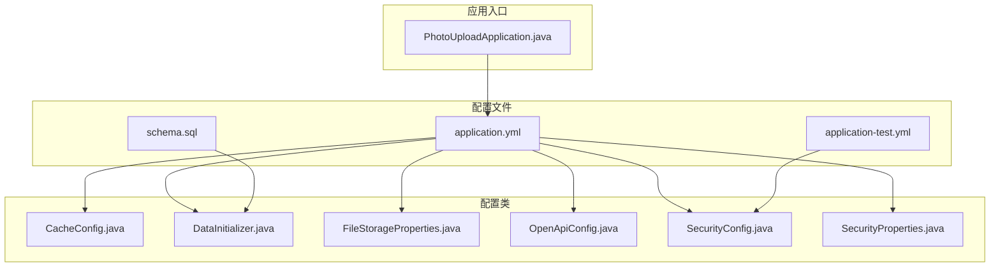
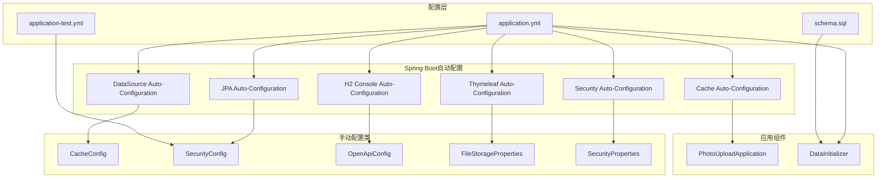
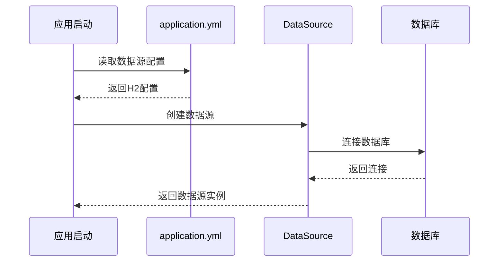
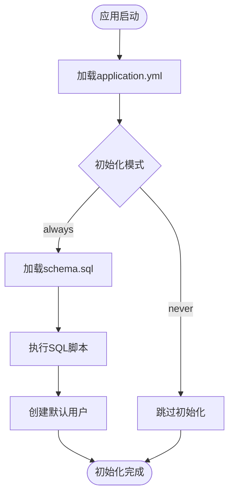
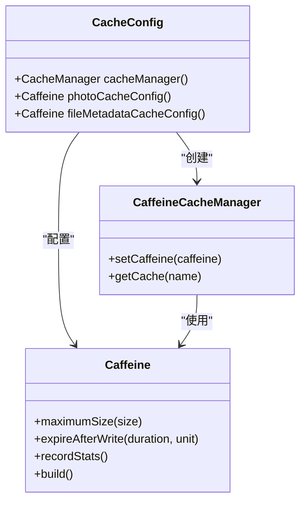
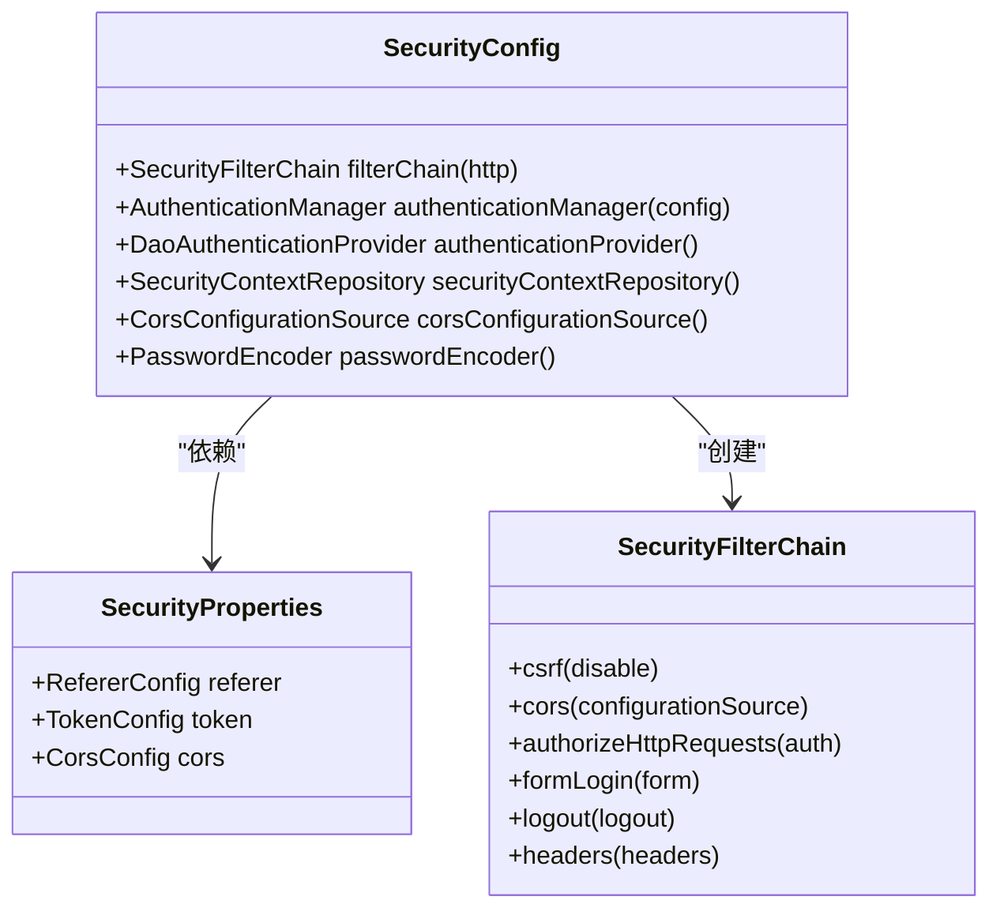
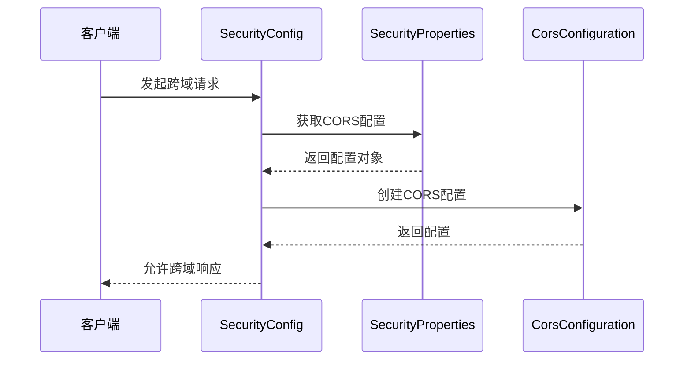
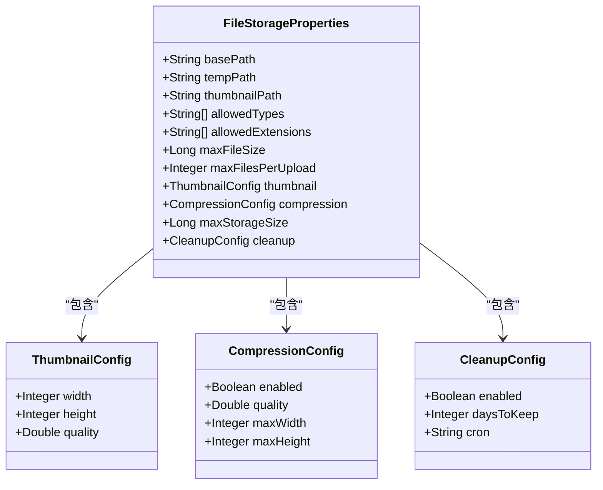
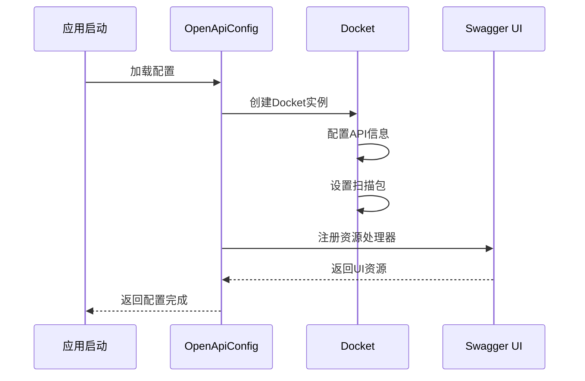
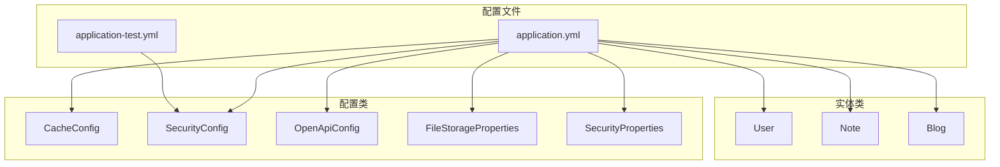

# 应用配置

<cite>
**本文档引用的文件**
- [application.yml](file://src/main/resources/application.yml)
- [application-test.yml](file://src/test/resources/application-test.yml)
- [schema.sql](file://src/main/resources/schema.sql)
- [pom.xml](file://pom.xml)
- [PhotoUploadApplication.java](file://src/main/java/com/photo/PhotoUploadApplication.java)
- [CacheConfig.java](file://src/main/java/com/photo/config/CacheConfig.java)
- [DataInitializer.java](file://src/main/java/com/photo/config/DataInitializer.java)
- [FileStorageProperties.java](file://src/main/java/com/photo/config/FileStorageProperties.java)
- [OpenApiConfig.java](file://src/main/java/com/photo/config/OpenApiConfig.java)
- [SecurityConfig.java](file://src/main/java/com/photo/config/SecurityConfig.java)
- [SecurityProperties.java](file://src/main/java/com/photo/config/SecurityProperties.java)
- [start.sh](file://start.sh)
</cite>

## 目录
1. [简介](#简介)
2. [项目结构](#项目结构)
3. [核心配置组件](#核心配置组件)
4. [架构概览](#架构概览)
5. [详细组件分析](#详细组件分析)
6. [依赖关系分析](#依赖关系分析)
7. [性能考虑](#性能考虑)
8. [故障排除指南](#故障排除指南)
9. [结论](#结论)

## 简介
本文件详细介绍Spring Boot应用的配置体系，涵盖数据库配置、JPA/Hibernate配置、SQL初始化设置、H2控制台配置、Thymeleaf模板引擎配置、Springfox兼容性配置等核心配置项。文档提供了完整的配置示例路径和参数说明，包括配置优先级、环境变量替换、配置验证等高级主题，并给出最佳实践和常见问题解决方案。

## 项目结构
应用采用标准的Spring Boot项目结构，配置文件位于resources目录下，主要配置文件包括：
- application.yml：主应用配置文件
- application-test.yml：测试环境配置文件
- schema.sql：数据库初始化脚本
- pom.xml：Maven构建配置

**图表来源**
- [application.yml](file://src/main/resources/application.yml#L1-L190)
- [PhotoUploadApplication.java](file://src/main/java/com/photo/PhotoUploadApplication.java#L1-L20)

**章节来源**
- [application.yml](file://src/main/resources/application.yml#L1-L190)
- [pom.xml](file://pom.xml#L1-L169)

## 核心配置组件

### 数据库配置
应用支持两种数据库配置模式：

#### 开发环境（H2内存数据库）
- 数据源URL：jdbc:h2:file:./data/notesdb
- 驱动类：org.h2.Driver
- 用户名：sa
- 密码：空值

#### 生产环境（MySQL数据库）
注释掉的MySQL配置示例：
- 数据源URL：jdbc:mysql://localhost:3306/photo_db?useUnicode=true&characterEncoding=utf8&useSSL=false&serverTimezone=Asia/Shanghai
- 驱动类：com.mysql.cj.jdbc.Driver
- 用户名：root
- 密码：root

**章节来源**
- [application.yml](file://src/main/resources/application.yml#L6-L17)
- [pom.xml](file://pom.xml#L67-L79)

### JPA/Hibernate配置
- DDL自动模式：update（开发环境）
- 显示SQL语句：启用
- SQL格式化：启用
- Hibernate方言：
  - 开发环境：org.hibernate.dialect.H2Dialect
  - 生产环境：org.hibernate.dialect.MySQLDialect（注释状态）

**章节来源**
- [application.yml](file://src/main/resources/application.yml#L20-L28)

### SQL初始化配置
- 初始化模式：always（每次启动都执行）
- 编码格式：UTF-8
- 自动执行schema.sql脚本

**章节来源**
- [application.yml](file://src/main/resources/application.yml#L31-L34)
- [schema.sql](file://src/main/resources/schema.sql#L1-L144)

### H2控制台配置
- 控制台启用：true
- 访问路径：/h2-console
- 用于数据库调试和管理

**章节来源**
- [application.yml](file://src/main/resources/application.yml#L37-L40)

### 文件上传配置
- 多部分上传启用：true
- 单文件最大大小：10MB
- 请求总大小限制：50MB
- 文件大小阈值：2MB

**章节来源**
- [application.yml](file://src/main/resources/application.yml#L43-L48)

### 缓存配置
- 缓存类型：caffeine
- 缓存规范：maximumSize=1000,expireAfterWrite=3600s
- 支持统计记录

**章节来源**
- [application.yml](file://src/main/resources/application.yml#L51-L54)
- [CacheConfig.java](file://src/main/java/com/photo/config/CacheConfig.java#L22-L30)

### Thymeleaf模板配置
- 模板前缀：classpath:/templates/
- 模板后缀：.html
- 模式：HTML
- 编码：UTF-8
- 缓存：false（开发环境禁用缓存）

**章节来源**
- [application.yml](file://src/main/resources/application.yml#L57-L62)

### Springfox兼容性配置
解决Spring Boot 2.6+与Springfox的兼容性问题：
- 路径匹配策略：ant_path_matcher

**章节来源**
- [application.yml](file://src/main/resources/application.yml#L65-L67)

### 文件存储配置
通过@ConfigurationProperties映射的完整文件存储配置：

#### 基础路径配置
- basePath：./uploads（文件存储根目录）
- tempPath：./uploads/temp（临时文件目录）
- thumbnailPath：./uploads/thumbnails（缩略图目录）

#### 文件类型限制
- allowedTypes：支持的MIME类型列表
- allowedExtensions：支持的文件扩展名列表

#### 文件大小限制
- maxFileSize：10485760（10MB）
- maxFilesPerUpload：10（单次上传最大文件数）

#### 缩略图配置
- width：200像素
- height：200像素
- quality：0.8（80%质量）

#### 图片压缩配置
- enabled：true（启用压缩）
- quality：0.85（85%质量）
- maxWidth：1920像素
- maxHeight：1080像素

#### 存储容量限制
- maxStorageSize：10737418240（10GB）
- 定时清理：启用

#### 定期清理配置
- enabled：true（启用定时清理）
- daysToKeep：30（保留30天）
- cron：0 0 2 * * ?（每天凌晨2点执行）

**章节来源**
- [application.yml](file://src/main/resources/application.yml#L70-L117)
- [FileStorageProperties.java](file://src/main/java/com/photo/config/FileStorageProperties.java#L14-L93)

### 安全配置
#### 防盗链配置
- enabled：true（启用防盗链）
- allowedDomains：localhost, 127.0.0.1（允许的域名列表）

#### Token配置
- secret：your-secret-key-change-this-in-production（密钥）
- expiration：86400（24小时过期时间）

#### CORS配置
- enabled：true（启用CORS）
- allowedOrigins：http://localhost:3000, http://localhost:8080
- allowedMethods：GET, POST, PUT, DELETE
- allowedHeaders：*（允许所有头部）
- allowCredentials：true（允许携带凭证）

**章节来源**
- [application.yml](file://src/main/resources/application.yml#L120-L144)
- [SecurityProperties.java](file://src/main/java/com/photo/config/SecurityProperties.java#L14-L51)

### 日志配置
- 根日志级别：INFO
- com.photo包：DEBUG
- org.springframework.web：DEBUG
- org.hibernate：INFO
- 控制台输出格式：带时间戳的标准格式
- 文件输出格式：带时间戳的标准格式
- 日志文件：./logs/photo-upload-system.log
- 单个文件最大大小：10MB
- 保留历史天数：30天

**章节来源**
- [application.yml](file://src/main/resources/application.yml#L147-L159)

### 服务器配置
- 端口：8080
- GZIP压缩：启用
- MIME类型：text/html,text/xml,text/plain,text/css,application/javascript,application/json,image/svg+xml
- Tomcat连接器：
  - 最大连接数：10000
  - 最大线程数：200
  - 最小空闲线程：10

**章节来源**
- [application.yml](file://src/main/resources/application.yml#L162-L171)

### Actuator监控配置
- 暴露端点：health, info, metrics
- 健康检查详情：when-authorized

**章节来源**
- [application.yml](file://src/main/resources/application.yml#L174-L181)

### API文档配置
- Springdoc OpenAPI集成
- API文档路径：/api-docs
- Swagger UI路径：/swagger-ui.html
- Swagger UI启用：true

**章节来源**
- [application.yml](file://src/main/resources/application.yml#L184-L189)
- [OpenApiConfig.java](file://src/main/java/com/photo/config/OpenApiConfig.java#L21-L31)

## 架构概览

**图表来源**
- [application.yml](file://src/main/resources/application.yml#L1-L190)
- [PhotoUploadApplication.java](file://src/main/java/com/photo/PhotoUploadApplication.java#L11-L13)

## 详细组件分析

### 数据库配置组件

#### 数据源配置流程

**图表来源**
- [application.yml](file://src/main/resources/application.yml#L6-L17)
- [DataInitializer.java](file://src/main/java/com/photo/config/DataInitializer.java#L28-L55)

#### SQL初始化流程

**图表来源**
- [application.yml](file://src/main/resources/application.yml#L31-L34)
- [schema.sql](file://src/main/resources/schema.sql#L1-L144)
- [DataInitializer.java](file://src/main/java/com/photo/config/DataInitializer.java#L28-L55)

**章节来源**
- [application.yml](file://src/main/resources/application.yml#L6-L34)
- [schema.sql](file://src/main/resources/schema.sql#L1-L144)
- [DataInitializer.java](file://src/main/java/com/photo/config/DataInitializer.java#L1-L57)

### 缓存配置组件

#### 缓存配置类图

**图表来源**
- [CacheConfig.java](file://src/main/java/com/photo/config/CacheConfig.java#L15-L53)

#### 缓存配置参数说明
- 默认缓存管理器：maximumSize=1000, expireAfterWrite=60分钟
- 照片缓存：maximumSize=500, expireAfterWrite=30分钟
- 文件元数据缓存：maximumSize=1000, expireAfterWrite=60分钟

**章节来源**
- [application.yml](file://src/main/resources/application.yml#L51-L54)
- [CacheConfig.java](file://src/main/java/com/photo/config/CacheConfig.java#L15-L53)

### 安全配置组件

#### 安全配置类图

**图表来源**
- [SecurityConfig.java](file://src/main/java/com/photo/config/SecurityConfig.java#L26-L98)
- [SecurityProperties.java](file://src/main/java/com/photo/config/SecurityProperties.java#L14-L51)

#### CORS配置流程

**图表来源**
- [SecurityConfig.java](file://src/main/java/com/photo/config/SecurityConfig.java#L79-L92)
- [SecurityProperties.java](file://src/main/java/com/photo/config/SecurityProperties.java#L45-L51)

**章节来源**
- [SecurityConfig.java](file://src/main/java/com/photo/config/SecurityConfig.java#L1-L99)
- [SecurityProperties.java](file://src/main/java/com/photo/config/SecurityProperties.java#L1-L53)

### 文件存储配置组件

#### 文件存储配置类图

**图表来源**
- [FileStorageProperties.java](file://src/main/java/com/photo/config/FileStorageProperties.java#L14-L93)

#### 文件存储配置参数
- 基础路径：./uploads（相对路径）
- 临时文件：./uploads/temp
- 缩略图：./uploads/thumbnails
- 允许类型：image/jpeg, image/jpg, image/png, image/gif, image/bmp, image/webp
- 允许扩展名：jpg, jpeg, png, gif, bmp, webp
- 最大文件大小：10MB
- 最大文件数：10个
- 缩略图尺寸：200x200像素
- 压缩质量：80%
- 存储上限：10GB
- 清理策略：30天保留，每日凌晨2点清理

**章节来源**
- [application.yml](file://src/main/resources/application.yml#L70-L117)
- [FileStorageProperties.java](file://src/main/java/com/photo/config/FileStorageProperties.java#L14-L93)

### API文档配置组件

#### OpenAPI配置流程

**图表来源**
- [OpenApiConfig.java](file://src/main/java/com/photo/config/OpenApiConfig.java#L21-L49)

**章节来源**
- [OpenApiConfig.java](file://src/main/java/com/photo/config/OpenApiConfig.java#L1-L50)

## 依赖关系分析

### Maven依赖配置
应用使用Spring Boot 2.7.18版本，核心依赖包括：

#### 核心Spring Boot Starter
- spring-boot-starter-web：Web应用基础
- spring-boot-starter-data-jpa：JPA数据访问
- spring-boot-starter-validation：数据验证
- spring-boot-starter-thymeleaf：模板引擎
- spring-boot-starter-cache：缓存支持
- spring-boot-starter-security：安全框架

#### 数据库驱动
- H2数据库：开发环境使用
- MySQL Connector：生产环境可选

#### 第三方库
- Lombok：简化代码生成
- Commons IO：文件操作工具
- Thumbnailator：图片处理
- Apache Tika：文件类型检测
- Caffeine：高性能缓存
- CommonMark：Markdown解析

**章节来源**
- [pom.xml](file://pom.xml#L30-L149)

### 配置依赖关系图

**图表来源**
- [application.yml](file://src/main/resources/application.yml#L1-L190)
- [SecurityConfig.java](file://src/main/java/com/photo/config/SecurityConfig.java#L30-L34)

**章节来源**
- [application.yml](file://src/main/resources/application.yml#L1-L190)
- [SecurityConfig.java](file://src/main/java/com/photo/config/SecurityConfig.java#L1-L99)

## 性能考虑

### 缓存策略
- 默认缓存：1000个条目，60分钟过期
- 照片缓存：500个条目，30分钟过期
- 文件元数据缓存：1000个条目，60分钟过期
- 启用缓存统计，便于性能监控

### 数据库优化
- 开发环境使用H2内存数据库，性能优异
- 生产环境建议使用MySQL，支持集群部署
- 合理设置连接池参数，避免连接泄漏

### 文件处理优化
- 图片压缩质量：85%，平衡质量和性能
- 最大分辨率：1920x1080，适配大多数显示设备
- 定时清理机制，防止存储空间无限增长

### 网络性能
- 启用GZIP压缩，减少传输体积
- 配置合理的Tomcat线程池
- 启用HTTP缓存策略

## 故障排除指南

### 数据库连接问题
**症状**：应用启动时报数据库连接错误
**解决方案**：
1. 检查application.yml中的数据库URL配置
2. 确认数据库服务正在运行
3. 验证用户名和密码正确性
4. 检查网络连接和防火墙设置

**章节来源**
- [application.yml](file://src/main/resources/application.yml#L6-L17)

### SQL初始化失败
**症状**：应用启动时SQL执行错误
**解决方案**：
1. 检查schema.sql语法正确性
2. 确认数据库用户具有执行权限
3. 验证字符编码设置为UTF-8
4. 检查数据库版本兼容性

**章节来源**
- [schema.sql](file://src/main/resources/schema.sql#L1-L144)

### H2控制台无法访问
**症状**：访问/h2-console返回404错误
**解决方案**：
1. 确认h2.console.enabled设置为true
2. 检查h2.console.path配置
3. 验证H2数据库驱动已正确引入
4. 确认应用具有足够的权限访问控制台

**章节来源**
- [application.yml](file://src/main/resources/application.yml#L37-L40)

### 文件上传失败
**症状**：文件上传报错或上传限制
**解决方案**：
1. 检查servlet.multipart配置
2. 验证文件大小限制设置
3. 确认存储目录有写入权限
4. 检查磁盘空间是否充足

**章节来源**
- [application.yml](file://src/main/resources/application.yml#L43-L48)
- [FileStorageProperties.java](file://src/main/java/com/photo/config/FileStorageProperties.java#L45-L46)

### 安全配置问题
**症状**：CORS跨域或认证失败
**解决方案**：
1. 检查SecurityProperties配置
2. 验证allowedOrigins设置
3. 确认CSRF保护配置
4. 检查用户认证提供程序设置

**章节来源**
- [SecurityProperties.java](file://src/main/java/com/photo/config/SecurityProperties.java#L14-L51)
- [SecurityConfig.java](file://src/main/java/com/photo/config/SecurityConfig.java#L79-L92)

### API文档不可用
**症状**：/swagger-ui.html无法访问
**解决方案**：
1. 确认springfox-boot-starter依赖已添加
2. 检查mvc.pathmatch.matching-strategy配置
3. 验证OpenApiConfig配置正确性
4. 确认端口8080未被占用

**章节来源**
- [OpenApiConfig.java](file://src/main/java/com/photo/config/OpenApiConfig.java#L21-L49)
- [application.yml](file://src/main/resources/application.yml#L65-L67)

## 结论
本应用配置体系涵盖了Spring Boot应用的核心配置需求，包括数据库配置、JPA/Hibernate配置、SQL初始化、H2控制台、文件上传、缓存、模板引擎、安全配置、日志、服务器、Actuator监控和API文档等各个方面。通过合理的配置分离和模块化设计，应用既满足了开发环境的便利性，也为生产环境提供了完善的配置基础。

配置的最佳实践包括：
- 使用环境特定的配置文件
- 合理设置缓存策略
- 配置适当的日志级别
- 启用必要的安全措施
- 提供清晰的API文档
- 建立完善的监控体系

对于生产环境部署，建议根据实际需求调整各项配置参数，并建立相应的监控和告警机制。