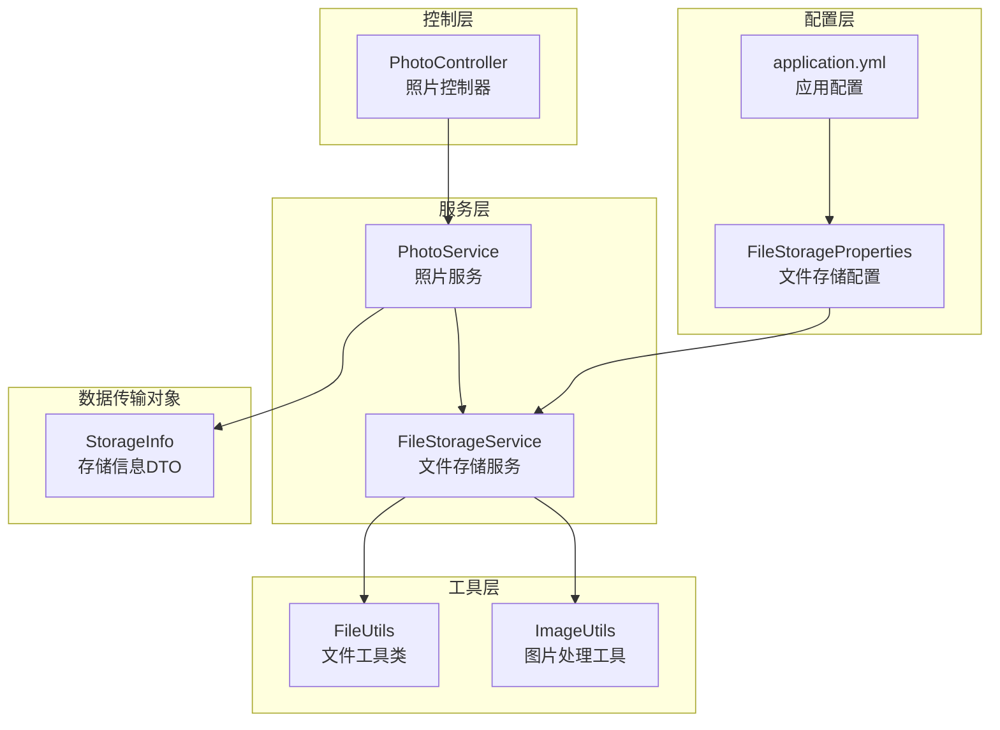
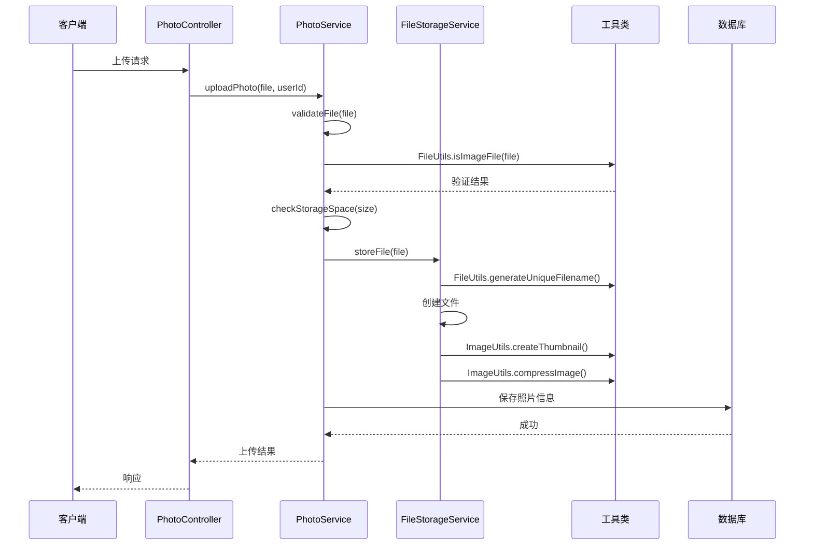
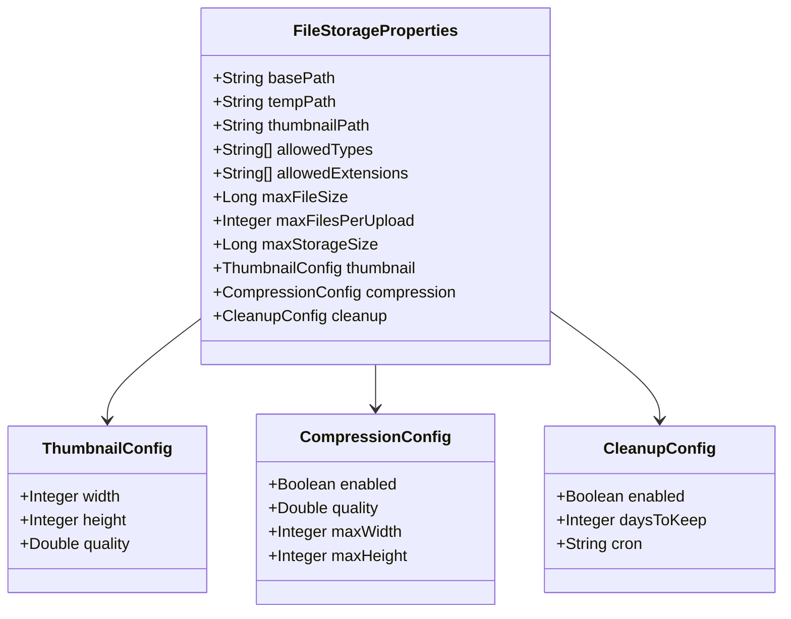
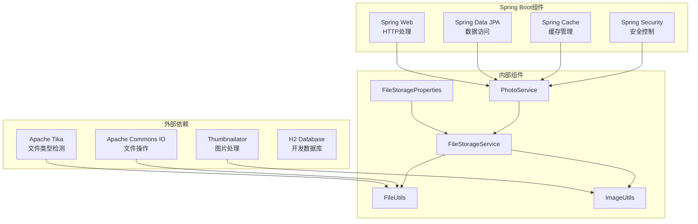
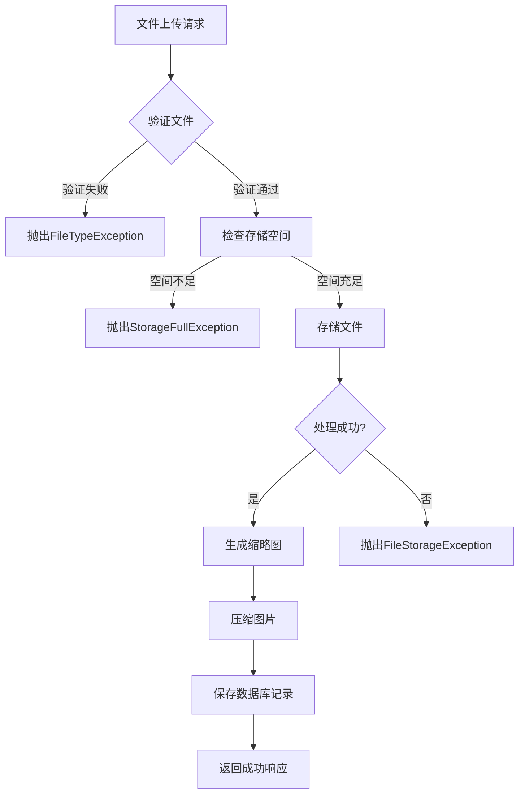

# 文件存储配置

<cite>
**本文档引用的文件**
- [FileStorageProperties.java](file://src/main/java/com/photo/config/FileStorageProperties.java)
- [application.yml](file://src/main/resources/application.yml)
- [FileStorageService.java](file://src/main/java/com/photo/service/FileStorageService.java)
- [FileUtils.java](file://src/main/java/com/photo/util/FileUtils.java)
- [ImageUtils.java](file://src/main/java/com/photo/util/ImageUtils.java)
- [PhotoService.java](file://src/main/java/com/photo/service/PhotoService.java)
- [PhotoController.java](file://src/main/java/com/photo/controller/PhotoController.java)
- [StorageInfo.java](file://src/main/java/com/photo/dto/StorageInfo.java)
- [FileStorageException.java](file://src/main/java/com/photo/exception/FileStorageException.java)
- [FileTypeException.java](file://src/main/java/com/photo/exception/FileTypeException.java)
- [StorageFullException.java](file://src/main/java/com/photo/exception/StorageFullException.java)
- [FileSizeException.java](file://src/main/java/com/photo/exception/FileSizeException.java)
- [application-test.yml](file://src/test/resources/application-test.yml)
- [pom.xml](file://pom.xml)
</cite>

## 目录
1. [简介](#简介)
2. [项目结构](#项目结构)
3. [核心组件](#核心组件)
4. [架构概览](#架构概览)
5. [详细组件分析](#详细组件分析)
6. [依赖关系分析](#依赖关系分析)
7. [性能考虑](#性能考虑)
8. [故障排除指南](#故障排除指南)
9. [结论](#结论)

## 简介

本文件存储配置文档详细介绍了基于Spring Boot构建的文件存储系统的配置参数和管理方法。该系统提供了完整的文件上传、存储、管理和清理功能，包括文件类型限制、大小限制、批量上传控制、缩略图生成、图片压缩等功能。文档涵盖了配置参数的详细说明、配置示例、性能优化建议和故障排除指南。

## 项目结构

文件存储系统采用标准的Spring Boot项目结构，主要包含以下模块：

**图表来源**
- [FileStorageProperties.java](file://src/main/java/com/photo/config/FileStorageProperties.java#L12-L93)
- [FileStorageService.java](file://src/main/java/com/photo/service/FileStorageService.java#L24-L54)
- [PhotoService.java](file://src/main/java/com/photo/service/PhotoService.java#L36-L45)

**章节来源**
- [FileStorageProperties.java](file://src/main/java/com/photo/config/FileStorageProperties.java#L1-L94)
- [application.yml](file://src/main/resources/application.yml#L69-L117)

## 核心组件

### 文件存储配置属性

文件存储配置通过`FileStorageProperties`类集中管理，包含以下核心配置项：

#### 基础存储配置
- **文件存储根目录**: `basePath` - 默认值为`./uploads`
- **临时文件目录**: `tempPath` - 默认值为`./uploads/temp`
- **缩略图目录**: `thumbnailPath` - 默认值为`./uploads/thumbnails`

#### 安全配置
- **允许的文件类型**: `allowedTypes` - 支持的MIME类型列表
- **允许的文件扩展名**: `allowedExtensions` - 支持的文件扩展名列表
- **最大文件大小**: `maxFileSize` - 默认10MB
- **最大单次上传文件数**: `maxFilesPerUpload` - 默认10个文件

#### 图像处理配置
- **缩略图配置**: 包含宽度、高度和质量参数
- **图片压缩配置**: 包含启用状态、质量、最大宽高参数

#### 存储管理配置
- **存储容量限制**: `maxStorageSize` - 默认10GB
- **定期清理配置**: 包含启用状态、保留天数、Cron表达式

**章节来源**
- [FileStorageProperties.java](file://src/main/java/com/photo/config/FileStorageProperties.java#L15-L93)
- [application.yml](file://src/main/resources/application.yml#L70-L117)

## 架构概览

文件存储系统采用分层架构设计，确保配置、业务逻辑和数据访问的分离：

**图表来源**
- [PhotoController.java](file://src/main/java/com/photo/controller/PhotoController.java#L50-L61)
- [PhotoService.java](file://src/main/java/com/photo/service/PhotoService.java#L51-L111)
- [FileStorageService.java](file://src/main/java/com/photo/service/FileStorageService.java#L59-L95)

## 详细组件分析

### 文件存储配置类

`FileStorageProperties`类定义了完整的文件存储配置结构：

**图表来源**
- [FileStorageProperties.java](file://src/main/java/com/photo/config/FileStorageProperties.java#L15-L93)

#### 配置参数详解

**基础存储目录配置**
- `basePath`: 主存储目录，用于存放原始文件
- `tempPath`: 临时文件目录，用于文件上传过程中的临时存储
- `thumbnailPath`: 缩略图目录，用于存储生成的缩略图

**安全限制配置**
- `allowedTypes`: 严格限制允许的文件MIME类型，当前支持JPEG、PNG、GIF、BMP、WebP格式
- `allowedExtensions`: 限制文件扩展名，与MIME类型保持一致
- `maxFileSize`: 单个文件最大大小限制，默认10MB
- `maxFilesPerUpload`: 单次批量上传的最大文件数量，默认10个

**图像处理配置**
- 缩略图尺寸: 200x200像素
- 缩略图质量: 80% JPEG质量
- 图片压缩: 启用状态、压缩质量85%、最大尺寸1920x1080

**存储管理配置**
- `maxStorageSize`: 整体存储容量上限，默认10GB
- `cleanup.enabled`: 启用定期清理功能
- `cleanup.daysToKeep`: 文件保留天数，默认30天
- `cleanup.cron`: 定时任务执行时间，默认每天凌晨2点

**章节来源**
- [FileStorageProperties.java](file://src/main/java/com/photo/config/FileStorageProperties.java#L17-L93)
- [application.yml](file://src/main/resources/application.yml#L79-L117)

### 文件存储服务

`FileStorageService`负责实际的文件存储操作：

#### 目录初始化
服务启动时自动创建必要的存储目录：
- 主存储目录
- 临时文件目录  
- 缩略图目录

#### 文件操作功能
- **文件存储**: 验证文件名安全性，生成唯一文件名，复制文件到存储目录
- **文件读取**: 支持完整文件读取和范围读取（断点续传）
- **文件删除**: 支持单个文件删除和批量删除
- **缩略图管理**: 创建、读取和删除缩略图
- **图片压缩**: 可选的图片压缩功能

#### 安全验证
- 文件名清理，防止路径遍历攻击
- 文件类型验证，使用Apache Tika进行MIME类型检测
- 文件大小验证，防止超大文件上传

**章节来源**
- [FileStorageService.java](file://src/main/java/com/photo/service/FileStorageService.java#L36-L54)
- [FileStorageService.java](file://src/main/java/com/photo/service/FileStorageService.java#L59-L95)

### 文件工具类

`FileUtils`提供文件相关的辅助功能：

#### 文件类型检测
- 使用Apache Tika进行准确的MIME类型检测
- 支持多种图片格式的识别
- 提供文件扩展名验证

#### 文件名处理
- 生成基于UUID的唯一文件名
- 清理文件名中的特殊字符
- 验证文件名的安全性

#### 文件信息处理
- 计算文件MD5值用于重复文件检测
- 格式化文件大小显示
- 支持文件MD5值计算

**章节来源**
- [FileUtils.java](file://src/main/java/com/photo/util/FileUtils.java#L21-L102)
- [FileUtils.java](file://src/main/java/com/photo/util/FileUtils.java#L107-L176)

### 图片处理工具

`ImageUtils`提供专业的图片处理功能：

#### 图片尺寸检测
- 支持从文件和MultipartFile读取图片信息
- 返回图片的宽度和高度
- 错误处理和异常管理

#### 缩略图生成
- 使用Thumbnailator库进行高质量缩略图生成
- 支持指定尺寸和质量参数
- 保持图片纵横比

#### 图片压缩
- 支持质量压缩和尺寸压缩
- 自动判断压缩策略
- 支持覆盖原文件的压缩方式

**章节来源**
- [ImageUtils.java](file://src/main/java/com/photo/util/ImageUtils.java#L21-L48)
- [ImageUtils.java](file://src/main/java/com/photo/util/ImageUtils.java#L53-L99)

### 照片服务

`PhotoService`是业务逻辑的核心实现：

#### 文件上传流程
1. **文件验证**: 检查文件类型、大小和有效性
2. **存储空间检查**: 确保有足够的存储空间
3. **文件去重**: 基于MD5值检测重复文件
4. **文件存储**: 将文件保存到存储目录
5. **缩略图生成**: 自动生成缩略图
6. **数据库记录**: 保存文件元数据到数据库

#### 批量上传处理
- 支持多文件同时上传
- 单次上传文件数量限制
- 错误处理和容错机制

#### 存储管理
- **存储空间监控**: 实时统计已用空间
- **定期清理**: 基于Cron表达式的定时清理任务
- **文件生命周期管理**: 支持软删除和硬删除

**章节来源**
- [PhotoService.java](file://src/main/java/com/photo/service/PhotoService.java#L51-L136)
- [PhotoService.java](file://src/main/java/com/photo/service/PhotoService.java#L276-L299)

### 存储信息管理

`StorageInfo` DTO用于存储和展示存储空间信息：

#### 存储统计信息
- **已使用空间**: 当前已使用的存储空间
- **总空间**: 存储容量上限
- **剩余空间**: 可用存储空间
- **使用百分比**: 存储空间使用率
- **文件总数**: 当前活跃文件数量

#### 数据格式化
- 提供字节级别的精确值
- 提供人类可读的格式化字符串
- 支持多种单位转换（B/KB/MB/GB）

**章节来源**
- [StorageInfo.java](file://src/main/java/com/photo/dto/StorageInfo.java#L15-L56)

## 依赖关系分析

文件存储系统的关键依赖关系如下：

**图表来源**
- [pom.xml](file://pom.xml#L30-L149)

### 关键依赖说明

**文件类型检测**
- Apache Tika用于准确的MIME类型检测
- 支持多种文件格式的识别
- 提供可靠的文件类型验证

**图片处理**
- Thumbnailator库提供高质量的图片处理功能
- 支持缩略图生成、压缩、旋转等操作
- 优化的内存使用和处理性能

**文件操作**
- Apache Commons IO简化文件操作
- 提供跨平台的文件处理能力
- 支持复杂的文件系统操作

**数据库集成**
- H2数据库用于开发和测试环境
- 支持MySQL等生产数据库
- 提供完整的数据持久化能力

**章节来源**
- [pom.xml](file://pom.xml#L21-L28)

## 性能考虑

### 存储性能优化

**目录结构优化**
- 使用分层目录结构避免单目录文件过多
- 缩略图和原图分离存储
- 临时文件及时清理

**并发处理**
- 使用异步处理减少请求等待时间
- 连接池配置优化数据库连接
- 缓存策略减少重复计算

**内存管理**
- 大文件采用流式处理避免内存溢出
- 图片压缩使用临时文件避免内存占用
- 及时释放文件句柄和资源

### 网络传输优化

**断点续传支持**
- Range请求处理支持断点续传
- 分块传输减少网络压力
- 恢复机制提高传输可靠性

**缓存策略**
- 缩略图长期缓存
- 图片元数据短期缓存
- CDN集成支持静态资源加速

### 存储容量管理

**智能清理策略**
- 基于时间的自动清理
- 存储空间阈值告警
- 清理任务的资源控制

**压缩优化**
- 智能压缩算法选择
- 质量与大小的平衡
- 批量处理提高效率

## 故障排除指南

### 常见配置问题

**存储目录权限问题**
- 确保存储目录具有写入权限
- 检查磁盘空间是否充足
- 验证目录路径的正确性

**文件类型验证失败**
- 检查MIME类型配置是否正确
- 确认文件扩展名在允许列表中
- 验证文件头部信息的有效性

**图片处理异常**
- 检查图片格式是否受支持
- 验证图片文件的完整性
- 确认内存和磁盘空间充足

### 异常处理机制

系统提供了完善的异常处理机制：

**图表来源**
- [PhotoService.java](file://src/main/java/com/photo/service/PhotoService.java#L304-L336)

### 错误类型说明

**文件类型错误**
- `FileTypeException`: 文件类型不被支持
- 触发场景: 非图片文件或不在允许列表中的文件

**文件大小错误**
- `FileSizeException`: 文件大小超出限制
- 触发场景: 单个文件超过maxFileSize限制

**存储空间错误**
- `StorageFullException`: 存储空间不足
- 触发场景: 总存储空间超过maxStorageSize限制

**文件存储错误**
- `FileStorageException`: 文件存储过程中的通用错误
- 触发场景: 文件复制、创建目录等操作失败

**章节来源**
- [FileStorageException.java](file://src/main/java/com/photo/exception/FileStorageException.java#L6-L15)
- [FileTypeException.java](file://src/main/java/com/photo/exception/FileTypeException.java#L6-L15)
- [StorageFullException.java](file://src/main/java/com/photo/exception/StorageFullException.java#L6-L15)
- [FileSizeException.java](file://src/main/java/com/photo/exception/FileSizeException.java#L6-L15)

### 调试和监控

**日志配置**
- 开发环境: DEBUG级别日志
- 生产环境: INFO级别日志
- 关键操作: 详细的调试信息

**监控指标**
- 存储空间使用率
- 文件上传成功率
- 图片处理性能指标
- 系统资源使用情况

**性能调优建议**
- 根据实际需求调整存储容量限制
- 优化图片压缩参数以平衡质量和性能
- 配置合适的缓存策略
- 监控系统资源使用情况

## 结论

文件存储配置系统提供了完整的文件管理解决方案，具有以下特点：

**配置灵活性**
- 支持详细的存储配置定制
- 灵活的文件类型和大小限制
- 可配置的图像处理参数

**安全性保障**
- 多层次的文件验证机制
- 防止路径遍历攻击
- 存储空间和文件数量限制

**性能优化**
- 高效的文件存储和检索
- 智能的缓存策略
- 支持断点续传和批量处理

**可维护性**
- 清晰的分层架构设计
- 完善的异常处理机制
- 详细的日志和监控支持

通过合理配置和使用，该系统能够满足大多数文件存储需求，为用户提供稳定可靠的服务。