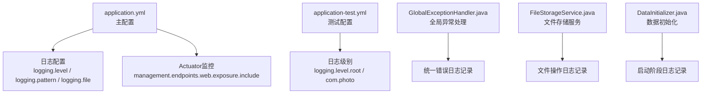
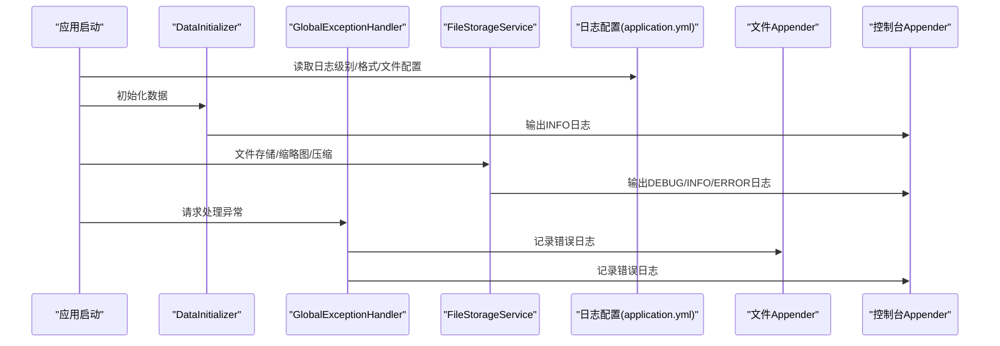
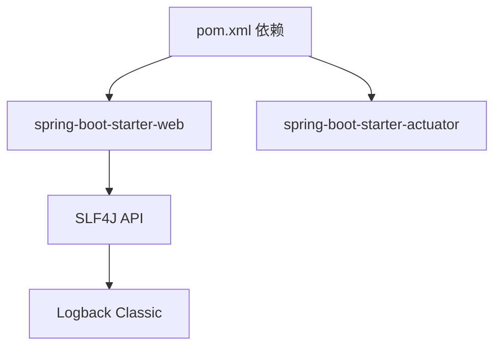

# 日志配置

<cite>
**本文引用的文件**
- [application.yml](file://src/main/resources/application.yml)
- [application-test.yml](file://src/test/resources/application-test.yml)
- [GlobalExceptionHandler.java](file://src/main/java/com/photo/exception/GlobalExceptionHandler.java)
- [FileStorageService.java](file://src/main/java/com/photo/service/FileStorageService.java)
- [DataInitializer.java](file://src/main/java/com/photo/config/DataInitializer.java)
- [pom.xml](file://pom.xml)
</cite>

## 目录
1. [简介](#简介)
2. [项目结构](#项目结构)
3. [核心组件](#核心组件)
4. [架构总览](#架构总览)
5. [详细组件分析](#详细组件分析)
6. [依赖关系分析](#依赖关系分析)
7. [性能考量](#性能考量)
8. [故障排查指南](#故障排查指南)
9. [结论](#结论)
10. [附录](#附录)

## 简介
本文件系统性梳理并解读该代码库中的日志配置与使用实践，覆盖以下方面：
- 日志级别设置（root、包级别）
- 日志输出格式配置（控制台与文件）
- 控制台与文件输出配置
- 日志文件管理（文件大小限制、保留天数）
- 日志轮转、性能影响分析与监控最佳实践
- 不同环境下的日志配置建议与故障诊断方法
- 运维人员日志分析与问题定位实用指南

## 项目结构
该工程采用 Spring Boot 标准结构，日志配置集中于主资源文件与测试资源文件中，并通过全局异常处理与业务服务中的日志记录形成完整的日志体系。

图表来源
- [application.yml](file://src/main/resources/application.yml#L146-L160)
- [application-test.yml](file://src/test/resources/application-test.yml#L71-L75)
- [GlobalExceptionHandler.java](file://src/main/java/com/photo/exception/GlobalExceptionHandler.java#L1-L139)
- [FileStorageService.java](file://src/main/java/com/photo/service/FileStorageService.java#L1-L200)
- [DataInitializer.java](file://src/main/java/com/photo/config/DataInitializer.java#L1-L57)

章节来源
- [application.yml](file://src/main/resources/application.yml#L146-L160)
- [application-test.yml](file://src/test/resources/application-test.yml#L71-L75)

## 核心组件
- 日志配置中心：位于主配置文件中，定义日志级别、输出格式与文件落盘策略。
- 全局异常处理：统一捕获异常并记录错误日志，确保异常信息可追踪。
- 业务服务日志：在文件存储、缩略图生成、压缩等关键路径记录关键事件与错误。
- 测试环境日志：测试配置中精简日志级别，便于快速定位测试问题。

章节来源
- [application.yml](file://src/main/resources/application.yml#L146-L160)
- [GlobalExceptionHandler.java](file://src/main/java/com/photo/exception/GlobalExceptionHandler.java#L1-L139)
- [FileStorageService.java](file://src/main/java/com/photo/service/FileStorageService.java#L1-L200)
- [DataInitializer.java](file://src/main/java/com/photo/config/DataInitializer.java#L1-L57)

## 架构总览
日志配置与使用贯穿应用生命周期，从启动初始化、业务处理到异常捕获，形成闭环。

图表来源
- [application.yml](file://src/main/resources/application.yml#L146-L160)
- [DataInitializer.java](file://src/main/java/com/photo/config/DataInitializer.java#L1-L57)
- [GlobalExceptionHandler.java](file://src/main/java/com/photo/exception/GlobalExceptionHandler.java#L1-L139)
- [FileStorageService.java](file://src/main/java/com/photo/service/FileStorageService.java#L1-L200)

## 详细组件分析

### 日志级别配置（root 与包级别）
- root 级别：主配置中设置为 INFO，确保生产环境只输出必要信息，避免冗余日志。
- 包级别：
  - com.photo：DEBUG，便于开发调试期间查看业务细节。
  - org.springframework.web：DEBUG，便于观察 Web 层请求处理链路。
  - org.hibernate：INFO，Hibernate SQL 与语句级别日志按需开启。

建议
- 开发环境可适度降低级别以提升可观测性；生产环境建议维持 INFO 或更高，避免敏感信息泄露。
- 对第三方包（如 Spring、Hibernate）建议仅在问题定位时临时降级，问题解决后恢复默认级别。

章节来源
- [application.yml](file://src/main/resources/application.yml#L148-L152)

### 日志输出格式配置（控制台与文件）
- 控制台格式：包含时间、线程、级别、Logger 名称与消息，便于终端阅读。
- 文件格式：与控制台格式一致，保证日志一致性，便于检索与分析。

建议
- 若需更丰富的上下文（如 TraceId），可在格式中加入占位符并在网关或过滤器中注入。
- 生产环境建议统一格式，便于日志采集与分析平台解析。

章节来源
- [application.yml](file://src/main/resources/application.yml#L153-L155)

### 控制台与文件输出配置
- 文件落盘：日志文件名为 photo-upload-system.log，位于 ./logs 目录。
- 文件大小限制：max-size 为 10MB。
- 保留天数：max-history 为 30 天。

注意
- 该配置属于 Spring Boot 默认日志实现（基于 Logback 的自动配置）。
- 若需自定义 Logback 配置文件，请在 resources 下新增 logback-spring.xml 并通过 spring.config.import 指定。

章节来源
- [application.yml](file://src/main/resources/application.yml#L156-L159)

### 日志文件管理（大小限制与保留策略）
- 文件大小限制：当单个日志文件达到 10MB 时触发轮转。
- 保留策略：保留最近 30 天的日志文件，超出则删除旧文件。
- 轮转机制：由 Spring Boot 自动配置的 RollingFileAppender 实现。

建议
- 结合磁盘空间与合规要求调整 max-size 与 max-history。
- 对高并发场景，建议启用异步日志（例如使用 logback-access 或引入异步 appender）以降低 I/O 压力。

章节来源
- [application.yml](file://src/main/resources/application.yml#L156-L159)

### 日志使用实践（全局异常处理与业务服务）
- 全局异常处理：对各类业务异常进行统一捕获并记录错误日志，同时返回标准化响应。
- 业务服务日志：
  - 初始化：记录目录创建成功与失败信息。
  - 文件存储：记录存储成功、失败与空文件等关键事件。
  - 缩略图与压缩：记录创建与压缩成功/失败信息。
  - 删除：记录删除成功与失败信息。

建议
- 在关键业务路径增加 DEBUG 级别的细粒度日志，便于问题定位。
- 错误日志应包含必要的上下文信息（如文件名、用户 ID、请求 ID 等），但避免记录敏感数据。

章节来源
- [GlobalExceptionHandler.java](file://src/main/java/com/photo/exception/GlobalExceptionHandler.java#L1-L139)
- [FileStorageService.java](file://src/main/java/com/photo/service/FileStorageService.java#L1-L200)
- [DataInitializer.java](file://src/main/java/com/photo/config/DataInitializer.java#L1-L57)

### 测试环境日志配置
- 测试配置中仅设置 root 与 com.photo 的日志级别，便于快速定位测试问题。
- 建议在 CI/CD 中使用测试配置，避免污染生产日志。

章节来源
- [application-test.yml](file://src/test/resources/application-test.yml#L71-L75)

## 依赖关系分析
- Spring Boot Starter Web 默认引入日志依赖（SLF4J + Logback），无需额外配置即可使用。
- Actuator 暴露健康与指标端点，便于结合日志进行系统健康监控。

图表来源
- [pom.xml](file://pom.xml#L30-L66)
- [pom.xml](file://pom.xml#L144-L149)

章节来源
- [pom.xml](file://pom.xml#L30-L66)
- [pom.xml](file://pom.xml#L144-L149)

## 性能考量
- I/O 压力：大量日志写入会带来磁盘 I/O 压力，建议：
  - 合理设置 max-size 与 max-history，避免频繁轮转。
  - 在高并发场景考虑异步日志（如引入异步 appender）。
- 级别选择：生产环境尽量使用 INFO 或更高级别，减少 DEBUG/TRACE 日志量。
- 格式开销：复杂格式会增加序列化成本，建议保持简洁格式。
- 监控与告警：结合 Actuator 指标与日志聚合平台，建立健康监控与异常告警。

## 故障排查指南
常见问题与定位步骤
- 日志未输出到文件
  - 检查 logging.file.name 是否可写，目录是否存在。
  - 确认日志级别未被全局抑制。
- 日志过大导致磁盘占用过高
  - 调整 logging.file.max-size 与 logging.file.max-history。
  - 启用异步日志与合理的批处理策略。
- 异常信息缺失
  - 确保全局异常处理器正确捕获并记录异常堆栈。
  - 在业务关键路径补充日志，包含上下文信息。
- 测试环境日志过多
  - 使用测试配置文件，降低日志级别或关闭非必要模块日志。

章节来源
- [GlobalExceptionHandler.java](file://src/main/java/com/photo/exception/GlobalExceptionHandler.java#L1-L139)
- [application.yml](file://src/main/resources/application.yml#L146-L160)
- [application-test.yml](file://src/test/resources/application-test.yml#L71-L75)

## 结论
该工程的日志配置遵循“生产环境保守、开发环境开放”的原则，通过统一的级别、格式与文件落盘策略，配合全局异常处理与业务服务日志，形成了清晰、可追溯的日志体系。建议在高并发与合规要求较高的环境中进一步优化轮转策略与异步写入，以获得更好的性能与可维护性。

## 附录

### 不同环境下的日志配置建议
- 开发环境
  - 将 com.photo 与 org.springframework.web 级别设为 DEBUG，便于调试。
  - 保留较长时间的历史日志（max-history 提升至 60 天）。
- 测试环境
  - 使用 application-test.yml，root 与 com.photo 设为 DEBUG，快速定位问题。
- 生产环境
  - root 级别设为 INFO，第三方包按需开启 TRACE/DEBUG。
  - 合理设置 max-size 与 max-history，避免磁盘压力过大。
  - 建议启用异步日志与日志聚合平台，统一收集与分析。

### 日志监控最佳实践
- 使用统一格式与结构化字段，便于日志平台解析。
- 结合 Actuator 指标与日志进行关联分析，建立健康监控与告警。
- 对高频错误与异常建立阈值告警，缩短故障定位时间。