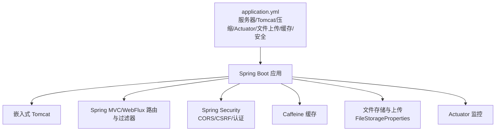
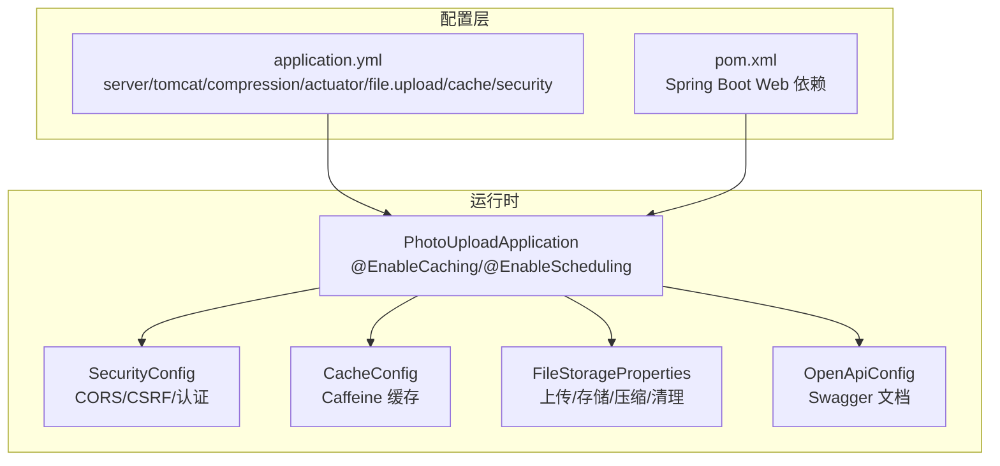
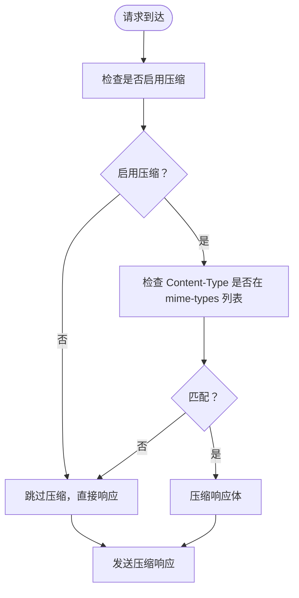
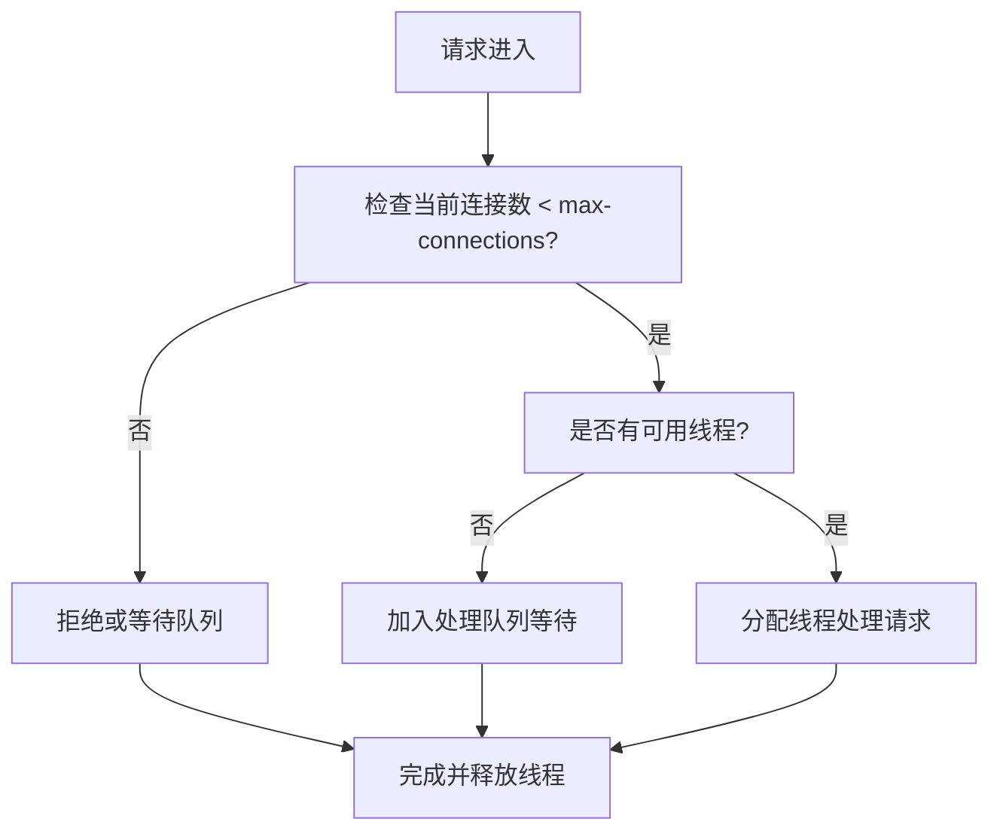
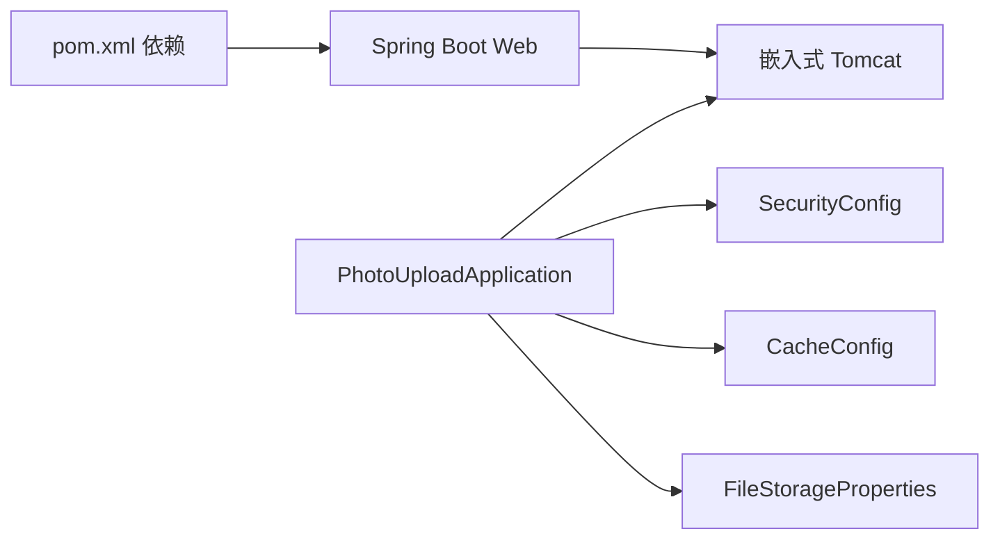

# 服务器配置

<cite>
**本文引用的文件**
- [application.yml](file://src/main/resources/application.yml)
- [pom.xml](file://pom.xml)
- [PhotoUploadApplication.java](file://src/main/java/com/photo/PhotoUploadApplication.java)
- [SecurityConfig.java](file://src/main/java/com/photo/config/SecurityConfig.java)
- [SecurityProperties.java](file://src/main/java/com/photo/config/SecurityProperties.java)
- [FileStorageProperties.java](file://src/main/java/com/photo/config/FileStorageProperties.java)
- [CacheConfig.java](file://src/main/java/com/photo/config/CacheConfig.java)
- [OpenApiConfig.java](file://src/main/java/com/photo/config/OpenApiConfig.java)
- [README.md](file://README.md)
- [PROJECT_SUMMARY.md](file://PROJECT_SUMMARY.md)
</cite>

## 目录
1. [简介](#简介)
2. [项目结构](#项目结构)
3. [核心组件](#核心组件)
4. [架构总览](#架构总览)
5. [详细组件分析](#详细组件分析)
6. [依赖关系分析](#依赖关系分析)
7. [性能考虑](#性能考虑)
8. [故障排除指南](#故障排除指南)
9. [结论](#结论)
10. [附录](#附录)

## 简介
本文件聚焦于服务器配置与性能优化，围绕以下目标展开：
- 详解 Tomcat 服务器配置参数（端口、HTTP 压缩、连接器线程池）
- 说明 MIME 类型与压缩策略的配置方式与影响
- 解释连接器参数（最大连接数、线程池上限/最小空闲线程）对系统性能的影响
- 提供性能调优建议、并发处理能力分析与资源监控方案
- 给出不同负载场景下的优化方案与常见问题排查指引

本项目基于 Spring Boot，默认使用嵌入式 Tomcat，服务器配置集中在 YAML 配置文件中，同时结合安全、缓存、文件存储等模块共同影响整体性能表现。

## 项目结构
与服务器配置直接相关的文件与职责概览：
- application.yml：集中定义服务器端口、HTTP 压缩、Tomcat 连接器、Actuator 监控、文件上传、缓存、安全等配置
- pom.xml：声明 Spring Boot Web 与相关依赖，间接决定服务器运行时行为
- PhotoUploadApplication.java：应用入口，启用缓存与调度
- SecurityConfig/SecurityProperties：安全与 CORS 配置，间接影响请求处理开销
- FileStorageProperties：文件上传大小、存储路径、压缩参数等，影响 I/O 与 CPU 使用
- CacheConfig：Caffeine 缓存配置，降低数据库与重复计算压力
- OpenApiConfig：API 文档配置，便于定位与调试接口
- README.md / PROJECT_SUMMARY.md：补充说明与特性亮点，有助于理解性能与安全策略

图表来源
- [application.yml](file://src/main/resources/application.yml#L161-L189)
- [pom.xml](file://pom.xml#L30-L65)
- [PhotoUploadApplication.java](file://src/main/java/com/photo/PhotoUploadApplication.java#L11-L18)

章节来源
- [application.yml](file://src/main/resources/application.yml#L161-L189)
- [pom.xml](file://pom.xml#L30-L65)
- [PhotoUploadApplication.java](file://src/main/java/com/photo/PhotoUploadApplication.java#L11-L18)

## 核心组件
本节梳理与服务器配置密切相关的配置项及其作用范围。

- 服务器端口与压缩
  - 端口：server.port
  - HTTP 压缩：server.compression.enabled 与 server.compression.mime-types
  - 影响：开启压缩可显著降低静态资源传输体积，但会增加 CPU 开销；MIME 类型列表决定哪些响应会被压缩

- Tomcat 连接器与线程池
  - 最大连接数：server.tomcat.max-connections
  - 线程池：server.tomcat.threads.max 与 server.tomcat.threads.min-spare
  - 影响：连接数上限决定并发接入能力；线程池大小决定并发处理能力；min-spare 决定空闲线程数量，影响冷启动响应

- Actuator 监控
  - management.endpoints.web.exposure.include 与 endpoint.health.show-details
  - 影响：暴露健康、指标端点，便于运行时观测

- 文件上传与存储
  - servlet.multipart.*：最大文件大小、请求大小、阈值
  - file.storage.*：存储根路径、允许类型、最大文件数、压缩参数、清理策略
  - 影响：I/O 峰值、CPU 压力、磁盘占用与清理成本

- 缓存
  - spring.cache.type 与 spring.cache.caffeine.spec
  - 影响：减少数据库与重复计算开销，提升热点数据访问速度

- 安全与 CORS
  - security.cors.* 与 security.referer.*
  - 影响：跨域与防盗链策略会影响请求处理链路与开销

章节来源
- [application.yml](file://src/main/resources/application.yml#L161-L189)
- [application.yml](file://src/main/resources/application.yml#L42-L49)
- [application.yml](file://src/main/resources/application.yml#L69-L117)
- [application.yml](file://src/main/resources/application.yml#L50-L55)
- [SecurityConfig.java](file://src/main/java/com/photo/config/SecurityConfig.java#L78-L92)
- [SecurityProperties.java](file://src/main/java/com/photo/config/SecurityProperties.java#L44-L51)

## 架构总览
下图展示服务器配置在系统中的位置与相互关系。

图表来源
- [application.yml](file://src/main/resources/application.yml#L161-L189)
- [pom.xml](file://pom.xml#L30-L65)
- [PhotoUploadApplication.java](file://src/main/java/com/photo/PhotoUploadApplication.java#L11-L18)
- [SecurityConfig.java](file://src/main/java/com/photo/config/SecurityConfig.java#L36-L58)
- [CacheConfig.java](file://src/main/java/com/photo/config/CacheConfig.java#L22-L30)
- [FileStorageProperties.java](file://src/main/java/com/photo/config/FileStorageProperties.java#L14-L15)
- [OpenApiConfig.java](file://src/main/java/com/photo/config/OpenApiConfig.java#L23-L31)

## 详细组件分析

### 服务器端口与 HTTP 压缩配置
- 端口配置
  - 通过 server.port 设置监听端口，缺省 8080
  - 影响：端口冲突、容器绑定、反向代理转发
- HTTP 压缩
  - server.compression.enabled 控制是否启用压缩
  - server.compression.mime-types 指定压缩的 MIME 类型集合
  - 影响：对静态资源（HTML/CSS/JS/JSON/XML/SVG）有效，减少带宽，增加 CPU；对二进制资源（图片）通常不压缩

图表来源
- [application.yml](file://src/main/resources/application.yml#L161-L167)

章节来源
- [application.yml](file://src/main/resources/application.yml#L161-L167)

### Tomcat 连接器与线程池配置
- 最大连接数：server.tomcat.max-connections
  - 影响：决定同时可接受的连接上限，超过将被拒绝或排队
- 线程池
  - server.tomcat.threads.max：最大工作线程数，决定并发处理能力
  - server.tomcat.threads.min-spare：最小空闲线程，影响冷启动响应
- 影响：线程池过大导致上下文切换与内存占用上升；过小导致排队与超时

图表来源
- [application.yml](file://src/main/resources/application.yml#L167-L172)

章节来源
- [application.yml](file://src/main/resources/application.yml#L167-L172)

### Actuator 监控与指标暴露
- management.endpoints.web.exposure.include 暴露 health、info、metrics 等端点
- endpoint.health.show-details 控制健康检查细节可见性
- 影响：便于运行时观察系统状态、资源使用与健康状况

章节来源
- [application.yml](file://src/main/resources/application.yml#L173-L182)

### 文件上传与存储配置
- servlet.multipart.*
  - max-file-size：单文件最大大小
  - max-request-size：请求整体最大大小
  - file-size-threshold：写入磁盘阈值
- file.storage.*
  - base-path/temp-path/thumbnail-path：存储路径
  - allowed-types/allowed-extensions：允许的文件类型/扩展名
  - max-file-size/max-files-per-upload：单次上传最大文件数
  - compression.*：压缩开关、质量、最大宽高
  - max-storage-size/cleanup.*：存储上限与清理策略
- 影响：I/O 峰值、CPU 压力、磁盘占用与清理成本

章节来源
- [application.yml](file://src/main/resources/application.yml#L42-L49)
- [application.yml](file://src/main/resources/application.yml#L69-L117)
- [FileStorageProperties.java](file://src/main/java/com/photo/config/FileStorageProperties.java#L14-L15)

### 缓存配置
- spring.cache.type 与 spring.cache.caffeine.spec
- CacheConfig 中进一步细分为不同缓存策略（如照片信息、文件元数据）
- 影响：降低数据库与重复计算压力，提升热点数据访问速度

章节来源
- [application.yml](file://src/main/resources/application.yml#L50-L55)
- [CacheConfig.java](file://src/main/java/com/photo/config/CacheConfig.java#L22-L30)

### 安全与 CORS 配置
- security.cors.* 与 security.referer.* 通过 SecurityProperties 注入
- 影响：跨域与防盗链策略会影响请求处理链路与开销

章节来源
- [SecurityConfig.java](file://src/main/java/com/photo/config/SecurityConfig.java#L78-L92)
- [SecurityProperties.java](file://src/main/java/com/photo/config/SecurityProperties.java#L44-L51)

## 依赖关系分析
- Spring Boot Web 依赖决定嵌入式服务器（Tomcat）的可用配置项
- 应用入口启用缓存与调度，使缓存配置生效
- 安全配置影响请求处理链路长度与开销
- 文件存储配置直接影响 I/O 与 CPU 使用

图表来源
- [pom.xml](file://pom.xml#L30-L65)
- [PhotoUploadApplication.java](file://src/main/java/com/photo/PhotoUploadApplication.java#L11-L18)
- [SecurityConfig.java](file://src/main/java/com/photo/config/SecurityConfig.java#L36-L58)
- [CacheConfig.java](file://src/main/java/com/photo/config/CacheConfig.java#L22-L30)
- [FileStorageProperties.java](file://src/main/java/com/photo/config/FileStorageProperties.java#L14-L15)

章节来源
- [pom.xml](file://pom.xml#L30-L65)
- [PhotoUploadApplication.java](file://src/main/java/com/photo/PhotoUploadApplication.java#L11-L18)

## 性能考虑
- 压缩策略
  - 仅对文本/JSON/XML/SVG 等资源启用压缩，避免对图片等二进制资源重复压缩
  - 合理设置 MIME 类型列表，减少不必要的压缩判断
- 连接器与线程池
  - 根据 CPU 核数与内存设定 threads.max，避免过度并发导致上下文切换与 GC 压力
  - 设置合理的 min-spare，平衡冷启动与资源占用
  - max-connections 与线程池协同，避免连接堆积导致队列过长
- 缓存
  - 合理设置缓存容量与过期策略，避免缓存击穿与内存溢出
  - 对热点数据进行缓存，减少数据库与重复计算
- 文件上传与存储
  - 控制单文件与请求大小，避免内存峰值过高
  - 使用磁盘阈值与异步处理，降低内存压力
  - 启用图片压缩与缩略图，降低带宽与存储成本
- 监控
  - 暴露 Actuator 指标端点，持续观察 CPU、内存、线程池、HTTP 请求指标
  - 结合日志级别与文件滚动策略，平衡可观测性与性能

[本节为通用性能指导，不直接分析具体文件]

## 故障排除指南
- 端口冲突
  - 现象：启动失败或端口占用
  - 处理：修改 server.port 或释放占用端口
- 压缩导致 CPU 占用过高
  - 现象：CPU 使用率飙升
  - 处理：关闭压缩或缩小 MIME 类型列表；评估是否需要压缩
- 连接数过多导致拒绝
  - 现象：大量连接被拒绝或超时
  - 处理：增大 server.tomcat.max-connections 与 threads.max；优化上游限流与连接复用
- 线程池耗尽
  - 现象：请求排队过长、超时
  - 处理：增加 threads.max；检查慢请求与阻塞操作
- 文件上传失败
  - 现象：上传报错或内存溢出
  - 处理：调整 servlet.multipart.* 与 file.storage.* 参数；启用磁盘阈值与分块上传
- 缓存命中率低
  - 现象：缓存未命中频繁
  - 处理：调整缓存容量与过期策略；识别热点数据
- Actuator 不可用
  - 现象：无法访问健康/指标端点
  - 处理：确认 management.endpoints.web.exposure.include 配置

章节来源
- [application.yml](file://src/main/resources/application.yml#L161-L189)
- [application.yml](file://src/main/resources/application.yml#L42-L49)
- [application.yml](file://src/main/resources/application.yml#L69-L117)
- [application.yml](file://src/main/resources/application.yml#L50-L55)

## 结论
本项目的服务器配置以 YAML 为中心，结合嵌入式 Tomcat 的连接器与线程池参数、HTTP 压缩策略、文件上传与存储参数、缓存与安全配置，形成一套可观察、可调优的运行时体系。通过合理设置连接上限与线程池规模、按需启用压缩、优化文件上传与存储策略，并配合 Actuator 监控，可在不同负载场景下获得稳定的吞吐与响应表现。

[本节为总结性内容，不直接分析具体文件]

## 附录

### 不同负载场景下的优化建议
- 低负载（开发/测试）
  - 关闭压缩或仅对必要 MIME 类型启用
  - threads.max 适度下调，min-spare 保持较小
  - 缓存容量适中，过期时间可短
- 中等负载（单机多实例）
  - 启用压缩，限定 MIME 类型
  - threads.max 与 max-connections 适度提升
  - 启用文件上传阈值与异步处理
  - 启用缓存并优化命中率
- 高负载（生产/集群）
  - 启用压缩并监控 CPU
  - 提升 threads.max 与 max-connections，结合上游限流
  - 使用对象存储替代本地存储，降低磁盘 I/O
  - 启用分布式缓存与数据库连接池优化

[本节为通用建议，不直接分析具体文件]