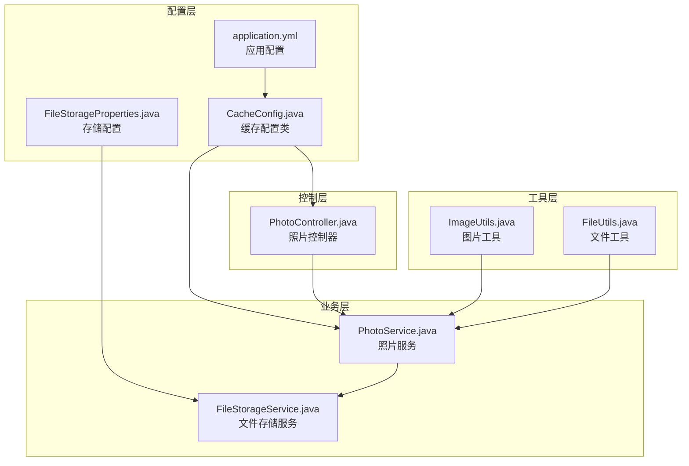
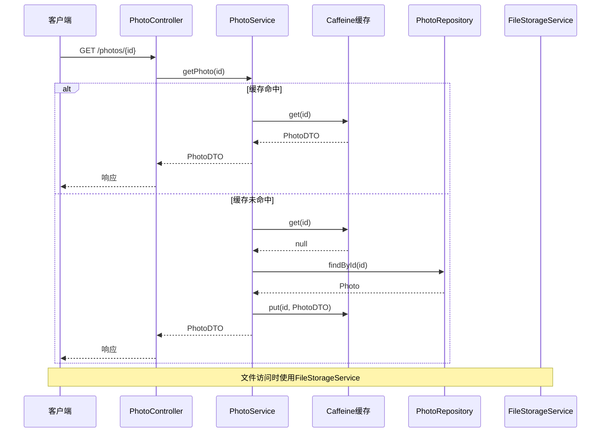
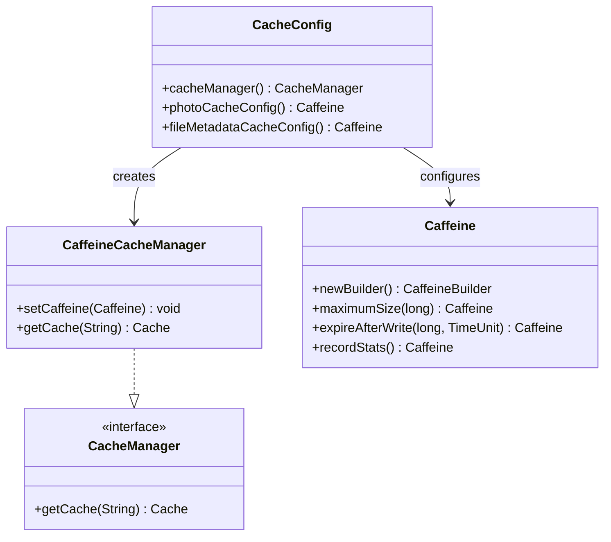
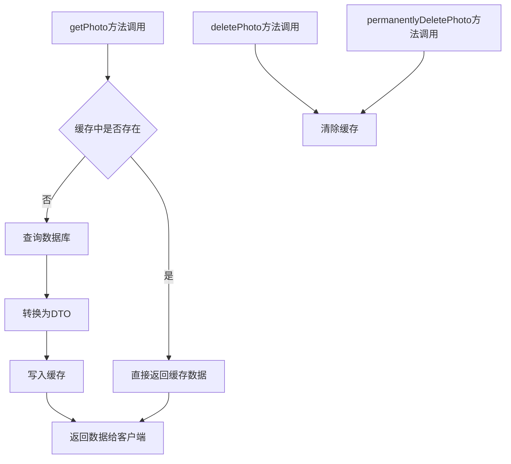
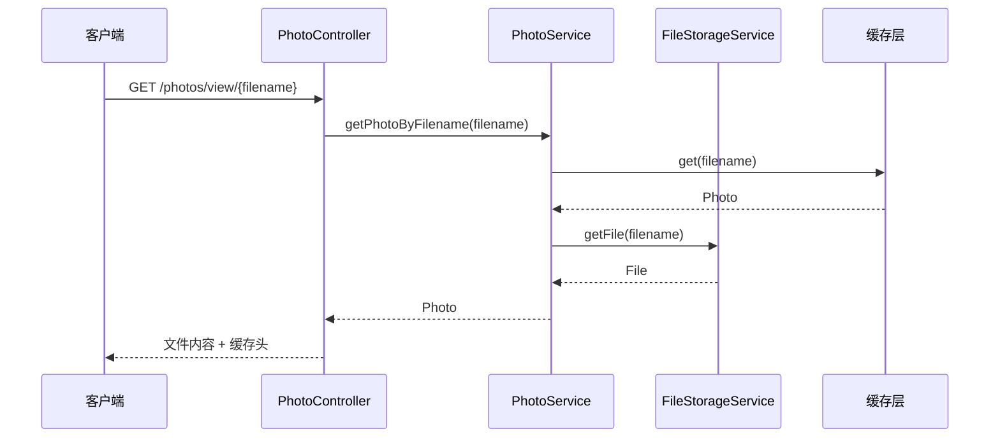
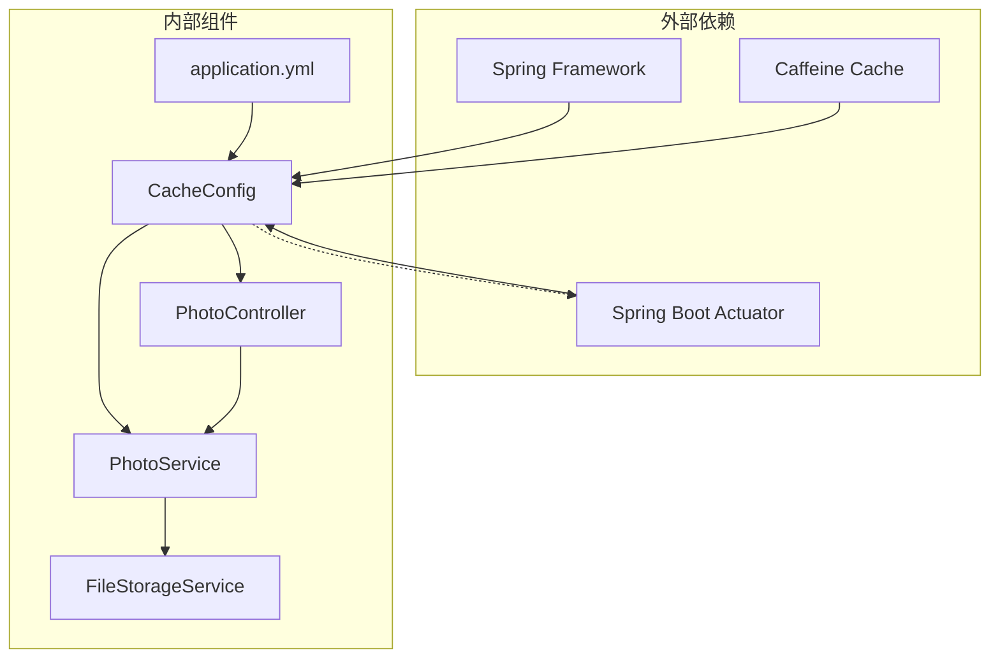

# 缓存配置

<cite>
**本文档引用的文件**
- [CacheConfig.java](file://src/main/java/com/photo/config/CacheConfig.java)
- [application.yml](file://src/main/resources/application.yml)
- [PhotoService.java](file://src/main/java/com/photo/service/PhotoService.java)
- [PhotoController.java](file://src/main/java/com/photo/controller/PhotoController.java)
- [FileStorageService.java](file://src/main/java/com/photo/service/FileStorageService.java)
- [FileStorageProperties.java](file://src/main/java/com/photo/config/FileStorageProperties.java)
- [ImageUtils.java](file://src/main/java/com/photo/util/ImageUtils.java)
- [FileUtils.java](file://src/main/java/com/photo/util/FileUtils.java)
</cite>

## 目录
1. [简介](#简介)
2. [项目结构](#项目结构)
3. [核心组件](#核心组件)
4. [架构概览](#架构概览)
5. [详细组件分析](#详细组件分析)
6. [依赖关系分析](#依赖关系分析)
7. [性能考虑](#性能考虑)
8. [故障排除指南](#故障排除指南)
9. [结论](#结论)

## 简介

本文档详细介绍了Caffeine缓存框架在照片上传下载系统中的配置和使用。该系统采用Spring Cache注解与Caffeine本地缓存相结合的方式，实现了高效的缓存管理机制。文档涵盖了缓存类型选择、缓存规格配置、缓存应用场景、性能优化效果、最佳实践、性能调优建议以及监控方法。

## 项目结构

照片上传下载系统采用标准的Spring Boot项目结构，缓存配置主要集中在以下关键文件中：



**图表来源**
- [CacheConfig.java](file://src/main/java/com/photo/config/CacheConfig.java#L1-L54)
- [application.yml](file://src/main/resources/application.yml#L50-L55)
- [PhotoService.java](file://src/main/java/com/photo/service/PhotoService.java#L1-L385)

**章节来源**
- [CacheConfig.java](file://src/main/java/com/photo/config/CacheConfig.java#L1-L54)
- [application.yml](file://src/main/resources/application.yml#L50-L55)

## 核心组件

### 缓存配置类

系统的核心缓存配置由`CacheConfig.java`文件实现，该类提供了多种缓存配置策略：

#### 主缓存管理器配置
- **缓存类型**: Caffeine本地缓存
- **最大容量**: 1000条记录
- **过期时间**: 60分钟（expireAfterWrite）
- **统计记录**: 启用缓存统计功能

#### 专用缓存配置

**照片信息缓存** (`photoCacheConfig`)
- **最大容量**: 500条记录
- **过期时间**: 30分钟
- **适用场景**: 照片元数据缓存

**文件元数据缓存** (`fileMetadataCacheConfig`)
- **最大容量**: 1000条记录
- **过期时间**: 60分钟
- **适用场景**: 文件元数据缓存

### 应用配置

在`application.yml`中配置了全局缓存设置：
- **缓存类型**: caffeine
- **缓存规范**: maximumSize=1000,expireAfterWrite=3600s

**章节来源**
- [CacheConfig.java](file://src/main/java/com/photo/config/CacheConfig.java#L15-L53)
- [application.yml](file://src/main/resources/application.yml#L50-L55)

## 架构概览

系统采用分层架构，缓存层位于业务层和数据访问层之间，提供透明的缓存功能：



**图表来源**
- [PhotoController.java](file://src/main/java/com/photo/controller/PhotoController.java#L230-L237)
- [PhotoService.java](file://src/main/java/com/photo/service/PhotoService.java#L141-L151)
- [CacheConfig.java](file://src/main/java/com/photo/config/CacheConfig.java#L22-L30)

## 详细组件分析

### 缓存配置类分析

#### 类结构图



**图表来源**
- [CacheConfig.java](file://src/main/java/com/photo/config/CacheConfig.java#L15-L53)

#### 缓存配置策略

系统实现了多层次的缓存策略：

1. **全局缓存管理器**: 提供基础的缓存管理功能
2. **专用缓存配置**: 针对不同业务场景的定制化配置
3. **统计监控**: 启用缓存统计功能，便于性能分析

**章节来源**
- [CacheConfig.java](file://src/main/java/com/photo/config/CacheConfig.java#L15-L53)

### 业务层缓存应用

#### 照片信息服务中的缓存使用



**图表来源**
- [PhotoService.java](file://src/main/java/com/photo/service/PhotoService.java#L141-L151)
- [PhotoService.java](file://src/main/java/com/photo/service/PhotoService.java#L193-L205)

#### 缓存注解使用

系统在`PhotoService`中使用了Spring Cache注解：

- **@Cacheable**: 用于缓存照片信息查询结果
- **@CacheEvict**: 用于在数据变更时清除缓存

**章节来源**
- [PhotoService.java](file://src/main/java/com/photo/service/PhotoService.java#L12-L14)
- [PhotoService.java](file://src/main/java/com/photo/service/PhotoService.java#L141-L151)
- [PhotoService.java](file://src/main/java/com/photo/service/PhotoService.java#L193-L205)

### 控制层缓存集成

#### 文件访问中的缓存策略



**图表来源**
- [PhotoController.java](file://src/main/java/com/photo/controller/PhotoController.java#L84-L117)
- [PhotoService.java](file://src/main/java/com/photo/service/PhotoService.java#L155-L160)

**章节来源**
- [PhotoController.java](file://src/main/java/com/photo/controller/PhotoController.java#L84-L117)
- [PhotoService.java](file://src/main/java/com/photo/service/PhotoService.java#L155-L160)

## 依赖关系分析

### 缓存配置依赖图



**图表来源**
- [CacheConfig.java](file://src/main/java/com/photo/config/CacheConfig.java#L3-L8)
- [application.yml](file://src/main/resources/application.yml#L174-L182)

### 缓存配置依赖关系

系统中各组件之间的缓存相关依赖关系：

1. **配置层依赖**: CacheConfig依赖Spring Framework和Caffeine库
2. **业务层依赖**: PhotoService依赖缓存配置和FileStorageService
3. **控制层依赖**: PhotoController依赖PhotoService
4. **监控依赖**: Actuator提供缓存监控功能

**章节来源**
- [CacheConfig.java](file://src/main/java/com/photo/config/CacheConfig.java#L3-L8)
- [application.yml](file://src/main/resources/application.yml#L174-L182)

## 性能考虑

### 缓存参数优化

#### 缓存规格配置分析

| 缓存类型 | 最大容量 | 过期时间 | 适用场景 |
|---------|---------|---------|---------|
| 全局缓存 | 1000条 | 60分钟 | 通用数据缓存 |
| 照片信息缓存 | 500条 | 30分钟 | 照片元数据缓存 |
| 文件元数据缓存 | 1000条 | 60分钟 | 文件元数据缓存 |

#### 性能优化建议

1. **缓存命中率优化**
   - 合理设置缓存过期时间，避免频繁的数据失效
   - 使用合适的缓存容量，平衡内存使用和性能

2. **内存管理**
   - 监控缓存内存使用情况
   - 定期清理过期数据
   - 避免缓存大量大对象

3. **并发性能**
   - 利用Caffeine的高性能特性
   - 避免在缓存操作中执行阻塞操作

### 缓存监控

#### Actuator监控配置

系统配置了Spring Boot Actuator来监控缓存性能：

```yaml
management:
  endpoints:
    web:
      exposure:
        include: health,info,metrics
  endpoint:
    health:
      show-details: when-authorized
```

#### 缓存统计指标

启用`recordStats()`后，可以获取以下统计信息：
- 命中率
- 请求总数
- 命中数量
- 插入数量
- 失效数量

**章节来源**
- [CacheConfig.java](file://src/main/java/com/photo/config/CacheConfig.java#L25-L28)
- [application.yml](file://src/main/resources/application.yml#L174-L182)

## 故障排除指南

### 常见缓存问题

#### 缓存未生效

**症状**: 缓存注解不起作用
**可能原因**:
1. `@EnableCaching`注解未启用
2. 缓存管理器配置错误
3. 方法不是public修饰

**解决方案**:
1. 确认`@EnableCaching`注解已添加
2. 检查缓存管理器Bean配置
3. 确保被缓存的方法为public

#### 缓存数据过期

**症状**: 缓存数据过期导致性能下降
**可能原因**:
1. 过期时间设置过短
2. 缓存容量不足
3. 缓存键设计不合理

**解决方案**:
1. 调整过期时间配置
2. 增加缓存容量
3. 优化缓存键设计

#### 内存泄漏

**症状**: 应用内存持续增长
**可能原因**:
1. 缓存数据未及时清理
2. 缓存键过多
3. 缓存对象过大

**解决方案**:
1. 设置合理的过期时间
2. 监控缓存使用情况
3. 优化缓存对象大小

### 缓存调试技巧

1. **启用缓存日志**: 在`application.yml`中调整日志级别
2. **使用Actuator监控**: 通过`/actuator/metrics`查看缓存指标
3. **缓存统计分析**: 分析命中率和性能指标

**章节来源**
- [application.yml](file://src/main/resources/application.yml#L147-L159)
- [application.yml](file://src/main/resources/application.yml#L174-L182)

## 结论

该照片上传下载系统通过合理配置Caffeine缓存，在保证数据一致性的同时显著提升了系统性能。系统采用了多层次的缓存策略，包括全局缓存管理器和专用缓存配置，能够满足不同业务场景的需求。

### 主要优势

1. **高性能**: Caffeine作为高性能本地缓存，提供了优秀的性能表现
2. **易用性**: Spring Cache注解简化了缓存的使用
3. **可监控**: 完善的监控机制便于性能分析和问题排查
4. **灵活性**: 支持多种缓存配置策略，适应不同业务需求

### 最佳实践建议

1. **合理设置缓存参数**: 根据业务特点调整缓存容量和过期时间
2. **监控缓存性能**: 定期检查缓存命中率和内存使用情况
3. **优化缓存键设计**: 使用有意义的缓存键提高缓存效率
4. **及时清理过期数据**: 避免缓存数据堆积影响性能

通过以上配置和优化，系统能够在高并发场景下保持稳定的性能表现，为用户提供流畅的照片上传下载体验。