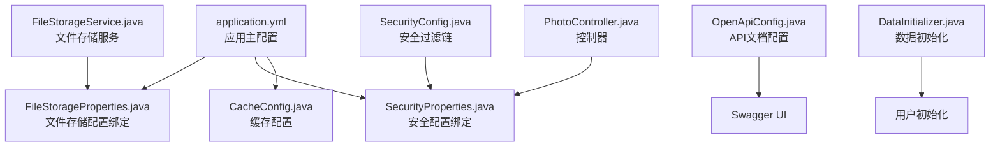
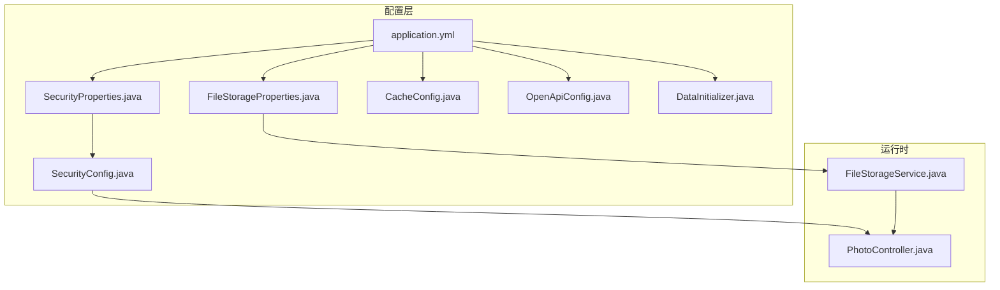
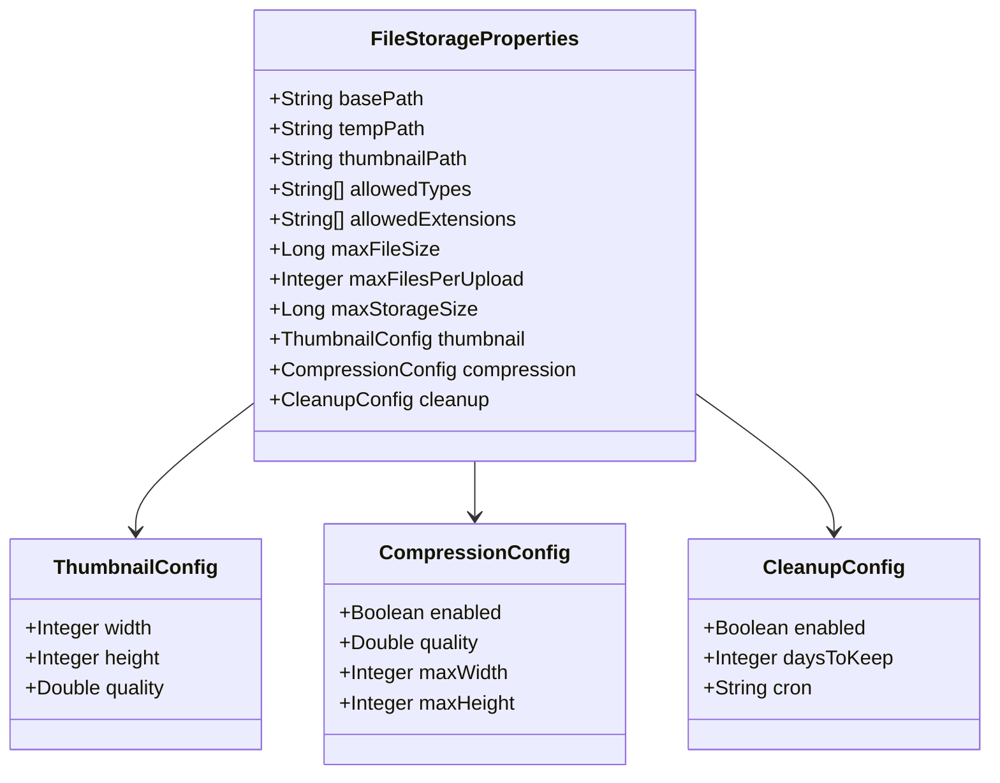
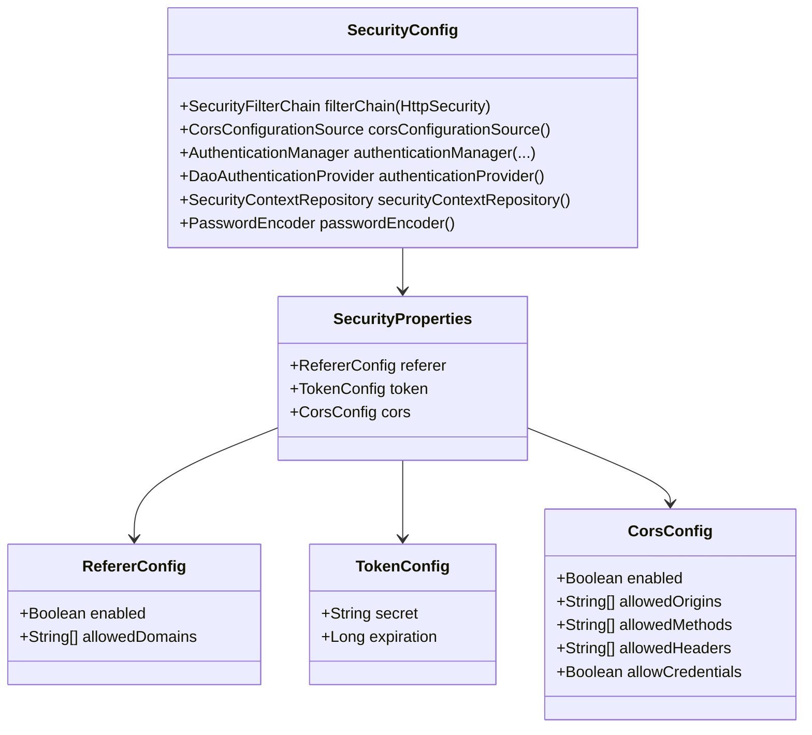
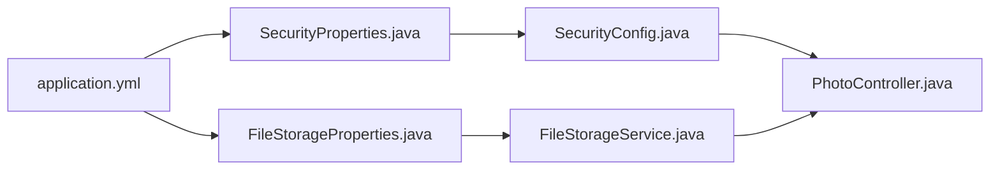

# 配置管理

<cite>
**本文引用的文件列表**
- [application.yml](file://src/main/resources/application.yml)
- [application-test.yml](file://src/test/resources/application-test.yml)
- [FileStorageProperties.java](file://src/main/java/com/photo/config/FileStorageProperties.java)
- [SecurityProperties.java](file://src/main/java/com/photo/config/SecurityProperties.java)
- [SecurityConfig.java](file://src/main/java/com/photo/config/SecurityConfig.java)
- [CacheConfig.java](file://src/main/java/com/photo/config/CacheConfig.java)
- [OpenApiConfig.java](file://src/main/java/com/photo/config/OpenApiConfig.java)
- [DataInitializer.java](file://src/main/java/com/photo/config/DataInitializer.java)
- [FileStorageService.java](file://src/main/java/com/photo/service/FileStorageService.java)
- [PhotoController.java](file://src/main/java/com/photo/controller/PhotoController.java)
- [pom.xml](file://pom.xml)
- [README.md](file://README.md)
</cite>

## 目录
1. [简介](#简介)
2. [项目结构](#项目结构)
3. [核心组件](#核心组件)
4. [架构总览](#架构总览)
5. [详细组件分析](#详细组件分析)
6. [依赖关系分析](#依赖关系分析)
7. [性能考量](#性能考量)
8. [故障排除指南](#故障排除指南)
9. [结论](#结论)
10. [附录](#附录)

## 简介
本文件面向运维与系统管理员，系统性梳理照片上传下载系统的配置管理，覆盖应用配置（数据库连接、文件存储、缓存设置）、安全配置（Spring Security、CORS、防盗链）、文件存储配置（路径、大小限制、压缩设置）等，并给出配置优先级、作用域与动态更新机制说明，以及生产环境最佳实践与安全注意事项、配置验证与故障排除指南。

## 项目结构
系统采用Spring Boot标准结构，配置主要集中在资源目录下的YAML文件与配置类中，配合注解驱动的自动装配实现声明式配置。

图表来源
- [application.yml](file://src/main/resources/application.yml#L1-L190)
- [FileStorageProperties.java](file://src/main/java/com/photo/config/FileStorageProperties.java#L1-L94)
- [SecurityProperties.java](file://src/main/java/com/photo/config/SecurityProperties.java#L1-L53)
- [SecurityConfig.java](file://src/main/java/com/photo/config/SecurityConfig.java#L1-L99)
- [CacheConfig.java](file://src/main/java/com/photo/config/CacheConfig.java#L1-L54)
- [OpenApiConfig.java](file://src/main/java/com/photo/config/OpenApiConfig.java#L1-L50)
- [DataInitializer.java](file://src/main/java/com/photo/config/DataInitializer.java#L1-L57)
- [FileStorageService.java](file://src/main/java/com/photo/service/FileStorageService.java#L1-L200)
- [PhotoController.java](file://src/main/java/com/photo/controller/PhotoController.java#L1-L200)

章节来源
- [application.yml](file://src/main/resources/application.yml#L1-L190)
- [pom.xml](file://pom.xml#L1-L168)

## 核心组件
- 应用配置（application.yml）
  - 数据源与JPA：H2开发与MySQL生产切换；DDL策略、方言、SQL初始化模式
  - Servlet上传：启用multipart、最大文件/请求大小、阈值
  - 缓存：Caffeine类型与规格
  - 模板引擎：Thymeleaf前缀、后缀、编码、缓存
  - 兼容性：解决Springfox与Spring Boot 2.6+匹配策略
- 文件存储配置（application.yml + FileStorageProperties.java）
  - 存储根目录、临时目录、缩略图目录
  - 允许的MIME类型与扩展名
  - 单文件大小、单次上传数量上限
  - 缩略图尺寸、质量与图片压缩开关、质量与分辨率上限
  - 存储总量上限与定期清理策略（开关、保留天数、Cron）
- 安全配置（application.yml + SecurityProperties.java + SecurityConfig.java）
  - 防盗链：域名白名单开关与允许域名
  - Token：密钥与过期时间
  - CORS：开关、允许来源、方法、头、凭据
  - 过滤链：CSRF关闭、CORS注入、静态资源放行、表单登录、登出、frameOptions禁用
- 缓存配置（CacheConfig.java）
  - 全局Caffeine缓存管理器与统计
  - 照片信息缓存与文件元数据缓存的独立规格
- API文档（OpenApiConfig.java）
  - Swagger UI与API文档路径
- 数据初始化（DataInitializer.java）
  - 启动时创建默认管理员与测试用户

章节来源
- [application.yml](file://src/main/resources/application.yml#L1-L190)
- [FileStorageProperties.java](file://src/main/java/com/photo/config/FileStorageProperties.java#L1-L94)
- [SecurityProperties.java](file://src/main/java/com/photo/config/SecurityProperties.java#L1-L53)
- [SecurityConfig.java](file://src/main/java/com/photo/config/SecurityConfig.java#L1-L99)
- [CacheConfig.java](file://src/main/java/com/photo/config/CacheConfig.java#L1-L54)
- [OpenApiConfig.java](file://src/main/java/com/photo/config/OpenApiConfig.java#L1-L50)
- [DataInitializer.java](file://src/main/java/com/photo/config/DataInitializer.java#L1-L57)

## 架构总览
下图展示配置在系统中的作用范围与交互关系。

图表来源
- [application.yml](file://src/main/resources/application.yml#L1-L190)
- [FileStorageProperties.java](file://src/main/java/com/photo/config/FileStorageProperties.java#L1-L94)
- [SecurityProperties.java](file://src/main/java/com/photo/config/SecurityProperties.java#L1-L53)
- [SecurityConfig.java](file://src/main/java/com/photo/config/SecurityConfig.java#L1-L99)
- [CacheConfig.java](file://src/main/java/com/photo/config/CacheConfig.java#L1-L54)
- [OpenApiConfig.java](file://src/main/java/com/photo/config/OpenApiConfig.java#L1-L50)
- [DataInitializer.java](file://src/main/java/com/photo/config/DataInitializer.java#L1-L57)
- [FileStorageService.java](file://src/main/java/com/photo/service/FileStorageService.java#L1-L200)
- [PhotoController.java](file://src/main/java/com/photo/controller/PhotoController.java#L1-L200)

## 详细组件分析

### 应用配置（application.yml）
- 数据源与JPA
  - 开发环境使用H2文件数据库，生产环境可切换为MySQL
  - Hibernate DDL策略为更新；方言根据环境选择
  - SQL初始化模式为always，编码UTF-8
- Servlet上传
  - multipart启用，最大单文件10MB，最大请求50MB，阈值2MB
- 缓存
  - Caffeine缓存类型，规格包含最大条目与写入过期时间
- 模板引擎
  - Thymeleaf前缀、后缀、HTML模式、UTF-8编码、关闭缓存
- 兼容性
  - 设置路径匹配策略为ant_path_matcher以适配Springfox
- 服务器与压缩
  - 端口8080，开启Gzip压缩，指定MIME类型
  - Tomcat连接数与线程池参数
- 日志
  - 控制台与文件日志级别、格式、文件路径与滚动策略
- Actuator与API文档
  - 暴露health、info、metrics端点，健康详情按授权显示
  - Swagger UI与API文档路径

章节来源
- [application.yml](file://src/main/resources/application.yml#L1-L190)

### 文件存储配置（application.yml + FileStorageProperties.java）
- 存储路径
  - 基础路径、临时路径、缩略图路径
- 类型与扩展名
  - 允许的MIME类型与扩展名清单
- 大小与数量
  - 单文件最大大小、单次上传最大数量
- 缩略图与压缩
  - 缩略图宽高与质量
  - 图片压缩开关、质量、最大宽高
- 存储上限与清理
  - 总存储上限（字节）
  - 定期清理开关、保留天数、Cron表达式

图表来源
- [FileStorageProperties.java](file://src/main/java/com/photo/config/FileStorageProperties.java#L1-L94)

章节来源
- [application.yml](file://src/main/resources/application.yml#L69-L118)
- [FileStorageProperties.java](file://src/main/java/com/photo/config/FileStorageProperties.java#L1-L94)

### 安全配置（application.yml + SecurityProperties.java + SecurityConfig.java）
- 防盗链
  - 开关与允许域名列表
- Token
  - 密钥与过期时间（秒）
- CORS
  - 开关、允许来源、方法、头、凭据
- 过滤链
  - CSRF禁用、CORS注入、静态资源放行、表单登录、登出、frameOptions禁用

图表来源
- [SecurityProperties.java](file://src/main/java/com/photo/config/SecurityProperties.java#L1-L53)
- [SecurityConfig.java](file://src/main/java/com/photo/config/SecurityConfig.java#L1-L99)

章节来源
- [application.yml](file://src/main/resources/application.yml#L119-L145)
- [SecurityProperties.java](file://src/main/java/com/photo/config/SecurityProperties.java#L1-L53)
- [SecurityConfig.java](file://src/main/java/com/photo/config/SecurityConfig.java#L1-L99)

### 缓存配置（CacheConfig.java）
- 全局缓存管理器：最大条目、写入过期时间、统计
- 照片信息缓存与文件元数据缓存：独立规格

章节来源
- [CacheConfig.java](file://src/main/java/com/photo/config/CacheConfig.java#L1-L54)

### API文档配置（OpenApiConfig.java）
- Swagger UI与API文档路径
- 自定义API信息与资源处理器

章节来源
- [OpenApiConfig.java](file://src/main/java/com/photo/config/OpenApiConfig.java#L1-L50)

### 数据初始化（DataInitializer.java）
- 启动时创建默认管理员与测试用户

章节来源
- [DataInitializer.java](file://src/main/java/com/photo/config/DataInitializer.java#L1-L57)

### 配置使用示例（控制器与服务）
- 控制器中对防盗链与CORS的使用
- 服务中对存储路径、缩略图与压缩参数的使用

章节来源
- [PhotoController.java](file://src/main/java/com/photo/controller/PhotoController.java#L1-L200)
- [FileStorageService.java](file://src/main/java/com/photo/service/FileStorageService.java#L1-L200)

## 依赖关系分析
- 配置绑定
  - application.yml通过@ConfigurationProperties绑定到Java类
  - FileStorageProperties与SecurityProperties分别绑定file.storage与security命名空间
- 组件耦合
  - SecurityConfig依赖SecurityProperties进行CORS与防盗链配置
  - FileStorageService依赖FileStorageProperties进行路径与参数解析
  - PhotoController在预览与下载时使用SecurityProperties进行防盗链校验
- 外部依赖
  - 缓存使用Caffeine
  - API文档使用SpringDoc OpenAPI
  - 数据库可选H2或MySQL

图表来源
- [application.yml](file://src/main/resources/application.yml#L1-L190)
- [FileStorageProperties.java](file://src/main/java/com/photo/config/FileStorageProperties.java#L1-L94)
- [SecurityProperties.java](file://src/main/java/com/photo/config/SecurityProperties.java#L1-L53)
- [SecurityConfig.java](file://src/main/java/com/photo/config/SecurityConfig.java#L1-L99)
- [FileStorageService.java](file://src/main/java/com/photo/service/FileStorageService.java#L1-L200)
- [PhotoController.java](file://src/main/java/com/photo/controller/PhotoController.java#L1-L200)

章节来源
- [pom.xml](file://pom.xml#L1-L168)

## 性能考量
- 上传性能
  - multipart阈值与请求大小限制影响内存占用与IO行为
  - 大文件建议结合断点续传与压缩策略
- 缓存策略
  - Caffeine全局与分场景缓存提升热点数据访问效率
- 压缩与缩略图
  - 合理设置压缩质量与最大分辨率，平衡画质与带宽
- 服务器与Tomcat
  - 连接数与线程池参数需结合并发与硬件能力调优

[本节为通用指导，不直接分析具体文件]

## 故障排除指南
- 文件存储相关
  - 目录创建失败：检查基础路径、临时路径、缩略图路径是否存在且具备写权限
  - 文件名非法或路径遍历：确认文件名合法性与规范化处理
  - 存储空间不足：核对max-storage-size与实际磁盘配额
- 安全相关
  - 防盗链拒绝：核对allowed-domains配置与请求Referer
  - CORS错误：核对allowed-origins、allowed-methods、allowed-headers、allow-credentials
  - 登录失败：确认用户存在与密码编码一致
- API与文档
  - Swagger UI不可用：确认springdoc路径与资源处理器配置
- 日志与监控
  - 日志级别与文件滚动：核对logging配置与文件路径
  - Actuator端点：确认management暴露的端点与健康详情策略

章节来源
- [FileStorageService.java](file://src/main/java/com/photo/service/FileStorageService.java#L1-L200)
- [PhotoController.java](file://src/main/java/com/photo/controller/PhotoController.java#L1-L200)
- [OpenApiConfig.java](file://src/main/java/com/photo/config/OpenApiConfig.java#L1-L50)
- [application.yml](file://src/main/resources/application.yml#L146-L189)

## 结论
本系统通过YAML与@ConfigurationProperties实现了强类型的配置绑定，结合Spring Security、CORS、缓存与API文档等模块，提供了可维护、可扩展的配置体系。生产部署应重点关注安全密钥、存储路径与容量、CORS与防盗链策略、日志与监控配置，并结合业务规模进行性能调优。

[本节为总结性内容，不直接分析具体文件]

## 附录

### 配置优先级与作用域
- 配置来源优先级（从高到低）
  - 命令行参数
  - OS环境变量
  - application-{profile}.yml
  - application.yml
  - @PropertySource注解
  - 默认属性
- 作用域
  - application.yml为全局默认配置
  - application-test.yml用于测试环境覆盖
  - 可通过spring.profiles.active切换不同环境配置文件

章节来源
- [application.yml](file://src/main/resources/application.yml#L1-L190)
- [application-test.yml](file://src/test/resources/application-test.yml#L1-L75)

### 动态更新机制
- Spring Boot默认不支持运行时动态刷新所有配置
- 建议方式
  - 使用Spring Cloud Config或外部化配置中心
  - 对于部分非关键配置（如日志级别），可通过Actuator的/loggers端点动态调整
  - 对于文件存储路径、CORS、防盗链等，建议重启生效

章节来源
- [application.yml](file://src/main/resources/application.yml#L146-L189)
- [pom.xml](file://pom.xml#L144-L149)

### 生产环境最佳实践与安全注意事项
- 安全
  - 修改默认Token密钥与过期时间
  - 严格配置CORS白名单与允许来源
  - 启用HTTPS与安全头策略
- 存储
  - 使用专业对象存储（如OSS/S3）替代本地磁盘
  - 设置合理的存储上限与清理策略
  - 定期备份数据库与上传文件
- 性能
  - 根据并发与硬件能力调整Tomcat线程池与连接数
  - 合理配置缓存与压缩参数
- 监控
  - 暴露必要的Actuator端点并限制访问
  - 配置日志滚动与告警

章节来源
- [README.md](file://README.md#L254-L261)
- [application.yml](file://src/main/resources/application.yml#L119-L189)

### 配置验证清单
- 数据库连接：H2/MySQL均可，确保URL、用户名、密码正确
- 文件存储：路径存在且可写，类型与大小限制符合预期
- 安全：防盗链、CORS、Token配置完整
- 缓存：Caffeine可用，缓存策略合理
- API文档：Swagger UI可访问
- 日志与监控：日志输出正常，Actuator端点可访问

章节来源
- [application.yml](file://src/main/resources/application.yml#L1-L190)
- [OpenApiConfig.java](file://src/main/java/com/photo/config/OpenApiConfig.java#L1-L50)
- [DataInitializer.java](file://src/main/java/com/photo/config/DataInitializer.java#L1-L57)