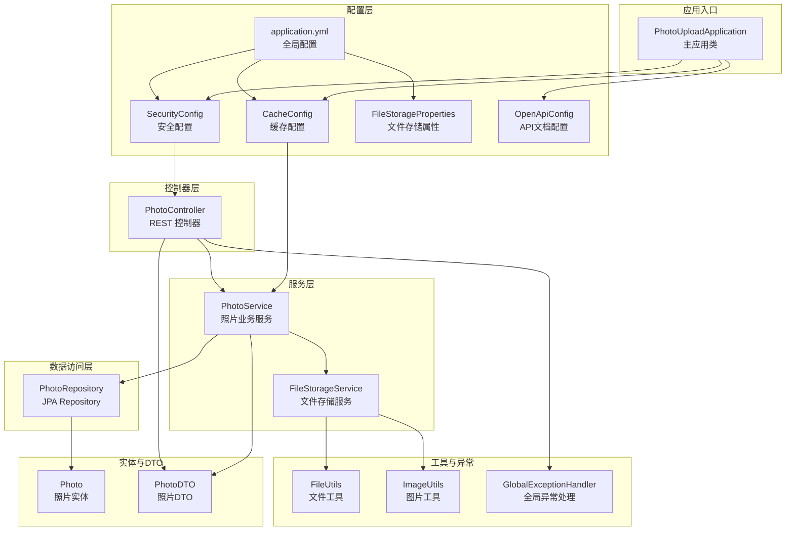
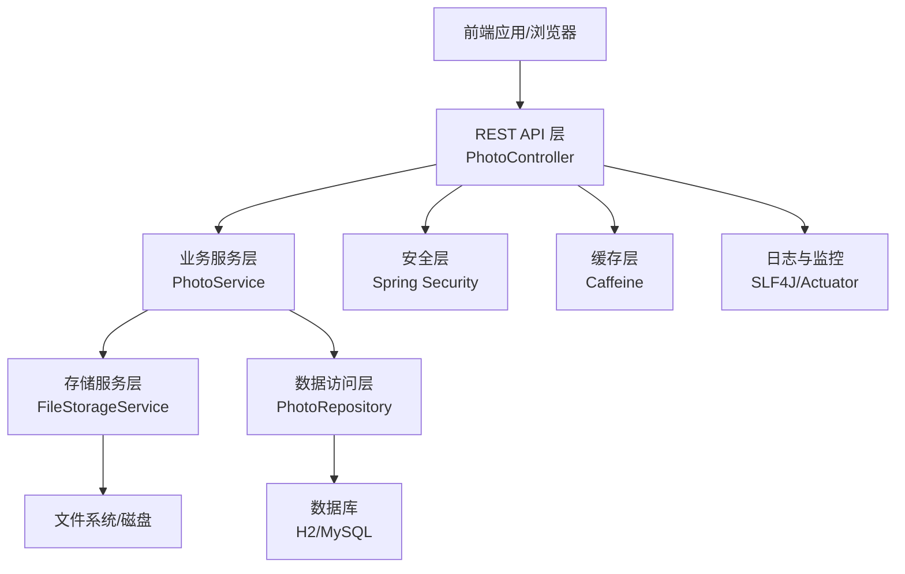
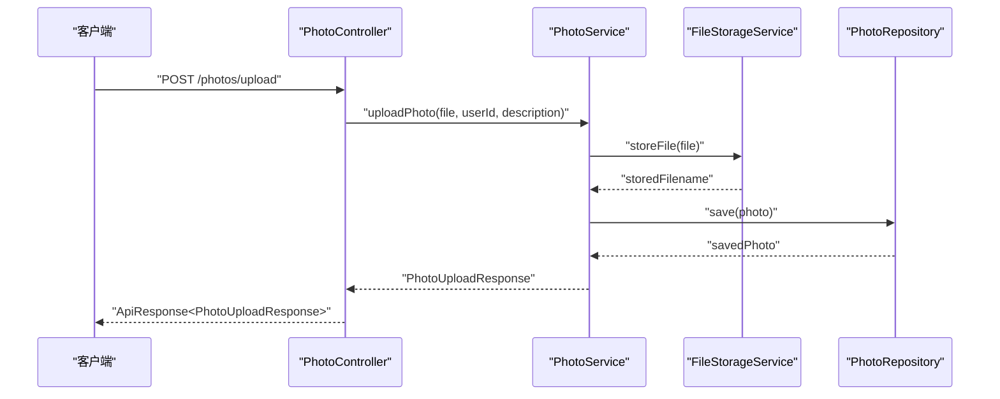
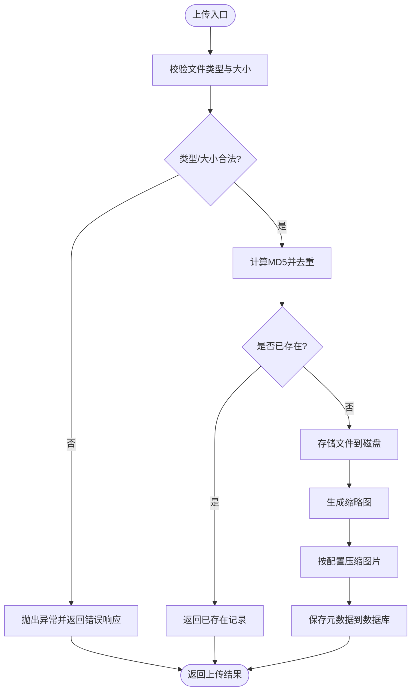
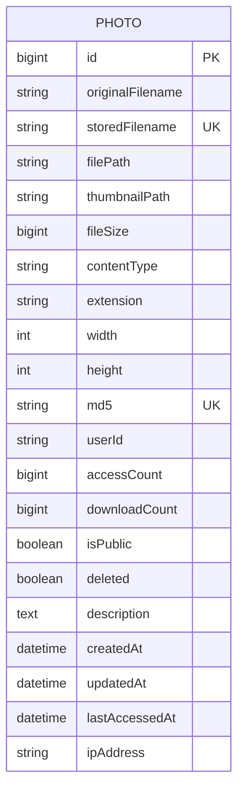
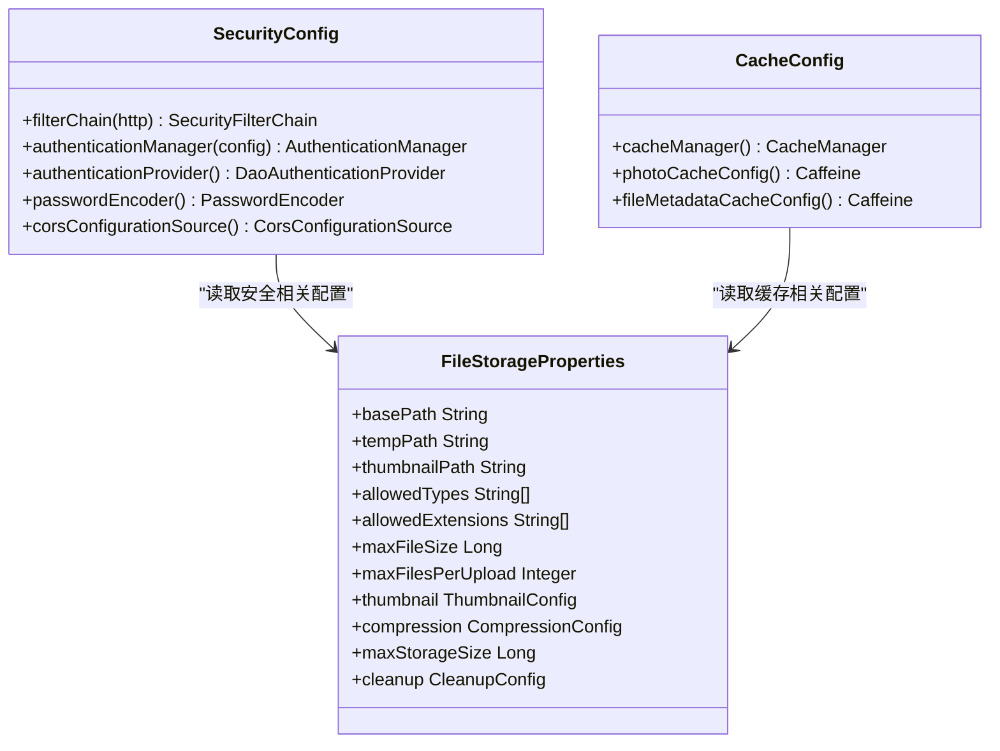
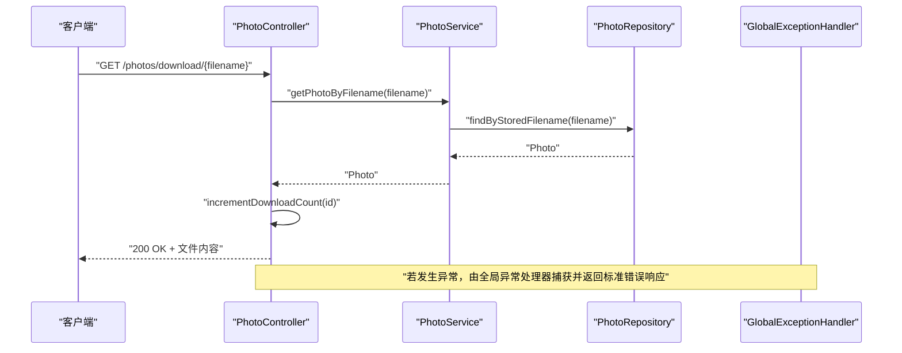
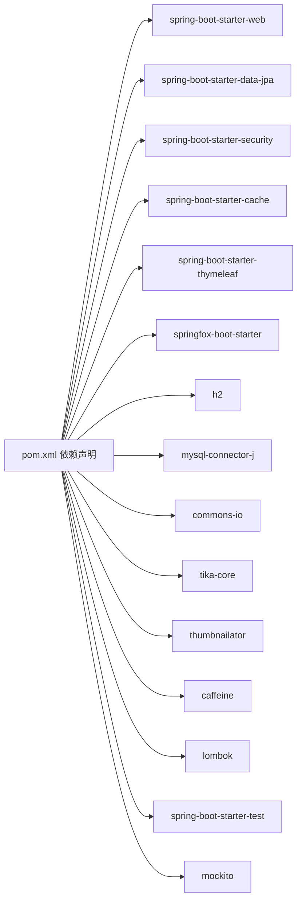

# 项目概述

<cite>
**本文引用的文件**
- [README.md](file://README.md)
- [PROJECT_SUMMARY.md](file://PROJECT_SUMMARY.md)
- [pom.xml](file://pom.xml)
- [PhotoUploadApplication.java](file://src/main/java/com/photo/PhotoUploadApplication.java)
- [application.yml](file://src/main/resources/application.yml)
- [SecurityConfig.java](file://src/main/java/com/photo/config/SecurityConfig.java)
- [CacheConfig.java](file://src/main/java/com/photo/config/CacheConfig.java)
- [FileStorageProperties.java](file://src/main/java/com/photo/config/FileStorageProperties.java)
- [OpenApiConfig.java](file://src/main/java/com/photo/config/OpenApiConfig.java)
- [Photo.java](file://src/main/java/com/photo/entity/Photo.java)
- [FileStorageService.java](file://src/main/java/com/photo/service/FileStorageService.java)
- [PhotoController.java](file://src/main/java/com/photo/controller/PhotoController.java)
- [PhotoDTO.java](file://src/main/java/com/photo/dto/PhotoDTO.java)
- [PhotoRepository.java](file://src/main/java/com/photo/repository/PhotoRepository.java)
- [FileUtils.java](file://src/main/java/com/photo/util/FileUtils.java)
- [ImageUtils.java](file://src/main/java/com/photo/util/ImageUtils.java)
- [GlobalExceptionHandler.java](file://src/main/java/com/photo/exception/GlobalExceptionHandler.java)
</cite>

## 目录
1. [引言](#引言)
2. [项目结构](#项目结构)
3. [核心组件](#核心组件)
4. [架构总览](#架构总览)
5. [详细组件分析](#详细组件分析)
6. [依赖分析](#依赖分析)
7. [性能考量](#性能考量)
8. [故障排查指南](#故障排查指南)
9. [结论](#结论)
10. [附录](#附录)

## 引言
本项目是一个基于 Spring Boot 3.2.0 的企业级照片上传下载系统，提供完整的文件管理能力，包括单/多文件上传、在线预览、断点续传下载、缩略图生成、MD5 去重、访问统计、安全防护与性能优化等特性。系统采用分层架构与模块化设计，结合 Spring Security、JPA、Caffeine 等核心技术，既适合初学者快速上手，也为有经验的开发者提供了良好的扩展性与工程实践参考。

## 项目结构
项目遵循典型的 Spring Boot 分层结构，按功能域划分模块，职责清晰、耦合度低、可维护性强。

图表来源
- [PhotoUploadApplication.java](file://src/main/java/com/photo/PhotoUploadApplication.java#L1-L20)
- [SecurityConfig.java](file://src/main/java/com/photo/config/SecurityConfig.java#L1-L99)
- [CacheConfig.java](file://src/main/java/com/photo/config/CacheConfig.java#L1-L54)
- [FileStorageProperties.java](file://src/main/java/com/photo/config/FileStorageProperties.java#L1-L94)
- [OpenApiConfig.java](file://src/main/java/com/photo/config/OpenApiConfig.java#L1-L50)
- [application.yml](file://src/main/resources/application.yml#L1-L190)
- [PhotoController.java](file://src/main/java/com/photo/controller/PhotoController.java#L1-L316)
- [FileStorageService.java](file://src/main/java/com/photo/service/FileStorageService.java#L1-L300)
- [PhotoRepository.java](file://src/main/java/com/photo/repository/PhotoRepository.java#L1-L112)
- [Photo.java](file://src/main/java/com/photo/entity/Photo.java#L1-L174)
- [PhotoDTO.java](file://src/main/java/com/photo/dto/PhotoDTO.java#L1-L104)
- [FileUtils.java](file://src/main/java/com/photo/util/FileUtils.java#L1-L178)
- [ImageUtils.java](file://src/main/java/com/photo/util/ImageUtils.java#L1-L182)
- [GlobalExceptionHandler.java](file://src/main/java/com/photo/exception/GlobalExceptionHandler.java#L1-L140)

章节来源
- [README.md](file://README.md#L214-L252)
- [PROJECT_SUMMARY.md](file://PROJECT_SUMMARY.md#L84-L157)

## 核心组件
- 应用入口与启动
  - 主应用类启用缓存与定时任务，统一管理应用生命周期。
- 配置层
  - 安全配置：基于表单登录与 CORS，禁用 CSRF，便于前后端分离调试。
  - 缓存配置：Caffeine 管理器与多种缓存策略，提升热点数据访问性能。
  - 文件存储属性：集中管理存储路径、类型、大小、压缩与清理策略。
  - OpenAPI 配置：集成 Swagger，提供交互式 API 文档。
  - 全局配置：application.yml 提供数据库、文件上传、缓存、日志、服务器等统一配置。
- 控制器层
  - PhotoController：提供上传、批量上传、在线预览、缩略图、下载、断点续传、搜索、分页查询、删除、存储信息等完整接口。
- 服务层
  - FileStorageService：负责文件存储、读取、范围读取、缩略图生成、压缩、删除等底层操作。
  - PhotoService：协调业务流程，调用存储服务与仓库，处理去重、访问统计、权限控制等。
- 数据访问层
  - PhotoRepository：基于 JPA 提供照片实体的查询、统计、软删除、访问/下载计数更新等方法。
- 实体与 DTO
  - Photo：照片实体，包含元数据、访问统计、软删除标记等字段。
  - PhotoDTO：对外传输对象，封装展示所需字段。
- 工具与异常
  - FileUtils：文件类型检测（扩展名/MIME/魔数）、MD5 计算、文件名清洗等。
  - ImageUtils：图片尺寸检测、缩略图生成、压缩、旋转、水印等。
  - GlobalExceptionHandler：统一异常处理，标准化错误响应。

章节来源
- [PhotoUploadApplication.java](file://src/main/java/com/photo/PhotoUploadApplication.java#L1-L20)
- [SecurityConfig.java](file://src/main/java/com/photo/config/SecurityConfig.java#L1-L99)
- [CacheConfig.java](file://src/main/java/com/photo/config/CacheConfig.java#L1-L54)
- [FileStorageProperties.java](file://src/main/java/com/photo/config/FileStorageProperties.java#L1-L94)
- [OpenApiConfig.java](file://src/main/java/com/photo/config/OpenApiConfig.java#L1-L50)
- [application.yml](file://src/main/resources/application.yml#L1-L190)
- [PhotoController.java](file://src/main/java/com/photo/controller/PhotoController.java#L1-L316)
- [FileStorageService.java](file://src/main/java/com/photo/service/FileStorageService.java#L1-L300)
- [PhotoRepository.java](file://src/main/java/com/photo/repository/PhotoRepository.java#L1-L112)
- [Photo.java](file://src/main/java/com/photo/entity/Photo.java#L1-L174)
- [PhotoDTO.java](file://src/main/java/com/photo/dto/PhotoDTO.java#L1-L104)
- [FileUtils.java](file://src/main/java/com/photo/util/FileUtils.java#L1-L178)
- [ImageUtils.java](file://src/main/java/com/photo/util/ImageUtils.java#L1-L182)
- [GlobalExceptionHandler.java](file://src/main/java/com/photo/exception/GlobalExceptionHandler.java#L1-L140)

## 架构总览
系统采用经典的三层架构（表现层/业务层/数据层），配合 Spring Security 实现安全控制，Caffeine 提升热点数据访问效率，JPA 提供数据持久化能力。整体架构强调模块解耦、配置外化、异常统一处理与可观测性。

图表来源
- [PhotoController.java](file://src/main/java/com/photo/controller/PhotoController.java#L1-L316)
- [FileStorageService.java](file://src/main/java/com/photo/service/FileStorageService.java#L1-L300)
- [PhotoRepository.java](file://src/main/java/com/photo/repository/PhotoRepository.java#L1-L112)
- [SecurityConfig.java](file://src/main/java/com/photo/config/SecurityConfig.java#L1-L99)
- [CacheConfig.java](file://src/main/java/com/photo/config/CacheConfig.java#L1-L54)
- [application.yml](file://src/main/resources/application.yml#L1-L190)

## 详细组件分析

### 控制器组件分析
- 功能覆盖
  - 单文件/批量上传：支持多文件、用户标识、描述字段。
  - 在线预览/缩略图：防盗链校验、缓存控制、MIME 类型设置。
  - 下载与断点续传：Range 请求解析、部分响应状态码、Content-Range 设置。
  - 搜索与分页：关键词匹配、分页查询、热门/最新排序。
  - 删除与统计：软删除、永久删除、访问/下载计数更新。
  - 存储信息：存储容量统计、活跃文件计数。
- 设计要点
  - 统一响应包装 ApiResponse，便于前端消费。
  - 参数校验与异常处理前置，保证接口健壮性。
  - 防盗链与权限控制贯穿请求链路。

图表来源
- [PhotoController.java](file://src/main/java/com/photo/controller/PhotoController.java#L48-L61)
- [FileStorageService.java](file://src/main/java/com/photo/service/FileStorageService.java#L59-L95)
- [PhotoRepository.java](file://src/main/java/com/photo/repository/PhotoRepository.java#L25-L35)

章节来源
- [PhotoController.java](file://src/main/java/com/photo/controller/PhotoController.java#L1-L316)

### 服务组件分析
- FileStorageService
  - 负责文件存储、读取、范围读取、缩略图生成、压缩、删除等。
  - 支持断点续传的范围读取，避免大文件一次性加载内存。
  - 对缩略图与压缩进行异步或按需处理，降低存储与带宽压力。
- PhotoService
  - 协调上传流程，计算 MD5 去重、生成唯一文件名、记录访问统计。
  - 调用仓库进行查询、统计与软删除操作，确保业务一致性。

图表来源
- [FileStorageService.java](file://src/main/java/com/photo/service/FileStorageService.java#L59-L183)
- [FileUtils.java](file://src/main/java/com/photo/util/FileUtils.java#L107-L119)
- [PhotoRepository.java](file://src/main/java/com/photo/repository/PhotoRepository.java#L25-L35)

章节来源
- [FileStorageService.java](file://src/main/java/com/photo/service/FileStorageService.java#L1-L300)
- [FileUtils.java](file://src/main/java/com/photo/util/FileUtils.java#L1-L178)
- [PhotoRepository.java](file://src/main/java/com/photo/repository/PhotoRepository.java#L1-L112)

### 数据模型与仓储分析
- 实体 Photo
  - 字段覆盖原始文件名、存储文件名、路径、缩略图路径、大小、MIME、扩展名、尺寸、MD5、用户ID、访问/下载计数、公开状态、软删除、描述、时间戳等。
  - 索引优化：originalFilename、createdAt、userId，提升查询与统计效率。
- 仓储 PhotoRepository
  - 提供按用户、公开状态、关键词、过期时间等条件的查询与统计。
  - 支持软删除、批量软删除、访问/下载计数更新、热门/最新排序等。

图表来源
- [Photo.java](file://src/main/java/com/photo/entity/Photo.java#L1-L174)
- [PhotoRepository.java](file://src/main/java/com/photo/repository/PhotoRepository.java#L1-L112)

章节来源
- [Photo.java](file://src/main/java/com/photo/entity/Photo.java#L1-L174)
- [PhotoRepository.java](file://src/main/java/com/photo/repository/PhotoRepository.java#L1-L112)

### 安全与缓存配置分析
- 安全配置
  - 禁用 CSRF，启用 CORS，表单登录，允许静态资源与公开接口放行，其余请求需认证。
  - 结合防盗链配置与 Referer 校验，防止图片外链盗用。
- 缓存配置
  - Caffeine 管理器与多种缓存策略，热点照片信息与文件元数据缓存，减少数据库与磁盘 IO。

图表来源
- [SecurityConfig.java](file://src/main/java/com/photo/config/SecurityConfig.java#L1-L99)
- [CacheConfig.java](file://src/main/java/com/photo/config/CacheConfig.java#L1-L54)
- [FileStorageProperties.java](file://src/main/java/com/photo/config/FileStorageProperties.java#L1-L94)

章节来源
- [SecurityConfig.java](file://src/main/java/com/photo/config/SecurityConfig.java#L1-L99)
- [CacheConfig.java](file://src/main/java/com/photo/config/CacheConfig.java#L1-L54)
- [FileStorageProperties.java](file://src/main/java/com/photo/config/FileStorageProperties.java#L1-L94)
- [application.yml](file://src/main/resources/application.yml#L119-L144)

### API 流程与异常处理
- API 流程
  - 上传：类型校验 → MD5 去重 → 存储文件 → 生成缩略图/压缩 → 写入数据库 → 返回响应。
  - 下载：权限校验 → 访问计数更新 → 读取文件/范围读取 → 设置响应头 → 返回内容。
- 异常处理
  - 全局异常处理器对文件类型、大小、存储、未找到、存储满、访问拒绝、参数校验等异常进行统一处理，返回标准化错误响应。

图表来源
- [PhotoController.java](file://src/main/java/com/photo/controller/PhotoController.java#L149-L179)
- [PhotoRepository.java](file://src/main/java/com/photo/repository/PhotoRepository.java#L25-L35)
- [GlobalExceptionHandler.java](file://src/main/java/com/photo/exception/GlobalExceptionHandler.java#L1-L140)

章节来源
- [PhotoController.java](file://src/main/java/com/photo/controller/PhotoController.java#L1-L316)
- [GlobalExceptionHandler.java](file://src/main/java/com/photo/exception/GlobalExceptionHandler.java#L1-L140)

## 依赖分析
- 技术栈概览
  - 框架：Spring Boot 3.2.0、Spring Web、Spring Data JPA、Spring Security、Spring Cache、Spring Thymeleaf、SpringDoc OpenAPI。
  - 数据库：H2（开发）/ MySQL（生产），JPA/Hibernate。
  - 文件处理：Apache Commons IO、Apache Tika（魔数检测）、Thumbnailator（图片处理）。
  - 缓存：Caffeine。
  - 测试：JUnit 5、Mockito。
- 依赖关系
  - 控制器依赖服务层；服务层依赖仓储与存储服务；存储服务依赖工具类与配置属性；全局异常处理统一拦截业务异常。

图表来源
- [pom.xml](file://pom.xml#L1-L169)

章节来源
- [pom.xml](file://pom.xml#L1-L169)
- [PROJECT_SUMMARY.md](file://PROJECT_SUMMARY.md#L238-L252)

## 性能考量
- 缓存策略
  - Caffeine 管理器与多种缓存策略，热点照片信息与文件元数据缓存，减少数据库与磁盘 IO。
- 图片处理
  - 缩略图与压缩按配置执行，避免大图直接传输，降低带宽与存储成本。
- 断点续传
  - 支持 Range 请求，提高大文件下载稳定性与带宽利用率。
- 数据库优化
  - 实体建立索引，仓储提供常用查询与统计方法，减少慢查询。
- 日志与监控
  - 统一日志输出与 Actuator 指标暴露，便于性能观测与问题定位。

章节来源
- [CacheConfig.java](file://src/main/java/com/photo/config/CacheConfig.java#L1-L54)
- [FileStorageService.java](file://src/main/java/com/photo/service/FileStorageService.java#L146-L183)
- [PhotoController.java](file://src/main/java/com/photo/controller/PhotoController.java#L184-L225)
- [Photo.java](file://src/main/java/com/photo/entity/Photo.java#L18-L22)
- [application.yml](file://src/main/resources/application.yml#L146-L190)

## 故障排查指南
- 常见问题
  - 文件类型不被识别：检查扩展名、MIME 与魔数检测是否一致。
  - 文件名非法：确认文件名未包含路径遍历字符，使用工具类进行清洗。
  - 存储空间不足：检查配置的最大存储容量与当前使用量。
  - 下载失败：确认防盗链配置与 Referer 校验是否通过。
  - 上传超时/内存溢出：考虑启用断点续传与合理设置上传大小阈值。
- 排查步骤
  - 查看日志：关注存储、图片处理、异常处理相关日志。
  - 使用 Swagger：验证接口参数与响应格式。
  - 检查配置：核对 application.yml 中的文件存储、缓存、安全与服务器配置。
  - 单元测试：运行测试用例，定位问题范围。

章节来源
- [FileUtils.java](file://src/main/java/com/photo/util/FileUtils.java#L156-L177)
- [GlobalExceptionHandler.java](file://src/main/java/com/photo/exception/GlobalExceptionHandler.java#L1-L140)
- [application.yml](file://src/main/resources/application.yml#L1-L190)

## 结论
该照片上传下载系统以 Spring Boot 为核心，结合 Spring Security、JPA、Caffeine 等技术，构建了具备企业级能力的文件管理平台。系统在安全性、性能、可维护性与可扩展性方面均达到较高水准，既满足快速交付的需求，又为后续迭代与生产部署打下坚实基础。建议在生产环境中进一步完善认证授权、对象存储接入、监控告警与灾备策略。

## 附录
- 快速开始
  - 环境要求：JDK 17+、Maven 3.6+、MySQL 5.7+（生产）。
  - 配置数据库与文件存储路径，编译打包后运行。
  - 访问应用主页与 Swagger 文档，进行功能验证。
- API 列表
  - 上传、批量上传、在线预览、缩略图、下载、断点续传、搜索、分页、删除、存储信息等接口。
- 配置要点
  - 文件存储根目录、最大文件大小、最大存储容量、缩略图与压缩配置、防盗链与 CORS、日志与服务器参数等。

章节来源
- [README.md](file://README.md#L67-L103)
- [PROJECT_SUMMARY.md](file://PROJECT_SUMMARY.md#L187-L235)
- [PROJECT_SUMMARY.md](file://PROJECT_SUMMARY.md#L318-L333)
- [application.yml](file://src/main/resources/application.yml#L69-L190)