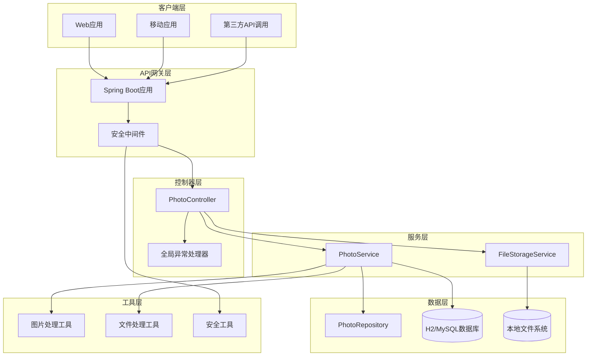
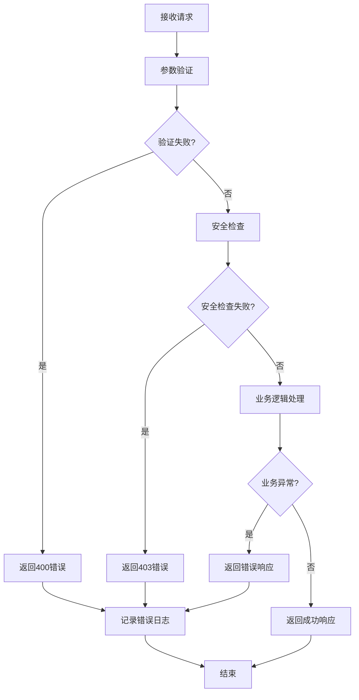

# Photo Upload System API 参考文档

<cite>
**本文档引用的文件**
- [PhotoController.java](file://src/main/java/com/photo/controller/PhotoController.java)
- [PhotoService.java](file://src/main/java/com/photo/service/PhotoService.java)
- [FileStorageService.java](file://src/main/java/com/photo/service/FileStorageService.java)
- [ApiResponse.java](file://src/main/java/com/photo/dto/ApiResponse.java)
- [PhotoDTO.java](file://src/main/java/com/photo/dto/PhotoDTO.java)
- [PhotoUploadResponse.java](file://src/main/java/com/photo/dto/PhotoUploadResponse.java)
- [StorageInfo.java](file://src/main/java/com/photo/dto/StorageInfo.java)
- [SecurityProperties.java](file://src/main/java/com/photo/config/SecurityProperties.java)
- [SecurityUtils.java](file://src/main/java/com/photo/util/SecurityUtils.java)
- [FileStorageProperties.java](file://src/main/java/com/photo/config/FileStorageProperties.java)
- [application.yml](file://src/main/resources/application.yml)
- [PhotoControllerTest.java](file://src/test/java/com/photo/controller/PhotoControllerTest.java)
- [Photo.java](file://src/main/java/com/photo/entity/Photo.java)
</cite>

## 目录
1. [简介](#简介)
2. [系统架构概览](#系统架构概览)
3. [统一响应格式](#统一响应格式)
4. [API端点详解](#api端点详解)
5. [安全机制](#安全机制)
6. [性能特征](#性能特征)
7. [错误处理](#错误处理)
8. [使用示例](#使用示例)
9. [最佳实践](#最佳实践)

## 简介

Photo Upload System 是一个基于Spring Boot构建的RESTful照片管理系统，提供完整的照片上传、存储、管理和访问功能。系统支持单文件和批量上传，具备防盗链保护、断点续传、缩略图生成等高级特性。

### 核心特性
- **多格式支持**: JPG、PNG、GIF、BMP、WEBP等主流图片格式
- **智能去重**: 基于MD5的文件重复检测
- **访问控制**: 用户级权限管理和防盗链保护
- **性能优化**: 缓存机制、图片压缩、断点续传
- **扩展性强**: 支持JWT认证扩展和自定义配置

## 系统架构概览



**图表来源**
- [PhotoController.java](file://src/main/java/com/photo/controller/PhotoController.java#L1-L316)
- [PhotoService.java](file://src/main/java/com/photo/service/PhotoService.java#L1-L385)
- [FileStorageService.java](file://src/main/java/com/photo/service/FileStorageService.java#L1-L298)

## 统一响应格式

所有API接口都遵循统一的响应格式，确保客户端能够一致地处理各种响应。

### 响应结构

| 字段名 | 类型 | 说明 |
|--------|------|------|
| code | Integer | 响应状态码，200表示成功 |
| message | String | 响应消息，描述操作结果 |
| data | Object | 响应数据，具体格式因接口而异 |
| timestamp | Long | 时间戳，毫秒级 |

### 状态码说明

| 状态码 | 含义 | 使用场景 |
|--------|------|----------|
| 200 | 成功 | 操作成功完成 |
| 400 | 请求参数错误 | 参数验证失败 |
| 403 | 访问被拒绝 | 权限不足或防盗链阻止 |
| 404 | 资源不存在 | 文件或记录不存在 |
| 500 | 服务器内部错误 | 系统异常 |
| 507 | 存储空间不足 | 磁盘空间不够 |

**章节来源**
- [ApiResponse.java](file://src/main/java/com/photo/dto/ApiResponse.java#L1-L63)

## API端点详解

系统共提供13个RESTful API端点，涵盖照片管理的完整生命周期。

### 1. 上传单个照片

**端点**: `POST /photos/upload`

**功能**: 上传单张照片文件，支持多种图片格式。

**请求参数**:

| 参数名 | 类型 | 必填 | 默认值 | 说明 |
|--------|------|------|--------|------|
| file | MultipartFile | 是 | - | 照片文件 |
| userId | String | 否 | guest | 用户标识符 |
| description | String | 否 | - | 照片描述信息 |

**文件限制**:
- 支持格式: JPG, JPEG, PNG, GIF, BMP, WEBP
- 最大大小: 10MB
- 最大文件数: 1个

**请求示例**:
```bash
curl -X POST http://localhost:8080/api/photos/upload \
  -F "file=@/path/to/photo.jpg" \
  -F "userId=user123" \
  -F "description=我的照片"
```

**成功响应**:
```json
{
  "code": 200,
  "message": "上传成功",
  "data": {
    "id": 1,
    "originalFilename": "photo.jpg",
    "storedFilename": "abc123def456.jpg",
    "fileSize": 1024000,
    "fileSizeReadable": "1.00 MB",
    "contentType": "image/jpeg",
    "url": "/api/photos/view/abc123def456.jpg",
    "thumbnailUrl": "/api/photos/thumbnail/abc123def456.jpg",
    "downloadUrl": "/api/photos/download/abc123def456.jpg",
    "width": 1920,
    "height": 1080,
    "uploadedAt": "2024-01-01T12:00:00",
    "md5": "abc123def456"
  },
  "timestamp": 1704110400000
}
```

**章节来源**
- [PhotoController.java](file://src/main/java/com/photo/controller/PhotoController.java#L35-L50)
- [PhotoService.java](file://src/main/java/com/photo/service/PhotoService.java#L45-L120)

### 2. 批量上传照片

**端点**: `POST /photos/upload/batch`

**功能**: 一次性上传多个照片文件，最多支持10个文件。

**请求参数**:

| 参数名 | 类型 | 必填 | 默认值 | 说明 |
|--------|------|------|--------|------|
| files | MultipartFile[] | 是 | - | 照片文件数组 |
| userId | String | 否 | guest | 用户标识符 |
| description | String | 否 | - | 照片描述信息 |

**文件限制**:
- 最大文件数: 10个
- 单文件大小: ≤10MB
- 总大小: ≤50MB (Spring配置)

**请求示例**:
```bash
curl -X POST http://localhost:8080/api/photos/upload/batch \
  -F "files=@/path/to/photo1.jpg" \
  -F "files=@/path/to/photo2.jpg" \
  -F "userId=user123"
```

**成功响应**:
```json
{
  "code": 200,
  "message": "批量上传成功",
  "data": [
    {
      "id": 1,
      "originalFilename": "photo1.jpg",
      "storedFilename": "file1.jpg",
      "fileSize": 512000,
      "fileSizeReadable": "512 KB",
      "contentType": "image/jpeg",
      "url": "/api/photos/view/file1.jpg",
      "thumbnailUrl": "/api/photos/thumbnail/file1.jpg",
      "downloadUrl": "/api/photos/download/file1.jpg",
      "width": 1280,
      "height": 720,
      "uploadedAt": "2024-01-01T12:00:00",
      "md5": "md5hash1"
    },
    {
      "id": 2,
      "originalFilename": "photo2.jpg",
      "storedFilename": "file2.jpg",
      "fileSize": 768000,
      "fileSizeReadable": "768 KB",
      "contentType": "image/jpeg",
      "url": "/api/photos/view/file2.jpg",
      "thumbnailUrl": "/api/photos/thumbnail/file2.jpg",
      "downloadUrl": "/api/photos/download/file2.jpg",
      "width": 1920,
      "height": 1080,
      "uploadedAt": "2024-01-01T12:00:00",
      "md5": "md5hash2"
    }
  ],
  "timestamp": 1704110400000
}
```

**章节来源**
- [PhotoController.java](file://src/main/java/com/photo/controller/PhotoController.java#L52-L67)
- [PhotoService.java](file://src/main/java/com/photo/service/PhotoService.java#L122-L145)

### 3. 在线预览照片

**端点**: `GET /photos/view/{filename}`

**功能**: 通过文件名在线预览照片，支持防盗链检查。

**路径参数**:

| 参数名 | 类型 | 必填 | 说明 |
|--------|------|------|------|
| filename | String | 是 | 文件名（包含扩展名） |

**安全特性**:
- 防盗链检查（可配置）
- 访问计数统计
- 缓存控制（1小时）

**响应**:
- Content-Type: 根据文件类型自动设置
- Cache-Control: max-age=3600
- 响应体: 图片二进制数据

**请求示例**:
```bash
curl -X GET http://localhost:8080/api/photos/view/abc123def456.jpg
```

**章节来源**
- [PhotoController.java](file://src/main/java/com/photo/controller/PhotoController.java#L69-L105)
- [SecurityUtils.java](file://src/main/java/com/photo/util/SecurityUtils.java#L60-L75)

### 4. 查看缩略图

**端点**: `GET /photos/thumbnail/{filename}`

**功能**: 获取照片的缩略图，尺寸固定为200x200像素。

**路径参数**:

| 参数名 | 类型 | 必填 | 说明 |
|--------|------|------|------|
| filename | String | 是 | 文件名（包含扩展名） |

**响应**:
- Content-Type: image/jpeg
- Cache-Control: max-age=7200
- 响应体: 缩略图二进制数据

**请求示例**:
```bash
curl -X GET http://localhost:8080/api/photos/thumbnail/abc123def456.jpg
```

**章节来源**
- [PhotoController.java](file://src/main/java/com/photo/controller/PhotoController.java#L107-L125)

### 5. 下载照片

**端点**: `GET /photos/download/{filename}`

**功能**: 下载原始照片文件，支持文件名国际化。

**路径参数**:

| 参数名 | 类型 | 必填 | 说明 |
|--------|------|------|------|
| filename | String | 是 | 文件名（包含扩展名） |

**响应头**:
- Content-Type: application/octet-stream
- Content-Disposition: attachment; filename="original_filename.jpg"
- Cache-Control: 无缓存

**请求示例**:
```bash
curl -X GET http://localhost:8080/api/photos/download/abc123def456.jpg
```

**章节来源**
- [PhotoController.java](file://src/main/java/com/photo/controller/PhotoController.java#L127-L155)

### 6. 断点续传下载

**端点**: `GET /photos/download/range/{filename}`

**功能**: 支持HTTP Range请求的大文件断点续传下载。

**路径参数**:

| 参数名 | 类型 | 必填 | 说明 |
|--------|------|------|------|
| filename | String | 是 | 文件名（包含扩展名） |

**请求头**:
- Range: bytes=start-end（如 "bytes=0-1023"）

**响应头**:
- Content-Range: bytes start-end/total_size
- Accept-Ranges: bytes
- Content-Length: 实际传输的数据长度

**HTTP状态码**:
- 206: Partial Content（Range请求）
- 200: OK（无Range头）

**请求示例**:
```bash
curl -H "Range: bytes=0-1023" \
  http://localhost:8080/api/photos/download/range/abc123def456.jpg
```

**章节来源**
- [PhotoController.java](file://src/main/java/com/photo/controller/PhotoController.java#L157-L195)
- [FileStorageService.java](file://src/main/java/com/photo/service/FileStorageService.java#L240-L270)

### 7. 获取照片信息

**端点**: `GET /photos/{id}`

**功能**: 根据照片ID获取详细信息，包括访问统计。

**路径参数**:

| 参数名 | 类型 | 必填 | 说明 |
|--------|------|------|------|
| id | Long | 是 | 照片唯一标识符 |

**成功响应**:
```json
{
  "code": 200,
  "message": "操作成功",
  "data": {
    "id": 1,
    "originalFilename": "photo.jpg",
    "fileSize": 1024000,
    "fileSizeReadable": "1.00 MB",
    "contentType": "image/jpeg",
    "url": "/api/photos/view/abc123def456.jpg",
    "thumbnailUrl": "/api/photos/thumbnail/abc123def456.jpg",
    "downloadUrl": "/api/photos/download/abc123def456.jpg",
    "width": 1920,
    "height": 1080,
    "accessCount": 10,
    "downloadCount": 5,
    "isPublic": true,
    "description": "我的照片",
    "createdAt": "2024-01-01T12:00:00",
    "updatedAt": "2024-01-01T12:00:00",
    "lastAccessedAt": "2024-01-01T13:00:00"
  },
  "timestamp": 1704110400000
}
```

**章节来源**
- [PhotoController.java](file://src/main/java/com/photo/controller/PhotoController.java#L197-L207)
- [PhotoService.java](file://src/main/java/com/photo/service/PhotoService.java#L147-L155)

### 8. 获取用户照片列表

**端点**: `GET /photos/user/{userId}`

**功能**: 分页查询指定用户的照片列表。

**路径参数**:

| 参数名 | 类型 | 必填 | 说明 |
|--------|------|------|------|
| userId | String | 是 | 用户标识符 |

**查询参数**:

| 参数名 | 类型 | 必填 | 默认值 | 说明 |
|--------|------|------|--------|------|
| page | Integer | 否 | 0 | 页码（从0开始） |
| size | Integer | 否 | 20 | 每页数量 |

**响应格式**:
- 分页数据结构
- 包含总页数和总记录数
- 排序按创建时间倒序

**请求示例**:
```bash
curl -X GET "http://localhost:8080/api/photos/user/user123?page=0&size=10"
```

**章节来源**
- [PhotoController.java](file://src/main/java/com/photo/controller/PhotoController.java#L209-L221)
- [PhotoService.java](file://src/main/java/com/photo/service/PhotoService.java#L157-L165)

### 9. 获取公开照片列表

**端点**: `GET /photos/public`

**功能**: 分页查询所有公开的照片。

**查询参数**:

| 参数名 | 类型 | 必填 | 默认值 | 说明 |
|--------|------|------|--------|------|
| page | Integer | 否 | 0 | 页码（从0开始） |
| size | Integer | 否 | 20 | 每页数量 |

**响应格式**: 同用户照片列表

**请求示例**:
```bash
curl -X GET "http://localhost:8080/api/photos/public?page=0&size=20"
```

**章节来源**
- [PhotoController.java](file://src/main/java/com/photo/controller/PhotoController.java#L223-L235)
- [PhotoService.java](file://src/main/java/com/photo/service/PhotoService.java#L167-L175)

### 10. 搜索照片

**端点**: `GET /photos/search`

**功能**: 根据文件名关键词搜索照片。

**查询参数**:

| 参数名 | 类型 | 必填 | 说明 |
|--------|------|------|------|
| keyword | String | 是 | 搜索关键词 |
| page | Integer | 否 | 页码（从0开始，默认0） |
| size | Integer | 否 | 每页数量（默认20） |

**搜索范围**: 文件名模糊匹配

**请求示例**:
```bash
curl -X GET "http://localhost:8080/api/photos/search?keyword=vacation&page=0&size=10"
```

**章节来源**
- [PhotoController.java](file://src/main/java/com/photo/controller/PhotoController.java#L237-L251)
- [PhotoService.java](file://src/main/java/com/photo/service/PhotoService.java#L177-L185)

### 11. 删除照片（软删除）

**端点**: `DELETE /photos/{id}`

**功能**: 软删除照片，保留文件但标记为已删除。

**路径参数**:

| 参数名 | 类型 | 必填 | 说明 |
|--------|------|------|------|
| id | Long | 是 | 照片唯一标识符 |

**查询参数**:

| 参数名 | 类型 | 必填 | 说明 |
|--------|------|------|------|
| userId | String | 是 | 用户标识符（权限验证） |

**权限要求**:
- 只能删除自己的照片
- 无权限时返回403错误

**请求示例**:
```bash
curl -X DELETE "http://localhost:8080/api/photos/1?userId=user123"
```

**章节来源**
- [PhotoController.java](file://src/main/java/com/photo/controller/PhotoController.java#L253-L267)
- [PhotoService.java](file://src/main/java/com/photo/service/PhotoService.java#L187-L205)

### 12. 永久删除照片

**端点**: `DELETE /photos/{id}/permanent`

**功能**: 物理删除照片及其相关文件。

**路径参数**:

| 参数名 | 类型 | 必填 | 说明 |
|--------|------|------|------|
| id | Long | 是 | 照片唯一标识符 |

**查询参数**:

| 参数名 | 类型 | 必填 | 说明 |
|--------|------|------|------|
| userId | String | 是 | 用户标识符（权限验证） |

**删除流程**:
1. 删除数据库记录
2. 删除存储文件
3. 删除缩略图
4. 清除缓存

**请求示例**:
```bash
curl -X DELETE "http://localhost:8080/api/photos/1/permanent?userId=user123"
```

**章节来源**
- [PhotoController.java](file://src/main/java/com/photo/controller/PhotoController.java#L269-L283)
- [PhotoService.java](file://src/main/java/com/photo/service/PhotoService.java#L207-L230)

### 13. 获取存储空间信息

**端点**: `GET /photos/storage/info`

**功能**: 查询系统的存储空间使用情况。

**成功响应**:
```json
{
  "code": 200,
  "message": "操作成功",
  "data": {
    "usedSpace": 1024000000,
    "usedSpaceReadable": "976.56 MB",
    "totalSpace": 10737418240,
    "totalSpaceReadable": "10.00 GB",
    "freeSpace": 9713418240,
    "freeSpaceReadable": "9.05 GB",
    "usagePercentage": 9.54,
    "totalFiles": 150
  },
  "timestamp": 1704110400000
}
```

**章节来源**
- [PhotoController.java](file://src/main/java/com/photo/controller/PhotoController.java#L285-L293)
- [PhotoService.java](file://src/main/java/com/photo/service/PhotoService.java#L320-L335)

## 安全机制

### 防盗链保护

系统内置防盗链机制，防止未经授权的网站直接访问资源。

**配置选项**:
- enabled: 是否启用防盗链（默认true）
- allowedDomains: 允许的域名列表

**验证逻辑**:
1. 检查请求头中的Referer字段
2. 验证域名是否在允许列表中
3. 不同域访问时返回403错误

### 访问权限控制

**私有照片访问**:
- 只有照片所有者可以访问
- 公开照片对所有人开放
- 软删除的照片不可访问

**文件访问验证**:
- 使用SecurityUtils.checkFileAccess()方法
- 支持路径遍历攻击防护
- 验证文件名安全性

### 输入验证

**文件类型验证**:
- MIME类型检测
- 文件扩展名检查
- 文件内容验证

**参数验证**:
- XSS攻击防护
- SQL注入防护
- 路径遍历攻击防护

**章节来源**
- [SecurityProperties.java](file://src/main/java/com/photo/config/SecurityProperties.java#L1-L53)
- [SecurityUtils.java](file://src/main/java/com/photo/util/SecurityUtils.java#L1-L167)

## 性能特征

### 缓存策略

**缓存配置**:
- 缓存类型: Caffeine
- 最大条目数: 1000
- 过期时间: 1小时

**缓存对象**:
- 照片元数据（PhotoDTO）
- 防盗链配置
- 存储信息

### 图片处理优化

**自动压缩**:
- 质量: 85%
- 最大尺寸: 1920×1080
- 支持格式: JPG, PNG

**缩略图生成**:
- 尺寸: 200×200
- 质量: 80%
- 异步生成

### 并发处理

**文件上传**:
- 支持并发上传
- 文件去重机制
- 流量控制

**断点续传**:
- Range请求支持
- 随机访问文件
- 大文件高效传输

### 存储优化

**文件组织**:
- UUID命名避免冲突
- 目录结构清晰
- 临时文件管理

**定期清理**:
- 配置化清理策略
- Cron定时任务
- 自动过期文件处理

**章节来源**
- [FileStorageProperties.java](file://src/main/java/com/photo/config/FileStorageProperties.java#L1-L94)
- [PhotoService.java](file://src/main/java/com/photo/service/PhotoService.java#L337-L385)

## 错误处理

### 错误码体系

| 错误码 | 场景 | 示例消息 |
|--------|------|----------|
| 400 | 文件类型错误 | "不支持的文件类型: text/plain" |
| 400 | 文件大小超限 | "文件大小不能超过 10.00 MB" |
| 400 | 参数缺失 | "userId参数不能为空" |
| 403 | 权限不足 | "无权删除该照片" |
| 403 | 非法访问来源 | "非法访问来源" |
| 404 | 资源不存在 | "照片不存在: 123" |
| 500 | 服务器内部错误 | "文件存储失败" |
| 507 | 存储空间不足 | "存储空间不足" |

### 异常处理流程



**图表来源**
- [PhotoController.java](file://src/main/java/com/photo/controller/PhotoController.java#L1-L316)
- [PhotoService.java](file://src/main/java/com/photo/service/PhotoService.java#L1-L385)

### 日志记录

**日志级别**:
- INFO: 重要操作记录
- DEBUG: 详细调试信息
- ERROR: 异常和错误信息

**敏感信息保护**:
- IP地址脱敏
- 文件内容不记录
- 敏感参数过滤

**章节来源**
- [PhotoController.java](file://src/main/java/com/photo/controller/PhotoController.java#L1-L316)

## 使用示例

### JavaScript (Fetch API)

```javascript
// 上传单个照片
async function uploadPhoto(file, userId = 'guest', description = '') {
  const formData = new FormData();
  formData.append('file', file);
  formData.append('userId', userId);
  formData.append('description', description);
  
  try {
    const response = await fetch('/api/photos/upload', {
      method: 'POST',
      body: formData
    });
    
    if (!response.ok) {
      throw new Error(`HTTP error! status: ${response.status}`);
    }
    
    const result = await response.json();
    return result.data;
  } catch (error) {
    console.error('上传失败:', error);
    throw error;
  }
}

// 批量上传
async function batchUpload(files, userId = 'guest') {
  const formData = new FormData();
  files.forEach(file => formData.append('files', file));
  formData.append('userId', userId);
  
  const response = await fetch('/api/photos/upload/batch', {
    method: 'POST',
    body: formData
  });
  
  return response.json();
}

// 获取照片列表
async function getPhotos(userId, page = 0, size = 20) {
  const response = await fetch(`/api/photos/user/${userId}?page=${page}&size=${size}`);
  const result = await response.json();
  return result.data;
}

// 下载照片（支持断点续传）
async function downloadPhoto(filename, onProgress) {
  const response = await fetch(`/api/photos/download/range/${filename}`, {
    headers: {
      'Range': 'bytes=0-'
    }
  });
  
  const contentLength = response.headers.get('Content-Range');
  const totalSize = contentLength ? parseInt(contentLength.split('/')[1]) : 0;
  
  const reader = response.body.getReader();
  const chunks = [];
  let receivedLength = 0;
  
  while (true) {
    const { done, value } = await reader.read();
    if (done) break;
    
    chunks.push(value);
    receivedLength += value.length;
    
    if (onProgress) {
      onProgress(receivedLength, totalSize);
    }
  }
  
  const blob = new Blob(chunks);
  return blob;
}
```

### Python (Requests库)

```python
import requests
import os
from typing import List, Dict, Optional

class PhotoUploader:
    def __init__(self, base_url: str):
        self.base_url = base_url
    
    def upload_single(self, file_path: str, user_id: str = 'guest', 
                     description: str = '') -> Dict:
        """上传单个照片"""
        url = f"{self.base_url}/photos/upload"
        files = {'file': open(file_path, 'rb')}
        data = {'userId': user_id, 'description': description}
        
        response = requests.post(url, files=files, data=data)
        response.raise_for_status()
        return response.json()['data']
    
    def upload_batch(self, file_paths: List[str], user_id: str = 'guest') -> List[Dict]:
        """批量上传照片"""
        url = f"{self.base_url}/photos/upload/batch"
        files = []
        for i, path in enumerate(file_paths):
            files.append(('files', open(path, 'rb')))
        
        data = {'userId': user_id}
        
        response = requests.post(url, files=files, data=data)
        response.raise_for_status()
        return response.json()['data']
    
    def download_with_range(self, filename: str, chunk_size: int = 1024*1024) -> bytes:
        """断点续传下载"""
        url = f"{self.base_url}/photos/download/range/{filename}"
        headers = {'Range': f'bytes=0-{chunk_size-1}'}
        
        response = requests.get(url, headers=headers, stream=True)
        response.raise_for_status()
        
        content = b''
        for chunk in response.iter_content(chunk_size=chunk_size):
            content += chunk
        
        return content
    
    def get_photo_info(self, photo_id: int) -> Dict:
        """获取照片信息"""
        url = f"{self.base_url}/photos/{photo_id}"
        response = requests.get(url)
        response.raise_for_status()
        return response.json()['data']
    
    def delete_photo(self, photo_id: int, user_id: str) -> bool:
        """删除照片（软删除）"""
        url = f"{self.base_url}/photos/{photo_id}"
        params = {'userId': user_id}
        response = requests.delete(url, params=params)
        response.raise_for_status()
        return response.json()['code'] == 200

# 使用示例
uploader = PhotoUploader("http://localhost:8080/api")

# 上传照片
result = uploader.upload_single("photo.jpg", "user123", "我的照片")
print(f"上传成功: {result['originalFilename']}")

# 获取照片列表
photos = uploader.get_photo_info(1)
print(f"照片信息: {photos}")

# 下载照片
content = uploader.download_with_range("photo.jpg")
with open("downloaded_photo.jpg", "wb") as f:
    f.write(content)
```

### cURL命令示例

```bash
#!/bin/bash

BASE_URL="http://localhost:8080/api"

# 1. 上传单个照片
curl -X POST "$BASE_URL/photos/upload" \
  -F "file=@photo.jpg" \
  -F "userId=user123" \
  -F "description=我的照片"

# 2. 批量上传
curl -X POST "$BASE_URL/photos/upload/batch" \
  -F "files=@photo1.jpg" \
  -F "files=@photo2.jpg" \
  -F "userId=user123"

# 3. 获取照片信息
curl -X GET "$BASE_URL/photos/1"

# 4. 获取用户照片列表
curl -X GET "$BASE_URL/photos/user/user123?page=0&size=10"

# 5. 搜索照片
curl -X GET "$BASE_URL/photos/search?keyword=旅行&page=0&size=10"

# 6. 下载照片（断点续传）
curl -H "Range: bytes=0-1023" \
  "$BASE_URL/photos/download/range/photo.jpg"

# 7. 删除照片
curl -X DELETE "$BASE_URL/photos/1?userId=user123"

# 8. 获取存储信息
curl -X GET "$BASE_URL/photos/storage/info"
```

## 最佳实践

### 开发建议

**文件上传优化**:
- 使用FormData对象处理文件上传
- 实现进度条显示
- 添加文件类型和大小验证
- 支持拖拽上传

**错误处理**:
- 捕获网络错误
- 显示友好的错误信息
- 提供重试机制
- 记录错误日志

**性能优化**:
- 合理设置缓存时间
- 使用CDN加速静态资源
- 压缩传输数据
- 异步处理耗时操作

### 生产环境部署

**配置建议**:
- 设置合适的文件大小限制
- 配置防盗链域名白名单
- 启用HTTPS加密传输
- 配置负载均衡和反向代理

**监控指标**:
- API响应时间
- 错误率统计
- 存储空间使用率
- 并发连接数

**安全加固**:
- 定期更新依赖包
- 配置防火墙规则
- 监控异常访问
- 备份重要数据

### 扩展开发

**认证集成**:
- JWT令牌验证
- OAuth2.0支持
- API密钥管理

**功能增强**:
- 照片编辑功能
- 元数据提取
- AI智能分类
- 社交分享

**章节来源**
- [application.yml](file://src/main/resources/application.yml#L1-L173)
- [PhotoControllerTest.java](file://src/test/java/com/photo/controller/PhotoControllerTest.java#L1-L174)