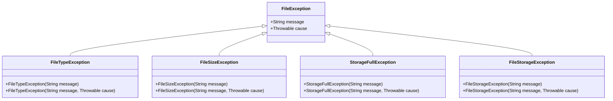

# 上传单个照片 API 文档

<cite>
**本文档引用的文件**
- [PhotoController.java](file://src/main/java/com/photo/controller/PhotoController.java)
- [ApiResponse.java](file://src/main/java/com/photo/dto/ApiResponse.java)
- [PhotoUploadResponse.java](file://src/main/java/com/photo/dto/PhotoUploadResponse.java)
- [PhotoService.java](file://src/main/java/com/photo/service/PhotoService.java)
- [FileUtils.java](file://src/main/java/com/photo/util/FileUtils.java)
- [FileStorageProperties.java](file://src/main/java/com/photo/config/FileStorageProperties.java)
- [Photo.java](file://src/main/java/com/photo/entity/Photo.java)
- [application.yml](file://src/main/resources/application.yml)
- [FileTypeException.java](file://src/main/java/com/photo/exception/FileTypeException.java)
- [FileSizeException.java](file://src/main/java/com/photo/exception/FileSizeException.java)
- [StorageFullException.java](file://src/main/java/com/photo/exception/StorageFullException.java)
- [PhotoControllerTest.java](file://src/test/java/com/photo/controller/PhotoControllerTest.java)
</cite>

## 目录
1. [接口概述](#接口概述)
2. [技术规范](#技术规范)
3. [请求参数详解](#请求参数详解)
4. [响应结构说明](#响应结构说明)
5. [错误响应处理](#错误响应处理)
6. [业务流程说明](#业务流程说明)
7. [代码示例](#代码示例)
8. [配置说明](#配置说明)
9. [异常处理机制](#异常处理机制)

## 接口概述

### 基本信息
- **接口名称**: 上传单个照片
- **HTTP方法**: POST
- **URL模式**: `/photos/upload`
- **请求头**: `Content-Type: multipart/form-data`
- **认证要求**: 无需认证（匿名上传）
- **业务作用**: 用户上传单张图片的核心入口

### 功能描述
该接口支持用户上传单张图片文件，系统会自动验证文件类型、大小限制，并生成唯一的存储文件名。上传完成后，系统会返回包含照片详细信息的响应，包括原始文件名、存储文件名、文件大小、图片尺寸等信息。

## 技术规范

### 支持的文件格式
系统支持以下图片格式：
- **JPEG/JPG**: `image/jpeg`
- **PNG**: `image/png`
- **GIF**: `image/gif`
- **BMP**: `image/bmp`
- **WebP**: `image/webp`

### 文件大小限制
- **最大文件大小**: 10MB (10,485,760 字节)
- **默认用户ID**: guest（未指定时使用）
- **描述字段**: 可选参数，用于添加照片说明

### 存储配置
- **基础存储路径**: `./uploads`
- **临时文件目录**: `./uploads/temp`
- **缩略图目录**: `./uploads/thumbnails`
- **最大存储容量**: 10GB (10,737,418,240 字节)

**章节来源**
- [FileStorageProperties.java](file://src/main/java/com/photo/config/FileStorageProperties.java#L1-L94)
- [FileUtils.java](file://src/main/java/com/photo/util/FileUtils.java#L25-L40)

## 请求参数详解

### 参数表

| 参数名 | 类型 | 必填 | 默认值 | 描述 |
|--------|------|------|--------|------|
| file | MultipartFile | ✓ | - | 照片文件，必须是有效的图片文件 |
| userId | String | ✗ | guest | 用户标识，用于区分不同用户的上传 |
| description | String | ✗ | - | 照片描述信息 |

### 参数详细说明

#### file 参数
- **类型**: MultipartFile
- **验证规则**:
  - 文件不能为空
  - 必须是有效的图片文件
  - 文件大小不能超过10MB
  - 支持的文件扩展名: jpg, jpeg, png, gif, bmp, webp

#### userId 参数
- **类型**: String
- **用途**: 标识上传照片的用户
- **默认值**: "guest"（匿名用户）
- **业务意义**: 用于用户照片的分类和权限管理

#### description 参数
- **类型**: String
- **用途**: 为照片添加描述信息
- **长度限制**: 无限制（数据库字段长度1000字符）
- **业务意义**: 提供照片的附加信息，便于搜索和分类

**章节来源**
- [PhotoController.java](file://src/main/java/com/photo/controller/PhotoController.java#L35-L45)
- [PhotoService.java](file://src/main/java/com/photo/service/PhotoService.java#L40-L50)

## 响应结构说明

### 成功响应结构

```json
{
  "code": 200,
  "message": "上传成功",
  "data": {
    "id": 123,
    "originalFilename": "example.jpg",
    "storedFilename": "abc123-def4-5678-abcd-ef1234567890.jpg",
    "fileSize": 1024000,
    "fileSizeReadable": "1.00 MB",
    "contentType": "image/jpeg",
    "url": "/api/photos/view/abc123-def4-5678-abcd-ef1234567890.jpg",
    "thumbnailUrl": "/api/photos/thumbnail/abc123-def4-5678-abcd-ef1234567890.jpg",
    "downloadUrl": "/api/photos/download/abc123-def4-5678-abcd-ef1234567890.jpg",
    "width": 1920,
    "height": 1080,
    "uploadedAt": "2024-01-15T10:30:00",
    "md5": "abcdef1234567890abcdef1234567890"
  },
  "timestamp": 1705321800000
}
```

### 响应字段说明

| 字段名 | 类型 | 描述 |
|--------|------|------|
| code | Integer | 响应状态码，200表示成功 |
| message | String | 响应消息，通常为"上传成功" |
| data | Object | 包含照片详细信息的对象 |
| timestamp | Long | 响应时间戳（毫秒级） |

### data对象字段说明

| 字段名 | 类型 | 描述 |
|--------|------|------|
| id | Long | 照片在数据库中的唯一标识符 |
| originalFilename | String | 用户上传时的原始文件名 |
| storedFilename | String | 系统生成的唯一存储文件名 |
| fileSize | Long | 文件大小（字节） |
| fileSizeReadable | String | 可读格式的文件大小（如"1.00 MB"） |
| contentType | String | MIME文件类型（如"image/jpeg"） |
| url | String | 在线预览链接 |
| thumbnailUrl | String | 缩略图预览链接 |
| downloadUrl | String | 下载链接 |
| width | Integer | 图片宽度（像素） |
| height | Integer | 图片高度（像素） |
| uploadedAt | LocalDateTime | 上传时间 |
| md5 | String | 文件的MD5校验值 |

**章节来源**
- [ApiResponse.java](file://src/main/java/com/photo/dto/ApiResponse.java#L1-L63)
- [PhotoUploadResponse.java](file://src/main/java/com/photo/dto/PhotoUploadResponse.java#L1-L84)

## 错误响应处理

### 常见错误状态码

| 状态码 | 异常类型 | 错误描述 | 处理建议 |
|--------|----------|----------|----------|
| 400 | FileTypeException | 文件类型不支持 | 检查文件格式是否为支持的图片格式 |
| 400 | FileSizeException | 文件大小超限 | 确保文件大小不超过10MB |
| 507 | StorageFullException | 存储空间不足 | 等待存储空间释放或联系管理员 |
| 500 | FileStorageException | 文件存储失败 | 检查服务器磁盘空间和权限 |

### 错误响应示例

#### 文件类型错误
```json
{
  "code": 400,
  "message": "只允许上传图片文件",
  "data": null,
  "timestamp": 1705321800000
}
```

#### 文件大小超限
```json
{
  "code": 400,
  "message": "文件大小不能超过 10.00 MB",
  "data": null,
  "timestamp": 1705321800000
}
```

#### 存储空间不足
```json
{
  "code": 507,
  "message": "存储空间不足",
  "data": null,
  "timestamp": 1705321800000
}
```

### 异常处理流程


**图表来源**
- [PhotoService.java](file://src/main/java/com/photo/service/PhotoService.java#L350-L384)
- [FileUtils.java](file://src/main/java/com/photo/util/FileUtils.java#L50-L70)

**章节来源**
- [FileTypeException.java](file://src/main/java/com/photo/exception/FileTypeException.java#L1-L16)
- [FileSizeException.java](file://src/main/java/com/photo/exception/FileSizeException.java#L1-L16)
- [StorageFullException.java](file://src/main/java/com/photo/exception/StorageFullException.java#L1-L16)

## 业务流程说明

### 上传流程架构


**图表来源**
- [PhotoController.java](file://src/main/java/com/photo/controller/PhotoController.java#L35-L45)
- [PhotoService.java](file://src/main/java/com/photo/service/PhotoService.java#L40-L120)

### 核心业务逻辑

1. **文件验证阶段**
   - 检查文件是否为空
   - 验证文件类型是否为支持的图片格式
   - 检查文件大小是否在限制范围内
   - 验证图片文件的有效性

2. **存储空间检查**
   - 计算当前已使用存储空间
   - 检查剩余空间是否足够
   - 防止存储空间溢出

3. **重复文件检测**
   - 计算文件的MD5值
   - 查询数据库中是否已存在相同文件
   - 如存在则直接返回已有记录

4. **文件存储处理**
   - 生成唯一的存储文件名
   - 存储原始文件
   - 生成缩略图
   - 可选的图片压缩处理

5. **数据库记录**
   - 保存照片元数据
   - 记录访问统计信息
   - 建立用户关联关系

**章节来源**
- [PhotoService.java](file://src/main/java/com/photo/service/PhotoService.java#L40-L120)

## 代码示例

### cURL 命令行示例

#### 基本上传
```bash
curl -X POST "http://localhost:8080/api/photos/upload" \
  -H "Content-Type: multipart/form-data" \
  -F "file=@/path/to/image.jpg" \
  -F "userId=testuser" \
  -F "description=我的第一张照片"
```

#### 使用默认用户ID
```bash
curl -X POST "http://localhost:8080/api/photos/upload" \
  -H "Content-Type: multipart/form-data" \
  -F "file=@/path/to/image.png"
```

### JavaScript Fetch 示例

#### 基本上传
```javascript
const formData = new FormData();
formData.append('file', fileInput.files[0]);
formData.append('userId', 'testuser');
formData.append('description', '测试照片');

fetch('/api/photos/upload', {
    method: 'POST',
    body: formData
})
.then(response => response.json())
.then(data => {
    console.log('上传成功:', data);
})
.catch(error => {
    console.error('上传失败:', error);
});
```

#### 使用 async/await
```javascript
async function uploadPhoto(file, userId = 'guest', description = '') {
    const formData = new FormData();
    formData.append('file', file);
    formData.append('userId', userId);
    formData.append('description', description);
    
    try {
        const response = await fetch('/api/photos/upload', {
            method: 'POST',
            body: formData
        });
        
        if (!response.ok) {
            throw new Error(`HTTP error! status: ${response.status}`);
        }
        
        const result = await response.json();
        return result;
    } catch (error) {
        console.error('上传失败:', error);
        throw error;
    }
}
```

### Python Requests 示例

#### 基本上传
```python
import requests

# 准备文件和参数
files = {'file': ('image.jpg', open('image.jpg', 'rb'), 'image/jpeg')}
data = {
    'userId': 'testuser',
    'description': 'Python上传测试'
}

# 发送POST请求
response = requests.post(
    'http://localhost:8080/api/photos/upload',
    files=files,
    data=data
)

# 处理响应
if response.status_code == 200:
    result = response.json()
    print('上传成功:', result['data'])
else:
    print('上传失败:', response.status_code, response.text)
```

#### 使用with语句确保文件关闭
```python
import requests

def upload_photo(file_path, user_id='guest', description=''):
    """上传照片到服务器"""
    try:
        # 使用with语句确保文件正确关闭
        with open(file_path, 'rb') as f:
            files = {'file': (file_path, f, 'image/jpeg')}
            data = {
                'userId': user_id,
                'description': description
            }
            
            response = requests.post(
                'http://localhost:8080/api/photos/upload',
                files=files,
                data=data
            )
            
            response.raise_for_status()
            return response.json()
            
    except FileNotFoundError:
        print(f'文件未找到: {file_path}')
    except requests.RequestException as e:
        print(f'网络请求错误: {e}')
    except Exception as e:
        print(f'上传过程中发生错误: {e}')

# 使用示例
result = upload_photo('photo.jpg', 'user123', '我的新照片')
if result:
    print('上传成功:', result)
```

**章节来源**
- [PhotoControllerTest.java](file://src/test/java/com/photo/controller/PhotoControllerTest.java#L70-L90)

## 配置说明

### 关键配置项

#### 文件存储配置
```yaml
file:
  storage:
    # 基础存储路径
    base-path: ./uploads
    # 最大文件大小（字节）
    max-file-size: 10485760  # 10MB
    # 最大存储容量（字节）
    max-storage-size: 10737418240  # 10GB
    # 允许的文件类型
    allowed-types:
      - image/jpeg
      - image/jpg
      - image/png
      - image/gif
      - image/bmp
      - image/webp
```

#### Spring Boot 文件上传配置
```yaml
spring:
  servlet:
    multipart:
      # 启用多部分请求处理
      enabled: true
      # 单个文件最大大小
      max-file-size: 10MB
      # 请求最大总大小
      max-request-size: 50MB
      # 文件大小阈值（超过此大小将写入磁盘）
      file-size-threshold: 2MB
```

### 配置项说明

| 配置项 | 默认值 | 说明 |
|--------|--------|------|
| file.storage.base-path | ./uploads | 文件存储根目录 |
| file.storage.max-file-size | 10485760 | 单个文件最大10MB |
| file.storage.max-storage-size | 10737418240 | 总存储空间10GB |
| spring.servlet.multipart.max-file-size | 10MB | Spring文件上传限制 |
| spring.servlet.multipart.max-request-size | 50MB | Spring请求总大小限制 |

**章节来源**
- [application.yml](file://src/main/resources/application.yml#L40-L80)
- [FileStorageProperties.java](file://src/main/java/com/photo/config/FileStorageProperties.java#L15-L50)

## 异常处理机制

### 异常层次结构



**图表来源**
- [FileTypeException.java](file://src/main/java/com/photo/exception/FileTypeException.java#L1-L16)
- [FileSizeException.java](file://src/main/java/com/photo/exception/FileSizeException.java#L1-L16)
- [StorageFullException.java](file://src/main/java/com/photo/exception/StorageFullException.java#L1-L16)

### 异常处理策略

#### 文件类型验证异常
- **触发条件**: 文件类型不在支持列表中
- **处理方式**: 返回400状态码和具体错误信息
- **示例消息**: "只允许上传图片文件"

#### 文件大小验证异常  
- **触发条件**: 文件大小超过10MB限制
- **处理方式**: 返回400状态码和具体错误信息
- **示例消息**: "文件大小不能超过 10.00 MB"

#### 存储空间不足异常
- **触发条件**: 当前存储空间不足以容纳新文件
- **处理方式**: 返回507状态码和具体错误信息
- **示例消息**: "存储空间不足"

#### 文件存储异常
- **触发条件**: 文件存储过程中发生IO错误
- **处理方式**: 返回500状态码和具体错误信息
- **示例消息**: "照片上传失败: [具体错误]"

### 全局异常处理

系统通过全局异常处理器统一处理各种异常，确保返回标准化的错误响应格式。

**章节来源**
- [PhotoService.java](file://src/main/java/com/photo/service/PhotoService.java#L350-L384)

## 性能优化建议

### 上传性能优化

1. **文件大小限制**: 设置合理的文件大小上限，避免大文件占用过多带宽
2. **并发处理**: 支持批量上传，提高上传效率
3. **缓存机制**: 对频繁访问的照片信息进行缓存
4. **异步处理**: 对非关键处理步骤采用异步方式

### 存储优化

1. **文件去重**: 基于MD5值检测重复文件，节省存储空间
2. **图片压缩**: 自动压缩图片到合理尺寸，平衡质量和大小
3. **定期清理**: 自动清理过期文件，保持存储空间可用性
4. **缩略图生成**: 自动生成适合显示的缩略图，减少带宽消耗

### 安全考虑

1. **文件类型验证**: 严格验证文件类型，防止恶意文件上传
2. **文件名安全**: 清理文件名，防止路径遍历攻击
3. **防盗链保护**: 支持域名白名单验证
4. **访问控制**: 后续可扩展JWT认证支持

## 扩展功能规划

### 认证集成
- **JWT支持**: 后续可扩展JWT认证机制
- **用户权限**: 基于用户身份的访问控制
- **角色管理**: 不同用户角色的权限差异

### 高级功能
- **图片编辑**: 内置简单的图片编辑功能
- **标签系统**: 支持为照片添加标签和分类
- **分享功能**: 生成分享链接和二维码
- **版本控制**: 支持同一照片的多个版本管理

### 监控和统计
- **上传统计**: 实时监控上传量和成功率
- **存储监控**: 跟踪存储空间使用情况
- **性能指标**: 监控接口响应时间和吞吐量