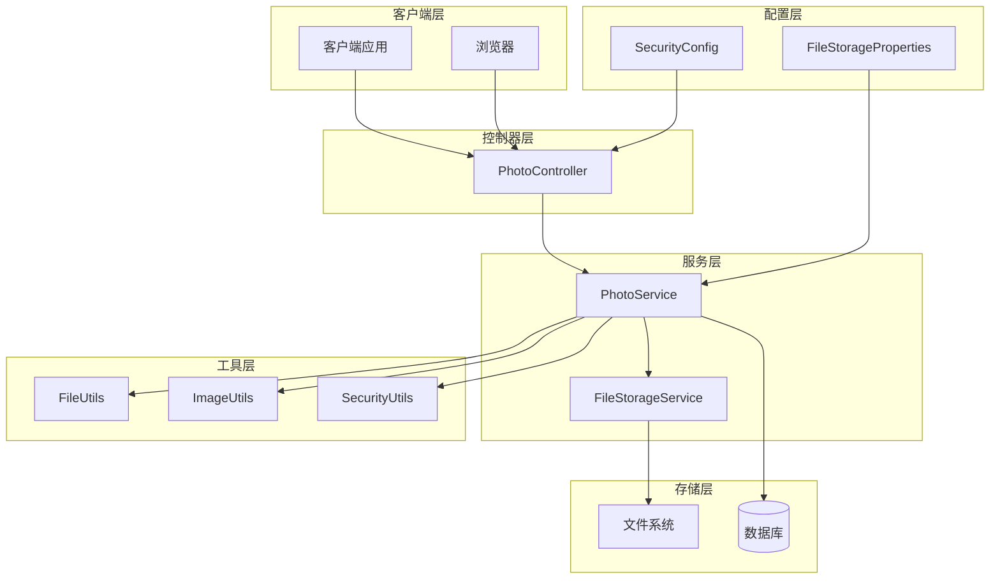

# 上传接口

<cite>
**本文档引用的文件**
- [PhotoController.java](file://src/main/java/com/photo/controller/PhotoController.java)
- [PhotoUploadResponse.java](file://src/main/java/com/photo/dto/PhotoUploadResponse.java)
- [PhotoService.java](file://src/main/java/com/photo/service/PhotoService.java)
- [FileStorageProperties.java](file://src/main/java/com/photo/config/FileStorageProperties.java)
- [FileUtils.java](file://src/main/java/com/photo/util/FileUtils.java)
- [FileStorageService.java](file://src/main/java/com/photo/service/FileStorageService.java)
- [API_DOCUMENTATION.md](file://API_DOCUMENTATION.md)
- [FileTypeException.java](file://src/main/java/com/photo/exception/FileTypeException.java)
- [FileSizeException.java](file://src/main/java/com/photo/exception/FileSizeException.java)
- [StorageFullException.java](file://src/main/java/com/photo/exception/StorageFullException.java)
- [FileStorageException.java](file://src/main/java/com/photo/exception/FileStorageException.java)
</cite>

## 目录
1. [简介](#简介)
2. [项目架构概览](#项目架构概览)
3. [单文件上传接口](#单文件上传接口)
4. [批量上传接口](#批量上传接口)
5. [响应结构详解](#响应结构详解)
6. [错误处理机制](#错误处理机制)
7. [安全验证机制](#安全验证机制)
8. [技术特性](#技术特性)
9. [使用示例](#使用示例)
10. [故障排除指南](#故障排除指南)

## 简介

本文档详细介绍了PhotoController中的两个核心上传接口：单文件上传（POST /photos/upload）和批量上传（POST /photos/upload/batch）。这些接口提供了完整的照片上传解决方案，支持多种图片格式、文件大小限制、MD5去重机制以及全面的安全验证。

## 项目架构概览



**图表来源**
- [PhotoController.java](file://src/main/java/com/photo/controller/PhotoController.java#L31-L34)
- [PhotoService.java](file://src/main/java/com/photo/service/PhotoService.java#L35-L46)
- [FileStorageService.java](file://src/main/java/com/photo/service/FileStorageService.java#L23-L28)

## 单文件上传接口

### 接口详情

**端点地址**: `POST /photos/upload`

**请求类型**: `multipart/form-data`

**功能描述**: 上传单个照片文件，支持JPG、PNG、GIF等多种图片格式，最大文件大小10MB。

### 请求参数

| 参数名 | 类型 | 必填 | 默认值 | 说明 |
|--------|------|------|--------|------|
| file | MultipartFile | 是 | - | 照片文件（必须是图片格式） |
| userId | String | 否 | "guest" | 用户标识，用于文件归属 |
| description | String | 否 | null | 照片描述信息 |

### 请求头要求

- `Content-Type`: `multipart/form-data`
- 支持文件大小：最大10MB
- 支持的文件类型：JPG、JPEG、PNG、GIF、BMP、WEBP

### 请求体格式

```bash
curl -X POST http://localhost:8080/api/photos/upload \
  -F "file=@/path/to/photo.jpg" \
  -F "userId=user123" \
  -F "description=我的照片"
```

### 响应结构

成功响应包含完整的上传结果信息：

```json
{
  "code": 200,
  "message": "上传成功",
  "data": {
    "id": 1,
    "originalFilename": "photo.jpg",
    "storedFilename": "abc123def456.jpg",
    "fileSize": 1024000,
    "fileSizeReadable": "1.00 MB",
    "contentType": "image/jpeg",
    "url": "/api/photos/view/abc123def456.jpg",
    "thumbnailUrl": "/api/photos/thumbnail/abc123def456.jpg",
    "downloadUrl": "/api/photos/download/abc123def456.jpg",
    "width": 1920,
    "height": 1080,
    "uploadedAt": "2024-01-01T12:00:00",
    "md5": "abc123def456"
  },
  "timestamp": 1704110400000
}
```

**节来源**
- [PhotoController.java](file://src/main/java/com/photo/controller/PhotoController.java#L48-L61)
- [API_DOCUMENTATION.md](file://API_DOCUMENTATION.md#L34-L93)

## 批量上传接口

### 接口详情

**端点地址**: `POST /photos/upload/batch`

**请求类型**: `multipart/form-data`

**功能描述**: 一次性上传多个照片文件，最多支持10个文件，适用于批量处理场景。

### 请求参数

| 参数名 | 类型 | 必填 | 默认值 | 说明 |
|--------|------|------|--------|------|
| files | MultipartFile[] | 是 | - | 照片文件数组（最多10个） |
| userId | String | 否 | "guest" | 用户标识，应用于所有文件 |
| description | String | 否 | null | 照片描述，应用于所有文件 |

### 请求体格式

```bash
curl -X POST http://localhost:8080/api/photos/upload/batch \
  -F "files=@/path/to/photo1.jpg" \
  -F "files=@/path/to/photo2.jpg" \
  -F "files=@/path/to/photo3.jpg" \
  -F "userId=user123"
```

### 响应结构

批量上传返回每个文件的独立上传结果：

```json
{
  "code": 200,
  "message": "批量上传成功",
  "data": [
    {
      "id": 1,
      "originalFilename": "photo1.jpg",
      "storedFilename": "abc123def456.jpg",
      "fileSize": 1024000,
      "fileSizeReadable": "1.00 MB",
      "contentType": "image/jpeg",
      "url": "/api/photos/view/abc123def456.jpg",
      "thumbnailUrl": "/api/photos/thumbnail/abc123def456.jpg",
      "downloadUrl": "/api/photos/download/abc123def456.jpg",
      "width": 1920,
      "height": 1080,
      "uploadedAt": "2024-01-01T12:00:00",
      "md5": "abc123def456"
    },
    {
      "id": 2,
      "originalFilename": "photo2.jpg",
      "storedFilename": "def456ghi789.jpg",
      "fileSize": 819200,
      "fileSizeReadable": "0.78 MB",
      "contentType": "image/png",
      "url": "/api/photos/view/def456ghi789.jpg",
      "thumbnailUrl": "/api/photos/thumbnail/def456ghi789.jpg",
      "downloadUrl": "/api/photos/download/def456ghi789.jpg",
      "width": 1280,
      "height": 720,
      "uploadedAt": "2024-01-01T12:05:00",
      "md5": "def456ghi789"
    }
  ],
  "timestamp": 1704110400000
}
```

**节来源**
- [PhotoController.java](file://src/main/java/com/photo/controller/PhotoController.java#L66-L79)
- [API_DOCUMENTATION.md](file://API_DOCUMENTATION.md#L95-L137)

## 响应结构详解

### PhotoUploadResponse对象字段说明

| 字段名 | 类型 | 说明 |
|--------|------|------|
| id | Long | 照片唯一标识ID |
| originalFilename | String | 用户上传时的原始文件名 |
| storedFilename | String | 系统生成的存储文件名 |
| fileSize | Long | 文件大小（字节） |
| fileSizeReadable | String | 可读格式的文件大小（如"1.00 MB"） |
| contentType | String | MIME文件类型（如"image/jpeg"） |
| url | String | 在线预览链接 |
| thumbnailUrl | String | 缩略图访问链接 |
| downloadUrl | String | 下载链接 |
| width | Integer | 图片宽度（像素） |
| height | Integer | 图片高度（像素） |
| uploadedAt | LocalDateTime | 上传时间戳 |
| md5 | String | 文件MD5哈希值，用于去重 |

### URL路径说明

- **在线预览**: `/api/photos/view/{storedFilename}`
- **缩略图**: `/api/photos/thumbnail/{storedFilename}`
- **下载**: `/api/photos/download/{storedFilename}`

**节来源**
- [PhotoUploadResponse.java](file://src/main/java/com/photo/dto/PhotoUploadResponse.java#L18-L84)

## 错误处理机制

### 支持的错误类型

| 错误码 | 异常类 | 错误描述 | 示例消息 |
|--------|--------|----------|----------|
| 400 | FileTypeException | 不支持的文件类型 | "不支持的文件类型: text/plain" |
| 400 | FileSizeException | 文件大小超限 | "文件大小不能超过 10.00 MB" |
| 400 | FileSizeException | 单次上传文件数超限 | "单次上传文件数不能超过 10" |
| 500 | FileStorageException | 文件存储失败 | "文件存储失败: IO异常" |
| 507 | StorageFullException | 存储空间不足 | "存储空间不足" |

### 错误响应格式

```json
{
  "code": 400,
  "message": "不支持的文件类型: text/plain",
  "data": null,
  "timestamp": 1704110400000
}
```

### 常见错误场景

1. **文件类型不支持**
   ```json
   {
     "code": 400,
     "message": "只允许上传图片文件",
     "data": null
   }
   ```

2. **文件过大**
   ```json
   {
     "code": 400,
     "message": "文件大小不能超过 10.00 MB",
     "data": null
   }
   ```

3. **存储空间不足**
   ```json
   {
     "code": 507,
     "message": "存储空间不足",
     "data": null
   }
   ```

**节来源**
- [FileTypeException.java](file://src/main/java/com/photo/exception/FileTypeException.java#L6-L16)
- [FileSizeException.java](file://src/main/java/com/photo/exception/FileSizeException.java#L6-L15)
- [StorageFullException.java](file://src/main/java/com/photo/exception/StorageFullException.java#L6-L15)
- [FileStorageException.java](file://src/main/java/com/photo/exception/FileStorageException.java#L6-L15)

## 安全验证机制

### 文件类型验证

系统采用双重验证机制确保文件安全性：

1. **MIME类型检测**（推荐方式）
   - 使用Apache Tika进行智能检测
   - 不依赖文件扩展名
   - 支持多种图片格式

2. **文件扩展名验证**
   - 严格的白名单机制
   - 支持的扩展名：jpg, jpeg, png, gif, bmp, webp

### 文件大小限制

- **单文件最大**: 10MB（10,485,760字节）
- **批量上传限制**: 最多10个文件
- **存储空间限制**: 可配置的总存储容量

### 安全防护措施

1. **路径遍历防护**
   - 严格验证文件名
   - 过滤危险字符（.., /, \）

2. **XSS防护**
   - 对所有输入进行HTML转义
   - 防止恶意脚本注入

3. **MD5去重机制**
   - 自动计算文件MD5值
   - 相同文件只存储一份
   - 节省存储空间

4. **访问权限控制**
   - 私有文件仅所有者可访问
   - 可配置的防盗链机制

**节来源**
- [FileUtils.java](file://src/main/java/com/photo/util/FileUtils.java#L26-L36)
- [FileStorageProperties.java](file://src/main/java/com/photo/config/FileStorageProperties.java#L44-L46)
- [PhotoService.java](file://src/main/java/com/photo/service/PhotoService.java#L302-L336)

## 技术特性

### 性能优化

1. **智能压缩**
   - 自动检测图片尺寸
   - 超过1920x1080自动压缩
   - 保持宽高比
   - 可配置压缩质量

2. **MD5去重**
   - 上传时自动计算MD5
   - 相同文件返回已有记录
   - 显著节省存储空间

3. **缓存机制**
   - 使用Caffeine缓存照片元数据
   - 减少数据库查询次数

4. **缩略图生成**
   - 自动生成200x200像素缩略图
   - 提升页面加载速度

### 存储管理

1. **目录结构**
   ```
   ./uploads/
   ├── {storedFilename}          # 原始文件
   ├── thumbnails/thumb_{filename} # 缩略图
   └── temp/                     # 临时文件
   ```

2. **定期清理**
   - 定时任务自动清理过期文件
   - 可配置保留天数
   - 支持Cron表达式

3. **存储监控**
   - 实时存储空间使用情况
   - 百分比显示
   - 总文件数量统计

**节来源**
- [FileStorageProperties.java](file://src/main/java/com/photo/config/FileStorageProperties.java#L78-L92)
- [PhotoService.java](file://src/main/java/com/photo/service/PhotoService.java#L273-L299)

## 使用示例

### cURL命令行示例

**单文件上传**
```bash
# 基本上传
curl -X POST http://localhost:8080/api/photos/upload \
  -F "file=@/path/to/photo.jpg"

# 包含用户信息和描述
curl -X POST http://localhost:8080/api/photos/upload \
  -F "file=@/path/to/photo.jpg" \
  -F "userId=user123" \
  -F "description=旅行照片"

# 批量上传
curl -X POST http://localhost:8080/api/photos/upload/batch \
  -F "files=@/path/to/photo1.jpg" \
  -F "files=@/path/to/photo2.jpg" \
  -F "files=@/path/to/photo3.jpg" \
  -F "userId=user123"
```

### JavaScript (Fetch API)

```javascript
// 上传单个文件
async function uploadPhoto(file, userId = 'guest', description = '') {
  const formData = new FormData();
  formData.append('file', file);
  formData.append('userId', userId);
  formData.append('description', description);
  
  try {
    const response = await fetch('/api/photos/upload', {
      method: 'POST',
      body: formData
    });
    
    const result = await response.json();
    if (result.code === 200) {
      console.log('上传成功:', result.data);
      return result.data;
    } else {
      throw new Error(result.message);
    }
  } catch (error) {
    console.error('上传失败:', error);
    throw error;
  }
}

// 批量上传
async function uploadPhotos(files, userId = 'guest') {
  const formData = new FormData();
  files.forEach(file => formData.append('files', file));
  formData.append('userId', userId);
  
  const response = await fetch('/api/photos/upload/batch', {
    method: 'POST',
    body: formData
  });
  
  const result = await response.json();
  if (result.code === 200) {
    return result.data;
  } else {
    throw new Error(result.message);
  }
}
```

### Python (Requests库)

```python
import requests
from pathlib import Path

# 上传单个文件
def upload_photo(file_path, user_id='guest', description=''):
    url = 'http://localhost:8080/api/photos/upload'
    file_obj = open(file_path, 'rb')
    
    try:
        files = {'file': file_obj}
        data = {'userId': user_id, 'description': description}
        
        response = requests.post(url, files=files, data=data)
        result = response.json()
        
        if result['code'] == 200:
            print('上传成功:', result['data'])
            return result['data']
        else:
            raise Exception(f"上传失败: {result['message']}")
    finally:
        file_obj.close()

# 批量上传
def batch_upload_photo(file_paths, user_id='guest'):
    url = 'http://localhost:8080/api/photos/upload/batch'
    files = [('files', open(path, 'rb')) for path in file_paths]
    
    try:
        data = {'userId': user_id}
        response = requests.post(url, files=files, data=data)
        result = response.json()
        
        if result['code'] == 200:
            print('批量上传成功:', len(result['data']), '个文件')
            return result['data']
        else:
            raise Exception(f"批量上传失败: {result['message']}")
    finally:
        for _, file_obj in files:
            file_obj.close()

# 下载文件
def download_file(filename, save_path):
    url = f'http://localhost:8080/api/photos/download/{filename}'
    response = requests.get(url)
    
    if response.status_code == 200:
        with open(save_path, 'wb') as f:
            f.write(response.content)
        print(f'文件下载成功: {save_path}')
    else:
        print(f'下载失败: 状态码 {response.status_code}')
```

**节来源**
- [API_DOCUMENTATION.md](file://API_DOCUMENTATION.md#L424-L473)

## 故障排除指南

### 常见问题及解决方案

1. **文件类型错误**
   - **问题**: "不支持的文件类型"
   - **原因**: 文件扩展名不在白名单中
   - **解决**: 确保文件扩展名为jpg, jpeg, png, gif, bmp, webp之一

2. **文件大小超限**
   - **问题**: "文件大小不能超过 10.00 MB"
   - **原因**: 文件大小超过10MB限制
   - **解决**: 压缩图片或分割大文件

3. **存储空间不足**
   - **问题**: "存储空间不足"
   - **原因**: 系统存储空间已满
   - **解决**: 清理旧文件或扩容存储空间

4. **网络连接问题**
   - **问题**: 请求超时或连接失败
   - **原因**: 网络不稳定或服务器不可用
   - **解决**: 检查网络连接，确认服务器运行状态

### 调试技巧

1. **启用详细日志**
   ```yaml
   logging:
     level:
       com.photo: DEBUG
   ```

2. **检查文件权限**
   ```bash
   chmod 755 uploads/
   chown www-data:www-data uploads/
   ```

3. **验证配置**
   ```bash
   curl http://localhost:8080/api/photos/storage/info
   ```

### 性能监控

1. **存储空间监控**
   - 定期检查存储使用率
   - 设置告警阈值

2. **上传性能监控**
   - 监控平均上传时间
   - 跟踪失败率统计

3. **资源使用监控**
   - CPU使用率
   - 内存占用
   - 磁盘I/O

**节来源**
- [PhotoService.java](file://src/main/java/com/photo/service/PhotoService.java#L254-L271)