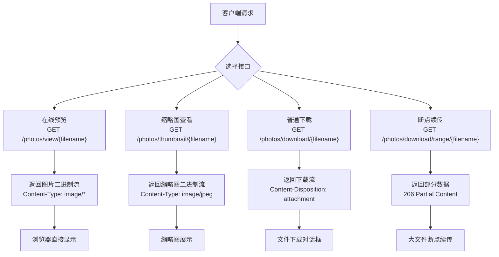
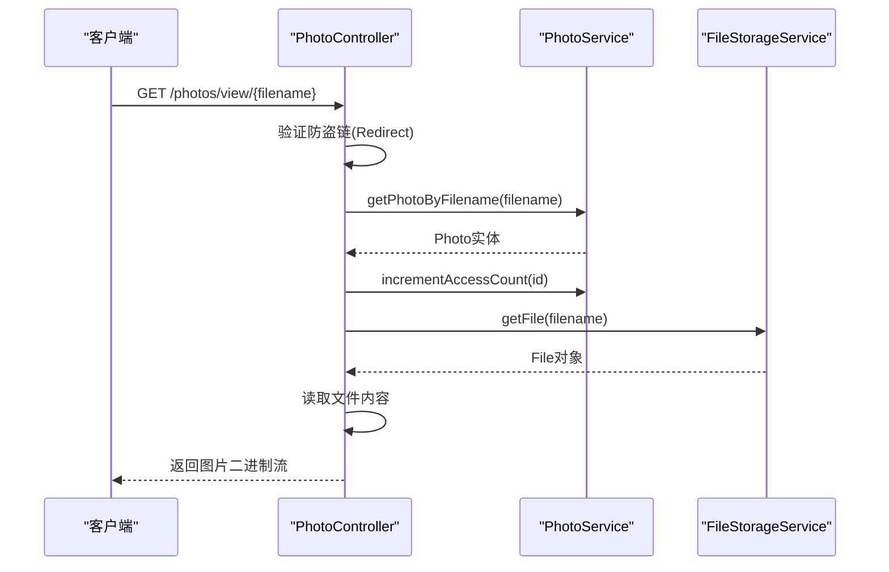
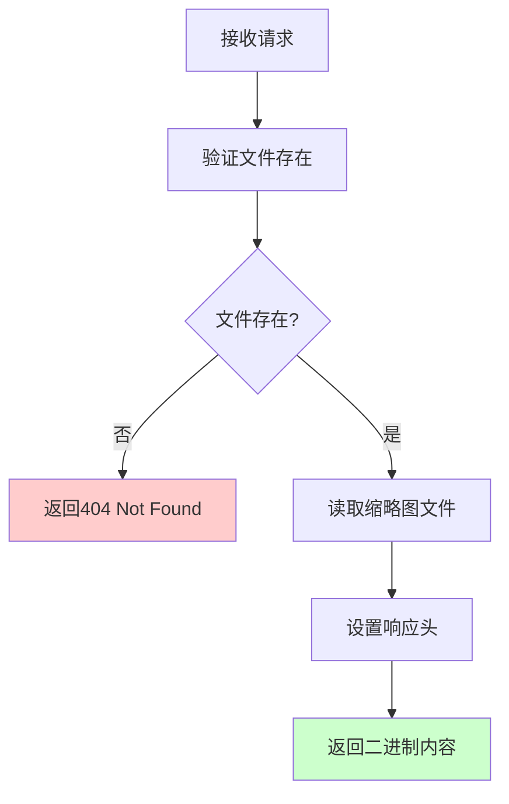
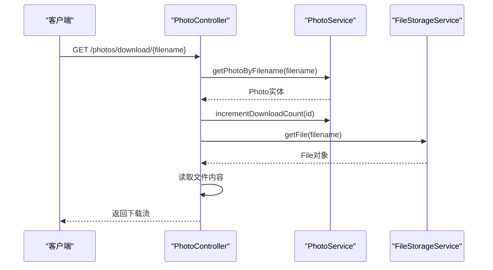
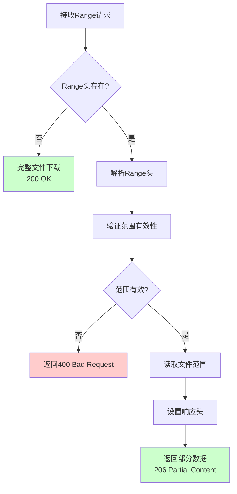
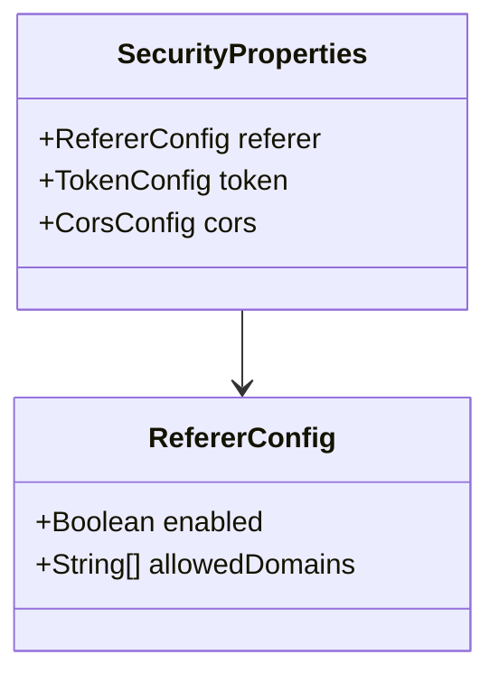
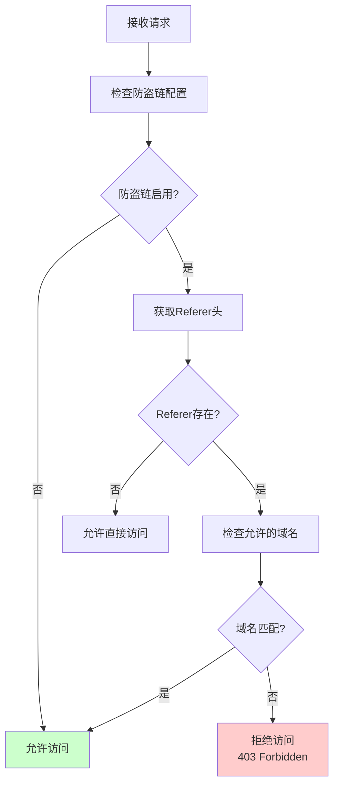
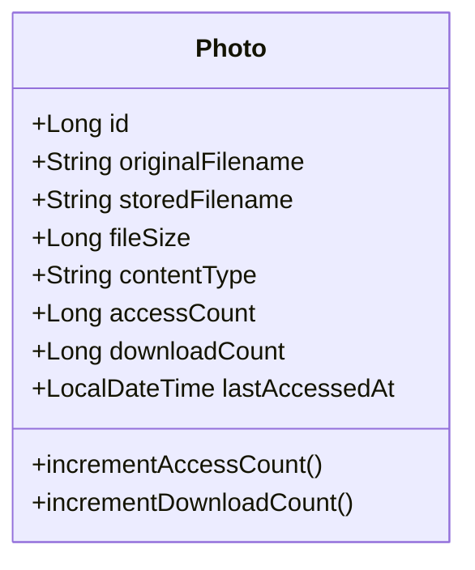
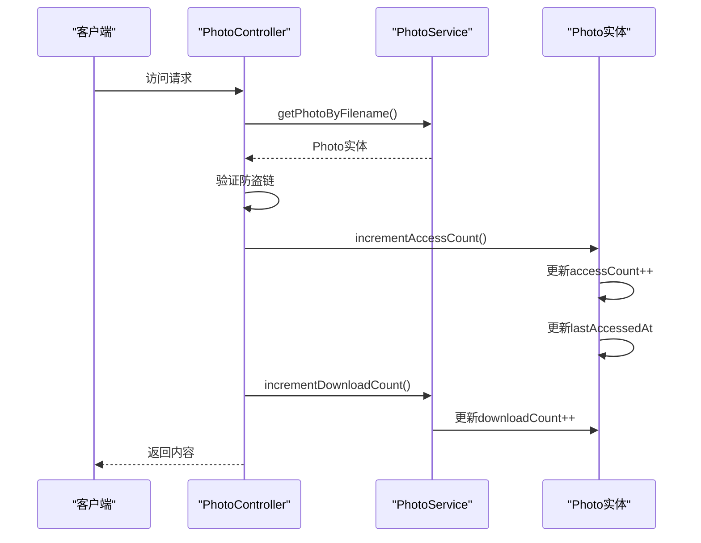
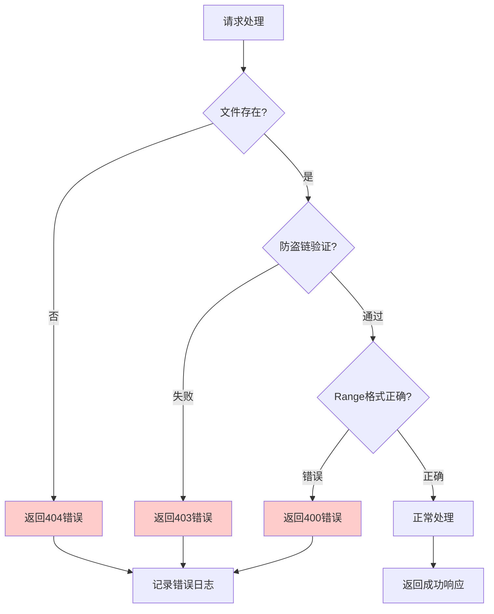

# 下载与预览接口

<cite>
**本文档引用的文件**
- [PhotoController.java](file://src/main/java/com/photo/controller/PhotoController.java)
- [API_DOCUMENTATION.md](file://API_DOCUMENTATION.md)
- [FileStorageService.java](file://src/main/java/com/photo/service/FileStorageService.java)
- [PhotoService.java](file://src/main/java/com/photo/service/PhotoService.java)
- [SecurityProperties.java](file://src/main/java/com/photo/config/SecurityProperties.java)
- [SecurityUtils.java](file://src/main/java/com/photo/util/SecurityUtils.java)
- [Photo.java](file://src/main/java/com/photo/entity/Photo.java)
- [application.yml](file://src/main/resources/application.yml)
</cite>

## 目录
1. [简介](#简介)
2. [接口概览](#接口概览)
3. [在线预览接口](#在线预览接口)
4. [缩略图查看接口](#缩略图查看接口)
5. [普通下载接口](#普通下载接口)
6. [断点续传下载接口](#断点续传下载接口)
7. [防盗链机制](#防盗链机制)
8. [访问统计机制](#访问统计机制)
9. [性能优化特性](#性能优化特性)
10. [错误处理](#错误处理)
11. [最佳实践](#最佳实践)

## 简介

本文档详细介绍了照片管理系统中的下载与预览相关接口，包括在线预览、缩略图查看、普通下载和断点续传下载四种核心功能。这些接口提供了完整的文件访问解决方案，支持多种访问场景和性能优化特性。

## 接口概览

系统提供以下四个主要的文件获取接口：

| 接口名称 | HTTP方法 | 路径模式 | 功能描述 |
|---------|---------|---------|---------|
| 在线预览 | GET | `/photos/view/{filename}` | 在浏览器中直接预览图片 |
| 缩略图查看 | GET | `/photos/thumbnail/{filename}` | 获取200x200像素缩略图 |
| 普通下载 | GET | `/photos/download/{filename}` | 下载原始文件 |
| 断点续传下载 | GET | `/photos/download/range/{filename}` | 支持Range请求的大文件下载 |



**图表来源**
- [PhotoController.java](file://src/main/java/com/photo/controller/PhotoController.java#L84-L225)

## 在线预览接口

### 接口详情

**接口地址**: `GET /photos/view/{filename}`

**功能描述**: 通过文件名在线预览照片，直接在浏览器中显示图片内容。

### 请求参数

| 参数名 | 类型 | 必填 | 说明 |
|-------|------|------|------|
| filename | String | 是 | 文件名（路径参数） |

### 响应内容

- **响应类型**: 直接返回图片二进制流
- **Content-Type**: 根据图片类型动态设置（如 `image/jpeg`, `image/png` 等）
- **Cache-Control**: `max-age=3600`（1小时缓存）

### 响应头说明

| 响应头 | 值 | 说明 |
|-------|---|------|
| Content-Type | image/* | 图片的MIME类型 |
| Cache-Control | max-age=3600 | 设置1小时缓存时间 |

### 实现机制



**图表来源**
- [PhotoController.java](file://src/main/java/com/photo/controller/PhotoController.java#L87-L116)

### 访问示例

**浏览器直接访问**:
```
http://localhost:8080/api/photos/view/abc123def456.jpg
```

**JavaScript示例**:
```javascript
// 在iframe中预览
const iframe = document.createElement('iframe');
iframe.src = '/api/photos/view/' + encodeURIComponent(filename);
iframe.width = '100%';
iframe.height = '500px';
document.body.appendChild(iframe);
```

**Python示例**:
```python
import requests

def preview_photo(filename):
    url = f'http://localhost:8080/api/photos/view/{filename}'
    response = requests.get(url)
    if response.status_code == 200:
        # 将响应内容保存为图片文件
        with open('preview.jpg', 'wb') as f:
            f.write(response.content)
```

**章节来源**
- [PhotoController.java](file://src/main/java/com/photo/controller/PhotoController.java#L84-L116)

## 缩略图查看接口

### 接口详情

**接口地址**: `GET /photos/thumbnail/{filename}`

**功能描述**: 获取照片的缩略图，尺寸固定为200x200像素，适用于列表展示和快速预览。

### 请求参数

| 参数名 | 类型 | 必填 | 说明 |
|-------|------|------|------|
| filename | String | 是 | 文件名（路径参数） |

### 响应内容

- **响应类型**: 返回缩略图二进制流
- **Content-Type**: `image/jpeg`（固定JPEG格式）
- **Cache-Control**: `max-age=7200`（2小时缓存）

### 响应头说明

| 响应头 | 值 | 说明 |
|-------|---|------|
| Content-Type | image/jpeg | 固定JPEG格式 |
| Cache-Control | max-age=7200 | 设置2小时缓存时间 |

### 实现机制



**图表来源**
- [PhotoController.java](file://src/main/java/com/photo/controller/PhotoController.java#L124-L143)

### 访问示例

**浏览器直接访问**:
```
http://localhost:8080/api/photos/thumbnail/abc123def456.jpg
```

**HTML img标签**:
```html

```

**章节来源**
- [PhotoController.java](file://src/main/java/com/photo/controller/PhotoController.java#L124-L143)

## 普通下载接口

### 接口详情

**接口地址**: `GET /photos/download/{filename}`

**功能描述**: 提供照片的原始文件下载功能，支持浏览器下载对话框和程序化下载。

### 请求参数

| 参数名 | 类型 | 必填 | 说明 |
|-------|------|------|------|
| filename | String | 是 | 文件名（路径参数） |

### 响应内容

- **响应类型**: 返回文件下载流
- **Content-Type**: `application/octet-stream`（二进制流）
- **Content-Disposition**: `attachment; filename="original_filename.jpg"`

### 响应头说明

| 响应头 | 值 | 说明 |
|-------|---|------|
| Content-Type | application/octet-stream | 二进制文件流 |
| Content-Disposition | attachment; filename="..." | 强制下载并指定文件名 |

### 实现机制



**图表来源**
- [PhotoController.java](file://src/main/java/com/photo/controller/PhotoController.java#L152-L178)

### 访问示例

**浏览器下载**:
```html
<a href="/api/photos/download/abc123def456.jpg" download="photo.jpg">
    下载原图
</a>
```

**JavaScript示例**:
```javascript
function downloadPhoto(filename) {
    const link = document.createElement('a');
    link.href = '/api/photos/download/' + encodeURIComponent(filename);
    link.download = filename;
    link.click();
}
```

**Python示例**:
```python
import requests

def download_photo(filename):
    url = f'http://localhost:8080/api/photos/download/{filename}'
    response = requests.get(url)
    
    if response.status_code == 200:
        with open(filename, 'wb') as f:
            f.write(response.content)
        print(f"下载完成: {filename}")
```

**章节来源**
- [PhotoController.java](file://src/main/java/com/photo/controller/PhotoController.java#L152-L178)

## 断点续传下载接口

### 接口详情

**接口地址**: `GET /photos/download/range/{filename}`

**功能描述**: 支持HTTP Range请求的断点续传下载，适合大文件下载场景，提高下载成功率和用户体验。

### 请求参数

| 参数名 | 类型 | 必填 | 说明 |
|-------|------|------|------|
| filename | String | 是 | 文件名（路径参数） |

### 请求头

| 请求头 | 类型 | 必填 | 说明 |
|-------|------|------|------|
| Range | String | 否 | 字节范围，如 "bytes=0-1023" |

### 响应内容

- **响应类型**: 返回指定范围的文件内容
- **Content-Type**: 根据文件类型动态设置
- **Content-Length**: 返回内容的实际长度
- **Content-Range**: `bytes start-end/fileSize`
- **Accept-Ranges**: `bytes`

### HTTP状态码

| 状态码 | 说明 |
|-------|------|
| 200 | 完整文件下载 |
| 206 | 部分内容下载 |

### Range请求头使用方式

**基本语法**: `bytes=start-end`

**示例**:
- `Range: bytes=0-1023`：下载前1024字节
- `Range: bytes=1024-2047`：下载第1025-2048字节
- `Range: bytes=1024-`：下载从第1025字节到文件末尾

### 实现机制



**图表来源**
- [PhotoController.java](file://src/main/java/com/photo/controller/PhotoController.java#L187-L224)

### 断点续传实现细节

**Range头解析逻辑**:
```java
// 解析Range头
long start = 0;
long end = fileSize - 1;

if (range != null && range.startsWith("bytes=")) {
    String[] ranges = range.substring(6).split("-");
    try {
        start = Long.parseLong(ranges[0]);
        if (ranges.length > 1 && !ranges[1].isEmpty()) {
            end = Long.parseLong(ranges[1]);
        }
    } catch (NumberFormatException e) {
        // 处理解析错误
    }
}
```

**响应头设置**:
```java
HttpHeaders headers = new HttpHeaders();
headers.setContentType(MediaType.parseMediaType(photo.getContentType()));
headers.setContentLength(content.length);
headers.set("Accept-Ranges", "bytes");
headers.set("Content-Range", String.format("bytes %d-%d/%d", start, end, fileSize));
```

### 访问示例

**cURL断点续传**:
```bash
# 下载前1024字节
curl -H "Range: bytes=0-1023" \
     http://localhost:8080/api/photos/download/range/abc123def456.jpg

# 下载第1024-2047字节
curl -H "Range: bytes=1024-2047" \
     http://localhost:8080/api/photos/download/range/abc123def456.jpg
```

**JavaScript实现**:
```javascript
async function downloadWithRange(filename, start, end) {
    const response = await fetch(`/api/photos/download/range/${filename}`, {
        headers: {
            'Range': `bytes=${start}-${end}`
        }
    });
    
    if (response.status === 206) {
        const blob = await response.blob();
        // 处理部分数据...
    }
}
```

**Python实现**:
```python
import requests

def download_range(filename, start, end):
    headers = {'Range': f'bytes={start}-{end}'}
    url = f'http://localhost:8080/api/photos/download/range/{filename}'
    
    response = requests.get(url, headers=headers)
    
    if response.status_code == 206:
        return response.content
    elif response.status_code == 200:
        # 整个文件下载
        return response.content
```

**章节来源**
- [PhotoController.java](file://src/main/java/com/photo/controller/PhotoController.java#L187-L224)
- [FileStorageService.java](file://src/main/java/com/photo/service/FileStorageService.java#L229-L256)

## 防盗链机制

### 机制概述

系统实现了基于Referer头部的防盗链保护，防止未经授权的外部网站直接访问资源。

### 配置结构



**图表来源**
- [SecurityProperties.java](file://src/main/java/com/photo/config/SecurityProperties.java#L17-L52)

### 验证流程



**图表来源**
- [SecurityUtils.java](file://src/main/java/com/photo/util/SecurityUtils.java#L62-L78)

### 默认配置

**application.yml配置**:
```yaml
security:
  referer:
    enabled: true
    allowed-domains:
      - localhost
      - 127.0.0.1
```

### 验证实现

**Referer验证逻辑**:
```java
public static boolean validateReferer(HttpServletRequest request, List<String> allowedDomains) {
    String referer = request.getHeader("Referer");
    
    // 如果没有Referer，允许直接访问
    if (!StringUtils.hasText(referer)) {
        return true;
    }
    
    // 检查Referer是否在允许列表中
    for (String domain : allowedDomains) {
        if (referer.contains(domain)) {
            return true;
        }
    }
    
    log.warn("非法Referer访问: {}", referer);
    return false;
}
```

### 防护效果

- **阻止外部网站直接访问**: 防止CDN滥用和流量盗用
- **支持多域名配置**: 可配置多个允许的域名
- **灵活的访问策略**: 可选择性启用或禁用防盗链

**章节来源**
- [SecurityUtils.java](file://src/main/java/com/photo/util/SecurityUtils.java#L62-L78)
- [PhotoController.java](file://src/main/java/com/photo/controller/PhotoController.java#L93-L96)

## 访问统计机制

### 统计维度

系统提供两个维度的访问统计：

| 统计指标 | 描述 | 实现方式 |
|---------|------|---------|
| 访问次数 | 照片被查看的总次数 | 每次访问递增计数器 |
| 下载次数 | 照片被下载的总次数 | 每次下载递增计数器 |
| 最后访问时间 | 最近一次访问的时间戳 | 自动更新时间戳 |

### 实体类设计



**图表来源**
- [Photo.java](file://src/main/java/com/photo/entity/Photo.java#L160-L172)

### 访问统计流程



**图表来源**
- [PhotoController.java](file://src/main/java/com/photo/controller/PhotoController.java#L99-L100)
- [PhotoController.java](file://src/main/java/com/photo/controller/PhotoController.java#L157-L158)

### 统计更新时机

**在线预览和缩略图**:
```java
// 在线预览时增加访问次数
Photo photo = photoService.getPhotoByFilename(filename);
photoService.incrementAccessCount(photo.getId());
```

**普通下载**:
```java
// 下载时增加下载次数
Photo photo = photoService.getPhotoByFilename(filename);
photoService.incrementDownloadCount(photo.getId());
```

### 数据持久化

访问统计信息会自动保存到数据库中，每次访问都会触发以下操作：

1. **访问次数递增**: `accessCount++`
2. **最后访问时间更新**: `lastAccessedAt = LocalDateTime.now()`
3. **下载次数递增**: `downloadCount++`

**章节来源**
- [Photo.java](file://src/main/java/com/photo/entity/Photo.java#L160-L172)
- [PhotoController.java](file://src/main/java/com/photo/controller/PhotoController.java#L99-L100)
- [PhotoController.java](file://src/main/java/com/photo/controller/PhotoController.java#L157-L158)

## 性能优化特性

### 缓存策略

**缩略图缓存**:
- 缓存时间: 2小时 (`max-age=7200`)
- 适用于频繁访问的小图片
- 减少CPU压缩计算开销

**在线预览缓存**:
- 缓存时间: 1小时 (`max-age=3600`)
- 适用于浏览场景
- 减少重复文件读取

### 压缩优化

**图片压缩**:
- 自动检测图片尺寸
- 超过1920x1080自动压缩
- 保持宽高比不变
- 可配置压缩质量(默认85%)

**缩略图生成**:
- 固定200x200像素
- JPEG格式优化
- 内存中高效处理

### 并发处理

**文件读取优化**:
```java
// 使用RandomAccessFile支持大文件断点续传
try (RandomAccessFile raf = new RandomAccessFile(file, "r")) {
    raf.seek(start);
    raf.readFully(buffer);
}
```

**内存管理**:
- 分块读取大文件
- 及时释放资源
- 避免内存溢出

### 网络优化

**压缩传输**:
```yaml
server:
  compression:
    enabled: true
    mime-types: text/html,text/xml,text/plain,text/css,application/javascript,application/json,image/svg+xml
```

**连接池配置**:
```yaml
server:
  tomcat:
    max-connections: 10000
    threads:
      max: 200
      min-spare: 10
```

## 错误处理

### 常见错误码

| 错误类型 | HTTP状态码 | 说明 |
|---------|-----------|------|
| 文件不存在 | 404 | 请求的文件不存在于服务器 |
| 非法访问来源 | 403 | Referer验证失败 |
| 请求参数错误 | 400 | Range头格式错误 |
| 服务器内部错误 | 500 | 文件读取或处理失败 |

### 错误响应格式

```json
{
    "code": 404,
    "message": "照片不存在: abc123def456.jpg",
    "data": null,
    "timestamp": 1704110400000
}
```

### 错误处理流程



### 日志记录

系统会记录详细的访问日志：
- 请求时间
- 客户端IP地址
- 文件名
- 操作类型
- 响应状态

**章节来源**
- [PhotoController.java](file://src/main/java/com/photo/controller/PhotoController.java#L114-L116)
- [PhotoController.java](file://src/main/java/com/photo/controller/PhotoController.java#L141-L143)

## 最佳实践

### 浏览器访问

**在线预览**:
```html
<!-- 直接在页面中显示 -->

```

**缩略图展示**:
```html
<!-- 列表中的缩略图 -->
<div class="photo-list">
    
</div>
```

### 程序化访问

**JavaScript下载**:
```javascript
// 创建隐藏的下载链接
function createDownloadLink(filename, originalName) {
    const link = document.createElement('a');
    link.href = `/api/photos/download/${filename}`;
    link.download = originalName;
    link.style.display = 'none';
    document.body.appendChild(link);
    return link;
}

// 批量下载
async function batchDownload(filenames) {
    for (const {filename, originalName} of filenames) {
        const link = createDownloadLink(filename, originalName);
        link.click();
        await new Promise(resolve => setTimeout(resolve, 100)); // 避免过快请求
    }
}
```

**Python批量处理**:
```python
import os
import requests
from concurrent.futures import ThreadPoolExecutor

def download_photos(photos_info, download_dir='downloads'):
    """批量下载照片"""
    os.makedirs(download_dir, exist_ok=True)
    
    def download_single(photo):
        filename = photo['storedFilename']
        original_name = photo['originalFilename']
        filepath = os.path.join(download_dir, original_name)
        
        url = f'http://localhost:8080/api/photos/download/{filename}'
        response = requests.get(url)
        
        if response.status_code == 200:
            with open(filepath, 'wb') as f:
                f.write(response.content)
            print(f"下载完成: {original_name}")
        else:
            print(f"下载失败: {original_name}")
    
    # 使用线程池并发下载
    with ThreadPoolExecutor(max_workers=5) as executor:
        executor.map(download_single, photos_info)
```

### 断点续传实现

**JavaScript实现**:
```javascript
class ResumableDownloader {
    constructor(url, chunkSize = 1024 * 1024) {
        this.url = url;
        this.chunkSize = chunkSize;
        this.downloadedChunks = [];
    }
    
    async download() {
        try {
            // 获取文件大小
            const fileSize = await this.getFileSize();
            
            // 并发下载各个块
            const chunks = Math.ceil(fileSize / this.chunkSize);
            const promises = [];
            
            for (let i = 0; i < chunks; i++) {
                const start = i * this.chunkSize;
                const end = Math.min(start + this.chunkSize - 1, fileSize - 1);
                
                promises.push(this.downloadChunk(start, end));
            }
            
            const results = await Promise.all(promises);
            return this.mergeChunks(results);
        } catch (error) {
            console.error('下载失败:', error);
            throw error;
        }
    }
    
    async downloadChunk(start, end) {
        const response = await fetch(this.url, {
            headers: {
                'Range': `bytes=${start}-${end}`
            }
        });
        
        if (response.status === 206) {
            return response.arrayBuffer();
        } else {
            throw new Error(`下载失败: ${response.status}`);
        }
    }
    
    mergeChunks(chunks) {
        return new Blob(chunks);
    }
    
    async getFileSize() {
        const response = await fetch(this.url, { method: 'HEAD' });
        const contentRange = response.headers.get('Content-Range');
        
        if (contentRange) {
            return parseInt(contentRange.split('/')[1]);
        } else {
            // 如果不支持Range，返回完整文件大小
            const contentLength = response.headers.get('Content-Length');
            return parseInt(contentLength);
        }
    }
}
```

### 性能优化建议

1. **合理设置缓存时间**: 根据文件更新频率调整Cache-Control
2. **使用CDN加速**: 将静态资源部署到CDN节点
3. **启用压缩传输**: 配置gzip压缩减少传输体积
4. **监控访问统计**: 定期分析访问模式优化资源配置
5. **定期清理过期文件**: 配置定时任务清理不需要的文件

### 安全注意事项

1. **验证文件类型**: 确保只处理允许的图片格式
2. **限制文件大小**: 防止大文件导致的性能问题
3. **防止路径遍历**: 验证文件名安全性
4. **启用防盗链**: 防止资源被盗用
5. **监控异常访问**: 记录和分析可疑访问行为