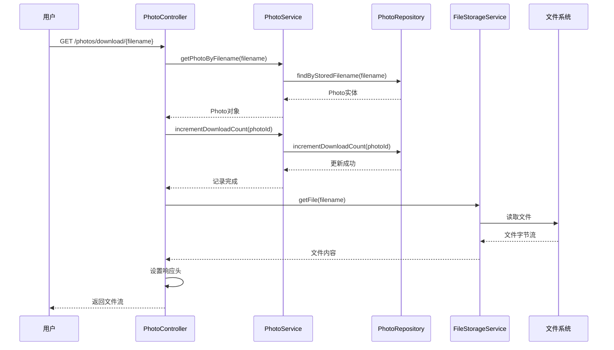

# 下载照片

<cite>
**本文档中引用的文件**
- [PhotoController.java](file://src/main/java/com/photo/controller/PhotoController.java)
- [PhotoService.java](file://src/main/java/com/photo/service/PhotoService.java)
- [PhotoRepository.java](file://src/main/java/com/photo/repository/PhotoRepository.java)
- [ApiResponse.java](file://src/main/java/com/photo/dto/ApiResponse.java)
- [PhotoControllerTest.java](file://src/test/java/com/photo/controller/PhotoControllerTest.java)
</cite>

## 目录
1. [接口概述](#接口概述)
2. [技术规范](#技术规范)
3. [业务流程](#业务流程)
4. [详细实现](#详细实现)
5. [响应示例](#响应示例)
6. [使用示例](#使用示例)
7. [错误处理](#错误处理)
8. [性能考虑](#性能考虑)
9. [安全注意事项](#安全注意事项)

## 接口概述

`downloadPhoto`接口是照片管理系统中的核心下载功能，允许用户通过文件名获取原始图片文件。该接口采用RESTful设计原则，提供直接的文件下载服务，同时记录用户的下载行为。

### 主要特性

- **HTTP方法**: GET
- **URL模式**: `/photos/download/{filename}`
- **路径参数**: `filename` - 目标文件的存储名称
- **响应类型**: 原始文件字节流
- **内容类型**: `application/octet-stream`
- **附件下载**: 通过Content-Disposition头设置为附件下载
- **原始文件名**: 保留原始文件名，确保下载后文件名正确

## 技术规范

### 请求规范

| 参数 | 类型 | 必填 | 描述 |
|------|------|------|------|
| filename | String | 是 | 文件的存储名称（不包含路径） |

### 响应规范

| 响应头 | 值 | 描述 |
|--------|-----|------|
| Content-Type | application/octet-stream | 二进制文件类型 |
| Content-Disposition | attachment; filename="原文件名" | 设置为附件下载 |
| Content-Length | 字节数 | 文件大小 |

### 状态码

| 状态码 | 描述 | 触发条件 |
|--------|------|----------|
| 200 | 成功 | 文件成功下载 |
| 500 | 内部错误 | 文件读取失败或系统异常 |

## 业务流程



**图表来源**
- [PhotoController.java](file://src/main/java/com/photo/controller/PhotoController.java#L145-L175)
- [PhotoService.java](file://src/main/java/com/photo/service/PhotoService.java#L140-L145)
- [PhotoRepository.java](file://src/main/java/com/photo/repository/PhotoRepository.java#L85-L87)

### 流程说明

1. **请求验证**: 接收带有文件名的下载请求
2. **文件查找**: 根据存储文件名查找对应的Photo实体
3. **统计更新**: 增加下载计数，记录用户下载行为
4. **文件读取**: 从文件系统读取原始文件
5. **响应设置**: 设置正确的HTTP响应头和内容类型
6. **文件传输**: 将文件内容作为字节流返回给客户端

**章节来源**
- [PhotoController.java](file://src/main/java/com/photo/controller/PhotoController.java#L145-L175)
- [PhotoService.java](file://src/main/java/com/photo/service/PhotoService.java#L140-L145)

## 详细实现

### 控制器层实现

控制器负责处理HTTP请求和响应，主要逻辑包括：

- **请求参数验证**: 确保文件名参数有效
- **防盗链检查**: 可选的安全验证机制
- **异常处理**: 统一的错误响应处理
- **响应头设置**: 正确设置Content-Type和Content-Disposition

### 服务层实现

服务层负责业务逻辑处理：

- **文件查找**: 通过文件名获取照片信息
- **下载计数**: 增加下载次数统计
- **权限验证**: 确保用户有权限访问该文件

### 数据访问层实现

数据访问层提供数据库操作：

- **文件查询**: 根据存储文件名查找照片记录
- **计数更新**: 原子性地增加下载计数

**章节来源**
- [PhotoController.java](file://src/main/java/com/photo/controller/PhotoController.java#L145-L175)
- [PhotoService.java](file://src/main/java/com/photo/service/PhotoService.java#L140-L145)
- [PhotoRepository.java](file://src/main/java/com/photo/repository/PhotoRepository.java#L85-L87)

## 响应示例

### 成功响应

当成功下载文件时，响应结构如下：

```
HTTP/1.1 200 OK
Content-Type: application/octet-stream
Content-Disposition: attachment; filename="example.jpg"; filename*=UTF-8''example.jpg
Content-Length: 1024000
Last-Modified: Wed, 21 Oct 2024 07:28:00 GMT
Cache-Control: no-cache, no-store, must-revalidate
Pragma: no-cache
Expires: 0

[文件字节流内容]
```

### 错误响应

当发生服务器内部错误时：

```
HTTP/1.1 500 Internal Server Error
Content-Type: application/json
Cache-Control: no-cache, no-store, must-revalidate
Pragma: no-cache
Expires: 0

{
    "code": 500,
    "message": "下载文件失败",
    "data": null,
    "timestamp": 1703123456789
}
```

**章节来源**
- [PhotoController.java](file://src/main/java/com/photo/controller/PhotoController.java#L145-L175)
- [ApiResponse.java](file://src/main/java/com/photo/dto/ApiResponse.java#L40-L50)

## 使用示例

### 浏览器访问

在浏览器地址栏输入：
```
https://your-domain.com/photos/download/example.jpg
```

浏览器将自动触发文件下载，文件名为`example.jpg`。

### wget命令行工具

```bash
# 基本下载
wget https://your-domain.com/photos/download/example.jpg

# 指定输出文件名
wget -O original_filename.jpg https://your-domain.com/photos/download/example.jpg

# 显示进度
wget --progress=bar https://your-domain.com/photos/download/example.jpg
```

### curl命令行工具

```bash
# 基本下载
curl -O https://your-domain.com/photos/download/example.jpg

# 指定输出文件名
curl -o original_filename.jpg https://your-domain.com/photos/download/example.jpg

# 包含用户代理
curl -A "Mozilla/5.0" -O https://your-domain.com/photos/download/example.jpg

# 显示详细信息
curl -v -O https://your-domain.com/photos/download/example.jpg
```

### JavaScript Fetch API

```javascript
// 基本下载
fetch('/photos/download/example.jpg')
  .then(response => {
    if (!response.ok) {
      throw new Error('下载失败');
    }
    return response.blob();
  })
  .then(blob => {
    const url = window.URL.createObjectURL(blob);
    const a = document.createElement('a');
    a.href = url;
    a.download = 'example.jpg';
    document.body.appendChild(a);
    a.click();
    a.remove();
  })
  .catch(error => console.error('下载错误:', error));
```

### Python Requests库

```python
import requests

# 基本下载
response = requests.get('https://your-domain.com/photos/download/example.jpg')
response.raise_for_status()

# 保存文件
with open('example.jpg', 'wb') as f:
    f.write(response.content)

# 或者指定文件名
filename = 'original_filename.jpg'
with open(filename, 'wb') as f:
    f.write(response.content)
```

## 错误处理

### 常见错误场景

| 错误类型 | HTTP状态码 | 原因 | 解决方案 |
|----------|------------|------|----------|
| 文件不存在 | 500 | 数据库中找不到对应文件 | 检查文件名是否正确，确认文件已上传 |
| 文件读取失败 | 500 | 文件系统访问异常 | 检查文件存储路径和权限 |
| 权限不足 | 403 | 用户无下载权限 | 验证用户身份和文件访问权限 |
| 参数错误 | 400 | 文件名参数缺失或无效 | 确保提供有效的文件名参数 |

### 异常处理机制

系统实现了多层次的异常处理：

1. **控制器层**: 捕获IOException并返回500错误
2. **服务层**: 处理业务逻辑异常
3. **数据访问层**: 处理数据库操作异常

**章节来源**
- [PhotoController.java](file://src/main/java/com/photo/controller/PhotoController.java#L165-L175)

## 性能考虑

### 缓存策略

- **文件缓存**: 利用Spring Cache机制缓存照片信息
- **响应缓存**: 设置适当的Cache-Control头
- **CDN支持**: 支持通过CDN加速文件下载

### 性能优化

- **内存管理**: 使用流式处理避免大文件内存占用
- **并发控制**: 合理配置线程池处理并发下载请求
- **存储优化**: 支持文件压缩和分块传输

### 监控指标

- **下载次数**: 统计每个文件的下载次数
- **响应时间**: 监控接口响应性能
- **错误率**: 跟踪下载失败率
- **存储使用**: 监控文件存储空间使用情况

**章节来源**
- [PhotoService.java](file://src/main/java/com/photo/service/PhotoService.java#L140-L145)

## 安全注意事项

### 访问控制

- **用户认证**: 确保只有授权用户可以下载文件
- **权限验证**: 检查用户是否有权访问特定文件
- **防盗链**: 可配置的Referer验证机制

### 数据保护

- **文件名编码**: 使用UTF-8编码处理特殊字符文件名
- **路径安全**: 防止路径遍历攻击
- **内容验证**: 确保下载的内容与声明的类型一致

### 审计日志

系统记录以下审计信息：
- 下载时间
- 用户IP地址
- 文件名和ID
- 下载结果

**章节来源**
- [PhotoController.java](file://src/main/java/com/photo/controller/PhotoController.java#L115-L125)