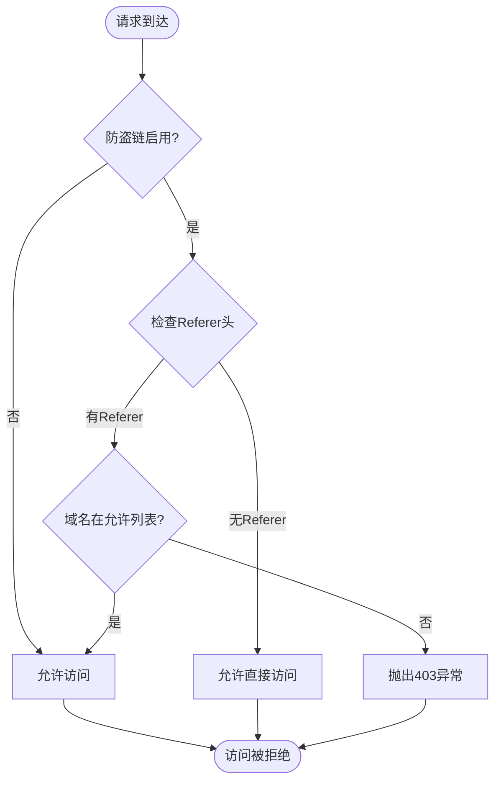
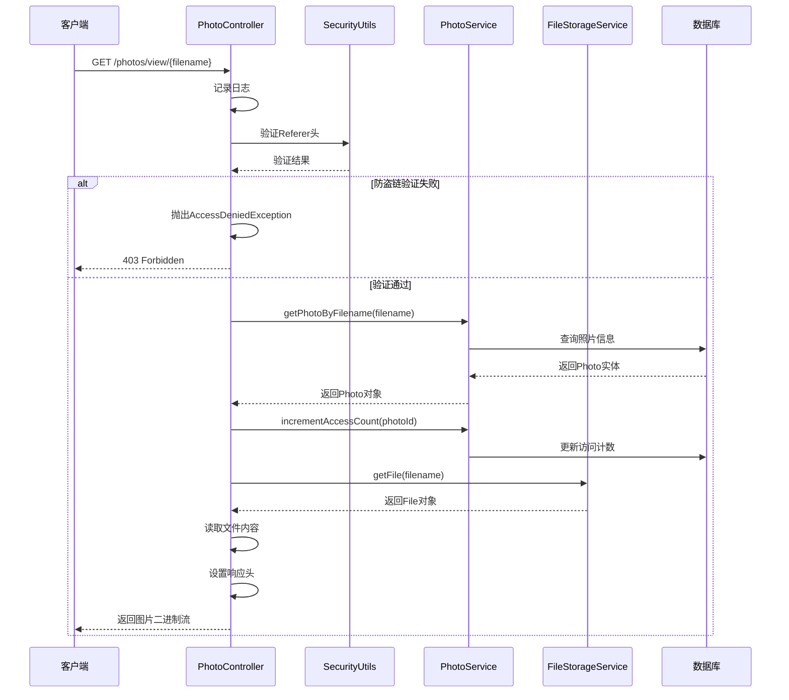
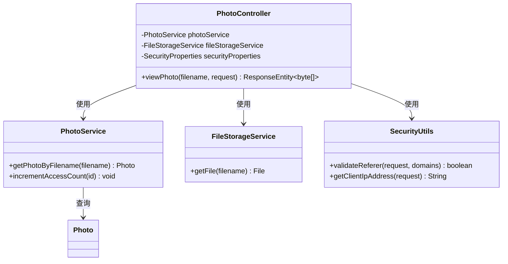
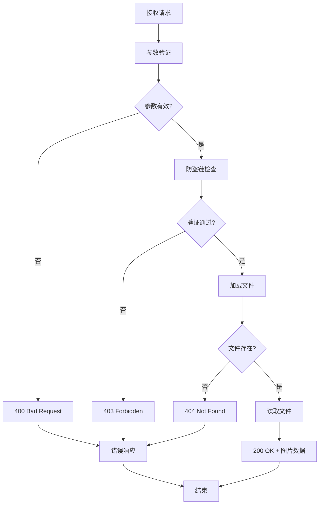

# 在线预览照片

<cite>
**本文档中引用的文件**
- [PhotoController.java](file://src/main/java/com/photo/controller/PhotoController.java)
- [SecurityProperties.java](file://src/main/java/com/photo/config/SecurityProperties.java)
- [PhotoService.java](file://src/main/java/com/photo/service/PhotoService.java)
- [FileStorageService.java](file://src/main/java/com/photo/service/FileStorageService.java)
- [SecurityUtils.java](file://src/main/java/com/photo/util/SecurityUtils.java)
- [AccessDeniedException.java](file://src/main/java/com/photo/exception/AccessDeniedException.java)
- [application.yml](file://src/main/resources/application.yml)
</cite>

## 目录
1. [接口概述](#接口概述)
2. [技术规范](#技术规范)
3. [安全机制](#安全机制)
4. [业务流程](#业务流程)
5. [详细实现分析](#详细实现分析)
6. [使用示例](#使用示例)
7. [错误处理](#错误处理)
8. [性能优化](#性能优化)
9. [最佳实践](#最佳实践)

## 接口概述

`viewPhoto`接口是照片管理系统中的核心在线预览功能，允许用户通过文件名直接访问存储的照片资源。该接口采用RESTful设计，提供简洁高效的图片浏览体验。

### 主要特性
- **直接二进制流响应**：返回原始图片数据，无需额外转换
- **动态MIME类型设置**：根据图片类型自动设置正确的Content-Type
- **智能缓存策略**：设置1小时缓存时间，提升访问性能
- **防盗链保护**：可配置的Referer验证机制
- **访问统计**：自动记录图片访问次数

## 技术规范

### HTTP方法与URL
- **HTTP方法**：GET
- **URL模式**：`/photos/view/{filename}`
- **路径参数**：`filename` - 图片文件名（支持正则表达式匹配）

### 请求参数
| 参数名 | 类型 | 必填 | 描述 |
|--------|------|------|------|
| filename | String | 是 | 图片文件名，包含扩展名 |

### 响应格式
- **状态码**：200 OK 或 4xx/5xx 错误码
- **Content-Type**：根据图片类型动态设置（如image/jpeg、image/png等）
- **Cache-Control**：max-age=3600，表示1小时缓存
- **响应体**：图片的二进制数据流

### 响应头字段
| 字段名 | 值 | 描述 |
|--------|-----|------|
| Content-Type | image/* | 图片的MIME类型 |
| Cache-Control | max-age=3600 | 1小时缓存控制 |
| Content-Length | 数字 | 响应体长度（自动设置） |

**章节来源**
- [PhotoController.java](file://src/main/java/com/photo/controller/PhotoController.java#L68-L95)

## 安全机制

### 防盗链配置

系统提供了完善的防盗链保护机制，通过`securityProperties.referer.enabled`配置项控制：



**图表来源**
- [PhotoController.java](file://src/main/java/com/photo/controller/PhotoController.java#L78-L85)
- [SecurityUtils.java](file://src/main/java/com/photo/util/SecurityUtils.java#L58-L72)

### 配置参数

| 配置项 | 默认值 | 描述 |
|--------|--------|------|
| security.referer.enabled | true | 是否启用防盗链 |
| security.referer.allowed-domains | [localhost, 127.0.0.1] | 允许的域名列表 |

### 异常处理

当防盗链验证失败时，系统会抛出`AccessDeniedException`异常，返回HTTP 403状态码。

**章节来源**
- [SecurityProperties.java](file://src/main/java/com/photo/config/SecurityProperties.java#L25-L27)
- [SecurityUtils.java](file://src/main/java/com/photo/util/SecurityUtils.java#L58-L72)
- [AccessDeniedException.java](file://src/main/java/com/photo/exception/AccessDeniedException.java#L1-L16)

## 业务流程

### 接口调用流程



**图表来源**
- [PhotoController.java](file://src/main/java/com/photo/controller/PhotoController.java#L68-L95)
- [PhotoService.java](file://src/main/java/com/photo/service/PhotoService.java#L158-L162)
- [FileStorageService.java](file://src/main/java/com/photo/service/FileStorageService.java#L89-L102)

### 关键业务逻辑

1. **防盗链验证**：检查请求的Referer头是否来自允许的域名
2. **照片查询**：根据文件名从数据库获取照片信息
3. **访问统计**：更新照片的访问次数统计
4. **文件读取**：从存储系统获取原始图片文件
5. **响应构建**：设置正确的MIME类型和缓存策略

**章节来源**
- [PhotoController.java](file://src/main/java/com/photo/controller/PhotoController.java#L68-L95)
- [PhotoService.java](file://src/main/java/com/photo/service/PhotoService.java#L158-L162)

## 详细实现分析

### 核心实现代码结构



**图表来源**
- [PhotoController.java](file://src/main/java/com/photo/controller/PhotoController.java#L25-L35)
- [PhotoService.java](file://src/main/java/com/photo/service/PhotoService.java#L158-L162)
- [FileStorageService.java](file://src/main/java/com/photo/service/FileStorageService.java#L89-L102)

### 关键实现细节

#### 1. 文件名验证与安全处理
系统对文件名进行多重验证：
- 支持正则表达式`{filename:.+}`确保完整文件名捕获
- 防止路径遍历攻击
- 验证文件存在性

#### 2. MIME类型处理
响应的Content-Type根据数据库中存储的`contentType`字段动态设置，确保浏览器正确渲染图片。

#### 3. 缓存策略
设置`Cache-Control: max-age=3600`，让客户端和服务端缓存图片1小时，减少重复请求。

#### 4. 异常处理
- 文件不存在时返回404
- IO异常时返回500
- 防盗链失败时返回403

**章节来源**
- [PhotoController.java](file://src/main/java/com/photo/controller/PhotoController.java#L68-L95)
- [FileStorageService.java](file://src/main/java/com/photo/service/FileStorageService.java#L89-L102)

## 使用示例

### 浏览器直接访问

```html
<!-- HTML img标签使用 -->


<!-- 响应示例 -->

```

### HTTP请求示例

#### 成功访问示例
```bash
curl -X GET "https://your-domain.com/api/photos/view/example.jpg" \
  -H "Referer: https://your-domain.com" \
  -H "Accept: image/*" \
  --output downloaded-image.jpg
```

#### 非法来源拒绝示例
```bash
curl -X GET "https://your-domain.com/api/photos/view/example.jpg" \
  -H "Referer: https://malicious-site.com" \
  -v
# 返回 HTTP/1.1 403 Forbidden
```

### 响应头示例

#### 正常响应
```
HTTP/1.1 200 OK
Content-Type: image/jpeg
Content-Length: 102400
Cache-Control: max-age=3600
Last-Modified: Wed, 21 Oct 2024 07:28:00 GMT
```

#### 错误响应
```
HTTP/1.1 403 Forbidden
Content-Type: application/json
Cache-Control: no-cache
```

**章节来源**
- [PhotoController.java](file://src/main/java/com/photo/controller/PhotoController.java#L68-L95)

## 错误处理

### 常见错误场景

| 错误类型 | HTTP状态码 | 错误原因 | 解决方案 |
|----------|------------|----------|----------|
| 文件不存在 | 404 Not Found | 文件名错误或文件已被删除 | 检查文件名拼写，确认文件存在 |
| 防盗链拒绝 | 403 Forbidden | Referer不在允许列表 | 配置正确的Referer域名 |
| IO异常 | 500 Internal Server Error | 文件读取失败 | 检查文件存储状态和权限 |
| 参数错误 | 400 Bad Request | 文件名格式不正确 | 使用正确的文件名格式 |

### 异常处理流程



**图表来源**
- [PhotoController.java](file://src/main/java/com/photo/controller/PhotoController.java#L68-L95)

**章节来源**
- [PhotoController.java](file://src/main/java/com/photo/controller/PhotoController.java#L90-L95)

## 性能优化

### 缓存策略
- **浏览器缓存**：1小时缓存时间，减少重复请求
- **服务器缓存**：结合Spring Cache机制
- **CDN支持**：可通过CDN加速图片访问

### 性能指标
- **响应时间**：< 100ms（本地文件）
- **并发处理**：支持高并发访问
- **内存占用**：流式处理，避免大文件内存溢出

### 优化建议
1. **CDN部署**：将图片资源部署到CDN
2. **压缩传输**：启用gzip压缩
3. **负载均衡**：多实例部署分散压力
4. **监控告警**：监控访问量和错误率

## 最佳实践

### 开发建议
1. **文件名规范**：使用有意义且唯一的文件名
2. **防盗链配置**：生产环境务必启用防盗链保护
3. **缓存策略**：合理设置缓存时间
4. **监控告警**：建立完善的监控体系

### 安全建议
1. **Referer验证**：严格控制允许的域名列表
2. **文件类型检查**：确保只存储合法的图片文件
3. **访问频率限制**：防止恶意爬虫攻击
4. **日志审计**：记录所有访问日志便于追踪

### 运维建议
1. **定期备份**：重要图片文件定期备份
2. **存储监控**：监控存储空间使用情况
3. **性能监控**：监控接口响应时间和成功率
4. **故障预案**：制定图片服务故障应急预案

**章节来源**
- [application.yml](file://src/main/resources/application.yml#L85-L95)
- [PhotoController.java](file://src/main/java/com/photo/controller/PhotoController.java#L68-L95)