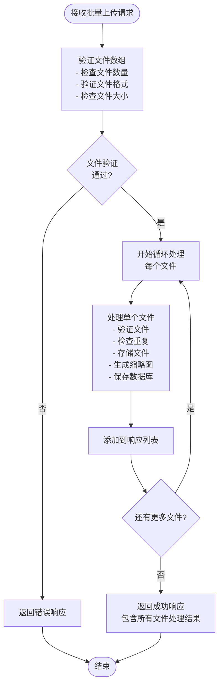

# 批量上传照片API文档

<cite>
**本文档引用的文件**
- [PhotoController.java](file://src/main/java/com/photo/controller/PhotoController.java)
- [PhotoUploadResponse.java](file://src/main/java/com/photo/dto/PhotoUploadResponse.java)
- [ApiResponse.java](file://src/main/java/com/photo/dto/ApiResponse.java)
- [PhotoService.java](file://src/main/java/com/photo/service/PhotoService.java)
- [FileStorageProperties.java](file://src/main/java/com/photo/config/FileStorageProperties.java)
- [application.yml](file://src/main/resources/application.yml)
- [FileUtils.java](file://src/main/java/com/photo/util/FileUtils.java)
- [PhotoControllerTest.java](file://src/test/java/com/photo/controller/PhotoControllerTest.java)
</cite>

## 目录
1. [接口概述](#接口概述)
2. [技术规范](#技术规范)
3. [请求参数详解](#请求参数详解)
4. [响应结构说明](#响应结构说明)
5. [错误响应场景](#错误响应场景)
6. [业务流程说明](#业务流程说明)
7. [客户端示例](#客户端示例)
8. [最佳实践建议](#最佳实践建议)

## 接口概述

### 接口功能
批量上传照片接口允许客户端一次性上传多个照片文件，提高用户上传效率。该接口内部会循环调用单文件上传逻辑，确保每个文件都经过完整的验证和处理流程。

### 接口特性
- **HTTP方法**: POST
- **URL模式**: `/photos/upload/batch`
- **请求格式**: `multipart/form-data`
- **认证要求**: 无需认证
- **并发处理**: 支持最多10个文件同时上传
- **文件限制**: 单文件最大10MB，总上传大小受系统配置限制

## 技术规范

### 请求头配置
```http
Content-Type: multipart/form-data
```

### URL参数
| 参数名 | 类型 | 必填 | 默认值 | 描述 |
|--------|------|------|--------|------|
| files | MultipartFile[] | 是 | - | 照片文件数组，最多10个文件 |
| userId | String | 否 | guest | 用户标识符 |
| description | String | 否 | - | 照片描述，应用于所有文件 |

### 文件限制配置
基于系统配置，以下是关键的文件上传限制：

| 限制类型 | 数值 | 配置项 |
|----------|------|--------|
| 单文件最大大小 | 10MB | `maxFileSize: 10485760` |
| 单次上传最大文件数 | 10个 | `maxFilesPerUpload: 10` |
| 总存储容量 | 10GB | `maxStorageSize: 10737418240` |
| 允许的文件类型 | JPG, PNG, GIF, BMP, WebP | `allowed-types`配置 |

**章节来源**
- [FileStorageProperties.java](file://src/main/java/com/photo/config/FileStorageProperties.java#L35-L40)
- [application.yml](file://src/main/resources/application.yml#L60-L65)

## 请求参数详解

### files参数
- **类型**: MultipartFile[]
- **必填**: 是
- **数量限制**: 最多10个文件
- **文件格式**: 支持JPG、PNG、GIF、BMP、WebP格式
- **文件大小**: 每个文件不超过10MB
- **验证规则**: 
  - 文件不能为空
  - 必须是有效的图片文件
  - 支持的MIME类型必须在允许列表中

### userId参数
- **类型**: String
- **必填**: 否
- **默认值**: "guest"
- **用途**: 标识上传者，用于权限管理和统计
- **长度限制**: 无明确限制，但建议保持合理长度

### description参数
- **类型**: String
- **必填**: 否
- **用途**: 为上传的所有文件添加统一描述信息
- **应用场景**: 批量上传时为所有文件设置相同的标签或描述

**章节来源**
- [PhotoController.java](file://src/main/java/com/photo/controller/PhotoController.java#L54-L62)
- [PhotoService.java](file://src/main/java/com/photo/service/PhotoService.java#L105-L115)

## 响应结构说明

### 成功响应结构
```json
{
  "code": 200,
  "message": "批量上传成功",
  "data": [
    {
      "id": 123,
      "originalFilename": "photo1.jpg",
      "storedFilename": "abc123def456.jpg",
      "fileSize": 1024000,
      "fileSizeReadable": "1.00 MB",
      "contentType": "image/jpeg",
      "url": "/api/photos/view/abc123def456.jpg",
      "thumbnailUrl": "/api/photos/thumbnail/abc123def456.jpg",
      "downloadUrl": "/api/photos/download/abc123def456.jpg",
      "width": 1920,
      "height": 1080,
      "uploadedAt": "2024-01-15T10:30:00",
      "md5": "abcdef1234567890"
    },
    {
      "id": 124,
      "originalFilename": "photo2.png",
      "storedFilename": "xyz789ghi012.png",
      "fileSize": 512000,
      "fileSizeReadable": "512.00 KB",
      "contentType": "image/png",
      "url": "/api/photos/view/xyz789ghi012.png",
      "thumbnailUrl": "/api/photos/thumbnail/xyz789ghi012.png",
      "downloadUrl": "/api/photos/download/xyz789ghi012.png",
      "width": 1280,
      "height": 720,
      "uploadedAt": "2024-01-15T10:30:01",
      "md5": "fedcba0987654321"
    }
  ],
  "timestamp": 1705283400000
}
```

### 响应字段说明

| 字段名 | 类型 | 描述 |
|--------|------|------|
| id | Long | 照片唯一标识符 |
| originalFilename | String | 原始文件名 |
| storedFilename | String | 系统存储的文件名 |
| fileSize | Long | 文件大小（字节） |
| fileSizeReadable | String | 可读格式的文件大小 |
| contentType | String | MIME类型 |
| url | String | 在线预览地址 |
| thumbnailUrl | String | 缩略图地址 |
| downloadUrl | String | 下载地址 |
| width | Integer | 图片宽度（像素） |
| height | Integer | 图片高度（像素） |
| uploadedAt | LocalDateTime | 上传时间 |
| md5 | String | 文件MD5校验值 |

**章节来源**
- [PhotoUploadResponse.java](file://src/main/java/com/photo/dto/PhotoUploadResponse.java#L10-L83)
- [ApiResponse.java](file://src/main/java/com/photo/dto/ApiResponse.java#L10-L62)

## 错误响应场景

### 1. 空文件数组
**请求**: 不提供files参数或提供空数组
**响应**:
```json
{
  "code": 500,
  "message": "文件不能为空",
  "data": null,
  "timestamp": 1705283400000
}
```

### 2. 超过文件数量限制
**请求**: 上传超过10个文件
**响应**:
```json
{
  "code": 500,
  "message": "单次上传文件数不能超过 10",
  "data": null,
  "timestamp": 1705283400000
}
```

### 3. 单文件过大
**请求**: 上传超过10MB的文件
**响应**:
```json
{
  "code": 500,
  "message": "文件大小不能超过 10.00 MB",
  "data": null,
  "timestamp": 1705283400000
}
```

### 4. 非图片文件
**请求**: 上传非图片格式文件
**响应**:
```json
{
  "code": 500,
  "message": "只允许上传图片文件",
  "data": null,
  "timestamp": 1705283400000
}
```

### 5. 存储空间不足
**请求**: 系统存储空间已满
**响应**:
```json
{
  "code": 500,
  "message": "存储空间不足",
  "data": null,
  "timestamp": 1705283400000
}
```

### 6. 文件损坏
**请求**: 上传损坏的图片文件
**响应**:
```json
{
  "code": 500,
  "message": "无效的图片文件",
  "data": null,
  "timestamp": 1705283400000
}
```

**章节来源**
- [PhotoService.java](file://src/main/java/com/photo/service/PhotoService.java#L105-L115)
- [FileUtils.java](file://src/main/java/com/photo/util/FileUtils.java#L50-L70)

## 业务流程说明

### 接口工作原理



**图表来源**
- [PhotoController.java](file://src/main/java/com/photo/controller/PhotoController.java#L54-L62)
- [PhotoService.java](file://src/main/java/com/photo/service/PhotoService.java#L105-L125)

### 内部处理机制

1. **文件验证阶段**
   - 检查文件数组是否为空
   - 验证文件数量不超过10个
   - 对每个文件进行格式和大小验证

2. **循环处理阶段**
   - 对每个文件调用`uploadPhoto()`方法
   - 单个文件处理包括：
     - 文件格式验证
     - 存储空间检查
     - MD5去重检查
     - 文件存储
     - 缩略图生成
     - 数据库记录保存

3. **结果收集阶段**
   - 将每个文件的处理结果收集到列表
   - 返回给客户端完整的处理结果

**章节来源**
- [PhotoService.java](file://src/main/java/com/photo/service/PhotoService.java#L105-L125)

## 客户端示例

### cURL 示例

#### 上传单个文件
```bash
curl -X POST "http://localhost:8080/api/photos/upload/batch" \
  -F "files=@photo1.jpg" \
  -F "files=@photo2.png" \
  -F "files=@photo3.gif" \
  -F "userId=testuser" \
  -F "description=我的相册"
```

#### 上传多个文件（最多10个）
```bash
curl -X POST "http://localhost:8080/api/photos/upload/batch" \
  -F "files=@photo1.jpg" \
  -F "files=@photo2.png" \
  -F "files=@photo3.gif" \
  -F "files=@photo4.jpg" \
  -F "files=@photo5.png" \
  -F "files=@photo6.gif" \
  -F "files=@photo7.jpg" \
  -F "files=@photo8.png" \
  -F "files=@photo9.gif" \
  -F "files=@photo10.jpg"
```

### JavaScript 示例

#### 使用Fetch API
```javascript
async function uploadPhotos(files, userId = 'guest', description = '') {
  const formData = new FormData();
  
  // 添加文件
  for (let i = 0; i < files.length && i < 10; i++) {
    formData.append('files', files[i]);
  }
  
  // 添加可选参数
  if (userId) formData.append('userId', userId);
  if (description) formData.append('description', description);
  
  try {
    const response = await fetch('/api/photos/upload/batch', {
      method: 'POST',
      body: formData
    });
    
    const result = await response.json();
    return result;
  } catch (error) {
    console.error('上传失败:', error);
    throw error;
  }
}

// 使用示例
const fileInput = document.getElementById('photo-upload');
const files = fileInput.files;

uploadPhotos(files, 'user123', '周末旅行')
  .then(result => {
    console.log('上传成功:', result.data);
  })
  .catch(error => {
    console.error('上传失败:', error.message);
  });
```

#### 使用Axios
```javascript
import axios from 'axios';

async function uploadPhotosWithAxios(files, userId = 'guest', description = '') {
  const formData = new FormData();
  
  // 添加文件
  Array.from(files).forEach((file, index) => {
    if (index >= 10) return; // 最多10个文件
    formData.append('files', file);
  });
  
  // 添加可选参数
  if (userId) formData.append('userId', userId);
  if (description) formData.append('description', description);
  
  try {
    const response = await axios.post('/api/photos/upload/batch', formData, {
      headers: {
        'Content-Type': 'multipart/form-data'
      }
    });
    
    return response.data;
  } catch (error) {
    console.error('上传失败:', error.response?.data || error.message);
    throw error;
  }
}
```

### Python 示例

#### 使用requests库
```python
import requests
from pathlib import Path

def upload_photos(file_paths, user_id='guest', description=''):
    """
    批量上传照片
    
    Args:
        file_paths: 文件路径列表
        user_id: 用户ID，默认为'guest'
        description: 照片描述
        
    Returns:
        dict: 包含上传结果的字典
    """
    url = "http://localhost:8080/api/photos/upload/batch"
    
    # 准备文件数据
    files = []
    for path in file_paths[:10]:  # 最多10个文件
        if Path(path).exists():
            files.append(('files', open(path, 'rb')))
    
    # 准备表单数据
    data = {}
    if user_id:
        data['userId'] = user_id
    if description:
        data['description'] = description
    
    try:
        response = requests.post(url, files=files, data=data)
        response.raise_for_status()
        
        result = response.json()
        return result
    except requests.exceptions.RequestException as e:
        print(f"上传失败: {e}")
        raise
    finally:
        # 关闭打开的文件
        for _, file_obj in files:
            file_obj.close()

# 使用示例
try:
    result = upload_photos(
        ['photo1.jpg', 'photo2.png', 'photo3.gif'],
        user_id='user123',
        description='家庭聚会'
    )
    print("上传成功:", result)
except Exception as e:
    print("上传失败:", str(e))
```

#### 使用aiohttp异步上传
```python
import aiohttp
import asyncio
from pathlib import Path

async def async_upload_photos(file_paths, user_id='guest', description=''):
    """
    异步批量上传照片
    """
    url = "http://localhost:8080/api/photos/upload/batch"
    
    # 准备文件数据
    file_data = []
    for path in file_paths[:10]:  # 最多10个文件
        if Path(path).exists():
            file_data.append(('files', open(path, 'rb')))
    
    # 准备表单数据
    data = {}
    if user_id:
        data['userId'] = user_id
    if description:
        data['description'] = description
    
    try:
        async with aiohttp.ClientSession() as session:
            async with session.post(url, data=data, files=file_data) as response:
                if response.status == 200:
                    result = await response.json()
                    return result
                else:
                    error_text = await response.text()
                    raise Exception(f"上传失败: {response.status} - {error_text}")
    except Exception as e:
        print(f"上传失败: {e}")
        raise
    finally:
        # 关闭打开的文件
        for _, file_obj in file_data:
            file_obj.close()

# 使用示例
async def main():
    try:
        result = await async_upload_photos(
            ['photo1.jpg', 'photo2.png', 'photo3.gif'],
            user_id='user123',
            description='周末活动'
        )
        print("上传成功:", result)
    except Exception as e:
        print("上传失败:", str(e))

# 运行异步函数
asyncio.run(main())
```

**章节来源**
- [PhotoControllerTest.java](file://src/test/java/com/photo/controller/PhotoControllerTest.java#L60-L80)

## 最佳实践建议

### 开发建议

1. **文件选择限制**
   - 在前端界面限制用户只能选择最多10个文件
   - 提供文件大小预览功能
   - 显示支持的文件格式提示

2. **进度反馈**
   - 实现上传进度条显示
   - 对于大量文件，考虑分批上传策略
   - 提供上传状态通知

3. **错误处理**
   - 实现重试机制处理网络异常
   - 分离显示成功和失败的文件
   - 提供详细的错误信息给用户

4. **性能优化**
   - 使用异步上传避免阻塞UI
   - 实现文件预处理（如压缩、格式转换）
   - 考虑使用CDN加速文件访问

### 安全考虑

1. **文件安全**
   - 验证文件真实类型而非仅依赖扩展名
   - 检查文件头部魔数
   - 防止恶意文件上传

2. **输入验证**
   - 严格验证所有输入参数
   - 防止路径遍历攻击
   - 限制文件名长度和字符集

3. **资源保护**
   - 设置合理的并发上传限制
   - 实现IP频率限制
   - 监控存储空间使用情况

### 部署建议

1. **配置优化**
   ```yaml
   spring:
     servlet:
       multipart:
         max-file-size: 10MB
         max-request-size: 50MB
   ```

2. **存储配置**
   ```yaml
   file:
     storage:
       max-file-size: 10485760
       max-files-per-upload: 10
       max-storage-size: 10737418240
   ```

3. **监控指标**
   - 上传成功率
   - 平均上传时间
   - 存储空间使用率
   - 错误类型分布

**章节来源**
- [application.yml](file://src/main/resources/application.yml#L60-L65)
- [FileStorageProperties.java](file://src/main/java/com/photo/config/FileStorageProperties.java#L35-L40)