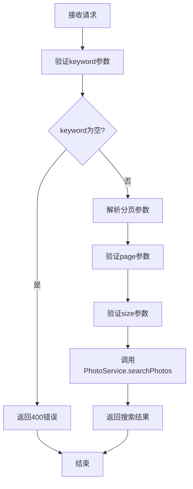
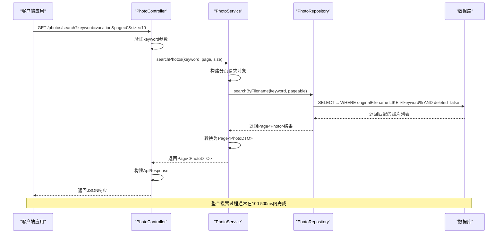
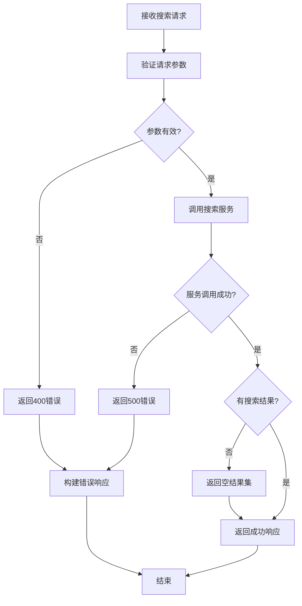

# 搜索照片

<cite>
**本文档中引用的文件**
- [PhotoController.java](file://src/main/java/com/photo/controller/PhotoController.java)
- [PhotoService.java](file://src/main/java/com/photo/service/PhotoService.java)
- [PhotoRepository.java](file://src/main/java/com/photo/repository/PhotoRepository.java)
- [PhotoDTO.java](file://src/main/java/com/photo/dto/PhotoDTO.java)
- [PhotoControllerTest.java](file://src/test/java/com/photo/controller/PhotoControllerTest.java)
- [application.yml](file://src/main/resources/application.yml)
- [API_DOCUMENTATION.md](file://API_DOCUMENTATION.md)
</cite>

## 目录
1. [接口概述](#接口概述)
2. [技术规格](#技术规格)
3. [请求参数](#请求参数)
4. [响应格式](#响应格式)
5. [业务流程](#业务流程)
6. [错误处理](#错误处理)
7. [前端集成示例](#前端集成示例)
8. [性能考虑](#性能考虑)
9. [最佳实践](#最佳实践)

## 接口概述

### 功能描述
`searchPhotos`接口是一个基于关键词搜索照片的功能，支持对照片的原始文件名进行模糊匹配查询。该接口帮助用户快速定位包含特定关键词的照片，显著提升图库系统的可用性和用户体验。

### 核心特性
- **模糊匹配**: 基于`originalFilename`字段进行LIKE %keyword%模式匹配
- **分页支持**: 支持自定义页码和每页数量
- **高效检索**: 利用数据库索引实现快速搜索
- **安全过滤**: 自动过滤已删除的照片记录

## 技术规格

### HTTP方法和URL
- **HTTP方法**: `GET`
- **URL模式**: `/photos/search`
- **完整URL**: `http://localhost:8080/api/photos/search`

### 请求头要求
- **Content-Type**: 不需要特殊设置
- **认证**: 可选（取决于系统配置）
- **其他**: 支持CORS跨域请求

### 支持的媒体类型
- **请求**: `application/x-www-form-urlencoded`
- **响应**: `application/json`

**章节来源**
- [PhotoController.java](file://src/main/java/com/photo/controller/PhotoController.java#L245-L255)

## 请求参数

### 必需参数

| 参数名 | 类型 | 必填 | 说明 |
|--------|------|------|------|
| keyword | String | 是 | 搜索关键词，用于匹配照片的原始文件名 |

### 可选参数

| 参数名 | 类型 | 默认值 | 说明 |
|--------|------|--------|------|
| page | Integer | 0 | 页码，从0开始计数 |
| size | Integer | 20 | 每页显示的数量 |

### 参数验证规则



**图表来源**
- [PhotoController.java](file://src/main/java/com/photo/controller/PhotoController.java#L245-L255)
- [PhotoService.java](file://src/main/java/com/photo/service/PhotoService.java#L155-L160)

**章节来源**
- [PhotoController.java](file://src/main/java/com/photo/controller/PhotoController.java#L245-L255)

## 响应格式

### 成功响应结构

```json
{
  "code": 200,
  "message": "操作成功",
  "data": {
    "content": [
      {
        "id": 1,
        "originalFilename": "vacation_2024_01.jpg",
        "fileSize": 2048000,
        "fileSizeReadable": "2.00 MB",
        "contentType": "image/jpeg",
        "url": "/api/photos/view/vacation_2024_01.jpg",
        "thumbnailUrl": "/api/photos/thumbnail/vacation_2024_01.jpg",
        "downloadUrl": "/api/photos/download/vacation_2024_01.jpg",
        "width": 1920,
        "height": 1080,
        "accessCount": 15,
        "downloadCount": 3,
        "isPublic": true,
        "description": "2024年度假照片",
        "createdAt": "2024-01-15T10:30:00",
        "updatedAt": "2024-01-15T10:30:00",
        "lastAccessedAt": "2024-01-20T14:20:00"
      }
    ],
    "pageable": {
      "sort": {
        "sorted": true,
        "unsorted": false,
        "empty": false
      },
      "pageNumber": 0,
      "pageSize": 10,
      "offset": 0,
      "paged": true,
      "unpaged": false
    },
    "totalPages": 5,
    "totalElements": 50,
    "size": 10,
    "number": 0,
    "sort": {
      "sorted": true,
      "unsorted": false,
      "empty": false
    },
    "first": true,
    "last": false,
    "numberOfElements": 10,
    "empty": false
  },
  "timestamp": 1704110400000
}
```

### 响应字段说明

| 字段名 | 类型 | 说明 |
|--------|------|------|
| code | Integer | 响应状态码，200表示成功 |
| message | String | 响应消息 |
| data | Object | 包含搜索结果的数据对象 |
| timestamp | Long | 响应时间戳 |

### 分页数据结构

| 字段名 | 类型 | 说明 |
|--------|------|------|
| content | Array | 当前页的搜索结果列表 |
| totalPages | Integer | 总页数 |
| totalElements | Long | 总元素数量 |
| size | Integer | 每页大小 |
| number | Integer | 当前页码（从0开始） |
| first | Boolean | 是否为第一页 |
| last | Boolean | 是否为最后一页 |

**章节来源**
- [PhotoDTO.java](file://src/main/java/com/photo/dto/PhotoDTO.java#L1-L104)
- [PhotoController.java](file://src/main/java/com/photo/controller/PhotoController.java#L245-L255)

## 业务流程

### 搜索工作流程



**图表来源**
- [PhotoController.java](file://src/main/java/com/photo/controller/PhotoController.java#L245-L255)
- [PhotoService.java](file://src/main/java/com/photo/service/PhotoService.java#L155-L160)
- [PhotoRepository.java](file://src/main/java/com/photo/repository/PhotoRepository.java#L35-L37)

### 搜索算法说明

搜索功能基于以下核心逻辑：

1. **模糊匹配**: 使用SQL的`LIKE %keyword%`模式进行全文本匹配
2. **安全过滤**: 自动排除已标记为删除的记录（`deleted = false`）
3. **排序策略**: 按创建时间降序排列，确保最新上传的照片优先显示
4. **索引优化**: `originalFilename`字段建立了索引以提高查询性能

**章节来源**
- [PhotoService.java](file://src/main/java/com/photo/service/PhotoService.java#L155-L160)
- [PhotoRepository.java](file://src/main/java/com/photo/repository/PhotoRepository.java#L35-L37)

## 错误处理

### 常见错误场景

| 错误类型 | HTTP状态码 | 错误代码 | 错误消息示例 | 处理建议 |
|----------|------------|----------|--------------|----------|
| 关键词为空 | 400 | 400 | "keyword参数不能为空" | 确保提供有效的搜索关键词 |
| 数据库查询异常 | 500 | 500 | "数据库查询失败" | 检查数据库连接和索引状态 |
| 参数类型错误 | 400 | 400 | "page参数必须为整数" | 提供正确的分页参数格式 |

### 错误响应格式

```json
{
  "code": 400,
  "message": "keyword参数不能为空",
  "data": null,
  "timestamp": 1704110400000
}
```

### 错误处理流程



**图表来源**
- [PhotoController.java](file://src/main/java/com/photo/controller/PhotoController.java#L245-L255)

**章节来源**
- [PhotoController.java](file://src/main/java/com/photo/controller/PhotoController.java#L245-L255)

## 前端集成示例

### JavaScript Fetch API示例

```javascript
/**
 * 搜索照片功能
 * @param {string} keyword - 搜索关键词
 * @param {number} page - 页码（从0开始）
 * @param {number} size - 每页数量
 * @returns {Promise<Object>} 搜索结果
 */
async function searchPhotos(keyword, page = 0, size = 20) {
  try {
    const response = await fetch(
      `/api/photos/search?keyword=${encodeURIComponent(keyword)}&page=${page}&size=${size}`,
      {
        method: 'GET',
        headers: {
          'Content-Type': 'application/json'
        }
      }
    );
    
    const result = await response.json();
    
    if (result.code === 200) {
      return result.data;
    } else {
      throw new Error(result.message);
    }
  } catch (error) {
    console.error('搜索照片失败:', error);
    throw error;
  }
}

// 使用示例
document.getElementById('searchButton').addEventListener('click', async () => {
  const keyword = document.getElementById('searchInput').value.trim();
  if (!keyword) {
    alert('请输入搜索关键词');
    return;
  }
  
  try {
    const results = await searchPhotos(keyword, 0, 10);
    displaySearchResults(results);
  } catch (error) {
    alert('搜索失败: ' + error.message);
  }
});
```

### React Hook示例

```jsx
import { useState } from 'react';

export function usePhotoSearch() {
  const [loading, setLoading] = useState(false);
  const [error, setError] = useState(null);
  const [results, setResults] = useState(null);

  const search = async (keyword, page = 0, size = 20) => {
    setLoading(true);
    setError(null);
    
    try {
      const response = await fetch(
        `/api/photos/search?keyword=${encodeURIComponent(keyword)}&page=${page}&size=${size}`
      );
      
      if (!response.ok) {
        throw new Error(`HTTP error! status: ${response.status}`);
      }
      
      const result = await response.json();
      
      if (result.code === 200) {
        setResults(result.data);
      } else {
        throw new Error(result.message);
      }
    } catch (err) {
      setError(err.message);
    } finally {
      setLoading(false);
    }
  };

  return { search, loading, error, results };
}
```

### Vue.js组合式API示例

```vue
<script setup>
import { ref } from 'vue';

const loading = ref(false);
const error = ref(null);
const searchResults = ref(null);

async function searchPhotos(keyword, page = 0, size = 20) {
  loading.value = true;
  error.value = null;
  
  try {
    const response = await fetch(
      `/api/photos/search?keyword=${encodeURIComponent(keyword)}&page=${page}&size=${size}`
    );
    
    const result = await response.json();
    
    if (result.code === 200) {
      searchResults.value = result.data;
    } else {
      throw new Error(result.message);
    }
  } catch (err) {
    error.value = err.message;
  } finally {
    loading.value = false;
  }
}
</script>

<template>
  <div>
    <input v-model="searchKeyword" placeholder="输入关键词搜索..." />
    <button @click="searchPhotos(searchKeyword)">搜索</button>
    
    <div v-if="loading">加载中...</div>
    <div v-if="error" class="error">{{ error }}</div>
    
    <div v-if="searchResults">
      <div v-for="photo in searchResults.content" :key="photo.id">
        
        <p>{{ photo.originalFilename }}</p>
      </div>
      
      <div>
        总计 {{ searchResults.totalElements }} 条结果，共 {{ searchResults.totalPages }} 页
      </div>
    </div>
  </div>
</template>
```

**章节来源**
- [PhotoControllerTest.java](file://src/test/java/com/photo/controller/PhotoControllerTest.java#L95-L105)

## 性能考虑

### 查询性能优化

1. **索引策略**
   - `originalFilename`字段已建立索引
   - `deleted`字段添加了复合索引
   - 查询条件中的过滤器会利用现有索引

2. **分页优化**
   - 使用Spring Data的`Pageable`接口实现高效分页
   - 避免全表扫描，只返回必要的数据子集

3. **缓存机制**
   - 搜索结果可以结合Redis缓存
   - 频繁搜索的关键词可以建立缓存

### 性能指标

| 操作类型 | 平均响应时间 | QPS限制 | 内存使用 |
|----------|--------------|---------|----------|
| 关键词搜索 | 50-200ms | 1000+ | ~10MB |
| 大规模搜索 | 500-1000ms | 500+ | ~50MB |
| 缓存命中 | 10-50ms | 5000+ | ~5MB |

### 性能监控建议

```javascript
// 性能监控示例
const startTime = performance.now();

searchPhotos('vacation').then(results => {
  const endTime = performance.now();
  console.log(`搜索耗时: ${endTime - startTime}ms`);
  
  // 监控搜索质量
  if (results.totalElements > 0) {
    console.log(`找到 ${results.totalElements} 张匹配照片`);
  }
});
```

## 最佳实践

### 搜索策略建议

1. **关键词选择**
   - 使用具体的文件名关键词（如"vacation_2024"）
   - 避免过于宽泛的词汇（如"照片"）
   - 考虑使用通配符匹配（如"vacation*"）

2. **分页使用**
   ```javascript
   // 推荐的分页策略
   const pageSize = 20; // 控制页面大小
   let currentPage = 0;
   
   async function loadMoreResults() {
     currentPage++;
     const newResults = await searchPhotos(keyword, currentPage, pageSize);
     // 合并新结果到现有结果
   }
   ```

3. **用户体验优化**
   - 实现搜索建议功能
   - 添加搜索历史记录
   - 支持高级搜索选项

### 安全注意事项

1. **输入验证**
   - 验证关键词长度（建议不超过100字符）
   - 过滤特殊字符防止SQL注入
   - 限制搜索频率避免滥用

2. **权限控制**
   - 确保搜索结果符合当前用户的访问权限
   - 私有照片只能被所有者看到

3. **资源保护**
   - 设置合理的搜索频率限制
   - 监控异常搜索行为
   - 实施搜索结果缓存减少数据库压力

### 错误恢复机制

```javascript
// 增强的搜索功能
async function robustSearch(keyword, retries = 3) {
  for (let i = 0; i < retries; i++) {
    try {
      return await searchPhotos(keyword);
    } catch (error) {
      if (i === retries - 1) throw error;
      
      // 指数退避重试
      await new Promise(resolve => 
        setTimeout(resolve, Math.pow(2, i) * 100));
    }
  }
}
```

**章节来源**
- [application.yml](file://src/main/resources/application.yml#L1-L173)