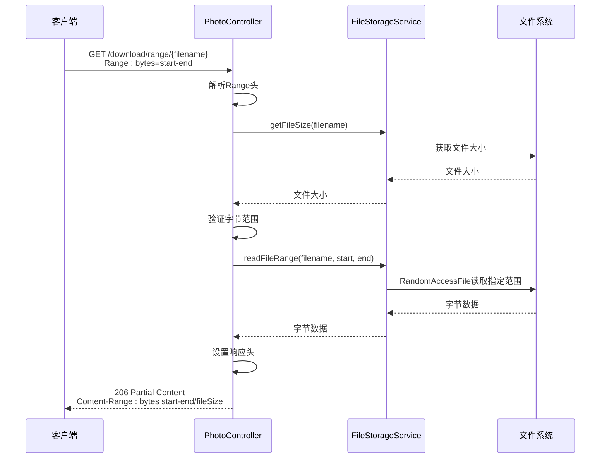
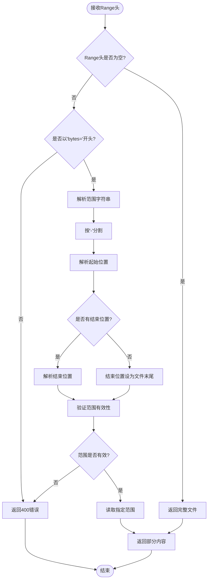
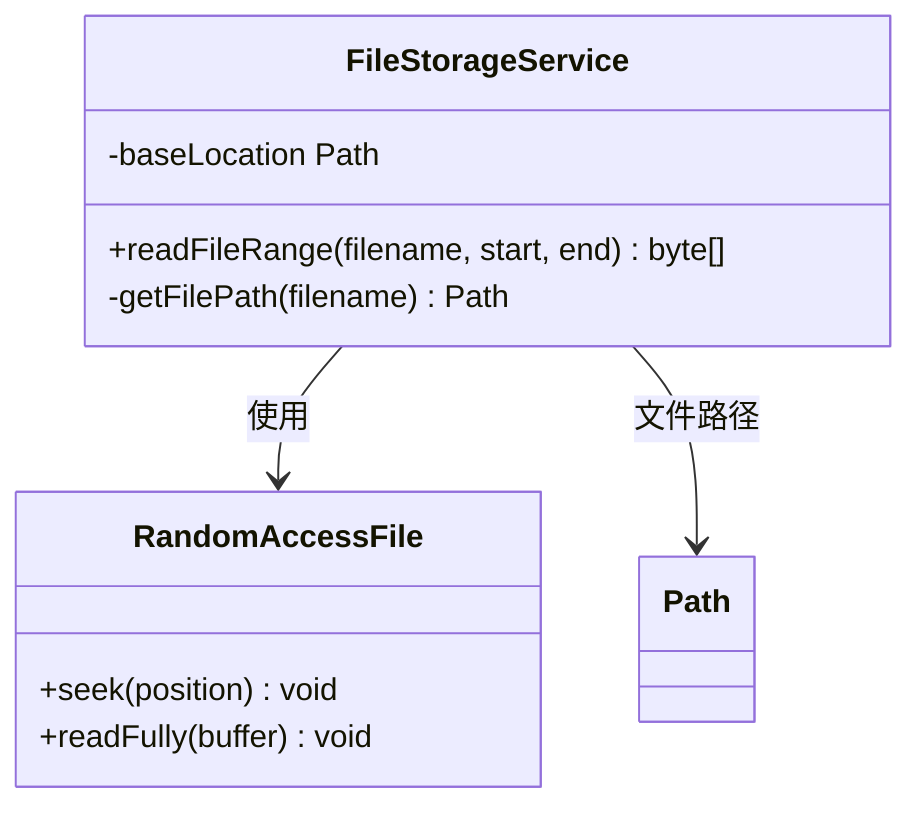
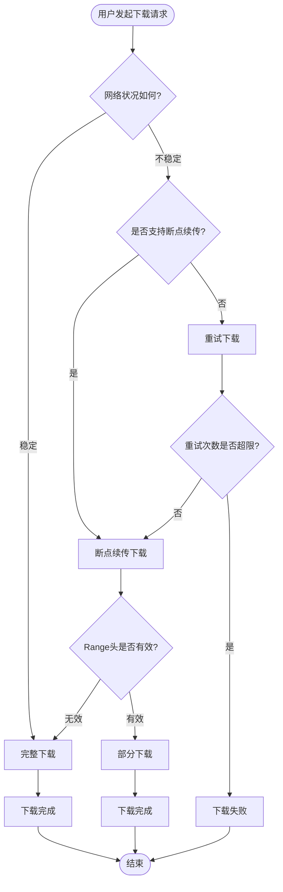

# 断点续传下载

<cite>
**本文档引用的文件**
- [PhotoController.java](file://src/main/java/com/photo/controller/PhotoController.java)
- [FileStorageService.java](file://src/main/java/com/photo/service/FileStorageService.java)
- [application.yml](file://src/main/resources/application.yml)
- [README.md](file://README.md)
- [PhotoControllerTest.java](file://src/test/java/com/photo/controller/PhotoControllerTest.java)
- [ApiResponse.java](file://src/main/java/com/photo/dto/ApiResponse.java)
</cite>

## 目录
1. [接口概述](#接口概述)
2. [技术规范](#技术规范)
3. [详细实现分析](#详细实现分析)
4. [请求响应格式](#请求响应格式)
5. [使用示例](#使用示例)
6. [业务流程说明](#业务流程说明)
7. [性能考虑](#性能考虑)
8. [故障排除指南](#故障排除指南)
9. [总结](#总结)

## 接口概述

### 接口名称
断点续传下载

### HTTP方法
GET

### URL模式
`/api/photos/download/range/{filename}`

### 功能描述
该接口支持HTTP Range请求头，实现大文件的分段下载和断点续传功能。当客户端发送带有Range头的请求时，服务器只返回指定字节范围的内容；否则返回完整文件内容。

### 支持特性
- **Range请求支持**：解析HTTP Range头，支持字节范围下载
- **断点续传**：在网络中断后可以从上次中断的位置继续下载
- **高效传输**：只传输需要的部分数据，节省带宽
- **灵活配置**：支持任意字节范围的精确控制

## 技术规范

### 请求参数

| 参数名 | 类型 | 必填 | 位置 | 描述 |
|--------|------|------|------|------|
| filename | String | 是 | 路径参数 | 要下载的文件名 |
| Range | String | 否 | 请求头 | 字节范围请求，格式：bytes=start-end |

### Range头格式规范

**标准格式**：
```
Range: bytes=startByte-endByte
```

**参数说明**：
- `startByte`：起始字节位置（从0开始）
- `endByte`：结束字节位置（包含该位置）
- 如果省略`endByte`，表示到文件末尾

**有效示例**：
- `bytes=0-1023`：下载前1024字节
- `bytes=1024-2047`：下载第1025到第2048字节
- `bytes=1024-`：从第1025字节开始到文件末尾
- `bytes=-1024`：下载最后1024字节

### 响应状态码

| 状态码 | 含义 | 触发条件 |
|--------|------|----------|
| 206 | Partial Content | 当Range头存在且解析成功 |
| 200 | OK | 当没有Range头或Range头无效 |
| 400 | Bad Request | Range头格式错误 |
| 404 | Not Found | 文件不存在 |
| 500 | Internal Server Error | 服务器内部错误 |

### 响应头字段

| 字段名 | 值 | 描述 |
|--------|-----|------|
| Content-Type | application/octet-stream | 二进制流类型 |
| Content-Length | 数字 | 实际返回内容的字节数 |
| Accept-Ranges | bytes | 服务器支持字节范围请求 |
| Content-Range | bytes start-end/fileSize | 返回的实际字节范围 |

## 详细实现分析

### 核心实现架构



**图表来源**
- [PhotoController.java](file://src/main/java/com/photo/controller/PhotoController.java#L183-L224)
- [FileStorageService.java](file://src/main/java/com/photo/service/FileStorageService.java#L225-L260)

### Range头解析逻辑

接口实现了完整的Range头解析逻辑：



**图表来源**
- [PhotoController.java](file://src/main/java/com/photo/controller/PhotoController.java#L195-L210)

### 文件读取优化

FileStorageService提供了高效的文件范围读取功能：



**图表来源**
- [FileStorageService.java](file://src/main/java/com/photo/service/FileStorageService.java#L225-L260)

**章节来源**
- [PhotoController.java](file://src/main/java/com/photo/controller/PhotoController.java#L183-L224)
- [FileStorageService.java](file://src/main/java/com/photo/service/FileStorageService.java#L225-L260)

## 请求响应格式

### 请求格式

**基本请求**：
```
GET /api/photos/download/range/example.jpg
Host: localhost:8080
Range: bytes=0-1023
```

**无Range头的请求**：
```
GET /api/photos/download/range/example.jpg
Host: localhost:8080
```

### 响应格式

**带Range头的成功响应**：
```
HTTP/1.1 206 Partial Content
Content-Type: image/jpeg
Content-Length: 1024
Content-Range: bytes 0-1023/1048576
Accept-Ranges: bytes
Last-Modified: Wed, 21 Oct 2024 07:28:00 GMT
Cache-Control: max-age=3600
Connection: keep-alive

[二进制文件内容，1024字节]
```

**无Range头的响应**：
```
HTTP/1.1 200 OK
Content-Type: image/jpeg
Content-Length: 1048576
Accept-Ranges: bytes
Last-Modified: Wed, 21 Oct 2024 07:28:00 GMT
Cache-Control: max-age=3600
Connection: keep-alive

[完整文件内容，1048576字节]
```

**错误响应**：
```
HTTP/1.1 400 Bad Request
Content-Type: text/plain
Content-Length: 0

[空内容]
```

## 使用示例

### curl命令示例

**下载文件的前1KB**：
```bash
curl -H 'Range: bytes=0-1023' \
     -o partial_download.bin \
     http://localhost:8080/api/photos/download/range/large_image.jpg
```

**下载文件的第2KB到第4KB**：
```bash
curl -H 'Range: bytes=2048-4095' \
     -o middle_section.bin \
     http://localhost:8080/api/photos/download/range/video.mp4
```

**下载文件的最后100字节**：
```bash
curl -H 'Range: bytes=-100' \
     -o tail_section.bin \
     http://localhost:8080/api/photos/download/range/document.pdf
```

**完整下载（不使用Range）**：
```bash
curl -o full_file.zip \
     http://localhost:8080/api/photos/download/range/archive.zip
```

### JavaScript示例

**使用Fetch API实现断点续传**：
```javascript
async function downloadWithResume(filename, resumePosition = 0) {
    const url = `/api/photos/download/range/${filename}`;
    const headers = {};
    
    if (resumePosition > 0) {
        headers.Range = `bytes=${resumePosition}-`;
    }
    
    try {
        const response = await fetch(url, { headers });
        
        if (response.status === 206) {
            console.log('开始断点续传下载');
        } else if (response.status === 200) {
            console.log('开始完整文件下载');
        }
        
        const blob = await response.blob();
        return blob;
    } catch (error) {
        console.error('下载失败:', error);
        throw error;
    }
}
```

### Python示例

**使用requests库实现分段下载**：
```python
import requests

def download_range(url, start_byte, end_byte):
    """下载指定范围的文件"""
    headers = {'Range': f'bytes={start_byte}-{end_byte}'}
    
    response = requests.get(url, headers=headers, stream=True)
    
    if response.status_code == 206:
        print(f"成功下载字节范围: {start_byte}-{end_byte}")
        return response.content
    elif response.status_code == 200:
        print("下载完整文件")
        return response.content
    else:
        raise Exception(f"下载失败: 状态码 {response.status_code}")

# 示例：下载前1MB
url = "http://localhost:8080/api/photos/download/range/large_file.iso"
content = download_range(url, 0, 1024*1024-1)
```

## 业务流程说明

### 断点续传的应用场景

1. **大文件下载优化**
   - 支持超过10MB的大文件下载
   - 分段传输减少网络压力
   - 提高下载成功率

2. **网络不稳定环境**
   - 网络中断后自动恢复
   - 减少重复传输的数据量
   - 提升用户体验

3. **移动设备优化**
   - 移动网络环境下的智能下载
   - 根据网络状况调整下载策略
   - 节省流量消耗

### 业务流程图



### 性能优势

1. **带宽效率**：只传输需要的数据，避免浪费带宽
2. **内存优化**：大文件分段处理，降低内存占用
3. **并发支持**：多个客户端可以同时下载不同部分
4. **容错能力**：网络中断后可以快速恢复

**章节来源**
- [README.md](file://README.md#L1-L50)

## 性能考虑

### 内存使用优化

- **流式处理**：使用RandomAccessFile进行随机访问，避免加载整个文件到内存
- **缓冲区管理**：根据Range大小动态分配合适的缓冲区
- **及时释放**：处理完成后立即释放资源

### 并发处理

- **无锁设计**：文件读取操作是线程安全的
- **资源复用**：RandomAccessFile实例可以在多次调用间复用
- **连接池**：HTTP连接可以保持打开状态进行多次Range请求

### 存储优化

- **文件系统缓存**：利用操作系统文件系统缓存提高读取速度
- **预读策略**：对于连续的Range请求，可以实现预读优化
- **压缩支持**：结合文件压缩算法进一步减少传输数据量

## 故障排除指南

### 常见问题及解决方案

**问题1：Range头解析失败**
- **症状**：返回400 Bad Request
- **原因**：Range头格式不正确
- **解决**：确保Range头符合`bytes=start-end`格式

**问题2：文件不存在**
- **症状**：返回404 Not Found
- **原因**：指定的文件名不存在于系统中
- **解决**：确认文件名正确，检查文件是否被删除

**问题3：字节范围超出文件大小**
- **症状**：返回200但内容为空
- **原因**：请求的字节范围超出了文件的实际大小
- **解决**：调整Range头，确保范围在文件大小范围内

**问题4：下载速度慢**
- **症状**：断点续传速度不如预期
- **可能原因**：
  - 网络延迟较高
  - 服务器负载过高
  - 文件存储位置分散
- **解决方案**：
  - 优化网络连接
  - 增加服务器资源
  - 使用分布式存储

### 调试技巧

**启用详细日志**：
```yaml
logging:
  level:
    com.photo: DEBUG
```

**监控Range请求统计**：
- 记录Range请求的频率和分布
- 分析最常用的字节范围
- 优化缓存策略

**性能基准测试**：
```bash
# 测试不同Range大小的性能
for i in {0..10}; do
    curl -w "@curl-format.txt" \
         -H 'Range: bytes='"$((i*1024*1024))-'"$(((i+1)*1024*1024-1))"' \
         -o /dev/null \
         http://localhost:8080/api/photos/download/range/large_file.bin
done
```

**章节来源**
- [PhotoController.java](file://src/main/java/com/photo/controller/PhotoController.java#L205-L210)
- [FileStorageService.java](file://src/main/java/com/photo/service/FileStorageService.java#L225-L260)

## 总结

PhotoController的`downloadPhotoWithRange`接口提供了完整的HTTP Range请求支持，实现了高效的断点续传下载功能。该接口具有以下核心优势：

### 技术优势
- **标准兼容**：完全遵循HTTP Range请求规范
- **性能优化**：采用RandomAccessFile实现高效的文件范围读取
- **错误处理**：完善的Range头解析和验证机制
- **响应优化**：正确的HTTP状态码和响应头设置

### 业务价值
- **用户体验**：支持大文件的可靠下载，提升用户满意度
- **网络适应性**：在网络不稳定环境下仍能保证下载成功率
- **资源节约**：减少不必要的数据传输，优化带宽使用
- **扩展性强**：支持各种下载场景和客户端需求

### 应用建议
1. **客户端实现**：建议在客户端实现断点续传逻辑，提高下载可靠性
2. **服务器配置**：合理配置文件存储路径和缓存策略
3. **监控告警**：建立Range请求的监控体系，及时发现和解决问题
4. **性能调优**：根据实际使用情况优化服务器性能参数

该接口作为照片上传下载系统的重要组成部分，为用户提供了一个稳定、高效的文件下载解决方案，特别适合处理大文件和网络环境不稳定的场景。