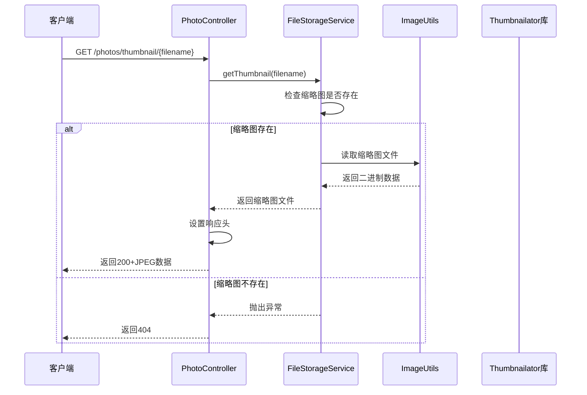
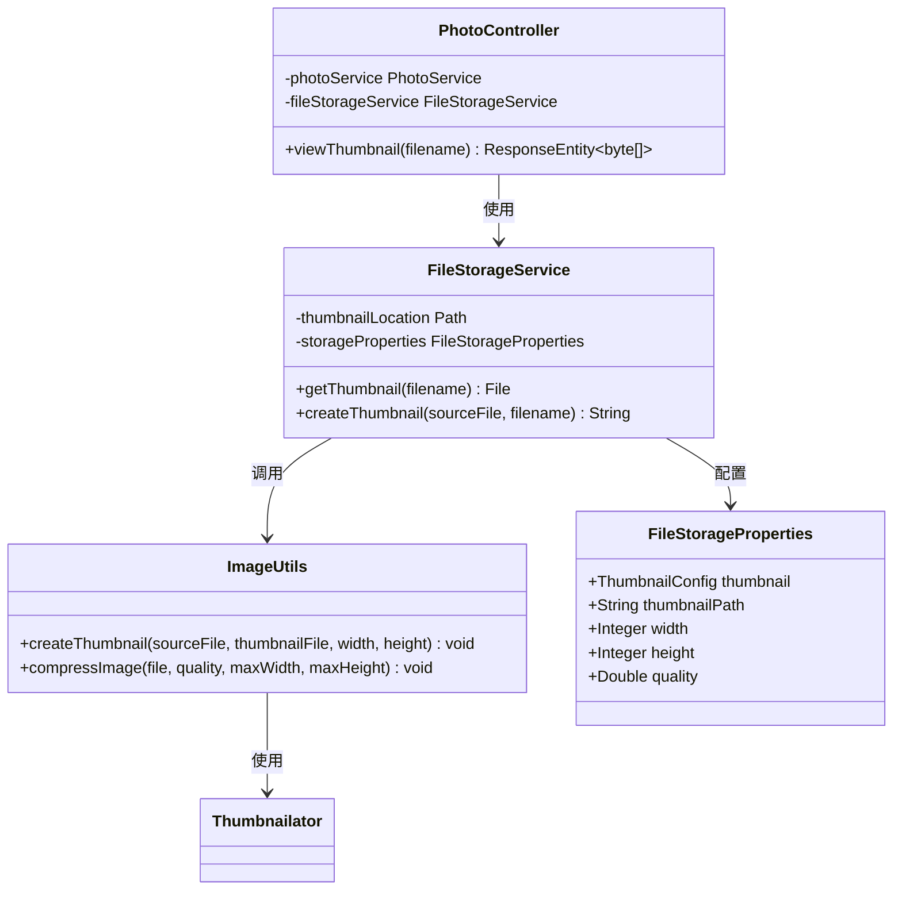

# 查看缩略图 API 文档

<cite>
**本文档引用的文件**
- [PhotoController.java](file://src/main/java/com/photo/controller/PhotoController.java)
- [FileStorageService.java](file://src/main/java/com/photo/service/FileStorageService.java)
- [ImageUtils.java](file://src/main/java/com/photo/util/ImageUtils.java)
- [FileStorageProperties.java](file://src/main/java/com/photo/config/FileStorageProperties.java)
- [application.yml](file://src/main/resources/application.yml)
</cite>

## 接口概述

### 接口名称
查看缩略图

### HTTP 方法
GET

### URL 模式
`/photos/thumbnail/{filename}`

### 路径参数
- `filename` (String): 目标照片的文件名（必需）

### 功能描述
该接口用于获取指定照片的200x200像素缩略图，返回JPEG格式的二进制流。缩略图由FileStorageService调用Thumbnailator库生成并缓存，具有两小时的缓存时间。

## 响应规范

### 成功响应
- **状态码**: 200 OK
- **Content-Type**: image/jpeg
- **缓存策略**: 设置两小时缓存（7200秒）
- **响应体**: JPEG格式的缩略图二进制数据

### 错误响应
- **状态码**: 404 Not Found
- **Content-Type**: text/plain
- **响应体**: 错误信息

## 技术实现细节

### 缩略图生成机制



**图表来源**
- [PhotoController.java](file://src/main/java/com/photo/controller/PhotoController.java#L115-L140)
- [FileStorageService.java](file://src/main/java/com/photo/service/FileStorageService.java#L120-L140)
- [ImageUtils.java](file://src/main/java/com/photo/util/ImageUtils.java#L50-L65)

### 核心组件关系



**图表来源**
- [PhotoController.java](file://src/main/java/com/photo/controller/PhotoController.java#L25-L35)
- [FileStorageService.java](file://src/main/java/com/photo/service/FileStorageService.java#L20-L40)
- [ImageUtils.java](file://src/main/java/com/photo/util/ImageUtils.java#L15-L35)
- [FileStorageProperties.java](file://src/main/java/com/photo/config/FileStorageProperties.java#L45-L55)

**章节来源**
- [PhotoController.java](file://src/main/java/com/photo/controller/PhotoController.java#L115-L140)
- [FileStorageService.java](file://src/main/java/com/photo/service/FileStorageService.java#L120-L140)
- [ImageUtils.java](file://src/main/java/com/photo/util/ImageUtils.java#L50-L65)

## 配置参数

### 缩略图尺寸配置
- **宽度**: 200像素
- **高度**: 200像素
- **质量**: 0.8（80%）

### 缓存配置
- **缓存时间**: 7200秒（2小时）
- **缓存类型**: HTTP缓存控制

### 存储配置
- **缩略图目录**: `./uploads/thumbnails`
- **文件命名规则**: `thumb_{filename}`

**章节来源**
- [FileStorageProperties.java](file://src/main/java/com/photo/config/FileStorageProperties.java#L45-L55)
- [application.yml](file://src/main/resources/application.yml#L65-L70)

## 使用示例

### 浏览器直接访问
```html

```

### JavaScript Fetch API
```javascript
fetch('/api/photos/thumbnail/example.jpg')
  .then(response => {
    if (!response.ok) {
      throw new Error('缩略图加载失败');
    }
    return response.blob();
  })
  .then(blob => {
    const imageUrl = URL.createObjectURL(blob);
    document.getElementById('thumbnail').src = imageUrl;
  });
```

### curl 命令行
```bash
curl -X GET "http://localhost:8080/api/photos/thumbnail/example.jpg" \
  -H "Accept: image/jpeg" \
  -o thumbnail.jpg
```

### 成功响应示例
```
HTTP/1.1 200 OK
Content-Type: image/jpeg
Cache-Control: max-age=7200
Content-Length: 15360

[JPEG二进制数据]
```

### 404错误响应示例
```
HTTP/1.1 404 Not Found
Content-Type: text/plain;charset=UTF-8
Content-Length: 23

缩略图不存在: example.jpg
```

## 业务应用场景

### 主要用途
1. **照片列表展示**: 在相册界面显示小尺寸预览图
2. **相册封面**: 作为相册的缩略图封面
3. **快速预览**: 提供快速加载的小尺寸图片
4. **节省带宽**: 减少网络传输的数据量

### 性能优势
- **快速加载**: 200x200像素的小尺寸，加载速度快
- **缓存友好**: 两小时缓存减少重复请求
- **资源优化**: 避免原图的大尺寸传输

## 错误处理

### 常见错误场景
1. **文件不存在**: 请求的原始文件不存在
2. **缩略图未生成**: 原始文件存在但缩略图尚未生成
3. **权限问题**: 访问被安全策略阻止
4. **系统错误**: 文件系统或内存问题

### 错误恢复建议
- 实现客户端重试机制
- 提供默认占位符图片
- 记录错误日志便于排查

**章节来源**
- [PhotoController.java](file://src/main/java/com/photo/controller/PhotoController.java#L130-L140)

## 性能优化建议

### 客户端优化
1. **懒加载**: 只在需要时加载缩略图
2. **预加载**: 预先加载即将显示的缩略图
3. **CDN加速**: 将静态资源部署到CDN

### 服务端优化
1. **异步生成**: 在后台异步生成缩略图
2. **批量处理**: 批量生成多个缩略图
3. **智能缓存**: 基于访问频率的智能缓存策略

## 监控指标

### 关键性能指标
- **响应时间**: 缩略图生成和传输时间
- **缓存命中率**: 缩略图缓存的有效性
- **错误率**: 404和其他错误的发生率
- **存储使用**: 缩略图目录的磁盘占用

### 监控告警
- 缩略图生成失败率超过阈值
- 缓存命中率低于预期
- 存储空间使用率过高