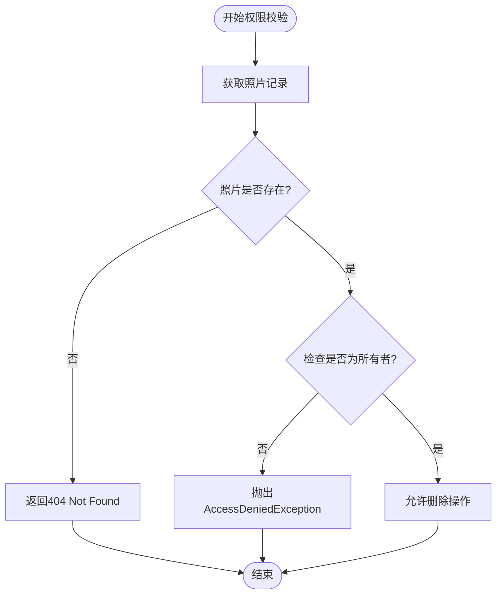
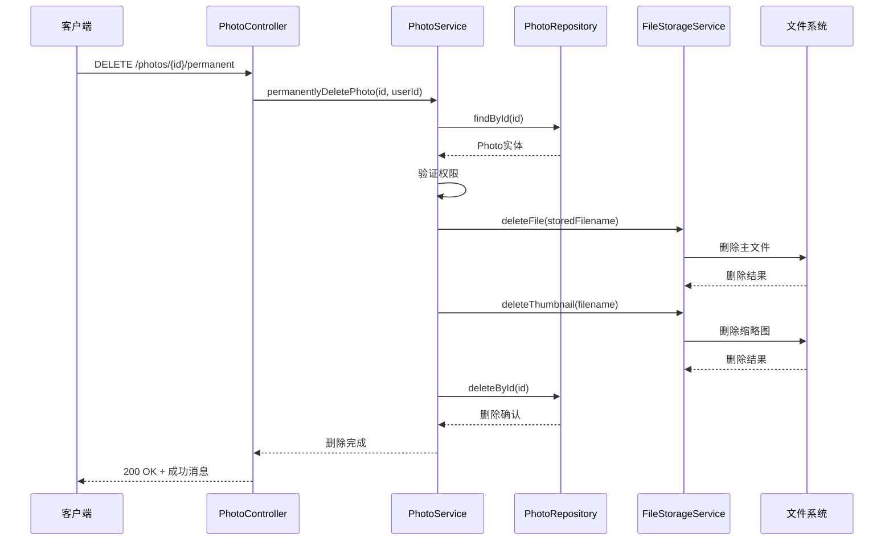
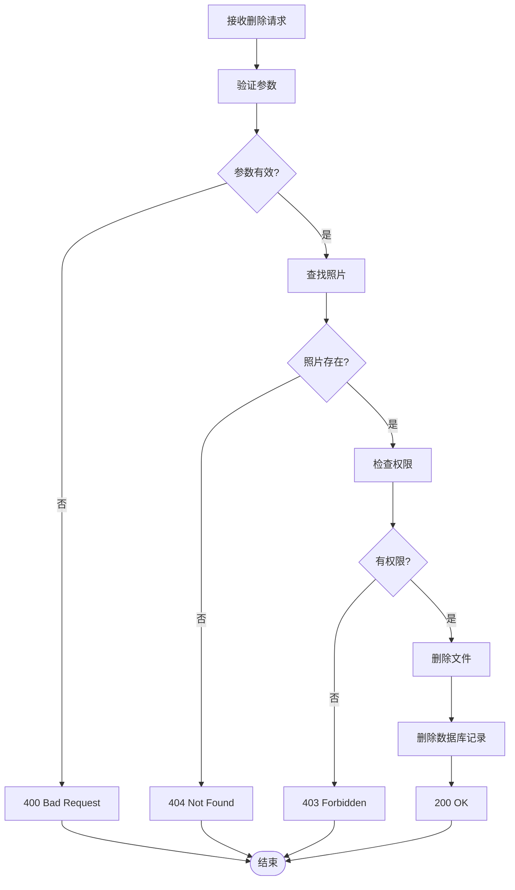
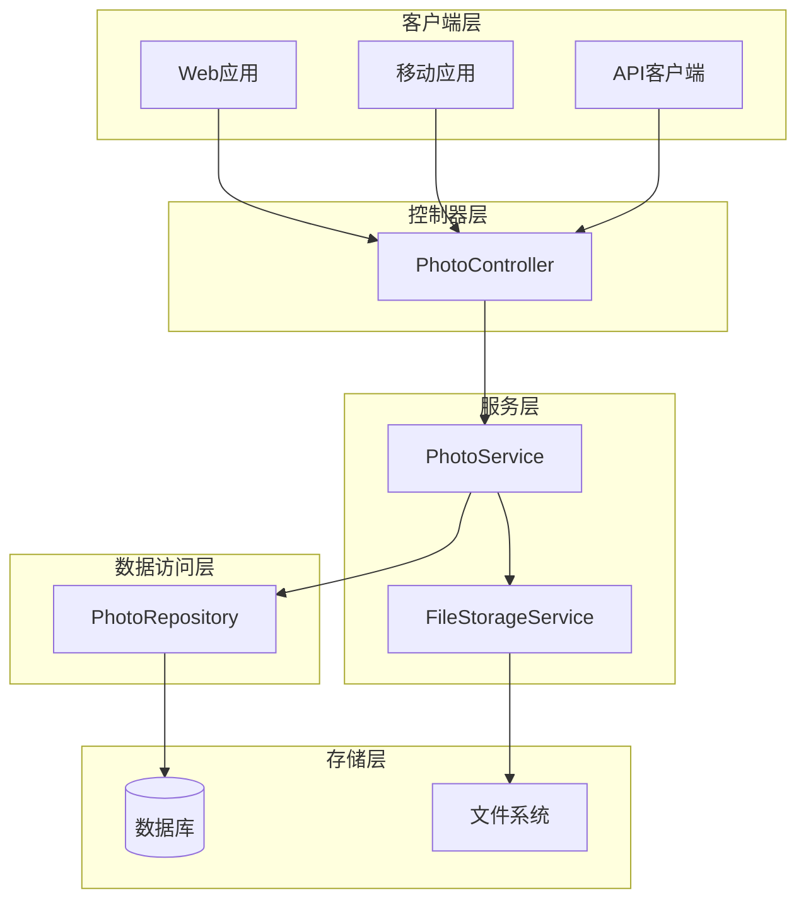

# 永久删除照片API文档

<cite>
**本文档中引用的文件**
- [PhotoController.java](file://src/main/java/com/photo/controller/PhotoController.java)
- [PhotoService.java](file://src/main/java/com/photo/service/PhotoService.java)
- [PhotoRepository.java](file://src/main/java/com/photo/repository/PhotoRepository.java)
- [SecurityUtils.java](file://src/main/java/com/photo/util/SecurityUtils.java)
- [AccessDeniedException.java](file://src/main/java/com/photo/exception/AccessDeniedException.java)
- [ApiResponse.java](file://src/main/java/com/photo/dto/ApiResponse.java)
- [README.md](file://README.md)
</cite>

## 目录
1. [接口概述](#接口概述)
2. [HTTP规范](#http规范)
3. [权限校验](#权限校验)
4. [业务流程](#业务流程)
5. [成功响应](#成功响应)
6. [错误处理](#错误处理)
7. [使用示例](#使用示例)
8. [注意事项](#注意事项)
9. [架构说明](#架构说明)

## 接口概述

`permanentlyDeletePhoto` 是一个用于物理删除照片的API接口，它会从数据库和文件系统中彻底移除指定的照片及其相关文件。这是一个不可逆的操作，需要谨慎使用。

### 主要特性
- **物理删除**：同时删除数据库记录和文件系统中的文件
- **权限控制**：仅照片所有者可执行删除操作
- **不可逆性**：删除后无法恢复，需谨慎操作
- **资源清理**：自动清理缩略图和其他相关文件

## HTTP规范

### 请求方法
- **HTTP方法**: `DELETE`
- **URL模式**: `/photos/{id}/permanent`
- **路径参数**: `id` - 照片唯一标识符
- **查询参数**: `userId` - 必填，用户ID

### 请求格式
```http
DELETE /photos/123/permanent?userId=testUser123 HTTP/1.1
Host: api.example.com
Content-Type: application/json
Authorization: Bearer <token>
```

### 请求参数

| 参数名 | 类型 | 必填 | 说明 |
|--------|------|------|------|
| id | Long | 是 | 照片在数据库中的唯一标识符 |
| userId | String | 是 | 执行删除操作的用户ID |

## 权限校验

### 校验逻辑
系统通过以下步骤验证用户权限：



**图表来源**
- [PhotoService.java](file://src/main/java/com/photo/service/PhotoService.java#L211-L225)

### 权限规则
1. **所有者验证**：只有照片的所有者才能执行删除操作
2. **异常处理**：非所有者尝试删除时抛出 `AccessDeniedException`
3. **安全性**：防止未经授权的用户删除他人照片

**章节来源**
- [PhotoService.java](file://src/main/java/com/photo/service/PhotoService.java#L211-L225)
- [AccessDeniedException.java](file://src/main/java/com/photo/exception/AccessDeniedException.java#L1-L16)

## 业务流程

### 永久删除流程



**图表来源**
- [PhotoController.java](file://src/main/java/com/photo/controller/PhotoController.java#L297-L303)
- [PhotoService.java](file://src/main/java/com/photo/service/PhotoService.java#L211-L235)

### 删除步骤详解

1. **数据库查询**：通过ID查找照片记录
2. **权限验证**：确认当前用户是照片所有者
3. **文件删除**：
   - 删除主文件（`storedFilename`）
   - 删除缩略图（如果存在）
4. **数据库清理**：删除对应的数据库记录
5. **缓存更新**：清除相关缓存条目

**章节来源**
- [PhotoService.java](file://src/main/java/com/photo/service/PhotoService.java#L211-L235)

## 成功响应

### 响应格式
```json
{
  "code": 200,
  "message": "永久删除成功",
  "data": null,
  "timestamp": 1640995200000
}
```

### 响应字段说明

| 字段名 | 类型 | 说明 |
|--------|------|------|
| code | Integer | 响应状态码，成功时为200 |
| message | String | 响应消息，固定为"永久删除成功" |
| data | Null | 无返回数据 |
| timestamp | Long | 响应时间戳 |

### HTTP状态码
- **200 OK**：删除成功
- **404 Not Found**：照片不存在
- **403 Forbidden**：权限不足

**章节来源**
- [PhotoController.java](file://src/main/java/com/photo/controller/PhotoController.java#L301-L303)
- [ApiResponse.java](file://src/main/java/com/photo/dto/ApiResponse.java#L30-L35)

## 错误处理

### 常见错误场景

| 错误类型 | HTTP状态码 | 错误消息 | 说明 |
|----------|------------|----------|------|
| 照片不存在 | 404 | "照片不存在: {id}" | 指定ID的照片不存在 |
| 权限不足 | 403 | "无权删除该照片" | 当前用户不是照片所有者 |
| 参数缺失 | 400 | "userId参数缺失" | 必填参数未提供 |
| 系统异常 | 500 | "删除过程中发生错误" | 内部服务器错误 |

### 异常处理流程



**图表来源**
- [PhotoService.java](file://src/main/java/com/photo/service/PhotoService.java#L211-L235)

**章节来源**
- [PhotoService.java](file://src/main/java/com/photo/service/PhotoService.java#L211-L235)
- [AccessDeniedException.java](file://src/main/java/com/photo/exception/AccessDeniedException.java#L1-L16)

## 使用示例

### curl命令示例

#### 成功删除示例
```bash
curl -X DELETE \
  "https://api.example.com/photos/123/permanent?userId=testUser123" \
  -H "Content-Type: application/json" \
  -H "Authorization: Bearer your_token_here"
```

#### 响应示例
```json
{
  "code": 200,
  "message": "永久删除成功",
  "data": null,
  "timestamp": 1640995200000
}
```

### JavaScript示例
```javascript
fetch('https://api.example.com/photos/123/permanent?userId=testUser123', {
    method: 'DELETE',
    headers: {
        'Authorization': 'Bearer your_token_here'
    }
})
.then(response => response.json())
.then(data => {
    if (data.code === 200) {
        console.log('照片已永久删除');
    } else {
        console.error('删除失败:', data.message);
    }
})
.catch(error => {
    console.error('请求失败:', error);
});
```

### Python示例
```python
import requests

url = "https://api.example.com/photos/123/permanent"
params = {
    "userId": "testUser123"
}
headers = {
    "Authorization": "Bearer your_token_here"
}

response = requests.delete(url, params=params, headers=headers)
if response.status_code == 200:
    print("照片已永久删除")
else:
    print(f"删除失败: {response.text}")
```

## 注意事项

### 操作风险
1. **不可逆性**：此操作无法撤销，请确保确实需要删除该照片
2. **数据丢失**：删除后所有相关数据（包括访问记录、下载记录）都将丢失
3. **文件依赖**：如果其他系统引用了该照片，可能导致链接失效

### 使用场景
1. **软删除后的最终清理**：当照片经过软删除后，确定不再需要时
2. **立即释放存储空间**：需要快速释放被占用的存储空间
3. **管理员操作**：管理员在回收站清空时使用
4. **合规删除**：满足数据保护法规要求的删除操作

### 最佳实践
1. **确认操作**：在执行删除前确认用户意图
2. **备份考虑**：重要照片建议先备份再删除
3. **权限控制**：确保只有授权用户可以执行此操作
4. **日志记录**：记录删除操作以便审计

**章节来源**
- [PhotoService.java](file://src/main/java/com/photo/service/PhotoService.java#L211-L235)

## 架构说明

### 系统架构图



**图表来源**
- [PhotoController.java](file://src/main/java/com/photo/controller/PhotoController.java#L1-L50)
- [PhotoService.java](file://src/main/java/com/photo/service/PhotoService.java#L1-L50)

### 核心组件说明

1. **PhotoController**：负责HTTP请求处理和响应格式化
2. **PhotoService**：业务逻辑处理，包括权限验证和删除流程
3. **PhotoRepository**：数据库操作，负责数据持久化
4. **FileStorageService**：文件系统操作，负责文件删除

**章节来源**
- [PhotoController.java](file://src/main/java/com/photo/controller/PhotoController.java#L1-L316)
- [PhotoService.java](file://src/main/java/com/photo/service/PhotoService.java#L1-L385)