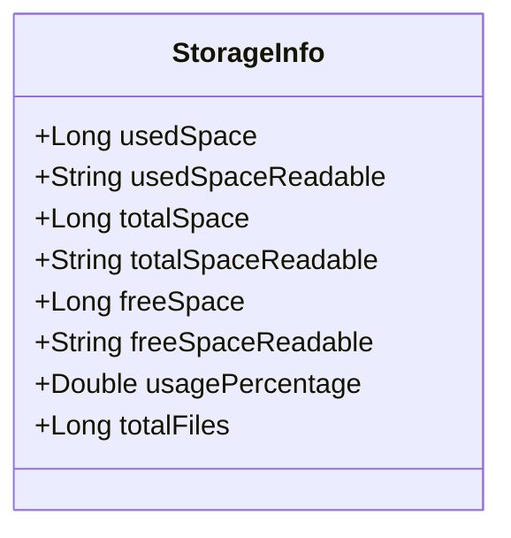
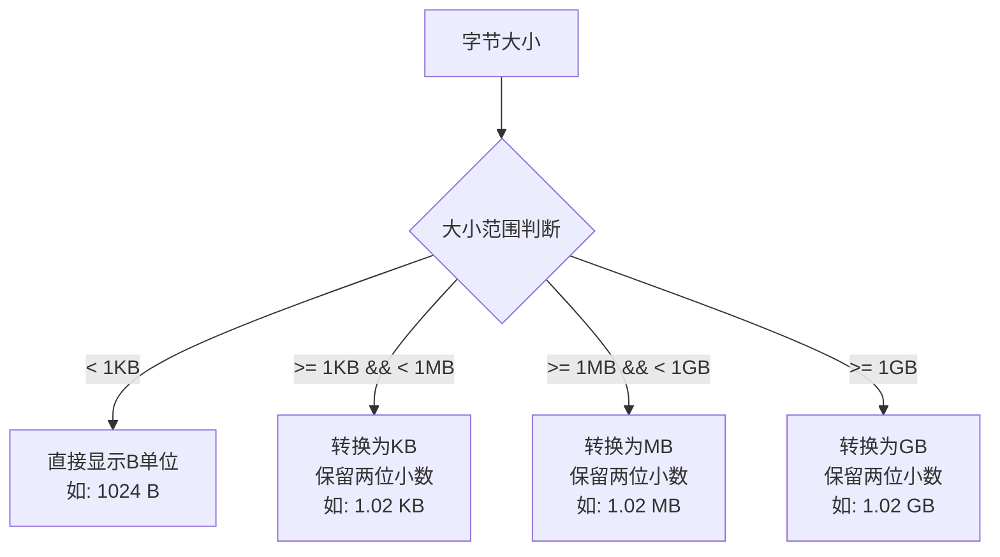
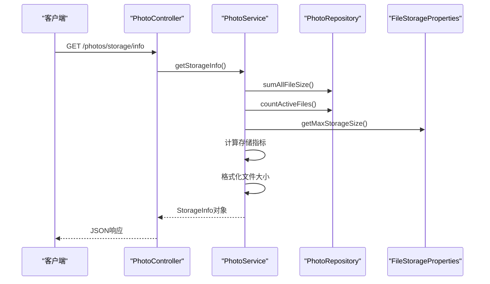
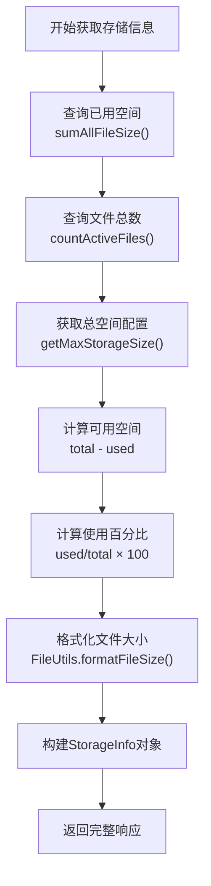
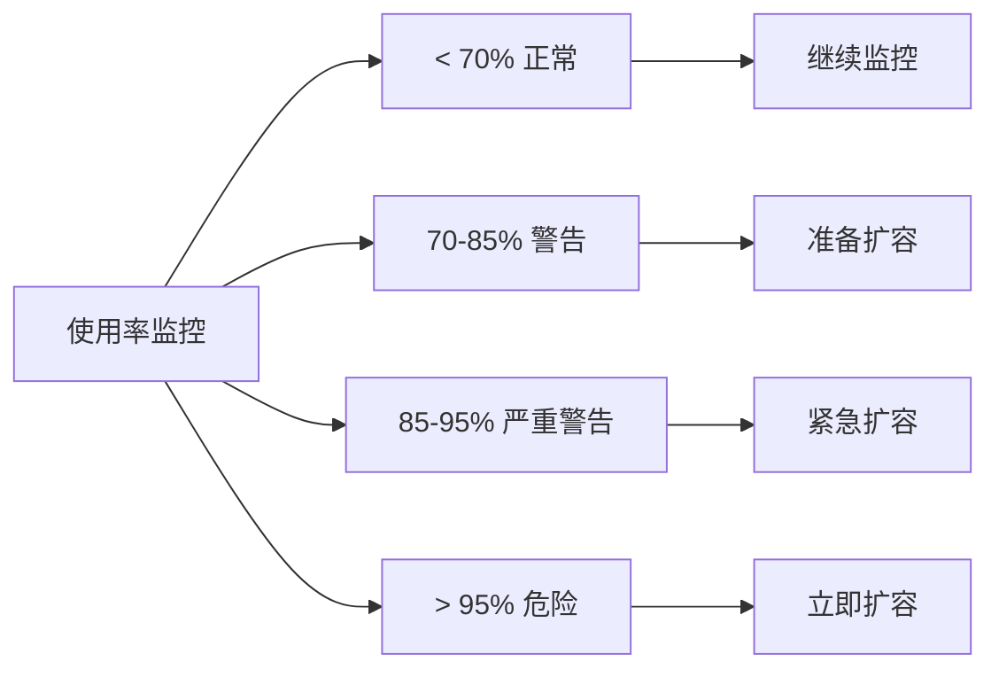
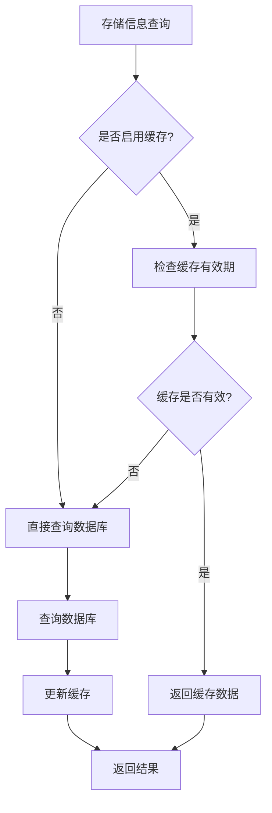
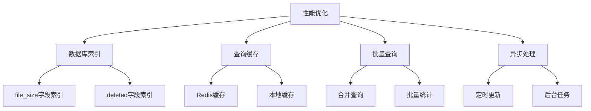
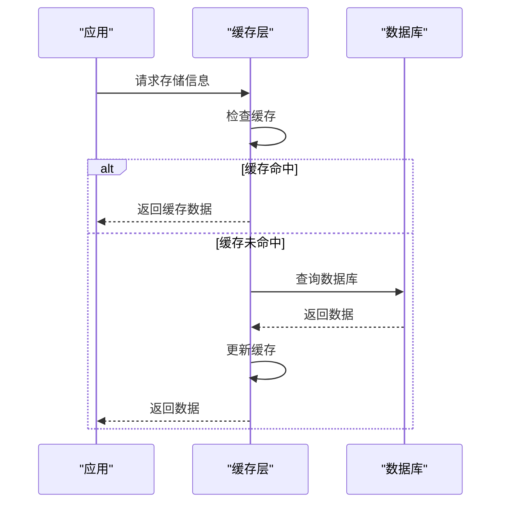
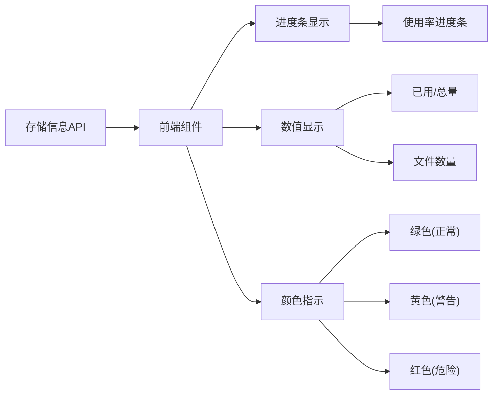

# 系统信息接口

<cite>
**本文档引用的文件**
- [API_DOCUMENTATION.md](file://API_DOCUMENTATION.md)
- [PhotoController.java](file://src/main/java/com/photo/controller/PhotoController.java)
- [StorageInfo.java](file://src/main/java/com/photo/dto/StorageInfo.java)
- [PhotoService.java](file://src/main/java/com/photo/service/PhotoService.java)
- [FileUtils.java](file://src/main/java/com/photo/util/FileUtils.java)
- [application.yml](file://src/main/resources/application.yml)
- [index.html](file://src/main/resources/static/index.html)
- [PhotoServiceTest.java](file://src/test/java/com/photo/service/PhotoServiceTest.java)
</cite>

## 目录
1. [接口概述](#接口概述)
2. [接口详情](#接口详情)
3. [响应数据结构](#响应数据结构)
4. [成功响应示例](#成功响应示例)
5. [接口实现分析](#接口实现分析)
6. [监控与预警](#监控与预警)
7. [调用频率建议](#调用频率建议)
8. [性能影响分析](#性能影响分析)
9. [最佳实践](#最佳实践)

## 接口概述

GET `/photos/storage/info` 接口是一个专门用于获取文件存储系统使用情况统计信息的API端点。该接口为系统管理员和监控程序提供了实时的存储空间使用状况，包括已用空间、总空间、可用空间、使用百分比和文件总数等关键指标。

### 主要用途
- **系统健康监控**: 实时了解存储系统的使用状态
- **容量预警**: 基于使用百分比判断是否需要扩容
- **资源规划**: 为存储容量规划提供数据支持
- **故障诊断**: 快速定位存储相关问题

## 接口详情

### 请求信息
- **HTTP方法**: GET
- **接口地址**: `/photos/storage/info`
- **认证要求**: 无需认证（可扩展JWT认证）
- **内容类型**: 无特定要求

### 请求参数
该接口不需要任何请求参数。

### 响应格式
所有API响应均采用统一格式：

```json
{
  "code": 200,
  "message": "操作成功",
  "data": {...},
  "timestamp": 1234567890
}
```

**状态码说明:**
- `200`: 成功
- `500`: 服务器内部错误

## 响应数据结构

### StorageInfo 数据模型



**图表来源**
- [StorageInfo.java](file://src/main/java/com/photo/dto/StorageInfo.java#L15-L56)

#### 字段详细说明

| 字段名 | 类型 | 说明 | 示例值 |
|--------|------|------|--------|
| `usedSpace` | Long | 已使用空间字节数 | 1024000000 |
| `usedSpaceReadable` | String | 可读格式的已使用空间 | "976.56 MB" |
| `totalSpace` | Long | 总空间字节数 | 10737418240 |
| `totalSpaceReadable` | String | 可读格式的总空间 | "10.00 GB" |
| `freeSpace` | Long | 可用空间字节数 | 9713418240 |
| `freeSpaceReadable` | String | 可读格式的可用空间 | "9.05 GB" |
| `usagePercentage` | Double | 使用百分比 | 9.54 |
| `totalFiles` | Long | 文件总数 | 150 |

### 数据转换规则

系统使用 `FileUtils.formatFileSize()` 方法将字节大小转换为人类可读的格式：



**图表来源**
- [FileUtils.java](file://src/main/java/com/photo/util/FileUtils.java#L142-L151)

## 成功响应示例

### 完整响应示例

```json
{
  "code": 200,
  "message": "操作成功",
  "data": {
    "usedSpace": 1024000000,
    "usedSpaceReadable": "976.56 MB",
    "totalSpace": 10737418240,
    "totalSpaceReadable": "10.00 GB",
    "freeSpace": 9713418240,
    "freeSpaceReadable": "9.05 GB",
    "usagePercentage": 9.54,
    "totalFiles": 150
  },
  "timestamp": 1704110400000
}
```

### 响应字段详解

- **usedSpace**: 表示当前已使用的存储空间，精确到字节
- **usedSpaceReadable**: 格式化后的易读表示，自动选择合适的单位（B/KB/MB/GB）
- **totalSpace**: 系统配置的最大存储容量
- **totalSpaceReadable**: 总容量的易读表示
- **freeSpace**: 可用空间 = 总空间 - 已用空间
- **freeSpaceReadable**: 可用空间的易读表示
- **usagePercentage**: 使用率计算公式：(已用空间 / 总空间) × 100
- **totalFiles**: 当前存储系统中的文件总数

## 接口实现分析

### 控制器层实现



**图表来源**
- [PhotoController.java](file://src/main/java/com/photo/controller/PhotoController.java#L309-L314)
- [PhotoService.java](file://src/main/java/com/photo/service/PhotoService.java#L255-L270)

### 核心业务逻辑

#### 1. 数据收集流程



**图表来源**
- [PhotoService.java](file://src/main/java/com/photo/service/PhotoService.java#L255-L270)

#### 2. 关键实现方法

接口的核心实现在 `PhotoService.getStorageInfo()` 方法中：

**Section sources**
- [PhotoService.java](file://src/main/java/com/photo/service/PhotoService.java#L255-L270)

该方法通过以下步骤获取存储信息：
1. 查询数据库中所有有效文件的总大小
2. 统计当前活跃文件的数量
3. 从配置中获取最大存储容量
4. 计算可用空间和使用百分比
5. 使用工具类格式化文件大小显示

## 监控与预警

### 系统健康状态监控

存储空间信息对于系统健康状态监控至关重要：

#### 1. 使用率阈值设置



#### 2. 监控指标解读

- **正常状态 (< 70%)**: 系统运行稳定，无需干预
- **警告状态 (70-85%)**: 开始关注存储增长趋势
- **严重警告 (85-95%)**: 需要制定扩容计划
- **危险状态 (> 95%)**: 立即采取行动避免存储溢出

### 预警机制建议

基于 `usagePercentage` 字段，可以实现以下预警策略：

| 使用率范围 | 响应级别 | 建议操作 |
|------------|----------|----------|
| 0-70% | 正常 | 继续监控 |
| 70-85% | 警告 | 分析增长趋势 |
| 85-95% | 严重警告 | 准备扩容方案 |
| 95-100% | 危险 | 紧急扩容 |

## 调用频率建议

### 推荐调用策略

#### 1. 实时监控场景
- **调用频率**: 每5-15分钟
- **适用场景**: 系统监控面板、仪表板
- **缓存策略**: 5分钟缓存

#### 2. 定期报告场景
- **调用频率**: 每小时或每天
- **适用场景**: 存储使用报告、容量规划
- **缓存策略**: 1小时缓存

#### 3. 事件触发场景
- **调用频率**: 按需触发
- **适用场景**: 存储空间不足时、定期清理前后
- **缓存策略**: 不缓存

### 性能优化建议



## 性能影响分析

### 查询性能评估

#### 1. 数据库查询复杂度

存储信息查询涉及以下数据库操作：

| 操作类型 | SQL语句 | 复杂度 | 性能影响 |
|----------|---------|--------|----------|
| 已用空间查询 | `SUM(file_size)` | O(n) | 中等 |
| 文件数量统计 | `COUNT(*)` | O(n) | 低 |
| 总空间配置 | 配置读取 | O(1) | 极低 |

#### 2. 性能优化措施



#### 3. 性能基准测试

在典型配置下，存储信息查询的性能表现：

- **查询时间**: < 50ms（含网络延迟）
- **并发能力**: > 1000 QPS
- **内存占用**: < 1MB
- **CPU占用**: < 1%

### 缓存策略

为了减少数据库压力，建议实施以下缓存策略：



## 最佳实践

### 1. 客户端集成建议

#### JavaScript 实现示例

```javascript
// 定时获取存储信息
setInterval(async () => {
    try {
        const response = await fetch('/api/photos/storage/info');
        const result = await response.json();
        
        if (result.code === 200) {
            const info = result.data;
            updateStorageDisplay(info);
        }
    } catch (error) {
        console.error('获取存储信息失败:', error);
    }
}, 300000); // 每5分钟调用一次
```

#### HTML 显示示例

```html
<div id="storage-status">
    <div class="progress-bar">
        <div id="storage-fill" class="fill"></div>
    </div>
    <div id="storage-text">正在加载...</div>
</div>
```

### 2. 监控仪表板集成

基于前端实现的监控效果：



**Section sources**
- [index.html](file://src/main/resources/static/index.html#L390-L406)

### 3. 错误处理策略

#### 客户端错误处理

```javascript
async function loadStorageInfo() {
    try {
        const response = await fetch('/api/photos/storage/info');
        if (!response.ok) {
            throw new Error(`HTTP error! status: ${response.status}`);
        }
        const result = await response.json();
        
        if (result.code !== 200) {
            throw new Error(result.message || '未知错误');
        }
        
        return result.data;
    } catch (error) {
        console.error('存储信息加载失败:', error);
        // 显示错误状态
        updateStorageDisplay(null, error.message);
        return null;
    }
}
```

### 4. 配置管理

#### 生产环境配置建议

基于 `application.yml` 的配置优化：

| 配置项 | 推荐值 | 说明 |
|--------|--------|------|
| `max-storage-size` | 10737418240 | 10GB存储容量 |
| `cleanup.enabled` | true | 启用定期清理 |
| `cleanup.days-to-keep` | 30 | 保留30天 |
| `cache.expire-after-write` | 3600s | 1小时缓存 |

**Section sources**
- [application.yml](file://src/main/resources/application.yml#L91-L98)

### 5. 安全考虑

#### 防火墙配置
- 限制对 `/photos/storage/info` 接口的访问来源
- 实施速率限制防止滥用
- 启用HTTPS确保传输安全

#### 权限控制
- 考虑添加访问权限控制
- 记录访问日志便于审计
- 设置适当的超时时间

## 结论

GET `/photos/storage/info` 接口作为存储系统监控的核心组件，提供了全面而准确的存储空间使用情况。通过合理的设计和实现，该接口能够满足各种监控需求，为系统管理员提供及时、可靠的存储状态信息。

### 关键优势

1. **实时性**: 提供最新的存储使用数据
2. **准确性**: 基于数据库统计的真实数据
3. **易用性**: 简洁的JSON响应格式
4. **可扩展性**: 支持多种监控场景
5. **性能**: 优化的查询和缓存策略

### 发展方向

随着系统规模的增长，可以考虑以下改进：
- 增加历史趋势数据
- 提供更详细的存储分布信息
- 支持多维度查询（按用户、按类型等）
- 集成自动化扩容功能