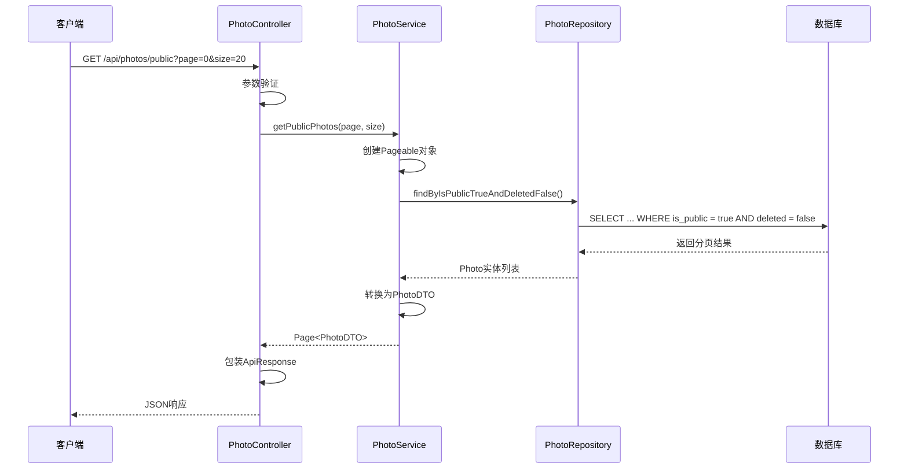
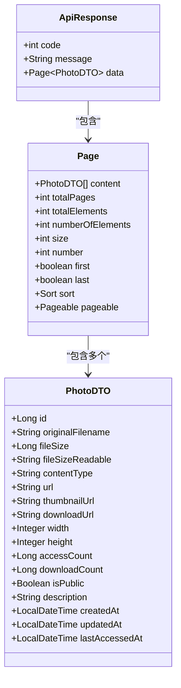
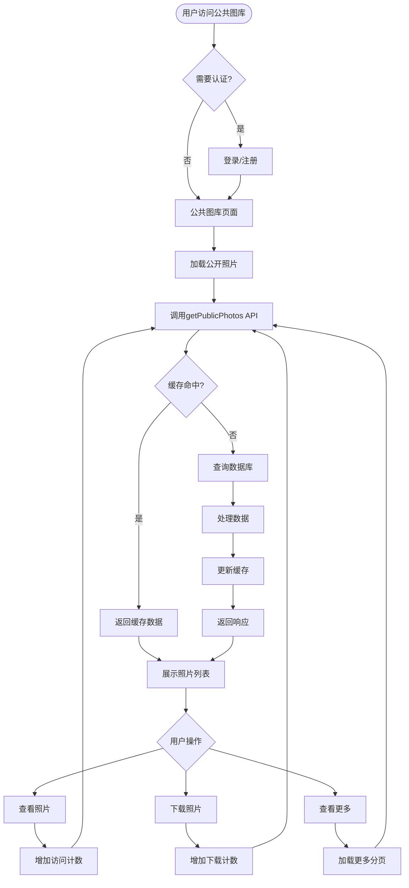
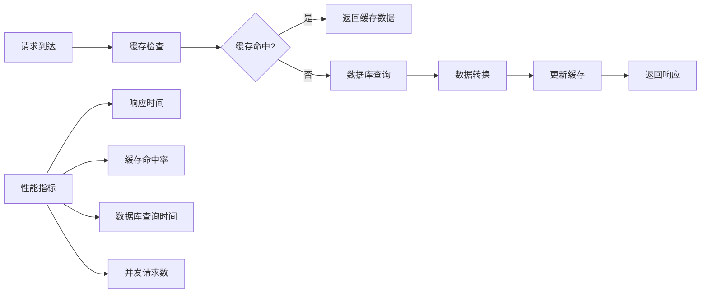

# 获取公开照片列表 API 文档

<cite>
**本文档引用的文件**
- [PhotoController.java](file://src/main/java/com/photo/controller/PhotoController.java)
- [PhotoService.java](file://src/main/java/com/photo/service/PhotoService.java)
- [PhotoRepository.java](file://src/main/java/com/photo/repository/PhotoRepository.java)
- [PhotoDTO.java](file://src/main/java/com/photo/dto/PhotoDTO.java)
- [Photo.java](file://src/main/java/com/photo/entity/Photo.java)
- [PhotoControllerTest.java](file://src/test/java/com/photo/controller/PhotoControllerTest.java)
- [application.yml](file://src/main/resources/application.yml)
- [README.md](file://README.md)
</cite>

## 目录
1. [接口概述](#接口概述)
2. [技术规范](#技术规范)
3. [接口详情](#接口详情)
4. [数据模型](#数据模型)
5. [响应示例](#响应示例)
6. [业务流程](#业务流程)
7. [前端实现示例](#前端实现示例)
8. [错误处理](#错误处理)
9. [性能考虑](#性能考虑)
10. [最佳实践](#最佳实践)

## 接口概述

`getPublicPhotos` 接口是照片管理系统中的核心公共接口，用于获取系统中所有公开照片的分页列表。该接口具有以下特点：

- **完全公开访问**：无需身份验证，任何用户都可以访问
- **分页查询**：支持灵活的分页参数控制
- **高效检索**：基于数据库索引的快速查询
- **标准化响应**：遵循统一的API响应格式

### 主要用途
- 构建公共相册展示页面
- 实现内容发现和推荐功能
- 支持社交分享和浏览功能
- 提供匿名用户访问入口

## 技术规范

### HTTP 方法和 URL
- **方法**: `GET`
- **URL**: `/api/photos/public`
- **基础路径**: `http://localhost:8080/api` (开发环境)

### 请求参数

| 参数名 | 类型 | 必填 | 默认值 | 说明 |
|--------|------|------|--------|------|
| page | integer | 否 | 0 | 页码，从0开始 |
| size | integer | 否 | 20 | 每页数量，最大100 |

### 分页参数说明
- `page`: 当前页码，从0开始计数
- `size`: 每页返回的记录数，建议范围10-50，默认20
- 最大值限制：为了避免性能问题，系统会限制最大size为100

## 接口详情

### 核心实现架构



**图表来源**
- [PhotoController.java](file://src/main/java/com/photo/controller/PhotoController.java#L185-L195)
- [PhotoService.java](file://src/main/java/com/photo/service/PhotoService.java#L145-L150)
- [PhotoRepository.java](file://src/main/java/com/photo/repository/PhotoRepository.java#L30-L32)

### 关键实现细节

#### 控制器层实现
控制器提供了简洁的REST接口，支持标准的分页参数：

**章节来源**
- [PhotoController.java](file://src/main/java/com/photo/controller/PhotoController.java#L185-L195)

#### 服务层逻辑
服务层负责业务逻辑处理和数据转换：

**章节来源**
- [PhotoService.java](file://src/main/java/com/photo/service/PhotoService.java#L145-L150)

#### 数据访问层查询
Repository层实现了高效的数据库查询：

**章节来源**
- [PhotoRepository.java](file://src/main/java/com/photo/repository/PhotoRepository.java#L30-L32)

## 数据模型

### 响应数据结构

接口返回的标准分页响应包含以下结构：



**图表来源**
- [PhotoDTO.java](file://src/main/java/com/photo/dto/PhotoDTO.java#L1-L104)

### 字段详细说明

| 字段名 | 类型 | 说明 |
|--------|------|------|
| id | Long | 照片唯一标识符 |
| originalFilename | String | 原始文件名 |
| fileSize | Long | 文件大小（字节） |
| fileSizeReadable | String | 可读格式的文件大小（如"1.2 MB"） |
| contentType | String | MIME类型（如"image/jpeg"） |
| url | String | 在线预览URL |
| thumbnailUrl | String | 缩略图URL |
| downloadUrl | String | 下载URL |
| width | Integer | 图片宽度（像素） |
| height | Integer | 图片高度（像素） |
| accessCount | Long | 访问次数 |
| downloadCount | Long | 下载次数 |
| isPublic | Boolean | 是否公开 |
| description | String | 照片描述 |
| createdAt | LocalDateTime | 创建时间 |
| updatedAt | LocalDateTime | 更新时间 |
| lastAccessedAt | LocalDateTime | 最后访问时间 |

**章节来源**
- [PhotoDTO.java](file://src/main/java/com/photo/dto/PhotoDTO.java#L1-L104)

## 响应示例

### 成功响应示例

```json
{
  "code": 200,
  "message": "操作成功",
  "data": {
    "content": [
      {
        "id": 1,
        "originalFilename": "sunset.jpg",
        "fileSize": 2048576,
        "fileSizeReadable": "2.00 MB",
        "contentType": "image/jpeg",
        "url": "/api/photos/view/sunset_abc123.jpg",
        "thumbnailUrl": "/api/photos/thumbnail/sunset_abc123.jpg",
        "downloadUrl": "/api/photos/download/sunset_abc123.jpg",
        "width": 1920,
        "height": 1080,
        "accessCount": 156,
        "downloadCount": 23,
        "isPublic": true,
        "description": "美丽的日落景色",
        "createdAt": "2024-01-15T14:30:00",
        "updatedAt": "2024-01-15T14:30:00",
        "lastAccessedAt": "2024-01-20T10:15:30"
      },
      {
        "id": 2,
        "originalFilename": "mountain.jpg",
        "fileSize": 1572864,
        "fileSizeReadable": "1.50 MB",
        "contentType": "image/jpeg",
        "url": "/api/photos/view/mountain_def456.jpg",
        "thumbnailUrl": "/api/photos/thumbnail/mountain_def456.jpg",
        "downloadUrl": "/api/photos/download/mountain_def456.jpg",
        "width": 1200,
        "height": 800,
        "accessCount": 98,
        "downloadCount": 12,
        "isPublic": true,
        "description": "壮丽的山景",
        "createdAt": "2024-01-14T09:20:00",
        "updatedAt": "2024-01-14T09:20:00",
        "lastAccessedAt": "2024-01-19T16:45:20"
      }
    ],
    "totalPages": 5,
    "totalElements": 100,
    "numberOfElements": 2,
    "size": 20,
    "number": 0,
    "first": true,
    "last": false,
    "sort": {
      "empty": false,
      "sorted": true,
      "unsorted": false
    },
    "pageable": {
      "offset": 0,
      "pageSize": 20,
      "pageNumber": 0,
      "paged": true,
      "unpaged": false,
      "sort": {
        "empty": false,
        "sorted": true,
        "unsorted": false
      }
    }
  }
}
```

### 分页使用示例

#### 第一页请求
```bash
GET /api/photos/public?page=0&size=20
```

#### 第二页请求
```bash
GET /api/photos/public?page=1&size=20
```

#### 自定义大小请求
```bash
GET /api/photos/public?page=0&size=50
```

**章节来源**
- [PhotoControllerTest.java](file://src/test/java/com/photo/controller/PhotoControllerTest.java#L85-L95)

## 业务流程

### 接口在业务流程中的作用



**图表来源**
- [PhotoService.java](file://src/main/java/com/photo/service/PhotoService.java#L145-L150)
- [PhotoRepository.java](file://src/main/java/com/photo/repository/PhotoRepository.java#L30-L32)

### 核心业务价值

1. **内容传播促进**：通过公开接口让更多用户发现和浏览内容
2. **流量引导**：为网站带来自然流量和用户粘性
3. **社交功能支持**：为分享、收藏等功能提供数据基础
4. **SEO优化**：公开内容有助于搜索引擎收录
5. **社区建设**：建立用户之间的内容交流平台

## 前端实现示例

### JavaScript 实现

以下是一个完整的前端实现示例，展示如何使用该接口构建公共图库：

```javascript
// 公共图库组件
class PublicGallery {
    constructor(containerId) {
        this.container = document.getElementById(containerId);
        this.currentPage = 0;
        this.pageSize = 20;
        this.loading = false;
        
        this.init();
    }
    
    async init() {
        // 初始化时加载第一页
        await this.loadPhotos();
        
        // 添加滚动加载事件监听
        window.addEventListener('scroll', this.handleScroll.bind(this));
        
        // 添加加载更多按钮
        this.setupLoadMoreButton();
    }
    
    async loadPhotos(page = 0, size = 20) {
        if (this.loading) return;
        
        this.loading = true;
        this.showLoading(true);
        
        try {
            const response = await fetch(`/api/photos/public?page=${page}&size=${size}`);
            const data = await response.json();
            
            if (data.code === 200) {
                this.renderPhotos(data.data.content);
                
                // 更新分页状态
                this.currentPage = data.data.number;
                this.hasMore = !data.data.last;
                
                // 如果是第一页，清除之前的图片
                if (page === 0) {
                    this.clearGallery();
                }
            }
        } catch (error) {
            console.error('加载照片失败:', error);
            this.showError('加载照片失败，请稍后重试');
        } finally {
            this.showLoading(false);
            this.loading = false;
        }
    }
    
    renderPhotos(photos) {
        photos.forEach(photo => {
            const photoElement = this.createPhotoCard(photo);
            this.container.appendChild(photoElement);
        });
    }
    
    createPhotoCard(photo) {
        const card = document.createElement('div');
        card.className = 'photo-card';
        card.innerHTML = `
            <div class="photo-thumbnail">
                
            </div>
            <div class="photo-info">
                <h3>${photo.originalFilename}</h3>
                <p class="meta">
                    <span><i class="icon-eye"></i> ${photo.accessCount}</span>
                    <span><i class="icon-download"></i> ${photo.downloadCount}</span>
                    <span><i class="icon-clock"></i> ${this.formatDate(photo.createdAt)}</span>
                </p>
                <div class="actions">
                    <a href="${photo.url}" target="_blank" class="btn btn-primary">查看</a>
                    <a href="${photo.downloadUrl}" class="btn btn-secondary">下载</a>
                </div>
            </div>
        `;
        
        // 添加点击事件
        card.querySelector('.photo-thumbnail img').addEventListener('click', () => {
            window.open(photo.url, '_blank');
        });
        
        return card;
    }
    
    handleScroll() {
        // 滚动到底部时加载更多
        if (this.shouldLoadMore()) {
            this.loadMore();
        }
    }
    
    shouldLoadMore() {
        const threshold = 100; // 距离底部100px时触发
        const scrollTop = document.documentElement.scrollTop || document.body.scrollTop;
        const scrollHeight = document.documentElement.scrollHeight;
        const clientHeight = document.documentElement.clientHeight;
        
        return scrollTop + clientHeight >= scrollHeight - threshold && this.hasMore && !this.loading;
    }
    
    async loadMore() {
        if (!this.hasMore || this.loading) return;
        
        this.currentPage++;
        await this.loadPhotos(this.currentPage, this.pageSize);
    }
    
    setupLoadMoreButton() {
        const loadMoreBtn = document.createElement('button');
        loadMoreBtn.className = 'load-more-btn';
        loadMoreBtn.textContent = '加载更多';
        loadMoreBtn.disabled = true;
        
        loadMoreBtn.addEventListener('click', () => {
            this.loadMore();
        });
        
        this.container.parentNode.insertBefore(loadMoreBtn, this.container.nextSibling);
        
        // 监听分页状态变化
        const observer = new MutationObserver(() => {
            loadMoreBtn.disabled = !this.hasMore || this.loading;
            loadMoreBtn.textContent = this.loading ? '加载中...' : '加载更多';
        });
        
        observer.observe(this.container, { childList: true });
    }
    
    clearGallery() {
        this.container.innerHTML = '';
        this.currentPage = 0;
    }
    
    showLoading(show) {
        const loadingEl = document.getElementById('gallery-loading');
        if (loadingEl) {
            loadingEl.style.display = show ? 'block' : 'none';
        }
    }
    
    showError(message) {
        const errorEl = document.getElementById('gallery-error');
        if (errorEl) {
            errorEl.textContent = message;
            errorEl.style.display = 'block';
        }
    }
    
    formatDate(dateString) {
        const date = new Date(dateString);
        return date.toLocaleDateString('zh-CN', {
            year: 'numeric',
            month: '2-digit',
            day: '2-digit'
        });
    }
}

// 使用示例
document.addEventListener('DOMContentLoaded', () => {
    const gallery = new PublicGallery('photo-gallery-container');
});
```

### HTML 结构示例

```html
<!DOCTYPE html>
<html lang="zh-CN">
<head>
    <meta charset="UTF-8">
    <meta name="viewport" content="width=device-width, initial-scale=1.0">
    <title>公共图库</title>
    <style>
        /* 基础样式 */
        .photo-gallery {
            display: grid;
            grid-template-columns: repeat(auto-fill, minmax(250px, 1fr));
            gap: 20px;
            padding: 20px;
        }
        
        .photo-card {
            border-radius: 8px;
            box-shadow: 0 2px 8px rgba(0,0,0,0.1);
            overflow: hidden;
            transition: transform 0.3s ease;
        }
        
        .photo-card:hover {
            transform: translateY(-5px);
        }
        
        .photo-thumbnail {
            position: relative;
            height: 200px;
            overflow: hidden;
        }
        
        .photo-thumbnail img {
            width: 100%;
            height: 100%;
            object-fit: cover;
            cursor: pointer;
        }
        
        .photo-info {
            padding: 15px;
        }
        
        .meta {
            font-size: 0.8rem;
            color: #666;
            margin-bottom: 10px;
        }
        
        .actions {
            display: flex;
            gap: 10px;
        }
        
        .btn {
            padding: 8px 15px;
            border-radius: 4px;
            text-decoration: none;
            font-size: 0.9rem;
        }
        
        .btn-primary {
            background-color: #007bff;
            color: white;
        }
        
        .btn-secondary {
            background-color: #6c757d;
            color: white;
        }
        
        .load-more-btn {
            display: block;
            width: 100%;
            padding: 12px;
            margin-top: 20px;
            background-color: #007bff;
            color: white;
            border: none;
            border-radius: 4px;
            cursor: pointer;
            font-size: 1rem;
        }
        
        .load-more-btn:disabled {
            background-color: #cccccc;
            cursor: not-allowed;
        }
    </style>
</head>
<body>
    <div class="container">
        <h1>公共图库</h1>
        <div id="gallery-error" style="display: none; color: red;"></div>
        <div id="photo-gallery-container" class="photo-gallery"></div>
        <div id="gallery-loading" style="text-align: center; display: none;">
            
            <p>正在加载照片...</p>
        </div>
        <button id="load-more" class="load-more-btn" disabled>加载更多</button>
    </div>
    
    <script src="public-gallery.js"></script>
</body>
</html>
```

## 错误处理

### 常见错误情况

| 错误代码 | HTTP状态码 | 说明 | 解决方案 |
|----------|------------|------|----------|
| 400 | Bad Request | 请求参数无效 | 检查page和size参数是否为有效整数 |
| 500 | Internal Server Error | 服务器内部错误 | 联系管理员，检查服务器日志 |
| 429 | Too Many Requests | 请求过于频繁 | 实施客户端限流策略 |

### 错误响应格式

```json
{
  "code": 400,
  "message": "参数错误: page必须是非负整数",
  "data": null
}
```

### 前端错误处理示例

```javascript
async function safeLoadPhotos(page = 0, size = 20) {
    try {
        const response = await fetch(`/api/photos/public?page=${page}&size=${size}`);
        
        if (!response.ok) {
            throw new Error(`HTTP error! status: ${response.status}`);
        }
        
        const data = await response.json();
        
        if (data.code !== 200) {
            throw new Error(data.message || '未知错误');
        }
        
        return data.data;
    } catch (error) {
        console.error('加载照片失败:', error);
        
        // 显示友好的错误消息
        showAlert('无法加载照片，请稍后重试', 'error');
        
        // 尝试重新加载
        setTimeout(() => safeLoadPhotos(page, size), 5000);
        
        return null;
    }
}
```

## 性能考虑

### 查询优化

1. **数据库索引**
   - `is_public`字段已建立索引
   - `deleted`字段已建立索引
   - 复合索引优化查询性能

2. **缓存策略**
   - 使用Caffeine缓存热点数据
   - 缓存有效期：1小时
   - 缓存大小限制：1000条记录

3. **分页优化**
   - 使用Spring Data的分页机制
   - 避免全表扫描
   - 合理设置每页大小

### 性能监控指标



### 性能优化建议

1. **客户端优化**
   - 实施图片懒加载
   - 使用CDN加速静态资源
   - 实施请求去重

2. **服务端优化**
   - 合理设置缓存策略
   - 监控数据库查询性能
   - 实施适当的限流机制

## 最佳实践

### 开发建议

1. **参数验证**
   ```javascript
   function validatePaginationParams(page, size) {
       page = parseInt(page) || 0;
       size = Math.min(parseInt(size) || 20, 100); // 最大100条
       
       if (page < 0) page = 0;
       if (size < 1) size = 1;
       
       return { page, size };
   }
   ```

2. **错误边界处理**
   ```javascript
   class PhotoGalleryErrorBoundary extends React.Component {
       constructor(props) {
           super(props);
           this.state = { hasError: false };
       }
       
       static getDerivedStateFromError(error) {
           return { hasError: true };
       }
       
       componentDidCatch(error, errorInfo) {
           console.error('Photo Gallery Error:', error, errorInfo);
           // 发送错误报告
       }
       
       render() {
           if (this.state.hasError) {
               return <div className="error-message">加载照片失败，请刷新页面</div>;
           }
           
           return this.props.children;
       }
   }
   ```

3. **用户体验优化**
   - 显示加载状态
   - 提供错误重试机制
   - 实施无限滚动或分页加载
   - 支持图片预加载

### 安全注意事项

1. **防止恶意请求**
   - 实施请求频率限制
   - 验证请求参数合法性
   - 监控异常访问模式

2. **数据保护**
   - 不暴露敏感信息
   - 实施适当的缓存策略
   - 定期清理过期数据

### 部署建议

1. **负载均衡**
   - 配置多个实例
   - 实施健康检查
   - 设置合理的超时时间

2. **监控告警**
   - 监控API响应时间
   - 跟踪错误率变化
   - 监控资源使用情况

**章节来源**
- [application.yml](file://src/main/resources/application.yml#L1-L173)