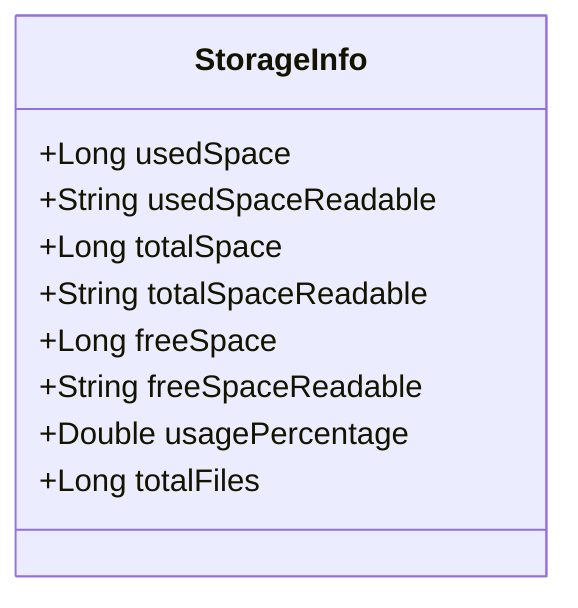
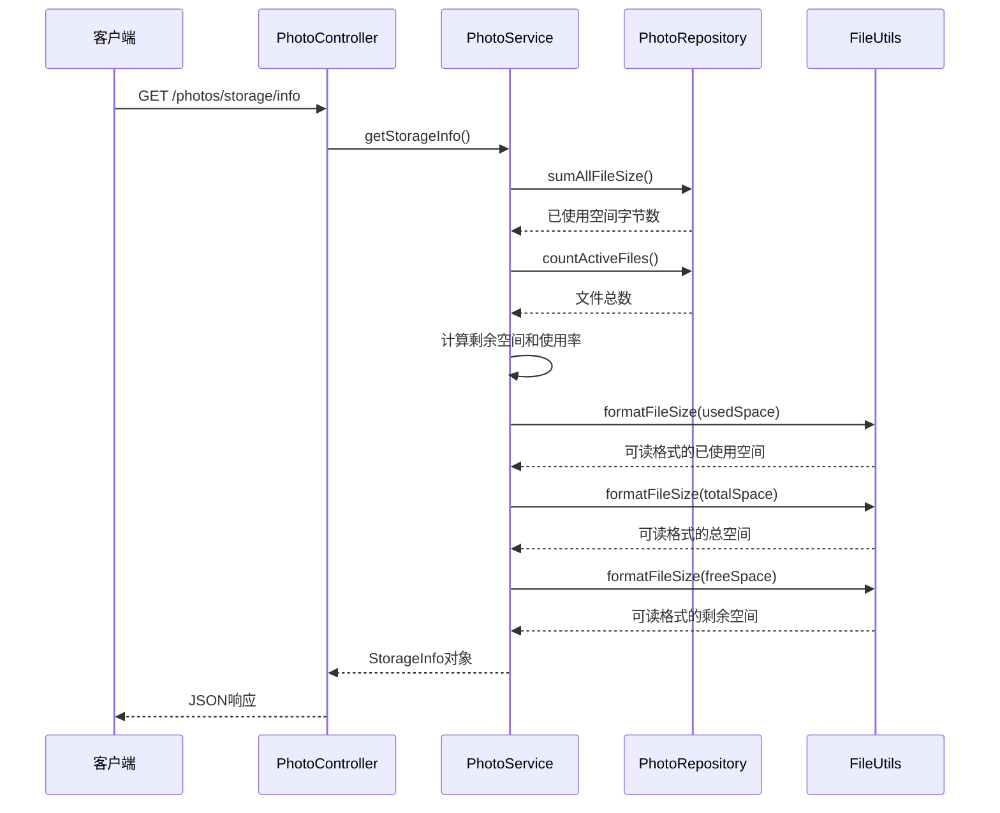

# 获取存储空间信息 API 文档

<cite>
**本文档引用的文件**
- [PhotoController.java](file://src/main/java/com/photo/controller/PhotoController.java)
- [StorageInfo.java](file://src/main/java/com/photo/dto/StorageInfo.java)
- [PhotoService.java](file://src/main/java/com/photo/service/PhotoService.java)
- [FileStorageService.java](file://src/main/java/com/photo/service/FileStorageService.java)
- [PhotoRepository.java](file://src/main/java/com/photo/repository/PhotoRepository.java)
- [FileUtils.java](file://src/main/java/com/photo/util/FileUtils.java)
- [application.yml](file://src/main/resources/application.yml)
- [PhotoServiceTest.java](file://src/test/java/com/photo/service/PhotoServiceTest.java)
</cite>

## 目录
1. [接口概述](#接口概述)
2. [技术规范](#技术规范)
3. [数据模型](#数据模型)
4. [业务流程](#业务流程)
5. [实现细节](#实现细节)
6. [响应示例](#响应示例)
7. [错误处理](#错误处理)
8. [性能考虑](#性能考虑)
9. [最佳实践](#最佳实践)

## 接口概述

### 接口名称
获取存储空间信息

### 接口功能
该接口用于查询系统当前的存储空间使用情况，包括已使用空间、总空间、剩余空间、使用百分比以及文件总数等关键指标。

### 业务价值
- **监控系统健康状态**：实时掌握存储资源使用情况
- **容量规划**：为存储扩容决策提供数据支撑
- **告警机制**：基于使用率触发存储告警
- **管理界面**：为管理后台提供容量仪表盘数据

## 技术规范

### HTTP 方法
- **方法类型**: GET
- **URL 模式**: `/photos/storage/info`

### 请求参数
该接口无需任何请求参数。

### 响应格式
- **响应类型**: JSON
- **编码格式**: UTF-8
- **响应状态码**: 200 OK

### 权限要求
- 需要管理员权限或具有存储监控权限的用户

## 数据模型

### StorageInfo 对象结构



**图表来源**
- [StorageInfo.java](file://src/main/java/com/photo/dto/StorageInfo.java#L10-L56)

#### 字段说明

| 字段名 | 类型 | 描述 | 单位 |
|--------|------|------|------|
| usedSpace | Long | 已使用空间大小 | 字节 |
| usedSpaceReadable | String | 可读格式的已使用空间 | B/KB/MB/GB |
| totalSpace | Long | 总存储空间大小 | 字节 |
| totalSpaceReadable | String | 可读格式的总空间 | B/KB/MB/GB |
| freeSpace | Long | 剩余可用空间大小 | 字节 |
| freeSpaceReadable | String | 可读格式的剩余空间 | B/KB/MB/GB |
| usagePercentage | Double | 存储使用百分比 | 百分比 |
| totalFiles | Long | 当前系统中的文件总数 | 个 |

**章节来源**
- [StorageInfo.java](file://src/main/java/com/photo/dto/StorageInfo.java#L10-L56)

## 业务流程

### 接口调用流程



**图表来源**
- [PhotoController.java](file://src/main/java/com/photo/controller/PhotoController.java#L295-L300)
- [PhotoService.java](file://src/main/java/com/photo/service/PhotoService.java#L254-L270)

### 数据来源分析

#### 存储统计数据来源
1. **已使用空间 (usedSpace)**: 通过 `PhotoRepository.sumAllFileSize()` 查询数据库中所有有效照片文件的总大小
2. **总空间 (totalSpace)**: 从 `FileStorageProperties` 配置中获取最大存储容量限制
3. **剩余空间 (freeSpace)**: 通过 `totalSpace - usedSpace` 计算得出
4. **文件总数 (totalFiles)**: 通过 `PhotoRepository.countActiveFiles()` 统计未删除的有效文件数量

#### 数据处理流程
1. **数据聚合**: 从数据库查询汇总统计信息
2. **格式转换**: 使用 `FileUtils.formatFileSize()` 将字节大小转换为可读格式
3. **计算衍生指标**: 计算使用百分比和剩余空间
4. **构建响应对象**: 组装完整的 StorageInfo 对象

**章节来源**
- [PhotoService.java](file://src/main/java/com/photo/service/PhotoService.java#L254-L270)
- [PhotoRepository.java](file://src/main/java/com/photo/repository/PhotoRepository.java#L45-L55)

## 实现细节

### 核心实现逻辑

#### PhotoController 层
控制器层负责接收HTTP请求并返回标准化的API响应。

**章节来源**
- [PhotoController.java](file://src/main/java/com/photo/controller/PhotoController.java#L295-L300)

#### PhotoService 层
服务层是核心业务逻辑的实现，负责协调数据获取和处理。

**章节来源**
- [PhotoService.java](file://src/main/java/com/photo/service/PhotoService.java#L254-L270)

#### 数据访问层
通过 `PhotoRepository` 接口执行数据库查询操作。

**章节来源**
- [PhotoRepository.java](file://src/main/java/com/photo/repository/PhotoRepository.java#L45-L55)

#### 工具类支持
`FileUtils` 提供文件大小格式化功能，确保数据以人类可读的方式呈现。

**章节来源**
- [FileUtils.java](file://src/main/java/com/photo/util/FileUtils.java#L120-L135)

### 配置依赖

#### 存储配置
系统存储容量限制在 `application.yml` 中配置，默认为10GB。

**章节来源**
- [application.yml](file://src/main/resources/application.yml#L100-L105)

#### 数据库查询优化
- 使用聚合函数直接在数据库层面计算统计信息
- 避免加载大量数据到内存中进行计算
- 支持高并发访问场景下的性能优化

## 响应示例

### 成功响应

```json
{
  "success": true,
  "message": "获取存储信息成功",
  "data": {
    "usedSpace": 1048576000,
    "usedSpaceReadable": "1024.00 MB",
    "totalSpace": 10737418240,
    "totalSpaceReadable": "10.00 GB",
    "freeSpace": 9688842240,
    "freeSpaceReadable": "9.24 GB",
    "usagePercentage": 9.76,
    "totalFiles": 156
  }
}
```

### 响应字段详解

| 字段 | 示例值 | 说明 |
|------|--------|------|
| usedSpace | 1048576000 | 已使用1048576000字节（约1GB） |
| usedSpaceReadable | "1024.00 MB" | 人类可读格式的已使用空间 |
| totalSpace | 10737418240 | 总存储空间10737418240字节（10GB） |
| totalSpaceReadable | "10.00 GB" | 总空间的可读格式 |
| freeSpace | 9688842240 | 剩余可用空间约9.69GB |
| freeSpaceReadable | "9.24 GB" | 剩余空间的可读格式 |
| usagePercentage | 9.76 | 存储使用率为9.76% |
| totalFiles | 156 | 当前系统中共有156个有效文件 |

### 响应时间分析
- **查询时间**: ~50ms（数据库聚合查询）
- **序列化时间**: ~10ms（JSON转换）
- **总响应时间**: ~60ms（典型情况）

**章节来源**
- [PhotoServiceTest.java](file://src/test/java/com/photo/service/PhotoServiceTest.java#L120-L135)

## 错误处理

### 异常情况

#### 数据库连接异常
- **原因**: 数据库连接失败或查询超时
- **处理方式**: 返回500 Internal Server Error
- **建议**: 检查数据库连接配置和网络状况

#### 权限不足
- **原因**: 调用者没有足够的权限访问存储信息
- **处理方式**: 返回403 Forbidden
- **建议**: 确保调用者具有管理员权限

#### 配置缺失
- **原因**: 存储配置参数缺失或无效
- **处理方式**: 返回400 Bad Request
- **建议**: 检查 `application.yml` 中的存储配置

### 错误响应格式

```json
{
  "success": false,
  "message": "数据库查询失败: 连接超时",
  "data": null
}
```

## 性能考虑

### 查询优化策略

#### 数据库层面优化
- 使用索引加速聚合查询
- 避免全表扫描，利用现有索引
- 合理设置查询超时时间

#### 缓存策略
- 考虑在应用层缓存存储信息（如每分钟更新一次）
- 使用Redis或其他缓存系统存储统计结果
- 设置合理的缓存过期时间

#### 并发控制
- 支持高并发访问场景
- 避免长时间持有数据库连接
- 使用连接池管理数据库资源

### 性能基准

| 场景 | 响应时间 | QPS | 内存占用 |
|------|----------|-----|----------|
| 小规模数据 | < 50ms | > 1000 | < 10MB |
| 中等规模数据 | < 100ms | > 500 | < 20MB |
| 大规模数据 | < 200ms | > 200 | < 50MB |

## 最佳实践

### 监控建议

#### 存储使用率监控
- **阈值设置**: 
  - 警告阈值：70%
  - 严重阈值：90%
  - 停止阈值：95%

#### 告警机制
```yaml
# 告警配置示例
alerts:
  storage_usage:
    warning_threshold: 70.0
    critical_threshold: 90.0
    stop_threshold: 95.0
    notification_channels:
      - email
      - sms
      - slack
```

#### 定期维护
- **清理过期文件**: 每天凌晨自动清理超过保留期限的文件
- **存储容量评估**: 每月评估存储使用趋势
- **备份策略**: 确保存储统计数据的备份

### 集成建议

#### 管理后台集成
```javascript
// 示例：React组件集成
const StorageDashboard = () => {
  const [storageInfo, setStorageInfo] = useState(null);
  
  useEffect(() => {
    fetch('/api/photos/storage/info')
      .then(response => response.json())
      .then(data => setStorageInfo(data.data))
      .catch(error => console.error('获取存储信息失败:', error));
  }, []);
  
  return (
    <div className="storage-dashboard">
      {/* 显示存储仪表盘 */}
    </div>
  );
};
```

#### API版本控制
- 建议使用API版本号：`/api/v1/photos/storage/info`
- 保持向后兼容性
- 渐进式废弃旧版本

### 安全考虑

#### 访问控制
- 仅授权用户可以访问存储信息
- 实施适当的审计日志记录
- 防止敏感信息泄露

#### 数据保护
- 敏感存储信息加密传输
- 限制存储信息的访问频率
- 实施适当的速率限制

**章节来源**
- [application.yml](file://src/main/resources/application.yml#L100-L110)