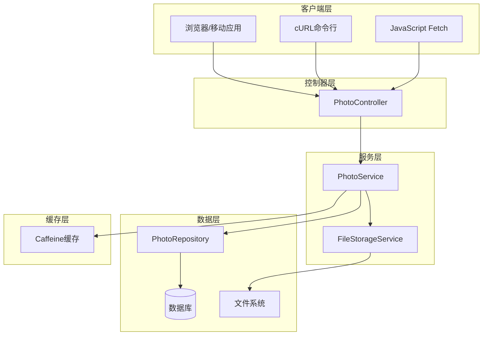
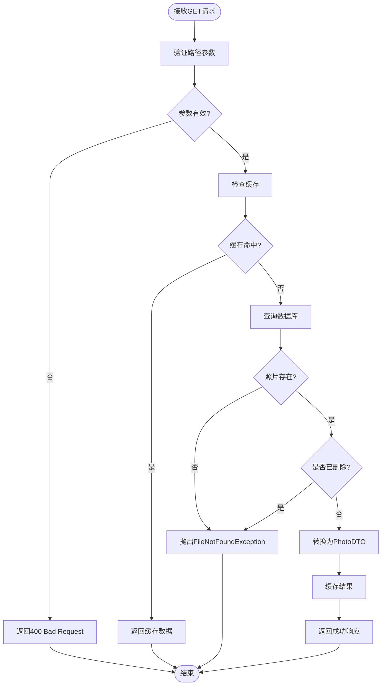
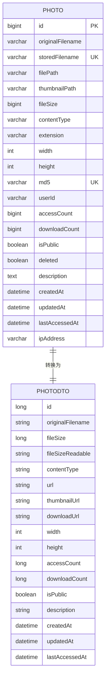
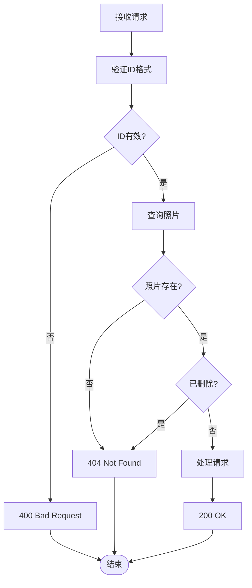
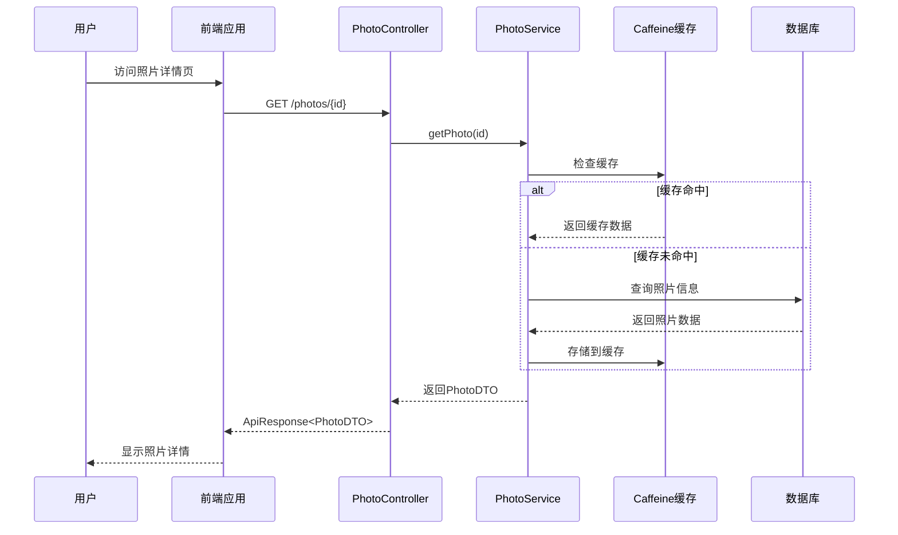

# 获取照片信息 API 文档

<cite>
**本文档引用的文件**
- [PhotoController.java](file://src/main/java/com/photo/controller/PhotoController.java)
- [PhotoDTO.java](file://src/main/java/com/photo/dto/PhotoDTO.java)
- [Photo.java](file://src/main/java/com/photo/entity/Photo.java)
- [PhotoService.java](file://src/main/java/com/photo/service/PhotoService.java)
- [ApiResponse.java](file://src/main/java/com/photo/dto/ApiResponse.java)
- [FileNotFoundException.java](file://src/main/java/com/photo/exception/FileNotFoundException.java)
- [PhotoControllerTest.java](file://src/test/java/com/photo/controller/PhotoControllerTest.java)
- [application.yml](file://src/main/resources/application.yml)
- [pom.xml](file://pom.xml)
</cite>

## 目录
1. [简介](#简介)
2. [接口概述](#接口概述)
3. [技术架构](#技术架构)
4. [详细接口说明](#详细接口说明)
5. [数据模型](#数据模型)
6. [响应格式](#响应格式)
7. [错误处理](#错误处理)
8. [使用示例](#使用示例)
9. [业务流程分析](#业务流程分析)
10. [性能考虑](#性能考虑)
11. [故障排除指南](#故障排除指南)
12. [总结](#总结)

## 简介

本文档详细说明了PhotoController中getPhoto接口的功能、使用方法和技术规范。该接口是照片管理系统的核心功能之一，负责根据照片ID获取完整的照片元数据信息，为前端应用提供详细的照片信息展示支持。

## 接口概述

### 基本信息

| 属性 | 值 |
|------|-----|
| HTTP方法 | GET |
| URL模式 | `/photos/{id}` |
| 路径参数 | `id` (Long类型) |
| 功能描述 | 根据照片ID获取详细信息 |
| 返回类型 | `ApiResponse<PhotoDTO>` |

### 接口作用

该接口作为照片详情页的核心数据源，提供以下核心功能：
- 获取指定ID照片的完整元数据信息
- 支持缓存机制提升性能
- 提供标准化的响应格式
- 支持防盗链安全检查

## 技术架构



**图表来源**
- [PhotoController.java](file://src/main/java/com/photo/controller/PhotoController.java#L1-L316)
- [PhotoService.java](file://src/main/java/com/photo/service/PhotoService.java#L1-L385)

## 详细接口说明

### 方法签名

```java
@GetMapping("/{id}")
public ResponseEntity<ApiResponse<PhotoDTO>> getPhoto(
    @Parameter(description = "照片ID") @PathVariable Long id)
```

### 参数说明

| 参数名 | 类型 | 必填 | 描述 |
|--------|------|------|------|
| id | Long | 是 | 照片的唯一标识符，数据库主键 |

### 请求处理流程



**节点来源**
- [PhotoController.java](file://src/main/java/com/photo/controller/PhotoController.java#L184-L192)
- [PhotoService.java](file://src/main/java/com/photo/service/PhotoService.java#L124-L138)

**节点来源**
- [PhotoController.java](file://src/main/java/com/photo/controller/PhotoController.java#L184-L192)
- [PhotoService.java](file://src/main/java/com/photo/service/PhotoService.java#L124-L138)

## 数据模型

### PhotoDTO 结构

PhotoDTO是接口返回的核心数据结构，包含了照片的所有元数据信息：

| 字段名 | 类型 | 描述 | 示例值 |
|--------|------|------|--------|
| id | Long | 照片ID | 12345 |
| originalFilename | String | 原始文件名 | "IMG_20231015_123456.jpg" |
| fileSize | Long | 文件大小(字节) | 2048576 |
| fileSizeReadable | String | 可读格式文件大小 | "2.00 MB" |
| contentType | String | MIME类型 | "image/jpeg" |
| url | String | 在线预览URL | "/api/photos/view/abc123.jpg" |
| thumbnailUrl | String | 缩略图URL | "/api/photos/thumbnail/abc123.jpg" |
| downloadUrl | String | 下载URL | "/api/photos/download/abc123.jpg" |
| width | Integer | 图片宽度 | 1920 |
| height | Integer | 图片高度 | 1080 |
| accessCount | Long | 访问次数 | 156 |
| downloadCount | Long | 下载次数 | 42 |
| isPublic | Boolean | 是否公开 | true |
| description | String | 照片描述 | "风景照片" |
| createdAt | LocalDateTime | 创建时间 | "2023-10-15T12:34:56" |
| updatedAt | LocalDateTime | 更新时间 | "2023-10-15T12:34:56" |
| lastAccessedAt | LocalDateTime | 最后访问时间 | "2023-10-15T15:20:30" |

**节点来源**
- [PhotoDTO.java](file://src/main/java/com/photo/dto/PhotoDTO.java#L1-L104)

### 实体关系图



**图表来源**
- [Photo.java](file://src/main/java/com/photo/entity/Photo.java#L1-L174)
- [PhotoDTO.java](file://src/main/java/com/photo/dto/PhotoDTO.java#L1-L104)

## 响应格式

### 成功响应格式

当请求成功且照片存在时，返回标准的ApiResponse格式：

```json
{
  "code": 200,
  "message": "操作成功",
  "data": {
    "id": 12345,
    "originalFilename": "IMG_20231015_123456.jpg",
    "fileSize": 2048576,
    "fileSizeReadable": "2.00 MB",
    "contentType": "image/jpeg",
    "url": "/api/photos/view/abc123.jpg",
    "thumbnailUrl": "/api/photos/thumbnail/abc123.jpg",
    "downloadUrl": "/api/photos/download/abc123.jpg",
    "width": 1920,
    "height": 1080,
    "accessCount": 156,
    "downloadCount": 42,
    "isPublic": true,
    "description": "风景照片",
    "createdAt": "2023-10-15T12:34:56",
    "updatedAt": "2023-10-15T12:34:56",
    "lastAccessedAt": "2023-10-15T15:20:30"
  },
  "timestamp": 1697376896123
}
```

### 响应头信息

| 头名称 | 值 | 描述 |
|--------|-----|------|
| Content-Type | application/json;charset=UTF-8 | 响应内容类型 |
| Cache-Control | max-age=3600 | 缓存控制策略 |

**节点来源**
- [ApiResponse.java](file://src/main/java/com/photo/dto/ApiResponse.java#L1-L63)
- [PhotoController.java](file://src/main/java/com/photo/controller/PhotoController.java#L184-L192)

## 错误处理

### 404 Not Found - 照片不存在

当请求的ID不存在或照片已被删除时，返回404状态码：

```json
{
  "code": 404,
  "message": "照片不存在: 12345",
  "data": null,
  "timestamp": 1697376896123
}
```

### 500 Internal Server Error - 服务器错误

当发生内部服务器错误时，返回500状态码：

```json
{
  "code": 500,
  "message": "服务器内部错误",
  "data": null,
  "timestamp": 1697376896123
}
```

### 错误处理流程



**节点来源**
- [PhotoService.java](file://src/main/java/com/photo/service/PhotoService.java#L124-L138)
- [FileNotFoundException.java](file://src/main/java/com/photo/exception/FileNotFoundException.java#L1-L16)

## 使用示例

### cURL 命令示例

#### 获取特定ID照片信息
```bash
curl -X GET "http://localhost:8080/api/photos/12345" \
  -H "Accept: application/json" \
  -H "Authorization: Bearer YOUR_TOKEN"
```

#### 带自定义头部的请求
```bash
curl -X GET "http://localhost:8080/api/photos/12345" \
  -H "Accept: application/json" \
  -H "User-Agent: MyApp/1.0" \
  -H "Cache-Control: no-cache"
```

### JavaScript Fetch 示例

#### 基本获取请求
```javascript
fetch('http://localhost:8080/api/photos/12345', {
    method: 'GET',
    headers: {
        'Content-Type': 'application/json',
        'Accept': 'application/json'
    }
})
.then(response => {
    if (!response.ok) {
        throw new Error(`HTTP error! status: ${response.status}`);
    }
    return response.json();
})
.then(data => {
    console.log('照片信息:', data.data);
})
.catch(error => {
    console.error('获取照片失败:', error);
});
```

#### 使用async/await的现代方式
```javascript
async function fetchPhotoInfo(photoId) {
    try {
        const response = await fetch(`/api/photos/${photoId}`, {
            method: 'GET',
            headers: {
                'Accept': 'application/json'
            }
        });
        
        if (!response.ok) {
            throw new Error(`HTTP error! status: ${response.status}`);
        }
        
        const result = await response.json();
        return result.data;
        
    } catch (error) {
        console.error('获取照片信息失败:', error);
        throw error;
    }
}

// 使用示例
const photoData = await fetchPhotoInfo(12345);
console.log('照片标题:', photoData.originalFilename);
console.log('访问次数:', photoData.accessCount);
```

#### 带错误处理的完整示例
```javascript
class PhotoApiClient {
    constructor(baseUrl = '/api') {
        this.baseUrl = baseUrl;
    }
    
    async getPhoto(id) {
        try {
            const response = await fetch(`${this.baseUrl}/photos/${id}`, {
                method: 'GET',
                headers: {
                    'Accept': 'application/json'
                }
            });
            
            if (response.status === 404) {
                throw new Error('照片不存在');
            }
            
            if (!response.ok) {
                throw new Error(`服务器错误: ${response.status}`);
            }
            
            const result = await response.json();
            return result.data;
            
        } catch (error) {
            console.error('获取照片信息失败:', error.message);
            throw error;
        }
    }
    
    // 格式化显示照片信息
    formatPhotoDisplay(photoData) {
        return `
            <div class="photo-info">
                <h3>${photoData.originalFilename}</h3>
                <p>尺寸: ${photoData.width}x${photoData.height}</p>
                <p>大小: ${photoData.fileSizeReadable}</p>
                <p>访问: ${photoData.accessCount}次</p>
                <p>下载: ${photoData.downloadCount}次</p>
                <p>上传时间: ${new Date(photoData.createdAt).toLocaleString()}</p>
            </div>
        `;
    }
}

// 使用客户端
const client = new PhotoApiClient();
client.getPhoto(12345)
    .then(photo => {
        const displayHtml = client.formatPhotoDisplay(photo);
        document.getElementById('photo-display').innerHTML = displayHtml;
    })
    .catch(error => {
        console.error('无法显示照片信息:', error);
    });
```

**节点来源**
- [PhotoControllerTest.java](file://src/test/java/com/photo/controller/PhotoControllerTest.java#L85-L95)

## 业务流程分析

### 接口在业务流程中的作用

该接口在整个照片管理系统中扮演着关键角色，是连接前端展示层和后端数据层的重要桥梁：



**图表来源**
- [PhotoController.java](file://src/main/java/com/photo/controller/PhotoController.java#L184-L192)
- [PhotoService.java](file://src/main/java/com/photo/service/PhotoService.java#L124-L138)

### 关键业务场景

#### 1. 照片详情页展示
- **触发时机**: 用户点击照片缩略图或从列表进入详情页
- **数据需求**: 完整的照片元数据、访问统计、下载链接
- **性能要求**: 快速响应，支持高并发访问

#### 2. 客户端状态管理
- **应用场景**: 移动应用需要缓存照片信息
- **数据用途**: 显示照片基本信息、更新本地状态
- **缓存策略**: 利用Caffeine缓存提升性能

#### 3. 分享链接处理
- **使用场景**: 点击分享链接直接访问照片详情
- **安全考虑**: 需要验证照片的公开状态
- **SEO优化**: 提供完整的元数据支持搜索引擎抓取

**节点来源**
- [PhotoController.java](file://src/main/java/com/photo/controller/PhotoController.java#L184-L192)
- [PhotoService.java](file://src/main/java/com/photo/service/PhotoService.java#L124-L138)

## 性能考虑

### 缓存策略

系统采用多层缓存机制提升性能：

| 缓存层级 | 缓存类型 | 过期时间 | 缓存键 | 适用场景 |
|----------|----------|----------|--------|----------|
| 应用层缓存 | Caffeine | 1小时 | `photos:{id}` | 高频访问的照片信息 |
| 数据库查询 | Hibernate二级缓存 | 1小时 | 实体ID | 减少数据库查询 |
| 浏览器缓存 | HTTP Cache-Control | 1小时 | 响应头 | 减少网络传输 |

### 性能优化措施

1. **数据库索引优化**
   - `photos.id`: 主键索引
   - `photos.storedFilename`: 文件名查询索引
   - `photos.userId`: 用户照片查询索引

2. **查询优化**
   - 使用`findById`避免全表扫描
   - 条件查询包含`deleted=False`过滤已删除记录

3. **响应优化**
   - 启用HTTP压缩减少传输大小
   - 设置适当的缓存控制头

**节点来源**
- [PhotoService.java](file://src/main/java/com/photo/service/PhotoService.java#L124-L138)
- [application.yml](file://src/main/resources/application.yml#L47-L52)

## 故障排除指南

### 常见问题及解决方案

#### 1. 照片不存在错误 (404)

**症状**: 返回404错误，提示"照片不存在: {id}"

**可能原因**:
- 请求的ID不存在于数据库中
- 照片已被软删除
- ID格式不正确

**解决步骤**:
```bash
# 验证ID是否存在
curl -X GET "http://localhost:8080/api/photos/list" \
  -H "Accept: application/json"

# 检查具体ID
curl -X GET "http://localhost:8080/api/photos/12345" \
  -H "Accept: application/json"
```

#### 2. 服务器内部错误 (500)

**症状**: 返回500错误，提示服务器内部错误

**可能原因**:
- 数据库连接问题
- 文件系统访问权限
- 内存不足

**解决步骤**:
1. 检查应用日志
2. 验证数据库连接
3. 检查磁盘空间

#### 3. 响应速度慢

**症状**: API响应时间超过预期

**优化建议**:
- 检查缓存配置
- 优化数据库查询
- 监控系统资源使用

### 调试工具和技巧

#### 启用详细日志
```yaml
logging:
  level:
    com.photo: DEBUG
    org.springframework.web: DEBUG
```

#### 性能监控
```bash
# 监控API响应时间
time curl -s -w "@curl-format.txt" -o /dev/null \
  "http://localhost:8080/api/photos/12345"

# curl-format.txt内容:
#     time_namelookup:  %{time_namelookup}\n
#        time_connect:  %{time_connect}\n
#     time_appconnect:  %{time_appconnect}\n
#    time_pretransfer:  %{time_pretransfer}\n
#       time_redirect:  %{time_redirect}\n
#  time_starttransfer:  %{time_starttransfer}\n
#                     ----------\n
#          time_total:  %{time_total}\n
```

**节点来源**
- [PhotoService.java](file://src/main/java/com/photo/service/PhotoService.java#L124-L138)
- [application.yml](file://src/main/resources/application.yml#L120-L130)

## 总结

PhotoController的getPhoto接口是一个设计精良的RESTful API，具有以下特点：

### 核心优势

1. **标准化响应格式**: 使用统一的ApiResponse包装，便于客户端处理
2. **完善的错误处理**: 提供清晰的错误信息和适当的HTTP状态码
3. **高性能设计**: 采用多层缓存机制，支持高并发访问
4. **安全性考虑**: 包含防盗链检查和权限验证
5. **易于集成**: 提供标准的JSON格式和清晰的API文档

### 技术亮点

- **Spring Boot集成**: 利用Spring生态系统的最佳实践
- **缓存优化**: Caffeine缓存提升响应性能
- **异常处理**: 统一的异常处理机制
- **测试覆盖**: 完整的单元测试确保代码质量

### 应用价值

该接口作为照片管理系统的核心组件，为前端应用提供了稳定可靠的数据服务，支撑了照片详情页展示、客户端状态管理和分享链接处理等多种业务场景。其良好的设计和实现质量确保了系统的可维护性和可扩展性。

通过本文档的详细说明，开发者可以快速理解和使用该API，同时也能深入理解其技术实现细节和最佳实践。