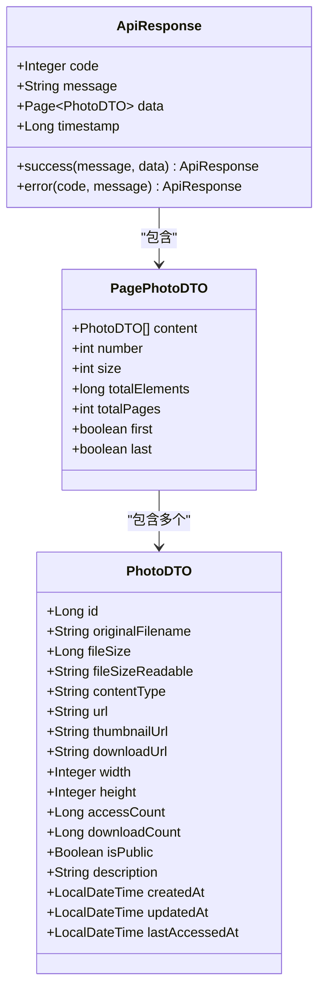
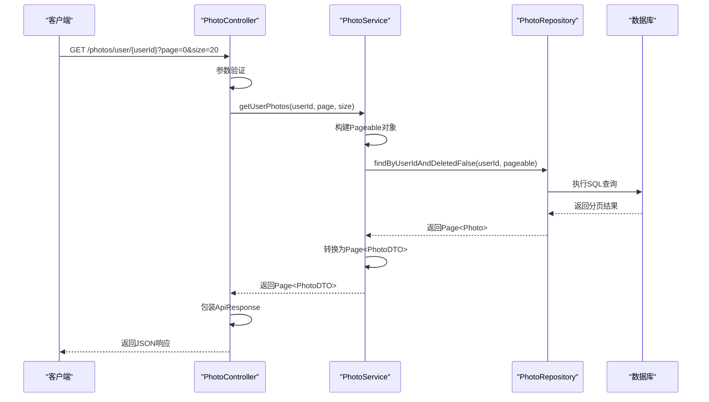
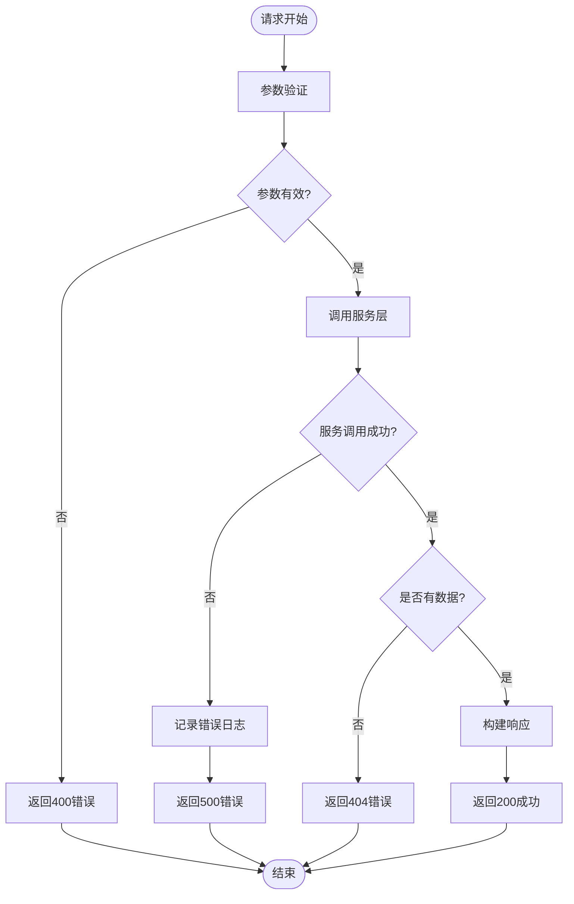

# 获取用户照片列表

<cite>
**本文档中引用的文件**
- [PhotoController.java](file://src/main/java/com/photo/controller/PhotoController.java)
- [PhotoService.java](file://src/main/java/com/photo/service/PhotoService.java)
- [PhotoDTO.java](file://src/main/java/com/photo/dto/PhotoDTO.java)
- [Photo.java](file://src/main/java/com/photo/entity/Photo.java)
- [PhotoRepository.java](file://src/main/java/com/photo/repository/PhotoRepository.java)
- [ApiResponse.java](file://src/main/java/com/photo/dto/ApiResponse.java)
- [application.yml](file://src/main/resources/application.yml)
- [pom.xml](file://pom.xml)
</cite>

## 接口概述

### 基本信息
- **HTTP方法**: GET
- **URL模式**: `/photos/user/{userId}`
- **功能描述**: 分页查询指定用户的照片列表，支持私有和公开照片
- **业务场景**: 用户管理自己上传照片的核心接口，支持分页浏览个人图库

### 请求参数

| 参数名 | 类型 | 必填 | 默认值 | 描述 |
|--------|------|------|--------|------|
| userId | String | 是 | - | 目标用户的唯一标识符 |
| page | int | 否 | 0 | 页码，从0开始计数 |
| size | int | 否 | 20 | 每页显示的照片数量 |

### 响应结构



**图表来源**
- [ApiResponse.java](file://src/main/java/com/photo/dto/ApiResponse.java#L1-L63)
- [PhotoDTO.java](file://src/main/java/com/photo/dto/PhotoDTO.java#L1-L104)

**章节来源**
- [PhotoController.java](file://src/main/java/com/photo/controller/PhotoController.java#L243-L252)
- [PhotoService.java](file://src/main/java/com/photo/service/PhotoService.java#L164-L168)

## 详细说明

### 功能特性

1. **分页查询**: 支持对用户照片进行分页浏览
2. **权限控制**: 只返回指定用户的私有和公开照片
3. **性能优化**: 使用Spring Data JPA的分页机制
4. **缓存支持**: 对频繁访问的照片信息进行缓存

### 实现原理



**图表来源**
- [PhotoController.java](file://src/main/java/com/photo/controller/PhotoController.java#L243-L252)
- [PhotoService.java](file://src/main/java/com/photo/service/PhotoService.java#L164-L168)
- [PhotoRepository.java](file://src/main/java/com/photo/repository/PhotoRepository.java#L29-L31)

### 响应示例

#### 成功响应示例

```json
{
  "code": 200,
  "message": "操作成功",
  "data": {
    "content": [
      {
        "id": 1,
        "originalFilename": "photo1.jpg",
        "fileSize": 1024000,
        "fileSizeReadable": "1.02 MB",
        "contentType": "image/jpeg",
        "url": "/api/photos/view/photo1.jpg",
        "thumbnailUrl": "/api/photos/thumbnail/photo1.jpg",
        "downloadUrl": "/api/photos/download/photo1.jpg",
        "width": 1920,
        "height": 1080,
        "accessCount": 15,
        "downloadCount": 3,
        "isPublic": true,
        "description": "风景照片",
        "createdAt": "2024-01-15T10:30:00",
        "updatedAt": "2024-01-15T10:30:00",
        "lastAccessedAt": "2024-01-20T14:20:00"
      }
    ],
    "number": 0,
    "size": 20,
    "totalElements": 150,
    "totalPages": 8,
    "first": true,
    "last": false
  },
  "timestamp": 1705356000000
}
```

#### 错误响应示例

```json
{
  "code": 404,
  "message": "用户不存在或没有照片",
  "data": null,
  "timestamp": 1705356000000
}
```

**章节来源**
- [PhotoController.java](file://src/main/java/com/photo/controller/PhotoController.java#L243-L252)
- [ApiResponse.java](file://src/main/java/com/photo/dto/ApiResponse.java#L30-L45)

## 技术细节

### 分页机制

系统使用Spring Data JPA的分页功能，具体实现如下：

1. **分页参数**: `page`从0开始，`size`表示每页条目数
2. **排序规则**: 按创建时间降序排列（最新的照片在前面）
3. **过滤条件**: 只查询未删除的（`deleted = false`）照片

### 数据库查询

```sql
-- 实际执行的SQL查询
SELECT p.* FROM photos p 
WHERE p.user_id = ? AND p.deleted = false 
ORDER BY p.created_at DESC 
LIMIT ? OFFSET ?
```

### 性能考虑

1. **索引优化**: 数据库表有多个索引支持高效查询
2. **缓存策略**: 对照片信息进行缓存减少数据库访问
3. **软删除**: 使用`deleted`字段标记删除而非物理删除

**章节来源**
- [PhotoService.java](file://src/main/java/com/photo/service/PhotoService.java#L164-L168)
- [PhotoRepository.java](file://src/main/java/com/photo/repository/PhotoRepository.java#L29-L31)

## 使用示例

### curl命令示例

```bash
# 获取第一页，每页10张照片
curl -X GET "http://localhost:8080/api/photos/user/user123?page=0&size=10"

# 获取第二页，每页20张照片  
curl -X GET "http://localhost:8080/api/photos/user/user123?page=1&size=20"

# 获取特定用户的所有照片（不推荐大量数据）
curl -X GET "http://localhost:8080/api/photos/user/user123?page=0&size=100"
```

### JavaScript前端示例

```javascript
// 前端分页加载示例
class PhotoGallery {
  constructor(userId) {
    this.userId = userId;
    this.currentPage = 0;
    this.pageSize = 20;
    this.totalPages = 0;
    this.loading = false;
  }
  
  async loadPhotos(page = 0) {
    if (this.loading) return;
    this.loading = true;
    
    try {
      const response = await fetch(`/api/photos/user/${this.userId}?page=${page}&size=${this.pageSize}`);
      const data = await response.json();
      
      if (data.code === 200) {
        this.displayPhotos(data.data.content);
        this.updatePaginationControls(data.data);
      }
    } catch (error) {
      console.error('加载照片失败:', error);
    } finally {
      this.loading = false;
    }
  }
  
  displayPhotos(photos) {
    const container = document.getElementById('photo-gallery');
    container.innerHTML = '';
    
    photos.forEach(photo => {
      const photoElement = document.createElement('div');
      photoElement.className = 'photo-item';
      photoElement.innerHTML = `
        
        <div class="photo-info">
          <span>${photo.originalFilename}</span>
          <span>${photo.fileSizeReadable}</span>
        </div>
      `;
      container.appendChild(photoElement);
    });
  }
  
  updatePaginationControls(paginationData) {
    this.currentPage = paginationData.number;
    this.totalPages = paginationData.totalPages;
    
    // 更新分页控件状态
    document.getElementById('prev-page').disabled = paginationData.first;
    document.getElementById('next-page').disabled = paginationData.last;
    document.getElementById('page-info').textContent = 
      `${paginationData.number + 1} / ${paginationData.totalPages}`;
  }
}

// 使用示例
const gallery = new PhotoGallery('user123');
gallery.loadPhotos();

// 绑定分页按钮事件
document.getElementById('prev-page').addEventListener('click', () => {
  if (gallery.currentPage > 0) {
    gallery.loadPhotos(gallery.currentPage - 1);
  }
});

document.getElementById('next-page').addEventListener('click', () => {
  if (gallery.currentPage < gallery.totalPages - 1) {
    gallery.loadPhotos(gallery.currentPage + 1);
  }
});
```

### Java客户端示例

```java
public class PhotoApiClient {
    
    private final RestTemplate restTemplate;
    
    public PhotoApiClient(RestTemplate restTemplate) {
        this.restTemplate = restTemplate;
    }
    
    public ApiResponse<Page<PhotoDTO>> getUserPhotos(String userId, int page, int size) {
        String url = String.format("/api/photos/user/%s?page=%d&size=%d", userId, page, size);
        
        HttpHeaders headers = new HttpHeaders();
        headers.setBearerAuth(getAccessToken());
        
        HttpEntity<String> entity = new HttpEntity<>(headers);
        
        return restTemplate.exchange(url, HttpMethod.GET, entity, 
            new ParameterizedTypeReference<ApiResponse<Page<PhotoDTO>>>() {}).getBody();
    }
    
    public void processPhotos(String userId) {
        int page = 0;
        int pageSize = 20;
        
        ApiResponse<Page<PhotoDTO>> response;
        do {
            response = getUserPhotos(userId, page, pageSize);
            
            if (response.getCode() == 200) {
                Page<PhotoDTO> photos = response.getData();
                
                // 处理当前页的照片
                photos.getContent().forEach(photo -> {
                    System.out.println("照片: " + photo.getOriginalFilename() + 
                                     ", 大小: " + photo.getFileSizeReadable());
                });
                
                page++;
            }
        } while (response != null && response.getCode() == 200 && 
                 response.getData() != null && 
                 !response.getData().isLast());
    }
}
```

## 错误处理

### 常见错误码

| 错误码 | 错误信息 | 原因 | 解决方案 |
|--------|----------|------|----------|
| 400 | 参数错误 | userId为空或page/size格式错误 | 检查请求参数格式 |
| 404 | 用户不存在 | 指定的userId对应的用户不存在 | 确认用户ID正确性 |
| 500 | 服务器内部错误 | 数据库查询异常 | 检查数据库连接和查询语句 |

### 异常处理流程



**章节来源**
- [PhotoController.java](file://src/main/java/com/photo/controller/PhotoController.java#L243-L252)

## 性能优化建议

### 查询优化

1. **合理设置分页大小**: 避免一次性查询过多数据
2. **使用适当的索引**: 确保`user_id`和`created_at`字段有索引
3. **缓存策略**: 对频繁访问的用户照片进行缓存

### 前端优化

1. **懒加载**: 只在需要时加载下一页数据
2. **虚拟滚动**: 对于大量照片使用虚拟滚动技术
3. **图片预加载**: 提前加载即将显示的缩略图

### 后端优化

1. **数据库连接池**: 合理配置连接池大小
2. **查询优化**: 避免N+1查询问题
3. **缓存层**: 使用Redis等缓存系统

## 安全考虑

### 权限验证

1. **用户身份验证**: 确保请求来自合法用户
2. **数据隔离**: 只返回请求用户自己的照片
3. **访问控制**: 防止越权访问他人照片

### 输入验证

1. **参数校验**: 验证userId格式和长度
2. **分页参数**: 确保page和size在合理范围内
3. **SQL注入防护**: 使用JPA的参数化查询

**章节来源**
- [PhotoService.java](file://src/main/java/com/photo/service/PhotoService.java#L164-L168)
- [PhotoRepository.java](file://src/main/java/com/photo/repository/PhotoRepository.java#L29-L31)

## 总结

`getUserPhotos`接口是照片管理系统的核心功能之一，提供了完整的用户照片分页查询能力。通过合理的分页设计、权限控制和性能优化，确保了系统的可用性和安全性。该接口支持前端灵活的分页加载，为用户提供流畅的照片浏览体验。

在实际使用中，建议根据具体业务需求调整分页大小，并结合缓存机制提升系统性能。同时要注意做好错误处理和安全防护，确保系统的稳定运行。