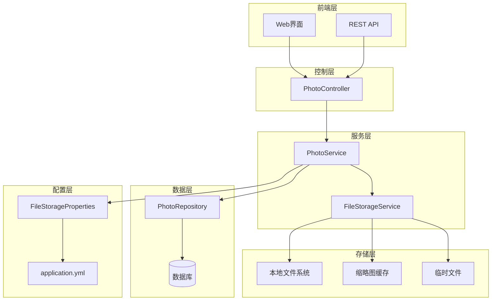
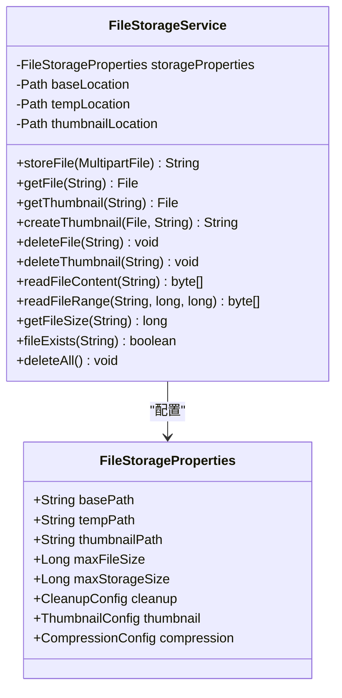
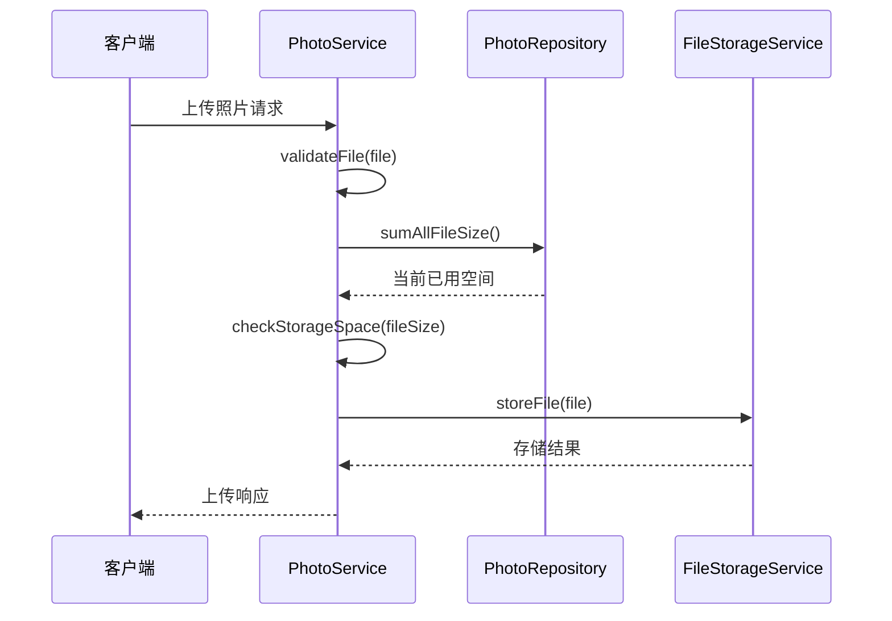
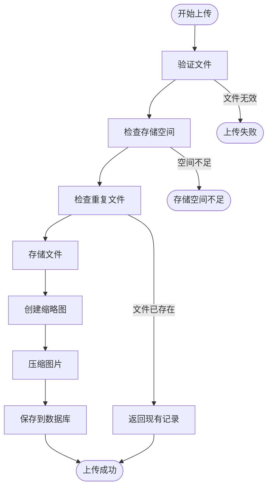
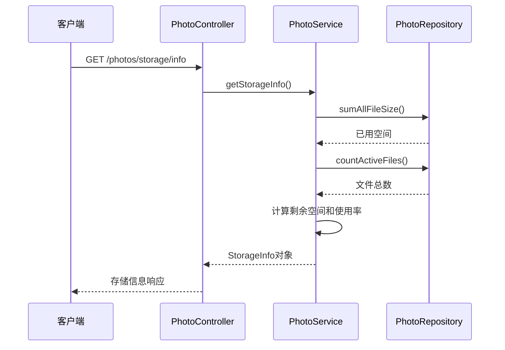
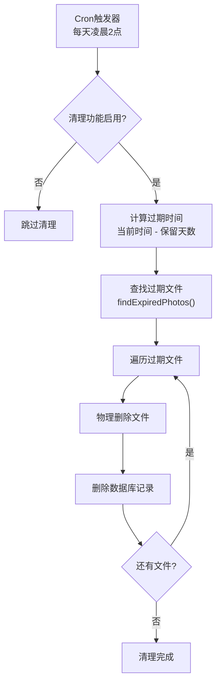
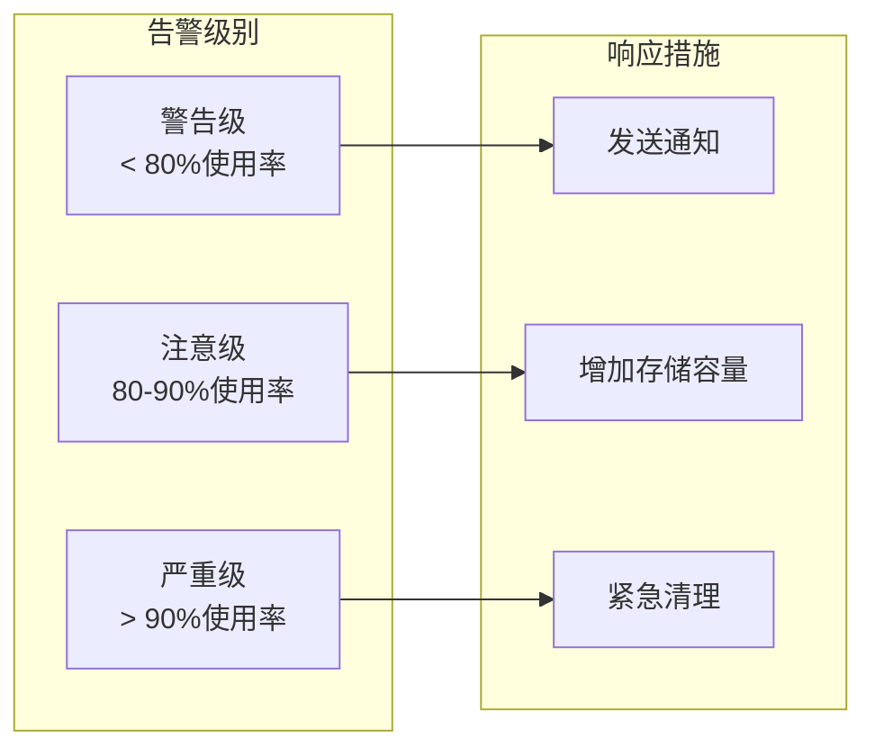

# 存储管理

<cite>
**本文档中引用的文件**
- [FileStorageService.java](file://src/main/java/com/photo/service/FileStorageService.java)
- [PhotoService.java](file://src/main/java/com/photo/service/PhotoService.java)
- [FileStorageProperties.java](file://src/main/java/com/photo/config/FileStorageProperties.java)
- [application.yml](file://src/main/resources/application.yml)
- [PhotoController.java](file://src/main/java/com/photo/controller/PhotoController.java)
- [StorageInfo.java](file://src/main/java/com/photo/dto/StorageInfo.java)
- [FileUtils.java](file://src/main/java/com/photo/util/FileUtils.java)
- [PhotoRepository.java](file://src/main/java/com/photo/repository/PhotoRepository.java)
</cite>

## 目录
1. [简介](#简介)
2. [系统架构概览](#系统架构概览)
3. [核心组件分析](#核心组件分析)
4. [文件存储生命周期](#文件存储生命周期)
5. [存储容量管理](#存储容量管理)
6. [定时清理机制](#定时清理机制)
7. [监控与告警](#监控与告警)
8. [配置优化指南](#配置优化指南)
9. [最佳实践](#最佳实践)
10. [故障排除](#故障排除)

## 简介

本系统采用分层架构设计，实现了完整的文件存储生命周期管理。通过FileStorageService和PhotoService的协同工作，提供了安全、高效的文件存储解决方案。系统支持多种存储策略配置，具备完善的容量监控和自动清理机制，能够适应不同部署环境的需求。

## 系统架构概览



**图表来源**
- [PhotoController.java](file://src/main/java/com/photo/controller/PhotoController.java#L1-L50)
- [PhotoService.java](file://src/main/java/com/photo/service/PhotoService.java#L1-L50)
- [FileStorageService.java](file://src/main/java/com/photo/service/FileStorageService.java#L1-L50)

## 核心组件分析

### FileStorageService - 文件存储核心服务

FileStorageService是系统的核心存储组件，负责管理本地文件系统的所有读写操作。

#### 主要功能特性



**图表来源**
- [FileStorageService.java](file://src/main/java/com/photo/service/FileStorageService.java#L20-L50)
- [FileStorageProperties.java](file://src/main/java/com/photo/config/FileStorageProperties.java#L15-L40)

#### 安全的文件命名策略

系统采用UUID作为文件命名策略，确保文件名的唯一性和安全性：

- **UUID生成**：使用`UUID.randomUUID().toString()`生成全局唯一标识符
- **格式化处理**：移除UUID中的连字符，生成简洁的文件名
- **扩展名保留**：保持原始文件的扩展名，便于识别文件类型

**章节来源**
- [FileUtils.java](file://src/main/java/com/photo/util/FileUtils.java#L40-L45)

### PhotoService - 照片业务服务

PhotoService负责照片的业务逻辑处理，包括上传、查询、删除等功能。

#### 存储空间检查机制



**图表来源**
- [PhotoService.java](file://src/main/java/com/photo/service/PhotoService.java#L40-L80)
- [PhotoRepository.java](file://src/main/java/com/photo/repository/PhotoRepository.java#L45-L55)

**章节来源**
- [PhotoService.java](file://src/main/java/com/photo/service/PhotoService.java#L350-L385)

## 文件存储生命周期

### 文件上传流程



**图表来源**
- [PhotoService.java](file://src/main/java/com/photo/service/PhotoService.java#L40-L120)

### 文件删除策略

系统采用软删除和硬删除相结合的策略：

1. **软删除**：标记文件为已删除状态，保留文件和数据库记录
2. **硬删除**：物理删除文件和数据库记录，释放存储空间

**章节来源**
- [PhotoService.java](file://src/main/java/com/photo/service/PhotoService.java#L200-L250)

## 存储容量管理

### 存储信息计算

PhotoService提供了详细的存储空间统计功能：

| 指标 | 描述 | 计算方式 |
|------|------|----------|
| 已用空间 | 当前已使用的存储空间 | `photoRepository.sumAllFileSize()` |
| 总空间 | 配置的最大存储容量 | `storageProperties.getMaxStorageSize()` |
| 剩余空间 | 可用的存储空间 | `totalSpace - usedSpace` |
| 使用率 | 存储空间使用百分比 | `(usedSpace / totalSpace) * 100` |
| 文件总数 | 当前活跃文件数量 | `photoRepository.countActiveFiles()` |

**章节来源**
- [PhotoService.java](file://src/main/java/com/photo/service/PhotoService.java#L280-L300)
- [StorageInfo.java](file://src/main/java/com/photo/dto/StorageInfo.java#L1-L57)

### GET /photos/storage/info 接口

该接口提供了实时的存储空间信息：



**图表来源**
- [PhotoController.java](file://src/main/java/com/photo/controller/PhotoController.java#L300-L315)
- [PhotoService.java](file://src/main/java/com/photo/service/PhotoService.java#L280-L300)

**章节来源**
- [PhotoController.java](file://src/main/java/com/photo/controller/PhotoController.java#L300-L315)

## 定时清理机制

### @Scheduled 清理任务

PhotoService实现了基于Spring的定时清理功能：



**图表来源**
- [PhotoService.java](file://src/main/java/com/photo/service/PhotoService.java#L310-L340)

### 清理配置参数

| 参数 | 默认值 | 描述 |
|------|--------|------|
| `cleanup.enabled` | true | 是否启用自动清理功能 |
| `cleanup.daysToKeep` | 30 | 保留文件的天数 |
| `cleanup.cron` | "0 0 2 * * ?" | 定时任务执行时间 |

**章节来源**
- [FileStorageProperties.java](file://src/main/java/com/photo/config/FileStorageProperties.java#L70-L85)
- [PhotoService.java](file://src/main/java/com/photo/service/PhotoService.java#L310-L340)

## 监控与告警

### 存储监控指标

系统提供了多维度的存储监控：

1. **空间使用率监控**
   - 实时计算存储使用率
   - 提供阈值告警机制
   - 支持自定义告警级别

2. **文件数量监控**
   - 统计活跃文件数量
   - 监控文件增长趋势
   - 检测异常文件增长

3. **清理任务监控**
   - 记录清理任务执行时间
   - 统计清理文件数量
   - 监控清理成功率

### 告警策略建议



## 配置优化指南

### 不同部署环境的配置建议

#### 开发环境配置
```yaml
file:
  storage:
    max-storage-size: 1073741824  # 1GB
    cleanup:
      enabled: true
      days-to-keep: 7
```

#### 生产环境配置
```yaml
file:
  storage:
    max-storage-size: 53687091200  # 50GB
    cleanup:
      enabled: true
      days-to-keep: 30
```

#### 高负载环境配置
```yaml
file:
  storage:
    max-storage-size: 107374182400  # 100GB
    cleanup:
      enabled: true
      days-to-keep: 7
    compression:
      enabled: true
      quality: 0.7
      max-width: 1280
      max-height: 720
```

**章节来源**
- [application.yml](file://src/main/resources/application.yml#L50-L80)
- [FileStorageProperties.java](file://src/main/java/com/photo/config/FileStorageProperties.java#L50-L94)

### 性能优化配置

1. **压缩配置优化**
   - 根据带宽和存储成本调整压缩质量
   - 平衡文件大小和加载速度

2. **缓存策略优化**
   - 合理设置缩略图缓存时间
   - 优化文件访问频率统计

3. **清理策略优化**
   - 根据业务需求调整保留期限
   - 平衡存储空间和数据保留

## 最佳实践

### 文件命名最佳实践

1. **使用UUID命名**
   - 确保文件名唯一性
   - 防止路径遍历攻击
   - 支持分布式部署

2. **扩展名处理**
   - 保留原始文件扩展名
   - 支持多种图片格式
   - 验证文件类型一致性

### 存储安全最佳实践

1. **文件访问控制**
   - 实施防盗链机制
   - 验证用户权限
   - 记录访问日志

2. **数据备份策略**
   - 定期备份重要文件
   - 实施异地存储
   - 建立恢复机制

### 性能优化最佳实践

1. **并发处理**
   - 异步处理文件上传
   - 使用线程池管理任务
   - 实现断点续传功能

2. **资源管理**
   - 及时释放文件句柄
   - 优化内存使用
   - 监控系统资源

## 故障排除

### 常见问题及解决方案

#### 存储空间不足错误
**症状**：上传文件时抛出`StorageFullException`
**原因**：已用存储空间接近或超过配置上限
**解决方案**：
1. 检查当前存储使用情况
2. 启动清理任务释放空间
3. 调整`max-storage-size`配置

#### 文件删除失败
**症状**：软删除后文件仍然存在
**原因**：数据库更新失败或文件系统权限问题
**解决方案**：
1. 检查数据库连接状态
2. 验证文件系统权限
3. 手动执行硬删除操作

#### 定时清理任务失败
**症状**：过期文件未被清理
**原因**：清理配置错误或数据库查询异常
**解决方案**：
1. 检查`cleanup.enabled`配置
2. 验证Cron表达式语法
3. 查看清理任务执行日志

### 监控和诊断

1. **日志监控**
   - 关注存储相关日志
   - 设置异常告警规则
   - 定期分析日志趋势

2. **性能监控**
   - 监控文件上传响应时间
   - 跟踪存储空间使用趋势
   - 分析清理任务效率

3. **健康检查**
   - 定期检查存储目录可用性
   - 验证数据库连接状态
   - 测试文件读写功能

**章节来源**
- [PhotoService.java](file://src/main/java/com/photo/service/PhotoService.java#L310-L340)
- [FileStorageService.java](file://src/main/java/com/photo/service/FileStorageService.java#L250-L300)