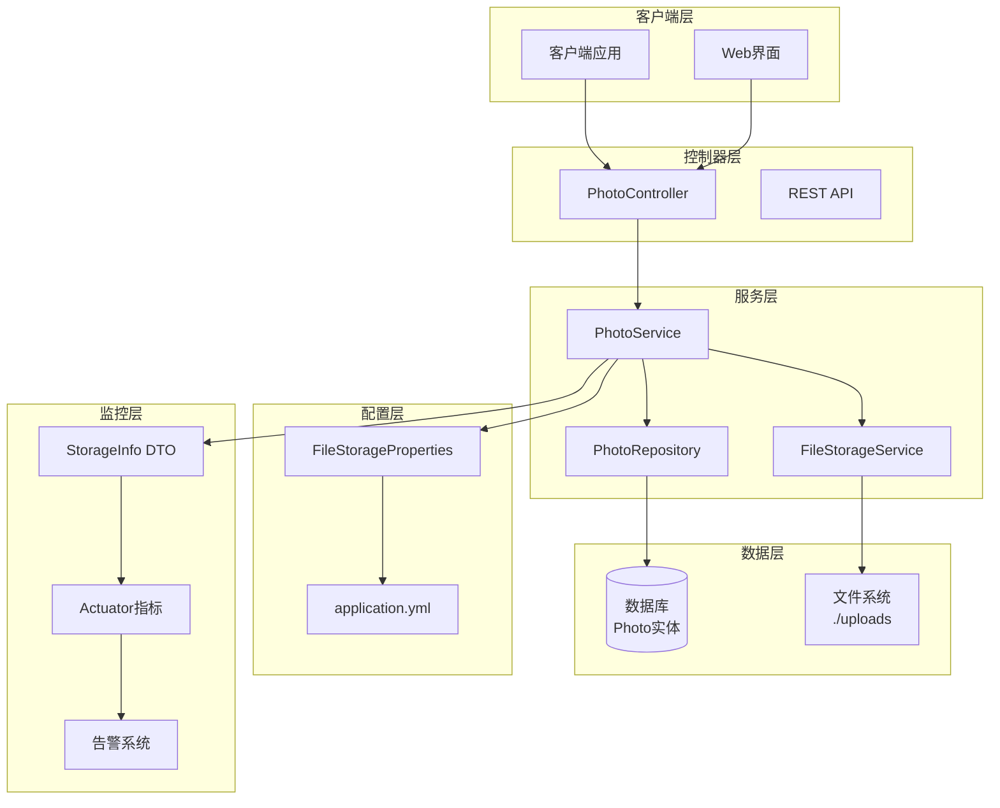
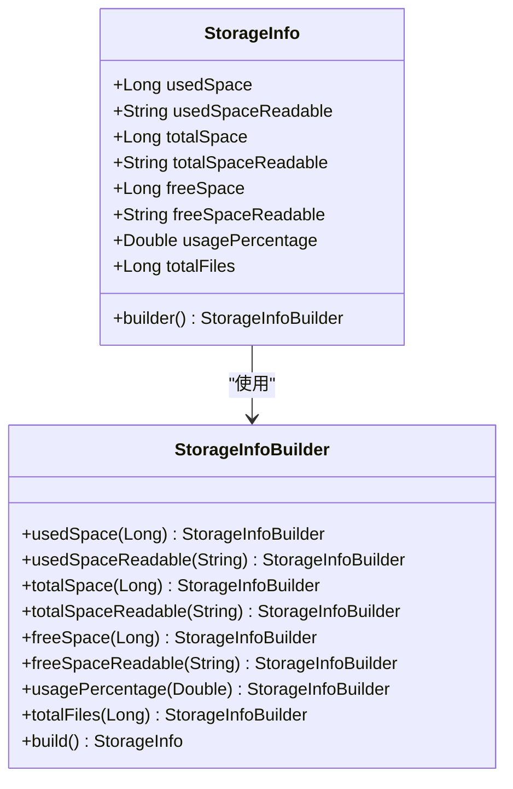
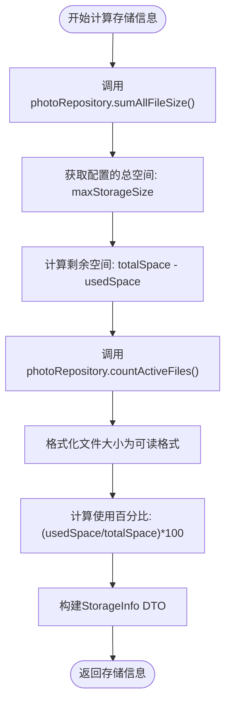
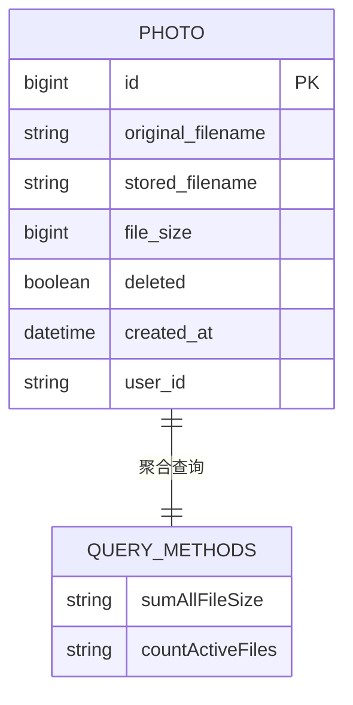
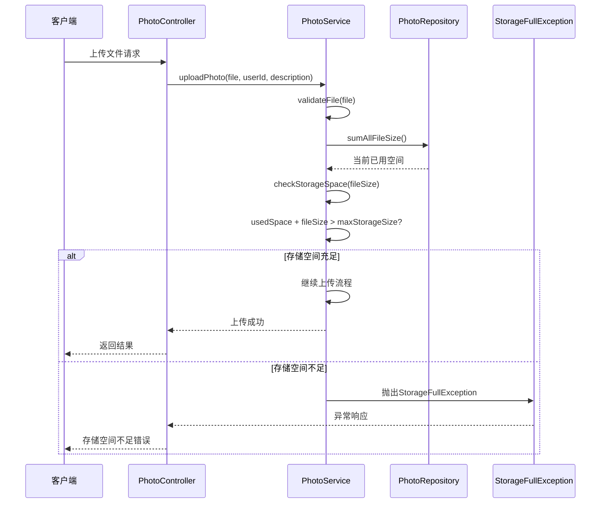
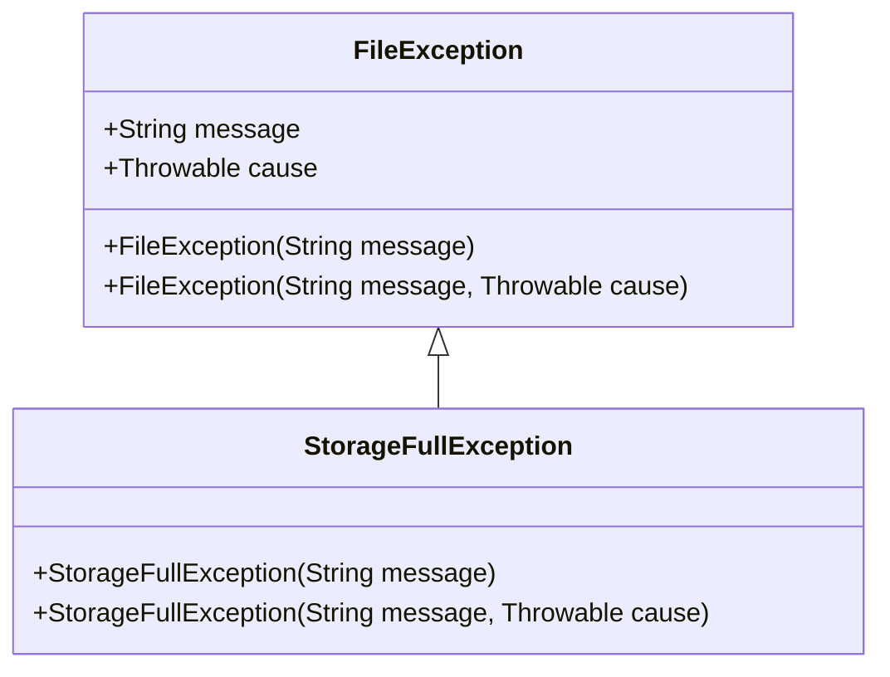
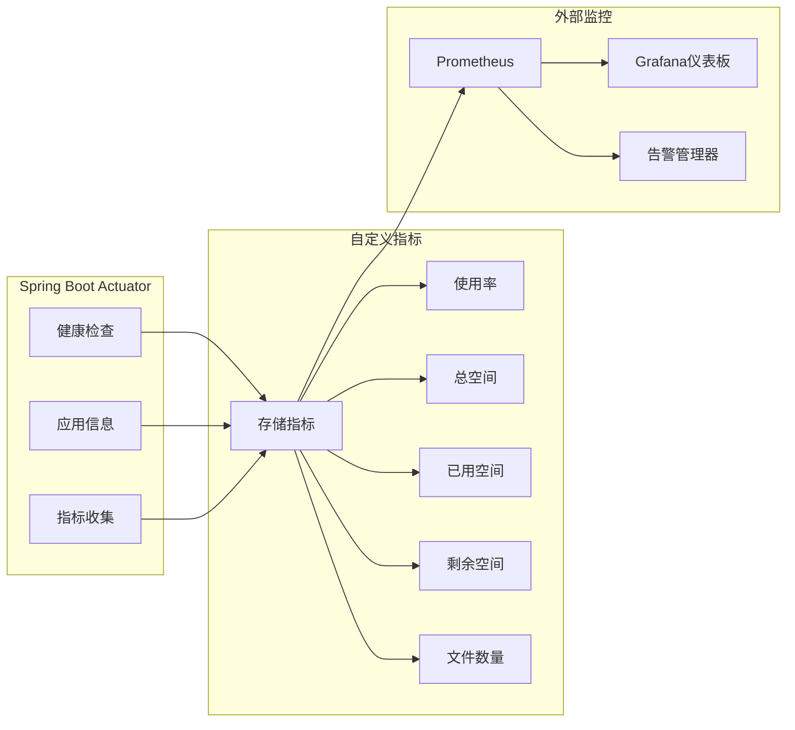

# 容量监控机制

<cite>
**本文档引用的文件**
- [StorageInfo.java](file://src/main/java/com/photo/dto/StorageInfo.java)
- [PhotoService.java](file://src/main/java/com/photo/service/PhotoService.java)
- [PhotoRepository.java](file://src/main/java/com/photo/repository/PhotoRepository.java)
- [FileStorageProperties.java](file://src/main/java/com/photo/config/FileStorageProperties.java)
- [application.yml](file://src/main/resources/application.yml)
- [FileStorageService.java](file://src/main/java/com/photo/service/FileStorageService.java)
- [PhotoController.java](file://src/main/java/com/photo/controller/PhotoController.java)
- [StorageFullException.java](file://src/main/java/com/photo/exception/StorageFullException.java)
- [FileUtils.java](file://src/main/java/com/photo/util/FileUtils.java)
- [PhotoServiceTest.java](file://src/test/java/com/photo/service/PhotoServiceTest.java)
</cite>

## 目录
1. [概述](#概述)
2. [系统架构](#系统架构)
3. [核心组件分析](#核心组件分析)
4. [存储容量计算机制](#存储容量计算机制)
5. [存储监控与告警](#存储监控与告警)
6. [上传限制机制](#上传限制机制)
7. [监控指标暴露](#监控指标暴露)
8. [最佳实践建议](#最佳实践建议)
9. [故障排除指南](#故障排除指南)
10. [总结](#总结)

## 概述

本系统实现了完整的容量监控机制，通过多层次的存储空间管理和监控策略，确保系统在高负载情况下仍能稳定运行。核心机制包括实时存储空间计算、上传前预检、动态告警和指标暴露等功能。

## 系统架构



**图表来源**
- [PhotoController.java](file://src/main/java/com/photo/controller/PhotoController.java#L1-L50)
- [PhotoService.java](file://src/main/java/com/photo/service/PhotoService.java#L1-L50)
- [FileStorageService.java](file://src/main/java/com/photo/service/FileStorageService.java#L1-L50)

## 核心组件分析

### StorageInfo DTO

StorageInfo是存储空间信息的核心数据传输对象，封装了完整的存储状态信息：



**图表来源**
- [StorageInfo.java](file://src/main/java/com/photo/dto/StorageInfo.java#L10-L56)

**章节来源**
- [StorageInfo.java](file://src/main/java/com/photo/dto/StorageInfo.java#L1-L57)

### FileStorageProperties 配置管理

FileStorageProperties负责管理存储相关的配置参数：

| 配置项 | 类型 | 默认值 | 描述 |
|--------|------|--------|------|
| maxStorageSize | Long | 10737418240 (10GB) | 最大存储容量（字节） |
| maxFileSize | Long | 10485760 (10MB) | 单个文件最大大小 |
| maxFilesPerUpload | Integer | 10 | 单次上传最大文件数 |
| basePath | String | ./uploads | 基础存储目录 |
| tempPath | String | ./uploads/temp | 临时文件目录 |
| thumbnailPath | String | ./uploads/thumbnails | 缩略图目录 |

**章节来源**
- [FileStorageProperties.java](file://src/main/java/com/photo/config/FileStorageProperties.java#L1-L94)
- [application.yml](file://src/main/resources/application.yml#L80-L95)

## 存储容量计算机制

### getStorageInfo 方法实现

getStorageInfo方法是存储监控的核心入口，通过以下步骤计算存储使用情况：



**图表来源**
- [PhotoService.java](file://src/main/java/com/photo/service/PhotoService.java#L220-L240)

#### 关键计算逻辑

1. **总文件大小聚合**：通过`photoRepository.sumAllFileSize()`执行数据库查询，统计所有未删除文件的总大小
2. **剩余空间计算**：`freeSpace = totalSpace - usedSpace`
3. **使用百分比计算**：`usagePercentage = (usedSpace / totalSpace) * 100`
4. **可读格式转换**：使用FileUtils.formatFileSize()将字节数转换为人类可读的格式（B、KB、MB、GB）

**章节来源**
- [PhotoService.java](file://src/main/java/com/photo/service/PhotoService.java#L220-L240)
- [PhotoRepository.java](file://src/main/java/com/photo/repository/PhotoRepository.java#L45-L50)

### PhotoRepository 查询优化

PhotoRepository提供了专门的聚合查询方法：



**图表来源**
- [PhotoRepository.java](file://src/main/java/com/photo/repository/PhotoRepository.java#L45-L55)

**章节来源**
- [PhotoRepository.java](file://src/main/java/com/photo/repository/PhotoRepository.java#L45-L55)

## 存储监控与告警

### checkStorageSpace 方法

在文件上传过程中，系统会在存储空间检查阶段进行预检：



**图表来源**
- [PhotoService.java](file://src/main/java/com/photo/service/PhotoService.java#L360-L370)

#### 检查逻辑详解

1. **实时空间计算**：每次上传前重新计算当前已用空间
2. **阈值比较**：`usedSpace + fileSize > maxStorageSize`
3. **异常处理**：触发StorageFullException阻止上传

**章节来源**
- [PhotoService.java](file://src/main/java/com/photo/service/PhotoService.java#L360-L370)

### StorageFullException 异常处理

当存储空间不足时，系统会抛出专门的异常：



**图表来源**
- [StorageFullException.java](file://src/main/java/com/photo/exception/StorageFullException.java#L1-L16)

**章节来源**
- [StorageFullException.java](file://src/main/java/com/photo/exception/StorageFullException.java#L1-L16)

## 上传限制机制

### 多层次限制策略

系统实现了多层次的上传限制机制：

| 限制层级 | 检查时机 | 限制条件 | 异常类型 |
|----------|----------|----------|----------|
| 存储空间检查 | 上传前 | usedSpace + fileSize ≤ maxStorageSize | StorageFullException |
| 单文件大小 | 上传前 | file.size ≤ maxFileSize | FileSizeException |
| 文件类型检查 | 上传前 | MIME类型和扩展名验证 | FileTypeException |
| 单次上传数量 | 上传前 | files.length ≤ maxFilesPerUpload | FileSizeException |

### 动态配置调整

通过application.yml中的配置参数，可以灵活调整限制策略：

```yaml
file:
  storage:
    max-storage-size: 10737418240  # 10GB
    max-file-size: 10485760  # 10MB
    max-files-per-upload: 10
```

**章节来源**
- [application.yml](file://src/main/resources/application.yml#L80-L85)
- [PhotoService.java](file://src/main/java/com/photo/service/PhotoService.java#L360-L370)

## 监控指标暴露

### Actuator 集成

系统通过Spring Boot Actuator暴露存储监控指标：



### 推荐的监控指标

基于StorageInfo DTO中的关键指标，建议暴露以下监控指标：

| 指标名称 | 类型 | 描述 | 单位 |
|----------|------|------|------|
| storage_used_bytes | Gauge | 已使用存储空间 | 字节 |
| storage_total_bytes | Gauge | 总存储空间 | 字节 |
| storage_free_bytes | Gauge | 剩余存储空间 | 字节 |
| storage_usage_percentage | Gauge | 存储使用百分比 | 百分比 |
| storage_files_total | Gauge | 总文件数量 | 个 |
| storage_threshold_exceeded | Gauge | 存储阈值超限标志 | 布尔值 |

### 监控告警配置

推荐的告警规则配置：

```yaml
groups:
  - name: storage_alerts
    rules:
      - alert: StorageCapacityHigh
        expr: (storage_used_bytes / storage_total_bytes) * 100 > 80
        for: 5m
        labels:
          severity: warning
        annotations:
          summary: "存储空间使用率过高"
          description: "存储使用率超过80%，当前使用率: {{ $value }}%"
      
      - alert: StorageCapacityCritical
        expr: (storage_used_bytes / storage_total_bytes) * 100 > 90
        for: 2m
        labels:
          severity: critical
        annotations:
          summary: "存储空间严重不足"
          description: "存储使用率超过90%，当前使用率: {{ $value }}%"
```

## 最佳实践建议

### 存储容量规划

1. **合理设置阈值**：建议将max-storage-size设置为实际可用磁盘空间的70-80%
2. **定期清理策略**：配置自动清理任务，删除过期文件
3. **监控频率**：建议每5分钟检查一次存储状态

### 性能优化建议

1. **数据库索引**：确保Photo表的deleted字段有索引以加速聚合查询
2. **缓存策略**：对StorageInfo结果进行适当缓存
3. **异步清理**：定期清理任务应使用异步方式执行

### 安全考虑

1. **访问控制**：确保存储监控接口有适当的权限控制
2. **数据保护**：敏感的存储信息不应在日志中记录
3. **异常处理**：妥善处理存储相关的异常，避免信息泄露

## 故障排除指南

### 常见问题诊断

| 问题症状 | 可能原因 | 解决方案 |
|----------|----------|----------|
| 上传时频繁出现StorageFullException | 实际磁盘空间不足 | 检查磁盘使用情况，清理过期文件 |
| StorageInfo计算缓慢 | 数据库查询性能差 | 优化Photo表索引，考虑数据分区 |
| 监控指标不准确 | 缓存未及时更新 | 调整缓存策略，增加数据一致性检查 |
| 告警误报 | 阈值设置不合理 | 根据实际使用情况调整告警阈值 |

### 调试技巧

1. **启用详细日志**：在application.yml中设置`logging.level.com.photo=DEBUG`
2. **数据库查询分析**：监控sumAllFileSize查询的执行时间
3. **文件系统检查**：定期检查实际文件系统的磁盘使用情况

**章节来源**
- [PhotoServiceTest.java](file://src/test/java/com/photo/service/PhotoServiceTest.java#L120-L140)

## 总结

本系统通过多层次的容量监控机制，实现了完整的存储空间管理解决方案。核心特性包括：

1. **实时监控**：通过getStorageInfo方法提供实时的存储使用情况
2. **智能预检**：在上传前进行存储空间检查，避免失败上传
3. **灵活配置**：支持通过配置文件动态调整存储限制
4. **完整指标**：提供详细的存储指标供监控系统使用
5. **异常处理**：完善的异常处理机制确保系统稳定性

这套容量监控机制不仅保证了系统的稳定运行，还为运维团队提供了全面的监控和告警能力，是构建可靠存储系统的重要组成部分。