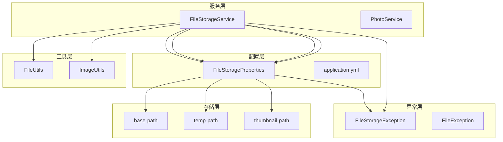
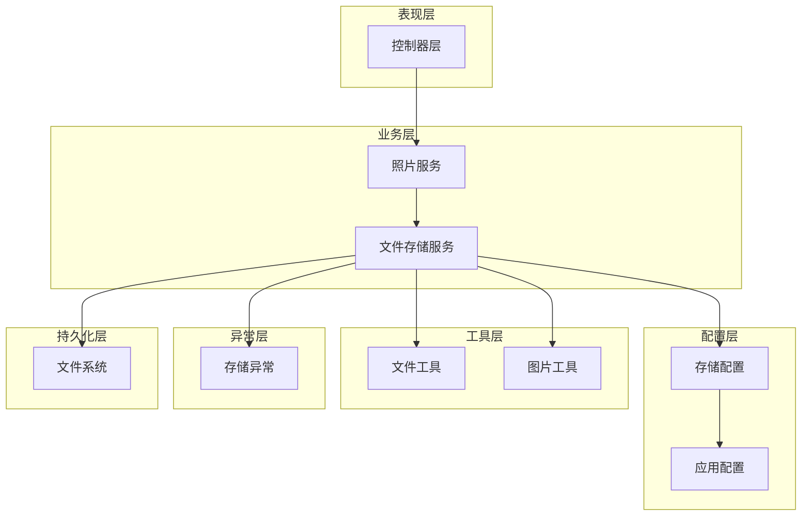
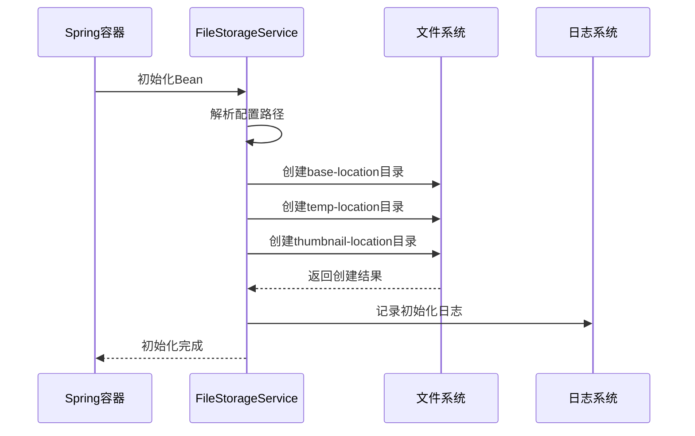
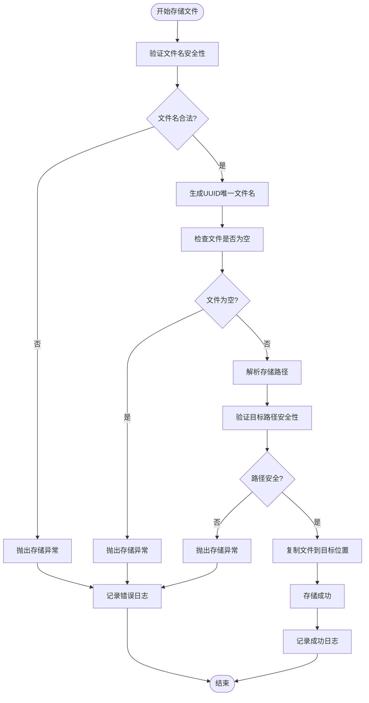
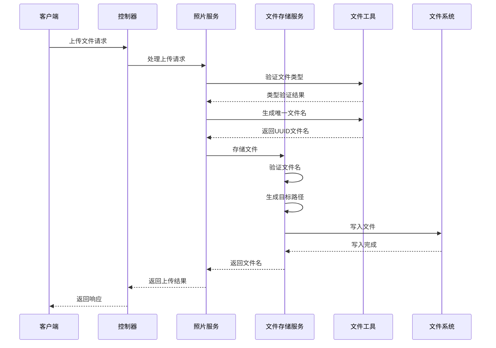
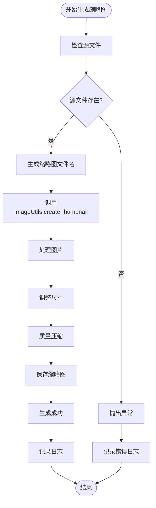
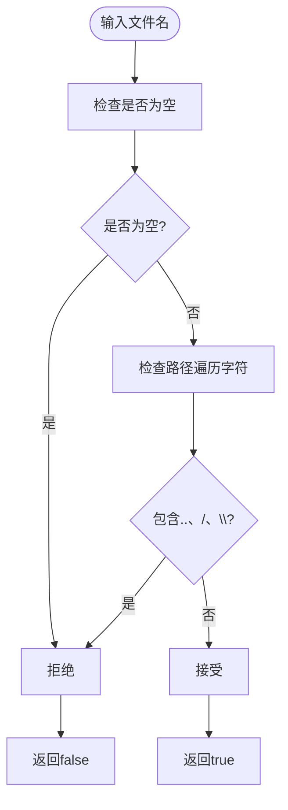
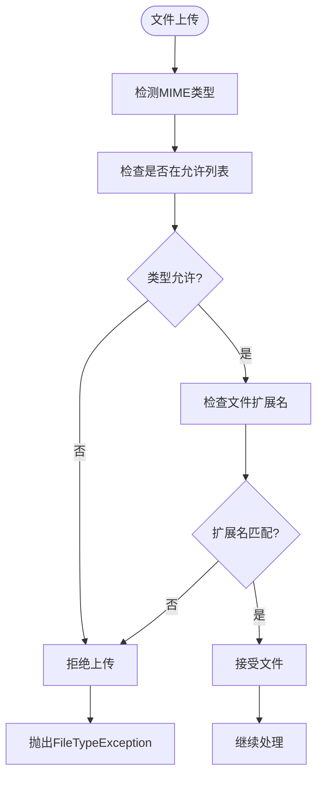
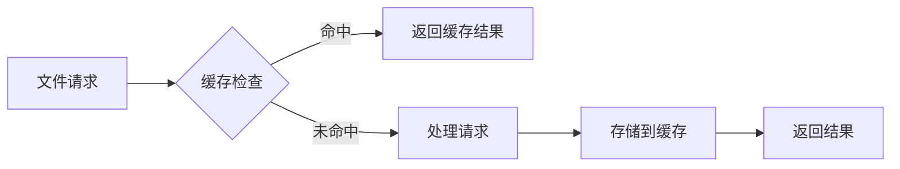
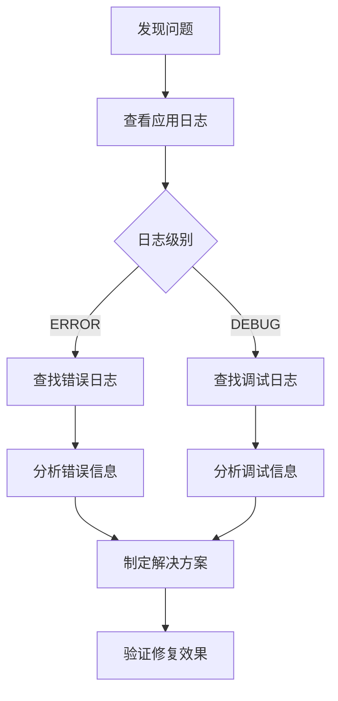

# 物理存储管理

<cite>
**本文档引用的文件**
- [FileStorageService.java](file://src/main/java/com/photo/service/FileStorageService.java)
- [FileStorageProperties.java](file://src/main/java/com/photo/config/FileStorageProperties.java)
- [application.yml](file://src/main/resources/application.yml)
- [FileUtils.java](file://src/main/java/com/photo/util/FileUtils.java)
- [ImageUtils.java](file://src/main/java/com/photo/util/ImageUtils.java)
- [FileStorageException.java](file://src/main/java/com/photo/exception/FileStorageException.java)
- [PhotoServiceTest.java](file://src/test/java/com/photo/service/PhotoServiceTest.java)
</cite>

## 目录
1. [简介](#简介)
2. [项目结构概览](#项目结构概览)
3. [核心组件分析](#核心组件分析)
4. [架构设计](#架构设计)
5. [详细组件分析](#详细组件分析)
6. [存储路径管理](#存储路径管理)
7. [文件操作流程](#文件操作流程)
8. [安全机制](#安全机制)
9. [性能优化](#性能优化)
10. [故障排除指南](#故障排除指南)
11. [最佳实践](#最佳实践)
12. [总结](#总结)

## 简介

物理存储管理系统是照片上传系统的核心基础设施，负责管理本地文件系统的读写操作。该系统通过FileStorageService提供统一的文件存储接口，支持多种文件操作，包括文件上传、下载、删除、缩略图生成等。系统采用分层架构设计，确保文件存储的安全性、可靠性和可扩展性。

## 项目结构概览

物理存储管理系统的核心文件组织结构如下：



**图表来源**
- [FileStorageService.java](file://src/main/java/com/photo/service/FileStorageService.java#L1-L300)
- [FileStorageProperties.java](file://src/main/java/com/photo/config/FileStorageProperties.java#L1-L94)

**章节来源**
- [FileStorageService.java](file://src/main/java/com/photo/service/FileStorageService.java#L1-L50)
- [FileStorageProperties.java](file://src/main/java/com/photo/config/FileStorageProperties.java#L1-L30)

## 核心组件分析

### FileStorageService - 主要存储服务

FileStorageService是物理存储管理的核心组件，提供以下主要功能：

- **目录初始化管理**：自动创建和验证存储目录结构
- **文件存储操作**：安全地存储上传的文件
- **文件检索功能**：提供文件访问和元数据查询
- **缩略图管理**：自动生成和管理缩略图
- **文件删除操作**：安全删除文件和相关资源

### FileStorageProperties - 配置管理

FileStorageProperties类负责管理所有与文件存储相关的配置参数，包括：

- **基础路径配置**：定义文件存储的根目录
- **临时文件路径**：处理上传过程中的临时文件
- **缩略图路径**：存储生成的缩略图文件
- **文件类型限制**：定义允许的文件类型和扩展名
- **大小限制**：设置文件大小和存储空间限制

**章节来源**
- [FileStorageService.java](file://src/main/java/com/photo/service/FileStorageService.java#L20-L50)
- [FileStorageProperties.java](file://src/main/java/com/photo/config/FileStorageProperties.java#L15-L50)

## 架构设计

物理存储管理系统采用分层架构设计，确保各组件职责明确且相互独立：



**图表来源**
- [FileStorageService.java](file://src/main/java/com/photo/service/FileStorageService.java#L1-L300)
- [FileStorageProperties.java](file://src/main/java/com/photo/config/FileStorageProperties.java#L1-L94)

## 详细组件分析

### 目录初始化机制

FileStorageService通过`@PostConstruct`注解的方法实现自动目录初始化：



**图表来源**
- [FileStorageService.java](file://src/main/java/com/photo/service/FileStorageService.java#L30-L50)

#### 路径规范化处理

系统采用严格的路径规范化机制确保安全性：

1. **绝对路径转换**：使用`toAbsolutePath()`确保路径为绝对路径
2. **路径标准化**：通过`normalize()`消除路径中的相对引用
3. **安全性验证**：确保目标路径不会超出指定目录范围

**章节来源**
- [FileStorageService.java](file://src/main/java/com/photo/service/FileStorageService.java#L30-L50)

### 文件存储流程

storeFile方法实现了完整的文件存储流程：



**图表来源**
- [FileStorageService.java](file://src/main/java/com/photo/service/FileStorageService.java#L55-L95)

#### UUID文件命名策略

系统采用UUID作为文件命名策略，确保文件名的唯一性和安全性：

- **UUID生成**：使用`UUID.randomUUID().toString()`生成唯一标识符
- **格式化处理**：移除UUID中的连字符，确保文件名简洁
- **扩展名保留**：保持原始文件的扩展名不变

**章节来源**
- [FileStorageService.java](file://src/main/java/com/photo/service/FileStorageService.java#L55-L95)
- [FileUtils.java](file://src/main/java/com/photo/util/FileUtils.java#L40-L45)

### 文件删除机制

系统提供了两种文件删除操作：

#### deleteFile方法
- **目标文件删除**：删除用户上传的原始文件
- **路径验证**：确保删除操作在允许的目录范围内
- **异常处理**：捕获并处理删除过程中的异常

#### deleteThumbnail方法  
- **缩略图删除**：删除对应的缩略图文件
- **命名规则**：缩略图文件名前缀为"thumb_"
- **容错处理**：即使缩略图不存在也正常返回

**章节来源**
- [FileStorageService.java](file://src/main/java/com/photo/service/FileStorageService.java#L180-L210)

## 存储路径管理

### 路径配置详解

系统通过application.yml文件配置三个核心存储路径：

| 配置项 | 默认值 | 用途 | 安全考虑 |
|--------|--------|------|----------|
| base-path | ./uploads | 存储用户上传的原始文件 | 用户可访问的公共目录 |
| temp-path | ./uploads/temp | 处理上传过程中的临时文件 | 临时存储，定期清理 |
| thumbnail-path | ./uploads/thumbnails | 存储生成的缩略图文件 | 自动生成，按需访问 |

### 目录结构示例

```
项目根目录/
├── uploads/
│   ├── (原始文件)
│   ├── temp/
│   │   ├── (临时上传文件)
│   └── thumbnails/
│       ├── thumb_image1.jpg
│       └── thumb_image2.png
```

### 路径配置调整指南

根据不同部署环境调整存储目录结构：

#### 开发环境配置
```yaml
file:
  storage:
    base-path: ./uploads
    temp-path: ./uploads/temp
    thumbnail-path: ./uploads/thumbnails
```

#### 生产环境配置
```yaml
file:
  storage:
    base-path: /var/www/uploads
    temp-path: /var/tmp/photo-uploads
    thumbnail-path: /var/www/uploads/thumbnails
```

#### Docker容器配置
```yaml
file:
  storage:
    base-path: /app/uploads
    temp-path: /tmp/uploads
    thumbnail-path: /app/uploads/thumbnails
```

**章节来源**
- [application.yml](file://src/main/resources/application.yml#L40-L55)
- [FileStorageProperties.java](file://src/main/java/com/photo/config/FileStorageProperties.java#L15-L30)

## 文件操作流程

### 文件上传完整流程



**图表来源**
- [FileStorageService.java](file://src/main/java/com/photo/service/FileStorageService.java#L55-L95)
- [FileUtils.java](file://src/main/java/com/photo/util/FileUtils.java#L40-L60)

### 缩略图生成流程



**图表来源**
- [FileStorageService.java](file://src/main/java/com/photo/service/FileStorageService.java#L130-L150)
- [ImageUtils.java](file://src/main/java/com/photo/util/ImageUtils.java#L50-L70)

**章节来源**
- [FileStorageService.java](file://src/main/java/com/photo/service/FileStorageService.java#L130-L180)
- [ImageUtils.java](file://src/main/java/com/photo/util/ImageUtils.java#L50-L80)

## 安全机制

### 路径遍历防护

系统实现了多层路径遍历防护机制：

#### 文件名验证
FileUtils类提供严格的文件名验证功能：



**图表来源**
- [FileUtils.java](file://src/main/java/com/photo/util/FileUtils.java#L160-L170)

#### 路径规范化验证
FileStorageService在文件操作时严格验证路径安全性：

- **路径解析**：使用`resolve()`构建目标路径
- **规范化检查**：通过`normalize()`确保路径正确性
- **父目录验证**：确认目标路径属于预期目录

### 文件类型验证

系统采用双重验证机制确保文件类型安全：

#### MIME类型检测
使用Apache Tika库进行智能文件类型检测：



**图表来源**
- [FileUtils.java](file://src/main/java/com/photo/util/FileUtils.java#L70-L90)

#### 支持的文件类型
系统默认支持以下图片格式：
- JPEG/JPG
- PNG
- GIF
- BMP
- WebP

**章节来源**
- [FileUtils.java](file://src/main/java/com/photo/util/FileUtils.java#L160-L178)
- [FileUtils.java](file://src/main/java/com/photo/util/FileUtils.java#L70-L90)

### 文件大小限制

系统提供多层次的文件大小控制：

| 限制类型 | 配置值 | 作用范围 | 异常处理 |
|----------|--------|----------|----------|
| 单文件大小 | 10MB | 上传验证 | FileSizeException |
| 请求总大小 | 50MB | Servlet配置 | Spring内置异常 |
| 存储总量 | 10GB | 系统级限制 | StorageFullException |
| 单次上传文件数 | 10个 | 业务逻辑 | 自定义验证 |

**章节来源**
- [application.yml](file://src/main/resources/application.yml#L30-L35)
- [FileStorageProperties.java](file://src/main/java/com/photo/config/FileStorageProperties.java#L35-L45)

## 性能优化

### 文件操作优化策略

#### 流式文件处理
系统采用流式处理减少内存占用：

- **InputStream使用**：避免将整个文件加载到内存
- **缓冲区管理**：使用适当的缓冲区大小
- **资源自动关闭**：通过try-with-resources确保资源释放

#### 并发处理能力
FileStorageService设计支持高并发访问：

- **无状态设计**：服务实例之间可以完全独立
- **线程安全**：所有操作都是线程安全的
- **异步处理**：缩略图生成和图片压缩采用异步处理

### 缓存策略

虽然当前实现未显式使用缓存，但系统设计支持缓存集成：



**章节来源**
- [FileStorageService.java](file://src/main/java/com/photo/service/FileStorageService.java#L250-L290)

## 故障排除指南

### 常见问题及解决方案

#### 目录创建失败
**症状**：启动时出现"无法创建存储目录"异常

**原因分析**：
- 目标路径权限不足
- 磁盘空间不足
- 路径配置错误

**解决方案**：
1. 检查目标目录权限：`chmod 755 uploads`
2. 验证磁盘空间：`df -h`
3. 检查配置路径：确认路径存在且可写

#### 文件存储失败
**症状**：文件上传过程中出现"文件存储失败"异常

**排查步骤**：
1. 检查文件名安全性：确保不包含非法字符
2. 验证文件大小：确认不超过配置限制
3. 检查磁盘空间：确保有足够的可用空间
4. 查看详细错误日志：定位具体失败原因

#### 缩略图生成失败
**症状**：缩略图创建失败，返回null

**常见原因**：
- 源文件不是有效的图片格式
- 图片尺寸过大导致处理超时
- 目标目录权限不足

**解决方法**：
1. 验证源文件格式：使用`ImageUtils.isValidImage()`检查
2. 检查目标目录权限：确保可写入
3. 调整图片尺寸：避免处理过大的图片

### 日志分析指南

系统提供详细的日志记录，帮助快速定位问题：



**章节来源**
- [FileStorageService.java](file://src/main/java/com/photo/service/FileStorageService.java#L35-L45)
- [FileStorageException.java](file://src/main/java/com/photo/exception/FileStorageException.java#L1-L16)

## 最佳实践

### 部署环境配置建议

#### 开发环境
```yaml
file:
  storage:
    base-path: ./uploads
    temp-path: ./uploads/temp
    thumbnail-path: ./uploads/thumbnails
    max-file-size: 10485760  # 10MB
    max-storage-size: 10737418240  # 10GB
```

#### 生产环境
```yaml
file:
  storage:
    base-path: /var/www/uploads
    temp-path: /var/tmp/photo-uploads
    thumbnail-path: /var/www/uploads/thumbnails
    max-file-size: 52428800  # 50MB
    max-storage-size: 53687091200  # 50GB
    cleanup:
      enabled: true
      days-to-keep: 30
```

### 安全配置建议

#### 文件权限设置
```bash
# 设置目录权限（仅限生产环境）
sudo chown -R www-data:www-data /var/www/uploads
sudo chmod -R 755 /var/www/uploads
sudo chmod -R 775 /var/www/uploads/thumbnails
```

#### 防护措施
1. **路径遍历防护**：始终使用文件名验证工具
2. **文件类型限制**：严格限制允许的文件类型
3. **大小限制**：设置合理的文件大小上限
4. **定期清理**：启用自动清理机制

### 性能优化建议

#### 硬件配置
- **存储设备**：使用SSD提高I/O性能
- **网络带宽**：确保足够的上传带宽
- **内存配置**：适当增加JVM堆内存

#### 软件优化
- **并发控制**：根据服务器性能调整并发数
- **缓存策略**：考虑引入Redis缓存热点文件
- **压缩配置**：合理设置图片压缩参数

### 监控和维护

#### 关键指标监控
- **存储使用率**：定期检查存储空间使用情况
- **文件数量统计**：监控活跃文件数量
- **错误率统计**：跟踪文件操作失败率
- **响应时间**：监控文件操作平均响应时间

#### 维护计划
1. **定期备份**：备份重要文件和配置
2. **空间清理**：定期清理过期文件
3. **性能监控**：持续监控系统性能指标
4. **安全审计**：定期检查安全配置

**章节来源**
- [application.yml](file://src/main/resources/application.yml#L40-L70)
- [FileStorageProperties.java](file://src/main/java/com/photo/config/FileStorageProperties.java#L15-L94)

## 总结

物理存储管理系统通过FileStorageService提供了完整、安全、高效的文件存储解决方案。系统的主要优势包括：

### 技术优势
- **安全性**：多重防护机制确保文件操作安全
- **可靠性**：完善的异常处理和错误恢复机制
- **可扩展性**：模块化设计支持功能扩展
- **性能**：优化的文件处理流程保证高效运行

### 功能特性
- **自动化管理**：自动创建和管理存储目录
- **文件类型验证**：智能识别和验证文件类型
- **缩略图支持**：自动生成和管理缩略图
- **灵活配置**：支持多种部署环境配置

### 应用价值
该系统为照片上传平台提供了坚实的存储基础设施，支持大规模文件管理和用户友好的文件操作体验。通过合理的配置和维护，可以满足各种规模的应用需求，是现代Web应用中不可或缺的重要组件。