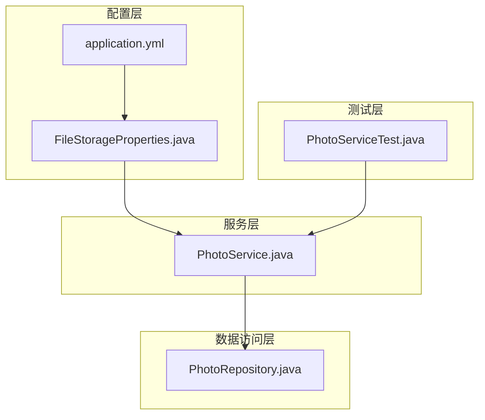
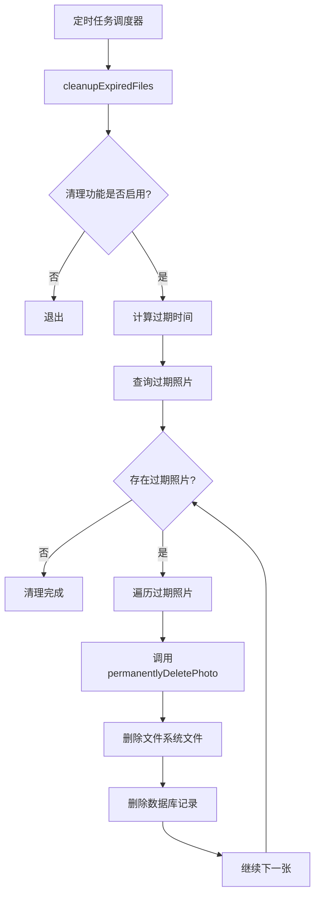
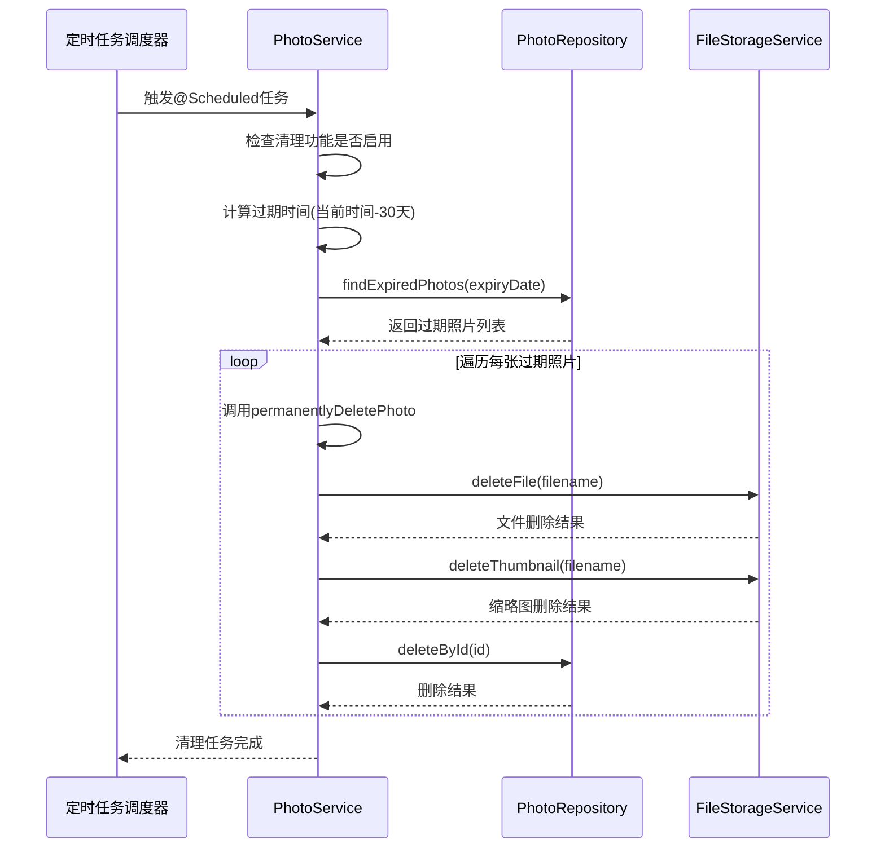
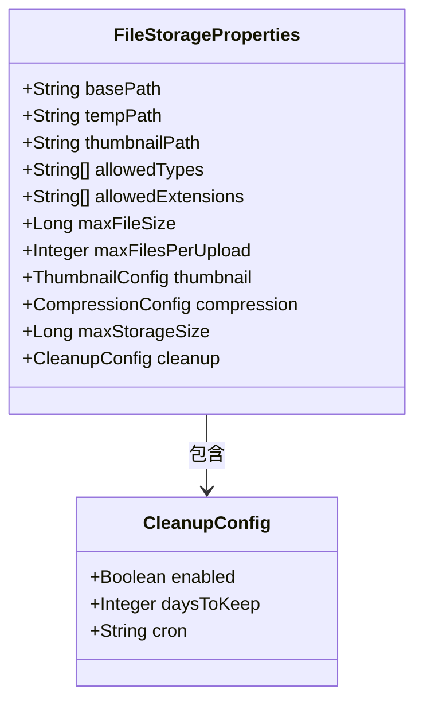
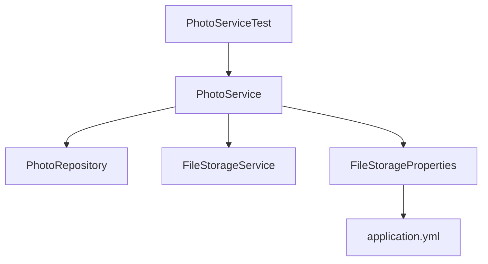

# 自动清理策略

<cite>
**本文档引用的文件**   
- [PhotoService.java](file://src/main/java/com/photo/service/PhotoService.java)
- [FileStorageProperties.java](file://src/main/java/com/photo/config/FileStorageProperties.java)
- [application.yml](file://src/main/resources/application.yml)
- [PhotoRepository.java](file://src/main/java/com/photo/repository/PhotoRepository.java)
- [PhotoServiceTest.java](file://src/test/java/com/photo/service/PhotoServiceTest.java)
</cite>

## 目录
1. [简介](#简介)
2. [项目结构](#项目结构)
3. [核心组件](#核心组件)
4. [架构概述](#架构概述)
5. [详细组件分析](#详细组件分析)
6. [依赖分析](#依赖分析)
7. [性能考虑](#性能考虑)
8. [故障排除指南](#故障排除指南)
9. [结论](#结论)

## 简介
本系统实现了基于定时任务的自动文件清理机制，旨在防止存储空间的无限膨胀。通过`@Scheduled(cron = "${file.storage.cleanup.cron}")`注解驱动的定时任务，系统每天凌晨2点自动执行清理操作，删除超过保留期限的已软删除照片。该机制结合了配置化管理、数据库查询和物理文件删除，确保了系统的稳定性和可维护性。

## 项目结构
系统采用典型的Spring Boot分层架构，主要包含配置、控制器、数据传输对象、实体、异常处理、数据访问层和业务服务等模块。自动清理功能主要涉及`PhotoService`中的定时任务方法、`FileStorageProperties`中的配置属性以及`application.yml`中的具体配置值。

**Diagram sources**
- [PhotoService.java](file://src/main/java/com/photo/service/PhotoService.java)
- [FileStorageProperties.java](file://src/main/java/com/photo/config/FileStorageProperties.java)
- [PhotoRepository.java](file://src/main/java/com/photo/repository/PhotoRepository.java)
- [PhotoServiceTest.java](file://src/test/java/com/photo/service/PhotoServiceTest.java)
- [application.yml](file://src/main/resources/application.yml)

**Section sources**
- [PhotoService.java](file://src/main/java/com/photo/service/PhotoService.java)
- [FileStorageProperties.java](file://src/main/java/com/photo/config/FileStorageProperties.java)
- [application.yml](file://src/main/resources/application.yml)

## 核心组件
自动清理功能的核心是`PhotoService`类中的`cleanupExpiredFiles`方法，该方法通过`@Scheduled`注解配置为定时任务。方法首先检查清理功能是否启用，然后根据`days-to-keep`配置计算过期时间，查询数据库中创建时间早于过期时间的照片，并调用`permanentlyDeletePhoto`方法进行物理删除。

**Section sources**
- [PhotoService.java](file://src/main/java/com/photo/service/PhotoService.java#L275-L300)
- [FileStorageProperties.java](file://src/main/java/com/photo/config/FileStorageProperties.java#L75-L80)

## 架构概述
自动清理机制的架构设计体现了分层解耦的思想。配置层提供可配置的清理策略，服务层实现清理逻辑，数据访问层负责数据库操作，而定时任务调度器负责触发清理流程。这种设计使得清理策略可以灵活调整，而无需修改代码。

**Diagram sources**
- [PhotoService.java](file://src/main/java/com/photo/service/PhotoService.java#L275-L300)
- [PhotoRepository.java](file://src/main/java/com/photo/repository/PhotoRepository.java#L80-L85)

## 详细组件分析

### 清理任务分析
`cleanupExpiredFiles`方法是自动清理机制的核心，它实现了完整的清理流程。方法首先从`FileStorageProperties`中获取`days-to-keep`配置值，然后计算出过期时间点。接着，通过`PhotoRepository`的`findExpiredPhotos`方法查询所有创建时间早于过期时间且未被删除的照片。对于每张过期照片，调用`permanentlyDeletePhoto`方法进行物理删除。

#### 对于API/服务组件：

**Diagram sources**
- [PhotoService.java](file://src/main/java/com/photo/service/PhotoService.java#L275-L300)
- [PhotoRepository.java](file://src/main/java/com/photo/repository/PhotoRepository.java#L80-L85)
- [FileStorageService.java](file://src/main/java/com/photo/service/FileStorageService.java#L185-L195)

**Section sources**
- [PhotoService.java](file://src/main/java/com/photo/service/PhotoService.java#L275-L300)
- [PhotoRepository.java](file://src/main/java/com/photo/repository/PhotoRepository.java#L80-L85)

### 配置管理分析
清理策略的配置通过`FileStorageProperties`类和`application.yml`文件实现。`CleanupConfig`内部类定义了三个关键属性：`enabled`控制清理功能的开关，`daysToKeep`设置文件保留天数，`cron`指定定时任务的执行时间。这种配置方式使得系统管理员可以在不修改代码的情况下调整清理策略。

**Diagram sources**
- [FileStorageProperties.java](file://src/main/java/com/photo/config/FileStorageProperties.java#L75-L80)

**Section sources**
- [FileStorageProperties.java](file://src/main/java/com/photo/config/FileStorageProperties.java#L75-L80)
- [application.yml](file://src/main/resources/application.yml#L55-L65)

## 依赖分析
自动清理功能依赖于多个组件的协同工作。`PhotoService`依赖于`PhotoRepository`进行数据库查询，依赖于`FileStorageService`进行文件系统操作，同时依赖于`FileStorageProperties`获取配置信息。这种依赖关系通过Spring的依赖注入机制自动管理，确保了组件之间的松耦合。

**Diagram sources**
- [PhotoService.java](file://src/main/java/com/photo/service/PhotoService.java#L30-L33)
- [PhotoServiceTest.java](file://src/test/java/com/photo/service/PhotoServiceTest.java#L25-L28)

**Section sources**
- [PhotoService.java](file://src/main/java/com/photo/service/PhotoService.java#L30-L33)
- [PhotoServiceTest.java](file://src/test/java/com/photo/service/PhotoServiceTest.java#L25-L28)

## 性能考虑
自动清理任务在每天凌晨2点执行，这个时间点通常系统负载较低，可以减少对正常业务的影响。清理操作采用分批处理的方式，逐个删除过期文件，避免了一次性删除大量文件可能造成的系统压力。此外，数据库查询使用了索引优化，`createdAt`字段上的索引可以快速定位过期文件。

## 故障排除指南
当清理任务未能按预期工作时，可以从以下几个方面进行排查：首先检查`application.yml`中的`file.storage.cleanup.enabled`配置是否为`true`；其次确认`file.storage.cleanup.cron`表达式是否正确；然后查看应用日志中是否有相关的错误信息；最后检查数据库连接和文件系统权限是否正常。

**Section sources**
- [PhotoService.java](file://src/main/java/com/photo/service/PhotoService.java#L280-L282)
- [application.yml](file://src/main/resources/application.yml#L56-L58)

## 结论
自动清理策略是本系统防止存储膨胀的关键机制。通过配置化的定时任务，系统能够自动、安全地清理过期文件，确保了存储资源的可持续利用。该设计具有良好的可维护性和扩展性，未来可以根据需要调整清理策略或增加更复杂的清理逻辑。