# zcyTest2项目安全机制文档

<cite>
**本文档中引用的文件**
- [SecurityConfig.java](file://src/main/java/com/photo/config/SecurityConfig.java)
- [SecurityProperties.java](file://src/main/java/com/photo/config/SecurityProperties.java)
- [SecurityUtils.java](file://src/main/java/com/photo/util/SecurityUtils.java)
- [FileStorageService.java](file://src/main/java/com/photo/service/FileStorageService.java)
- [FileUtils.java](file://src/main/java/com/photo/util/FileUtils.java)
- [PhotoService.java](file://src/main/java/com/photo/service/PhotoService.java)
- [PhotoController.java](file://src/main/java/com/photo/controller/PhotoController.java)
- [application.yml](file://src/main/resources/application.yml)
- [README.md](file://README.md)
- [SecurityUtilsTest.java](file://src/test/java/com/photo/util/SecurityUtilsTest.java)
- [FileUtilsTest.java](file://src/test/java/com/photo/util/FileUtilsTest.java)
</cite>

## 目录
1. [概述](#概述)
2. [Spring Security配置](#spring-security配置)
3. [防盗链机制](#防盗链机制)
4. [文件上传安全](#文件上传安全)
5. [访问控制机制](#访问控制机制)
6. [输入验证与清理](#输入验证与清理)
7. [安全工具类](#安全工具类)
8. [生产环境安全加固](#生产环境安全加固)
9. [安全最佳实践](#安全最佳实践)
10. [总结](#总结)

## 概述

zcyTest2项目是一个基于Spring Boot的企业级照片上传下载系统，实现了多层次的安全防护机制。系统采用Spring Security框架，结合多种安全策略，包括文件类型验证、路径遍历防护、XSS防护、CSRF防护等，确保系统的安全性。

### 安全架构概览

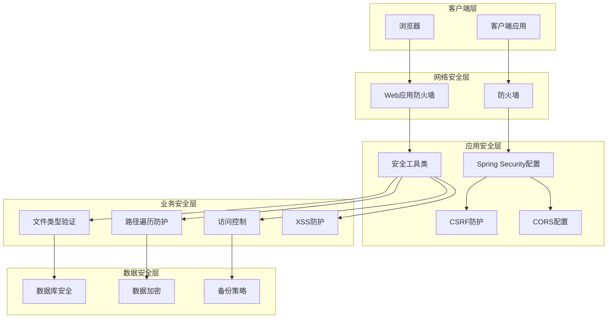

**图表来源**
- [SecurityConfig.java](file://src/main/java/com/photo/config/SecurityConfig.java#L1-L71)
- [SecurityUtils.java](file://src/main/java/com/photo/util/SecurityUtils.java#L1-L167)

## Spring Security配置

### CSRF防护配置

系统在SecurityConfig中禁用了CSRF保护，这是基于以下考虑：
- 项目主要提供RESTful API服务
- 前端应用与后端分离，使用JWT认证
- 防止CSRF攻击需要额外的Token验证机制

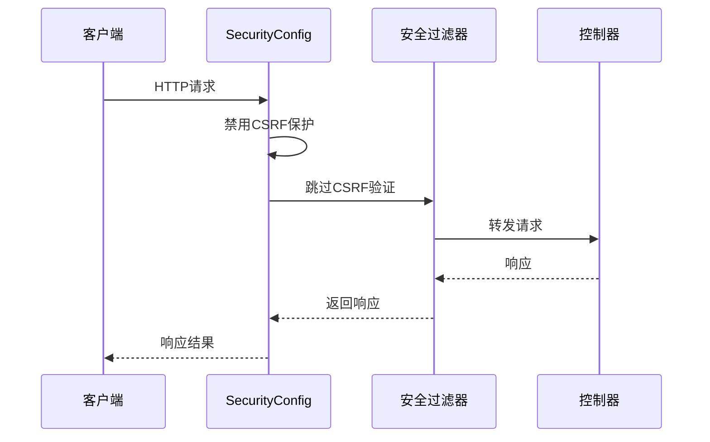

**图表来源**
- [SecurityConfig.java](file://src/main/java/com/photo/config/SecurityConfig.java#L20-L25)

### CORS跨域配置

系统提供了灵活的CORS配置，支持动态配置允许的域名、方法和头部：

| 配置项 | 默认值 | 说明 |
|--------|--------|------|
| enabled | true | 是否启用CORS |
| allowedOrigins | [] | 允许的源域名列表 |
| allowedMethods | ["GET", "POST", "PUT", "DELETE"] | 允许的HTTP方法 |
| allowedHeaders | ["*"] | 允许的请求头 |
| allowCredentials | true | 是否允许携带凭据 |

### 路径权限控制

系统对不同类型的请求路径实施了细粒度的权限控制：

| 路径模式 | 权限级别 | 说明 |
|----------|----------|------|
| /h2-console/** | 允许所有访问 | 开发环境数据库管理界面 |
| /api-docs/** | 允许所有访问 | API文档访问 |
| /swagger-ui/** | 允许所有访问 | Swagger UI界面 |
| /photos/view/** | 允许所有访问 | 公开照片预览 |
| /photos/download/** | 允许所有访问 | 公开文件下载 |
| /photos/public/** | 允许所有访问 | 公开资源访问 |
| 其他路径 | 允许所有访问 | 默认开放权限 |

### 会话管理

系统配置为无状态会话管理，适用于RESTful API服务：
- Session Creation Policy: STATELESS
- 不维护用户会话状态
- 依赖前端传递认证信息

**章节来源**
- [SecurityConfig.java](file://src/main/java/com/photo/config/SecurityConfig.java#L20-L40)
- [SecurityProperties.java](file://src/main/java/com/photo/config/SecurityProperties.java#L25-L52)

## 防盗链机制

### Referer验证实现

系统实现了基于Referer头部的防盗链机制，防止未经授权的外部网站直接访问资源。

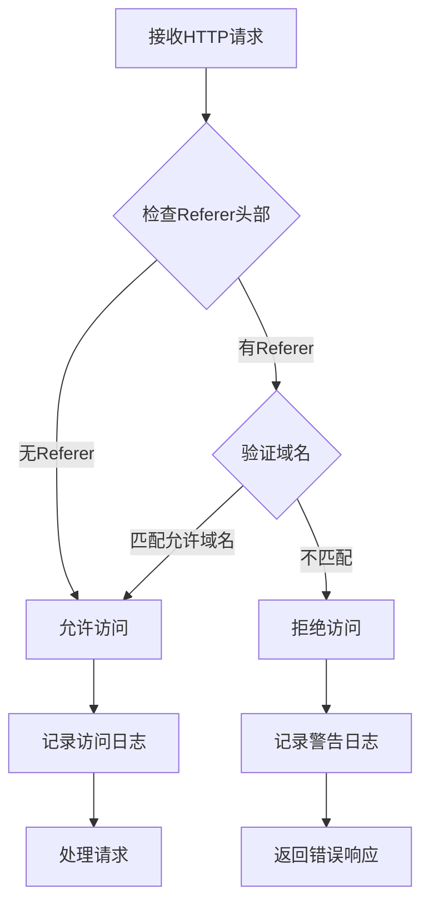

**图表来源**
- [SecurityUtils.java](file://src/main/java/com/photo/util/SecurityUtils.java#L58-L75)
- [PhotoController.java](file://src/main/java/com/photo/controller/PhotoController.java#L85-L95)

### 防盗链配置

防盗链功能可通过配置文件进行控制：

| 配置项 | 类型 | 默认值 | 说明 |
|--------|------|--------|------|
| security.referer.enabled | Boolean | true | 是否启用防盗链 |
| security.referer.allowed-domains | List<String> | ["localhost", "127.0.0.1"] | 允许的域名列表 |

### 防盗链验证流程

1. **请求拦截**: 在PhotoController中拦截预览和下载请求
2. **Referer提取**: 从HTTP头部获取Referer信息
3. **域名验证**: 检查Referer是否包含允许的域名
4. **访问控制**: 根据验证结果决定是否允许访问

**章节来源**
- [SecurityUtils.java](file://src/main/java/com/photo/util/SecurityUtils.java#L58-L75)
- [PhotoController.java](file://src/main/java/com/photo/controller/PhotoController.java#L85-L95)
- [SecurityProperties.java](file://src/main/java/com/photo/config/SecurityProperties.java#L15-L20)

## 文件上传安全

### 多层文件类型验证

系统实现了基于Apache Tika的多层文件类型验证机制，确保上传文件的安全性。

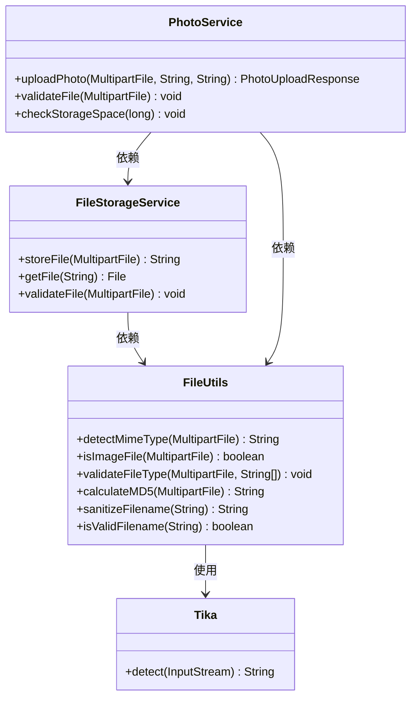

**图表来源**
- [FileUtils.java](file://src/main/java/com/photo/util/FileUtils.java#L1-L178)
- [FileStorageService.java](file://src/main/java/com/photo/service/FileStorageService.java#L1-L300)
- [PhotoService.java](file://src/main/java/com/photo/service/PhotoService.java#L1-L385)

### 支持的文件类型

系统严格限制上传的文件类型，只允许常见的图片格式：

| MIME类型 | 扩展名 | 说明 |
|----------|--------|------|
| image/jpeg | jpg, jpeg | JPEG图片格式 |
| image/png | png | PNG图片格式 |
| image/gif | gif | GIF动画图片 |
| image/bmp | bmp | BMP位图格式 |
| image/webp | webp | WebP现代图片格式 |

### 文件大小限制

系统设置了严格的文件大小限制：
- 单个文件最大10MB
- 单次批量上传最多10个文件
- 总上传大小不超过10GB

### 文件名清理机制

系统实现了强大的文件名清理机制，防止路径遍历攻击：

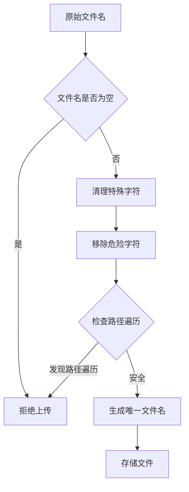

**图表来源**
- [FileUtils.java](file://src/main/java/com/photo/util/FileUtils.java#L140-L178)

### 文件魔数验证

系统使用Apache Tika进行文件魔数验证，确保文件的实际类型与声明类型一致。

**章节来源**
- [FileUtils.java](file://src/main/java/com/photo/util/FileUtils.java#L25-L45)
- [FileStorageService.java](file://src/main/java/com/photo/service/FileStorageService.java#L50-L80)
- [PhotoService.java](file://src/main/java/com/photo/service/PhotoService.java#L350-L385)

## 访问控制机制

### 基于角色的访问控制

系统实现了基于用户的访问控制机制，确保私有资源只能被授权用户访问。

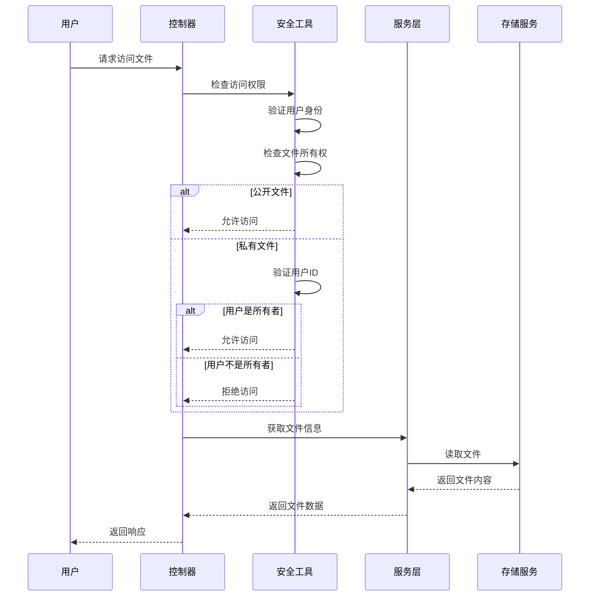

**图表来源**
- [SecurityUtils.java](file://src/main/java/com/photo/util/SecurityUtils.java#L130-L145)
- [PhotoController.java](file://src/main/java/com/photo/controller/PhotoController.java#L85-L95)

### 访问权限验证

系统在多个层面实施访问控制：

| 层面 | 验证内容 | 实现方式 |
|------|----------|----------|
| 控制器层 | 文件访问权限 | SecurityUtils.checkFileAccess() |
| 服务层 | 用户身份验证 | 数据库查询用户信息 |
| 存储层 | 文件存在性验证 | 文件系统检查 |
| 响应层 | 内容访问控制 | 权限检查后返回内容 |

### 文件所有权管理

每个文件都关联一个用户ID，系统通过以下机制确保文件安全：
- 文件存储时记录上传用户ID
- 访问请求时验证用户身份
- 私有文件只有所有者可以访问
- 公开文件对所有用户开放

**章节来源**
- [SecurityUtils.java](file://src/main/java/com/photo/util/SecurityUtils.java#L130-L145)
- [PhotoController.java](file://src/main/java/com/photo/controller/PhotoController.java#L85-L95)
- [PhotoService.java](file://src/main/java/com/photo/service/PhotoService.java#L150-L170)

## 输入验证与清理

### XSS防护

系统实现了全面的XSS防护机制，包括输入清理和输出编码。

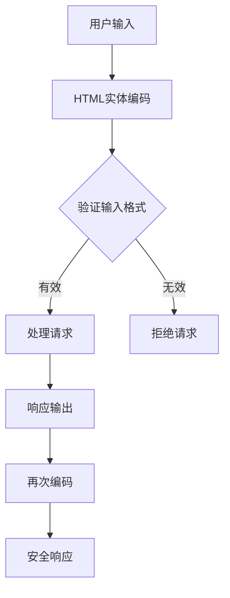

**图表来源**
- [SecurityUtils.java](file://src/main/java/com/photo/util/SecurityUtils.java#L18-L25)

### SQL注入防护

系统实现了简单的SQL注入防护机制：

| 防护措施 | 实现方式 | 效果 |
|----------|----------|------|
| 关键字过滤 | 移除危险SQL关键字 | 阻止常见SQL注入 |
| 参数化查询 | 使用JPA框架 | 防止参数注入 |
| 输入验证 | 格式检查和长度限制 | 减少攻击面 |

### 路径遍历攻击防护

系统实现了多层次的路径遍历攻击防护：

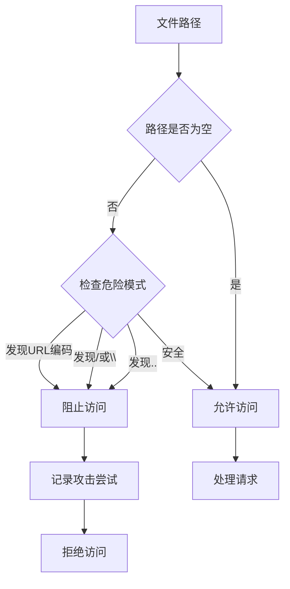

**图表来源**
- [SecurityUtils.java](file://src/main/java/com/photo/util/SecurityUtils.java#L110-L130)

**章节来源**
- [SecurityUtils.java](file://src/main/java/com/photo/util/SecurityUtils.java#L18-L25)
- [SecurityUtils.java](file://src/main/java/com/photo/util/SecurityUtils.java#L77-L95)
- [SecurityUtils.java](file://src/main/java/com/photo/util/SecurityUtils.java#L110-L130)

## 安全工具类

### SecurityUtils核心功能

SecurityUtils类提供了多种安全相关的实用功能：

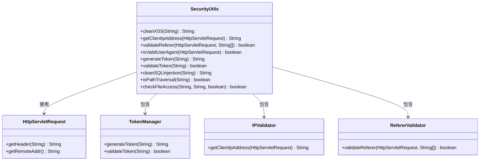

**图表来源**
- [SecurityUtils.java](file://src/main/java/com/photo/util/SecurityUtils.java#L1-L167)

### IP地址获取

系统实现了智能的IP地址获取机制，支持多种代理场景：

| 头部名称 | 优先级 | 说明 |
|----------|--------|------|
| X-Forwarded-For | 1 | 标准代理头 |
| Proxy-Client-IP | 2 | WebLogic代理 |
| WL-Proxy-Client-IP | 3 | WebSphere代理 |
| HTTP_X_FORWARDED_FOR | 4 | Apache代理 |
| REMOTE_ADDR | 5 | 最终IP |

### Token管理

系统提供了基本的Token生成功能，虽然简单但为未来的JWT迁移做好准备：

| 功能 | 实现方式 | 安全级别 |
|------|----------|----------|
| Token生成 | UUID + 用户ID | 中等 |
| Token验证 | 长度检查 | 基础 |
| 过期处理 | 时间戳检查 | 未实现 |

**章节来源**
- [SecurityUtils.java](file://src/main/java/com/photo/util/SecurityUtils.java#L18-L167)

## 生产环境安全加固

### JWT认证升级

建议将现有的简单Token机制升级为JWT认证：

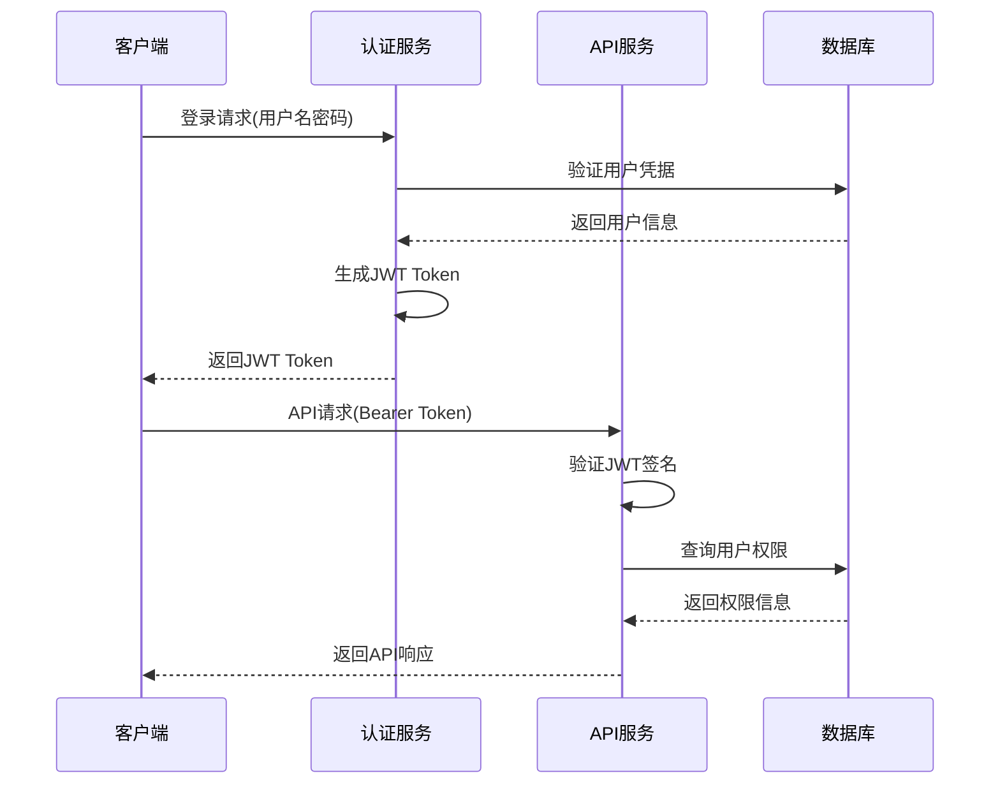

### HTTPS加密配置

生产环境必须启用HTTPS加密：

| 配置项 | 推荐值 | 说明 |
|--------|--------|------|
| 协议版本 | TLS 1.2+ | 使用最新安全协议 |
| 加密套件 | 强加密算法 | 避免弱加密 |
| 证书类型 | 通配符证书 | 支持多域名 |
| HSTS | 启用 | 强制HTTPS访问 |

### 数据库安全

数据库安全配置建议：

| 配置项 | 推荐值 | 说明 |
|--------|--------|------|
| 连接加密 | SSL/TLS | 加密数据库连接 |
| 用户权限 | 最小权限原则 | 限制数据库用户权限 |
| 备份加密 | 启用 | 加密数据库备份 |
| 审计日志 | 启用 | 记录数据库操作 |

### 文件存储安全

对于生产环境的文件存储，建议：

| 方案 | 优势 | 适用场景 |
|------|------|----------|
| 本地存储 | 简单易用 | 小规模应用 |
| 对象存储 | 高可用性 | 大规模应用 |
| 分布式文件系统 | 高性能 | 超大规模应用 |

### 监控与告警

建立完善的安全监控体系：

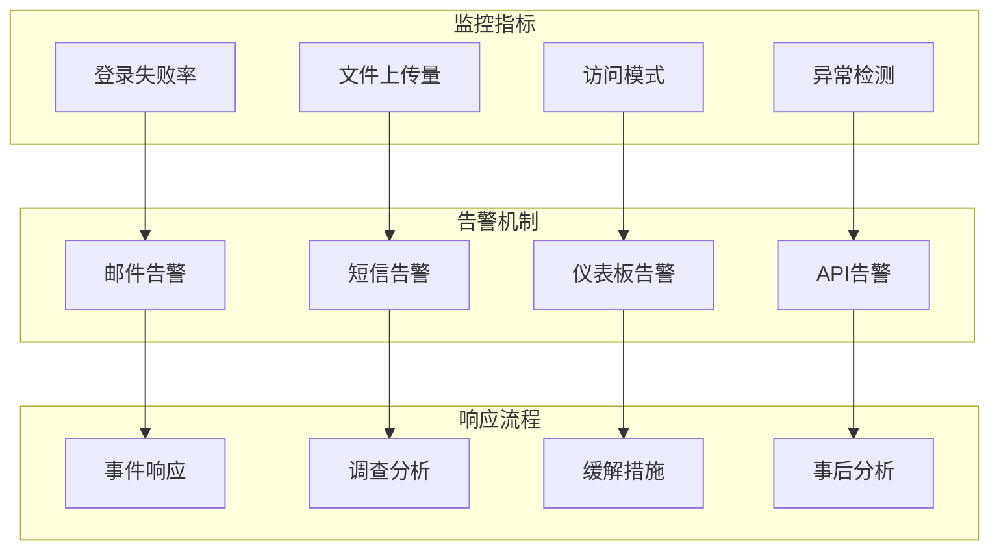

**章节来源**
- [README.md](file://README.md#L250-L265)
- [application.yml](file://src/main/resources/application.yml#L1-L173)

## 安全最佳实践

### 开发阶段安全

1. **代码审查**: 定期进行安全代码审查
2. **依赖管理**: 及时更新第三方依赖
3. **安全测试**: 集成安全测试到CI/CD流程
4. **文档维护**: 保持安全文档的及时更新

### 部署阶段安全

1. **环境隔离**: 开发、测试、生产环境严格分离
2. **配置管理**: 使用配置中心管理敏感配置
3. **访问控制**: 限制对生产环境的直接访问
4. **备份策略**: 建立完善的备份和恢复机制

### 运维阶段安全

1. **日志监控**: 实施全面的日志记录和监控
2. **漏洞扫描**: 定期进行安全漏洞扫描
3. **渗透测试**: 定期进行渗透测试
4. **应急响应**: 建立完善的安全事件应急响应机制

### 安全配置清单

| 配置项 | 开发环境 | 测试环境 | 生产环境 |
|--------|----------|----------|----------|
| 数据库密码 | 简单密码 | 复杂密码 | 强密码 |
| JWT密钥 | 开发密钥 | 测试密钥 | 独立密钥 |
| 文件存储路径 | 本地路径 | 本地路径 | 对象存储 |
| 日志级别 | DEBUG | INFO | WARN+ |
| 错误信息 | 详细 | 一般 | 简化 |

**章节来源**
- [README.md](file://README.md#L250-L265)

## 总结

zcyTest2项目构建了一套完整的企业级安全防护体系，涵盖了从网络层到应用层的全方位安全保护。系统的主要安全特性包括：

### 核心安全优势

1. **多层次防护**: 从网络层到应用层的多层安全防护
2. **文件安全**: 强大的文件类型验证和路径遍历防护
3. **访问控制**: 基于角色的精细访问控制机制
4. **输入验证**: 全面的输入验证和清理机制
5. **防盗链**: 有效的Referer验证防盗链机制

### 技术亮点

- **Apache Tika集成**: 提供准确的文件类型检测
- **Spring Security集成**: 标准化的安全框架应用
- **灵活的配置**: 支持动态安全策略配置
- **完善的测试**: 全面的安全测试覆盖

### 改进建议

1. **升级认证机制**: 从简单Token升级为JWT认证
2. **增强监控能力**: 建立完善的安全监控体系
3. **加强日志审计**: 实施详细的操作日志审计
4. **定期安全评估**: 建立定期的安全评估机制

通过持续的安全改进和监控，zcyTest2项目能够为企业提供可靠的照片管理服务，确保用户数据的安全性和系统的稳定性。