# 访问控制机制

<cite>
**本文档引用的文件**
- [SecurityConfig.java](file://src/main/java/com/photo/config/SecurityConfig.java)
- [SecurityUtils.java](file://src/main/java/com/photo/util/SecurityUtils.java)
- [PhotoController.java](file://src/main/java/com/photo/controller/PhotoController.java)
- [SecurityProperties.java](file://src/main/java/com/photo/config/SecurityProperties.java)
- [application.yml](file://src/main/resources/application.yml)
- [FileStorageService.java](file://src/main/java/com/photo/service/FileStorageService.java)
- [PhotoService.java](file://src/main/java/com/photo/service/PhotoService.java)
- [Photo.java](file://src/main/java/com/photo/entity/Photo.java)
- [AccessDeniedException.java](file://src/main/java/com/photo/exception/AccessDeniedException.java)
- [SecurityUtilsTest.java](file://src/test/java/com/photo/util/SecurityUtilsTest.java)
</cite>

## 目录
1. [简介](#简介)
2. [系统架构概览](#系统架构概览)
3. [Spring Security配置详解](#spring-security配置详解)
4. [细粒度文件访问控制](#细粒度文件访问控制)
5. [用户身份验证与授权流程](#用户身份验证与授权流程)
6. [RESTful API中的用户上下文传递](#restful-api中的用户上下文传递)
7. [安全工具类功能](#安全工具类功能)
8. [生产环境配置建议](#生产环境配置建议)
9. [故障排除指南](#故障排除指南)
10. [总结](#总结)

## 简介

本系统采用基于Spring Security的访问控制机制，实现了多层次的安全防护体系。当前配置采用开放策略，但在设计上预留了扩展点，支持未来集成JWT或OAuth2认证方案。系统通过细粒度的文件访问控制、防盗链保护、XSS防护等多种安全措施，确保照片上传和访问系统的安全性。

## 系统架构概览

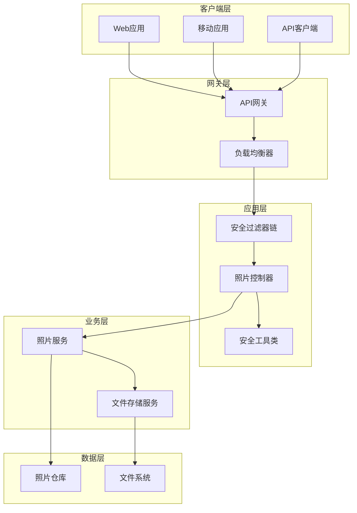

**图表来源**
- [SecurityConfig.java](file://src/main/java/com/photo/config/SecurityConfig.java#L20-L40)
- [PhotoController.java](file://src/main/java/com/photo/controller/PhotoController.java#L30-L50)
- [SecurityUtils.java](file://src/main/java/com/photo/util/SecurityUtils.java#L15-L30)

## Spring Security配置详解

### 当前安全配置特点

系统采用无状态会话策略，禁用了CSRF保护，并配置了CORS跨域支持。当前的路径权限规则如下：

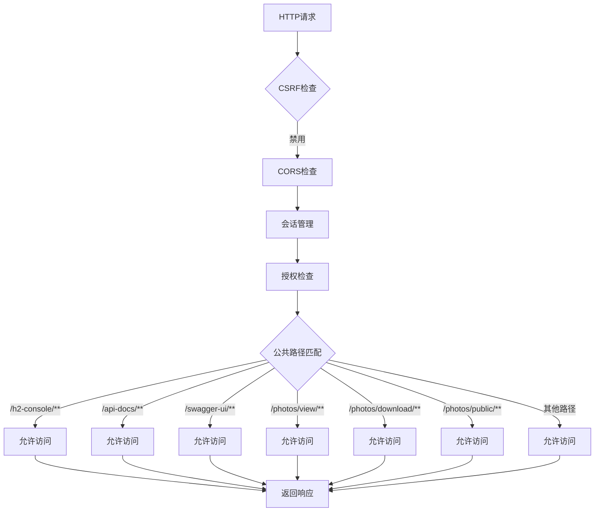

**图表来源**
- [SecurityConfig.java](file://src/main/java/com/photo/config/SecurityConfig.java#L30-L40)

### 公共访问路径配置

系统配置了以下公开访问路径：

| 路径模式 | 功能描述 | 安全级别 |
|---------|---------|---------|
| `/h2-console/**` | H2数据库管理界面 | 开发环境专用 |
| `/api-docs/**` | API文档接口 | 文档访问 |
| `/swagger-ui/**` | Swagger UI界面 | 文档访问 |
| `/photos/view/**` | 照片在线预览 | 公开访问 |
| `/photos/download/**` | 照片下载接口 | 公开访问 |
| `/photos/public/**` | 公开照片访问 | 公开访问 |

### CORS配置管理

系统通过`SecurityProperties`类管理CORS配置，支持动态配置允许的域名、方法和头部：

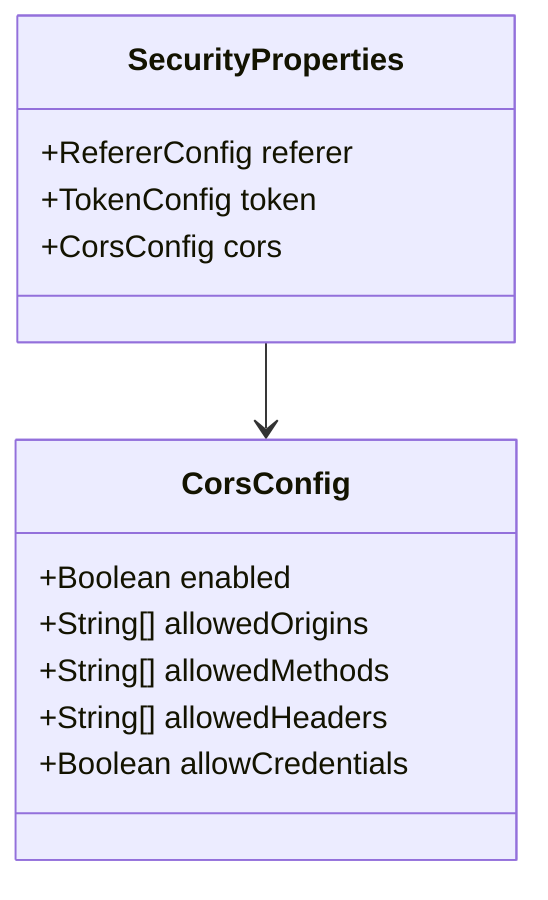

**图表来源**
- [SecurityProperties.java](file://src/main/java/com/photo/config/SecurityProperties.java#L15-L50)
- [SecurityConfig.java](file://src/main/java/com/photo/config/SecurityConfig.java#L42-L55)

**章节来源**
- [SecurityConfig.java](file://src/main/java/com/photo/config/SecurityConfig.java#L20-L70)
- [SecurityProperties.java](file://src/main/java/com/photo/config/SecurityProperties.java#L15-L52)

## 细粒度文件访问控制

### SecurityUtils.checkFileAccess方法实现

系统通过`SecurityUtils.checkFileAccess`方法实现细粒度的文件访问控制，确保私有照片仅由所有者访问：

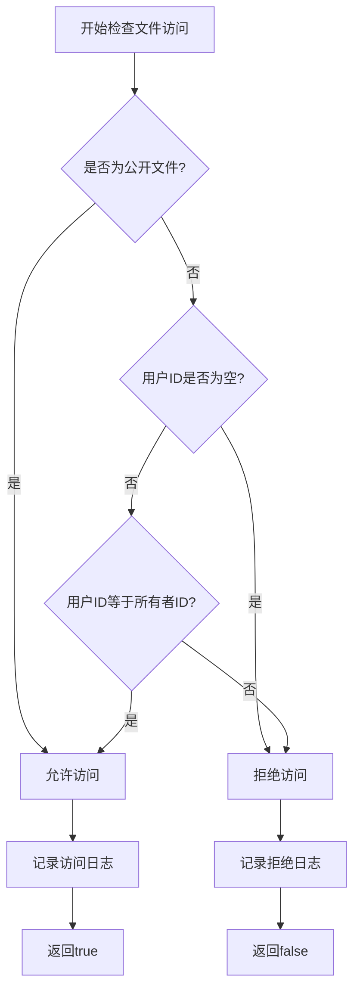

**图表来源**
- [SecurityUtils.java](file://src/main/java/com/photo/util/SecurityUtils.java#L140-L155)

### 访问控制逻辑详解

访问控制遵循以下规则：

1. **公开文件访问**：所有用户都可以访问标记为公开的文件
2. **私有文件访问**：只有文件所有者才能访问私有文件
3. **匿名访问**：未提供用户ID的请求被视为匿名访问
4. **访问日志**：系统记录所有访问尝试，便于审计和监控

### 实际应用场景

在照片管理系统中，访问控制体现在以下几个方面：

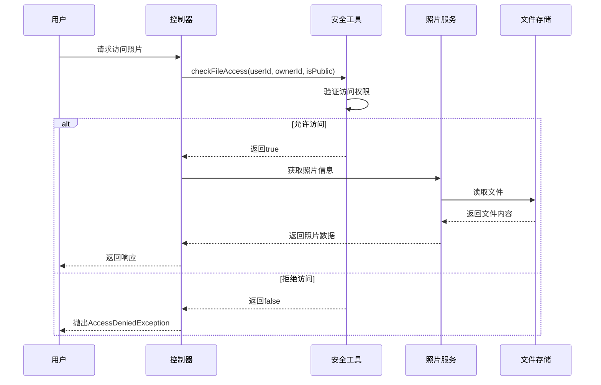

**图表来源**
- [SecurityUtils.java](file://src/main/java/com/photo/util/SecurityUtils.java#L140-L155)
- [PhotoController.java](file://src/main/java/com/photo/controller/PhotoController.java#L80-L120)

**章节来源**
- [SecurityUtils.java](file://src/main/java/com/photo/util/SecurityUtils.java#L140-L166)
- [PhotoController.java](file://src/main/java/com/photo/controller/PhotoController.java#L80-L120)

## 用户身份验证与授权流程

### 当前认证策略

系统目前采用开放认证策略，所有请求都无需身份验证即可访问。这种设计适用于演示环境和内部系统，但在生产环境中需要升级到更安全的认证方案。

### 授权流程设计

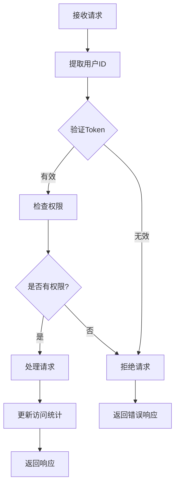

### 用户上下文传递机制

系统通过多种方式传递和验证用户上下文：

1. **URL参数传递**：在上传和操作照片时通过`userId`参数传递用户标识
2. **请求头传递**：可以通过自定义请求头传递用户信息
3. **Cookie传递**：支持基于Cookie的身份验证
4. **JWT令牌**：预留了JWT集成的扩展点

**章节来源**
- [PhotoController.java](file://src/main/java/com/photo/controller/PhotoController.java#L45-L80)
- [SecurityUtils.java](file://src/main/java/com/photo/util/SecurityUtils.java#L120-L140)

## RESTful API中的用户上下文传递

### API调用示例

系统提供了多种API接口，每个接口都支持用户上下文的传递和验证：

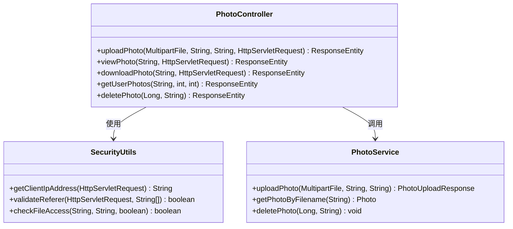

**图表来源**
- [PhotoController.java](file://src/main/java/com/photo/controller/PhotoController.java#L45-L315)
- [SecurityUtils.java](file://src/main/java/com/photo/util/SecurityUtils.java#L30-L80)

### 关键API接口的安全特性

| API接口 | 用户上下文 | 访问控制 | 安全措施 |
|---------|-----------|---------|---------|
| `/photos/upload` | URL参数userId | 无限制 | 文件类型验证、大小限制 |
| `/photos/view/{filename}` | IP地址跟踪 | 文件权限检查 | 防盗链、XSS防护 |
| `/photos/download/{filename}` | IP地址跟踪 | 文件权限检查 | 下载计数、访问控制 |
| `/photos/user/{userId}` | URL参数userId | 用户权限验证 | 软删除、访问限制 |
| `/photos/public` | 匿名访问 | 公开文件访问 | 分页、缓存优化 |

### 请求处理流程

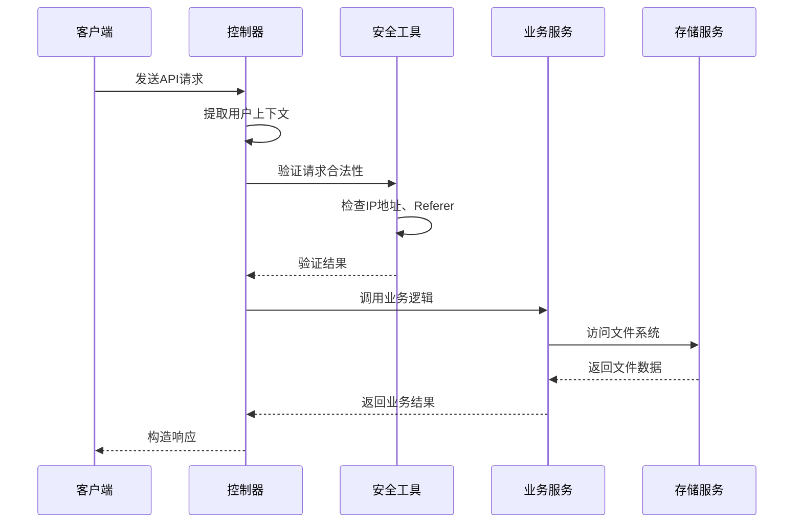

**图表来源**
- [PhotoController.java](file://src/main/java/com/photo/controller/PhotoController.java#L45-L120)
- [SecurityUtils.java](file://src/main/java/com/photo/util/SecurityUtils.java#L30-L80)

**章节来源**
- [PhotoController.java](file://src/main/java/com/photo/controller/PhotoController.java#L45-L315)
- [SecurityUtils.java](file://src/main/java/com/photo/util/SecurityUtils.java#L30-L80)

## 安全工具类功能

### XSS防护机制

系统通过`SecurityUtils.cleanXSS`方法提供XSS防护：

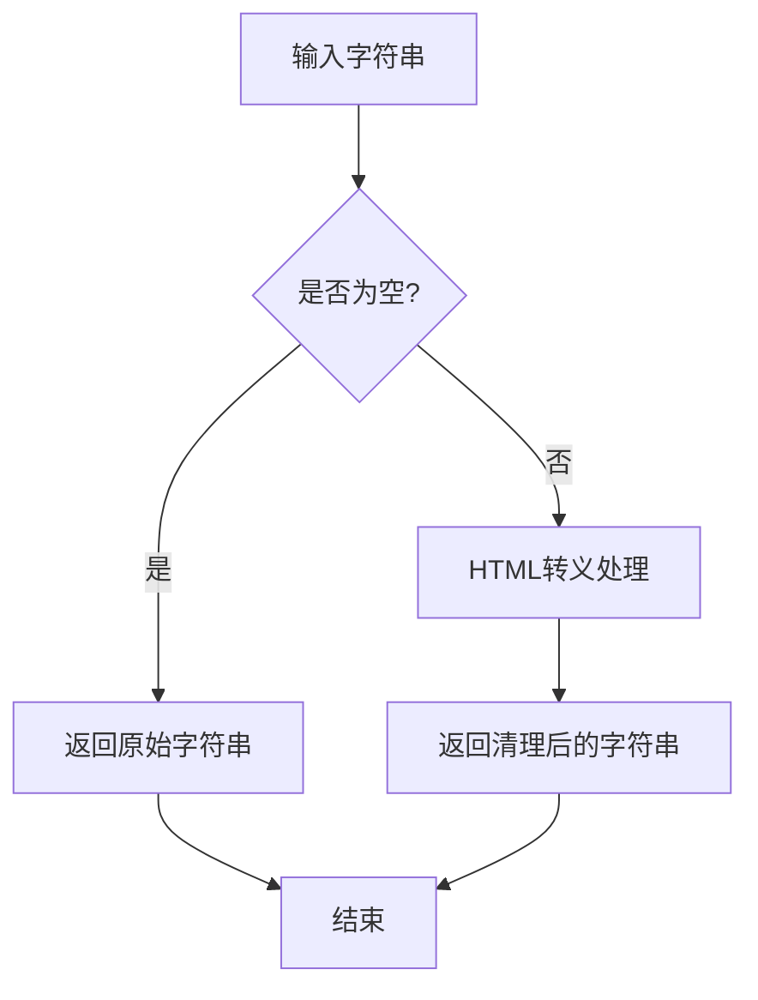

**图表来源**
- [SecurityUtils.java](file://src/main/java/com/photo/util/SecurityUtils.java#L18-L25)

### 防盗链保护

通过`validateReferer`方法实现防盗链保护：

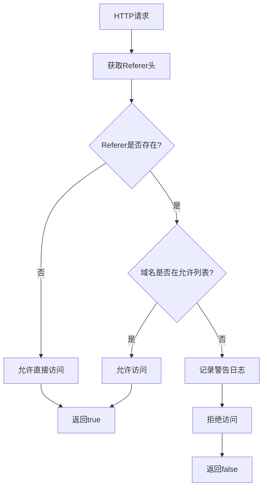

**图表来源**
- [SecurityUtils.java](file://src/main/java/com/photo/util/SecurityUtils.java#L60-L80)

### 路径遍历攻击防护

系统通过`isPathTraversal`方法检测和防止路径遍历攻击：

| 攻击模式 | 检测规则 | 防护措施 |
|---------|---------|---------|
| `../` | 检查相对路径符号 | 拒绝请求并记录日志 |
| `..\\` | 检查Windows路径符号 | 拒绝请求并记录日志 |
| `%2e%2e` | 检查URL编码的路径 | 拒绝请求并记录日志 |
| `./config` | 检查特殊目录访问 | 拒绝请求并记录日志 |

### SQL注入防护

通过`cleanSQLInjection`方法提供基本的SQL注入防护：

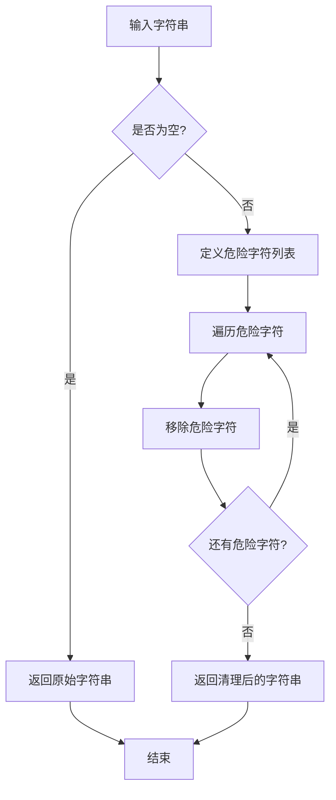

**图表来源**
- [SecurityUtils.java](file://src/main/java/com/photo/util/SecurityUtils.java#L110-L135)

**章节来源**
- [SecurityUtils.java](file://src/main/java/com/photo/util/SecurityUtils.java#L18-L166)
- [SecurityUtilsTest.java](file://src/test/java/com/photo/util/SecurityUtilsTest.java#L15-L157)

## 生产环境配置建议

### JWT认证集成方案

为了提升系统安全性，建议在生产环境中集成JWT认证：

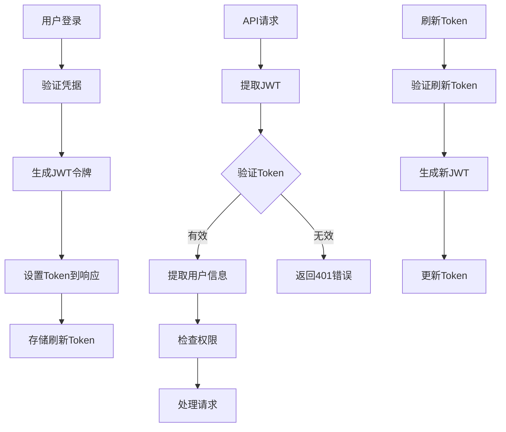

### OAuth2集成配置

对于企业级应用，建议集成OAuth2认证：

```yaml
# OAuth2配置示例
spring:
  security:
    oauth2:
      client:
        registration:
          google:
            client-id: your-client-id
            client-secret: your-client-secret
            scope: openid,email,profile
            redirect-uri: "{baseUrl}/login/oauth2/code/{registrationId}"
        provider:
          google:
            authorization-uri: https://accounts.google.com/o/oauth2/v2/auth
            token-uri: https://oauth2.googleapis.com/token
            user-info-uri: https://www.googleapis.com/oauth2/v3/userinfo
            user-name-attribute: sub
```

### 安全配置最佳实践

| 配置项 | 开发环境 | 生产环境 | 说明 |
|-------|---------|---------|------|
| CSRF保护 | 禁用 | 启用 | 生产环境必须启用 |
| HTTPS | 可选 | 强制 | 必须使用HTTPS传输 |
| Token过期时间 | 24小时 | 1小时 | 生产环境应更短 |
| 错误信息 | 详细 | 简化 | 避免泄露敏感信息 |
| 访问日志 | 启用 | 启用 | 记录所有访问尝试 |

### 性能优化建议

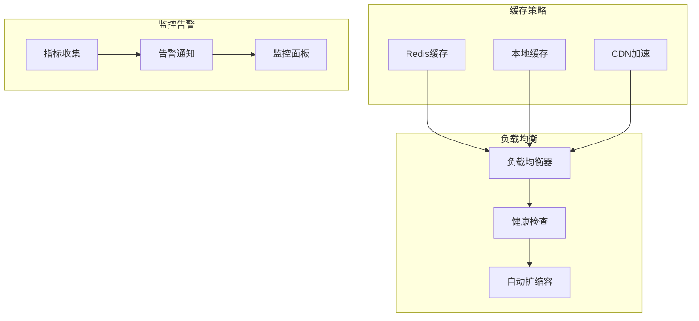

**章节来源**
- [SecurityConfig.java](file://src/main/java/com/photo/config/SecurityConfig.java#L20-L70)
- [application.yml](file://src/main/resources/application.yml#L120-L150)

## 故障排除指南

### 常见问题及解决方案

| 问题类型 | 症状描述 | 可能原因 | 解决方案 |
|---------|---------|---------|---------|
| 访问被拒绝 | 403 Forbidden错误 | 用户权限不足 | 检查用户ID和文件所有权 |
| 文件无法访问 | 404 Not Found错误 | 文件路径错误 | 验证文件存储路径配置 |
| CORS错误 | 浏览器阻止请求 | 跨域配置不正确 | 检查CORS允许的域名 |
| CSRF错误 | 表单提交失败 | CSRF保护启用 | 禁用开发环境的CSRF保护 |
| 内存溢出 | 上传大文件失败 | 内存配置不足 | 调整JVM内存参数 |

### 调试和监控

系统提供了完善的日志记录和监控机制：

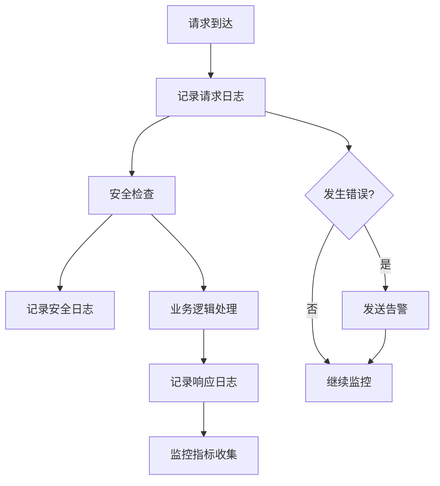

### 性能监控指标

| 指标类别 | 关键指标 | 监控阈值 | 告警条件 |
|---------|---------|---------|---------|
| 响应时间 | 平均响应时间 | < 200ms | > 500ms |
| 错误率 | HTTP 5xx错误率 | < 1% | > 5% |
| 并发数 | 活跃连接数 | < 80% | > 90% |
| 资源使用 | CPU使用率 | < 70% | > 85% |
| 资源使用 | 内存使用率 | < 80% | > 90% |

**章节来源**
- [SecurityUtils.java](file://src/main/java/com/photo/util/SecurityUtils.java#L140-L166)
- [PhotoController.java](file://src/main/java/com/photo/controller/PhotoController.java#L80-L120)

## 总结

本系统构建了一个多层次的安全访问控制体系，具有以下特点：

### 核心优势

1. **灵活的权限模型**：支持公开和私有文件访问，满足不同场景需求
2. **完善的防护机制**：涵盖XSS、CSRF、路径遍历、SQL注入等多种攻击防护
3. **可扩展的设计**：预留了JWT和OAuth2认证的集成点
4. **详细的访问控制**：通过细粒度权限控制确保数据安全
5. **全面的安全工具**：提供多种安全检查和防护功能

### 发展方向

1. **认证升级**：从开放策略升级到JWT或OAuth2认证
2. **权限细化**：实现基于角色的访问控制(RBAC)
3. **审计增强**：增加更详细的访问日志和审计功能
4. **性能优化**：引入缓存和CDN加速访问性能
5. **合规性改进**：满足GDPR等数据保护法规要求

### 部署建议

- **开发环境**：保持当前开放策略，便于开发和测试
- **测试环境**：启用基本的安全配置，模拟生产环境
- **生产环境**：强制启用所有安全功能，定期进行安全审计

通过持续的安全改进和监控，本系统能够为用户提供安全可靠的照片管理服务。