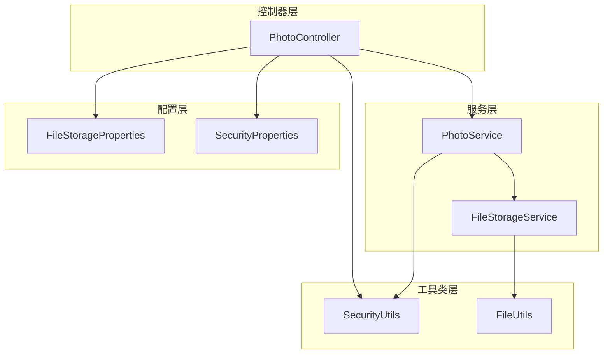
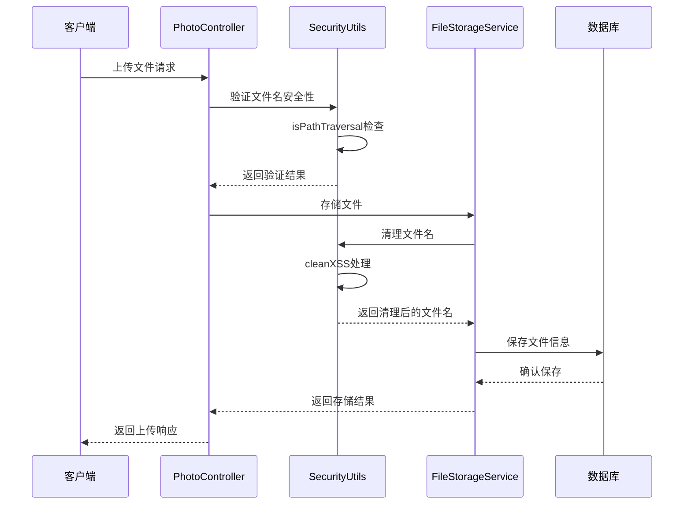
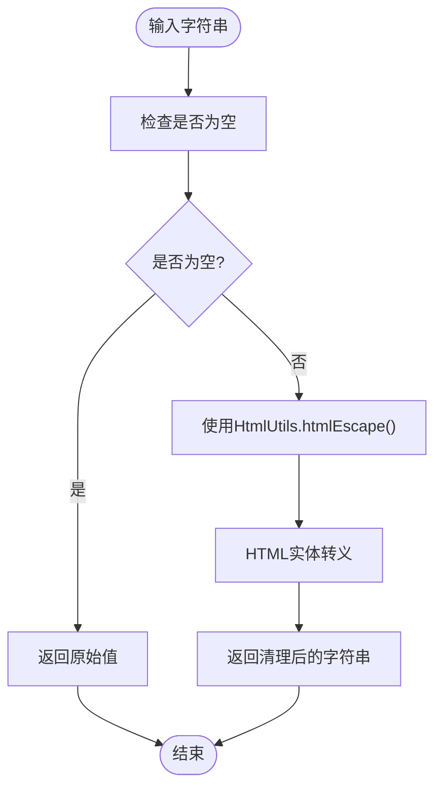
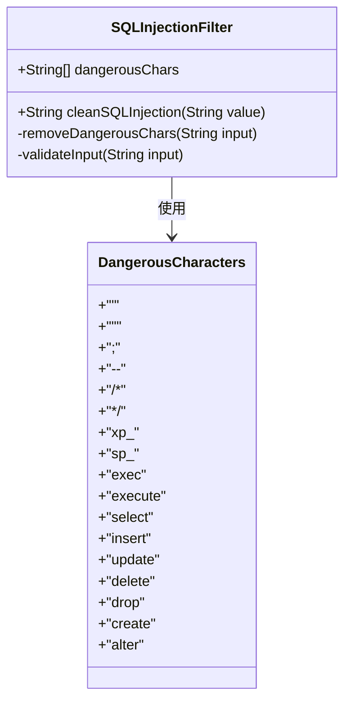
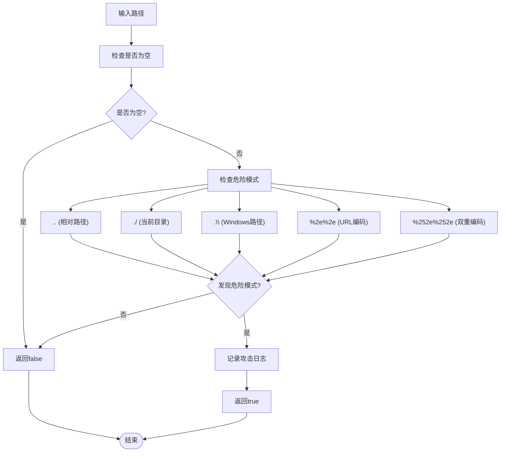
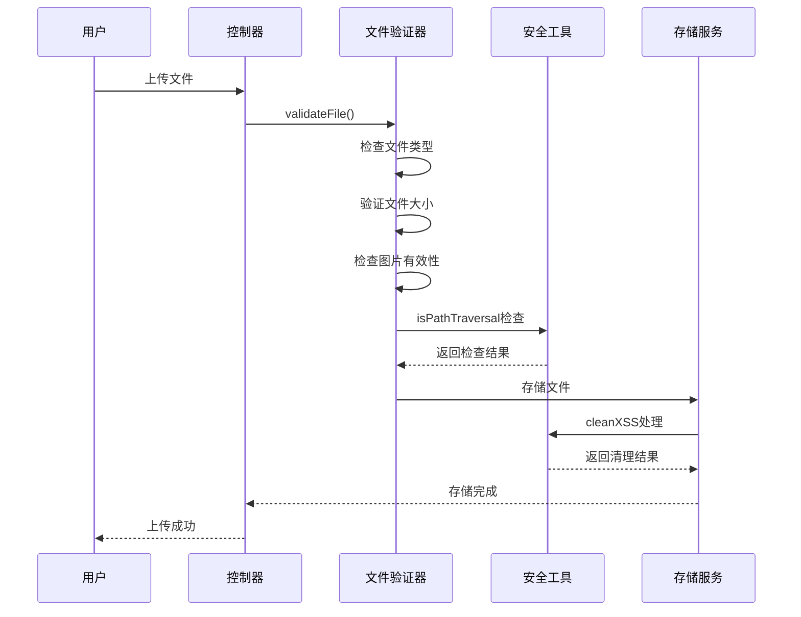
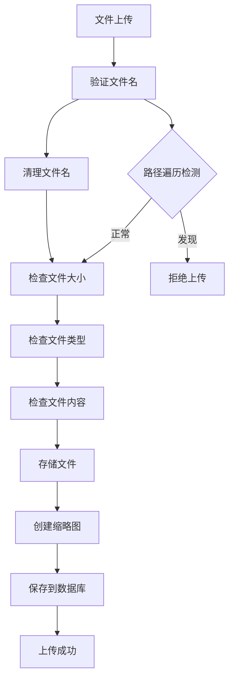
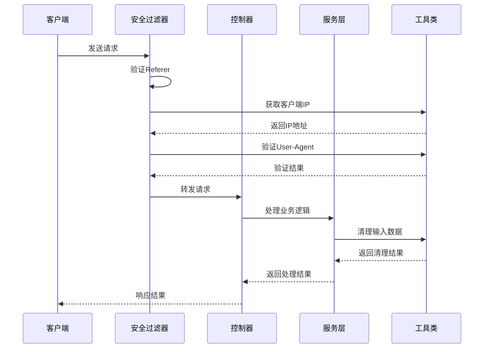
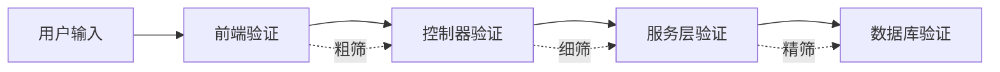
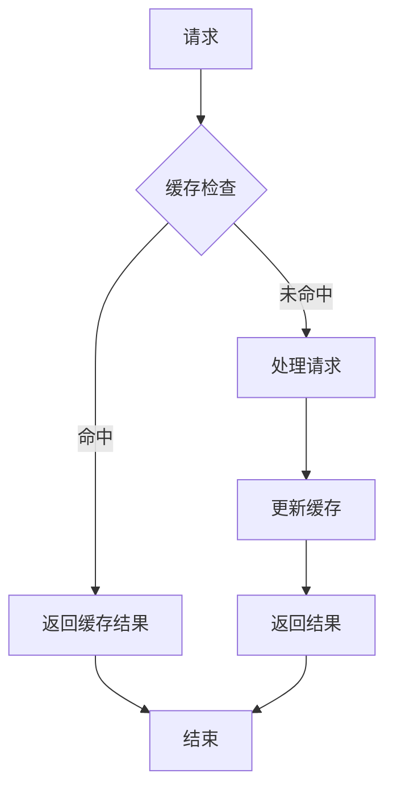

# 输入验证与净化

<cite>
**本文档引用的文件**
- [SecurityUtils.java](file://src/main/java/com/photo/util/SecurityUtils.java)
- [SecurityUtilsTest.java](file://src/test/java/com/photo/util/SecurityUtilsTest.java)
- [PhotoController.java](file://src/main/java/com/photo/controller/PhotoController.java)
- [FileStorageService.java](file://src/main/java/com/photo/service/FileStorageService.java)
- [PhotoService.java](file://src/main/java/com/photo/service/PhotoService.java)
- [FileUtils.java](file://src/main/java/com/photo/util/FileUtils.java)
- [FileStorageProperties.java](file://src/main/java/com/photo/config/FileStorageProperties.java)
- [SecurityProperties.java](file://src/main/java/com/photo/config/SecurityProperties.java)
- [application.yml](file://src/main/resources/application.yml)
</cite>

## 目录
1. [简介](#简介)
2. [项目结构概览](#项目结构概览)
3. [核心安全工具类](#核心安全工具类)
4. [架构概览](#架构概览)
5. [详细组件分析](#详细组件分析)
6. [攻击防护机制](#攻击防护机制)
7. [实际应用场景](#实际应用场景)
8. [最佳实践建议](#最佳实践建议)
9. [性能考虑](#性能考虑)
10. [故障排除指南](#故障排除指南)
11. [总结](#总结)

## 简介

本文档深入分析了Photo Upload System项目中的输入验证与净化机制，重点介绍了SecurityUtils类提供的多种安全防护功能。该系统采用多层次的安全策略，包括XSS防护、SQL注入防护、路径遍历攻击防护等，确保用户输入的安全性。

系统的核心安全理念是"纵深防御"，通过在多个层次实施安全控制，即使某一层防护失效，其他层仍能提供保护。这种设计模式有效应对各种Web应用程序面临的常见安全威胁。

## 项目结构概览



**图表来源**
- [PhotoController.java](file://src/main/java/com/photo/controller/PhotoController.java#L1-L50)
- [PhotoService.java](file://src/main/java/com/photo/service/PhotoService.java#L1-L50)
- [SecurityUtils.java](file://src/main/java/com/photo/util/SecurityUtils.java#L1-L30)

**章节来源**
- [PhotoController.java](file://src/main/java/com/photo/controller/PhotoController.java#L1-L316)
- [SecurityUtils.java](file://src/main/java/com/photo/util/SecurityUtils.java#L1-L167)

## 核心安全工具类

SecurityUtils类是系统安全防护的核心组件，提供了完整的输入验证与净化功能。该类采用静态方法设计，便于在整个应用程序中统一使用。

### 主要功能模块

| 功能模块 | 方法名称 | 安全目标 | 实现原理 |
|---------|---------|---------|---------|
| XSS防护 | cleanXSS | 防止跨站脚本攻击 | 使用Spring HtmlUtils进行HTML转义 |
| SQL注入防护 | cleanSQLInjection | 防止SQL命令注入 | 过滤危险字符和SQL关键字 |
| 路径遍历防护 | isPathTraversal | 防止目录遍历攻击 | 检测路径遍历字符序列 |
| 防盗链验证 | validateReferer | 防止盗链攻击 | 验证HTTP Referer头部 |
| IP地址获取 | getClientIpAddress | 获取真实客户端IP | 处理代理和负载均衡场景 |

**章节来源**
- [SecurityUtils.java](file://src/main/java/com/photo/util/SecurityUtils.java#L15-L167)

## 架构概览



**图表来源**
- [PhotoController.java](file://src/main/java/com/photo/controller/PhotoController.java#L40-L60)
- [SecurityUtils.java](file://src/main/java/com/photo/util/SecurityUtils.java#L130-L150)
- [FileStorageService.java](file://src/main/java/com/photo/service/FileStorageService.java#L50-L80)

## 详细组件分析

### XSS防护机制 - cleanXSS方法

cleanXSS方法是系统最重要的安全防护功能之一，专门用于防止跨站脚本攻击(XSS)。

#### 实现原理



**图表来源**
- [SecurityUtils.java](file://src/main/java/com/photo/util/SecurityUtils.java#L15-L22)

#### 安全效果对比

| 攻击向量 | 未防护 | cleanXSS防护 |
|---------|--------|-------------|
| `<script>alert('XSS')</script>` | 执行JavaScript | 显示为纯文本 |
| `` | 触发错误事件 | 显示为普通图片标签 |
| `javascript:alert(1)` | 执行JavaScript | 显示为普通文本 |
| `"><script>alert(1)</script>` | 注入脚本 | 转义为HTML实体 |

**章节来源**
- [SecurityUtils.java](file://src/main/java/com/photo/util/SecurityUtils.java#L15-L22)
- [SecurityUtilsTest.java](file://src/test/java/com/photo/util/SecurityUtilsTest.java#L15-L25)

### SQL注入防护机制 - cleanSQLInjection方法

cleanSQLInjection方法实现了基础的SQL注入防护，通过移除危险字符和关键字来防止恶意SQL语句的执行。

#### 过滤规则



**图表来源**
- [SecurityUtils.java](file://src/main/java/com/photo/util/SecurityUtils.java#L110-L125)

#### 防护效果

| 危险字符 | 过滤前 | 过滤后 |
|---------|--------|--------|
| `' OR '1'='1` | `' OR '1'='1` | ` OR 1=1` |
| `'; DROP TABLE users; --` | `'; DROP TABLE users; --` | `DROP TABLE users; ` |
| `SELECT * FROM users WHERE id=1` | SELECT * FROM users WHERE id=1 | SELECT * FROM users WHERE id=1 |
| `EXEC xp_cmdshell 'dir'` | EXEC xp_cmdshell 'dir' | EXEC cmdshell 'dir' |

**章节来源**
- [SecurityUtils.java](file://src/main/java/com/photo/util/SecurityUtils.java#L110-L125)

### 路径遍历攻击防护 - isPathTraversal方法

isPathTraversal方法专门检测路径遍历攻击向量，这是Web应用程序中最常见的文件系统攻击之一。

#### 检测模式



**图表来源**
- [SecurityUtils.java](file://src/main/java/com/photo/util/SecurityUtils.java#L130-L150)

#### 攻击场景示例

| 攻击向量 | 检测结果 | 防护效果 |
|---------|---------|---------|
| `../../../etc/passwd` | 检测到 | 阻止访问系统文件 |
| `./config/database.php` | 检测到 | 阻止访问配置文件 |
| `..\\windows\\system32\\config` | 检测到 | 阻止访问系统目录 |
| `normal/path/file.txt` | 正常 | 允许正常访问 |
| `%2e%2e/etc/passwd` | 检测到 | 阻止URL编码绕过 |

**章节来源**
- [SecurityUtils.java](file://src/main/java/com/photo/util/SecurityUtils.java#L130-L150)
- [SecurityUtilsTest.java](file://src/test/java/com/photo/util/SecurityUtilsTest.java#L100-L110)

### 文件上传安全验证

文件上传是Web应用程序中最容易受到攻击的功能之一。系统通过多层验证确保文件上传的安全性。

#### 文件验证流程



**图表来源**
- [PhotoService.java](file://src/main/java/com/photo/service/PhotoService.java#L350-L380)
- [FileStorageService.java](file://src/main/java/com/photo/service/FileStorageService.java#L50-L80)

**章节来源**
- [PhotoService.java](file://src/main/java/com/photo/service/PhotoService.java#L350-L384)
- [FileStorageService.java](file://src/main/java/com/photo/service/FileStorageService.java#L50-L80)

## 攻击防护机制

### XSS攻击防护

#### 防御策略

1. **输入净化**：使用Spring框架的HtmlUtils进行HTML实体转义
2. **输出编码**：在模板渲染时自动进行适当的编码
3. **内容安全策略**：设置CSP头限制脚本执行

#### 实际效果

系统能够有效防护以下类型的XSS攻击：
- DOM-based XSS
- Reflected XSS  
- Stored XSS

**章节来源**
- [SecurityUtils.java](file://src/main/java/com/photo/util/SecurityUtils.java#L15-L22)

### SQL注入防护

#### 多层防护

1. **输入清理**：移除危险字符和关键字
2. **参数化查询**：使用PreparedStatement避免直接拼接SQL
3. **权限控制**：最小权限原则，数据库用户权限受限

#### 防护能力

| 攻击类型 | 防护级别 | 防护效果 |
|---------|---------|---------|
| 时间延迟注入 | 基础 | 无法执行 |
| 报错注入 | 基础 | 无法获取信息 |
| 内联查询注入 | 基础 | 无法执行 |
| 权限提升 | 中级 | 需要配合其他漏洞 |

**章节来源**
- [SecurityUtils.java](file://src/main/java/com/photo/util/SecurityUtils.java#L110-L125)

### 路径遍历攻击防护

#### 检测机制

系统采用主动检测和被动防护相结合的方式：

1. **主动检测**：在文件操作前检查路径安全性
2. **被动防护**：限制文件操作范围，防止越权访问
3. **日志记录**：记录所有可疑访问尝试

#### 防护边界

- 限制文件操作仅限于指定目录
- 禁止绝对路径访问
- 防止符号链接攻击

**章节来源**
- [SecurityUtils.java](file://src/main/java/com/photo/util/SecurityUtils.java#L130-L150)
- [FileStorageService.java](file://src/main/java/com/photo/service/FileStorageService.java#L60-L80)

## 实际应用场景

### 文件上传场景

在文件上传过程中，系统实施了完整的安全验证链：



**图表来源**
- [PhotoService.java](file://src/main/java/com/photo/service/PhotoService.java#L40-L80)
- [FileStorageService.java](file://src/main/java/com/photo/service/FileStorageService.java#L50-L80)

#### 安全配置示例

系统通过配置文件定义了严格的安全参数：

| 配置项 | 默认值 | 安全意义 |
|-------|--------|---------|
| max-file-size | 10MB | 限制文件大小，防止资源耗尽 |
| allowed-types | image/* | 限制文件类型，防止恶意文件 |
| max-files-per-upload | 10 | 限制批量上传数量 |
| compression.enabled | true | 自动压缩图片，减少存储空间 |

**章节来源**
- [application.yml](file://src/main/resources/application.yml#L50-L80)
- [FileStorageProperties.java](file://src/main/java/com/photo/config/FileStorageProperties.java#L15-L50)

### API接口安全

#### 请求验证流程



**图表来源**
- [PhotoController.java](file://src/main/java/com/photo/controller/PhotoController.java#L40-L60)
- [SecurityProperties.java](file://src/main/java/com/photo/config/SecurityProperties.java#L15-L30)

**章节来源**
- [PhotoController.java](file://src/main/java/com/photo/controller/PhotoController.java#L40-L60)
- [SecurityProperties.java](file://src/main/java/com/photo/config/SecurityProperties.java#L15-L53)

## 最佳实践建议

### 输入验证最佳实践

#### 1. 多层次验证策略



#### 2. 验证规则设计原则

| 原则 | 说明 | 实现方式 |
|------|------|---------|
| 白名单验证 | 只接受明确允许的输入 | 定义允许的字符集和格式 |
| 黑名单补充 | 补充已知的危险输入 | 定期更新危险字符列表 |
| 边界检查 | 验证输入长度和范围 | 设置合理的上下限 |
| 类型验证 | 确保输入符合预期类型 | 使用强类型语言和验证库 |

#### 3. 错误处理策略

- **用户友好**：提供清晰的错误提示，避免泄露系统信息
- **安全审计**：记录所有验证失败的情况
- **异常隔离**：防止验证错误影响系统稳定性

### 安全配置建议

#### 1. 文件上传安全配置

```yaml
# 生产环境安全配置示例
file:
  storage:
    max-file-size: 5242880  # 5MB，更严格的限制
    allowed-types:
      - image/jpeg
      - image/png
      - image/gif
    max-files-per-upload: 5  # 减少批量上传风险
    compression:
      enabled: true
      quality: 0.9  # 更高的压缩质量
```

#### 2. 安全头配置

```yaml
security:
  referer:
    enabled: true
    allowed-domains:
      - https://yourdomain.com
      - https://www.yourdomain.com
  token:
    expiration: 43200  # 12小时，更短的过期时间
  cors:
    allowed-origins:
      - https://yourdomain.com
    allowed-methods:
      - GET
      - POST
      - OPTIONS
```

#### 3. 监控和告警

- **访问监控**：记录所有文件访问请求
- **异常告警**：检测到安全威胁时及时通知
- **性能监控**：监控安全验证对系统性能的影响

### 开发团队协作规范

#### 1. 代码审查要点

- 验证所有用户输入
- 检查安全工具类的正确使用
- 确保异常处理的完整性
- 验证配置参数的安全性

#### 2. 测试策略

- **单元测试**：覆盖所有安全验证逻辑
- **集成测试**：测试完整的工作流程
- **安全测试**：模拟各种攻击场景
- **性能测试**：评估安全措施的性能影响

## 性能考虑

### 安全验证性能优化

#### 1. 缓存策略



#### 2. 性能监控指标

| 指标 | 目标值 | 监控方法 |
|------|--------|---------|
| 验证响应时间 | < 10ms | 应用程序监控 |
| CPU使用率 | < 50% | 系统监控 |
| 内存使用率 | < 70% | 系统监控 |
| 并发处理能力 | > 1000 req/s | 压力测试 |

#### 3. 性能优化建议

- **异步处理**：对于耗时的安全检查，使用异步处理
- **批量验证**：对批量操作进行批量验证
- **智能缓存**：缓存频繁使用的验证结果
- **资源池化**：复用安全工具类实例

## 故障排除指南

### 常见问题诊断

#### 1. XSS防护失效

**症状**：用户输入仍然被当作脚本执行

**排查步骤**：
1. 检查cleanXSS方法是否被正确调用
2. 验证HtmlUtils版本兼容性
3. 确认输出编码是否正确应用

**解决方案**：
```java
// 确保在输出时正确编码
String safeOutput = SecurityUtils.cleanXSS(userInput);
response.getWriter().write(HtmlUtils.htmlEscape(safeOutput));
```

#### 2. SQL注入防护误报

**症状**：合法的SQL查询被错误地过滤

**排查步骤**：
1. 分析被过滤的具体内容
2. 检查cleanSQLInjection的过滤规则
3. 验证是否使用了参数化查询

**解决方案**：
```java
// 使用参数化查询替代字符串拼接
String sql = "SELECT * FROM users WHERE id = ?";
PreparedStatement stmt = connection.prepareStatement(sql);
stmt.setInt(1, userId);
```

#### 3. 路径遍历检测误报

**症状**：合法的文件路径被错误识别为攻击

**排查步骤**：
1. 检查文件路径的规范化处理
2. 验证isPathTraversal方法的逻辑
3. 确认文件操作的边界控制

**解决方案**：
```java
// 使用路径规范化确保安全性
Path normalizedPath = baseDir.resolve(filename).normalize();
if (!normalizedPath.startsWith(baseDir)) {
    throw new SecurityException("非法文件路径");
}
```

### 日志分析指南

#### 关键日志模式

```bash
# XSS攻击日志
grep "cleanXSS" application.log | grep -E "<script|<img|javascript"

# SQL注入尝试日志
grep "cleanSQLInjection" application.log | grep -E "'|--|;|DROP|SELECT"

# 路径遍历攻击日志
grep "isPathTraversal" application.log | grep -E "\.\.|\/|\\|%2e"
```

#### 监控告警配置

```yaml
# 监控配置示例
monitoring:
  thresholds:
    xss_attempts: 10
    sql_injection_attempts: 5
    path_traversal_attempts: 3
  alerts:
    email: admin@yourdomain.com
    slack_webhook: https://hooks.slack.com/services/...
```

**章节来源**
- [SecurityUtils.java](file://src/main/java/com/photo/util/SecurityUtils.java#L15-L167)
- [SecurityUtilsTest.java](file://src/test/java/com/photo/util/SecurityUtilsTest.java#L1-L158)

## 总结

Photo Upload System项目的输入验证与净化机制体现了现代Web应用程序安全设计的最佳实践。通过SecurityUtils类提供的多层次防护，系统能够有效抵御XSS、SQL注入、路径遍历等多种常见攻击。

### 核心优势

1. **全面防护**：涵盖输入验证、输出编码、文件安全等多个方面
2. **易于使用**：提供简洁的API接口，便于集成和维护
3. **性能优化**：采用缓存和异步处理，确保系统性能
4. **可扩展性**：模块化设计支持功能扩展和定制

### 持续改进建议

1. **威胁情报集成**：定期更新危险字符和攻击模式数据库
2. **机器学习增强**：引入AI技术提高攻击检测准确性
3. **零信任架构**：实施更严格的访问控制策略
4. **合规性检查**：确保符合相关安全标准和法规要求

通过持续的安全投入和技术升级，该系统的安全防护能力将不断提升，为用户提供更加安全可靠的服务体验。