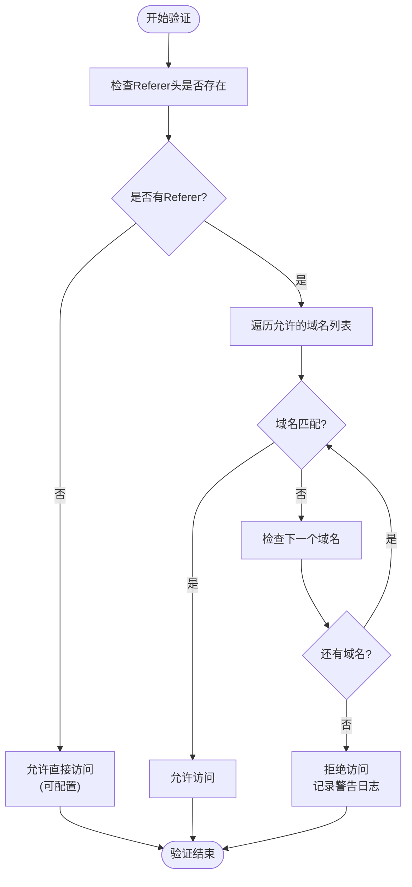
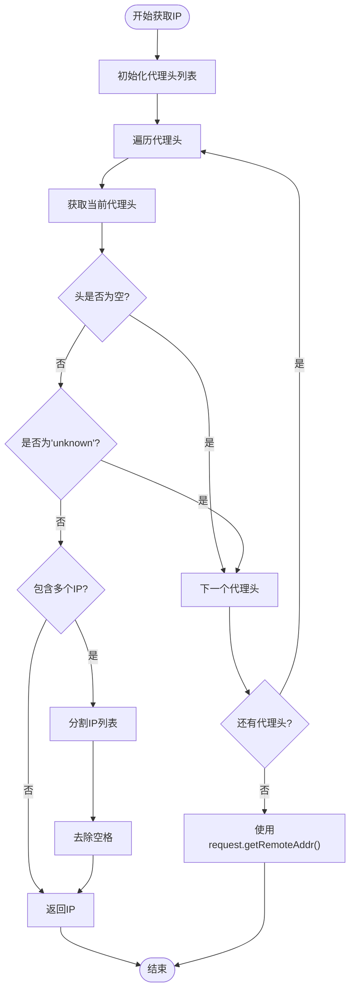
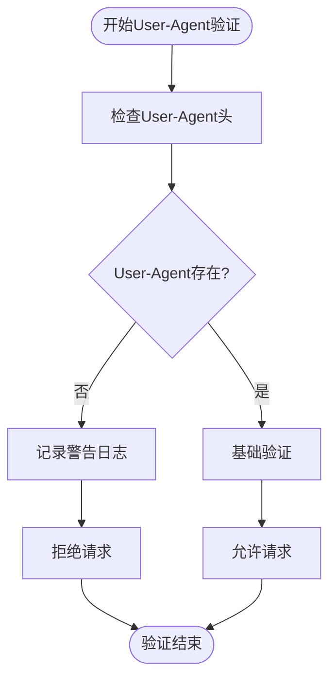
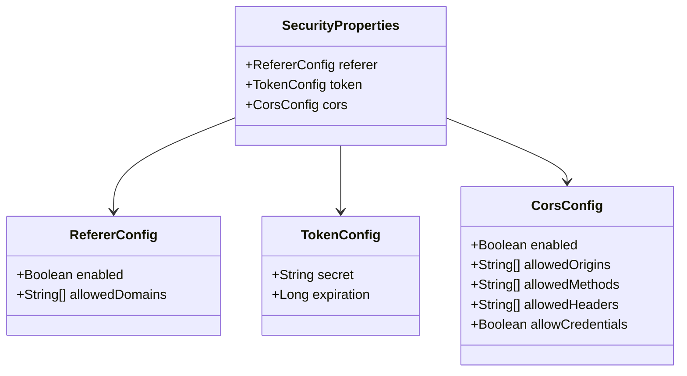
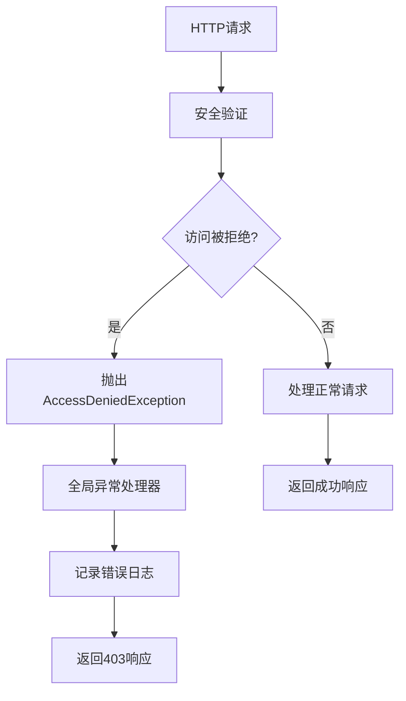

# 防盗链与请求验证

<cite>
**本文档引用的文件**
- [SecurityUtils.java](file://src/main/java/com/photo/util/SecurityUtils.java)
- [SecurityProperties.java](file://src/main/java/com/photo/config/SecurityProperties.java)
- [PhotoController.java](file://src/main/java/com/photo/controller/PhotoController.java)
- [application.yml](file://src/main/resources/application.yml)
- [SecurityUtilsTest.java](file://src/test/java/com/photo/util/SecurityUtilsTest.java)
- [AccessDeniedException.java](file://src/main/java/com/photo/exception/AccessDeniedException.java)
- [GlobalExceptionHandler.java](file://src/main/java/com/photo/exception/GlobalExceptionHandler.java)
</cite>

## 目录
1. [简介](#简介)
2. [防盗链机制](#防盗链机制)
3. [请求验证组件](#请求验证组件)
4. [配置管理](#配置管理)
5. [控制器集成](#控制器集成)
6. [测试覆盖](#测试覆盖)
7. [Nginx反向代理配置](#nginx反向代理配置)
8. [最佳实践](#最佳实践)
9. [故障排除](#故障排除)

## 简介

本系统实现了多层次的安全验证机制，主要包含防盗链（Referer验证）、客户端IP地址获取、User-Agent验证等功能。这些安全措施有效防止了资源被第三方网站盗用，并确保只有授权的客户端能够访问受保护的资源。

## 防盗链机制

### validateReferer方法工作原理

防盗链功能通过`SecurityUtils.validateReferer`方法实现，该方法检查HTTP请求中的Referer头，确保请求来自允许的域名。



**图表来源**
- [SecurityUtils.java](file://src/main/java/com/photo/util/SecurityUtils.java#L58-L75)

#### 核心验证逻辑

1. **Referer头检查**：首先检查请求是否包含Referer头
2. **域名匹配算法**：使用简单的字符串包含匹配（`referer.contains(domain)`）
3. **默认行为**：当没有Referer头时，默认允许访问
4. **日志记录**：对非法Referer进行警告日志记录

#### allowedDomains配置项

allowedDomains配置项定义了允许访问的域名白名单，支持以下配置方式：

| 配置项 | 类型 | 默认值 | 描述 |
|--------|------|--------|------|
| enabled | Boolean | true | 是否启用防盗链功能 |
| allowedDomains | List<String> | [] | 允许的域名列表 |

**章节来源**
- [SecurityProperties.java](file://src/main/java/com/photo/config/SecurityProperties.java#L25-L27)
- [application.yml](file://src/main/resources/application.yml#L104-L107)

## 请求验证组件

### getClientIpAddress方法

该方法从多个代理头中提取真实的客户端IP地址，支持多层代理环境。



**图表来源**
- [SecurityUtils.java](file://src/main/java/com/photo/util/SecurityUtils.java#L25-L50)

#### 支持的代理头顺序

系统按以下优先级顺序检查代理头：

1. `X-Forwarded-For`
2. `Proxy-Client-IP`
3. `WL-Proxy-Client-IP`
4. `HTTP_X_FORWARDED_FOR`
5. `HTTP_X_FORWARDED`
6. `HTTP_X_CLUSTER_CLIENT_IP`
7. `HTTP_CLIENT_IP`
8. `HTTP_FORWARDED_FOR`
9. `HTTP_FORWARDED`
10. `HTTP_VIA`
11. `REMOTE_ADDR`

### isValidUserAgent方法

User-Agent验证提供了基本的请求合法性检查：



**图表来源**
- [SecurityUtils.java](file://src/main/java/com/photo/util/SecurityUtils.java#L77-L90)

**章节来源**
- [SecurityUtils.java](file://src/main/java/com/photo/util/SecurityUtils.java#L25-L90)

## 配置管理

### SecurityProperties配置类

系统通过`SecurityProperties`类统一管理安全配置：



**图表来源**
- [SecurityProperties.java](file://src/main/java/com/photo/config/SecurityProperties.java#L12-L52)

### application.yml配置示例

关键配置项说明：

| 配置路径 | 值 | 说明 |
|----------|-----|------|
| security.referer.enabled | true | 启用防盗链功能 |
| security.referer.allowed-domains | ["localhost", "127.0.0.1"] | 允许的域名列表 |
| security.token.secret | "your-secret-key-change-this-in-production" | Token加密密钥 |
| security.token.expiration | 86400 | Token过期时间（秒） |
| security.cors.enabled | true | 启用CORS跨域 |
| security.cors.allowed-origins | ["http://localhost:3000", "http://localhost:8080"] | 允许的CORS源 |

**章节来源**
- [SecurityProperties.java](file://src/main/java/com/photo/config/SecurityProperties.java#L12-L52)
- [application.yml](file://src/main/resources/application.yml#L104-L120)

## 控制器集成

### PhotoController中的安全验证

在`PhotoController`中，防盗链验证主要应用于图片预览和下载接口：

```mermaid
sequenceDiagram
participant Client as 客户端
participant Controller as PhotoController
participant SecurityUtils as SecurityUtils
participant Properties as SecurityProperties
participant ExceptionHandler as 异常处理器
Client->>Controller : GET /photos/view/{filename}
Controller->>Properties : 获取防盗链配置
Properties-->>Controller : enabled, allowedDomains
Controller->>SecurityUtils : validateReferer(request, domains)
SecurityUtils->>SecurityUtils : 检查Referer头
SecurityUtils->>SecurityUtils : 匹配域名
alt 验证成功
SecurityUtils-->>Controller : true
Controller->>Controller : 处理正常请求
Controller-->>Client : 返回图片数据
else 验证失败
SecurityUtils-->>Controller : false
Controller->>ExceptionHandler : 抛出AccessDeniedException
ExceptionHandler-->>Client : 403 Forbidden响应
end
```

**图表来源**
- [PhotoController.java](file://src/main/java/com/photo/controller/PhotoController.java#L95-L105)

### 异常处理机制

系统通过全局异常处理器统一处理访问拒绝异常：



**图表来源**
- [GlobalExceptionHandler.java](file://src/main/java/com/photo/exception/GlobalExceptionHandler.java#L75-L82)

**章节来源**
- [PhotoController.java](file://src/main/java/com/photo/controller/PhotoController.java#L95-L105)
- [GlobalExceptionHandler.java](file://src/main/java/com/photo/exception/GlobalExceptionHandler.java#L75-L82)

## 测试覆盖

### SecurityUtilsTest测试用例

系统提供了全面的单元测试覆盖：

| 测试方法 | 验证内容 | 测试场景 |
|----------|----------|----------|
| testValidateReferer_ValidDomain | 正确域名验证 | Referer包含允许域名 |
| testValidateReferer_InvalidDomain | 错误域名验证 | Referer包含不允许域名 |
| testValidateReferer_NoReferer | 无Referer处理 | 没有Referer头的情况 |
| testGetClientIpAddress | IP地址获取 | 多种代理头组合 |
| testGetClientIpAddress_WithXForwardedFor | X-Forwarded-For处理 | 多个IP地址的情况 |
| testCheckFileAccess_PublicFile | 公开文件访问 | 公开文件的访问权限 |
| testCheckFileAccess_Owner | 所有者访问 | 文件所有者的访问权限 |
| testCheckFileAccess_NotOwner | 非所有者访问 | 非所有者的访问权限 |

**章节来源**
- [SecurityUtilsTest.java](file://src/test/java/com/photo/util/SecurityUtilsTest.java#L50-L85)

## Nginx反向代理配置

### Referer验证注意事项

在Nginx反向代理环境中使用防盗链功能时需要注意以下事项：

#### 1. 代理头传递配置

```nginx
location /api/ {
    proxy_pass http://localhost:8080;
    proxy_set_header Host $host;
    proxy_set_header X-Real-IP $remote_addr;
    proxy_set_header X-Forwarded-For $proxy_add_x_forwarded_for;
    proxy_set_header Referer $http_referer;
}
```

#### 2. 防止Referer丢失

确保Nginx正确传递Referer头，避免因代理设置导致Referer信息丢失。

#### 3. CORS配置建议

```nginx
add_header Access-Control-Allow-Origin "http://localhost:3000";
add_header Access-Control-Allow-Methods "GET, POST, OPTIONS";
add_header Access-Control-Allow-Headers "Content-Type, Authorization";
add_header Access-Control-Allow-Credentials "true";
```

#### 4. 安全头配置

```nginx
add_header X-Frame-Options "DENY";
add_header X-Content-Type-Options "nosniff";
add_header X-XSS-Protection "1; mode=block";
```

### 生产环境配置建议

1. **域名白名单**：在生产环境中严格限制allowedDomains
2. **日志监控**：监控非法Referer访问的日志
3. **定期审查**：定期审查allowedDomains配置
4. **性能优化**：考虑缓存域名匹配结果

## 最佳实践

### 1. 防盗链配置最佳实践

- **开发环境**：允许本地域名和IP地址
- **测试环境**：允许测试域名
- **生产环境**：仅允许正式域名

### 2. IP地址获取最佳实践

- **代理层级**：了解代理层级结构
- **安全性**：验证IP地址格式
- **日志记录**：记录真实IP用于审计

### 3. User-Agent验证最佳实践

- **灵活性**：保持User-Agent验证的灵活性
- **兼容性**：考虑移动设备和爬虫的User-Agent
- **监控**：监控异常User-Agent模式

### 4. 性能优化建议

- **缓存策略**：缓存域名匹配结果
- **异步处理**：对于高并发场景考虑异步验证
- **资源限制**：限制验证操作的资源消耗

## 故障排除

### 常见问题及解决方案

#### 1. 防盗链验证失败

**症状**：合法域名也被拒绝访问
**原因**：域名匹配逻辑过于严格
**解决方案**：
- 检查allowedDomains配置
- 验证域名格式是否正确
- 考虑使用更灵活的匹配策略

#### 2. IP地址获取不准确

**症状**：获取到的IP地址不是真实客户端IP
**原因**：代理头顺序或格式问题
**解决方案**：
- 检查代理头配置
- 验证代理服务器设置
- 使用调试模式查看代理头内容

#### 3. User-Agent验证问题

**症状**：合法请求被拒绝
**原因**：User-Agent头缺失或格式异常
**解决方案**：
- 检查客户端User-Agent发送
- 考虑放宽验证规则
- 添加User-Agent白名单

#### 4. Nginx代理问题

**症状**：Referer验证在代理后失效
**原因**：代理头未正确传递
**解决方案**：
- 检查Nginx配置
- 确保Referer头正确传递
- 验证代理层级设置

### 调试技巧

1. **启用DEBUG日志**：在application.yml中设置日志级别
2. **使用Mock测试**：编写单元测试验证各种场景
3. **监控指标**：监控安全验证的成功率和失败率
4. **访问日志**：分析访问日志识别潜在问题

**章节来源**
- [SecurityUtils.java](file://src/main/java/com/photo/util/SecurityUtils.java#L58-L90)
- [application.yml](file://src/main/resources/application.yml#L121-L135)