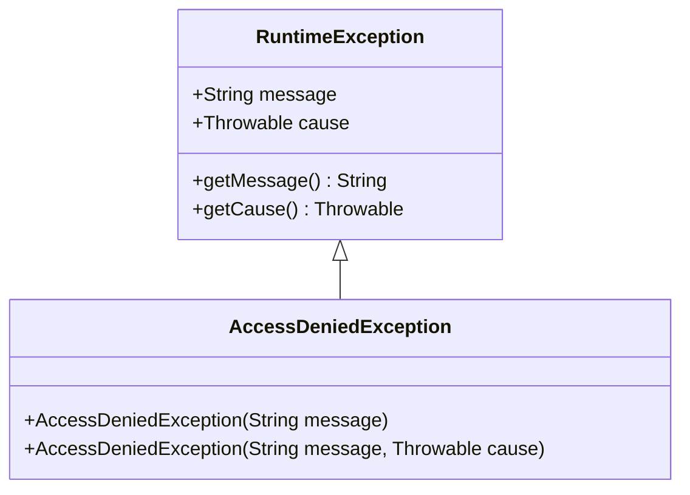
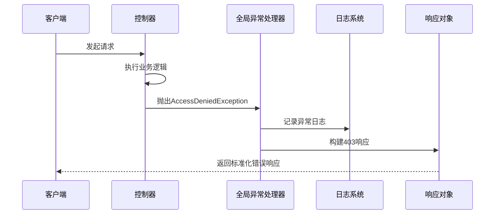
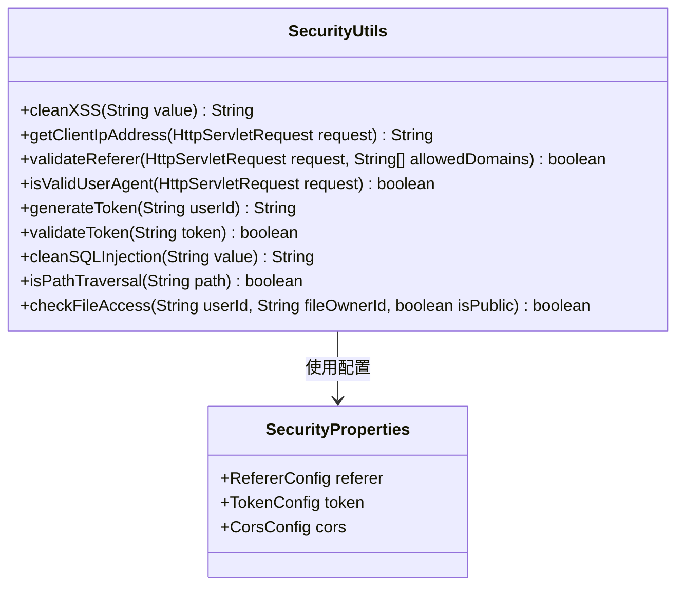
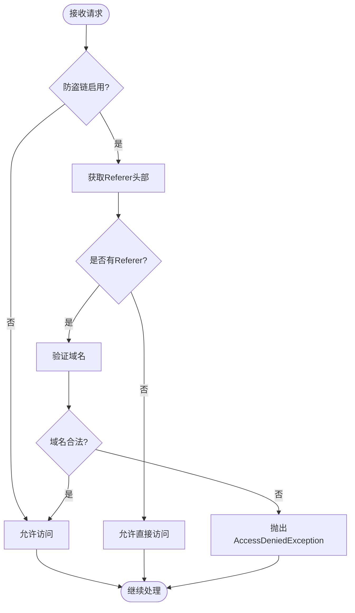
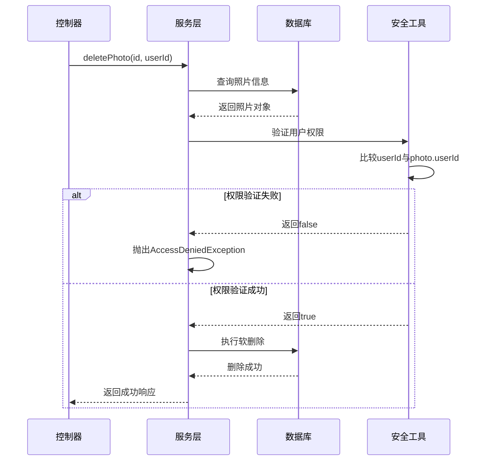
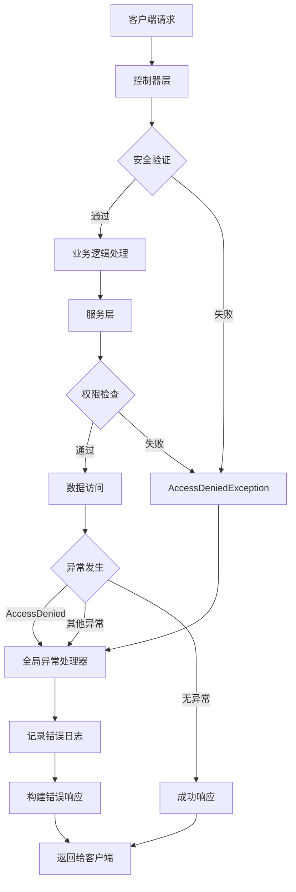
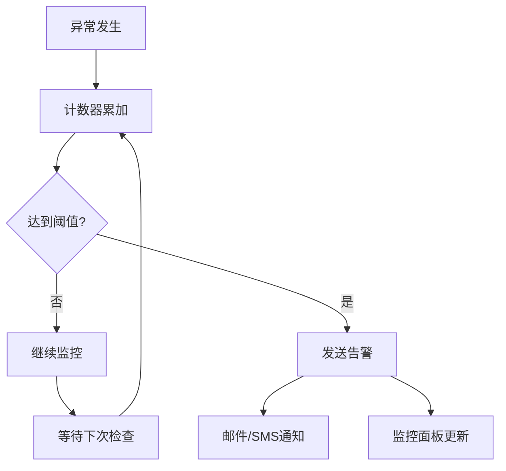

# 安全相关异常处理

<cite>
**本文档引用的文件**
- [AccessDeniedException.java](file://src/main/java/com/photo/exception/AccessDeniedException.java)
- [GlobalExceptionHandler.java](file://src/main/java/com/photo/exception/GlobalExceptionHandler.java)
- [SecurityUtils.java](file://src/main/java/com/photo/util/SecurityUtils.java)
- [PhotoController.java](file://src/main/java/com/photo/controller/PhotoController.java)
- [PhotoService.java](file://src/main/java/com/photo/service/PhotoService.java)
- [SecurityConfig.java](file://src/main/java/com/photo/config/SecurityConfig.java)
- [SecurityProperties.java](file://src/main/java/com/photo/config/SecurityProperties.java)
- [ApiResponse.java](file://src/main/java/com/photo/dto/ApiResponse.java)
- [application.yml](file://src/main/resources/application.yml)
- [SecurityUtilsTest.java](file://src/test/java/com/photo/util/SecurityUtilsTest.java)
- [PhotoServiceTest.java](file://src/test/java/com/photo/service/PhotoServiceTest.java)
</cite>

## 目录
1. [概述](#概述)
2. [AccessDeniedException异常类型](#accessdeniedexception异常类型)
3. [全局异常处理器](#全局异常处理器)
4. [安全工具类](#安全工具类)
5. [控制器层安全检查](#控制器层安全检查)
6. [服务层权限验证](#服务层权限验证)
7. [异常处理流程](#异常处理流程)
8. [日志分析与监控](#日志分析与监控)
9. [生产环境优化建议](#生产环境优化建议)
10. [最佳实践](#最佳实践)

## 概述

本系统采用多层次的安全异常处理机制，通过专门的异常类型、全局异常处理器和安全工具类，构建了一个完整的安全防护体系。主要特点包括：

- **专门的访问拒绝异常**：针对非法访问场景设计的专用异常类型
- **统一异常处理**：通过全局异常处理器提供标准化的错误响应
- **多层安全验证**：从控制器到服务层的全方位权限检查
- **实时日志记录**：详细的异常日志便于安全事件追踪
- **灵活的配置管理**：支持动态调整安全策略

## AccessDeniedException异常类型

### 异常定义与特性

AccessDeniedException是系统中专门用于处理访问拒绝场景的自定义异常类，继承自RuntimeException，具有以下特征：



**图表来源**
- [AccessDeniedException.java](file://src/main/java/com/photo/exception/AccessDeniedException.java#L6-L15)

### 触发场景分析

系统中AccessDeniedException主要在以下场景被触发：

#### 1. 文件访问权限验证
当用户尝试访问非公开文件时，SecurityUtils的checkFileAccess方法会抛出此异常：

**触发路径**：
- SecurityUtils.checkFileAccess() → 返回false → 抛出AccessDeniedException
- 场景：非文件所有者尝试访问私有文件

#### 2. 防盗链检查失败
PhotoController中的viewPhoto方法会进行Referer验证：

**触发路径**：
- PhotoController.viewPhoto() → SecurityUtils.validateReferer() → 返回false → 抛出AccessDeniedException
- 场景：来自非法域名的直接访问

#### 3. 权限验证失败
PhotoService中的删除操作需要验证用户权限：

**触发路径**：
- PhotoService.deletePhoto() → 验证userId与photo.userId → 不匹配 → 抛出AccessDeniedException
- 场景：用户尝试删除不属于自己的照片

**章节来源**
- [AccessDeniedException.java](file://src/main/java/com/photo/exception/AccessDeniedException.java#L1-L16)
- [SecurityUtils.java](file://src/main/java/com/photo/util/SecurityUtils.java#L150-L165)
- [PhotoController.java](file://src/main/java/com/photo/controller/PhotoController.java#L94-L96)
- [PhotoService.java](file://src/main/java/com/photo/service/PhotoService.java#L198-L201)

## 全局异常处理器

### 处理器架构

GlobalExceptionHandler作为Spring MVC的全局异常处理器，负责统一捕获和处理系统中的各种异常，特别是AccessDeniedException：



**图表来源**
- [GlobalExceptionHandler.java](file://src/main/java/com/photo/exception/GlobalExceptionHandler.java#L81-L87)

### AccessDeniedException处理流程

当系统捕获到AccessDeniedException时，处理流程如下：

1. **异常捕获**：@ExceptionHandler注解识别AccessDeniedException
2. **日志记录**：使用SLF4J记录详细的错误信息
3. **状态码设置**：返回HTTP 403 Forbidden状态码
4. **响应构建**：使用ApiResponse构建标准化的错误响应

### 响应格式规范

系统使用统一的API响应格式，AccessDeniedException的响应结构：

| 字段 | 类型 | 描述 | 示例值 |
|------|------|------|--------|
| code | Integer | HTTP状态码 | 403 |
| message | String | 错误描述信息 | "无权删除该照片" |
| data | Null | 数据字段 | null |
| timestamp | Long | 时间戳 | 1640995200000 |

**章节来源**
- [GlobalExceptionHandler.java](file://src/main/java/com/photo/exception/GlobalExceptionHandler.java#L81-L87)
- [ApiResponse.java](file://src/main/java/com/photo/dto/ApiResponse.java#L58-L61)

## 安全工具类

### 核心安全功能

SecurityUtils提供了多种安全防护功能，为系统提供基础的安全保障：



**图表来源**
- [SecurityUtils.java](file://src/main/java/com/photo/util/SecurityUtils.java#L14-L167)
- [SecurityProperties.java](file://src/main/java/com/photo/config/SecurityProperties.java#L12-L52)

### 文件访问权限验证

checkFileAccess方法是系统权限控制的核心组件：

**验证逻辑**：
1. **公开文件检查**：如果文件为公开状态，允许访问
2. **所有者验证**：如果当前用户是文件所有者，允许访问  
3. **权限拒绝**：其他情况下拒绝访问并记录警告日志

**章节来源**
- [SecurityUtils.java](file://src/main/java/com/photo/util/SecurityUtils.java#L150-L165)

## 控制器层安全检查

### 防盗链机制

PhotoController实现了基于Referer头部的防盗链保护：



**图表来源**
- [PhotoController.java](file://src/main/java/com/photo/controller/PhotoController.java#L92-L96)

### IP地址获取

SecurityUtils.getClientIpAddress方法提供了可靠的客户端IP地址获取机制，支持多种代理头：

**支持的代理头**：
- X-Forwarded-For
- Proxy-Client-IP  
- WL-Proxy-Client-IP
- HTTP_X_FORWARDED_FOR
- HTTP_X_FORWARDED
- HTTP_X_CLUSTER_CLIENT_IP
- HTTP_CLIENT_IP
- HTTP_FORWARDED_FOR
- HTTP_FORWARDED
- HTTP_VIA
- REMOTE_ADDR

**章节来源**
- [PhotoController.java](file://src/main/java/com/photo/controller/PhotoController.java#L92-L96)
- [SecurityUtils.java](file://src/main/java/com/photo/util/SecurityUtils.java#L30-L57)

## 服务层权限验证

### 删除操作权限检查

PhotoService中的deletePhoto和permanentlyDeletePhoto方法实现了严格的权限验证：



**图表来源**
- [PhotoService.java](file://src/main/java/com/photo/service/PhotoService.java#L192-L205)

### 权限验证规则

服务层的权限验证遵循以下原则：

1. **所有权验证**：只有照片的所有者才能删除
2. **异常抛出**：权限验证失败时立即抛出AccessDeniedException
3. **事务保证**：删除操作在事务中执行，确保数据一致性

**章节来源**
- [PhotoService.java](file://src/main/java/com/photo/service/PhotoService.java#L192-L234)

## 异常处理流程

### 完整处理链路

系统中的异常处理形成了一个完整的处理链路：



**图表来源**
- [GlobalExceptionHandler.java](file://src/main/java/com/photo/exception/GlobalExceptionHandler.java#L81-L87)
- [PhotoController.java](file://src/main/java/com/photo/controller/PhotoController.java#L92-L96)
- [PhotoService.java](file://src/main/java/com/photo/service/PhotoService.java#L198-L201)

### 异常分类处理

系统对不同类型的异常采用不同的处理策略：

| 异常类型 | HTTP状态码 | 处理方式 | 日志级别 |
|----------|------------|----------|----------|
| AccessDeniedException | 403 | 统一处理，记录警告 | WARN |
| FileNotFoundException | 404 | 标准化错误响应 | ERROR |
| FileSizeException | 400 | 参数验证错误 | ERROR |
| FileStorageException | 500 | 内部服务器错误 | ERROR |

**章节来源**
- [GlobalExceptionHandler.java](file://src/main/java/com/photo/exception/GlobalExceptionHandler.java#L26-L138)

## 日志分析与监控

### 异常日志结构

系统为AccessDeniedException生成的标准日志格式：

```
2024-01-15 10:30:45 [http-nio-8080-exec-1] WARN  c.p.u.SecurityUtils - 用户user1尝试访问非公开文件，所有者为user2
2024-01-15 10:30:45 [http-nio-8080-exec-1] ERROR c.p.e.GlobalExceptionHandler - 访问拒绝: 无权删除该照片
```

### 关键日志字段

每个AccessDeniedException都会记录以下关键信息：

1. **时间戳**：精确到毫秒的时间信息
2. **线程信息**：请求所在的线程标识
3. **用户标识**：尝试访问的用户ID
4. **目标资源**：被访问的文件或操作
5. **IP地址**：客户端的真实IP地址
6. **请求路径**：触发异常的具体URL路径

### 监控指标

建议在生产环境中监控以下指标：

- **异常频率**：AccessDeniedException的发生频率
- **用户分布**：哪些用户经常触发权限异常
- **时间模式**：异常发生的时间规律
- **来源分析**：来自哪些IP或域名的异常

**章节来源**
- [GlobalExceptionHandler.java](file://src/main/java/com/photo/exception/GlobalExceptionHandler.java#L83-L84)
- [SecurityUtils.java](file://src/main/java/com/photo/util/SecurityUtils.java#L163-L164)

## 生产环境优化建议

### 增强异常处理机制

#### 1. 告警通知系统

建议集成告警通知机制，在检测到频繁的AccessDeniedException时发送告警：



#### 2. 详细的审计日志

在现有日志基础上增加更多上下文信息：

- **用户会话信息**：用户的登录状态和角色
- **请求上下文**：完整的请求头和参数
- **操作轨迹**：用户的历史操作记录
- **风险评估**：基于行为模式的风险评分

#### 3. 动态权限控制

实现基于用户行为的动态权限调整：

- **行为分析**：分析用户的正常访问模式
- **异常检测**：识别可疑的访问行为
- **权限调整**：自动调整用户的访问权限
- **人工审核**：对高风险行为进行人工审核

### 性能优化建议

#### 1. 缓存策略

- **权限缓存**：缓存用户的权限信息
- **配置缓存**：缓存安全配置信息
- **IP白名单缓存**：缓存可信IP地址

#### 2. 异步处理

- **日志异步**：使用异步方式记录异常日志
- **告警异步**：异步发送告警通知
- **统计异步**：异步更新监控指标

#### 3. 资源优化

- **连接池优化**：优化数据库连接池配置
- **内存管理**：合理配置JVM内存参数
- **网络优化**：优化网络连接配置

## 最佳实践

### 开发阶段最佳实践

#### 1. 异常设计原则

- **语义明确**：异常名称要准确反映问题类型
- **信息丰富**：异常消息包含足够的上下文信息
- **层次清晰**：建立清晰的异常继承层次
- **易于处理**：便于调用方理解和处理

#### 2. 安全编码规范

- **输入验证**：对所有外部输入进行严格验证
- **权限最小化**：遵循最小权限原则
- **防御性编程**：假设所有外部输入都不可信
- **日志记录**：记录必要的安全相关信息

#### 3. 测试策略

- **单元测试**：为每个安全检查点编写单元测试
- **集成测试**：测试整个安全流程
- **压力测试**：测试高并发下的安全性能
- **渗透测试**：模拟攻击检测安全漏洞

### 运维阶段最佳实践

#### 1. 监控告警

- **实时监控**：实时监控安全异常的发生
- **趋势分析**：分析安全事件的趋势变化
- **关联分析**：关联分析不同类型的安全事件
- **智能告警**：基于机器学习的智能告警

#### 2. 应急响应

- **预案制定**：制定详细的安全应急响应预案
- **快速响应**：建立快速响应机制
- **影响评估**：评估安全事件的影响范围
- **恢复计划**：制定系统恢复计划

#### 3. 持续改进

- **安全审计**：定期进行安全审计和评估
- **漏洞修复**：及时修复发现的安全漏洞
- **策略优化**：根据实际情况优化安全策略
- **培训教育**：定期进行安全培训和教育

### 配置管理最佳实践

#### 1. 环境隔离

- **开发环境**：宽松的安全策略
- **测试环境**：接近生产环境的安全配置
- **生产环境**：严格的安全策略和监控

#### 2. 配置版本控制

- **配置文件版本化**：使用Git等工具版本化配置文件
- **变更审批**：重要的安全配置变更需要审批
- **回滚机制**：建立配置回滚机制
- **配置审计**：审计配置变更的历史记录

#### 3. 动态配置

- **配置热更新**：支持运行时更新安全配置
- **灰度发布**：新配置的灰度发布机制
- **配置验证**：配置变更前的验证机制
- **配置备份**：定期备份安全配置

通过以上全面的安全异常处理机制，系统能够有效防范各种安全威胁，保护用户数据和系统资源的安全。在实际部署时，建议根据具体的业务需求和安全要求，进一步细化和完善这些机制。