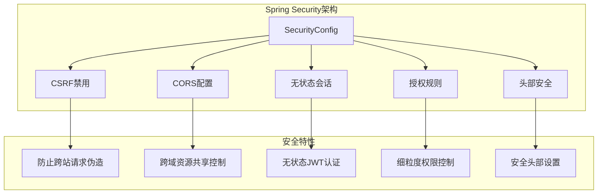
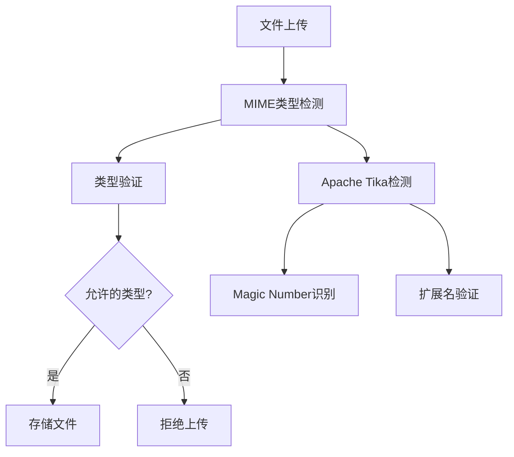
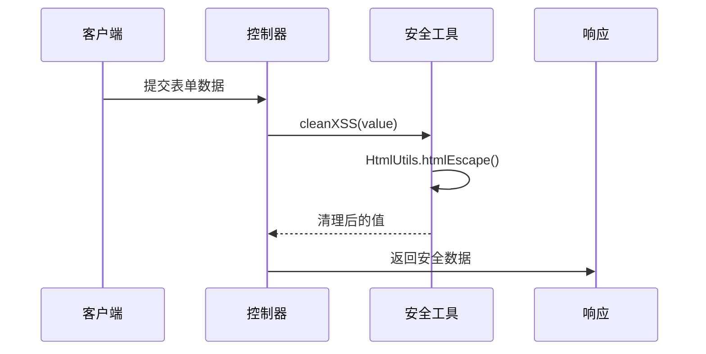
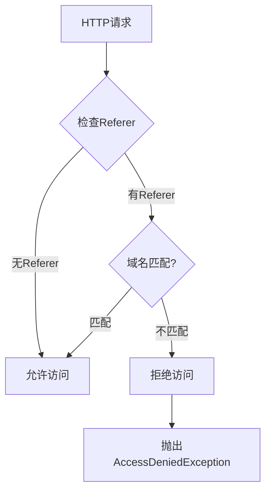
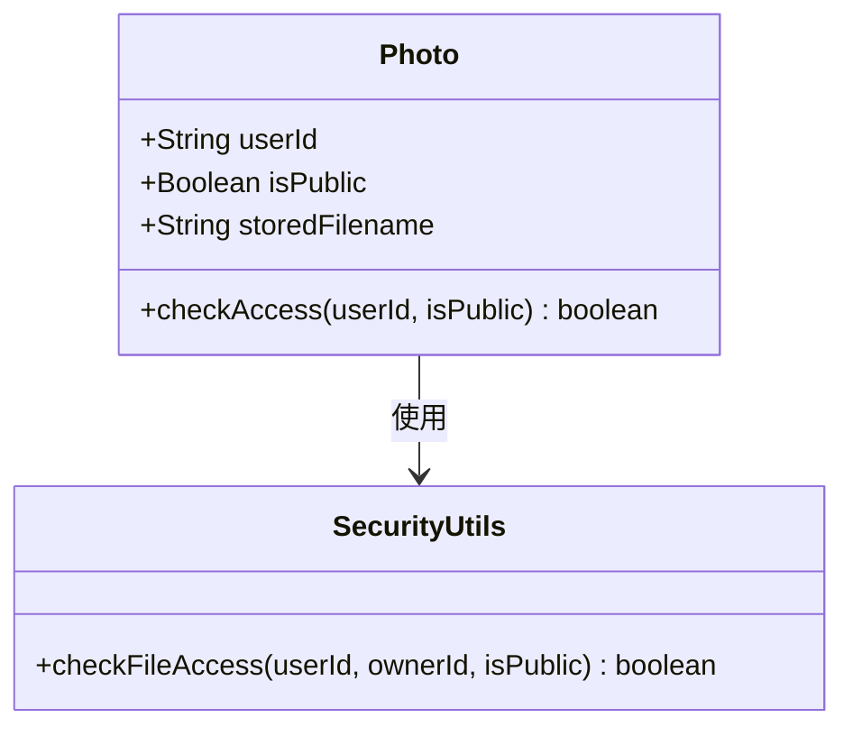
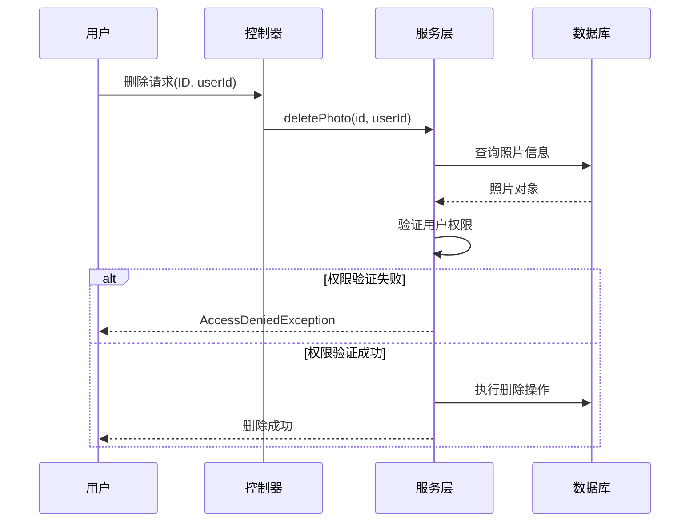
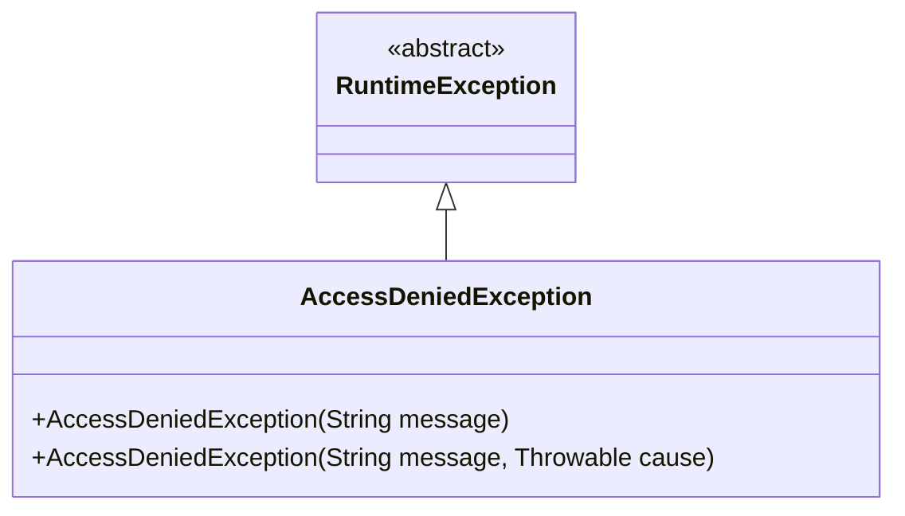
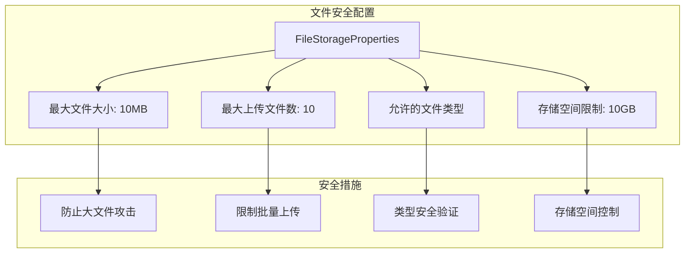

# 安全考虑

<cite>
**本文档引用的文件**
- [SecurityConfig.java](file://src/main/java/com/photo/config/SecurityConfig.java)
- [SecurityProperties.java](file://src/main/java/com/photo/config/SecurityProperties.java)
- [PhotoController.java](file://src/main/java/com/photo/controller/PhotoController.java)
- [FileStorageService.java](file://src/main/java/com/photo/service/FileStorageService.java)
- [FileUtils.java](file://src/main/java/com/photo/util/FileUtils.java)
- [SecurityUtils.java](file://src/main/java/com/photo/util/SecurityUtils.java)
- [AccessDeniedException.java](file://src/main/java/com/photo/exception/AccessDeniedException.java)
- [FileStorageProperties.java](file://src/main/java/com/photo/config/FileStorageProperties.java)
- [application.yml](file://src/main/resources/application.yml)
- [PhotoService.java](file://src/main/java/com/photo/service/PhotoService.java)
- [Photo.java](file://src/main/java/com/photo/entity/Photo.java)
- [GlobalExceptionHandler.java](file://src/main/java/com/photo/exception/GlobalExceptionHandler.java)
</cite>

## 目录
1. [概述](#概述)
2. [Spring Security集成](#spring-security集成)
3. [文件安全防护](#文件安全防护)
4. [防盗链机制](#防盗链机制)
5. [访问权限控制](#访问权限控制)
6. [异常处理与安全](#异常处理与安全)
7. [安全配置最佳实践](#安全配置最佳实践)
8. [生产环境加固建议](#生产环境加固建议)
9. [安全编码实践](#安全编码实践)
10. [总结](#总结)

## 概述

本应用采用多层次的安全防护机制，涵盖文件上传、存储、访问控制和异常处理等各个环节。系统通过Spring Security框架提供基础安全保护，结合自定义安全工具类实现专门针对文件操作的安全防护措施。

## Spring Security集成

### 基础安全配置

应用集成了Spring Security框架，提供了以下核心安全特性：



**图表来源**
- [SecurityConfig.java](file://src/main/java/com/photo/config/SecurityConfig.java#L27-L48)

### 安全配置详解

系统采用无状态认证模式，主要配置特点：

- **CSRF保护禁用**：由于是RESTful API，禁用CSRF保护以提高兼容性
- **CORS配置**：支持跨域请求，可配置允许的域名、方法和头部
- **无状态会话**：使用STATELESS会话策略，适合API服务
- **授权规则**：对特定端点（如Swagger、H2控制台）开放访问

**章节来源**
- [SecurityConfig.java](file://src/main/java/com/photo/config/SecurityConfig.java#L27-L48)

## 文件安全防护

### MIME类型深度检测

系统使用Apache Tika库进行文件类型检测，确保文件的真实类型：



**图表来源**
- [FileUtils.java](file://src/main/java/com/photo/util/FileUtils.java#L75-L78)
- [FileUtils.java](file://src/main/java/com/photo/util/FileUtils.java#L56-L70)

### 文件名清理机制

系统实现了多重文件名安全检查：

| 安全措施 | 实现方式 | 目标 |
|---------|---------|------|
| 路径遍历防护 | 检查`..`、`/`、`\`字符 | 防止目录遍历攻击 |
| 字符过滤 | 移除非字母数字字符 | 防止特殊字符注入 |
| 扩展名验证 | 白名单扩展名检查 | 确保文件类型一致性 |
| UUID重命名 | 生成唯一文件名 | 避免文件覆盖和路径冲突 |

**章节来源**
- [FileUtils.java](file://src/main/java/com/photo/util/FileUtils.java#L156-L176)
- [FileStorageService.java](file://src/main/java/com/photo/service/FileStorageService.java#L60-L82)

### XSS防护机制

应用在多个层面实施XSS防护：



**图表来源**
- [SecurityUtils.java](file://src/main/java/com/photo/util/SecurityUtils.java#L20-L25)

**章节来源**
- [SecurityUtils.java](file://src/main/java/com/photo/util/SecurityUtils.java#L20-L25)

## 防盗链机制

### Referer验证实现

系统实现了基于Referer头部的防盗链功能：



**图表来源**
- [SecurityUtils.java](file://src/main/java/com/photo/util/SecurityUtils.java#L62-L78)
- [PhotoController.java](file://src/main/java/com/photo/controller/PhotoController.java#L92-L96)

### 配置管理

防盗链功能可通过配置文件灵活控制：

| 配置项 | 默认值 | 说明 |
|-------|--------|------|
| `security.referer.enabled` | true | 启用防盗链功能 |
| `security.referer.allowed-domains` | localhost, 127.0.0.1 | 允许的域名列表 |

**章节来源**
- [SecurityProperties.java](file://src/main/java/com/photo/config/SecurityProperties.java#L34-L36)
- [application.yml](file://src/main/resources/application.yml#L103-L107)

## 访问权限控制

### 公开/私有照片区分

系统通过`isPublic`字段实现照片的公开/私有访问控制：



**图表来源**
- [Photo.java](file://src/main/java/com/photo/entity/Photo.java#L117-L119)
- [SecurityUtils.java](file://src/main/java/com/photo/util/SecurityUtils.java#L150-L165)

### 用户所有权验证

删除操作实现了严格的用户所有权验证：



**图表来源**
- [PhotoService.java](file://src/main/java/com/photo/service/PhotoService.java#L198-L200)
- [PhotoService.java](file://src/main/java/com/photo/service/PhotoService.java#L216-L218)

**章节来源**
- [PhotoService.java](file://src/main/java/com/photo/service/PhotoService.java#L198-L200)
- [PhotoService.java](file://src/main/java/com/photo/service/PhotoService.java#L216-L218)

## 异常处理与安全

### 安全相关异常

系统定义了专门的安全异常类型：



**图表来源**
- [AccessDeniedException.java](file://src/main/java/com/photo/exception/AccessDeniedException.java#L6-L15)

### 异常处理策略

全局异常处理器对安全相关异常进行统一处理：

| 异常类型 | HTTP状态码 | 错误信息 |
|---------|-----------|----------|
| AccessDeniedException | 403 | 访问被拒绝 |
| FileTypeException | 400 | 文件类型错误 |
| FileSizeException | 400 | 文件大小超限 |
| StorageFullException | 507 | 存储空间不足 |

**章节来源**
- [GlobalExceptionHandler.java](file://src/main/java/com/photo/exception/GlobalExceptionHandler.java#L81-L87)
- [GlobalExceptionHandler.java](file://src/main/java/com/photo/exception/GlobalExceptionHandler.java#L26-L32)

## 安全配置最佳实践

### 文件存储配置

系统提供了全面的文件存储安全配置：



**图表来源**
- [FileStorageProperties.java](file://src/main/java/com/photo/config/FileStorageProperties.java#L44-L66)

### 目录结构安全

文件存储采用分离的目录结构：

| 目录类型 | 用途 | 安全考虑 |
|---------|------|----------|
| `basePath` | 原始文件存储 | 严格路径验证 |
| `tempPath` | 临时文件 | 自动清理机制 |
| `thumbnailPath` | 缩略图缓存 | 访问权限控制 |

**章节来源**
- [FileStorageProperties.java](file://src/main/java/com/photo/config/FileStorageProperties.java#L20-L30)
- [FileStorageService.java](file://src/main/java/com/photo/service/FileStorageService.java#L38-L53)

## 生产环境加固建议

### HTTPS强制启用

建议在生产环境中强制启用HTTPS：

```yaml
# application-prod.yml
server:
  ssl:
    enabled: true
    key-store: classpath:keystore.jks
    key-store-password: changeit
    key-alias: springboot
  port: 443
```

### JWT认证增强

建议替换当前简单的Token机制为JWT：

```java
// JWT配置示例
@Bean
public JwtDecoder jwtDecoder() {
    return NimbusJwtDecoder.withSecretKey(secretKey)
        .macAlgorithm(MacAlgorithm.HS512)
        .build();
}
```

### 更严格的CORS配置

生产环境应限制CORS配置：

```yaml
security:
  cors:
    enabled: true
    allowed-origins:
      - https://yourdomain.com
      - https://www.yourdomain.com
    allowed-methods: GET,POST,PUT,DELETE
    allowed-headers: Content-Type,Authorization
    allow-credentials: false
```

### 安全日志监控

建议添加安全事件的日志监控：

```java
@Slf4j
@Component
public class SecurityEventLogger {
    
    @EventListener
    public void handleSecurityEvent(SecurityEvent event) {
        log.warn("安全事件: {} - {}", event.getType(), event.getDescription());
    }
}
```

## 安全编码实践

### 输入验证最佳实践

1. **文件类型验证**：使用Apache Tika进行深度MIME检测
2. **文件大小限制**：双重限制（内存阈值+总大小）
3. **文件名清理**：移除危险字符和路径遍历序列
4. **用户输入过滤**：使用Spring Security的HTML转义

### 权限控制原则

1. **最小权限原则**：默认拒绝，明确授权
2. **资源所有权验证**：每个操作都验证用户权限
3. **软删除机制**：保留审计轨迹
4. **访问日志记录**：记录所有敏感操作

### 错误处理安全

1. **信息泄露防护**：避免暴露系统内部信息
2. **统一异常处理**：集中处理安全相关异常
3. **错误信息脱敏**：向客户端返回通用错误信息

## 总结

本应用构建了完整的多层安全防护体系：

1. **基础安全**：通过Spring Security提供身份认证和授权
2. **文件安全**：实现MIME类型检测、文件名清理和XSS防护
3. **访问控制**：基于用户所有权的精细化权限管理
4. **异常处理**：统一的安全异常处理机制
5. **配置管理**：灵活的安全配置选项

这些安全措施有效防护了常见的Web应用攻击，包括文件上传漏洞、路径遍历攻击、XSS攻击和未授权访问等。建议在生产环境中进一步强化HTTPS、JWT认证和日志监控等安全措施，以构建更加完善的安全防护体系。