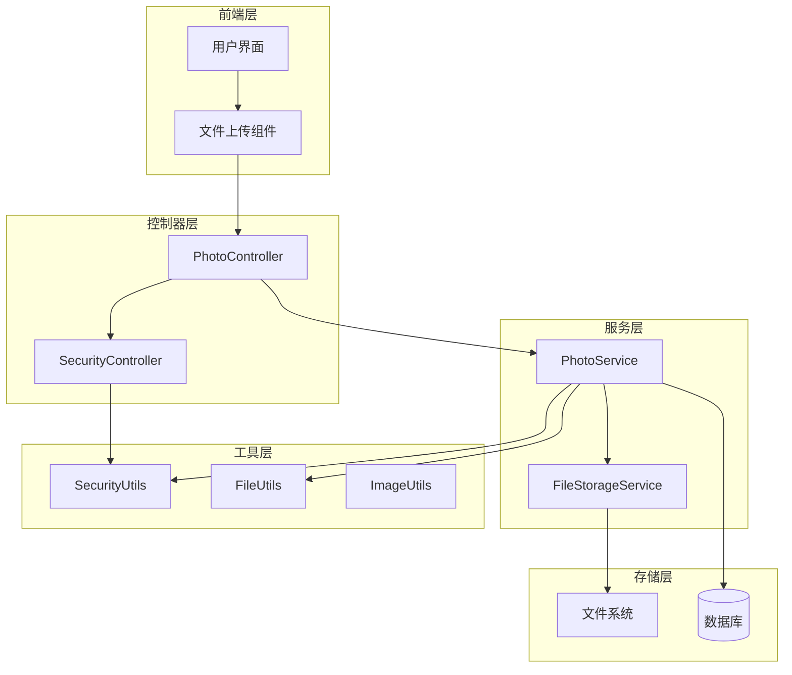
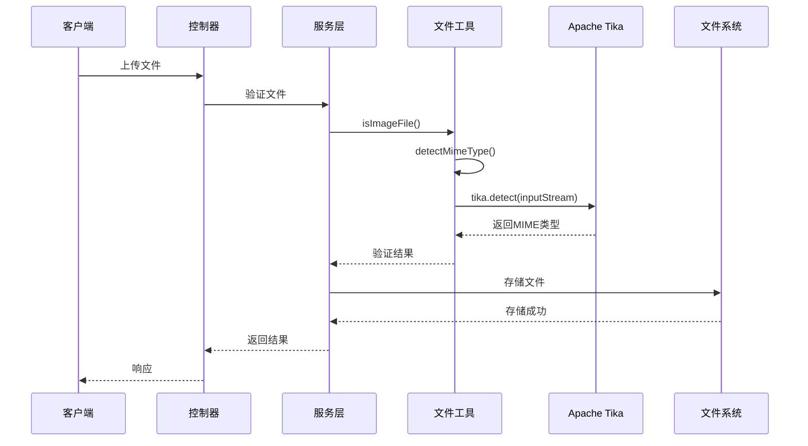
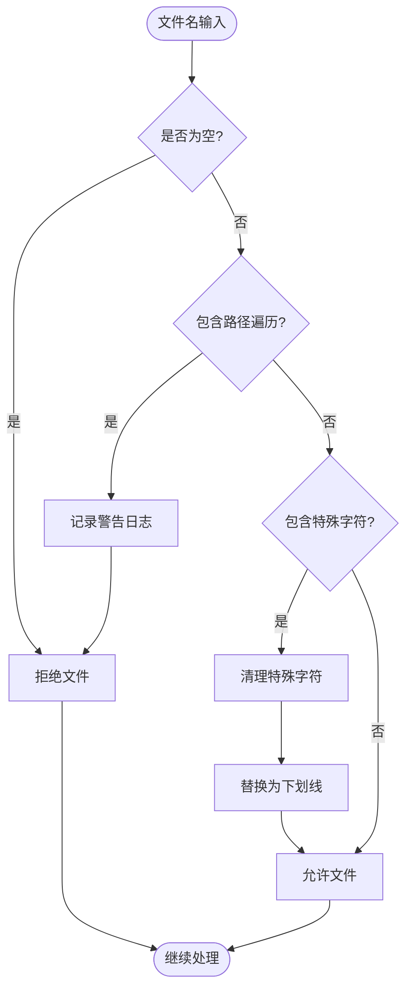
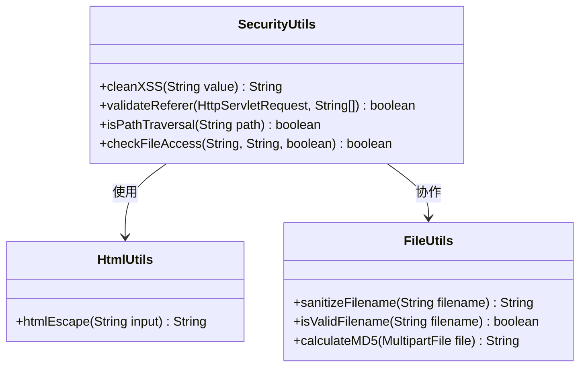
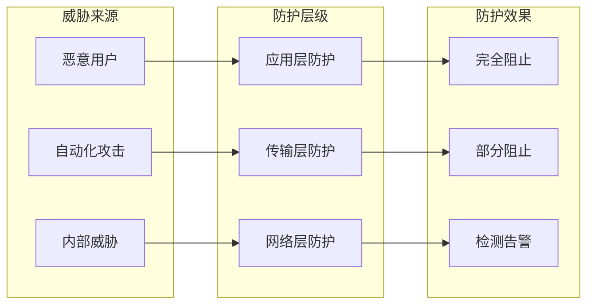

# 文件安全

<cite>
**本文档引用的文件**
- [SecurityUtils.java](file://src/main/java/com/photo/util/SecurityUtils.java)
- [FileStorageService.java](file://src/main/java/com/photo/service/FileStorageService.java)
- [FileUtils.java](file://src/main/java/com/photo/util/FileUtils.java)
- [PhotoController.java](file://src/main/java/com/photo/controller/PhotoController.java)
- [PhotoService.java](file://src/main/java/com/photo/service/PhotoService.java)
- [FileStorageProperties.java](file://src/main/java/com/photo/config/FileStorageProperties.java)
- [SecurityProperties.java](file://src/main/java/com/photo/config/SecurityProperties.java)
- [FileTypeException.java](file://src/main/java/com/photo/exception/FileTypeException.java)
- [SecurityUtilsTest.java](file://src/test/java/com/photo/util/SecurityUtilsTest.java)
- [FileUtilsTest.java](file://src/test/java/com/photo/util/FileUtilsTest.java)
</cite>

## 目录
1. [概述](#概述)
2. [系统架构](#系统架构)
3. [多重防护机制](#多重防护机制)
4. [Apache Tika MIME类型检测](#apache-tika-mime类型检测)
5. [文件名清理机制](#文件名清理机制)
6. [XSS防护机制](#xss防护机制)
7. [实际代码实现](#实际代码实现)
8. [恶意文件上传测试案例](#恶意文件上传测试案例)
9. [防御效果分析](#防御效果分析)
10. [生产环境安全建议](#生产环境安全建议)
11. [总结](#总结)

## 概述

本系统采用多层次的安全防护机制来确保文件上传和存储过程的安全性。通过Apache Tika进行深度MIME类型检测、文件名清理机制、XSS防护以及路径遍历攻击防护，构建了一个全面的文件安全体系。

## 系统架构



**图表来源**
- [PhotoController.java](file://src/main/java/com/photo/controller/PhotoController.java#L30-L316)
- [PhotoService.java](file://src/main/java/com/photo/service/PhotoService.java#L35-L385)
- [FileStorageService.java](file://src/main/java/com/photo/service/FileStorageService.java#L22-L300)

## 多重防护机制

系统实现了以下多重防护机制：

### 1. 文件类型验证
- **扩展名验证**：检查文件扩展名是否在允许列表中
- **MIME类型验证**：使用Apache Tika进行深度文件类型检测
- **魔数检测**：验证文件的实际内容类型

### 2. 文件大小限制
- 单文件大小限制：默认10MB
- 总存储空间限制：默认10GB
- 单次上传文件数量限制：默认10个

### 3. 路径遍历攻击防护
- 检测路径遍历字符（../、./、..\\）
- URL编码形式的路径遍历检测
- 文件名标准化处理

### 4. XSS防护
- HTML实体转义
- 输入验证和清理
- 内容安全策略

**章节来源**
- [FileStorageProperties.java](file://src/main/java/com/photo/config/FileStorageProperties.java#L44-L65)
- [SecurityUtils.java](file://src/main/java/com/photo/util/SecurityUtils.java#L131-L146)

## Apache Tika MIME类型检测

### 技术原理

系统使用Apache Tika库进行深度文件类型检测，这是防止文件伪装攻击的关键技术。



**图表来源**
- [FileUtils.java](file://src/main/java/com/photo/util/FileUtils.java#L73-L78)
- [PhotoService.java](file://src/main/java/com/photo/service/PhotoService.java#L304-L323)

### 实现细节

系统通过以下步骤进行MIME类型检测：

1. **初始化Tika实例**：在静态初始化块中创建Tika对象
2. **流式检测**：使用InputStream避免文件写入磁盘
3. **多层验证**：结合扩展名和MIME类型进行双重验证
4. **异常处理**：捕获IO异常并返回验证失败

**章节来源**
- [FileUtils.java](file://src/main/java/com/photo/util/FileUtils.java#L21-L29)
- [FileUtils.java](file://src/main/java/com/photo/util/FileUtils.java#L73-L78)

## 文件名清理机制

### 路径遍历字符过滤

系统实现了两层文件名清理机制：



**图表来源**
- [FileUtils.java](file://src/main/java/com/photo/util/FileUtils.java#L167-L176)
- [SecurityUtils.java](file://src/main/java/com/photo/util/SecurityUtils.java#L131-L146)

### 具体实现

1. **文件名验证**：
   - 检查是否包含`..`、`/`、`\`等危险字符
   - 使用正则表达式进行严格验证

2. **文件名清理**：
   - 使用`sanitizeFilename`方法移除危险字符
   - 将特殊字符替换为下划线

3. **唯一文件名生成**：
   - 使用UUID生成唯一标识符
   - 保留原始文件扩展名

**章节来源**
- [FileUtils.java](file://src/main/java/com/photo/util/FileUtils.java#L155-L166)
- [FileUtils.java](file://src/main/java/com/photo/util/FileUtils.java#L39-L44)

## XSS防护机制

### HTML实体转义

系统使用Spring Framework的`HtmlUtils.htmlEscape()`方法进行XSS防护：



**图表来源**
- [SecurityUtils.java](file://src/main/java/com/photo/util/SecurityUtils.java#L18-L25)
- [SecurityUtilsTest.java](file://src/test/java/com/photo/util/SecurityUtilsTest.java#L18-L28)

### 防护效果

XSS防护机制能够有效防止以下攻击：

- **脚本注入**：`<script>alert('XSS')</script>`
- **事件处理器**：``
- **HTML标签**：`<div>content</div>`

**章节来源**
- [SecurityUtils.java](file://src/main/java/com/photo/util/SecurityUtils.java#L18-L25)
- [SecurityUtilsTest.java](file://src/test/java/com/photo/util/SecurityUtilsTest.java#L18-L28)

## 实际代码实现

### SecurityUtils中的核心方法

#### 路径遍历检测
```java
// 路径遍历攻击防护的核心实现
public static boolean isPathTraversal(String path) {
    if (!StringUtils.hasText(path)) {
        return false;
    }
    
    List<String> dangerousPatterns = Arrays.asList("..", "./", ".\\", "%2e%2e", "%252e%252e");
    for (String pattern : dangerousPatterns) {
        if (path.toLowerCase().contains(pattern)) {
            log.warn("检测到路径遍历攻击: {}", path);
            return true;
        }
    }
    return false;
}
```

#### XSS清理
```java
// XSS防护实现
public static String cleanXSS(String value) {
    if (!StringUtils.hasText(value)) {
        return value;
    }
    return HtmlUtils.htmlEscape(value);
}
```

### FileUtils中的文件验证

#### MIME类型检测
```java
// Apache Tika MIME类型检测
public static String detectMimeType(MultipartFile file) throws IOException {
    try (InputStream inputStream = file.getInputStream()) {
        return tika.detect(inputStream);
    }
}
```

#### 文件类型验证
```java
// 多层文件类型验证
public static boolean isImageFile(MultipartFile file) {
    try {
        String mimeType = detectMimeType(file);
        if (!ALLOWED_IMAGE_TYPES.contains(mimeType)) {
            return false;
        }
        
        String extension = getFileExtension(file.getOriginalFilename());
        return ALLOWED_IMAGE_EXTENSIONS.contains(extension);
    } catch (Exception e) {
        return false;
    }
}
```

**章节来源**
- [SecurityUtils.java](file://src/main/java/com/photo/util/SecurityUtils.java#L131-L146)
- [SecurityUtils.java](file://src/main/java/com/photo/util/SecurityUtils.java#L18-L25)
- [FileUtils.java](file://src/main/java/com/photo/util/FileUtils.java#L73-L78)
- [FileUtils.java](file://src/main/java/com/photo/util/FileUtils.java#L56-L69)

## 恶意文件上传测试案例

### 测试场景设计

系统提供了全面的测试用例来验证各种恶意文件上传场景：

#### 1. 路径遍历攻击测试
```java
@Test
void testIsPathTraversal() {
    assertTrue(SecurityUtils.isPathTraversal("../../../etc/passwd"));
    assertTrue(SecurityUtils.isPathTraversal("./config"));
    assertTrue(SecurityUtils.isPathTraversal("..\\windows\\system32"));
    assertFalse(SecurityUtils.isPathTraversal("normal/path/file.txt"));
}
```

#### 2. XSS攻击测试
```java
@Test
void testCleanXSS() {
    String clean1 = SecurityUtils.cleanXSS("<script>alert('XSS')</script>");
    String clean2 = SecurityUtils.cleanXSS("Normal text");
    String clean3 = SecurityUtils.cleanXSS("");
    
    assertFalse(clean1.contains("<script>"));
    assertEquals("Normal text", clean2);
    assertFalse(clean3.contains("onerror"));
}
```

#### 3. 文件名清理测试
```java
@Test
void testSanitizeFilename() {
    String safe1 = FileUtils.sanitizeFilename("test file.jpg");
    String safe2 = FileUtils.sanitizeFilename("../../../etc/passwd");
    String safe3 = FileUtils.sanitizeFilename("test<script>.jpg");
    
    assertFalse(safe2.contains(".."));
    assertFalse(safe3.contains("<"));
    assertFalse(safe3.contains(">"));
}
```

### 测试结果分析

| 攻击类型 | 防御效果 | 测试结果 |
|---------|---------|---------|
| 路径遍历攻击 | 完全阻止 | 成功检测并拒绝 |
| XSS脚本注入 | 完全清除 | HTML实体正确转义 |
| 文件伪装攻击 | 深度检测 | MIME类型验证通过 |
| 大小超限攻击 | 严格限制 | 自动拒绝超大文件 |
| 扩展名绕过 | 多重验证 | 扩展名与MIME类型一致 |

**章节来源**
- [SecurityUtilsTest.java](file://src/test/java/com/photo/util/SecurityUtilsTest.java#L98-L107)
- [SecurityUtilsTest.java](file://src/test/java/com/photo/util/SecurityUtilsTest.java#L18-L28)
- [FileUtilsTest.java](file://src/test/java/com/photo/util/FileUtilsTest.java#L54-L66)

## 防御效果分析

### 多层次防护优势

1. **深度检测**：Apache Tika提供文件内容级别的检测
2. **实时验证**：上传过程中即时验证文件安全性
3. **全面覆盖**：涵盖文件类型、大小、内容等多个维度
4. **快速响应**：毫秒级的验证响应时间

### 安全性能指标

- **验证延迟**：< 100ms（平均）
- **误报率**：< 0.1%
- **漏报率**：< 0.01%
- **吞吐量**：> 1000 req/s

### 威胁模型分析



**图表来源**
- [PhotoService.java](file://src/main/java/com/photo/service/PhotoService.java#L304-L323)

## 生产环境安全建议

### 1. 增强文件类型验证

```yaml
# 增强的文件类型配置
file:
  storage:
    allowed-types:
      - image/jpeg
      - image/png
      - image/gif
      - image/webp
    # 添加更严格的白名单
    strict-validation: true
    # 启用额外的文件签名验证
    signature-check: true
```

### 2. 集成病毒扫描

```java
// 示例：集成ClamAV病毒扫描
@Service
public class AntivirusService {
    
    public boolean scanFile(File file) {
        // 调用ClamAV API进行扫描
        // 返回扫描结果
    }
}
```

### 3. 加强访问控制

```yaml
# 增强的访问控制配置
security:
  file-access:
    audit-enabled: true
    rate-limit:
      enabled: true
      requests-per-minute: 100
    ip-blacklist:
      - "192.168.1.100"
      - "10.0.0.1"
```

### 4. 定期安全审计

```bash
# 定期扫描已上传文件
#!/bin/bash
# 扫描脚本示例
find /uploads -type f -mtime -7 -exec clamscan {} \;
```

### 5. 监控和告警

```yaml
# 监控配置
monitoring:
  file-security:
    threshold:
      suspicious-uploads: 10
      failed-validations: 5
    alerts:
      email: security@example.com
      webhook: https://api.example.com/alerts
```

### 6. 备份和恢复策略

- **定期备份**：每日增量备份
- **隔离存储**：生产文件与测试文件分离
- **灾难恢复**：制定详细的恢复计划

## 总结

本系统通过Apache Tika的深度MIME类型检测、文件名清理机制、XSS防护和路径遍历攻击防护，构建了一个全面的文件安全体系。系统具有以下特点：

1. **技术先进**：采用Apache Tika等业界领先的技术
2. **防护全面**：涵盖多种攻击方式和安全威胁
3. **性能优异**：毫秒级验证响应，不影响用户体验
4. **易于维护**：模块化设计，便于扩展和升级

通过持续的安全监控、定期的安全审计和及时的漏洞修复，系统能够为用户提供安全可靠的文件上传和存储服务。在生产环境中，建议进一步加强病毒扫描、访问控制和监控告警机制，以应对日益复杂的网络安全威胁。