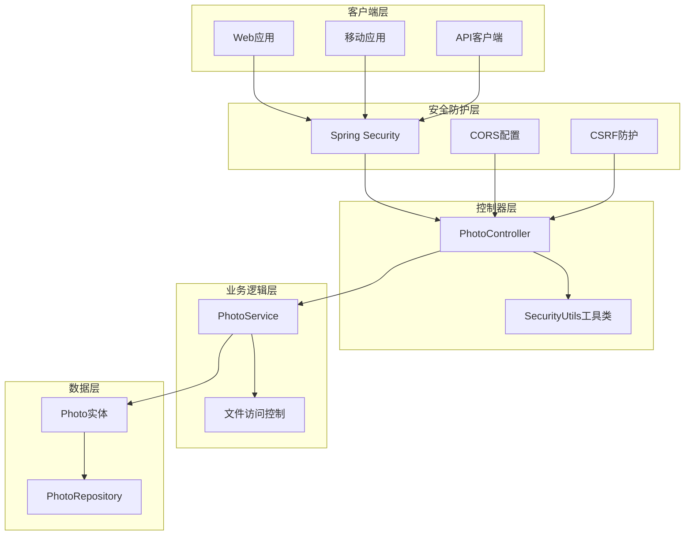
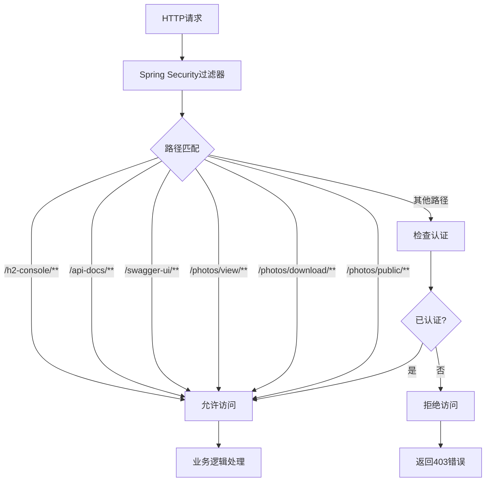
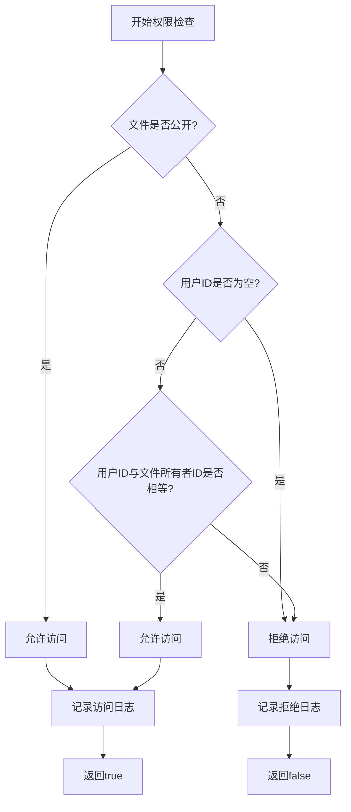
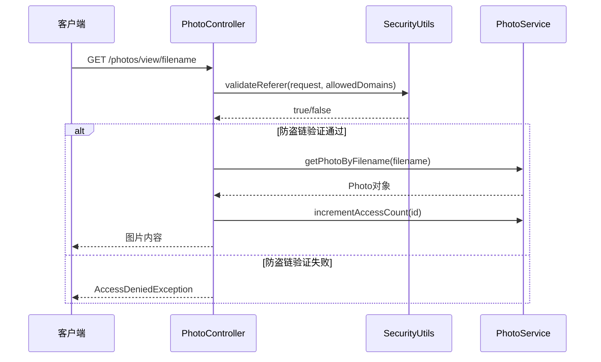
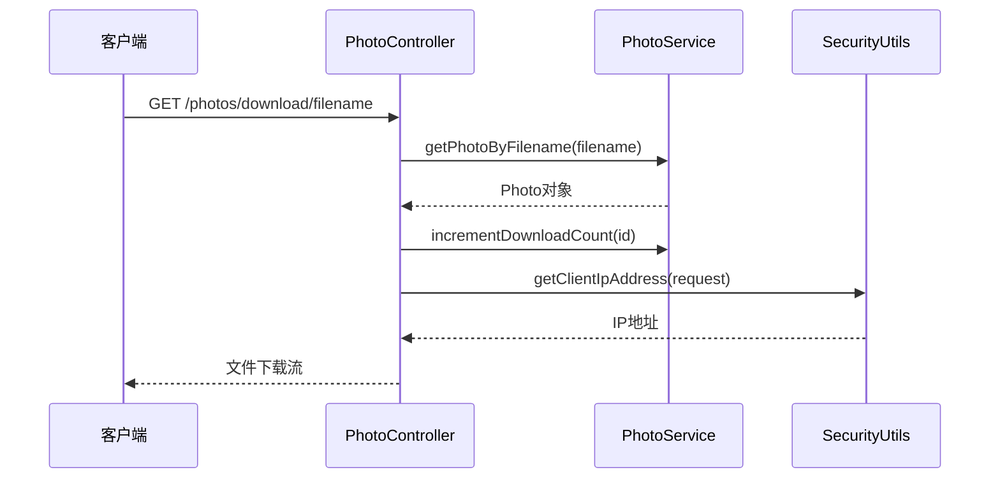
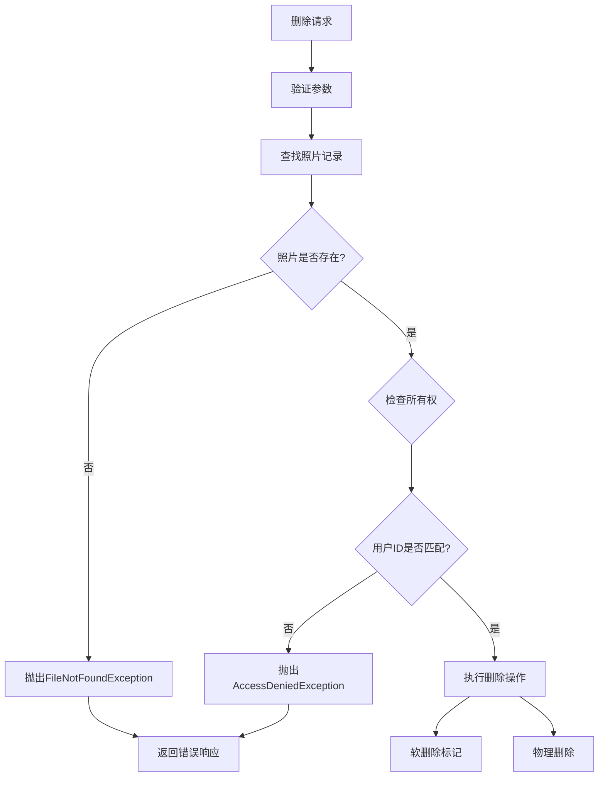
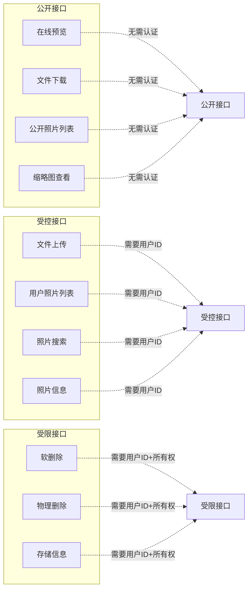
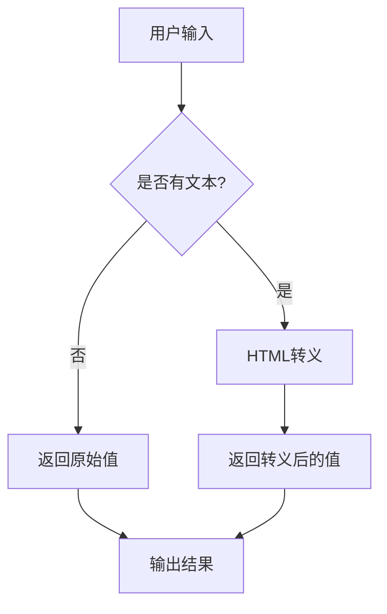
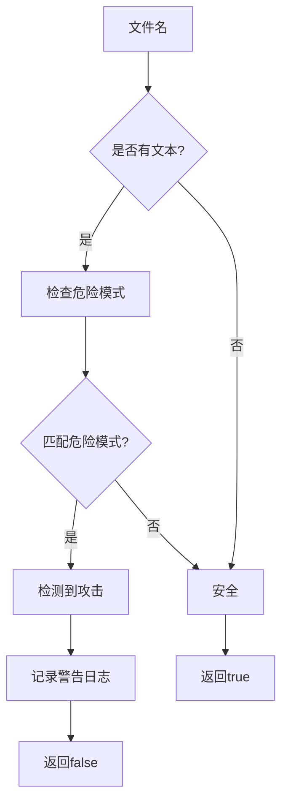
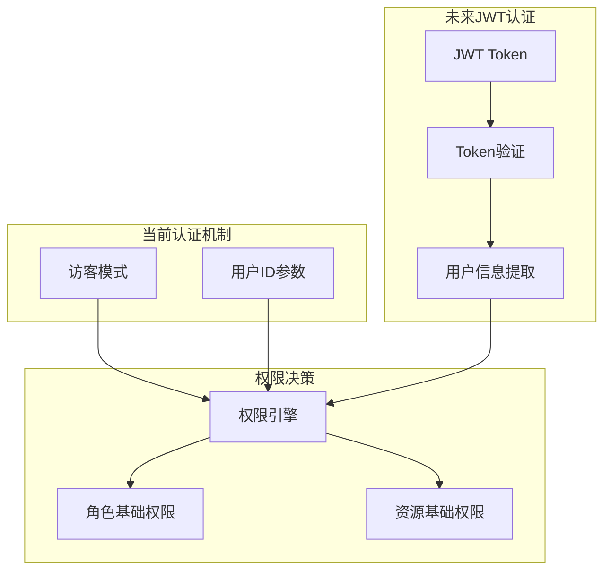

# 访问权限控制

<cite>
**本文档引用的文件**
- [SecurityConfig.java](file://src/main/java/com/photo/config/SecurityConfig.java)
- [SecurityUtils.java](file://src/main/java/com/photo/util/SecurityUtils.java)
- [PhotoController.java](file://src/main/java/com/photo/controller/PhotoController.java)
- [PhotoService.java](file://src/main/java/com/photo/service/PhotoService.java)
- [Photo.java](file://src/main/java/com/photo/entity/Photo.java)
- [SecurityProperties.java](file://src/main/java/com/photo/config/SecurityProperties.java)
- [AccessDeniedException.java](file://src/main/java/com/photo/exception/AccessDeniedException.java)
- [SecurityUtilsTest.java](file://src/test/java/com/photo/util/SecurityUtilsTest.java)
- [API_DOCUMENTATION.md](file://API_DOCUMENTATION.md)
</cite>

## 目录
1. [简介](#简介)
2. [系统架构概览](#系统架构概览)
3. [Spring Security配置](#spring-security配置)
4. [细粒度权限控制](#细粒度权限控制)
5. [文件访问权限验证](#文件访问权限验证)
6. [用户身份验证机制](#用户身份验证机制)
7. [API接口权限设计](#api接口权限设计)
8. [安全工具类](#安全工具类)
9. [权限模型设计思路](#权限模型设计思路)
10. [生产环境部署建议](#生产环境部署建议)
11. [总结](#总结)

## 简介

本系统采用多层次的访问权限控制设计，通过Spring Security框架实现基础安全防护，结合自定义的权限验证逻辑，为照片管理系统提供了灵活且可扩展的访问控制机制。系统支持公开资源访问、私有文件保护以及基于用户的细粒度权限控制。

## 系统架构概览



**图表来源**
- [SecurityConfig.java](file://src/main/java/com/photo/config/SecurityConfig.java#L26-L47)
- [PhotoController.java](file://src/main/java/com/photo/controller/PhotoController.java#L31-L316)
- [SecurityUtils.java](file://src/main/java/com/photo/util/SecurityUtils.java#L14-L167)

## Spring Security配置

### 放行策略设计

系统采用宽松的放行策略，针对公开接口进行特殊配置：



**图表来源**
- [SecurityConfig.java](file://src/main/java/com/photo/config/SecurityConfig.java#L33-L43)

### 配置特点

1. **CSRF禁用**: 由于系统主要提供RESTful API，禁用CSRF保护
2. **CORS配置**: 支持跨域资源共享，可配置允许的源、方法和头部
3. **无状态会话**: 使用STATELESS会话管理策略
4. **宽松授权**: 除特定路径外，其他请求均需认证

**章节来源**
- [SecurityConfig.java](file://src/main/java/com/photo/config/SecurityConfig.java#L26-L47)

## 细粒度权限控制

### SecurityUtils.checkFileAccess方法

系统的核心权限控制逻辑集中在`SecurityUtils.checkFileAccess`方法中，实现了基于文件公开性和用户所有权的双重判断：



**图表来源**
- [SecurityUtils.java](file://src/main/java/com/photo/util/SecurityUtils.java#L152-L164)

### 权限判断逻辑

| 条件组合 | 结果 | 说明 |
|---------|------|------|
| `isPublic=true` | ✅ 允许访问 | 公开文件对所有人开放 |
| `isPublic=false` 且 `userId=null` | ❌ 拒绝访问 | 私有文件需要用户提供身份 |
| `isPublic=false` 且 `userId.equals(fileOwnerId)` | ✅ 允许访问 | 文件所有者可访问 |
| `isPublic=false` 且 `!userId.equals(fileOwnerId)` | ❌ 拒绝访问 | 非所有者无法访问私有文件 |

**章节来源**
- [SecurityUtils.java](file://src/main/java/com/photo/util/SecurityUtils.java#L152-L164)
- [SecurityUtilsTest.java](file://src/test/java/com/photo/util/SecurityUtilsTest.java#L109-L134)

## 文件访问权限验证

### 预览接口权限控制

系统在预览接口中集成了防盗链检查：



**图表来源**
- [PhotoController.java](file://src/main/java/com/photo/controller/PhotoController.java#L86-L97)

### 下载接口权限控制

下载接口同样受到权限验证保护：



**图表来源**
- [PhotoController.java](file://src/main/java/com/photo/controller/PhotoController.java#L149-L178)

**章节来源**
- [PhotoController.java](file://src/main/java/com/photo/controller/PhotoController.java#L86-L97)
- [PhotoController.java](file://src/main/java/com/photo/controller/PhotoController.java#L149-L178)

## 用户身份验证机制

### 删除操作中的身份验证

系统在删除操作中实施严格的用户身份验证：



**图表来源**
- [PhotoService.java](file://src/main/java/com/photo/service/PhotoService.java#L192-L204)

### 权限验证实现

| 操作类型 | 验证方式 | 异常处理 |
|---------|---------|---------|
| 软删除 | `photo.getUserId().equals(userId)` | `AccessDeniedException` |
| 物理删除 | `photo.getUserId().equals(userId)` | `AccessDeniedException` |
| 文件访问 | `SecurityUtils.checkFileAccess()` | 日志记录，返回false |

**章节来源**
- [PhotoService.java](file://src/main/java/com/photo/service/PhotoService.java#L192-L204)
- [PhotoService.java](file://src/main/java/com/photo/service/PhotoService.java#L208-L233)

## API接口权限设计

### 接口分类与权限策略

根据API的功能特性进行分类管理：



**图表来源**
- [SecurityConfig.java](file://src/main/java/com/photo/config/SecurityConfig.java#L34-L41)
- [PhotoController.java](file://src/main/java/com/photo/controller/PhotoController.java#L46-L315)

### 权限说明对照表

| API接口 | 权限级别 | 认证要求 | 授权条件 |
|---------|---------|---------|---------|
| `/photos/view/**` | 公开 | 无 | 无 |
| `/photos/download/**` | 公开 | 无 | 无 |
| `/photos/public/**` | 公开 | 无 | 无 |
| `/photos/upload` | 受控 | 用户ID | 无 |
| `/photos/user/{userId}` | 受控 | 用户ID | 无 |
| `/photos/{id}` | 受控 | 用户ID | 无 |
| `/photos/{id}` | 受限 | 用户ID | 文件所有者 |
| `/photos/{id}/permanent` | 受限 | 用户ID | 文件所有者 |

**章节来源**
- [API_DOCUMENTATION.md](file://API_DOCUMENTATION.md#L33-L380)

## 安全工具类

### XSS防护

系统提供HTML转义功能防止XSS攻击：



**图表来源**
- [SecurityUtils.java](file://src/main/java/com/photo/util/SecurityUtils.java#L20-L24)

### 路径遍历攻击防护

系统严格验证文件名防止路径遍历攻击：



**图表来源**
- [SecurityUtils.java](file://src/main/java/com/photo/util/SecurityUtils.java#L130-L146)

### IP地址获取

系统支持多种代理环境下的IP地址获取：

| 头部名称 | 优先级 | 用途 |
|---------|-------|------|
| `X-Forwarded-For` | 1 | 多级代理场景 |
| `Proxy-Client-IP` | 2 | 一级代理 |
| `WL-Proxy-Client-IP` | 3 | WebLogic代理 |
| `REMOTE_ADDR` | 4 | 最终客户端 |

**章节来源**
- [SecurityUtils.java](file://src/main/java/com/photo/util/SecurityUtils.java#L20-L167)

## 权限模型设计思路

### 当前权限模型特点

1. **简单易用**: 基于用户ID的直接比较，实现成本低
2. **灵活扩展**: 支持公开/私有两种模式切换
3. **性能优化**: 减少数据库查询，提高响应速度
4. **日志审计**: 记录所有权限验证过程

### 可扩展的认证机制

系统预留了JWT认证的扩展空间：



### 权限模型演进路径

1. **阶段一**: 基于用户ID的简单权限控制
2. **阶段二**: 引入角色概念，支持角色基础权限
3. **阶段三**: 实现RBAC模型，支持细粒度权限控制
4. **阶段四**: 集成OAuth2.0，支持第三方认证

## 生产环境部署建议

### 安全加固措施

1. **启用HTTPS**: 确保传输层安全
2. **加强认证**: 集成JWT或OAuth2.0认证
3. **限制访问频率**: 添加速率限制
4. **增强日志监控**: 记录所有权限验证事件

### 配置优化建议

```yaml
# application.yml 安全配置示例
security:
  referer:
    enabled: true
    allowed-domains:
      - "https://app.example.com"
      - "https://admin.example.com"
  token:
    secret: "${SECURITY_TOKEN_SECRET}"
    expiration: 86400
  cors:
    enabled: true
    allowed-origins:
      - "https://app.example.com"
    allowed-methods:
      - "GET"
      - "POST"
      - "PUT"
      - "DELETE"
    allowed-headers:
      - "Authorization"
      - "Content-Type"
    allow-credentials: true
```

### 监控告警设置

1. **权限验证失败**: 设置阈值告警
2. **异常访问模式**: 监控可疑行为
3. **存储空间使用**: 设置容量告警
4. **API响应时间**: 监控性能指标

## 总结

本系统的访问权限控制设计体现了"安全优先、易于扩展"的设计理念。通过Spring Security的基础防护、自定义权限验证逻辑以及多层次的安全工具，构建了一个既安全又灵活的权限控制系统。

### 核心优势

1. **简洁高效**: 基于现有技术栈，实现成本低
2. **安全可靠**: 多重防护机制，有效抵御常见攻击
3. **易于维护**: 清晰的权限分离，便于后续扩展
4. **性能良好**: 减少不必要的数据库查询，提升响应速度

### 发展方向

随着业务的发展，系统可以逐步引入更复杂的认证授权机制，在保持现有功能的基础上，提供更加精细化的权限控制能力，满足企业级应用的安全需求。