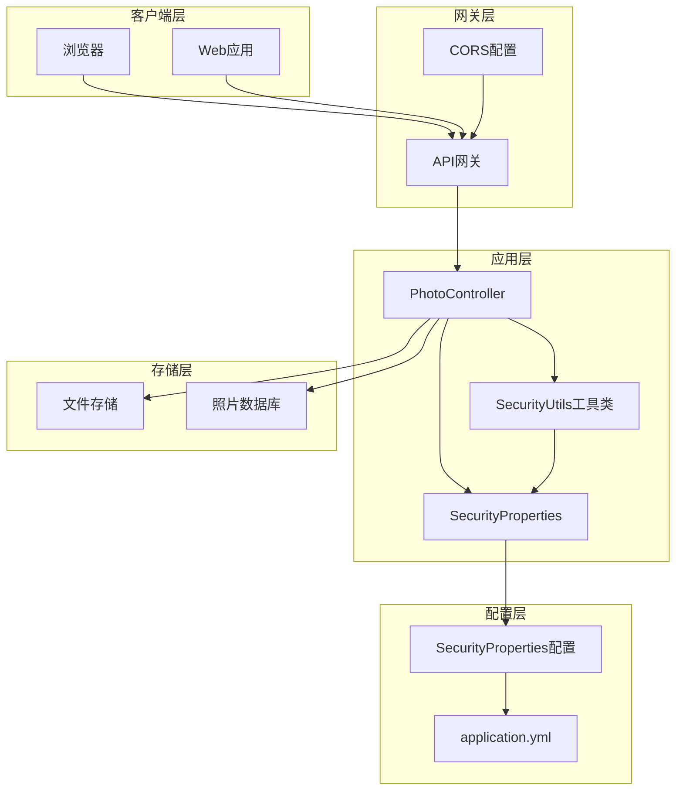
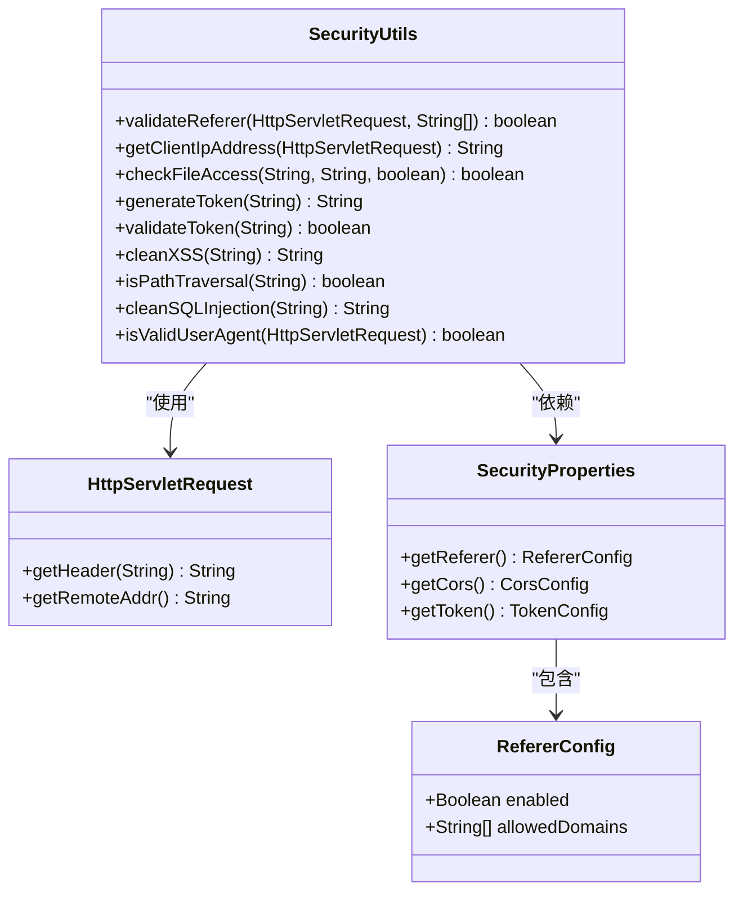
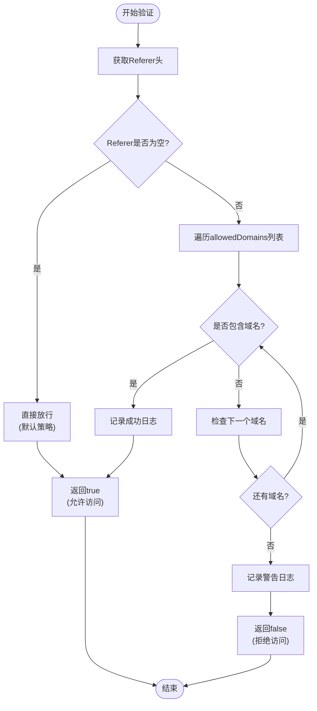
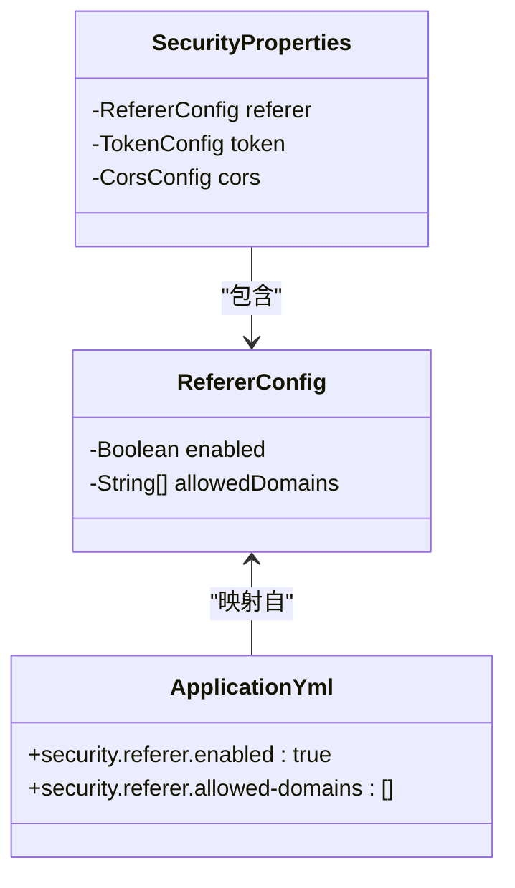
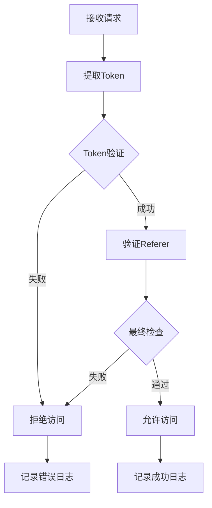
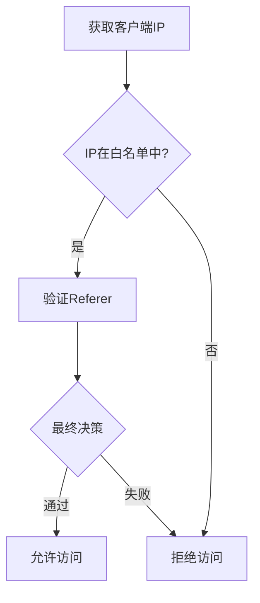
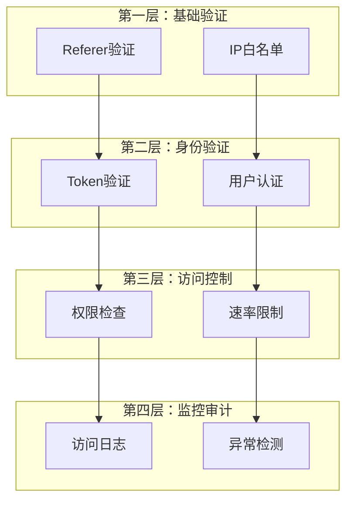

# 防盗链机制

<cite>
**本文档引用的文件**
- [SecurityUtils.java](file://src/main/java/com/photo/util/SecurityUtils.java)
- [PhotoController.java](file://src/main/java/com/photo/controller/PhotoController.java)
- [SecurityProperties.java](file://src/main/java/com/photo/config/SecurityProperties.java)
- [application.yml](file://src/main/resources/application.yml)
- [SecurityUtilsTest.java](file://src/test/java/com/photo/util/SecurityUtilsTest.java)
- [AccessDeniedException.java](file://src/main/java/com/photo/exception/AccessDeniedException.java)
- [SecurityConfig.java](file://src/main/java/com/photo/config/SecurityConfig.java)
- [GlobalExceptionHandler.java](file://src/main/java/com/photo/exception/GlobalExceptionHandler.java)
</cite>

## 目录
1. [简介](#简介)
2. [系统架构概览](#系统架构概览)
3. [核心组件分析](#核心组件分析)
4. [防盗链实现机制](#防盗链实现机制)
5. [配置管理](#配置管理)
6. [安全考量与局限性](#安全考量与局限性)
7. [增强方案建议](#增强方案建议)
8. [故障排除指南](#故障排除指南)
9. [总结](#总结)

## 简介

防盗链机制是现代Web应用中重要的安全防护措施，用于防止未经授权的第三方网站直接访问和使用本系统的资源文件。本文档深入分析基于Referer验证的防盗链实现，详细说明SecurityUtils.validateReferer方法的工作原理，以及如何通过配置文件定义合法访问源。

该系统采用多层次的安全防护策略，在资源访问的关键环节实施防盗链检查，确保只有来自授权域名的请求才能访问受保护的图片资源，有效防止恶意盗链行为。

## 系统架构概览

防盗链机制在整个系统中扮演着关键的安全角色，其架构设计体现了防御纵深的原则：



**图表来源**
- [PhotoController.java](file://src/main/java/com/photo/controller/PhotoController.java#L92-L96)
- [SecurityUtils.java](file://src/main/java/com/photo/util/SecurityUtils.java#L62-L78)
- [SecurityProperties.java](file://src/main/java/com/photo/config/SecurityProperties.java#L15-L52)

## 核心组件分析

### SecurityUtils工具类

SecurityUtils是系统安全功能的核心工具类，提供了多种安全验证功能，其中validateReferer方法专门负责防盗链验证：



**图表来源**
- [SecurityUtils.java](file://src/main/java/com/photo/util/SecurityUtils.java#L15-L167)
- [SecurityProperties.java](file://src/main/java/com/photo/config/SecurityProperties.java#L15-L52)

**章节来源**
- [SecurityUtils.java](file://src/main/java/com/photo/util/SecurityUtils.java#L62-L78)
- [SecurityProperties.java](file://src/main/java/com/photo/config/SecurityProperties.java#L15-L52)

### PhotoController控制器

PhotoController是防盗链机制的主要执行点，负责在资源访问的关键接口上实施安全检查：

```mermaid
sequenceDiagram
participant Client as 客户端
participant Controller as PhotoController
participant SecurityUtils as SecurityUtils
participant Properties as SecurityProperties
participant Service as PhotoService
participant Storage as FileStorage
Client->>Controller : GET /photos/view/{filename}
Controller->>Controller : 提取文件名参数
Controller->>Properties : 检查防盗链配置
Properties-->>Controller : 返回enabled状态
Controller->>SecurityUtils : validateReferer(request, domains)
SecurityUtils->>SecurityUtils : 获取Referer头
SecurityUtils->>SecurityUtils : 检查allowedDomains列表
SecurityUtils-->>Controller : 返回验证结果
alt 验证失败
Controller->>Controller : 抛出AccessDeniedException
Controller-->>Client : 403 Forbidden
else 验证成功
Controller->>Service : getPhotoByFilename(filename)
Service-->>Controller : 返回Photo实体
Controller->>Storage : getFile(filename)
Storage-->>Controller : 返回文件内容
Controller-->>Client : 返回图片数据
end
```

**图表来源**
- [PhotoController.java](file://src/main/java/com/photo/controller/PhotoController.java#L92-L116)
- [SecurityUtils.java](file://src/main/java/com/photo/util/SecurityUtils.java#L62-L78)

**章节来源**
- [PhotoController.java](file://src/main/java/com/photo/controller/PhotoController.java#L92-L116)

## 防盗链实现机制

### validateReferer方法详解

validateReferer方法是防盗链机制的核心实现，其工作流程如下：



**图表来源**
- [SecurityUtils.java](file://src/main/java/com/photo/util/SecurityUtils.java#L62-L78)

#### 关键实现细节

1. **Referer头提取**：从HTTP请求头中获取Referer字段，这是判断请求来源的基础
2. **空Referer处理**：当Referer为空时，默认允许访问，这种设计考虑了某些场景下的兼容性需求
3. **域名匹配算法**：使用简单的字符串包含匹配，对性能友好但可能存在误判风险
4. **日志记录**：对非法访问进行详细日志记录，便于后续审计和分析

**章节来源**
- [SecurityUtils.java](file://src/main/java/com/photo/util/SecurityUtils.java#L62-L78)

### 防盗链检查流程

防盗链检查在PhotoController的资源访问接口中实施，具体流程包括：

1. **配置检查**：首先检查security.referer.enabled配置项
2. **参数准备**：获取allowedDomains配置列表
3. **验证执行**：调用SecurityUtils.validateReferer方法
4. **异常处理**：验证失败时抛出AccessDeniedException
5. **正常流程**：验证成功后继续执行资源访问逻辑

**章节来源**
- [PhotoController.java](file://src/main/java/com/photo/controller/PhotoController.java#L92-L96)

## 配置管理

### application.yml配置结构

系统通过application.yml文件集中管理防盗链相关配置：

| 配置项 | 类型 | 默认值 | 说明 |
|--------|------|--------|------|
| security.referer.enabled | Boolean | true | 是否启用防盗链功能 |
| security.referer.allowed-domains | List<String> | ["localhost", "127.0.0.1"] | 允许访问的域名列表 |

### SecurityProperties配置映射

SecurityProperties类将配置文件中的设置映射到Java对象中：



**图表来源**
- [SecurityProperties.java](file://src/main/java/com/photo/config/SecurityProperties.java#L15-L52)
- [application.yml](file://src/main/resources/application.yml#L101-L108)

**章节来源**
- [application.yml](file://src/main/resources/application.yml#L101-L108)
- [SecurityProperties.java](file://src/main/java/com/photo/config/SecurityProperties.java#L15-L52)

## 安全考量与局限性

### 当前实现的安全考量

1. **默认放行策略**：Referer为空时允许访问，这在某些情况下是合理的，如直接访问链接或搜索引擎爬虫
2. **简单匹配算法**：使用字符串包含匹配，性能优异但可能存在安全漏洞
3. **日志记录**：详细的访问日志有助于安全审计和问题追踪
4. **异常处理**：统一的异常处理机制确保安全问题得到妥善处理

### 主要局限性

1. **Referer可伪造**：攻击者可以轻易伪造Referer头
2. **Referer缺失**：某些客户端可能不发送Referer头
3. **简单匹配风险**：如"example.com.attack.com"会被误认为合法
4. **缺乏深度验证**：仅基于域名的验证不够全面

### 安全风险评估

| 风险等级 | 风险描述 | 影响范围 | 建议措施 |
|----------|----------|----------|----------|
| 中等 | Referer伪造攻击 | 资源被盗用 | 结合Token验证 |
| 中等 | Referer缺失导致误放行 | 部分资源暴露 | 增强验证机制 |
| 低 | 简单匹配误判 | 少量误报 | 优化匹配算法 |
| 高 | 缺乏多层防护 | 整体安全性受影响 | 实施综合防护策略 |

## 增强方案建议

### 方案一：结合Token验证



### 方案二：IP白名单机制



### 方案三：CDN防盗链功能

利用CDN服务提供的高级防盗链功能：

1. **签名URL**：生成带有时间戳和签名的临时访问链接
2. **IP限制**：限制特定IP段的访问
3. **用户代理验证**：检查User-Agent头部
4. **访问频率控制**：限制单位时间内的访问次数

### 综合防护策略

推荐采用多层防护策略：



## 故障排除指南

### 常见问题诊断

#### 问题1：防盗链被误触发

**症状**：合法用户无法访问资源，返回403错误

**排查步骤**：
1. 检查Referer头是否正确传递
2. 验证allowed-domains配置是否包含当前域名
3. 查看应用日志中的警告信息

**解决方案**：
```yaml
# application.yml配置调整
security:
  referer:
    enabled: true
    allowed-domains:
      - "your-domain.com"
      - "www.your-domain.com"
      - "localhost"
      - "127.0.0.1"
```

#### 问题2：Referer为空导致误放行

**症状**：某些恶意请求能够绕过防盗链检查

**解决方案**：
1. 修改validateReferer方法，增加更严格的空Referer检查
2. 结合其他验证机制
3. 启用更严格的安全策略

#### 问题3：性能问题

**症状**：防盗链检查影响系统性能

**优化方案**：
1. 使用缓存机制减少重复验证
2. 优化allowedDomains列表大小
3. 考虑异步验证机制

**章节来源**
- [SecurityUtilsTest.java](file://src/test/java/com/photo/util/SecurityUtilsTest.java#L58-L95)
- [GlobalExceptionHandler.java](file://src/main/java/com/photo/exception/GlobalExceptionHandler.java#L81-L87)

## 总结

本文档详细分析了基于Referer验证的防盗链机制实现，涵盖了从核心算法到配置管理的完整技术栈。该系统通过SecurityUtils.validateReferer方法实现了简单而有效的防盗链功能，同时提供了灵活的配置选项和完善的异常处理机制。

### 关键特性总结

1. **简单高效**：基于字符串匹配的验证算法性能优异
2. **配置灵活**：支持动态配置允许的域名列表
3. **易于集成**：与现有Spring Boot应用无缝集成
4. **日志完善**：提供详细的访问日志便于审计

### 最佳实践建议

1. **定期审查配置**：及时更新allowed-domains列表
2. **监控访问日志**：关注异常访问模式
3. **结合其他安全措施**：不要依赖单一防护机制
4. **持续优化算法**：根据实际需求调整验证策略

### 发展方向

随着网络安全威胁的不断演进，防盗链机制需要持续改进和完善。建议在现有基础上引入更先进的验证技术和智能防护策略，构建更加全面和智能的安全防护体系。