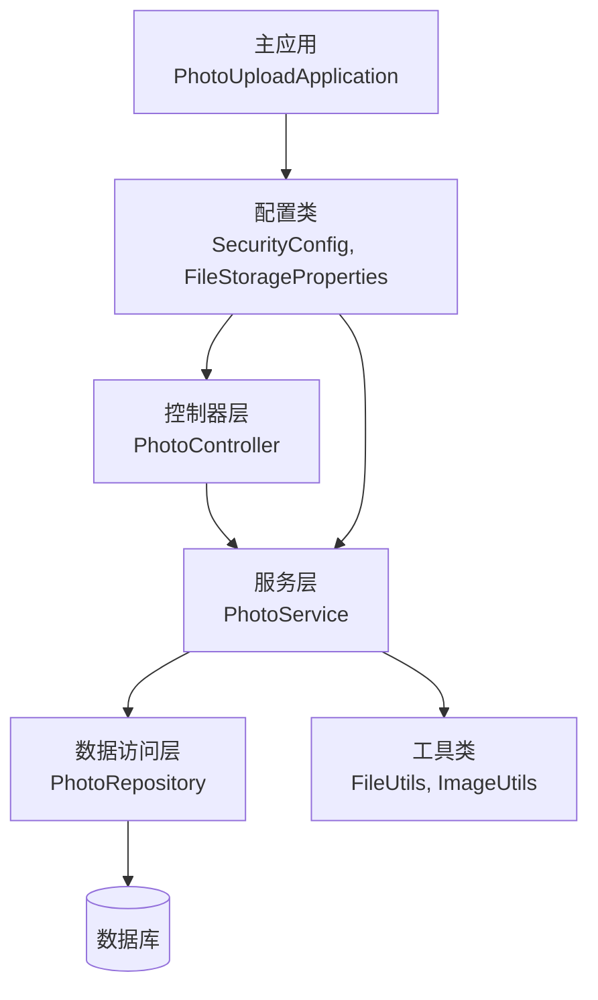
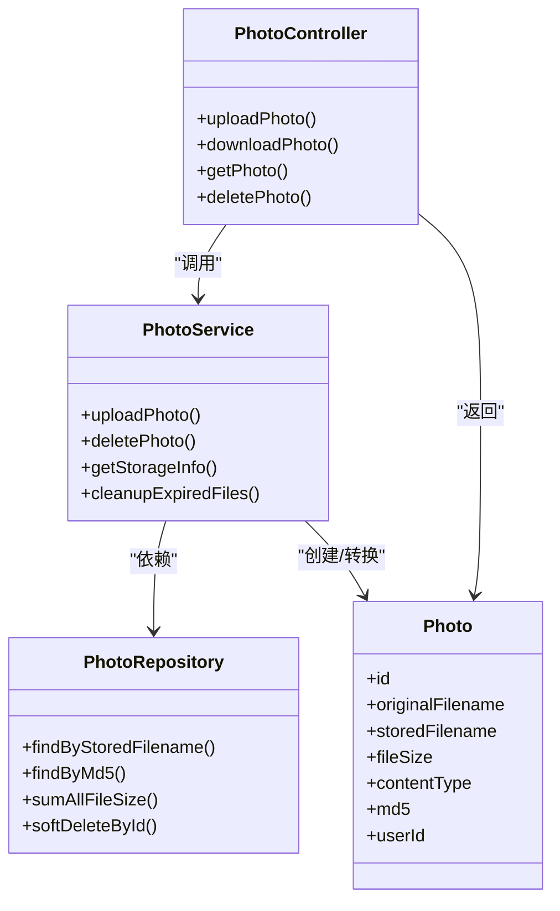
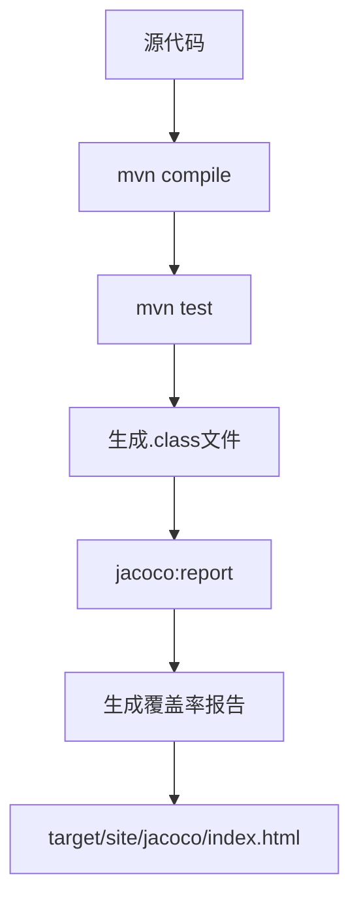
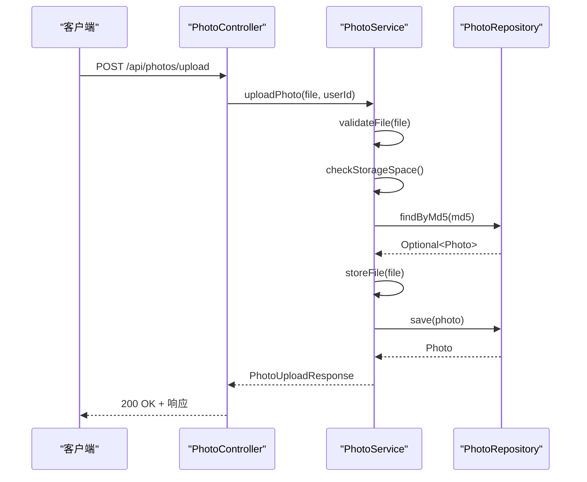
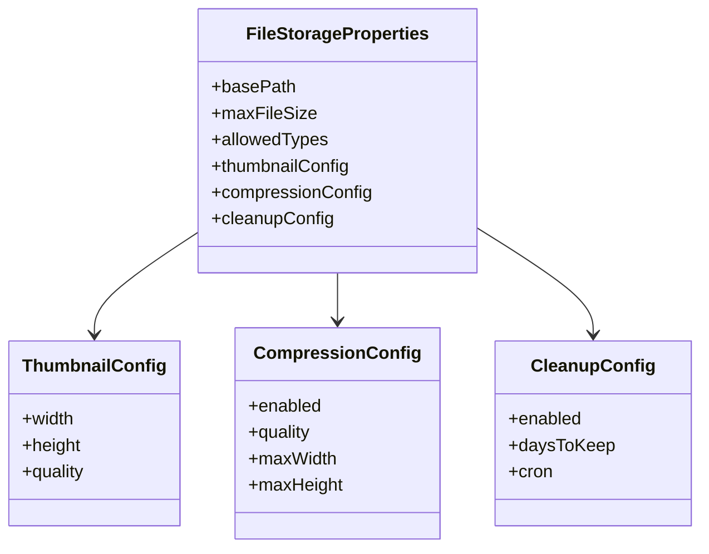

# 开发者指南

<cite>
**本文档中引用的文件**  
- [pom.xml](file://pom.xml)
- [README.md](file://README.md)
- [PhotoUploadApplication.java](file://src/main/java/com/photo/PhotoUploadApplication.java)
- [PhotoController.java](file://src/main/java/com/photo/controller/PhotoController.java)
- [PhotoService.java](file://src/main/java/com/photo/service/PhotoService.java)
- [PhotoRepository.java](file://src/main/java/com/photo/repository/PhotoRepository.java)
- [Photo.java](file://src/main/java/com/photo/entity/Photo.java)
- [FileStorageProperties.java](file://src/main/java/com/photo/config/FileStorageProperties.java)
- [SecurityConfig.java](file://src/main/java/com/photo/config/SecurityConfig.java)
- [FileUtils.java](file://src/main/java/com/photo/util/FileUtils.java)
- [application.yml](file://src/main/resources/application.yml)
- [PhotoControllerTest.java](file://src/test/java/com/photo/controller/PhotoControllerTest.java)
- [PhotoServiceTest.java](file://src/test/java/com/photo/service/PhotoServiceTest.java)
- [application-test.yml](file://src/test/resources/application-test.yml)
</cite>

## 目录
1. [简介](#简介)
2. [项目结构](#项目结构)
3. [编码规范与代码结构](#编码规范与代码结构)
4. [本地开发环境设置](#本地开发环境设置)
5. [构建与测试](#构建与测试)
6. [贡献流程](#贡献流程)
7. [添加新功能或修改逻辑](#添加新功能或修改逻辑)
8. [附录](#附录)

## 简介
本指南为希望为照片上传下载系统贡献代码或进行二次开发的开发者提供全面指导。项目基于Spring Boot 3.2.0构建，采用MVC分层架构，支持文件上传、下载、在线预览、断点续传等核心功能，并集成了安全控制、缓存机制和API文档。

**Section sources**
- [README.md](file://README.md#L1-L265)

## 项目结构
项目遵循标准的Maven目录结构，采用MVC模式进行分层设计：

```
src/main/java/com/photo/
├── config/              # 配置类
├── controller/          # 控制器层
├── dto/                 # 数据传输对象
├── entity/              # 实体类
├── exception/           # 异常类
├── repository/          # 数据访问层
├── service/             # 服务层
├── util/                # 工具类
└── PhotoUploadApplication.java # 主应用类
```



**Diagram sources**
- [PhotoUploadApplication.java](file://src/main/java/com/photo/PhotoUploadApplication.java#L1-L20)
- [PhotoController.java](file://src/main/java/com/photo/controller/PhotoController.java#L1-L316)
- [PhotoService.java](file://src/main/java/com/photo/service/PhotoService.java#L1-L385)
- [PhotoRepository.java](file://src/main/java/com/photo/repository/PhotoRepository.java#L1-L112)

**Section sources**
- [README.md](file://README.md#L200-L265)

## 编码规范与代码结构
### MVC分层架构
项目严格遵循MVC（Model-View-Controller）设计模式，各层职责明确：

- **控制器层（Controller）**：处理HTTP请求，参数校验，调用服务层
- **服务层（Service）**：实现核心业务逻辑，事务管理
- **数据访问层（Repository）**：数据库操作，数据持久化
- **实体类（Entity）**：数据模型定义
- **DTO（Data Transfer Object）**：前后端数据传输对象



**Diagram sources**
- [PhotoController.java](file://src/main/java/com/photo/controller/PhotoController.java#L1-L316)
- [PhotoService.java](file://src/main/java/com/photo/service/PhotoService.java#L1-L385)
- [PhotoRepository.java](file://src/main/java/com/photo/repository/PhotoRepository.java#L1-L112)
- [Photo.java](file://src/main/java/com/photo/entity/Photo.java#L1-L174)

### 编码规范
- 使用Lombok注解减少样板代码（@Data, @Builder, @Slf4j）
- 遵循Spring Boot最佳实践
- 使用JSR-303验证注解进行参数校验
- 异常处理采用全局异常处理器（GlobalExceptionHandler）
- 日志记录使用SLF4J + Logback
- API文档使用SpringDoc OpenAPI 3

**Section sources**
- [PhotoController.java](file://src/main/java/com/photo/controller/PhotoController.java#L1-L316)
- [PhotoService.java](file://src/main/java/com/photo/service/PhotoService.java#L1-L385)
- [Photo.java](file://src/main/java/com/photo/entity/Photo.java#L1-L174)

## 本地开发环境设置
### JDK版本要求
项目要求使用 **JDK 17** 或更高版本。

### IDE配置
推荐使用IntelliJ IDEA或Eclipse，配置如下：

1. 导入Maven项目
2. 启用注解处理器（Annotation Processors）
   - IntelliJ IDEA: Settings → Build → Annotation Processors → 勾选"Enable annotation processing"
   - Eclipse: Project Properties → Java Compiler → Annotation Processing → Enable annotation processing
3. 安装Lombok插件

### 依赖管理
项目使用Maven进行依赖管理，核心依赖包括：

| 依赖 | 版本 | 用途 |
|------|------|------|
| spring-boot-starter-parent | 3.2.0 | Spring Boot基础依赖 |
| spring-boot-starter-web | - | Web开发支持 |
| spring-boot-starter-data-jpa | - | 数据访问 |
| spring-boot-starter-security | - | 安全控制 |
| springdoc-openapi-starter-webmvc-ui | 2.3.0 | API文档 |
| lombok | - | 减少样板代码 |
| thumbnailator | 0.4.19 | 图片处理 |
| apache-tika | 2.9.1 | 文件类型检测 |

**Section sources**
- [pom.xml](file://pom.xml#L1-L155)
- [README.md](file://README.md#L100-L115)

## 构建与测试
### 构建生命周期
项目构建基于Maven，主要生命周期命令：

```bash
# 清理并打包
mvn clean package

# 编译
mvn compile

# 打包（跳过测试）
mvn package -DskipTests

# 安装到本地仓库
mvn install
```

### 运行测试
执行单元测试和集成测试：

```bash
# 运行所有测试
mvn test

# 运行特定测试类
mvn test -Dtest=PhotoServiceTest

# 跳过测试
mvn compile -DskipTests
```

### 生成代码覆盖率报告
使用JaCoCo插件生成代码覆盖率报告：

```bash
# 生成覆盖率报告
mvn test jacoco:report

# 报告输出路径
target/site/jacoco/index.html
```

项目已配置JaCoCo插件，无需额外配置。



**Diagram sources**
- [pom.xml](file://pom.xml#L1-L155)
- [PhotoControllerTest.java](file://src/test/java/com/photo/controller/PhotoControllerTest.java#L1-L174)
- [PhotoServiceTest.java](file://src/test/java/com/photo/service/PhotoServiceTest.java#L1-L210)

**Section sources**
- [pom.xml](file://pom.xml#L1-L155)
- [README.md](file://README.md#L180-L195)

## 贡献流程
### 分支管理
采用Git分支管理策略：

- `main`：主分支，保护分支，仅通过PR合并
- `develop`：开发分支，日常开发基于此分支
- `feature/*`：功能分支，命名规范：feature/功能描述
- `bugfix/*`：修复分支，命名规范：bugfix/问题描述
- `release/*`：发布分支

### 代码提交规范
提交信息遵循以下格式：

```
<类型>: <简短描述>

<详细描述>

<关联的Issue>
```

类型包括：feat、fix、docs、style、refactor、test、chore

示例：
```
feat: 添加断点续传下载功能

实现Range请求支持，允许大文件分段下载
优化下载性能，减少内存占用

closes #123
```

### Pull Request审查要求
PR必须满足以下条件：

1. 通过所有CI检查（编译、测试、代码风格）
2. 代码覆盖率不低于80%
3. 包含适当的单元测试
4. 文档更新（如有必要）
5. 通过至少一名核心成员审查
6. 解决所有审查意见

**Section sources**
- [README.md](file://README.md#L1-L265)

## 添加新功能或修改逻辑
### 添加新API端点
1. 在`controller`包中添加新方法
2. 使用Swagger注解添加API文档
3. 在`service`层实现业务逻辑
4. 添加相应的单元测试



**Diagram sources**
- [PhotoController.java](file://src/main/java/com/photo/controller/PhotoController.java#L1-L316)
- [PhotoService.java](file://src/main/java/com/photo/service/PhotoService.java#L1-L385)
- [PhotoRepository.java](file://src/main/java/com/photo/repository/PhotoRepository.java#L1-L112)

### 修改现有逻辑
1. 分析现有代码路径
2. 确保理解所有依赖关系
3. 修改服务层业务逻辑
4. 更新相关测试用例
5. 验证功能完整性

### 保持代码质量
- 遵循SOLID原则
- 保持方法单一职责
- 添加适当的日志记录
- 确保异常处理完整性
- 维持代码覆盖率

### 配置管理
通过`application.yml`和`@ConfigurationProperties`进行配置管理：



**Diagram sources**
- [FileStorageProperties.java](file://src/main/java/com/photo/config/FileStorageProperties.java#L1-L94)
- [application.yml](file://src/main/resources/application.yml#L1-L173)

**Section sources**
- [PhotoService.java](file://src/main/java/com/photo/service/PhotoService.java#L1-L385)
- [FileStorageProperties.java](file://src/main/java/com/photo/config/FileStorageProperties.java#L1-L94)
- [application.yml](file://src/main/resources/application.yml#L1-L173)

## 附录
### 应用配置说明
主要配置项位于`application.yml`：

```yaml
# 服务器配置
server:
  port: 8080
  servlet:
    context-path: /api

# 文件存储配置
file:
  storage:
    base-path: ./uploads
    max-file-size: 10485760  # 10MB
    max-storage-size: 10737418240  # 10GB

# 安全配置
security:
  cors:
    allowed-origins:
      - http://localhost:3000
```

**Section sources**
- [application.yml](file://src/main/resources/application.yml#L1-L173)
- [application-test.yml](file://src/test/resources/application-test.yml#L1-L75)

### 测试配置
测试环境使用独立配置文件`application-test.yml`，主要差异：

- 使用内存数据库H2
- 禁用生产环境特性（如文件压缩）
- 不同的存储路径
- 简化的安全配置

**Section sources**
- [application-test.yml](file://src/test/resources/application-test.yml#L1-L75)