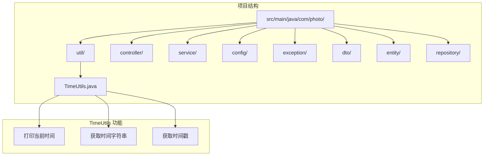
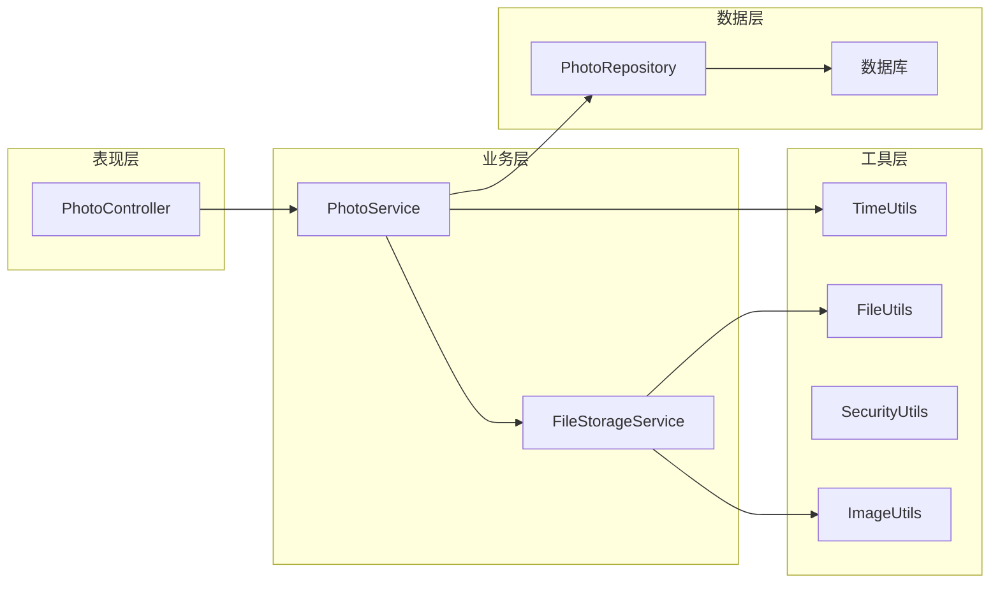
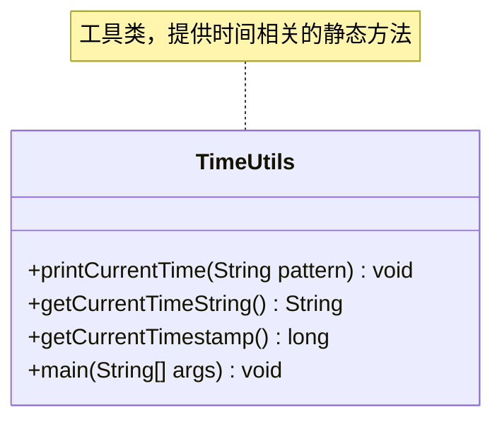
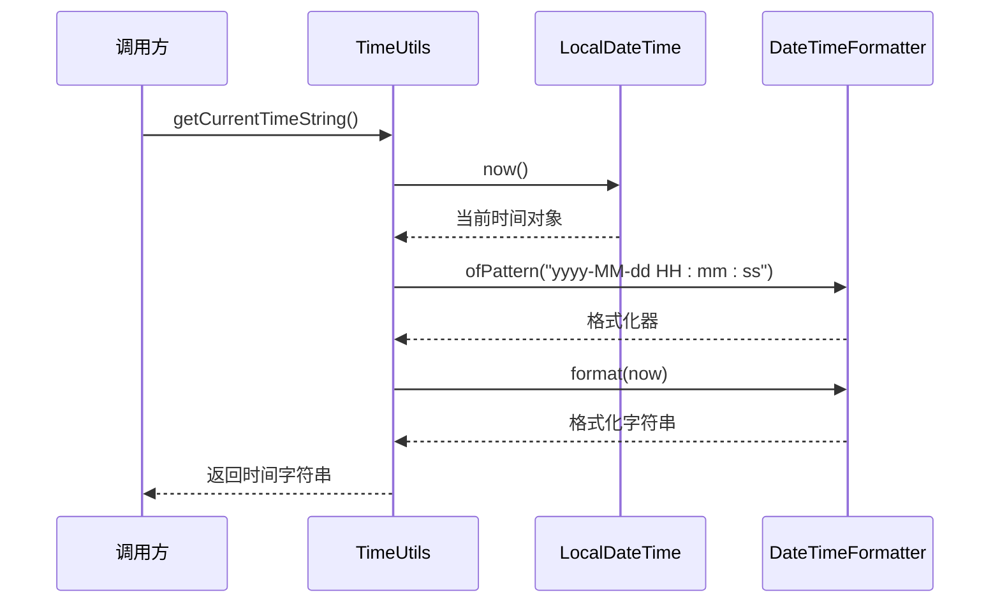
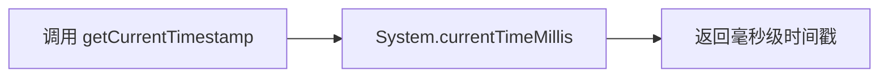
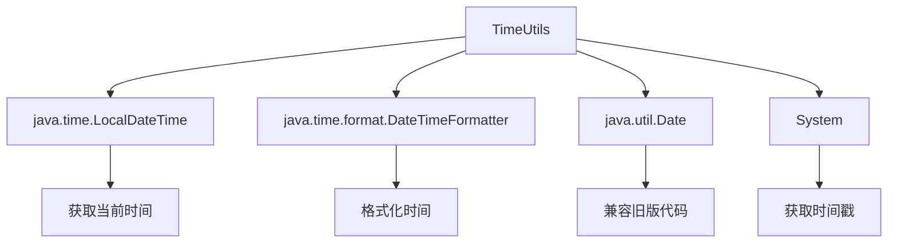

# TimeUtils 时间工具类

<cite>
**本文档中引用的文件**
- [TimeUtils.java](file://src/main/java/com/photo/TimeUtils.java)
- [PhotoUploadApplication.java](file://src/main/java/com/photo/PhotoUploadApplication.java)
- [FileStorageService.java](file://src/main/java/com/photo/service/FileStorageService.java)
- [PhotoController.java](file://src/main/java/com/photo/controller/PhotoController.java)
- [application.yml](file://src/main/resources/application.yml)
- [README.md](file://README.md)
- [PROJECT_SUMMARY.md](file://PROJECT_SUMMARY.md)
</cite>

## 目录
1. [简介](#简介)
2. [项目结构](#项目结构)
3. [核心组件](#核心组件)
4. [架构概览](#架构概览)
5. [详细组件分析](#详细组件分析)
6. [依赖关系分析](#依赖关系分析)
7. [性能考虑](#性能考虑)
8. [故障排除指南](#故障排除指南)
9. [结论](#结论)

## 简介

TimeUtils 是一个专门用于时间处理的工具类，位于 `com.photo` 包中。作为照片上传下载系统中的辅助工具类，它提供了简单而实用的时间操作功能，主要用于日志记录、调试和系统状态展示。

该工具类采用静态方法设计，提供了三种主要的时间操作功能：
- 打印当前时间（支持自定义格式）
- 获取格式化的时间字符串
- 获取当前时间戳

虽然功能相对简单，但在整个系统中扮演着重要的角色，特别是在日志记录和调试过程中发挥关键作用。

## 项目结构

TimeUtils 类在整个项目中的位置体现了其作为工具类的定位：



**图表来源**
- [TimeUtils.java](file://src/main/java/com/photo/TimeUtils.java#L1-L62)

**章节来源**
- [TimeUtils.java](file://src/main/java/com/photo/TimeUtils.java#L1-L62)
- [PROJECT_SUMMARY.md](file://PROJECT_SUMMARY.md#L1-L50)

## 核心组件

TimeUtils 类的核心功能围绕 Java 8 的 `java.time` 包构建，具体包含以下三个主要方法：

### 方法概览

| 方法名称 | 返回类型 | 功能描述 |
|---------|---------|----------|
| `printCurrentTime(String pattern)` | `void` | 打印当前时间，支持自定义格式 |
| `getCurrentTimeString()` | `String` | 获取格式化的时间字符串 |
| `getCurrentTimestamp()` | `long` | 获取当前时间戳（毫秒） |

### 时间格式化支持

该工具类支持使用标准的日期时间模式进行格式化，例如：
- `"yyyy-MM-dd HH:mm:ss"` - 标准日期时间格式
- `"yyyy年MM月dd日 HH:mm:ss"` - 中文格式日期时间
- `"HH:mm:ss"` - 仅显示时间部分

**章节来源**
- [TimeUtils.java](file://src/main/java/com/photo/TimeUtils.java#L12-L42)

## 架构概览

TimeUtils 在整个系统架构中的位置体现了其作为基础设施组件的特点：



**图表来源**
- [PhotoController.java](file://src/main/java/com/photo/controller/PhotoController.java#L1-L50)
- [FileStorageService.java](file://src/main/java/com/photo/service/FileStorageService.java#L1-L50)

## 详细组件分析

### TimeUtils 类结构分析



**图表来源**
- [TimeUtils.java](file://src/main/java/com/photo/TimeUtils.java#L9-L62)

#### 方法实现细节

##### 1. 打印当前时间方法

该方法是 TimeUtils 的核心功能之一，支持自定义时间格式：

```mermaid
flowchart TD
A[调用 printCurrentTime] --> B[获取当前 LocalDateTime]
B --> C[创建 DateTimeFormatter]
C --> D[格式化时间]
D --> E[输出到控制台]
E --> F[添加前缀 "当前时间: "]
```

**图表来源**
- [TimeUtils.java](file://src/main/java/com/photo/TimeUtils.java#L14-L20)

##### 2. 获取时间字符串方法

此方法提供标准化的时间字符串输出，使用固定的格式模式：



**图表来源**
- [TimeUtils.java](file://src/main/java/com/photo/TimeUtils.java#L25-L30)

##### 3. 获取时间戳方法

该方法直接调用 Java 标准库的系统时间戳获取功能：



**图表来源**
- [TimeUtils.java](file://src/main/java/com/photo/TimeUtils.java#L35-L37)

### 主方法演示功能

TimeUtils 类包含了完整的使用示例，展示了各种时间操作方式：

```mermaid
flowchart TD
A[main 方法] --> B[方式1: 默认格式打印]
A --> C[方式2: 自定义格式打印]
A --> D[方式3: 获取时间字符串]
A --> E[方式4: 获取时间戳]
B --> F[printCurrentTime()]
C --> G[printCurrentTime("yyyy年MM月dd日 HH:mm:ss")]
D --> H[getCurrentTimeString]
E --> I[getCurrentTimestamp]
```

**图表来源**
- [TimeUtils.java](file://src/main/java/com/photo/TimeUtils.java#L44-L60)

**章节来源**
- [TimeUtils.java](file://src/main/java/com/photo/TimeUtils.java#L1-L62)

## 依赖关系分析

TimeUtils 类的依赖关系非常简洁，体现了其作为工具类的设计原则：



**图表来源**
- [TimeUtils.java](file://src/main/java/com/photo/TimeUtils.java#L3-L5)

### 外部依赖

TimeUtils 依赖于 Java 8 的 `java.time` 包，这确保了：
- 线程安全性
- 现代化的日期时间 API
- 丰富的格式化选项

**章节来源**
- [TimeUtils.java](file://src/main/java/com/photo/TimeUtils.java#L1-L62)

## 性能考虑

TimeUtils 类在设计时充分考虑了性能因素：

### 内存使用
- 静态方法设计避免了实例化开销
- 使用局部变量减少内存占用
- 格式化器按需创建，不进行缓存

### 执行效率
- 直接调用 Java 标准库方法，无额外开销
- 时间戳获取使用系统级调用
- 格式化操作针对常见模式优化

### 并发安全性
- 所有方法都是线程安全的
- 不共享任何可变状态
- 使用不可变的 LocalDateTime 对象

## 故障排除指南

### 常见问题及解决方案

#### 1. 时间格式化异常
**问题**: 使用无效的日期时间模式导致格式化失败

**解决方案**: 
- 确保使用正确的模式字符串
- 参考 Java DateTimeFormatter 文档
- 使用预定义的常用模式

#### 2. 时区相关问题
**问题**: 不同时区下的时间显示不一致

**解决方案**:
- 明确指定时区（如果需要）
- 使用 UTC 时间进行内部处理
- 在显示时转换为目标时区

#### 3. 性能问题
**问题**: 频繁调用时间获取方法影响性能

**解决方案**:
- 考虑在需要的地方缓存时间值
- 批量处理时间相关操作
- 避免在循环中频繁调用

**章节来源**
- [TimeUtils.java](file://src/main/java/com/photo/TimeUtils.java#L14-L20)

## 结论

TimeUtils 时间工具类虽然功能相对简单，但在整个照片上传下载系统中发挥着重要作用。它提供了：
- 简洁易用的时间操作接口
- 灵活的格式化选项
- 高性能的实现方式
- 完整的使用示例

该工具类的设计体现了现代 Java 开发的最佳实践，使用了 Java 8 的 `java.time` 包，确保了线程安全性和现代化的 API 设计。在实际应用中，它主要用于日志记录、调试输出和系统状态展示，为开发者提供了便利的时间处理功能。

对于类似的项目，TimeUtils 提供了一个优秀的工具类设计模板，展示了如何创建简洁、高效且易于使用的工具类。