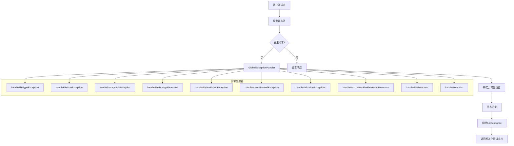
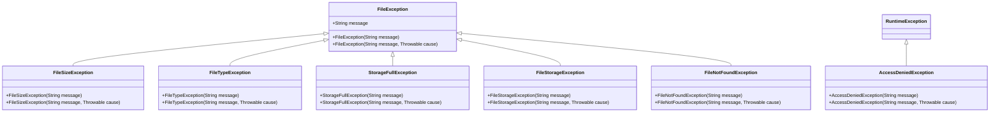
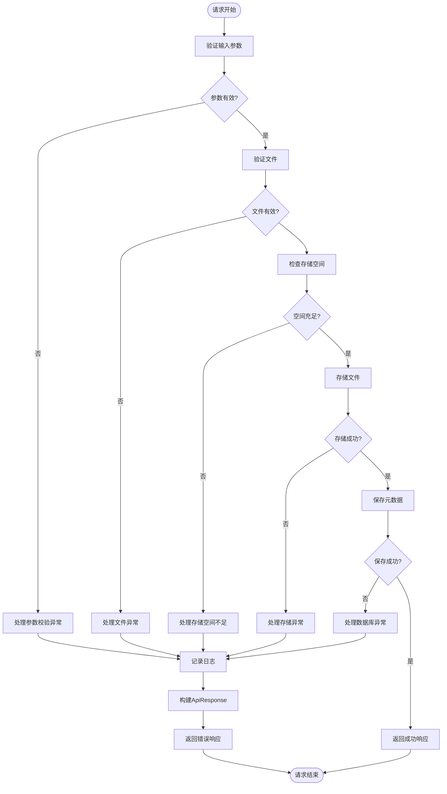
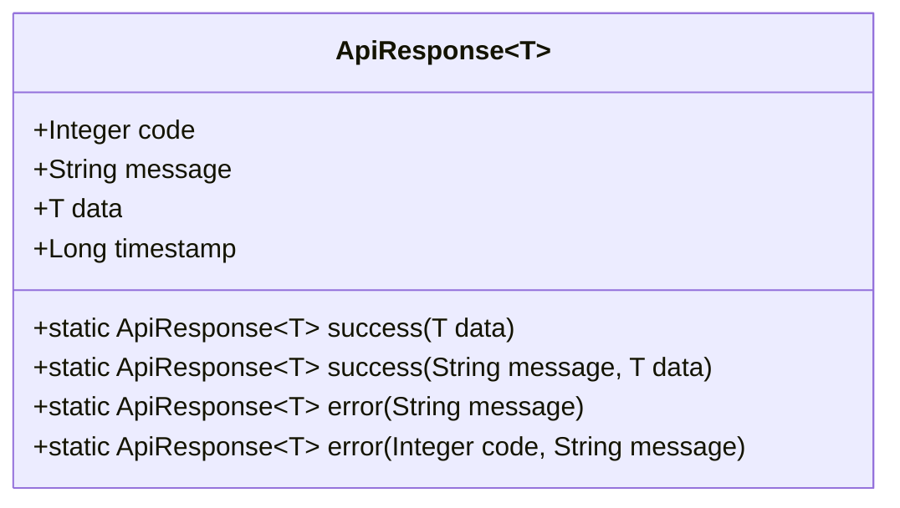
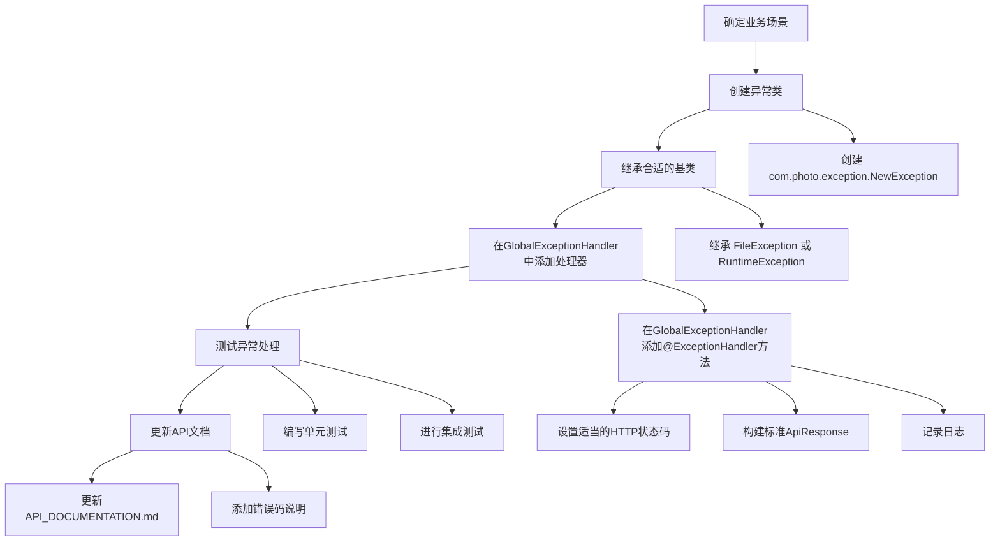

# 异常处理

<cite>
**本文档引用的文件**
- [GlobalExceptionHandler.java](file://src/main/java/com/photo/exception/GlobalExceptionHandler.java)
- [ApiResponse.java](file://src/main/java/com/photo/dto/ApiResponse.java)
- [FileSizeException.java](file://src/main/java/com/photo/exception/FileSizeException.java)
- [FileTypeException.java](file://src/main/java/com/photo/exception/FileTypeException.java)
- [StorageFullException.java](file://src/main/java/com/photo/exception/StorageFullException.java)
- [FileException.java](file://src/main/java/com/photo/exception/FileException.java)
- [FileStorageException.java](file://src/main/java/com/photo/exception/FileStorageException.java)
- [AccessDeniedException.java](file://src/main/java/com/photo/exception/AccessDeniedException.java)
- [FileNotFoundException.java](file://src/main/java/com/photo/exception/FileNotFoundException.java)
- [PhotoService.java](file://src/main/java/com/photo/service/PhotoService.java)
- [FileUtils.java](file://src/main/java/com/photo/util/FileUtils.java)
- [FileStorageService.java](file://src/main/java/com/photo/service/FileStorageService.java)
- [API_DOCUMENTATION.md](file://API_DOCUMENTATION.md)
</cite>

## 目录
1. [简介](#简介)
2. [全局异常处理架构](#全局异常处理架构)
3. [核心异常类型分析](#核心异常类型分析)
4. [异常处理流程](#异常处理流程)
5. [错误响应格式](#错误响应格式)
6. [异常日志记录策略](#异常日志记录策略)
7. [新增异常类型指南](#新增异常类型指南)
8. [常见错误码与解决方案](#常见错误码与解决方案)
9. [结论](#结论)

## 简介
本项目采用统一的异常处理机制，通过`@ControllerAdvice`注解实现全局异常捕获和处理。系统定义了多种自定义异常类型，如`FileSizeException`、`FileTypeException`、`StorageFullException`等，用于精确描述不同业务场景下的错误情况。所有异常最终都被转换为标准化的`ApiResponse`格式返回给客户端，确保了API响应的一致性和可预测性。结合详细的错误码说明和解决建议，为开发者和用户提供清晰的错误诊断路径。

## 全局异常处理架构



**图示来源**
- [GlobalExceptionHandler.java](file://src/main/java/com/photo/exception/GlobalExceptionHandler.java#L1-L139)

**本节来源**
- [GlobalExceptionHandler.java](file://src/main/java/com/photo/exception/GlobalExceptionHandler.java#L1-L139)

## 核心异常类型分析

### 自定义异常继承体系



**图示来源**
- [FileException.java](file://src/main/java/com/photo/exception/FileException.java#L1-L15)
- [FileSizeException.java](file://src/main/java/com/photo/exception/FileSizeException.java#L1-L15)
- [FileTypeException.java](file://src/main/java/com/photo/exception/FileTypeException.java#L1-L15)
- [StorageFullException.java](file://src/main/java/com/photo/exception/StorageFullException.java#L1-L15)
- [FileStorageException.java](file://src/main/java/com/photo/exception/FileStorageException.java#L1-L15)
- [FileNotFoundException.java](file://src/main/java/com/photo/exception/FileNotFoundException.java#L1-L15)
- [AccessDeniedException.java](file://src/main/java/com/photo/exception/AccessDeniedException.java#L1-L15)

**本节来源**
- [FileException.java](file://src/main/java/com/photo/exception/FileException.java#L1-L15)
- [FileSizeException.java](file://src/main/java/com/photo/exception/FileSizeException.java#L1-L15)
- [FileTypeException.java](file://src/main/java/com/photo/exception/FileTypeException.java#L1-L15)
- [StorageFullException.java](file://src/main/java/com/photo/exception/StorageFullException.java#L1-L15)

### 异常类型详细说明

#### FileSizeException
表示文件大小超出限制的异常。当上传文件大小超过配置的最大值或单次上传文件数量超过限制时抛出。

**触发条件：**
- 单个文件大小超过10MB限制
- 批量上传文件数量超过配置的最大值

**业务含义：** 防止用户上传过大的文件导致服务器资源耗尽。

**本节来源**
- [FileSizeException.java](file://src/main/java/com/photo/exception/FileSizeException.java#L1-L15)
- [PhotoService.java](file://src/main/java/com/photo/service/PhotoService.java#L315)

#### FileTypeException
表示文件类型不被支持的异常。当上传的文件类型不在允许列表中时抛出。

**触发条件：**
- 文件MIME类型不在允许的图片类型列表中
- 文件扩展名不在允许的扩展名列表中
- 文件为空或无法读取

**业务含义：** 确保系统只处理安全的图片文件，防止恶意文件上传。

**本节来源**
- [FileTypeException.java](file://src/main/java/com/photo/exception/FileTypeException.java#L1-L15)
- [FileUtils.java](file://src/main/java/com/photo/util/FileUtils.java#L83-L99)

#### StorageFullException
表示存储空间不足的异常。使用HTTP 507状态码，明确指示存储容量问题。

**触发条件：**
- 系统检查可用存储空间时发现不足以容纳新文件

**业务含义：** 提醒管理员需要扩展存储容量，同时告知用户当前无法上传新文件。

**本节来源**
- [StorageFullException.java](file://src/main/java/com/photo/exception/StorageFullException.java#L1-L15)
- [PhotoService.java](file://src/main/java/com/photo/service/PhotoService.java#L60)

## 异常处理流程



**图示来源**
- [PhotoService.java](file://src/main/java/com/photo/service/PhotoService.java#L50-L150)
- [FileStorageService.java](file://src/main/java/com/photo/service/FileStorageService.java#L50-L100)

**本节来源**
- [PhotoService.java](file://src/main/java/com/photo/service/PhotoService.java#L50-L150)
- [FileStorageService.java](file://src/main/java/com/photo/service/FileStorageService.java#L50-L100)

## 错误响应格式

### 统一响应结构



**图示来源**
- [ApiResponse.java](file://src/main/java/com/photo/dto/ApiResponse.java#L1-L62)

**本节来源**
- [ApiResponse.java](file://src/main/java/com/photo/dto/ApiResponse.java#L1-L62)

### 响应字段说明

| 字段名 | 类型 | 说明 |
|--------|------|------|
| code | Integer | 响应码，遵循HTTP状态码和自定义错误码 |
| message | String | 响应消息，描述错误的具体信息 |
| data | T | 响应数据，成功时包含业务数据，失败时为null |
| timestamp | Long | 时间戳，记录响应生成的时间 |

## 异常日志记录策略

### 日志记录原则
系统采用SLF4J日志框架，结合Lombok的`@Slf4j`注解实现日志记录。所有异常处理都会记录详细的错误信息，包括异常消息和堆栈跟踪（对于严重异常）。

**日志记录要点：**
- 所有异常都会被记录到日志中
- 包含异常类型和消息
- 对于严重异常（如`FileStorageException`、`Exception`），记录完整的堆栈跟踪
- 使用结构化日志格式，便于日志分析和监控

### 日志级别映射

| 异常类型 | 日志级别 | 说明 |
|----------|----------|------|
| FileTypeException | ERROR | 文件类型错误 |
| FileSizeException | ERROR | 文件大小错误 |
| StorageFullException | ERROR | 存储空间不足 |
| FileStorageException | ERROR | 文件存储失败 |
| FileNotFoundException | ERROR | 文件未找到 |
| AccessDeniedException | ERROR | 访问被拒绝 |
| MethodArgumentNotValidException | ERROR | 参数校验失败 |
| FileException | ERROR | 通用文件异常 |
| Exception | ERROR | 系统内部错误 |

**本节来源**
- [GlobalExceptionHandler.java](file://src/main/java/com/photo/exception/GlobalExceptionHandler.java#L1-L139)
- [PhotoService.java](file://src/main/java/com/photo/service/PhotoService.java#L100)

## 新增异常类型指南

### 添加新异常类型的步骤



**本节来源**
- [GlobalExceptionHandler.java](file://src/main/java/com/photo/exception/GlobalExceptionHandler.java#L1-L139)
- [FileException.java](file://src/main/java/com/photo/exception/FileException.java#L1-L15)

### 代码示例模板
当需要添加新的异常类型时，遵循以下模式：

1. **创建异常类**：继承`FileException`或`RuntimeException`，根据业务需求选择
2. **在GlobalExceptionHandler中添加处理器**：使用`@ExceptionHandler`注解标记处理方法
3. **设置适当的HTTP状态码**：根据错误性质选择合适的HTTP状态码
4. **构建标准响应**：使用`ApiResponse.error()`方法创建标准化响应
5. **记录日志**：使用`log.error()`记录错误信息

## 常见错误码与解决方案

### 错误码对照表

| 错误码 | HTTP状态码 | 说明 | 示例消息 | 解决方案 |
|--------|------------|------|----------|----------|
| 400 | BAD_REQUEST | 请求参数错误 | "不支持的文件类型: text/plain" | 检查上传文件类型，确保为支持的图片格式 |
| 400 | BAD_REQUEST | 文件大小超限 | "文件大小不能超过 10.00 MB" | 压缩文件或上传更小的文件 |
| 403 | FORBIDDEN | 访问被拒绝 | "无权删除该照片" | 确认用户身份和权限 |
| 404 | NOT_FOUND | 资源不存在 | "照片不存在: 123" | 检查资源ID是否正确 |
| 500 | INTERNAL_SERVER_ERROR | 服务器内部错误 | "文件存储失败" | 联系管理员检查服务器状态 |
| 507 | INSUFFICIENT_STORAGE | 存储空间不足 | "存储空间不足" | 清理空间或联系管理员扩容 |

**本节来源**
- [API_DOCUMENTATION.md](file://API_DOCUMENTATION.md#L1-L509)
- [GlobalExceptionHandler.java](file://src/main/java/com/photo/exception/GlobalExceptionHandler.java#L1-L139)

### 典型错误响应示例

#### 文件类型错误
```json
{
  "code": 400,
  "message": "不支持的文件类型: text/plain",
  "data": null,
  "timestamp": 1704110400000
}
```

#### 文件大小超限
```json
{
  "code": 400,
  "message": "文件大小超过限制",
  "data": null,
  "timestamp": 1704110400000
}
```

#### 存储空间不足
```json
{
  "code": 507,
  "message": "存储空间不足",
  "data": null,
  "timestamp": 1704110400000
}
```

#### 访问被拒绝
```json
{
  "code": 403,
  "message": "无权删除该照片",
  "data": null,
  "timestamp": 1704110400000
}
```

**本节来源**
- [API_DOCUMENTATION.md](file://API_DOCUMENTATION.md#L1-L509)
- [GlobalExceptionHandler.java](file://src/main/java/com/photo/exception/GlobalExceptionHandler.java#L1-L139)

## 结论
本项目的异常处理机制设计完善，通过`GlobalExceptionHandler`实现了全局统一的异常捕获和处理。系统定义了清晰的异常继承体系，从`FileException`基类派生出各种具体的业务异常，如`FileSizeException`、`FileTypeException`等。所有异常都被转换为标准化的`ApiResponse`格式，确保了API响应的一致性。详细的日志记录策略保证了问题的可追溯性，而清晰的错误码说明和解决建议则为用户和开发者提供了有效的故障排除指导。该机制不仅提高了系统的健壮性，也增强了用户体验。