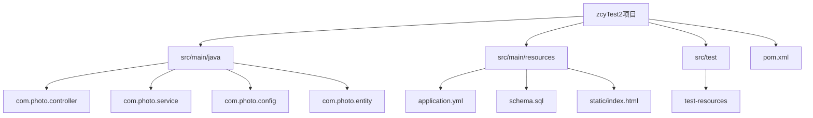
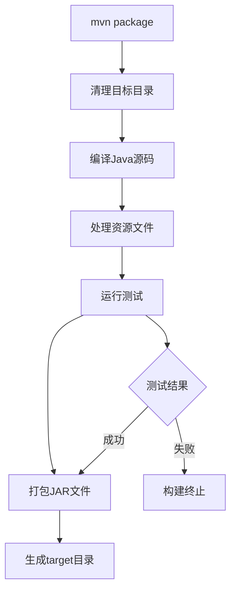
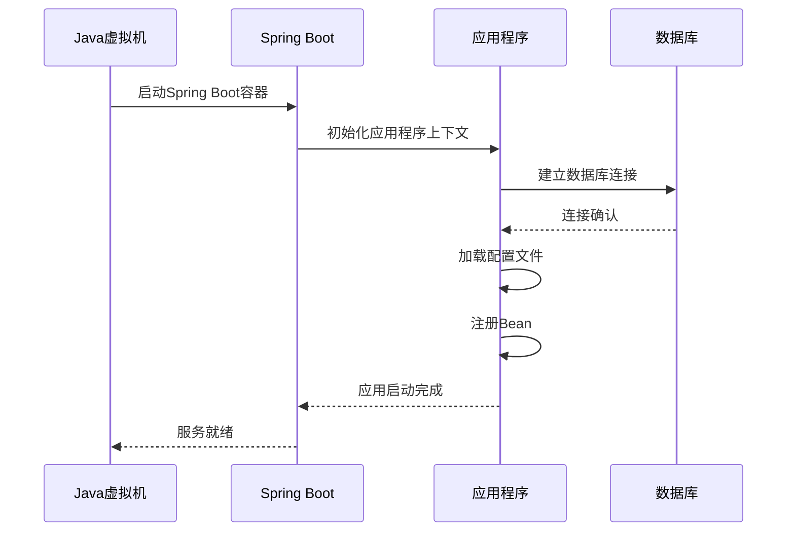
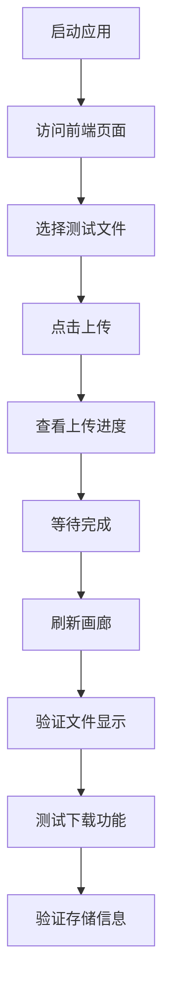
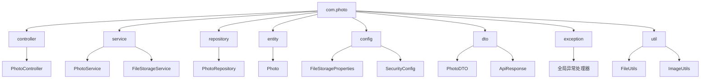

# 快速开始

<cite>
**本文档中引用的文件**
- [pom.xml](file://pom.xml)
- [src/main/resources/application.yml](file://src/main/resources/application.yml)
- [src/main/java/com/photo/PhotoUploadApplication.java](file://src/main/java/com/photo/PhotoUploadApplication.java)
- [src/main/java/com/photo/config/FileStorageProperties.java](file://src/main/java/com/photo/config/FileStorageProperties.java)
- [src/main/java/com/photo/controller/PhotoController.java](file://src/main/java/com/photo/controller/PhotoController.java)
- [src/main/resources/schema.sql](file://src/main/resources/schema.sql)
- [src/test/resources/application-test.yml](file://src/test/resources/application-test.yml)
- [src/main/resources/static/index.html](file://src/main/resources/static/index.html)
- [README.md](file://README.md)
</cite>

## 目录
1. [项目简介](#项目简介)
2. [环境要求](#环境要求)
3. [项目克隆与配置](#项目克隆与配置)
4. [数据库配置](#数据库配置)
5. [编译与构建](#编译与构建)
6. [运行应用](#运行应用)
7. [访问应用](#访问应用)
8. [功能测试](#功能测试)
9. [常见问题解决](#常见问题解决)
10. [项目结构概览](#项目结构概览)

## 项目简介

zcyTest2是一个基于Spring Boot 3.2.0开发的企业级照片上传下载系统，提供完整的文件管理功能，包括上传、下载、在线预览、断点续传等核心功能。该系统采用现代化的技术栈，具备完善的文件安全检查、性能优化和存储管理能力。

### 核心特性
- **文件上传**：支持单文件和批量上传，文件类型验证，大小限制
- **文件下载**：支持断点续传，访问权限控制
- **安全特性**：文件类型安全检查，防盗链，XSS防护
- **性能优化**：图片压缩，缩略图生成，缓存机制
- **存储管理**：定期清理，容量监控，软删除

**章节来源**
- [README.md](file://README.md#L1-L50)
- [pom.xml](file://pom.xml#L1-L30)

## 环境要求

在开始之前，请确保您的开发环境满足以下要求：

### JDK 版本要求
- **JDK 17+**：推荐使用OpenJDK 17或Oracle JDK 17
- **Java版本验证**：
  ```bash
  java -version
  ```
  输出应显示版本号17或更高

### Maven 版本要求
- **Maven 3.6+**：用于项目构建和依赖管理
- **Maven版本验证**：
  ```bash
  mvn -v
  ```

### 可选数据库要求（生产环境）
- **MySQL 5.7+**：用于生产环境的数据持久化
- **H2数据库**：默认开发环境数据库，无需额外安装

### 开发工具建议
- **IDE**：IntelliJ IDEA、Eclipse或VS Code
- **Git**：版本控制工具
- **浏览器**：Chrome、Firefox等现代浏览器

**章节来源**
- [pom.xml](file://pom.xml#L20-L25)
- [README.md](file://README.md#L51-L55)

## 项目克隆与配置

### 1. 克隆项目

```bash
git clone https://github.com/your-repository/zcyTest2.git
cd zcyTest2
```

### 2. 项目结构检查

项目采用标准的Maven结构：



**图表来源**
- [pom.xml](file://pom.xml#L1-L155)
- [src/main/java/com/photo/PhotoUploadApplication.java](file://src/main/java/com/photo/PhotoUploadApplication.java#L1-L20)

### 3. 依赖分析

项目主要依赖包括：

| 依赖组件 | 版本 | 用途 |
|---------|------|------|
| Spring Boot | 3.2.0 | 核心框架 |
| Spring Data JPA | 内置 | 数据访问层 |
| Spring Security | 内置 | 安全框架 |
| H2 Database | runtime | 开发数据库 |
| MySQL Connector | runtime | 生产数据库 |
| Lombok | 内置 | 代码简化 |
| Apache Commons IO | 2.11.0 | 文件操作 |
| Thumbnailator | 0.4.19 | 图片处理 |
| Apache Tika | 2.9.1 | 文件类型检测 |
| Caffeine | 内置 | 缓存机制 |
| SpringDoc OpenAPI | 2.3.0 | API文档 |

**章节来源**
- [pom.xml](file://pom.xml#L30-L120)

## 数据库配置

### 1. 默认H2数据库配置

项目默认使用H2内存数据库进行开发：

```yaml
spring:
  datasource:
    url: jdbc:h2:file:./data/photodb
    driver-class-name: org.h2.Driver
    username: sa
    password: 
```

### 2. MySQL生产环境配置

如需使用MySQL数据库，请修改配置：

```yaml
spring:
  datasource:
    url: jdbc:mysql://localhost:3306/photo_db?useUnicode=true&characterEncoding=utf8&useSSL=false&serverTimezone=Asia/Shanghai
    driver-class-name: com.mysql.cj.jdbc.Driver
    username: root
    password: your_password
```

### 3. 数据库初始化

系统支持自动表创建（DDL-AUTO: update），也可以使用提供的SQL脚本：

```sql
-- 创建照片表
CREATE TABLE IF NOT EXISTS photos (
    id BIGINT AUTO_INCREMENT PRIMARY KEY,
    original_filename VARCHAR(500) NOT NULL,
    stored_filename VARCHAR(100) NOT NULL UNIQUE,
    file_path VARCHAR(1000) NOT NULL,
    -- 更多字段...
);
```

**章节来源**
- [src/main/resources/application.yml](file://src/main/resources/application.yml#L5-L25)
- [src/main/resources/schema.sql](file://src/main/resources/schema.sql#L1-L37)

## 编译与构建

### 1. 清理和打包

使用Maven命令进行项目构建：

```bash
# 清理旧的构建文件
mvn clean

# 编译并打包项目
mvn package
```

### 2. 构建过程详解



**图表来源**
- [pom.xml](file://pom.xml#L120-L135)

### 3. 构建产物

构建完成后，将在`target/`目录下生成：
- `photo-upload-system-1.0.0.jar`：可执行的Spring Boot应用程序
- `classes/`：编译后的类文件
- `test-classes/`：测试类文件

**章节来源**
- [pom.xml](file://pom.xml#L120-L135)

## 运行应用

### 方法一：使用Spring Boot Maven插件

```bash
# 直接运行（推荐用于开发）
mvn spring-boot:run
```

### 方法二：运行编译后的JAR包

```bash
# 运行打包后的应用程序
java -jar target/photo-upload-system-1.0.0.jar
```

### 3. 启动参数配置

可以通过命令行参数覆盖配置：

```bash
# 指定不同的配置文件
java -jar target/photo-upload-system-1.0.0.jar --spring.profiles.active=prod

# 指定端口号
java -jar target/photo-upload-system-1.0.0.jar --server.port=8081
```

### 4. 应用启动流程



**图表来源**
- [src/main/java/com/photo/PhotoUploadApplication.java](file://src/main/java/com/photo/PhotoUploadApplication.java#L15-L19)

**章节来源**
- [src/main/java/com/photo/PhotoUploadApplication.java](file://src/main/java/com/photo/PhotoUploadApplication.java#L1-L20)

## 访问应用

### 1. 主要访问地址

应用启动后，可通过以下地址访问：

| 地址 | 功能 | 描述 |
|------|------|------|
| `http://localhost:8080/api` | 前端测试页面 | 提供文件上传和浏览界面 |
| `http://localhost:8080/api/swagger-ui.html` | API文档 | Swagger交互式API文档 |
| `http://localhost:8080/api/h2-console` | H2控制台 | 数据库管理界面（开发环境） |

### 2. H2控制台配置

H2数据库控制台默认启用：

```yaml
spring:
  h2:
    console:
      enabled: true
      path: /h2-console
```

访问步骤：
1. 打开 `http://localhost:8080/api/h2-console`
2. JDBC URL: `jdbc:h2:file:./data/photodb`
3. 用户名: `sa`
4. 密码: 留空

### 3. API文档访问

系统集成了Swagger/OpenAPI文档：

- **API文档路径**: `/api/api-docs`
- **UI界面路径**: `/api/swagger-ui.html`
- **支持的HTTP方法**: GET, POST, PUT, DELETE

**章节来源**
- [src/main/resources/application.yml](file://src/main/resources/application.yml#L25-L35)
- [src/main/resources/application.yml](file://src/main/resources/application.yml#L165-L173)

## 功能测试

### 1. 前端测试页面功能

打开 `http://localhost:8080/api`，您将看到：

- **文件上传区域**：支持多文件选择和批量上传
- **上传进度条**：实时显示上传进度
- **照片画廊**：展示已上传的照片
- **存储空间信息**：显示当前存储使用情况

### 2. API接口测试

#### 上传测试
```bash
# 单文件上传
curl -X POST "http://localhost:8080/api/photos/upload" \
  -F "file=@test-image.jpg" \
  -F "userId=guest" \
  -H "Content-Type: multipart/form-data"

# 批量上传
curl -X POST "http://localhost:8080/api/photos/upload/batch" \
  -F "files=@image1.jpg" \
  -F "files=@image2.png" \
  -F "userId=guest" \
  -H "Content-Type: multipart/form-data"
```

#### 下载测试
```bash
# 获取照片列表
curl -X GET "http://localhost:8080/api/photos/public?page=0&size=10"

# 下载照片
curl -X GET "http://localhost:8080/api/photos/download/{filename}" \
  -o downloaded-image.jpg
```

### 3. 存储信息查询
```bash
# 获取存储空间信息
curl -X GET "http://localhost:8080/api/photos/storage/info"
```

### 4. 功能测试流程



**图表来源**
- [src/main/resources/static/index.html](file://src/main/resources/static/index.html#L200-L300)

**章节来源**
- [src/main/resources/static/index.html](file://src/main/resources/static/index.html#L1-L50)
- [src/main/java/com/photo/controller/PhotoController.java](file://src/main/java/com/photo/controller/PhotoController.java#L1-L50)

## 常见问题解决

### 1. 端口冲突问题

**问题现象**：应用启动时提示端口被占用

**解决方案**：
```bash
# 查找占用端口的进程
netstat -ano | findstr :8080

# 杀死占用进程（Windows示例）
taskkill /PID <进程ID> /F

# 或者更改应用端口
java -jar target/photo-upload-system-1.0.0.jar --server.port=8081
```

### 2. 依赖下载失败

**问题现象**：Maven构建时出现网络错误

**解决方案**：
```bash
# 使用国内镜像源
mvn clean package -Dmaven.repo.local=./.m2/repository

# 或配置settings.xml使用阿里云镜像
# 在~/.m2/settings.xml中添加：
<mirror>
  <id>aliyun</id>
  <name>Aliyun Maven</name>
  <url>https://maven.aliyun.com/repository/public</url>
  <mirrorOf>central</mirrorOf>
</mirror>
```

### 3. 数据库连接问题

**问题现象**：应用启动时数据库连接失败

**解决方案**：
```yaml
# 检查数据库配置
spring:
  datasource:
    url: jdbc:mysql://localhost:3306/photo_db?useUnicode=true&characterEncoding=utf8&useSSL=false&serverTimezone=Asia/Shanghai
    username: root
    password: your_password

# 确保MySQL服务已启动
# Windows: net start mysql
# Linux: systemctl start mysql
```

### 4. 文件存储权限问题

**问题现象**：文件上传失败，提示权限不足

**解决方案**：
```bash
# 检查存储目录权限
ls -la uploads/

# 修改权限（Linux/Mac）
chmod -R 755 uploads/

# 或设置更宽松的权限（开发环境）
chmod -R 777 uploads/
```

### 5. 内存不足问题

**问题现象**：大文件上传时出现OutOfMemoryError

**解决方案**：
```bash
# 增加JVM堆内存
java -Xmx1g -jar target/photo-upload-system-1.0.0.jar

# 或修改Maven构建内存设置
export MAVEN_OPTS="-Xmx1024m -XX:MaxPermSize=512m"
```

### 6. 依赖冲突解决

**问题现象**：运行时出现ClassNotFoundException

**解决方案**：
```bash
# 清理并重新构建
mvn clean install

# 检查依赖树
mvn dependency:tree

# 排除冲突依赖
<dependency>
    <groupId>org.springframework.boot</groupId>
    <artifactId>spring-boot-starter-web</artifactId>
    <exclusions>
        <exclusion>
            <groupId>org.springframework.boot</groupId>
            <artifactId>spring-boot-starter-tomcat</artifactId>
        </exclusion>
    </exclusions>
</dependency>
```

**章节来源**
- [pom.xml](file://pom.xml#L20-L30)
- [src/main/resources/application.yml](file://src/main/resources/application.yml#L100-L120)

## 项目结构概览

### 1. 核心包结构



**图表来源**
- [src/main/java/com/photo/controller/PhotoController.java](file://src/main/java/com/photo/controller/PhotoController.java#L1-L30)
- [src/main/java/com/photo/service/PhotoService.java](file://src/main/java/com/photo/service/PhotoService.java#L1-L30)

### 2. 配置文件层次

| 文件位置 | 用途 | 关键配置 |
|----------|------|----------|
| `application.yml` | 主配置文件 | 数据库、文件存储、安全配置 |
| `application-test.yml` | 测试配置 | 内存数据库、禁用清理 |
| `schema.sql` | 数据库初始化 | 表结构定义 |
| `index.html` | 前端测试页面 | 用户交互界面 |

### 3. 核心组件说明

- **PhotoController**：RESTful API入口，处理文件上传、下载、查询等请求
- **PhotoService**：业务逻辑层，协调文件处理和数据库操作
- **FileStorageService**：文件存储服务，处理文件读写、压缩、缩略图生成
- **PhotoRepository**：数据访问层，基于Spring Data JPA
- **FileStorageProperties**：文件存储配置管理

**章节来源**
- [src/main/java/com/photo/config/FileStorageProperties.java](file://src/main/java/com/photo/config/FileStorageProperties.java#L1-L30)
- [src/main/resources/application.yml](file://src/main/resources/application.yml#L1-L50)

## 结论

通过本快速入门指南，您已经完成了zcyTest2项目的完整部署和功能测试。该项目展示了现代Spring Boot应用的最佳实践，包括：

- **模块化架构设计**：清晰的分层结构和职责分离
- **安全性考虑**：文件类型验证、防盗链、访问控制
- **性能优化**：缓存机制、图片压缩、断点续传
- **开发体验**：完善的API文档、测试页面、数据库管理

如需进一步了解项目细节，建议参考：
- [API文档](file://API_DOCUMENTATION.md)
- [项目总结](file://PROJECT_SUMMARY.md)
- [源码实现](file://src/main/java/com/photo/)

祝您开发愉快！