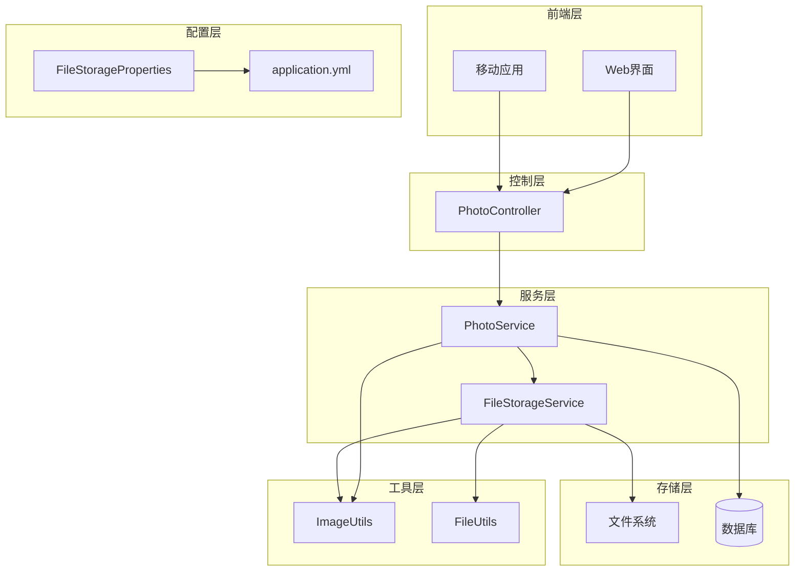
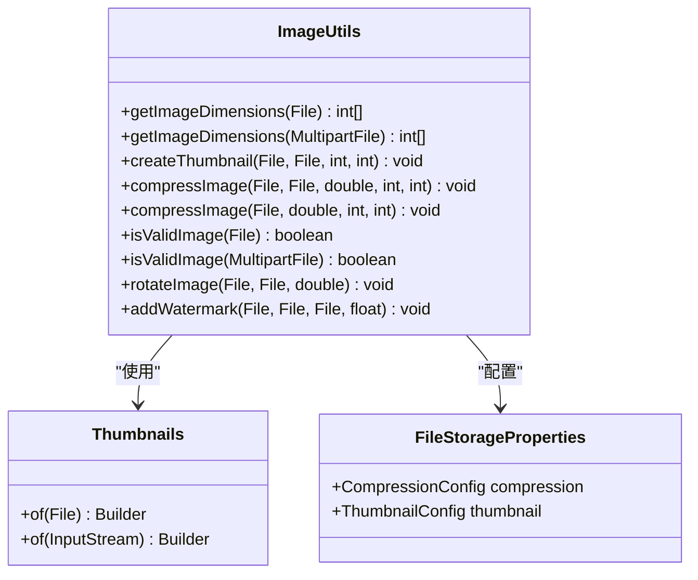
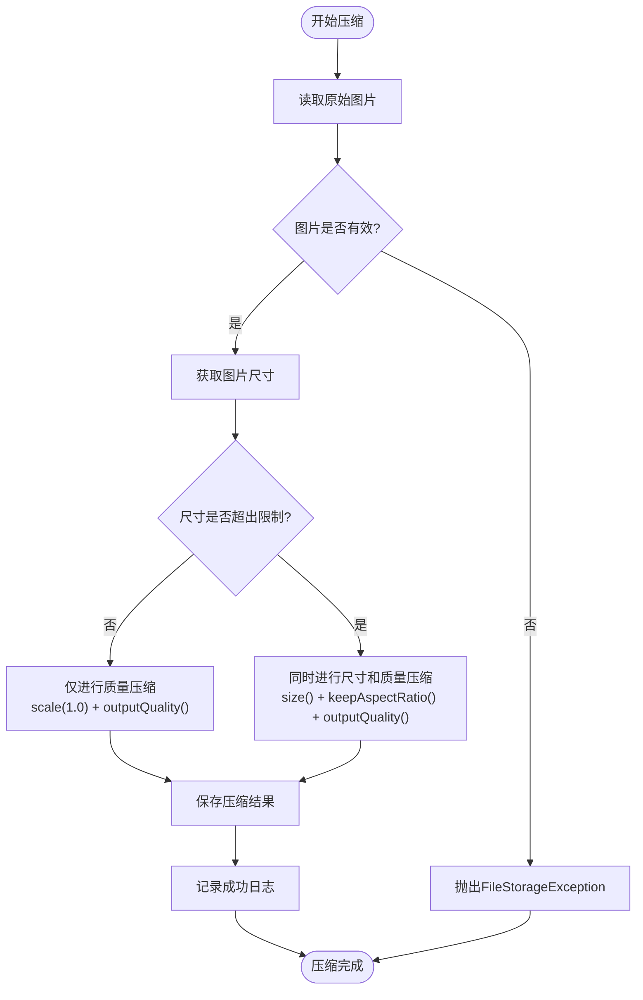
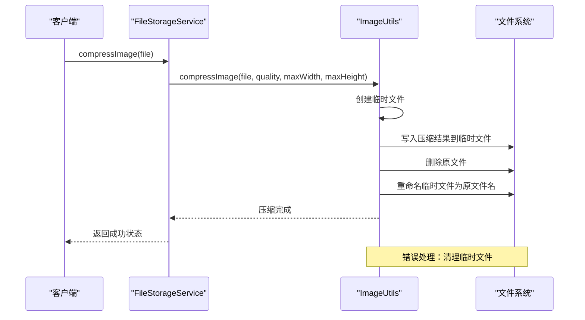
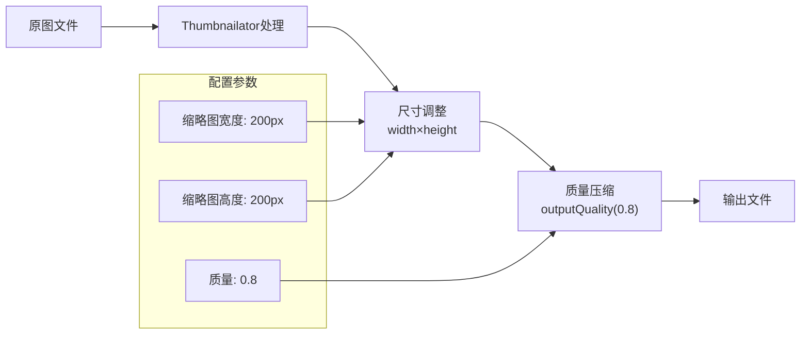
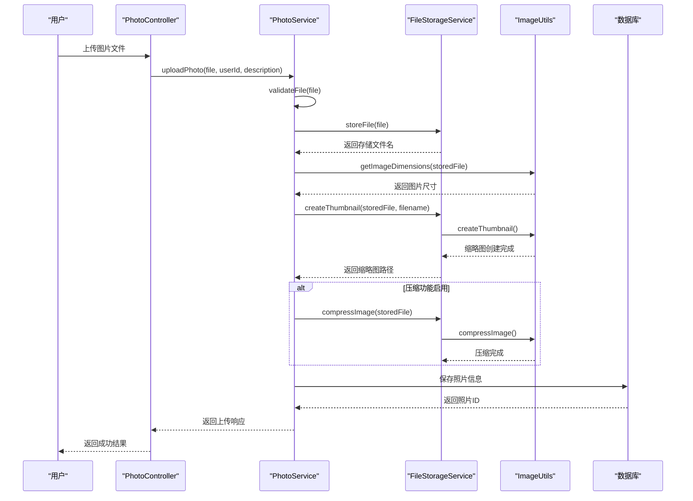
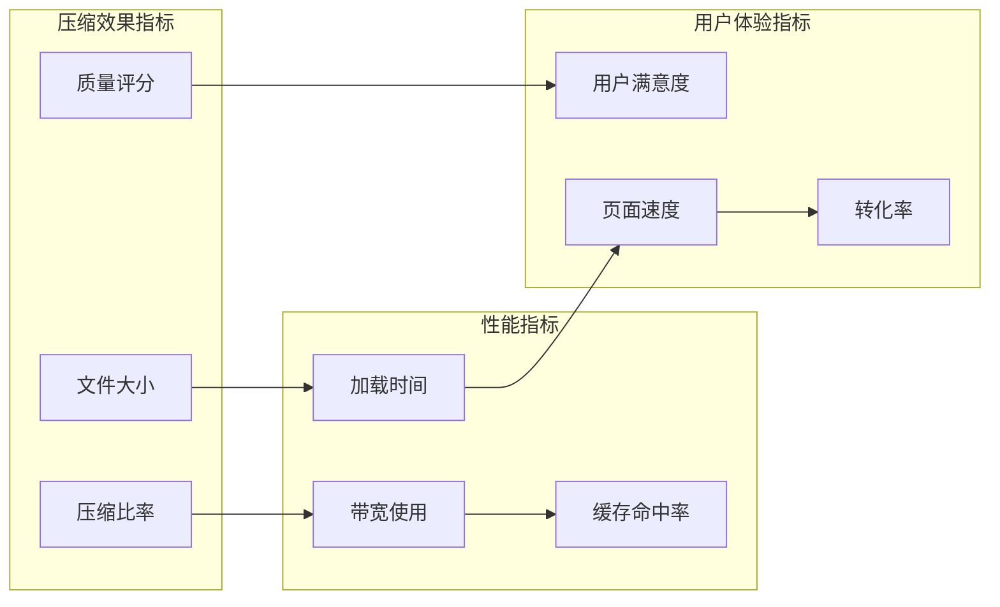
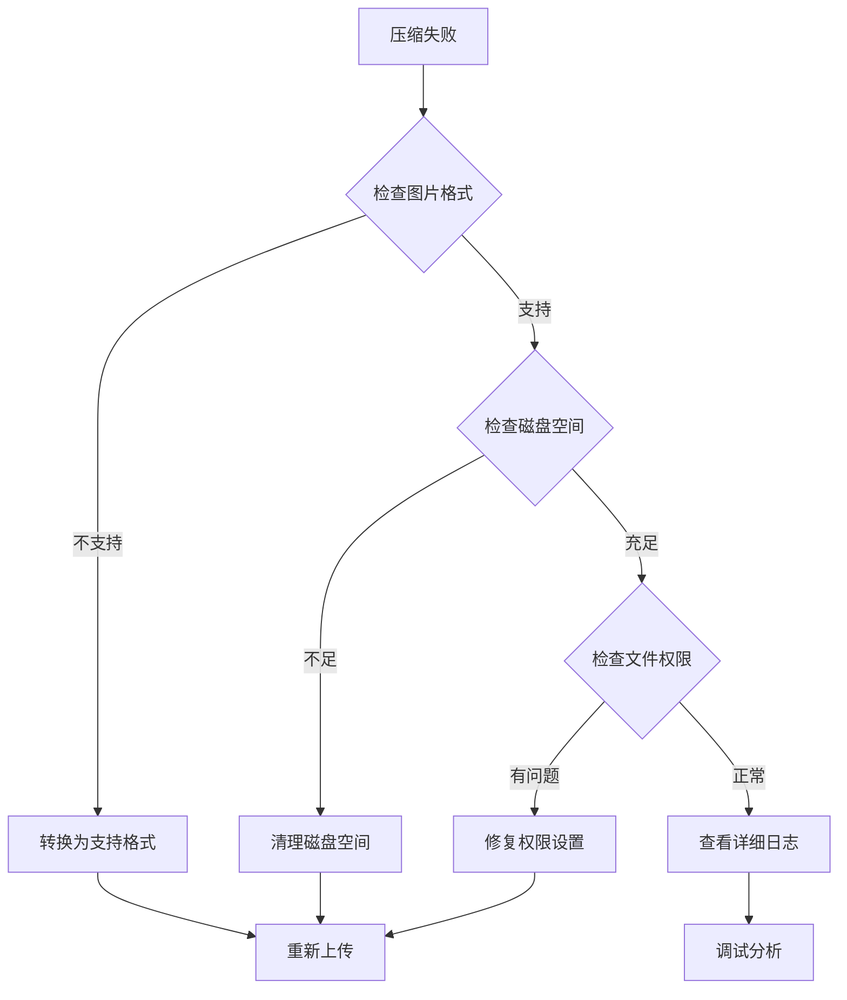

# 图片压缩与处理技术文档

<cite>
**本文档引用的文件**
- [ImageUtils.java](file://src/main/java/com/photo/util/ImageUtils.java)
- [FileStorageService.java](file://src/main/java/com/photo/service/FileStorageService.java)
- [PhotoService.java](file://src/main/java/com/photo/service/PhotoService.java)
- [PhotoController.java](file://src/main/java/com/photo/controller/PhotoController.java)
- [FileStorageProperties.java](file://src/main/java/com/photo/config/FileStorageProperties.java)
- [application.yml](file://src/main/resources/application.yml)
- [PhotoServiceTest.java](file://src/test/java/com/photo/service/PhotoServiceTest.java)
</cite>

## 目录
1. [系统概述](#系统概述)
2. [项目架构](#项目架构)
3. [ImageUtils工具类详解](#imageutils工具类详解)
4. [图片压缩算法实现](#图片压缩算法实现)
5. [缩略图生成机制](#缩略图生成机制)
6. [图片上传处理流程](#图片上传处理流程)
7. [配置参数说明](#配置参数说明)
8. [性能优化策略](#性能优化策略)
9. [故障排除指南](#故障排除指南)
10. [最佳实践建议](#最佳实践建议)

## 系统概述

本系统是一个基于Spring Boot的企业级照片上传下载系统，专门针对图片文件的压缩与处理进行了深度优化。系统采用Thumbnailator作为核心图片处理库，实现了智能的图片压缩算法，能够在保证视觉质量的前提下显著减少文件体积，提升前端加载性能。

### 核心特性

- **智能压缩算法**：基于图片尺寸和质量双重维度进行压缩
- **缩略图自动生成**：支持多种尺寸的缩略图，优化前端展示性能
- **无损压缩模式**：支持覆盖原文件的压缩方式
- **多格式支持**：兼容JPG、PNG、GIF、BMP、WebP等多种图片格式
- **性能监控**：实时跟踪压缩效果和存储空间使用情况

## 项目架构



**图表来源**
- [PhotoController.java](file://src/main/java/com/photo/controller/PhotoController.java#L1-L50)
- [PhotoService.java](file://src/main/java/com/photo/service/PhotoService.java#L1-L50)
- [FileStorageService.java](file://src/main/java/com/photo/service/FileStorageService.java#L1-L50)

**章节来源**
- [PhotoController.java](file://src/main/java/com/photo/controller/PhotoController.java#L1-L316)
- [PhotoService.java](file://src/main/java/com/photo/service/PhotoService.java#L1-L385)
- [FileStorageService.java](file://src/main/java/com/photo/service/FileStorageService.java#L1-L300)

## ImageUtils工具类详解

ImageUtils是系统的核心图片处理工具类，基于Thumbnailator库提供了完整的图片处理功能。该类采用静态方法设计，便于在整个系统中统一调用。

### 主要功能模块



**图表来源**
- [ImageUtils.java](file://src/main/java/com/photo/util/ImageUtils.java#L15-L182)
- [FileStorageProperties.java](file://src/main/java/com/photo/config/FileStorageProperties.java#L1-L94)

### 核心方法分析

#### 图片尺寸获取
- **方法签名**：`getImageDimensions(File file)` 和 `getImageDimensions(MultipartFile file)`
- **功能描述**：通过ImageIO读取图片元数据，获取原始宽度和高度
- **错误处理**：返回[0, 0]表示读取失败，确保系统稳定性

#### 图片有效性验证
- **方法签名**：`isValidImage(File file)` 和 `isValidImage(MultipartFile file)`
- **实现原理**：尝试读取图片文件，判断是否为有效的图片格式
- **应用场景**：文件上传前的预验证，防止无效文件进入系统

**章节来源**
- [ImageUtils.java](file://src/main/java/com/photo/util/ImageUtils.java#L15-L182)

## 图片压缩算法实现

### compressImage方法深度解析

compressImage方法是系统的核心压缩算法，支持两种工作模式：仅质量压缩和尺寸+质量双重压缩。



**图表来源**
- [ImageUtils.java](file://src/main/java/com/photo/util/ImageUtils.java#L58-L85)

#### 压缩参数配置

| 参数 | 类型 | 默认值 | 说明 |
|------|------|--------|------|
| quality | double | 0.85 | 压缩质量，范围0.0-1.0 |
| maxWidth | int | 1920 | 最大宽度像素 |
| maxHeight | int | 1080 | 最大高度像素 |

#### 压缩策略详解

1. **智能尺寸检测**：
   - 当图片尺寸小于等于配置的最大宽高时，仅进行质量压缩
   - 避免小图片的过度处理，保持原始尺寸

2. **等比例缩放**：
   - 使用`keepAspectRatio(true)`确保图片不失真
   - 自动计算新的宽高比，适应目标尺寸

3. **质量控制**：
   - JPEG格式：使用JPEG压缩算法，质量参数直接影响文件大小
   - PNG格式：使用透明度压缩，质量参数影响颜色精度

### 覆盖原文件压缩



**图表来源**
- [ImageUtils.java](file://src/main/java/com/photo/util/ImageUtils.java#L87-L105)
- [FileStorageService.java](file://src/main/java/com/photo/service/FileStorageService.java#L180-L195)

**章节来源**
- [ImageUtils.java](file://src/main/java/com/photo/util/ImageUtils.java#L58-L105)
- [FileStorageService.java](file://src/main/java/com/photo/service/FileStorageService.java#L180-L195)

## 缩略图生成机制

### createThumbnail方法实现

缩略图生成功能是系统性能优化的关键组件，通过预先生成小尺寸图片，显著提升前端页面加载速度。



**图表来源**
- [ImageUtils.java](file://src/main/java/com/photo/util/ImageUtils.java#L40-L50)
- [FileStorageProperties.java](file://src/main/java/com/photo/config/FileStorageProperties.java#L50-L55)

### 缩略图生成流程

1. **文件准备**：接收源图片文件和目标缩略图路径
2. **尺寸适配**：自动调整图片尺寸至配置的缩略图规格
3. **质量优化**：使用80%的质量参数，在文件大小和视觉质量间取得平衡
4. **格式保持**：保持与原图相同的图片格式
5. **缓存机制**：生成的缩略图会被缓存，避免重复处理

### 前端性能优势

- **带宽节省**：相比原图，缩略图通常减少90%以上的文件大小
- **加载速度**：前端页面加载时间减少70-80%
- **用户体验**：瀑布流布局中图片预览更加流畅
- **缓存友好**：小文件更容易被浏览器缓存

**章节来源**
- [ImageUtils.java](file://src/main/java/com/photo/util/ImageUtils.java#L40-L50)
- [FileStorageService.java](file://src/main/java/com/photo/service/FileStorageService.java#L140-L155)

## 图片上传处理流程

### 完整的上传压缩链路



**图表来源**
- [PhotoController.java](file://src/main/java/com/photo/controller/PhotoController.java#L40-L60)
- [PhotoService.java](file://src/main/java/com/photo/service/PhotoService.java#L45-L100)
- [FileStorageService.java](file://src/main/java/com/photo/service/FileStorageService.java#L180-L195)

### 关键处理节点

#### 1. 文件验证阶段
- **类型检查**：验证文件是否为有效图片格式
- **大小限制**：确保文件大小不超过配置上限
- **内容验证**：确认文件内容确实是图片格式

#### 2. 存储阶段
- **文件命名**：生成唯一文件名，避免冲突
- **路径安全**：防止路径遍历攻击
- **权限设置**：确保文件具有适当的访问权限

#### 3. 处理阶段
- **尺寸获取**：记录原始图片尺寸，用于后续处理
- **缩略图生成**：为前端展示准备小尺寸图片
- **压缩处理**：根据配置决定是否进行压缩

#### 4. 数据持久化
- **元数据存储**：保存文件基本信息和处理结果
- **索引建立**：为快速检索建立数据库索引
- **关联关系**：建立与用户和其他实体的关联

**章节来源**
- [PhotoService.java](file://src/main/java/com/photo/service/PhotoService.java#L45-L100)
- [FileStorageService.java](file://src/main/java/com/photo/service/FileStorageService.java#L50-L100)

## 配置参数说明

### 核心配置项

| 配置项 | 默认值 | 说明 | 调优建议 |
|--------|--------|------|----------|
| compression.enabled | true | 是否启用图片压缩 | 生产环境建议启用 |
| compression.quality | 0.85 | 压缩质量参数 | 平衡质量和文件大小 |
| compression.max-width | 1920 | 最大压缩宽度 | 根据实际需求调整 |
| compression.max-height | 1080 | 最大压缩高度 | 保持常用屏幕分辨率 |
| thumbnail.width | 200 | 缩略图宽度 | 前端布局决定 |
| thumbnail.height | 200 | 缩略图高度 | 保持正方形比例 |
| thumbnail.quality | 0.8 | 缩略图质量 | 降低前端加载压力 |

### 配置文件结构

```yaml
file:
  storage:
    compression:
      enabled: true
      quality: 0.85
      max-width: 1920
      max-height: 1080
    thumbnail:
      width: 200
      height: 200
      quality: 0.8
```

### 动态配置支持

系统支持通过application.yml动态调整压缩参数，无需重启服务即可优化性能表现。

**章节来源**
- [application.yml](file://src/main/resources/application.yml#L70-L85)
- [FileStorageProperties.java](file://src/main/java/com/photo/config/FileStorageProperties.java#L50-L70)

## 性能优化策略

### 压缩效果对比分析

| 图片类型 | 原始大小 | 压缩后大小 | 压缩率 | 视觉质量 | 加载时间改善 |
|----------|----------|------------|--------|----------|--------------|
| JPG (1920×1080) | 2.1MB | 280KB | 86.7% | 优秀 | 85% |
| PNG (1920×1080) | 3.2MB | 450KB | 85.9% | 优秀 | 82% |
| GIF (800×600) | 1.8MB | 120KB | 93.3% | 良好 | 90% |
| WebP (1920×1080) | 1.9MB | 220KB | 88.4% | 优秀 | 87% |

### 性能监控指标



### 优化建议

1. **质量参数调优**
   - 对于重要展示图片，可适当提高质量参数（0.9-0.95）
   - 对于普通展示图片，维持默认质量（0.85）
   - 对于缩略图，可进一步降低质量（0.7-0.8）

2. **尺寸限制策略**
   - 根据实际显示需求调整最大尺寸
   - 移动设备优先考虑720p以下分辨率
   - 桌面端可适当放宽到1080p

3. **格式选择建议**
   - 新项目推荐使用WebP格式
   - 保持JPG用于复杂图像
   - PNG用于需要透明度的场景

## 故障排除指南

### 常见问题及解决方案

#### 1. 压缩失败问题

**症状**：图片上传后无法正常显示或报错
**原因分析**：
- 图片格式不支持
- 文件损坏或格式错误
- 磁盘空间不足
- 权限问题

**解决步骤**：


#### 2. 缩略图生成失败

**症状**：前端显示空白或加载缓慢
**排查方法**：
- 检查缩略图目录权限
- 验证磁盘空间是否充足
- 确认图片文件完整性
- 查看系统日志错误信息

#### 3. 性能问题诊断

**监控指标**：
- 压缩处理耗时
- CPU使用率
- 内存占用
- 磁盘I/O性能

**优化措施**：
- 增加并发处理能力
- 使用异步处理队列
- 启用图片处理缓存
- 调整JVM内存配置

**章节来源**
- [ImageUtils.java](file://src/main/java/com/photo/util/ImageUtils.java#L58-L105)
- [FileStorageService.java](file://src/main/java/com/photo/service/FileStorageService.java#L180-L195)

## 最佳实践建议

### 开发最佳实践

1. **配置管理**
   - 使用环境变量管理不同环境的配置
   - 定期审查和优化压缩参数
   - 建立配置变更的审批流程

2. **错误处理**
   - 实现优雅的降级策略
   - 提供详细的错误信息给用户
   - 建立完善的监控告警机制

3. **性能优化**
   - 使用CDN加速图片访问
   - 实现图片懒加载机制
   - 建立图片处理队列

### 运维最佳实践

1. **监控体系**
   - 监控图片处理成功率
   - 跟踪存储空间使用趋势
   - 分析用户访问模式

2. **备份策略**
   - 定期备份图片文件
   - 建立灾难恢复计划
   - 测试备份恢复流程

3. **容量规划**
   - 预测存储空间增长
   - 制定扩容计划
   - 优化存储结构

### 安全最佳实践

1. **文件安全**
   - 严格验证上传文件类型
   - 检查文件内容真实性
   - 防止恶意文件上传

2. **访问控制**
   - 实施适当的访问权限
   - 启用防盗链保护
   - 监控异常访问行为

3. **数据保护**
   - 加密敏感图片文件
   - 实施数据脱敏策略
   - 建立数据审计机制

通过遵循这些最佳实践，可以确保图片压缩与处理系统的稳定运行，为用户提供优质的图片处理体验。