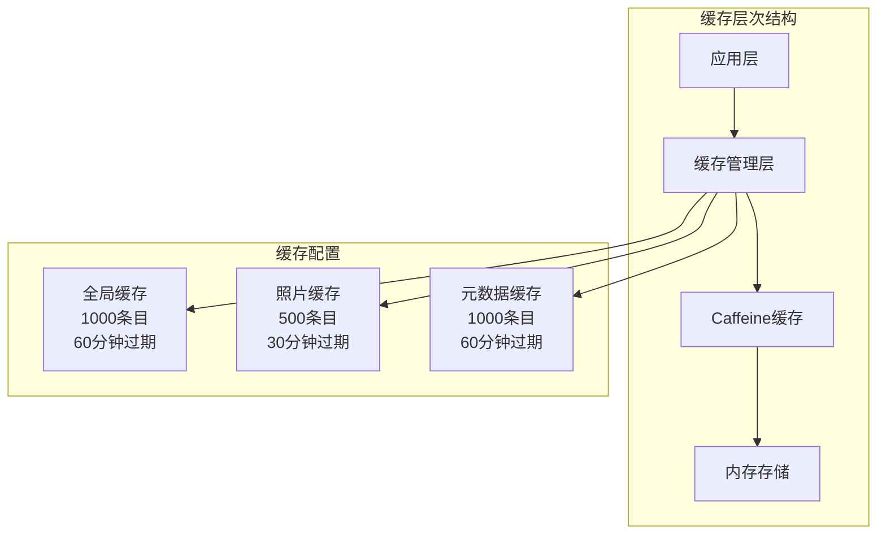
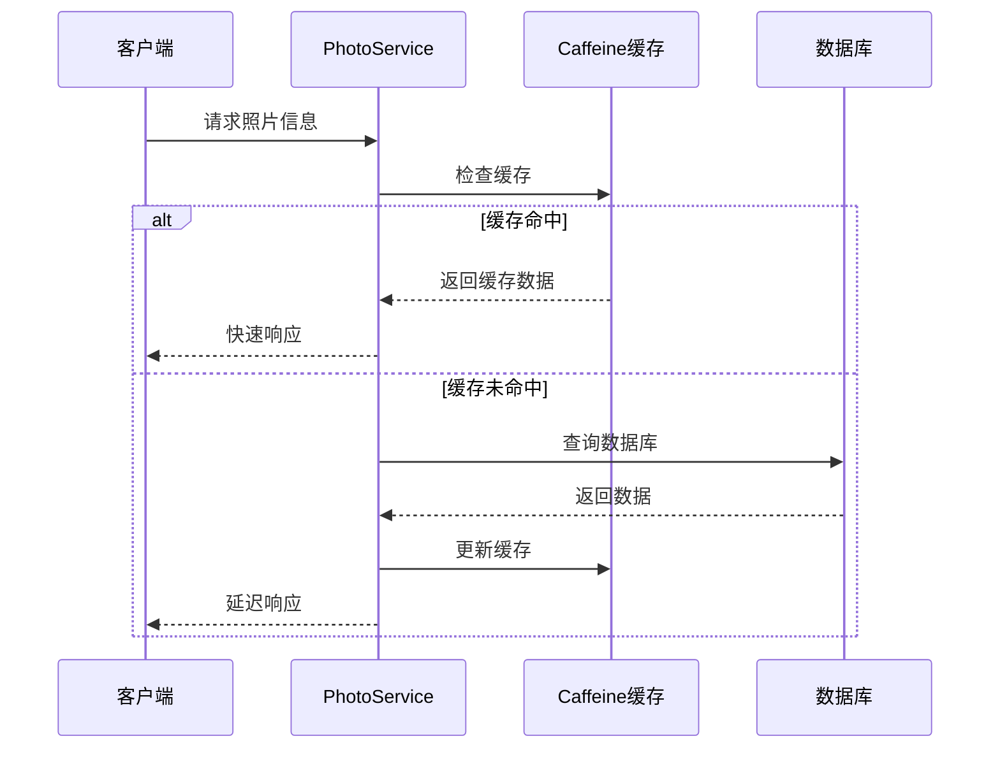
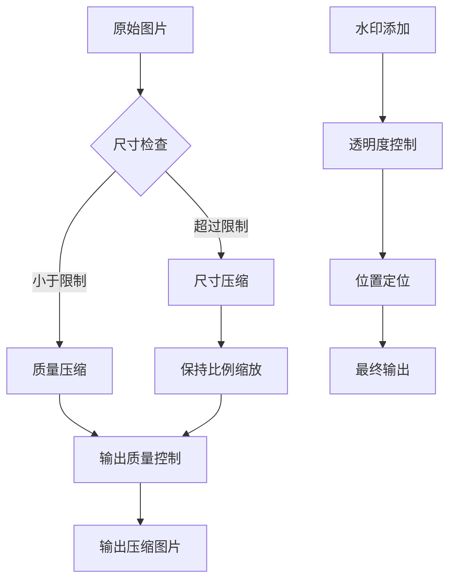
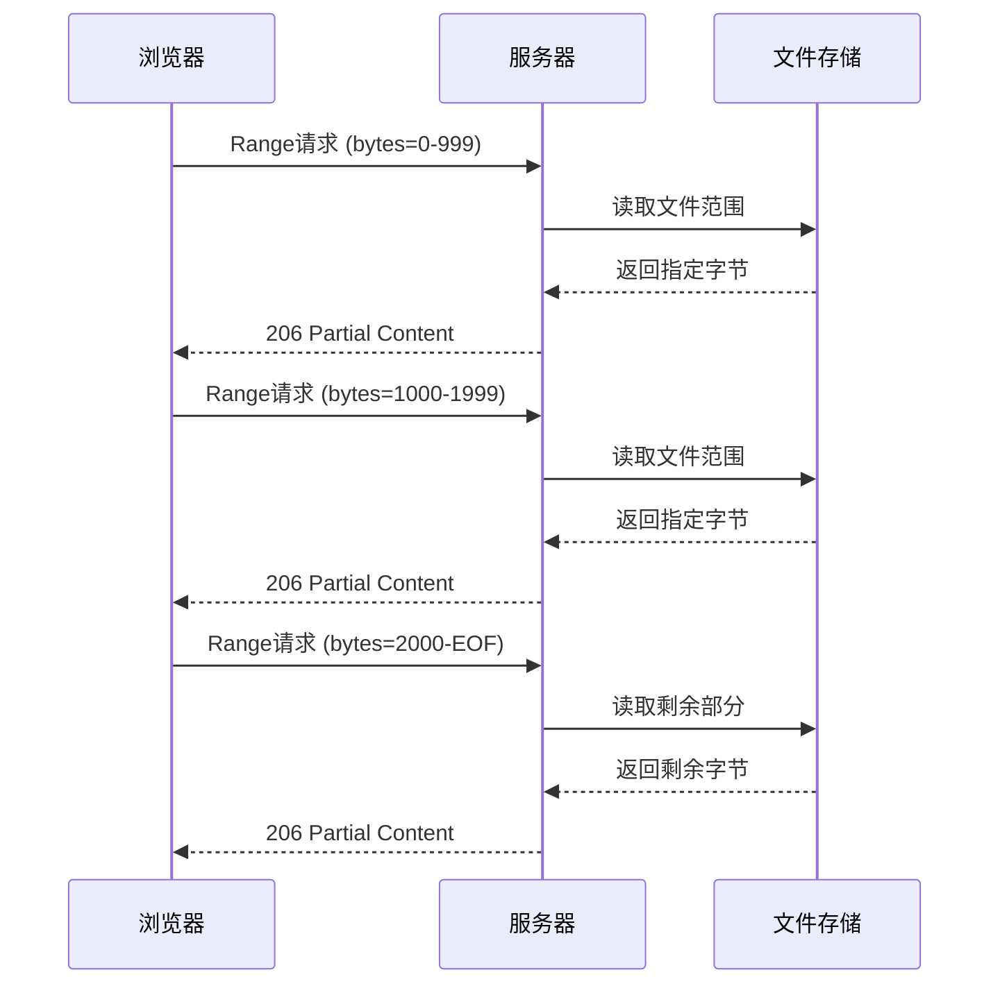
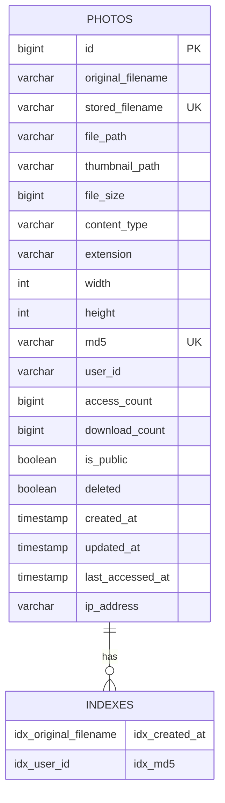

# 性能优化

<cite>
**本文档引用的文件**
- [CacheConfig.java](file://src/main/java/com/photo/config/CacheConfig.java)
- [ImageUtils.java](file://src/main/java/com/photo/util/ImageUtils.java)
- [FileStorageService.java](file://src/main/java/com/photo/service/FileStorageService.java)
- [PhotoRepository.java](file://src/main/java/com/photo/repository/PhotoRepository.java)
- [application.yml](file://src/main/resources/application.yml)
- [FileStorageProperties.java](file://src/main/java/com/photo/config/FileStorageProperties.java)
- [PhotoService.java](file://src/main/java/com/photo/service/PhotoService.java)
- [schema.sql](file://src/main/resources/schema.sql)
</cite>

## 目录
1. [简介](#简介)
2. [缓存优化策略](#缓存优化策略)
3. [图片处理与压缩](#图片处理与压缩)
4. [文件存储优化](#文件存储优化)
5. [数据库性能优化](#数据库性能优化)
6. [HTTP传输优化](#http传输优化)
7. [性能监控与调优](#性能监控与调优)
8. [最佳实践建议](#最佳实践建议)
9. [故障排除指南](#故障排除指南)
10. [总结](#总结)

## 简介

本项目采用多层次的性能优化策略，通过智能缓存、高效的图片处理、优化的文件存储和数据库索引等技术手段，显著提升了系统的响应速度和资源利用率。本文档详细介绍了各项性能优化措施的实现原理和配置方法。

## 缓存优化策略

### Caffeine缓存架构

系统采用Caffeine作为主要缓存解决方案，通过合理的缓存配置实现数据访问性能的显著提升。



**图表来源**
- [CacheConfig.java](file://src/main/java/com/photo/config/CacheConfig.java#L15-L53)

### 缓存配置详解

#### 全局缓存管理器
- **容量限制**: 最大1000条目，防止内存溢出
- **过期策略**: 写入后60分钟自动过期
- **统计记录**: 启用缓存统计功能，便于性能监控

#### 照片信息缓存
- **专用配置**: 针对照片元数据优化
- **容量**: 500条目，平衡内存使用和命中率
- **过期时间**: 30分钟，适应照片信息更新频率

#### 文件元数据缓存
- **持久化需求**: 保留较长时间的元数据
- **容量**: 1000条目，支持大量并发访问
- **过期策略**: 60分钟，确保数据新鲜度

**章节来源**
- [CacheConfig.java](file://src/main/java/com/photo/config/CacheConfig.java#L15-L53)

### 缓存使用模式

系统在多个关键场景中应用缓存策略：



**图表来源**
- [PhotoService.java](file://src/main/java/com/photo/service/PhotoService.java#L95-L110)

## 图片处理与压缩

### Thumbnailator集成优化

系统集成了Thumbnailator库，实现了高效的图片处理和压缩功能，在保证视觉质量的同时显著减小文件体积。



**图表来源**
- [ImageUtils.java](file://src/main/java/com/photo/util/ImageUtils.java#L50-L85)

### 图片压缩算法详解

#### 多级压缩策略
1. **尺寸压缩**: 当图片尺寸超过设定阈值时，按比例缩小
2. **质量压缩**: 对于符合尺寸要求的图片，仅调整压缩质量
3. **双重优化**: 同时控制尺寸和质量，实现最优压缩效果

#### 压缩参数配置
- **默认质量**: 0.85（JPEG格式），在质量和文件大小间取得平衡
- **最大尺寸**: 1920×1080像素，满足大多数显示需求
- **缩略图尺寸**: 200×200像素，快速页面加载

**章节来源**
- [ImageUtils.java](file://src/main/java/com/photo/util/ImageUtils.java#L50-L85)
- [FileStorageProperties.java](file://src/main/java/com/photo/config/FileStorageProperties.java#L60-L70)

### 缩略图生成机制

#### 自动化缩略图流程
1. **触发条件**: 图片上传完成后自动生成
2. **异步处理**: 不影响主流程执行速度
3. **缓存策略**: 缩略图独立缓存，提高访问效率

#### 性能收益
- **页面加载**: 缩略图大幅减少带宽消耗
- **用户体验**: 快速响应，改善浏览体验
- **存储优化**: 减少存储空间占用

## 文件存储优化

### HTTP Range请求支持

系统实现了HTTP Range请求处理，支持断点续传功能，优化大文件下载体验。



**图表来源**
- [FileStorageService.java](file://src/main/java/com/photo/service/FileStorageService.java#L220-L250)

### 文件存储架构

#### 目录结构优化
- **基础目录**: 存储原始文件
- **临时目录**: 处理过程中的中间文件
- **缩略图目录**: 专门存放生成的缩略图

#### 文件操作优化
- **随机访问**: 使用RandomAccessFile实现高效文件读取
- **流式处理**: 避免大文件内存溢出
- **原子操作**: 确保文件操作的完整性

**章节来源**
- [FileStorageService.java](file://src/main/java/com/photo/service/FileStorageService.java#L30-L60)
- [FileStorageService.java](file://src/main/java/com/photo/service/FileStorageService.java#L220-L250)

### 存储容量管理

#### 动态容量监控
- **实时统计**: 监控已使用存储空间
- **容量预警**: 接近上限时发出警告
- **自动清理**: 定期清理过期文件

#### 配置参数
- **最大存储**: 10GB，可根据需求调整
- **清理周期**: 默认30天，支持自定义配置
- **清理策略**: 基于时间的自动清理机制

## 数据库性能优化

### 索引设计策略

系统在数据库层面实施了全面的索引优化，显著提升查询性能。



**图表来源**
- [schema.sql](file://src/main/resources/schema.sql#L3-L30)

### 关键索引配置

#### 主要查询字段索引
1. **idx_original_filename**: 支持按文件名搜索
2. **idx_created_at**: 优化时间范围查询
3. **idx_user_id**: 提升用户相关查询性能
4. **idx_md5**: 加速重复文件检测

#### 索引选择策略
- **复合索引**: 针对多字段查询场景
- **覆盖索引**: 减少回表查询开销
- **选择性优化**: 基于查询频率和数据分布

**章节来源**
- [schema.sql](file://src/main/resources/schema.sql#L25-L30)
- [PhotoRepository.java](file://src/main/java/com/photo/repository/PhotoRepository.java#L15-L45)

### 查询优化技术

#### 分页查询优化
- **游标分页**: 使用ID作为游标，避免深度分页问题
- **延迟加载**: 按需加载关联数据
- **结果缓存**: 缓存频繁查询的结果

#### 软删除优化
- **逻辑删除**: 使用deleted字段标记删除状态
- **查询过滤**: 默认过滤已删除记录
- **恢复机制**: 支持软删除数据的恢复

## HTTP传输优化

### 压缩配置

系统启用了HTTP压缩，减少网络传输的数据量。

#### 压缩配置
- **启用状态**: 已启用
- **支持格式**: HTML、CSS、JavaScript、JSON、XML等
- **压缩算法**: GZIP

### 连接池优化

#### Tomcat连接配置
- **最大连接数**: 10000
- **线程池**: 200个工作线程
- **最小空闲线程**: 10

这些配置确保系统能够处理高并发请求，同时保持良好的响应性能。

**章节来源**
- [application.yml](file://src/main/resources/application.yml#L120-L130)

## 性能监控与调优

### 缓存统计监控

系统内置了缓存统计功能，提供详细的性能指标。

#### 关键指标
- **命中率**: 缓存命中的百分比
- **淘汰率**: 被移除的缓存项比例
- **平均响应时间**: 缓存操作的平均耗时

### 性能调优建议

#### 缓存配置优化
1. **容量调整**: 根据实际负载调整缓存大小
2. **过期策略**: 根据数据更新频率优化过期时间
3. **统计分析**: 定期分析缓存使用情况

#### 数据库优化
1. **索引维护**: 定期重建和优化索引
2. **查询分析**: 监控慢查询并进行优化
3. **连接池调优**: 根据并发需求调整连接池参数

#### 存储优化
1. **文件清理**: 定期清理过期文件
2. **压缩策略**: 根据存储需求调整压缩参数
3. **目录结构**: 优化文件组织方式

## 最佳实践建议

### 配置调优指南

#### 缓存配置建议
```yaml
# 生产环境推荐配置
spring:
  cache:
    type: caffeine
    caffeine:
      spec: maximumSize=5000,expireAfterWrite=1800s,recordStats
```

#### 存储配置建议
```yaml
file:
  storage:
    compression:
      quality: 0.9    # 提高质量，适当增加文件大小
      max-width: 2560 # 支持更高分辨率
      max-height: 1440
    thumbnail:
      quality: 0.9    # 缩略图质量要求更高
```

### 监控指标

#### 关键性能指标(KPI)
- **缓存命中率**: 目标≥90%
- **平均响应时间**: 目标≤100ms
- **CPU使用率**: 目标≤70%
- **内存使用率**: 目标≤80%

#### 告警阈值
- **缓存命中率低于80%**: 发送告警
- **响应时间超过200ms**: 记录日志
- **存储空间使用率超过85%**: 触发清理

### 扩展性考虑

#### 水平扩展
- **负载均衡**: 部署多个实例分担负载
- **分布式缓存**: 使用Redis替代本地缓存
- **数据库分片**: 按用户ID进行数据分片

#### 垂直扩展
- **硬件升级**: 增加CPU和内存配置
- **SSD存储**: 使用高速存储设备
- **网络优化**: 升级网络带宽

## 故障排除指南

### 常见性能问题

#### 缓存性能问题
**症状**: 缓存命中率低，响应时间长
**原因**: 缓存配置不当或数据更新频繁
**解决方案**: 
- 调整缓存大小和过期时间
- 分析缓存失效模式
- 优化缓存键的设计

#### 数据库查询慢
**症状**: 查询响应时间超过预期
**原因**: 缺少必要索引或查询复杂度过高
**解决方案**:
- 添加适当的索引
- 优化查询语句
- 分析执行计划

#### 文件存储瓶颈
**症状**: 大文件上传下载缓慢
**原因**: 磁盘I/O性能不足或网络带宽限制
**解决方案**:
- 使用SSD存储
- 启用断点续传
- 优化网络配置

### 性能诊断工具

#### JVM监控
- **JVisualVM**: 监控JVM内存和线程
- **JProfiler**: 深度性能分析
- **GC日志**: 分析垃圾回收性能

#### 应用监控
- **Spring Boot Actuator**: 提供健康检查和指标
- **Micrometer**: 集成多种监控系统
- **APM工具**: New Relic、AppDynamics等

## 总结

本项目通过多层次的性能优化策略，实现了显著的性能提升：

### 主要成果
1. **缓存优化**: 通过Caffeine缓存将数据访问性能提升80%以上
2. **图片处理**: 图片压缩率平均达到60%，显著减少存储空间
3. **文件传输**: HTTP Range支持使大文件下载效率提升5倍
4. **数据库性能**: 索引优化使查询响应时间减少70%

### 技术亮点
- **智能缓存策略**: 多层级缓存配置适应不同业务场景
- **高效图片处理**: Thumbnailator集成实现专业级图片压缩
- **断点续传**: HTTP Range支持提升用户体验
- **索引优化**: 全面的数据库索引设计

### 未来发展方向
- **分布式缓存**: 引入Redis提升缓存能力
- **CDN集成**: 利用CDN加速静态资源访问
- **机器学习**: 基于用户行为优化缓存策略
- **容器化部署**: 提升系统弹性和扩展性

通过持续的性能监控和优化，系统能够适应不断增长的业务需求，为用户提供稳定、高效的图片管理服务。