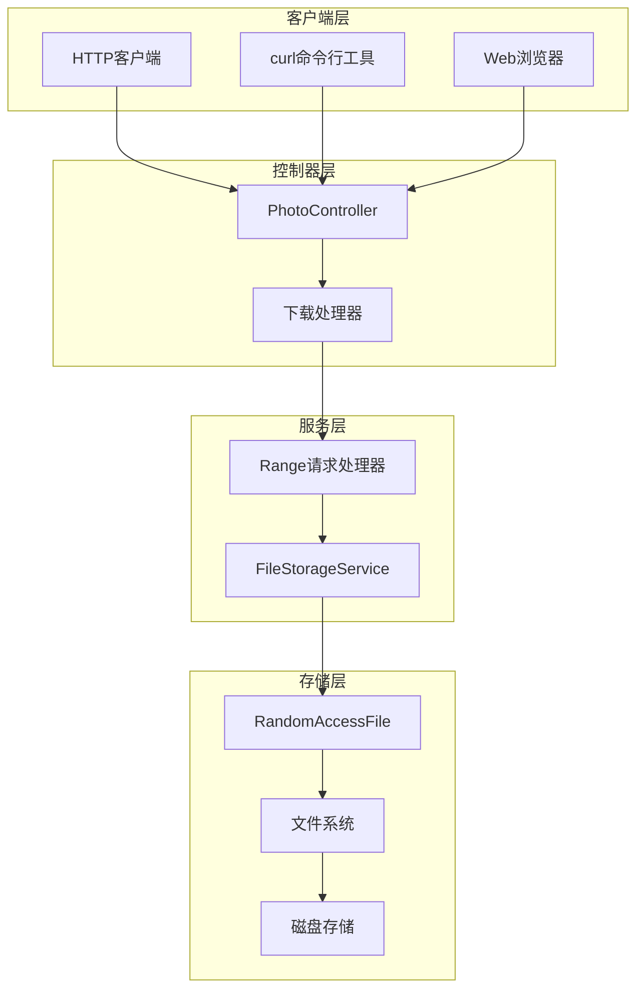
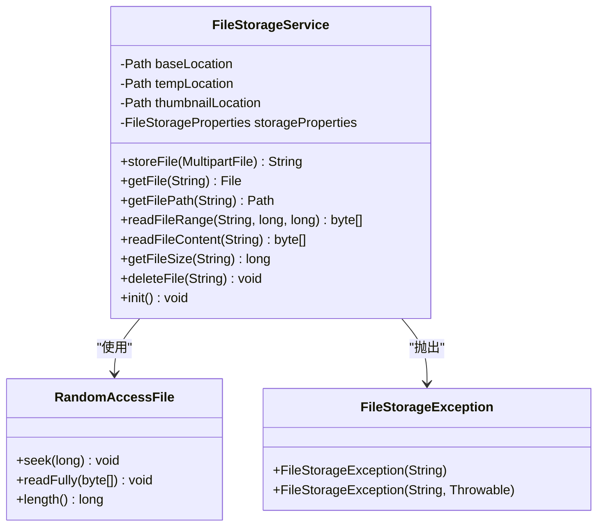
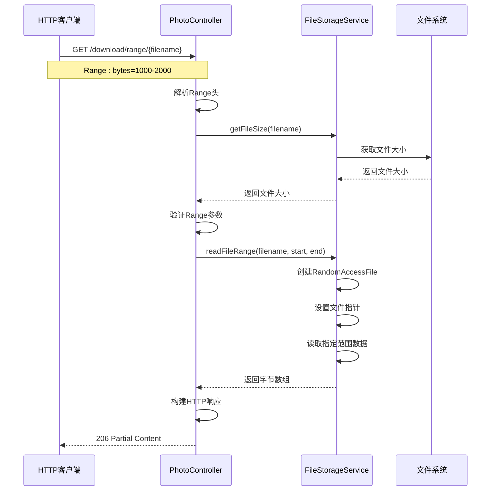
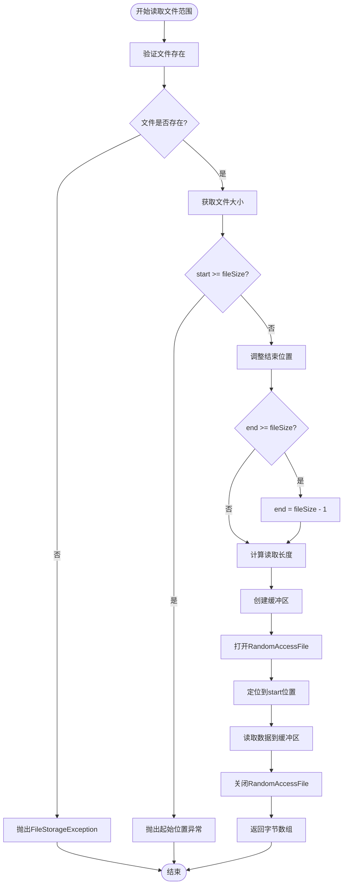
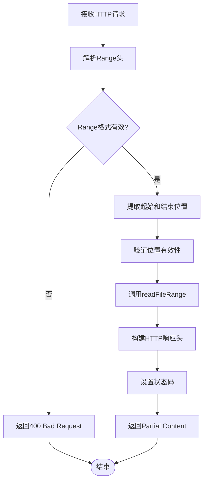

# 断点续传支持

<cite>
**本文档引用的文件**
- [FileStorageService.java](file://src/main/java/com/photo/service/FileStorageService.java)
- [PhotoController.java](file://src/main/java/com/photo/controller/PhotoController.java)
- [FileStorageProperties.java](file://src/main/java/com/photo/config/FileStorageProperties.java)
- [FileStorageException.java](file://src/main/java/com/photo/exception/FileStorageException.java)
- [FileNotFoundException.java](file://src/main/java/com/photo/exception/FileNotFoundException.java)
- [FileException.java](file://src/main/java/com/photo/exception/FileException.java)
</cite>

## 目录
1. [简介](#简介)
2. [系统架构概览](#系统架构概览)
3. [核心组件分析](#核心组件分析)
4. [断点续传实现机制](#断点续传实现机制)
5. [HTTP Range请求处理](#http-range请求处理)
6. [性能优化与安全考虑](#性能优化与安全考虑)
7. [客户端使用指南](#客户端使用指南)
8. [故障排除](#故障排除)
9. [总结](#总结)

## 简介

断点续传功能是现代文件传输系统的重要特性，它允许在网络中断或其他异常情况下继续之前的工作，避免重新开始整个传输过程。本系统通过FileStorageService中的readFileRange方法实现了完整的HTTP Range请求支持，为大文件下载提供了稳定可靠的解决方案。

该功能的核心优势在于：
- **网络稳定性**：在网络连接不稳定时仍能保持下载进度
- **用户体验**：减少重复下载时间，提高下载成功率
- **资源效率**：避免服务器端不必要的带宽浪费
- **容错能力**：自动处理各种异常情况

## 系统架构概览

系统的断点续传功能采用分层架构设计，确保各组件职责明确且易于维护。



**图表来源**
- [PhotoController.java](file://src/main/java/com/photo/controller/PhotoController.java#L200-L250)
- [FileStorageService.java](file://src/main/java/com/photo/service/FileStorageService.java#L228-L260)

## 核心组件分析

### FileStorageService - 核心存储服务

FileStorageService是断点续传功能的核心实现，其中readFileRange方法专门负责处理部分文件读取请求。



**图表来源**
- [FileStorageService.java](file://src/main/java/com/photo/service/FileStorageService.java#L20-L300)
- [FileStorageException.java](file://src/main/java/com/photo/exception/FileStorageException.java#L1-L16)

**章节来源**
- [FileStorageService.java](file://src/main/java/com/photo/service/FileStorageService.java#L228-L260)

### PhotoController - HTTP请求处理

PhotoController负责接收和处理HTTP Range请求，解析Range头并调用相应的服务方法。



**图表来源**
- [PhotoController.java](file://src/main/java/com/photo/controller/PhotoController.java#L200-L250)
- [FileStorageService.java](file://src/main/java/com/photo/service/FileStorageService.java#L228-L260)

## 断点续传实现机制

### readFileRange方法详解

readFileRange方法是断点续传功能的核心实现，它使用RandomAccessFile类提供高效的随机访问读取能力。

#### 方法签名与参数说明

| 参数 | 类型 | 描述 | 边界检查 |
|------|------|------|----------|
| filename | String | 文件名标识符 | 验证文件存在性 |
| start | long | 起始字节位置 | 检查是否超出文件大小 |
| end | long | 结束字节位置 | 自动调整至文件末尾 |

#### 边界处理逻辑



**图表来源**
- [FileStorageService.java](file://src/main/java/com/photo/service/FileStorageService.java#L228-L260)

#### RandomAccessFile实现机制

系统使用RandomAccessFile类实现高效的随机访问读取：

1. **文件定位**：通过`raf.seek(start)`方法快速定位到指定字节位置
2. **连续读取**：使用`raf.readFully(buffer)`方法一次性读取指定长度的数据
3. **资源管理**：使用try-with-resources语法确保文件句柄正确释放

**章节来源**
- [FileStorageService.java](file://src/main/java/com/photo/service/FileStorageService.java#L228-L260)

### 异常处理机制

系统实现了完善的异常处理机制，确保各种错误情况都能得到妥善处理：

| 异常类型 | 触发条件 | 处理策略 |
|----------|----------|----------|
| FileStorageException | 文件操作失败 | 记录日志并向上抛出 |
| FileNotFoundException | 文件不存在 | 抛出特定异常类型 |
| IOException | I/O操作异常 | 包装为FileStorageException |
| NumberFormatException | Range头解析失败 | 返回400 Bad Request |

**章节来源**
- [FileStorageService.java](file://src/main/java/com/photo/service/FileStorageService.java#L228-L260)
- [FileStorageException.java](file://src/main/java/com/photo/exception/FileStorageException.java#L1-L16)
- [FileNotFoundException.java](file://src/main/java/com/photo/exception/FileNotFoundException.java#L1-L16)

## HTTP Range请求处理

### Range请求解析

PhotoController中的downloadPhotoWithRange方法负责处理HTTP Range请求：



**图表来源**
- [PhotoController.java](file://src/main/java/com/photo/controller/PhotoController.java#L200-L250)

### HTTP响应头配置

系统在响应中设置了必要的HTTP头信息：

| 响应头 | 值 | 用途 |
|--------|-----|------|
| Content-Type | 文件MIME类型 | 告诉客户端如何处理内容 |
| Content-Length | 实际传输字节数 | 显示实际传输的数据量 |
| Accept-Ranges | bytes | 表明支持字节范围请求 |
| Content-Range | bytes start-end/fileSize | 指定当前响应的数据范围 |

### 状态码处理

系统根据Range请求的存在与否设置适当的HTTP状态码：

- **206 Partial Content**：当存在Range头时返回，表示成功处理了部分请求
- **200 OK**：当没有Range头时返回，表示完整文件传输

**章节来源**
- [PhotoController.java](file://src/main/java/com/photo/controller/PhotoController.java#L200-L250)

## 性能优化与安全考虑

### 内存缓冲区优化

系统在readFileRange方法中采用了智能的缓冲区管理策略：

1. **动态缓冲区大小**：根据请求的字节范围动态计算缓冲区大小
2. **内存效率**：只分配必要的内存空间，避免浪费
3. **垃圾回收友好**：及时释放不再需要的对象引用

### 并发安全性

虽然当前实现使用了线程局部的RandomAccessFile实例，但系统层面还考虑了以下并发安全措施：

1. **不可变对象**：Path对象在初始化后保持不变
2. **原子操作**：文件大小获取等操作是原子性的
3. **异常隔离**：每个请求的异常不会影响其他请求

### 性能注意事项

为了确保最佳性能，建议注意以下事项：

1. **缓冲区大小**：对于超大文件，可以考虑使用更大的缓冲区
2. **并发控制**：在高并发场景下可能需要考虑连接池限制
3. **磁盘I/O优化**：确保文件系统支持高效的随机访问

**章节来源**
- [FileStorageService.java](file://src/main/java/com/photo/service/FileStorageService.java#L228-L260)

## 客户端使用指南

### curl命令行示例

以下是使用curl进行断点续传下载的示例：

```bash
# 下载文件的前1024字节
curl -H "Range: bytes=0-1023" http://localhost:8080/photos/download/range/largefile.zip -o part1.zip

# 续传下载第1024到2047字节
curl -H "Range: bytes=1024-2047" http://localhost:8080/photos/download/range/largefile.zip -o part2.zip

# 下载文件的最后1024字节
curl -H "Range: bytes=-1024" http://localhost:8080/photos/download/range/largefile.zip -o part3.zip

# 合并多个部分
cat part1.zip part2.zip part3.zip > complete.zip
```

### HTTP客户端示例

```javascript
// JavaScript Fetch API示例
const downloadWithRange = async (url, start, end) => {
    const response = await fetch(url, {
        headers: {
            'Range': `bytes=${start}-${end}`
        }
    });
    
    if (response.status === 206) {
        const blob = await response.blob();
        return blob;
    } else {
        throw new Error('Range request failed');
    }
};
```

### 支持的Range格式

系统支持多种Range请求格式：

| 格式 | 示例 | 说明 |
|------|------|------|
| 单一范围 | bytes=1000-2000 | 从第1000字节到第2000字节 |
| 相对末尾 | bytes=-1024 | 最后1024字节 |
| 相对开始 | bytes=1024- | 从第1024字节到文件末尾 |

## 故障排除

### 常见问题与解决方案

#### 1. Range请求被拒绝

**症状**：客户端收到400 Bad Request响应
**原因**：Range头格式不正确或数值无效
**解决方案**：检查Range头格式，确保符合标准格式

#### 2. 文件大小检查失败

**症状**：抛出"起始位置超出文件大小"异常
**原因**：请求的起始位置大于文件的实际大小
**解决方案**：在发送Range请求前先获取文件大小

#### 3. 内存不足错误

**症状**：大文件下载时出现OutOfMemoryError
**原因**：请求的字节范围过大导致缓冲区溢出
**解决方案**：限制单次Range请求的最大字节数

#### 4. 文件锁定问题

**症状**：无法读取正在写入的文件
**原因**：文件被其他进程锁定
**解决方案**：确保文件写入完成后才进行读取操作

### 调试技巧

1. **启用详细日志**：在application.yml中设置日志级别为DEBUG
2. **监控文件大小**：使用getFileSize方法验证文件状态
3. **测试小范围**：先测试小范围的Range请求以确保功能正常

**章节来源**
- [FileStorageService.java](file://src/main/java/com/photo/service/FileStorageService.java#L228-L260)
- [PhotoController.java](file://src/main/java/com/photo/controller/PhotoController.java#L200-L250)

## 总结

本系统的断点续传功能通过FileStorageService的readFileRange方法和PhotoController的Range请求处理，实现了完整的HTTP Range支持。该功能具有以下特点：

### 主要优势

1. **高效性**：使用RandomAccessFile实现快速随机访问
2. **可靠性**：完善的异常处理和边界检查机制
3. **兼容性**：完全符合HTTP Range请求规范
4. **可扩展性**：模块化设计便于功能扩展

### 应用场景

- **大文件下载**：视频、音频、大型软件包等
- **网络不稳定环境**：移动网络、公共Wi-Fi等
- **长时间传输**：备份、同步等场景
- **资源受限设备**：移动设备、嵌入式系统等

### 未来改进方向

1. **多线程下载**：支持同时下载多个文件片段
2. **断点续传协议**：实现更高级的断点续传协议
3. **进度跟踪**：提供下载进度的实时反馈
4. **智能重试**：自动处理网络异常和重试机制

通过持续优化和功能增强，该断点续传功能将为用户提供更加稳定、高效的文件传输体验。