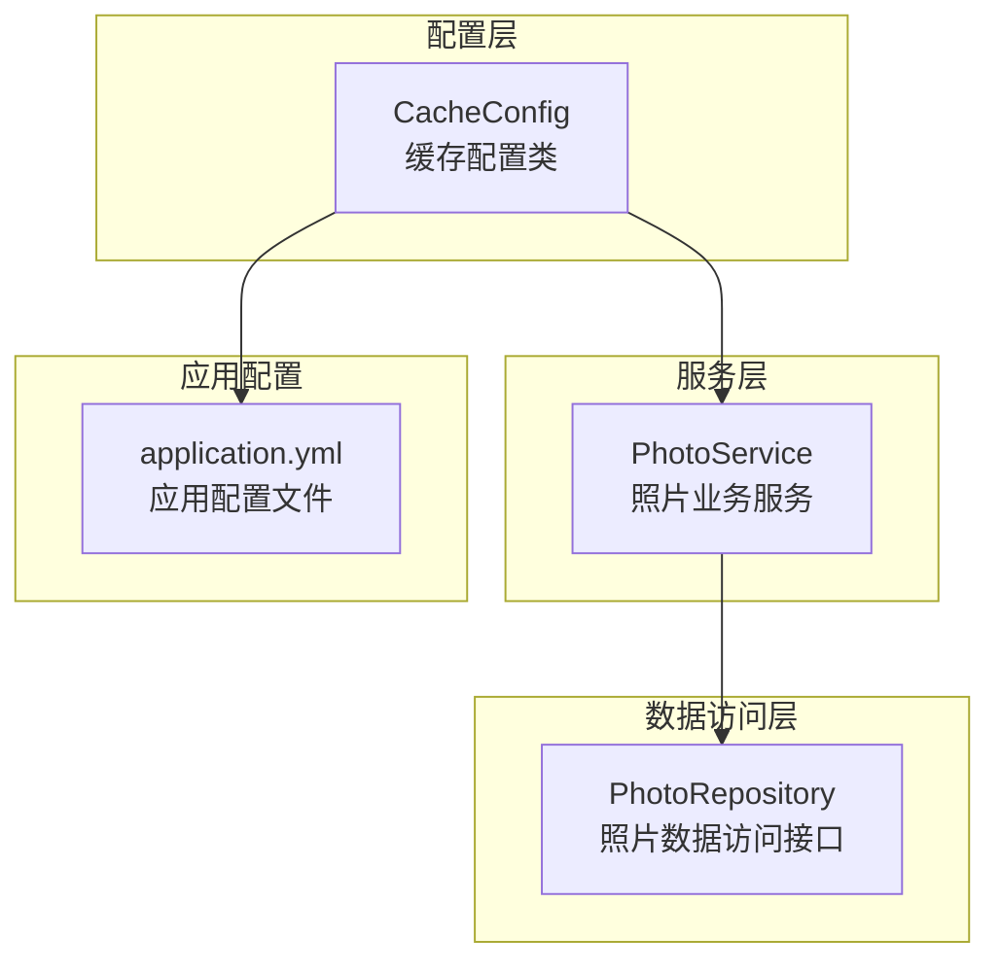
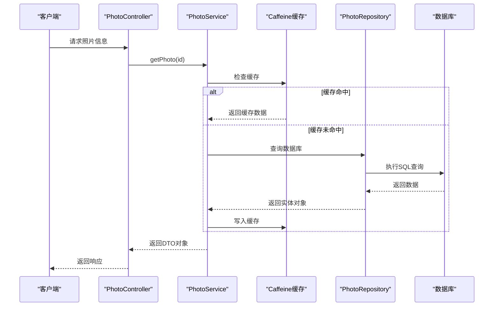
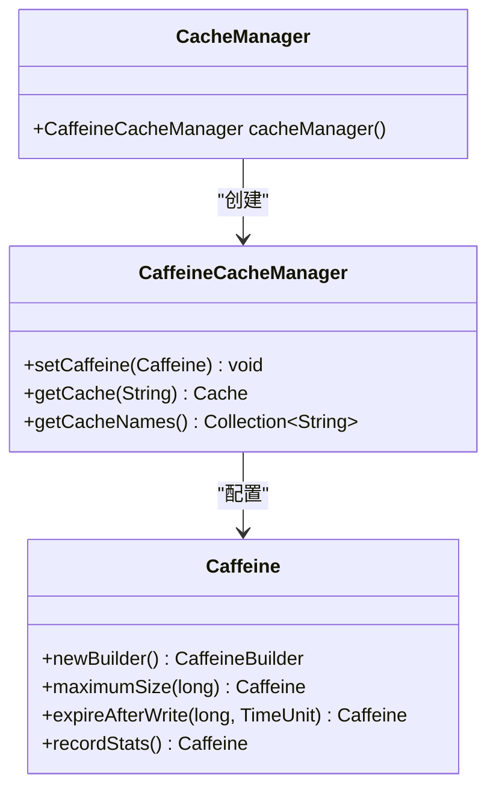
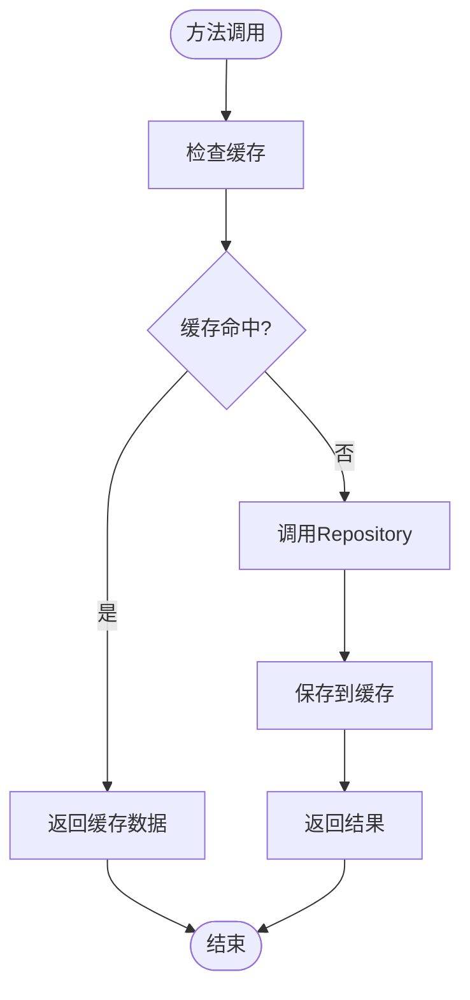
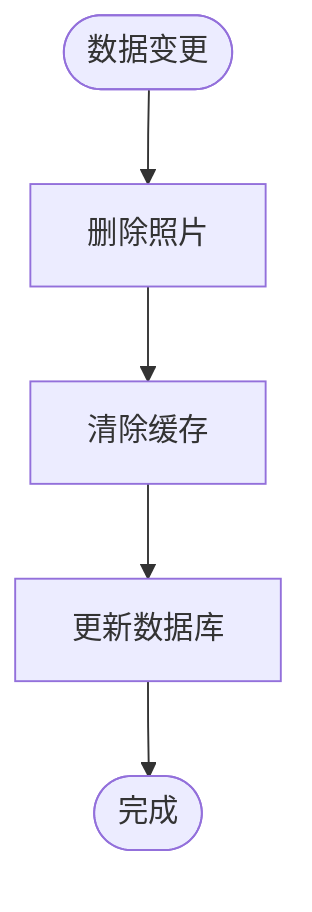
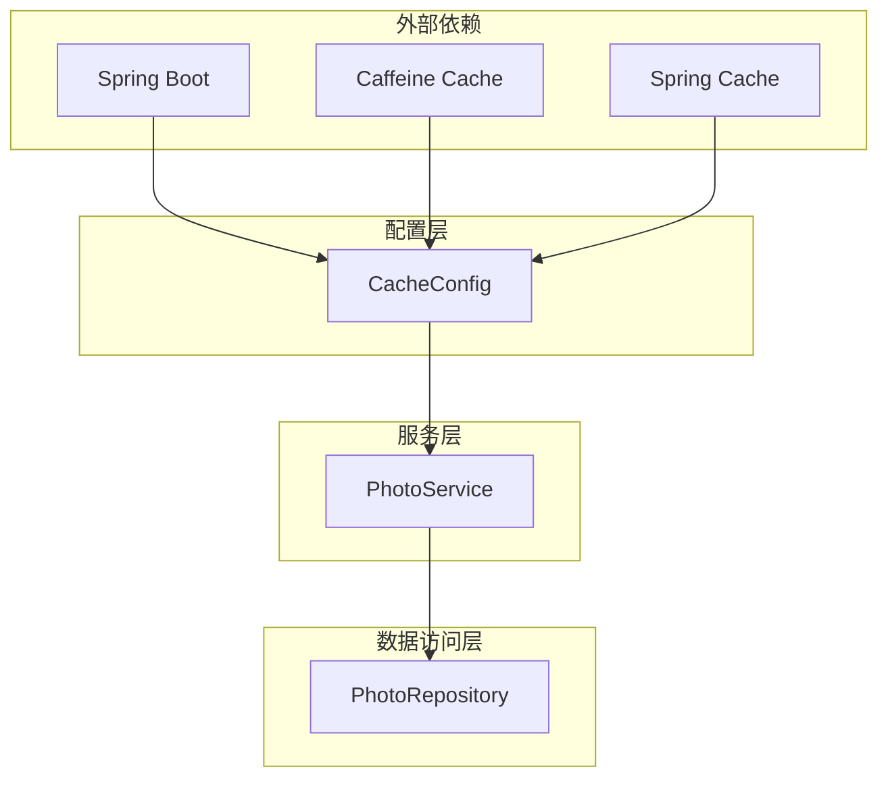
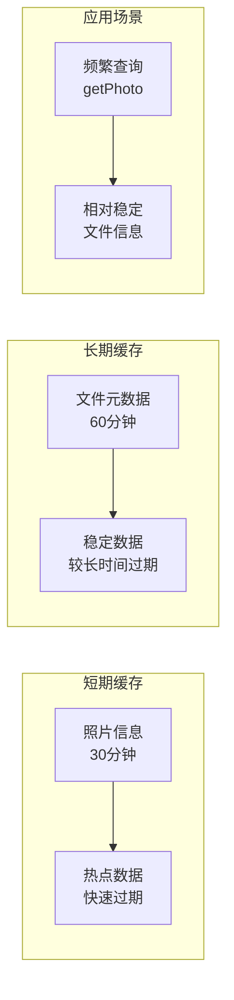
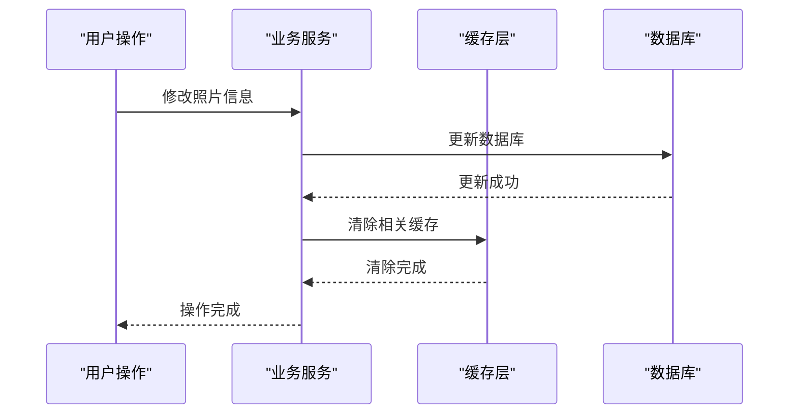

# 缓存机制

<cite>
**本文档引用的文件**
- [CacheConfig.java](file://src/main/java/com/photo/config/CacheConfig.java)
- [PhotoService.java](file://src/main/java/com/photo/service/PhotoService.java)
- [PhotoRepository.java](file://src/main/java/com/photo/repository/PhotoRepository.java)
- [application.yml](file://src/main/resources/application.yml)
- [PhotoController.java](file://src/main/java/com/photo/controller/PhotoController.java)
</cite>

## 目录
1. [简介](#简介)
2. [项目结构](#项目结构)
3. [核心组件](#核心组件)
4. [架构概览](#架构概览)
5. [详细组件分析](#详细组件分析)
6. [依赖关系分析](#依赖关系分析)
7. [性能考虑](#性能考虑)
8. [故障排除指南](#故障排除指南)
9. [结论](#结论)

## 简介

本系统采用基于Caffeine的Spring缓存机制来优化照片管理系统中的数据访问性能。通过智能缓存策略，系统能够显著减少对数据库的频繁查询，特别是在照片信息查询和文件元数据访问方面。缓存机制主要针对以下场景进行优化：
- 照片基本信息的快速查询
- 文件元数据的重复访问
- 用户照片列表的缓存
- 公开照片列表的缓存

## 项目结构

系统采用标准的Spring Boot项目结构，缓存相关配置集中在配置类中：

**图表来源**
- [CacheConfig.java](file://src/main/java/com/photo/config/CacheConfig.java#L1-L54)
- [PhotoService.java](file://src/main/java/com/photo/service/PhotoService.java#L1-L385)

**章节来源**
- [CacheConfig.java](file://src/main/java/com/photo/config/CacheConfig.java#L1-L54)
- [application.yml](file://src/main/resources/application.yml#L1-L173)

## 核心组件

系统的核心缓存组件包括三个关键的Bean配置：

### CacheManager配置
负责全局缓存管理器的配置，提供基础的缓存功能。

### photoCacheConfig配置  
专门针对照片信息的缓存配置，具有较小的缓存容量但较短的过期时间。

### fileMetadataCacheConfig配置
专门针对文件元数据的缓存配置，具有较大的缓存容量和较长的过期时间。

**章节来源**
- [CacheConfig.java](file://src/main/java/com/photo/config/CacheConfig.java#L15-L54)

## 架构概览

系统缓存架构采用多层缓存策略，结合Spring Cache注解和Caffeine本地缓存：

**图表来源**
- [PhotoService.java](file://src/main/java/com/photo/service/PhotoService.java#L140-L165)
- [PhotoController.java](file://src/main/java/com/photo/controller/PhotoController.java#L250-L265)

## 详细组件分析

### CacheConfig类详细分析

CacheConfig类是整个缓存系统的核心配置类，定义了三个关键的缓存配置Bean：

#### CacheManager Bean配置

**图表来源**
- [CacheConfig.java](file://src/main/java/com/photo/config/CacheConfig.java#L17-L23)

#### photoCacheConfig Bean配置

photoCacheConfig专门针对照片信息的缓存需求进行了优化：

| 配置参数 | 值 | 说明 |
|---------|-----|------|
| maximumSize | 500 | 最大缓存500个照片对象 |
| expireAfterWrite | 30分钟 | 写入后30分钟自动过期 |
| recordStats | 启用 | 启用统计功能 |

#### fileMetadataCacheConfig Bean配置

fileMetadataCacheConfig针对文件元数据缓存进行了专门优化：

| 配置参数 | 值 | 说明 |
|---------|-----|------|
| maximumSize | 1000 | 最大缓存1000个文件元数据对象 |
| expireAfterWrite | 60分钟 | 写入后60分钟自动过期 |
| recordStats | 启用 | 启用统计功能 |

**章节来源**
- [CacheConfig.java](file://src/main/java/com/photo/config/CacheConfig.java#L25-L54)

### 缓存使用模式分析

系统在PhotoService中广泛使用了Spring Cache注解来实现声明式缓存：

#### @Cacheable注解使用

**图表来源**
- [PhotoService.java](file://src/main/java/com/photo/service/PhotoService.java#L140-L165)

#### @CacheEvict注解使用

当数据发生变化时，系统会自动清除相关缓存以保证数据一致性：

**图表来源**
- [PhotoService.java](file://src/main/java/com/photo/service/PhotoService.java#L192-L210)

**章节来源**
- [PhotoService.java](file://src/main/java/com/photo/service/PhotoService.java#L140-L210)

### 缓存统计功能

系统启用了Caffeine的统计功能，可以监控缓存性能指标：

#### 统计指标说明

| 指标名称 | 说明 | 用途 |
|---------|------|------|
| hitRate | 缓存命中率 | 评估缓存效果 |
| evictionCount | 淘汰次数 | 监控缓存压力 |
| loadCount | 加载次数 | 分析数据加载频率 |
| loadSuccessCount | 加载成功次数 | 评估数据加载效率 |
| totalLoadTime | 总加载时间 | 性能分析 |

**章节来源**
- [CacheConfig.java](file://src/main/java/com/photo/config/CacheConfig.java#L21-L23)
- [CacheConfig.java](file://src/main/java/com/photo/config/CacheConfig.java#L33-L35)
- [CacheConfig.java](file://src/main/java/com/photo/config/CacheConfig.java#L43-L45)

## 依赖关系分析

系统的缓存依赖关系展现了清晰的分层架构：

**图表来源**
- [CacheConfig.java](file://src/main/java/com/photo/config/CacheConfig.java#L1-L10)
- [PhotoService.java](file://src/main/java/com/photo/service/PhotoService.java#L1-L20)

**章节来源**
- [CacheConfig.java](file://src/main/java/com/photo/config/CacheConfig.java#L1-L10)
- [PhotoService.java](file://src/main/java/com/photo/service/PhotoService.java#L1-L20)

## 性能考虑

### 缓存调优建议

#### 根据负载调整缓存大小

| 场景 | 推荐配置 | 说明 |
|------|----------|------|
| 高并发查询 | photoCacheConfig: 1000, fileMetadataCacheConfig: 2000 | 增加缓存容量应对高并发 |
| 低内存环境 | photoCacheConfig: 200, fileMetadataCacheConfig: 500 | 减少内存占用 |
| 长期运行 | 调整expireAfterWrite为更长时间 | 减少数据库查询频率 |

#### 过期策略优化

### 缓存一致性解决方案

#### 失效策略

系统采用主动失效策略确保数据一致性：

1. **删除操作时清除缓存**：当照片被删除或修改时，自动清除相关缓存
2. **定时清理**：通过@Scheduled注解定期清理过期缓存
3. **手动刷新**：在关键业务操作后手动刷新缓存

#### 一致性保证机制

**图表来源**
- [PhotoService.java](file://src/main/java/com/photo/service/PhotoService.java#L192-L210)

## 故障排除指南

### 常见缓存问题及解决方案

#### 缓存命中率低

**症状**：数据库查询频繁，缓存统计显示命中率低于70%

**解决方案**：
1. 检查缓存键配置是否正确
2. 调整缓存过期时间
3. 增加缓存容量

#### 内存溢出

**症状**：应用启动时出现OutOfMemoryError

**解决方案**：
1. 减少maximumSize配置
2. 优化缓存对象大小
3. 启用堆外缓存

#### 数据不一致

**症状**：看到过期或错误的数据

**解决方案**：
1. 检查@CacheEvict注解配置
2. 验证缓存键生成逻辑
3. 确认事务边界设置

**章节来源**
- [CacheConfig.java](file://src/main/java/com/photo/config/CacheConfig.java#L21-L23)
- [PhotoService.java](file://src/main/java/com/photo/service/PhotoService.java#L192-L210)

## 结论

本系统的缓存机制设计充分考虑了照片管理系统的特性，通过合理的配置和使用策略，实现了以下目标：

### 主要优势

1. **性能提升**：显著减少了对数据库的直接查询，提升了系统响应速度
2. **资源优化**：通过智能缓存策略，降低了数据库连接压力
3. **可维护性**：使用Spring Cache注解简化了缓存管理代码
4. **监控能力**：启用了详细的缓存统计功能，便于性能监控

### 应用建议

1. **监控缓存性能**：定期检查缓存命中率和统计指标
2. **动态调整配置**：根据实际负载情况动态调整缓存参数
3. **关注内存使用**：在高并发场景下注意内存使用情况
4. **测试缓存效果**：在部署前进行充分的缓存性能测试

通过这套完善的缓存机制，系统能够在保证数据一致性的同时，提供高性能的照片管理服务，为用户提供流畅的使用体验。