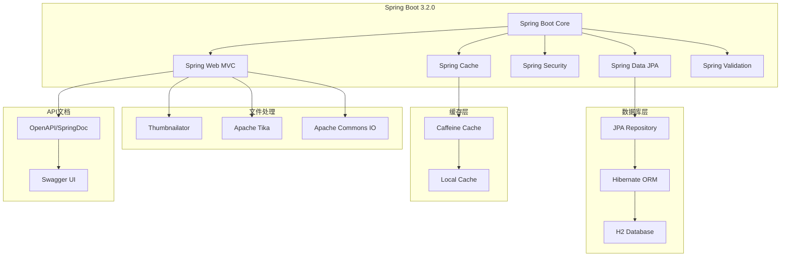
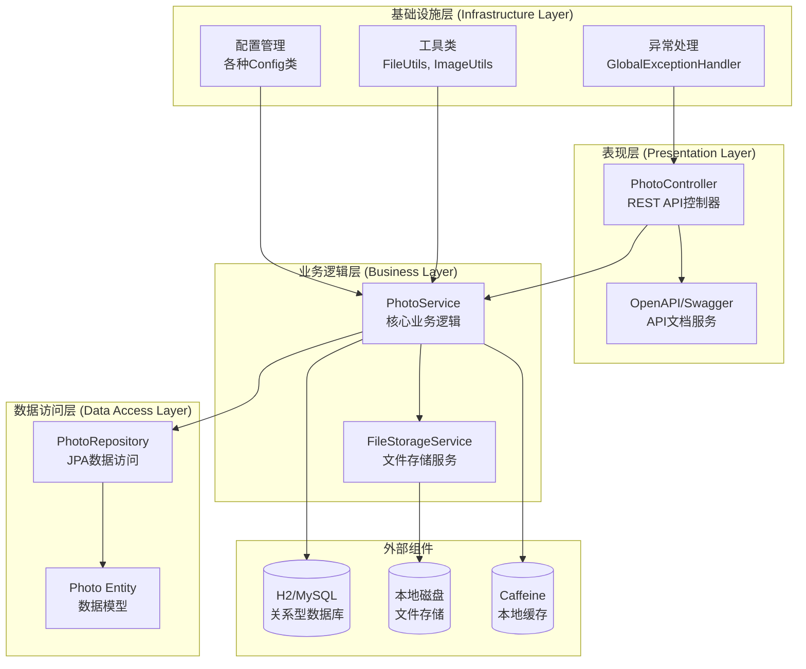
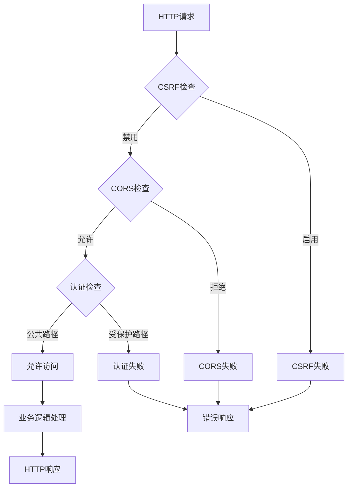
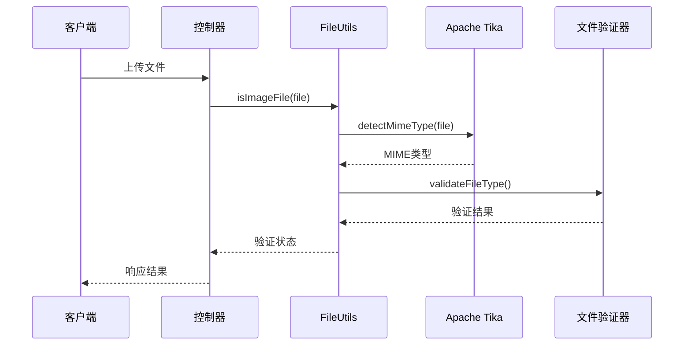
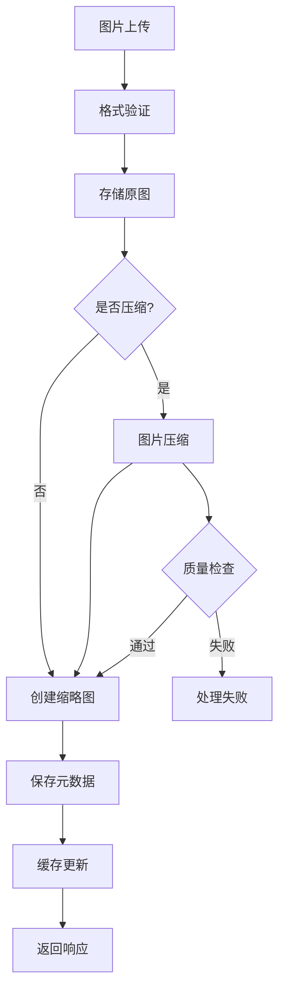
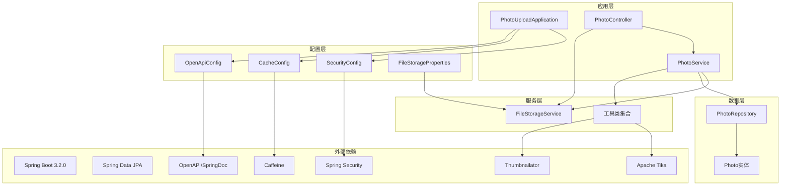
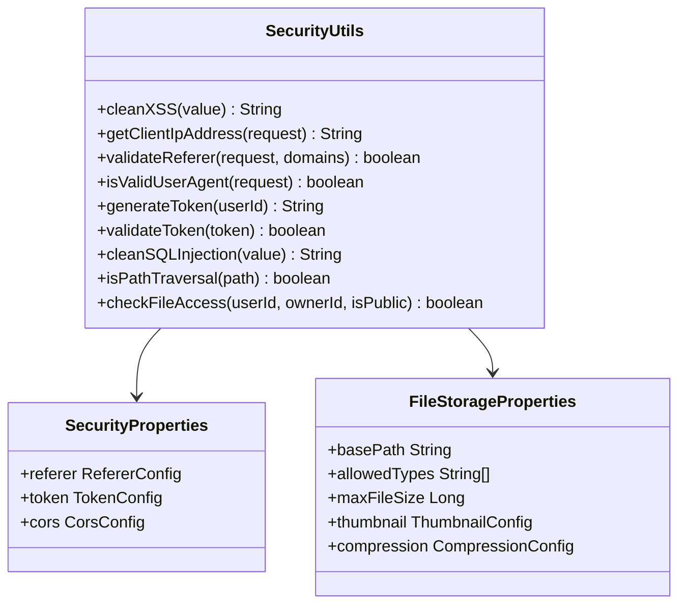

# 技术栈与依赖

<cite>
**本文档引用的文件**
- [pom.xml](file://pom.xml)
- [application.yml](file://src/main/resources/application.yml)
- [PhotoUploadApplication.java](file://src/main/java/com/photo/PhotoUploadApplication.java)
- [SecurityConfig.java](file://src/main/java/com/photo/config/SecurityConfig.java)
- [CacheConfig.java](file://src/main/java/com/photo/config/CacheConfig.java)
- [OpenApiConfig.java](file://src/main/java/com/photo/config/OpenApiConfig.java)
- [FileStorageProperties.java](file://src/main/java/com/photo/config/FileStorageProperties.java)
- [SecurityProperties.java](file://src/main/java/com/photo/config/SecurityProperties.java)
- [Photo.java](file://src/main/java/com/photo/entity/Photo.java)
- [PhotoRepository.java](file://src/main/java/com/photo/repository/PhotoRepository.java)
- [PhotoService.java](file://src/main/java/com/photo/service/PhotoService.java)
- [FileStorageService.java](file://src/main/java/com/photo/service/FileStorageService.java)
- [PhotoController.java](file://src/main/java/com/photo/controller/PhotoController.java)
- [ImageUtils.java](file://src/main/java/com/photo/util/ImageUtils.java)
- [FileUtils.java](file://src/main/java/com/photo/util/FileUtils.java)
- [SecurityUtils.java](file://src/main/java/com/photo/util/SecurityUtils.java)
- [GlobalExceptionHandler.java](file://src/main/java/com/photo/exception/GlobalExceptionHandler.java)
</cite>

## 目录
1. [项目概述](#项目概述)
2. [核心技术栈](#核心技术栈)
3. [依赖分析](#依赖分析)
4. [架构设计](#架构设计)
5. [核心组件详解](#核心组件详解)
6. [技术集成方式](#技术集成方式)
7. [性能优化策略](#性能优化策略)
8. [安全机制](#安全机制)
9. [总结](#总结)

## 项目概述

zcyTest2是一个基于Spring Boot构建的高性能照片管理系统，专注于提供安全、高效的文件上传、存储和管理功能。该项目采用了现代化的Java技术栈，集成了多种专业化的框架和库，形成了一个完整的企业级解决方案。

### 核心特性
- **高性能文件处理**：支持大文件上传、断点续传、图片压缩和缩略图生成
- **高安全性保障**：多层次的安全防护机制，包括防盗链、XSS防护、SQL注入防护
- **智能缓存策略**：基于Caffeine的本地缓存，提升系统响应速度
- **自动化运维**：定时清理过期文件，自动监控存储空间
- **完善的API文档**：基于OpenAPI/Swagger的自动生成文档

## 核心技术栈

### Spring Boot生态系统



**图表来源**
- [PhotoUploadApplication.java](file://src/main/java/com/photo/PhotoUploadApplication.java#L1-L20)
- [pom.xml](file://pom.xml#L1-L155)

**章节来源**
- [pom.xml](file://pom.xml#L1-L155)
- [PhotoUploadApplication.java](file://src/main/java/com/photo/PhotoUploadApplication.java#L1-L20)

## 依赖分析

### 核心依赖配置

| 依赖名称 | 版本 | 用途 | 关键特性 |
|---------|------|------|----------|
| Spring Boot Starter Web | 3.2.0 | Web应用基础框架 | RESTful API支持、嵌入式Tomcat |
| Spring Boot Starter Data JPA | 3.2.0 | ORM持久化 | Hibernate集成、JPQL查询 |
| Spring Boot Starter Security | 3.2.0 | 安全控制 | 认证授权、CSRF防护 |
| Spring Boot Starter Cache | 3.2.0 | 缓存支持 | 本地缓存抽象 |
| Spring Boot Starter Validation | 3.2.0 | 参数校验 | Bean Validation规范 |

### 第三方库依赖

| 依赖名称 | 版本 | 用途 | 技术优势 |
|---------|------|------|----------|
| Thumbnailator | 0.4.19 | 图片处理 | 图片压缩、缩略图生成、格式转换 |
| Apache Tika | 2.9.1 | 文件检测 | 深度文件类型识别、元数据提取 |
| Apache Commons IO | 2.11.0 | IO工具 | 文件操作、流处理 |
| Caffeine | 最新 | 本地缓存 | 高性能、低延迟、LRU策略 |
| springdoc-openapi | 2.3.0 | API文档 | OpenAPI 3.0、Swagger UI |

### 开发工具依赖

| 依赖名称 | 版本 | 用途 | 开发效率 |
|---------|------|------|----------|
| Lombok | 最新 | 代码简化 | 减少样板代码 |
| Spring Boot DevTools | 最新 | 开发热部署 | 自动重启、实时更新 |
| H2 Database | 运行时 | 内存数据库 | 开发测试、快速原型 |

**章节来源**
- [pom.xml](file://pom.xml#L25-L130)

## 架构设计

### 整体架构图



**图表来源**
- [PhotoController.java](file://src/main/java/com/photo/controller/PhotoController.java#L1-L316)
- [PhotoService.java](file://src/main/java/com/photo/service/PhotoService.java#L1-L385)
- [PhotoRepository.java](file://src/main/java/com/photo/repository/PhotoRepository.java#L1-L112)

### 分层架构详解

#### 表现层 (Presentation Layer)
- **PhotoController**：负责HTTP请求处理，参数验证，响应格式化
- **OpenAPI配置**：自动生成API文档，提供交互式API测试界面

#### 业务逻辑层 (Business Layer)
- **PhotoService**：核心业务逻辑，包括文件上传、处理、存储
- **FileStorageService**：文件系统操作，包括存储、读取、删除

#### 数据访问层 (Data Access Layer)
- **PhotoRepository**：JPA数据访问接口，提供CRUD操作
- **Photo实体**：数据库表映射，包含完整的照片元数据

**章节来源**
- [PhotoController.java](file://src/main/java/com/photo/controller/PhotoController.java#L1-L50)
- [PhotoService.java](file://src/main/java/com/photo/service/PhotoService.java#L1-L100)
- [PhotoRepository.java](file://src/main/java/com/photo/repository/PhotoRepository.java#L1-L50)

## 核心组件详解

### Spring Boot 3.2.0 - 基础框架

Spring Boot 3.2.0作为项目的基础框架，提供了以下核心能力：

#### 主要特性
- **自动配置**：基于约定优于配置的原则，减少样板代码
- **嵌入式服务器**：内置Tomcat，简化部署流程
- **生产就绪功能**：健康检查、指标监控、外部化配置
- **模块化设计**：支持功能模块的独立开发和测试

#### 配置启用
```java
@SpringBootApplication
@EnableCaching
@EnableScheduling
public class PhotoUploadApplication {
    public static void main(String[] args) {
        SpringApplication.run(PhotoUploadApplication.class, args);
    }
}
```

### Spring Data JPA - ORM映射

#### 核心功能
- **实体映射**：Photo实体与数据库表的自动映射
- **查询方法**：基于方法名的查询自动生成功能
- **事务管理**：声明式事务支持
- **索引优化**：数据库索引的自动创建

#### 实体设计特点
- **复合索引**：为常用查询字段建立索引
- **软删除**：通过deleted字段实现逻辑删除
- **审计字段**：自动维护创建时间和更新时间

**章节来源**
- [PhotoUploadApplication.java](file://src/main/java/com/photo/PhotoUploadApplication.java#L10-L20)
- [Photo.java](file://src/main/java/com/photo/entity/Photo.java#L1-L174)
- [PhotoRepository.java](file://src/main/java/com/photo/repository/PhotoRepository.java#L1-L112)

### Spring Security - 安全控制

#### 安全配置层次



**图表来源**
- [SecurityConfig.java](file://src/main/java/com/photo/config/SecurityConfig.java#L25-L50)

#### 安全特性
- **CSRF防护**：跨站请求伪造攻击防护
- **CORS配置**：跨域资源共享控制
- **会话管理**：无状态会话策略
- **密码加密**：BCrypt密码编码器

**章节来源**
- [SecurityConfig.java](file://src/main/java/com/photo/config/SecurityConfig.java#L1-L71)
- [SecurityProperties.java](file://src/main/java/com/photo/config/SecurityProperties.java#L1-L53)

### Caffeine - 本地缓存

#### 缓存策略设计

```mermaid
graph LR
subgraph "缓存层次结构"
GLOBAL_CACHE[全局缓存<br/>1000条，1小时]
PHOTO_CACHE[照片缓存<br/>500条，30分钟]
METADATA_CACHE[元数据缓存<br/>1000条，1小时]
end
subgraph "缓存应用场景"
PHOTO_READ[照片读取<br/>@Cacheable]
PHOTO_DELETE[照片删除<br/>@CacheEvict]
METADATA_QUERY[元数据查询<br/>统计信息]
end
PHOTO_READ --> PHOTO_CACHE
PHOTO_DELETE --> PHOTO_CACHE
METADATA_QUERY --> METADATA_CACHE
PHOTO_READ --> GLOBAL_CACHE
PHOTO_DELETE --> GLOBAL_CACHE
```

**图表来源**
- [CacheConfig.java](file://src/main/java/com/photo/config/CacheConfig.java#L15-L50)

#### 缓存配置特点
- **多级缓存**：不同类型的缓存采用不同的策略
- **统计监控**：启用缓存统计，便于性能调优
- **内存管理**：合理的容量限制，避免内存溢出

**章节来源**
- [CacheConfig.java](file://src/main/java/com/photo/config/CacheConfig.java#L1-L54)

### Apache Tika - 文件类型检测

#### 文件检测流程



**图表来源**
- [FileUtils.java](file://src/main/java/com/photo/util/FileUtils.java#L50-L80)
- [PhotoService.java](file://src/main/java/com/photo/service/PhotoService.java#L350-L380)

#### 检测能力
- **深度文件识别**：不仅仅是文件扩展名，而是文件内容识别
- **多种格式支持**：支持主流图片格式的深度检测
- **元数据提取**：提取文件的详细元数据信息

**章节来源**
- [FileUtils.java](file://src/main/java/com/photo/util/FileUtils.java#L1-L178)

### Thumbnailator - 图片处理

#### 图片处理流水线



**图表来源**
- [PhotoService.java](file://src/main/java/com/photo/service/PhotoService.java#L50-L120)
- [ImageUtils.java](file://src/main/java/com/photo/util/ImageUtils.java#L1-L182)

#### 处理功能
- **尺寸调整**：自动调整图片尺寸，适应不同显示需求
- **质量控制**：可配置的压缩质量，平衡文件大小和视觉效果
- **格式转换**：支持多种图片格式的相互转换
- **缩略图生成**：自动生成适合预览的小尺寸图片

**章节来源**
- [ImageUtils.java](file://src/main/java/com/photo/util/ImageUtils.java#L1-L182)
- [FileStorageService.java](file://src/main/java/com/photo/service/FileStorageService.java#L1-L300)

## 技术集成方式

### 依赖关系图



**图表来源**
- [PhotoUploadApplication.java](file://src/main/java/com/photo/PhotoUploadApplication.java#L1-L20)
- [SecurityConfig.java](file://src/main/java/com/photo/config/SecurityConfig.java#L1-L71)
- [CacheConfig.java](file://src/main/java/com/photo/config/CacheConfig.java#L1-L54)

### 集成模式

#### 1. 配置驱动集成
项目采用Spring Boot的配置驱动模式，通过application.yml集中管理所有配置：
- **数据库连接**：支持H2内存数据库和MySQL关系型数据库
- **文件存储**：灵活的文件存储路径和格式配置
- **安全策略**：可配置的防盗链、CORS和认证策略

#### 2. 依赖注入集成
利用Spring的依赖注入机制，实现松耦合的设计：
- **服务层注入**：PhotoService注入FileStorageService和PhotoRepository
- **配置注入**：各种配置类通过@Autowired注解注入
- **工具类注入**：静态工具类通过配置类间接使用

#### 3. 异常处理集成
统一的异常处理机制，确保系统的稳定性和用户体验：
- **全局异常处理器**：捕获并处理各类业务异常
- **HTTP状态码映射**：将业务异常映射为合适的HTTP状态码
- **错误响应格式**：统一的错误响应格式

**章节来源**
- [application.yml](file://src/main/resources/application.yml#L1-L173)
- [GlobalExceptionHandler.java](file://src/main/java/com/photo/exception/GlobalExceptionHandler.java#L1-L140)

## 性能优化策略

### 缓存优化

#### 多级缓存策略
- **照片信息缓存**：@Cacheable注解自动缓存照片基本信息
- **查询结果缓存**：缓存常用的查询结果，减少数据库访问
- **元数据缓存**：缓存文件大小统计等元数据信息

#### 缓存失效策略
- **主动失效**：@CacheEvict注解在数据变更时主动清除缓存
- **过期策略**：基于时间的自动过期机制
- **容量管理**：基于LRU算法的缓存淘汰策略

### 文件处理优化

#### 异步处理
- **图片压缩**：异步执行图片压缩操作，不阻塞主线程
- **缩略图生成**：后台生成缩略图，提升响应速度
- **定时任务**：定期清理过期文件，保持系统性能

#### 流式处理
- **断点续传**：支持大文件的断点续传功能
- **流式读取**：大文件采用流式读取，避免内存溢出
- **分块传输**：HTTP Range请求支持分块传输

### 数据库优化

#### 查询优化
- **索引策略**：为常用查询字段建立复合索引
- **分页查询**：大数据量场景下的分页查询优化
- **懒加载**：关联对象的懒加载策略

#### 连接池优化
- **连接池配置**：合理配置数据库连接池参数
- **事务管理**：声明式事务管理，确保数据一致性
- **批量操作**：支持批量插入和更新操作

**章节来源**
- [PhotoService.java](file://src/main/java/com/photo/service/PhotoService.java#L120-L180)
- [PhotoRepository.java](file://src/main/java/com/photo/repository/PhotoRepository.java#L20-L60)

## 安全机制

### 多层次安全防护

#### 1. 网络安全
- **HTTPS强制**：生产环境强制使用HTTPS协议
- **CORS控制**：精确控制跨域访问权限
- **防盗链**：基于Referer的防盗链机制

#### 2. 应用安全
- **输入验证**：严格的文件类型和大小验证
- **路径安全**：防止路径遍历攻击
- **XSS防护**：HTML内容的转义处理

#### 3. 数据安全
- **文件隔离**：用户文件的物理隔离存储
- **软删除**：逻辑删除机制，保留数据完整性
- **访问控制**：基于用户身份的访问权限控制

### 安全工具类



**图表来源**
- [SecurityUtils.java](file://src/main/java/com/photo/util/SecurityUtils.java#L1-L167)
- [SecurityProperties.java](file://src/main/java/com/photo/config/SecurityProperties.java#L1-L53)
- [FileStorageProperties.java](file://src/main/java/com/photo/config/FileStorageProperties.java#L1-L94)

### 安全配置要点

#### 防盗链配置
```yaml
security:
  referer:
    enabled: true
    allowed-domains:
      - localhost
      - 127.0.0.1
```

#### CORS配置
```yaml
security:
  cors:
    enabled: true
    allowed-origins:
      - http://localhost:3000
      - http://localhost:8080
    allowed-methods:
      - GET
      - POST
      - PUT
      - DELETE
```

#### 文件安全配置
```yaml
file:
  storage:
    allowed-types:
      - image/jpeg
      - image/jpg
      - image/png
      - image/gif
      - image/bmp
      - image/webp
    max-file-size: 10485760  # 10MB
```

**章节来源**
- [SecurityUtils.java](file://src/main/java/com/photo/util/SecurityUtils.java#L1-L167)
- [SecurityProperties.java](file://src/main/java/com/photo/config/SecurityProperties.java#L1-L53)
- [application.yml](file://src/main/resources/application.yml#L80-L120)

## 总结

zcyTest2项目通过精心选择和集成的技术栈，构建了一个高性能、高安全性、高可用性的照片管理系统。以下是项目技术架构的核心优势：

### 技术架构优势

1. **现代化框架组合**：Spring Boot 3.2.0 + Spring生态体系提供了坚实的技术基础
2. **专业化的第三方库**：Apache Tika和Thumbnailator的专业能力确保了文件处理的质量
3. **多层次缓存策略**：Caffeine本地缓存显著提升了系统性能
4. **完善的异常处理**：全局异常处理器保证了系统的稳定性
5. **自动化运维能力**：定时任务和监控功能实现了系统的自我维护

### 性能表现

- **响应速度**：通过多级缓存和异步处理，确保了快速的响应时间
- **并发处理**：基于Spring的并发处理能力和合理的资源分配
- **存储效率**：智能的文件压缩和存储策略，最大化存储利用率

### 安全保障

- **输入验证**：严格的文件类型和大小验证机制
- **访问控制**：基于角色的访问控制和文件权限管理
- **攻击防护**：多重安全防护机制抵御各种攻击

### 可扩展性

- **模块化设计**：清晰的分层架构便于功能扩展
- **配置驱动**：灵活的配置系统支持不同环境的需求
- **插件化架构**：易于集成新的功能模块和第三方服务

这个技术栈不仅满足了当前的功能需求，还为未来的扩展和升级奠定了良好的基础。通过持续的优化和改进，这个系统能够适应不断变化的业务需求和技术发展趋势。