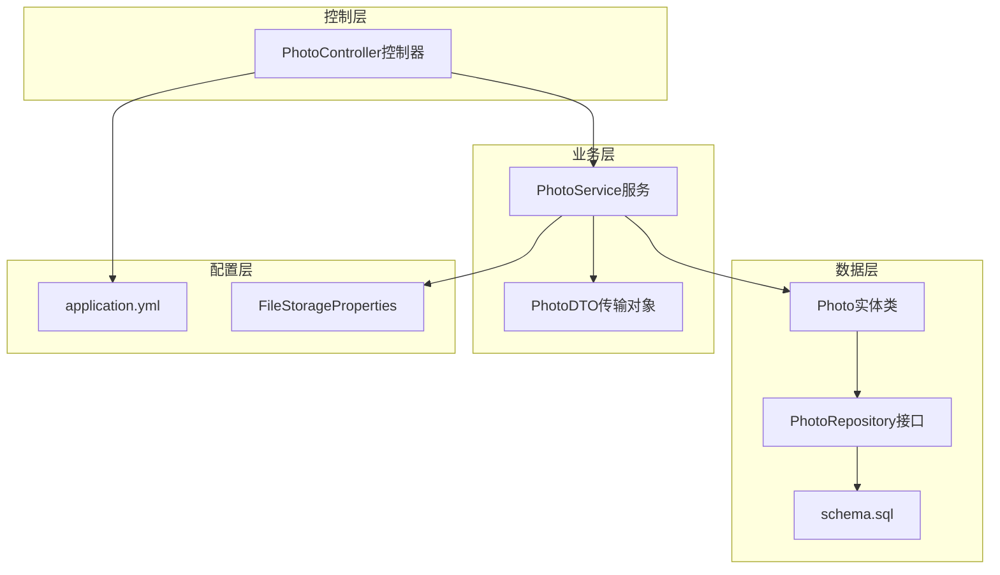
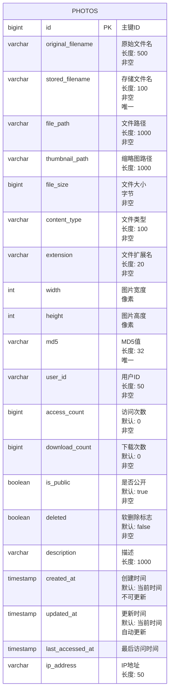
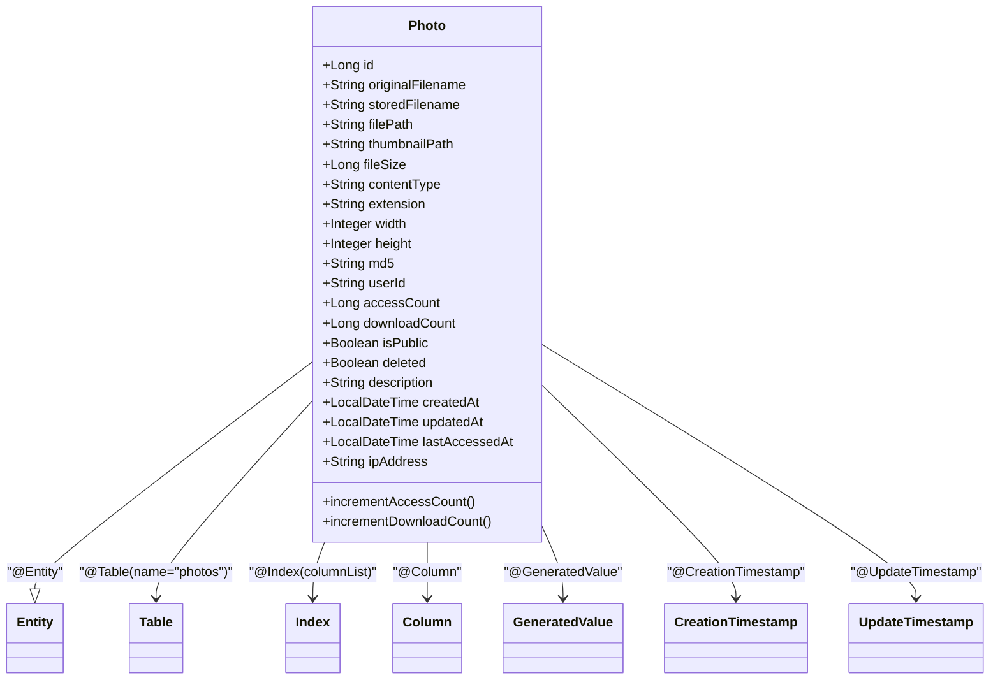
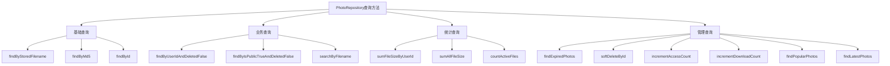
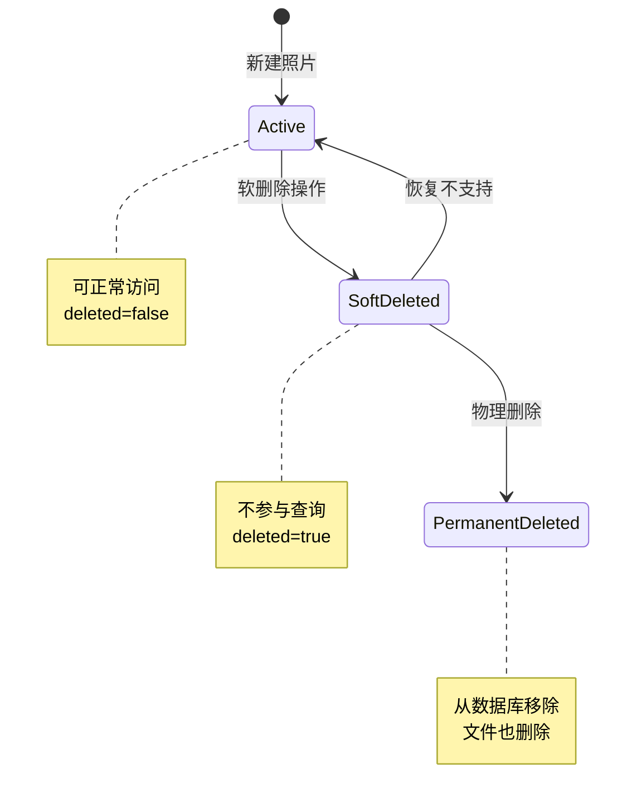
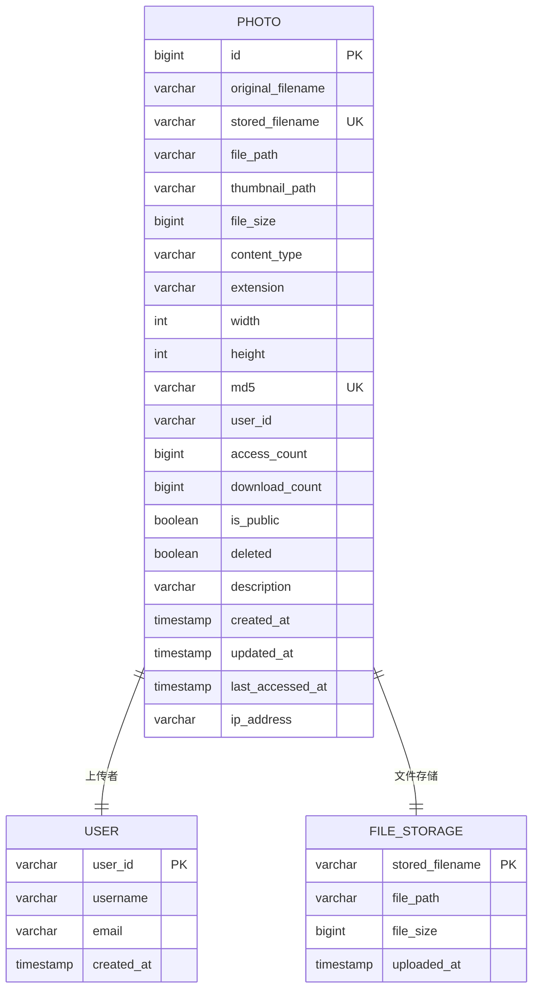

# 数据模型

<cite>
**本文档中引用的文件**
- [Photo.java](file://src/main/java/com/photo/entity/Photo.java)
- [PhotoRepository.java](file://src/main/java/com/photo/repository/PhotoRepository.java)
- [schema.sql](file://src/main/resources/schema.sql)
- [PhotoDTO.java](file://src/main/java/com/photo/dto/PhotoDTO.java)
- [PhotoService.java](file://src/main/java/com/photo/service/PhotoService.java)
- [PhotoController.java](file://src/main/java/com/photo/controller/PhotoController.java)
- [application.yml](file://src/main/resources/application.yml)
- [FileStorageProperties.java](file://src/main/java/com/photo/config/FileStorageProperties.java)
</cite>

## 目录
1. [简介](#简介)
2. [项目结构概览](#项目结构概览)
3. [Photo实体类详解](#photo实体类详解)
4. [数据库表结构](#数据库表结构)
5. [JPA注解映射关系](#jpa注解映射关系)
6. [PhotoRepository查询方法](#photorepository查询方法)
7. [数据生命周期管理](#数据生命周期管理)
8. [实体关系图](#实体关系图)
9. [性能优化策略](#性能优化策略)
10. [总结](#总结)

## 简介

本文档详细描述了Photo上传系统中的核心数据模型，包括Photo实体类的设计、数据库映射关系、查询方法以及数据生命周期管理策略。该系统采用Spring Boot框架，使用JPA进行ORM映射，实现了完整的照片上传、存储、管理和检索功能。

## 项目结构概览

**图表来源**
- [Photo.java](file://src/main/java/com/photo/entity/Photo.java#L1-L174)
- [PhotoRepository.java](file://src/main/java/com/photo/repository/PhotoRepository.java#L1-L112)
- [PhotoService.java](file://src/main/java/com/photo/service/PhotoService.java#L1-L385)

## Photo实体类详解

Photo实体类是整个系统的核心数据模型，包含了24个字段，每个字段都有明确的业务含义和约束条件。

### 字段详细说明

| 字段名 | 类型 | 约束条件 | 业务含义 |
|--------|------|----------|----------|
| id | Long | 主键，自增 | 照片唯一标识符 |
| originalFilename | String | 非空，长度500 | 用户上传时的原始文件名 |
| storedFilename | String | 非空，唯一，长度100 | 系统生成的存储文件名（UUID） |
| filePath | String | 非空，长度1000 | 文件在服务器上的绝对路径 |
| thumbnailPath | String | 长度1000 | 缩略图文件路径 |
| fileSize | Long | 非空 | 文件大小（字节） |
| contentType | String | 非空，长度100 | MIME文件类型 |
| extension | String | 非空，长度20 | 文件扩展名 |
| width | Integer | 可为空 | 图片宽度（像素） |
| height | Integer | 可为空 | 图片高度（像素） |
| md5 | String | 长度32，唯一 | 文件MD5值，用于去重 |
| userId | String | 非空，长度50 | 上传用户ID |
| accessCount | Long | 默认0，非空 | 访问次数统计 |
| downloadCount | Long | 默认0，非空 | 下载次数统计 |
| isPublic | Boolean | 默认true，非空 | 是否公开可见 |
| deleted | Boolean | 默认false，非空 | 软删除标志 |
| description | String | 长度1000 | 照片描述信息 |
| createdAt | LocalDateTime | 非空，不可更新 | 创建时间戳 |
| updatedAt | LocalDateTime | 非空 | 更新时间戳 |
| lastAccessedAt | LocalDateTime | 可为空 | 最后访问时间 |
| ipAddress | String | 长度50 | 上传时的IP地址 |

**章节来源**
- [Photo.java](file://src/main/java/com/photo/entity/Photo.java#L25-L173)

### 实体方法说明

Photo实体类提供了两个重要的业务方法：

1. **incrementAccessCount()**: 增加访问次数并更新最后访问时间
2. **incrementDownloadCount()**: 增加下载次数

这些方法确保了统计数据的准确性和实时性。

## 数据库表结构

基于Photo实体类的JPA映射，数据库中的photos表结构如下：

**图表来源**
- [schema.sql](file://src/main/resources/schema.sql#L4-L35)
- [Photo.java](file://src/main/java/com/photo/entity/Photo.java#L25-L173)

### 索引设计

系统在以下字段上建立了索引以优化查询性能：

1. **idx_original_filename**: 原始文件名索引，支持模糊查询
2. **idx_created_at**: 创建时间索引，支持时间范围查询
3. **idx_user_id**: 用户ID索引，支持用户相关查询
4. **idx_md5**: MD5值索引，支持文件去重查询

**章节来源**
- [Photo.java](file://src/main/java/com/photo/entity/Photo.java#L18-L22)
- [schema.sql](file://src/main/resources/schema.sql#L32-L35)

## JPA注解映射关系

Photo实体类使用了多种JPA注解来定义与数据库表的映射关系：

**图表来源**
- [Photo.java](file://src/main/java/com/photo/entity/Photo.java#L15-L173)

### 关键注解说明

1. **@Entity**: 标识这是一个持久化实体类
2. **@Table**: 指定数据库表名和索引配置
3. **@Id + @GeneratedValue**: 定义主键和生成策略
4. **@Column**: 定义字段映射和约束
5. **@CreationTimestamp**: 自动设置创建时间
6. **@UpdateTimestamp**: 自动更新修改时间

**章节来源**
- [Photo.java](file://src/main/java/com/photo/entity/Photo.java#L15-L22)

## PhotoRepository查询方法

PhotoRepository接口继承了JpaRepository，提供了15个专门的查询方法来支持各种业务场景：

### 查询方法分类

**图表来源**
- [PhotoRepository.java](file://src/main/java/com/photo/repository/PhotoRepository.java#L15-L111)

### 方法详细说明

| 方法类别 | 方法名称 | 参数 | 返回类型 | 业务用途 |
|----------|----------|------|----------|----------|
| 基础查询 | findByStoredFilename | String storedFilename | Optional<Photo> | 根据存储文件名查找照片 |
| 基础查询 | findByMd5 | String md5 | Optional<Photo> | 根据MD5值查找重复文件 |
| 用户查询 | findByUserIdAndDeletedFalse | String userId, Pageable pageable | Page<Photo> | 获取用户未删除的照片 |
| 公开查询 | findByIsPublicTrueAndDeletedFalse | Pageable pageable | Page<Photo> | 获取公开且未删除的照片 |
| 搜索查询 | searchByFilename | String filename, Pageable pageable | Page<Photo> | 模糊搜索文件名 |
| 统计查询 | sumFileSizeByUserId | String userId | Long | 统计用户文件总大小 |
| 统计查询 | sumAllFileSize | 无参数 | Long | 统计所有文件总大小 |
| 统计查询 | countActiveFiles | 无参数 | Long | 统计活跃文件数量 |
| 管理查询 | findExpiredPhotos | LocalDateTime expiryDate | List<Photo> | 查找过期文件 |
| 管理查询 | softDeleteById | Long id | void | 软删除指定ID的照片 |
| 管理查询 | softDeleteByIds | List<Long> ids | void | 批量软删除 |
| 管理查询 | incrementAccessCount | Long id, LocalDateTime accessTime | void | 增加访问次数 |
| 管理查询 | incrementDownloadCount | Long id | void | 增加下载次数 |
| 排序查询 | findPopularPhotos | Pageable pageable | Page<Photo> | 获取热门照片 |
| 排序查询 | findLatestPhotos | Pageable pageable | Page<Photo> | 获取最新照片 |

**章节来源**
- [PhotoRepository.java](file://src/main/java/com/photo/repository/PhotoRepository.java#L15-L111)

## 数据生命周期管理

系统实现了完整的数据生命周期管理策略，包括软删除、自动清理和访问统计等功能。

### 软删除机制

**图表来源**
- [PhotoService.java](file://src/main/java/com/photo/service/PhotoService.java#L180-L210)
- [PhotoService.java](file://src/main/java/com/photo/service/PhotoService.java#L212-L240)

### 自动清理机制

系统配置了定期清理任务来自动管理过期文件：

1. **清理触发条件**: 存储空间不足或文件超过保留期限
2. **清理策略**: 物理删除过期文件和数据库记录
3. **清理频率**: 支持自定义Cron表达式，默认每天凌晨2点执行
4. **保留期限**: 可配置，默认30天

**章节来源**
- [PhotoService.java](file://src/main/java/com/photo/service/PhotoService.java#L320-L350)
- [application.yml](file://src/main/resources/application.yml#L85-L90)

### 访问统计

系统提供了详细的访问统计功能：

- **访问次数**: 记录每次在线预览
- **下载次数**: 记录每次下载操作  
- **最后访问时间**: 记录最近访问时间
- **IP地址**: 记录上传时的客户端IP

**章节来源**
- [Photo.java](file://src/main/java/com/photo/entity/Photo.java#L165-L173)
- [PhotoService.java](file://src/main/java/com/photo/service/PhotoService.java#L242-L255)

## 实体关系图

**图表来源**
- [Photo.java](file://src/main/java/com/photo/entity/Photo.java#L25-L173)
- [PhotoService.java](file://src/main/java/com/photo/service/PhotoService.java#L40-L80)

## 性能优化策略

### 查询优化

1. **索引策略**: 在常用查询字段上建立索引
2. **分页查询**: 使用JPA的Pageable支持大数据集分页
3. **懒加载**: 对于大字段（如文件路径）使用懒加载
4. **缓存机制**: 使用Redis缓存热点数据

### 存储优化

1. **文件去重**: 基于MD5值检测重复文件
2. **压缩存储**: 自动压缩大图片文件
3. **缩略图**: 生成小尺寸缩略图减少带宽消耗
4. **定期清理**: 自动清理过期文件释放空间

### 并发优化

1. **事务管理**: 使用@Transactional注解保证数据一致性
2. **乐观锁**: 在并发更新时避免数据冲突
3. **异步处理**: 文件上传和处理采用异步方式

**章节来源**
- [PhotoService.java](file://src/main/java/com/photo/service/PhotoService.java#L40-L120)
- [application.yml](file://src/main/resources/application.yml#L45-L55)

## 总结

Photo实体类作为整个照片管理系统的核心数据模型，设计合理、功能完备。它不仅包含了照片的基本元数据信息，还实现了软删除、访问统计、文件去重等高级功能。通过JPA的ORM映射，系统能够高效地与数据库交互，同时提供了丰富的查询方法来支持各种业务场景。

系统的数据生命周期管理策略确保了数据的安全性和可用性，自动清理机制有效防止了存储空间的无限增长。整体架构采用了分层设计，职责清晰，便于维护和扩展。