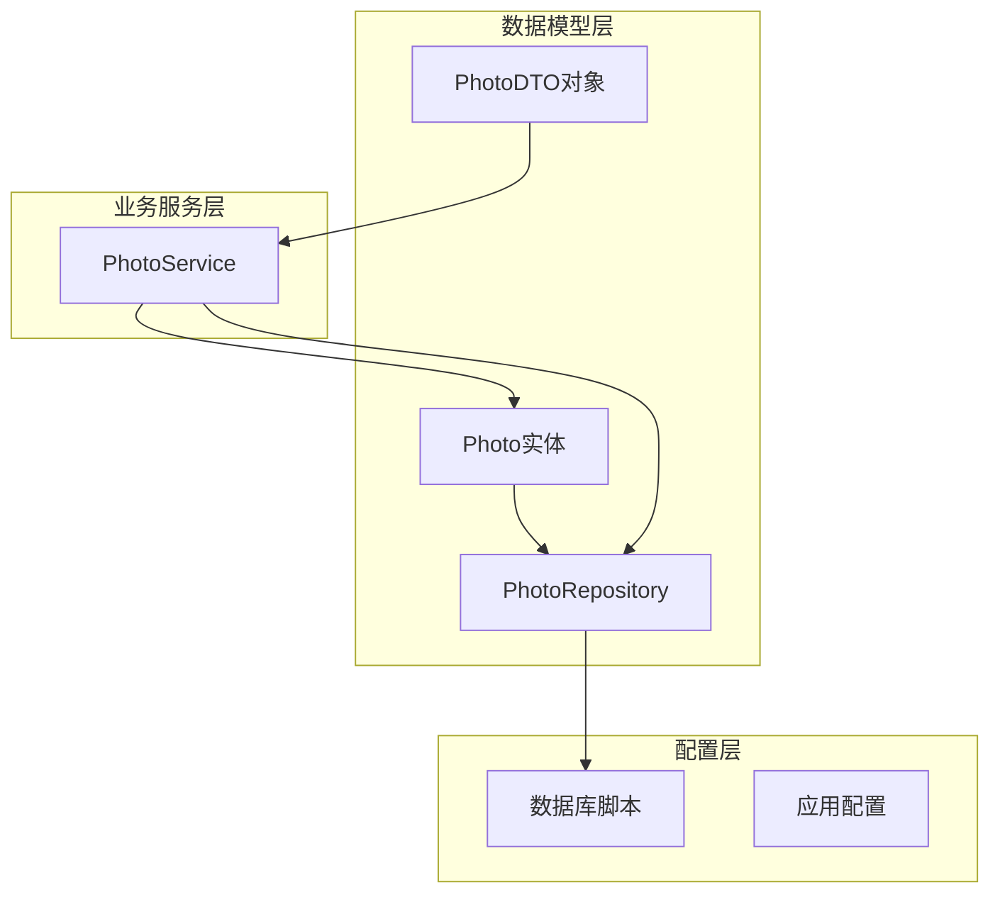
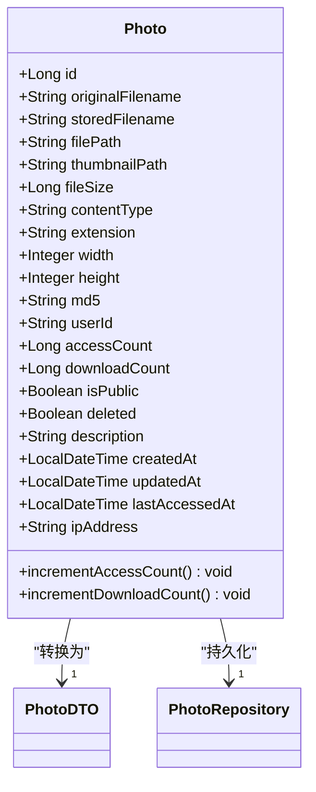
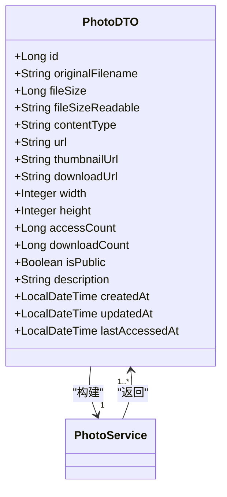
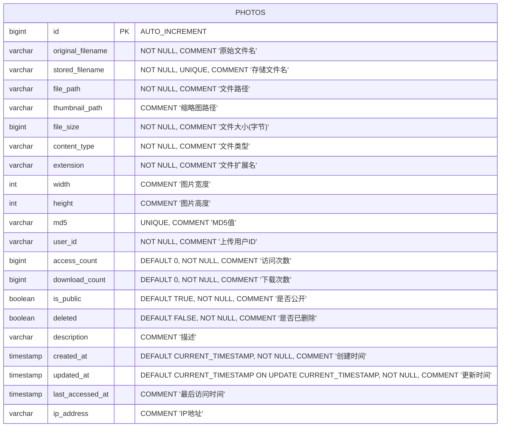
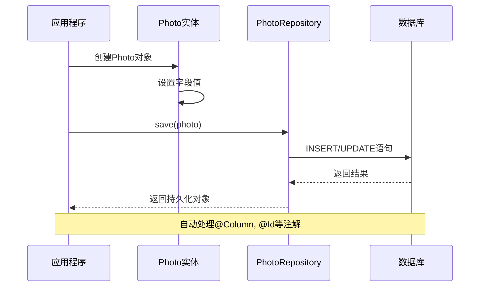
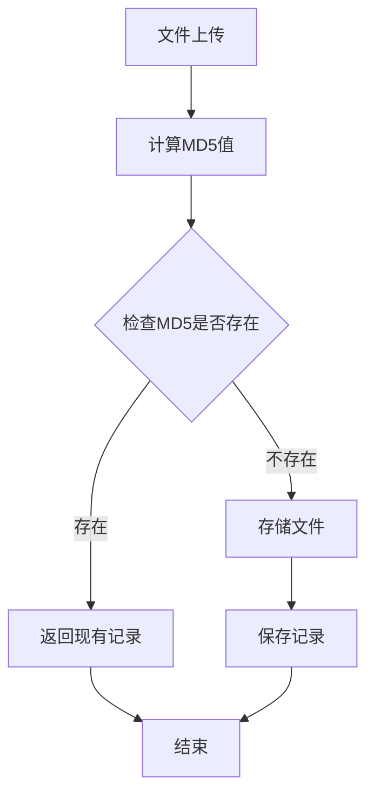
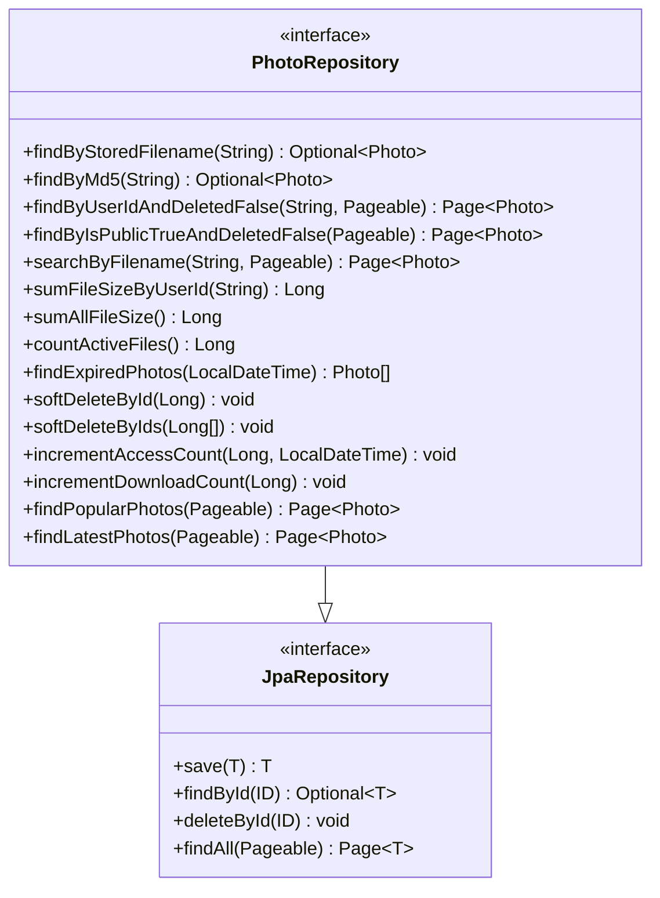
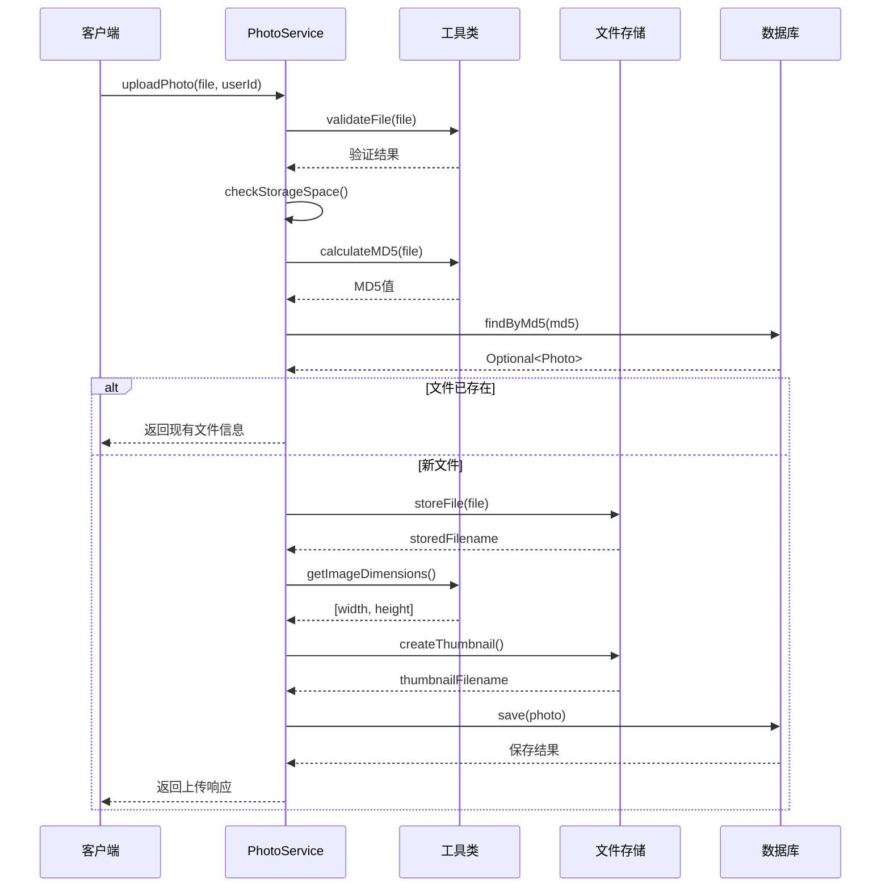
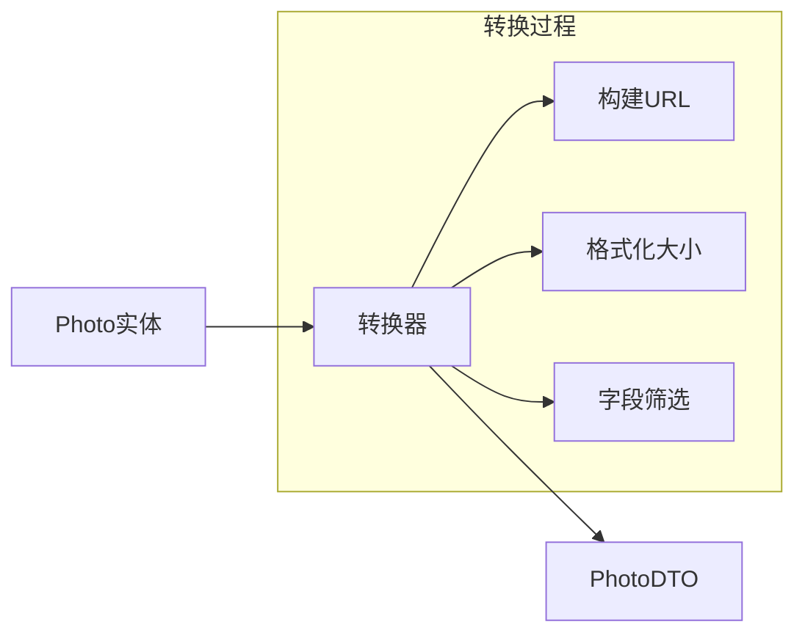

# 数据模型

<cite>
**本文档中引用的文件**
- [Photo.java](file://src/main/java/com/photo/entity/Photo.java)
- [PhotoDTO.java](file://src/main/java/com/photo/dto/PhotoDTO.java)
- [PhotoRepository.java](file://src/main/java/com/photo/repository/PhotoRepository.java)
- [PhotoService.java](file://src/main/java/com/photo/service/PhotoService.java)
- [schema.sql](file://src/main/resources/schema.sql)
</cite>

## 目录
1. [简介](#简介)
2. [项目结构概览](#项目结构概览)
3. [核心实体：Photo](#核心实体photo)
4. [数据传输对象：PhotoDTO](#数据传输对象photodto)
5. [数据库表结构](#数据库表结构)
6. [实体与数据库映射关系](#实体与数据库映射关系)
7. [关键业务字段设计](#关键业务字段设计)
8. [数据访问层分析](#数据访问层分析)
9. [业务逻辑与数据流](#业务逻辑与数据流)
10. [性能优化考虑](#性能优化考虑)
11. [总结](#总结)

## 简介

本文档详细介绍了基于Spring Boot应用程序的照片管理系统的核心数据模型。系统采用JPA ORM框架，通过Photo实体类管理照片的元数据信息，并提供了专门的数据传输对象（DTO）来优化API接口的数据交换。

## 项目结构概览

**图表来源**
- [Photo.java](file://src/main/java/com/photo/entity/Photo.java#L1-L174)
- [PhotoDTO.java](file://src/main/java/com/photo/dto/PhotoDTO.java#L1-L104)
- [PhotoRepository.java](file://src/main/java/com/photo/repository/PhotoRepository.java#L1-L112)

## 核心实体：Photo

Photo实体是整个系统的核心，包含了24个字段，涵盖了照片的所有元数据信息。

### 实体架构

**图表来源**
- [Photo.java](file://src/main/java/com/photo/entity/Photo.java#L27-L173)

### 字段详细说明

| 字段名 | 数据类型 | JPA注解 | 数据库约束 | 含义 |
|--------|----------|---------|------------|------|
| id | Long | @Id, @GeneratedValue | 主键, 自增 | 照片唯一标识符 |
| originalFilename | String | @Column(nullable=false, length=500) | 非空, 长度500 | 用户上传时的原始文件名 |
| storedFilename | String | @Column(nullable=false, unique=true, length=100) | 非空, 唯一, 长度100 | 系统生成的存储文件名(UUID) |
| filePath | String | @Column(nullable=false, length=1000) | 非空, 长度1000 | 文件在服务器上的完整路径 |
| thumbnailPath | String | @Column(length=1000) | 可空, 长度1000 | 缩略图文件路径 |
| fileSize | Long | @Column(nullable=false) | 非空 | 文件大小(字节) |
| contentType | String | @Column(nullable=false, length=100) | 非空, 长度100 | MIME文件类型 |
| extension | String | @Column(nullable=false, length=20) | 非空, 长度20 | 文件扩展名 |
| width | Integer | - | 可空 | 图片宽度(像素) |
| height | Integer | - | 可空 | 图片高度(像素) |
| md5 | String | @Column(length=32, unique=true) | 可空, 唯一, 长度32 | 文件MD5值(用于去重) |
| userId | String | @Column(nullable=false) | 非空 | 上传用户ID |
| accessCount | Long | @Column(nullable=false) | 非空, 默认0 | 访问次数统计 |
| downloadCount | Long | @Column(nullable=false) | 非空, 默认0 | 下载次数统计 |
| isPublic | Boolean | @Column(nullable=false) | 非空, 默认true | 是否公开可见 |
| deleted | Boolean | @Column(nullable=false) | 非空, 默认false | 软删除标志 |
| description | String | @Column(length=1000) | 可空, 长度1000 | 照片描述信息 |
| createdAt | LocalDateTime | @CreationTimestamp | 非空, 自动生成 | 创建时间戳 |
| updatedAt | LocalDateTime | @UpdateTimestamp | 非空, 自动生成 | 更新时间戳 |
| lastAccessedAt | LocalDateTime | - | 可空 | 最后访问时间 |
| ipAddress | String | @Column(length=50) | 可空, 长度50 | 访问IP地址 |

**章节来源**
- [Photo.java](file://src/main/java/com/photo/entity/Photo.java#L28-L157)

## 数据传输对象：PhotoDTO

PhotoDTO作为专门的数据传输对象，负责在服务层和控制器层之间传递照片信息，同时进行必要的数据筛选和格式化。

### DTO架构

**图表来源**
- [PhotoDTO.java](file://src/main/java/com/photo/dto/PhotoDTO.java#L18-L103)

### DTO字段对比

| Photo实体字段 | PhotoDTO字段 | 转换方式 | 设计目的 |
|---------------|--------------|----------|----------|
| storedFilename | url | 构建API URL | 提供标准化访问接口 |
| storedFilename | thumbnailUrl | 构建缩略图URL | 支持缩略图功能 |
| storedFilename | downloadUrl | 构建下载URL | 支持文件下载 |
| filePath | - | 不包含 | 避免暴露服务器路径 |
| thumbnailPath | - | 不包含 | 避免暴露缩略图路径 |
| md5 | - | 不包含 | 内部去重机制 |
| deleted | - | 不包含 | 软删除不影响API响应 |
| ipAddress | - | 不包含 | 隐私保护 |

**章节来源**
- [PhotoDTO.java](file://src/main/java/com/photo/dto/PhotoDTO.java#L18-L103)
- [PhotoService.java](file://src/main/java/com/photo/service/PhotoService.java#L362-L381)

## 数据库表结构

基于schema.sql文件，Photos表的完整结构如下：

### 表结构定义

**图表来源**
- [schema.sql](file://src/main/resources/schema.sql#L5-L32)

### 索引设计

| 索引名称 | 列组合 | 类型 | 用途 |
|----------|--------|------|------|
| PRIMARY | id | 主键索引 | 唯一标识记录 |
| idx_original_filename | original_filename | 普通索引 | 按文件名搜索 |
| idx_created_at | created_at | 普通索引 | 按时间排序查询 |
| idx_user_id | userId | 普通索引 | 按用户查询 |
| idx_md5 | md5 | 唯一索引 | 文件去重查询 |

**章节来源**
- [schema.sql](file://src/main/resources/schema.sql#L28-L31)

## 实体与数据库映射关系

### JPA映射策略

**图表来源**
- [Photo.java](file://src/main/java/com/photo/entity/Photo.java#L17-L22)
- [PhotoRepository.java](file://src/main/java/com/photo/repository/PhotoRepository.java#L20)

### 关键映射特性

1. **主键生成策略**：使用`GenerationType.IDENTITY`自增主键
2. **时间戳管理**：自动设置`createdAt`和`updatedAt`
3. **默认值处理**：通过`@Builder.Default`设置默认值
4. **索引优化**：通过`@Index`注解优化查询性能

**章节来源**
- [Photo.java](file://src/main/java/com/photo/entity/Photo.java#L32-L146)

## 关键业务字段设计

### 文件管理字段

#### 原始文件名 vs 存储文件名
- **originalFilename**：保留用户上传时的文件名，便于识别和搜索
- **storedFilename**：系统生成的UUID文件名，确保文件唯一性和安全性

#### MD5去重机制

**图表来源**
- [PhotoService.java](file://src/main/java/com/photo/service/PhotoService.java#L60-L67)

### 访问统计设计

#### 访问计数器
- **accessCount**：全局访问计数，支持热点内容识别
- **downloadCount**：下载专用计数，区分不同类型的用户行为
- **lastAccessedAt**：精确记录最后一次访问时间

#### 软删除机制
- **deleted**字段：逻辑删除，保留数据完整性
- **查询过滤**：所有查询自动过滤已删除记录
- **恢复可能性**：支持逻辑恢复操作

### 公开性控制

#### isPublic字段
- **默认公开**：新上传的文件默认对所有人可见
- **隐私保护**：用户可选择私有化文件
- **权限验证**：API层面进行访问权限检查

**章节来源**
- [Photo.java](file://src/main/java/com/photo/entity/Photo.java#L103-L126)

## 数据访问层分析

### Repository接口设计

**图表来源**
- [PhotoRepository.java](file://src/main/java/com/photo/repository/PhotoRepository.java#L20-L111)

### 查询优化策略

#### 分页查询
- **分页参数**：支持灵活的分页查询
- **排序规则**：按创建时间倒序排列
- **条件过滤**：自动过滤软删除记录

#### 性能优化
- **索引利用**：充分利用数据库索引
- **懒加载**：避免不必要的关联查询
- **缓存策略**：结合Spring Cache进行性能优化

**章节来源**
- [PhotoRepository.java](file://src/main/java/com/photo/repository/PhotoRepository.java#L25-L111)

## 业务逻辑与数据流

### 文件上传流程

**图表来源**
- [PhotoService.java](file://src/main/java/com/photo/service/PhotoService.java#L51-L106)

### 数据转换流程

#### 实体到DTO转换

**图表来源**
- [PhotoService.java](file://src/main/java/com/photo/service/PhotoService.java#L362-L381)

**章节来源**
- [PhotoService.java](file://src/main/java/com/photo/service/PhotoService.java#L51-L106)

## 性能优化考虑

### 数据库优化

#### 索引策略
- **复合索引**：在频繁查询的字段上建立索引
- **覆盖索引**：减少回表查询次数
- **分区策略**：对于大规模数据可考虑分区

#### 查询优化
- **分页查询**：避免全表扫描
- **条件过滤**：自动过滤软删除记录
- **连接优化**：避免不必要的JOIN操作

### 缓存策略

#### Spring Cache集成
- **方法级缓存**：对频繁查询的方法启用缓存
- **缓存失效**：及时清除更新数据的缓存
- **缓存穿透防护**：防止恶意请求导致缓存雪崩

### 内存优化

#### 对象池化
- **实体对象**：合理控制实体对象的数量
- **DTO转换**：避免重复的对象转换
- **临时对象**：及时释放不需要的临时对象

## 总结

本文档全面分析了基于Spring Boot的照片管理系统数据模型，重点阐述了：

1. **Photo实体设计**：包含24个字段，涵盖照片的完整元数据信息
2. **JPA映射策略**：通过注解实现优雅的ORM映射
3. **DTO设计模式**：优化API接口的数据传输
4. **数据库表结构**：基于schema.sql的完整表定义
5. **业务字段设计**：文件去重、访问统计、软删除等关键功能
6. **性能优化**：索引、缓存、查询优化等多维度优化策略

该数据模型设计充分考虑了系统的可扩展性、性能和维护性，为构建稳定可靠的照片管理平台奠定了坚实的基础。