# 数据模型

<cite>
**本文档中引用的文件**
- [Photo.java](file://src/main/java/com/photo/entity/Photo.java)
- [User.java](file://src/main/java/com/photo/entity/User.java)
- [Note.java](file://src/main/java/com/photo/entity/Note.java)
- [Blog.java](file://src/main/java/com/photo/entity/Blog.java)
- [PhotoDTO.java](file://src/main/java/com/photo/dto/PhotoDTO.java)
- [BlogDTO.java](file://src/main/java/com/photo/dto/BlogDTO.java)
- [NoteDTO.java](file://src/main/java/com/photo/dto/NoteDTO.java)
- [PhotoRepository.java](file://src/main/java/com/photo/repository/PhotoRepository.java)
- [UserRepository.java](file://src/main/java/com/photo/repository/UserRepository.java)
- [NoteRepository.java](file://src/main/java/com/photo/repository/NoteRepository.java)
- [BlogRepository.java](file://src/main/java/com/photo/repository/BlogRepository.java)
- [PhotoService.java](file://src/main/java/com/photo/service/PhotoService.java)
- [BlogService.java](file://src/main/java/com/photo/service/BlogService.java)
- [NoteService.java](file://src/main/java/com/photo/service/NoteService.java)
- [AuthController.java](file://src/main/java/com/photo/controller/AuthController.java)
- [NoteController.java](file://src/main/java/com/photo/controller/NoteController.java)
- [BlogController.java](file://src/main/java/com/photo/controller/BlogController.java)
- [schema.sql](file://src/main/resources/schema.sql)
</cite>

## 目录
1. [简介](#简介)
2. [项目结构概览](#项目结构概览)
3. [核心实体：Photo](#核心实体photo)
4. [用户实体：User](#用户实体user)
5. [便签实体：Note](#便签实体note)
6. [博客实体：Blog](#博客实体blog)
7. [数据传输对象：PhotoDTO、BlogDTO、NoteDTO](#数据传输对象photodto-blogdto-notedto)
8. [数据库表结构](#数据库表结构)
9. [实体与数据库映射关系](#实体与数据库映射关系)
10. [关键业务字段设计](#关键业务字段设计)
11. [数据访问层分析](#数据访问层分析)
12. [业务逻辑与数据流](#业务逻辑与数据流)
13. [性能优化考虑](#性能优化考虑)
14. [总结](#总结)

## 简介

本文档详细介绍了基于Spring Boot应用程序的照片管理、用户认证、便签管理和博客管理系统的综合数据模型。系统采用JPA ORM框架，通过多个实体类管理不同类型的内容信息，并提供了专门的数据传输对象（DTO）来优化API接口的数据交换。

## 项目结构概览

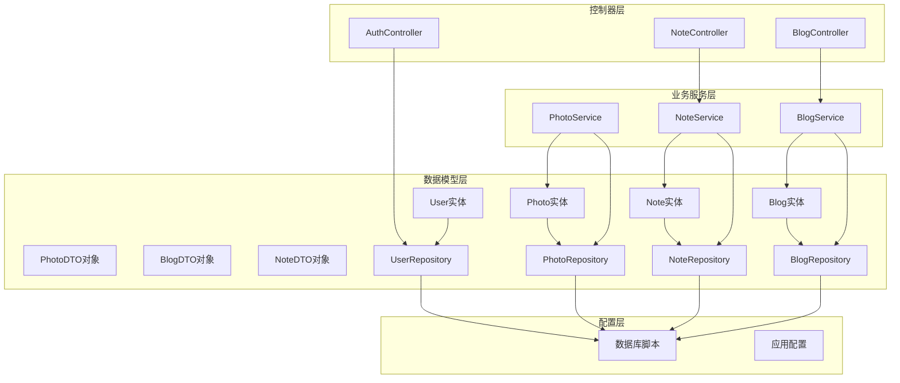
```mermaid
graph TB
subgraph "数据模型层"
Photo[Photo实体]
User[User实体]
Note[Note实体]
Blog[Blog实体]
PhotoDTO[PhotoDTO对象]
BlogDTO[BlogDTO对象]
NoteDTO[NoteDTO对象]
PhotoRepo[PhotoRepository]
UserRepo[UserRepository]
NoteRepo[NoteRepository]
BlogRepo[BlogRepository]
end
subgraph "业务服务层"
PhotoService[PhotoService]
BlogService[BlogService]
NoteService[NoteService]
end
subgraph "控制器层"
AuthController[AuthController]
NoteController[NoteController]
BlogController[BlogController]
end
subgraph "配置层"
Schema[数据库脚本]
Config[应用配置]
end
Photo --> PhotoRepo
User --> UserRepo
Note --> NoteRepo
Blog --> BlogRepo
PhotoService --> Photo
BlogService --> Blog
NoteService --> Note
PhotoService --> PhotoRepo
BlogService --> BlogRepo
NoteService --> NoteRepo
AuthController --> UserRepo
NoteController --> NoteService
BlogController --> BlogService
PhotoRepo --> Schema
UserRepo --> Schema
NoteRepo --> Schema
BlogRepo --> Schema
```

**图表来源**
- [Photo.java](file://src/main/java/com/photo/entity/Photo.java#L1-L174)
- [User.java](file://src/main/java/com/photo/entity/User.java#L1-L100)
- [Note.java](file://src/main/java/com/photo/entity/Note.java#L1-L58)
- [Blog.java](file://src/main/java/com/photo/entity/Blog.java#L1-L77)
- [PhotoDTO.java](file://src/main/java/com/photo/dto/PhotoDTO.java#L1-L104)
- [BlogDTO.java](file://src/main/java/com/photo/dto/BlogDTO.java#L1-L68)
- [NoteDTO.java](file://src/main/java/com/photo/dto/NoteDTO.java#L1-L53)

## 核心实体：Photo

Photo实体是整个系统的核心，包含了24个字段，涵盖了照片的所有元数据信息。

### 实体架构

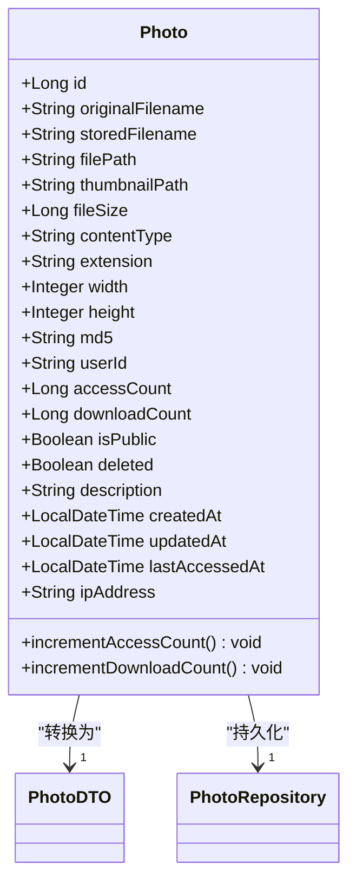
```mermaid
classDiagram
class Photo {
+Long id
+String originalFilename
+String storedFilename
+String filePath
+String thumbnailPath
+Long fileSize
+String contentType
+String extension
+Integer width
+Integer height
+String md5
+String userId
+Long accessCount
+Long downloadCount
+Boolean isPublic
+Boolean deleted
+String description
+LocalDateTime createdAt
+LocalDateTime updatedAt
+LocalDateTime lastAccessedAt
+String ipAddress
+incrementAccessCount() void
+incrementDownloadCount() void
}
Photo --> "1" PhotoDTO : "转换为"
Photo --> "1" PhotoRepository : "持久化"
```

**图表来源**
- [Photo.java](file://src/main/java/com/photo/entity/Photo.java#L27-L173)

### 字段详细说明

| 字段名 | 数据类型 | JPA注解 | 数据库约束 | 含义 |
|--------|----------|---------|------------|------|
| id | Long | @Id, @GeneratedValue | 主键, 自增 | 照片唯一标识符 |
| originalFilename | String | @Column(nullable=false, length=500) | 非空, 长度500 | 用户上传时的原始文件名 |
| storedFilename | String | @Column(nullable=false, unique=true, length=100) | 非空, 唯一, 长度100 | 系统生成的存储文件名(UUID) |
| filePath | String | @Column(nullable=false, length=1000) | 非空, 长度1000 | 文件在服务器上的完整路径 |
| thumbnailPath | String | @Column(length=1000) | 可空, 长度1000 | 缩略图文件路径 |
| fileSize | Long | @Column(nullable=false) | 非空 | 文件大小(字节) |
| contentType | String | @Column(nullable=false, length=100) | 非空, 长度100 | MIME文件类型 |
| extension | String | @Column(nullable=false, length=20) | 非空, 长度20 | 文件扩展名 |
| width | Integer | - | 可空 | 图片宽度(像素) |
| height | Integer | - | 可空 | 图片高度(像素) |
| md5 | String | @Column(length=32, unique=true) | 可空, 唯一, 长度32 | 文件MD5值(用于去重) |
| userId | String | @Column(nullable=false) | 非空 | 上传用户ID |
| accessCount | Long | @Column(nullable=false) | 非空, 默认0 | 访问次数统计 |
| downloadCount | Long | @Column(nullable=false) | 非空, 默认0 | 下载次数统计 |
| isPublic | Boolean | @Column(nullable=false) | 非空, 默认true | 是否公开可见 |
| deleted | Boolean | @Column(nullable=false) | 非空, 默认false | 软删除标志 |
| description | String | @Column(length=1000) | 可空, 长度1000 | 照片描述信息 |
| createdAt | LocalDateTime | @CreationTimestamp | 非空, 自动生成 | 创建时间戳 |
| updatedAt | LocalDateTime | @UpdateTimestamp | 非空, 自动生成 | 更新时间戳 |
| lastAccessedAt | LocalDateTime | - | 可空 | 最后访问时间 |
| ipAddress | String | @Column(length=50) | 可空, 长度50 | 访问IP地址 |

**章节来源**
- [Photo.java](file://src/main/java/com/photo/entity/Photo.java#L28-L157)

## 用户实体：User

User实体用于管理系统的用户账户信息，支持用户认证和授权功能。

### 实体架构

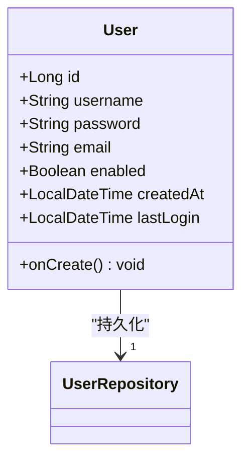
```mermaid
classDiagram
class User {
+Long id
+String username
+String password
+String email
+Boolean enabled
+LocalDateTime createdAt
+LocalDateTime lastLogin
+onCreate() void
}
User --> "1" UserRepository : "持久化"
```

**图表来源**
- [User.java](file://src/main/java/com/photo/entity/User.java#L11-L99)

### 字段详细说明

| 字段名 | 数据类型 | JPA注解 | 数据库约束 | 含义 |
|--------|----------|---------|------------|------|
| id | Long | @Id, @GeneratedValue | 主键, 自增 | 用户唯一标识符 |
| username | String | @Column(unique=true, nullable=false, length=50) | 唯一, 非空, 长度50 | 用户名 |
| password | String | @Column(nullable=false) | 非空 | 用户密码（加密存储） |
| email | String | @Column(length=100) | 可空, 长度100 | 用户邮箱地址 |
| enabled | Boolean | @Column(name="enabled") | 可空, 默认true | 用户账户启用状态 |
| createdAt | LocalDateTime | @Column(name="created_at") | 可空 | 账户创建时间 |
| lastLogin | LocalDateTime | @Column(name="last_login") | 可空 | 最后登录时间 |

**章节来源**
- [User.java](file://src/main/java/com/photo/entity/User.java#L17-L39)

## 便签实体：Note

Note实体用于存储便签的基本信息，支持Markdown格式的内容编辑和管理。

### 实体架构

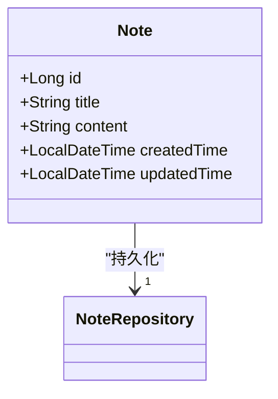
```mermaid
classDiagram
class Note {
+Long id
+String title
+String content
+LocalDateTime createdTime
+LocalDateTime updatedTime
}
Note --> "1" NoteRepository : "持久化"
```

**图表来源**
- [Note.java](file://src/main/java/com/photo/entity/Note.java#L23-L57)

### 字段详细说明

| 字段名 | 数据类型 | JPA注解 | 数据库约束 | 含义 |
|--------|----------|---------|------------|------|
| id | Long | @Id, @GeneratedValue | 主键, 自增 | 便签唯一标识符 |
| title | String | @Column(nullable=false, length=200) | 非空, 长度200 | 便签标题 |
| content | String | @Column(columnDefinition="TEXT") | 可空, TEXT类型 | 便签内容（支持Markdown） |
| createdTime | LocalDateTime | @CreationTimestamp, @Column(name="created_time", nullable=false, updatable=false) | 非空, 自动生成 | 便签创建时间 |
| updatedTime | LocalDateTime | @UpdateTimestamp, @Column(name="updated_time", nullable=false) | 非空, 自动生成 | 便签最后修改时间 |

**章节来源**
- [Note.java](file://src/main/java/com/photo/entity/Note.java#L35-L56)

## 博客实体：Blog

Blog实体用于存储博客文章的基本信息，支持分类、标签和Markdown格式的内容管理。

### 实体架构

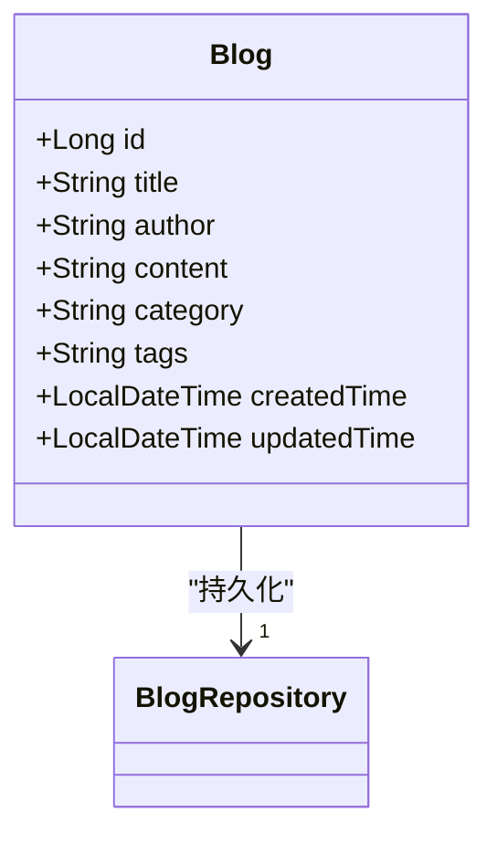
```mermaid
classDiagram
class Blog {
+Long id
+String title
+String author
+String content
+String category
+String tags
+LocalDateTime createdTime
+LocalDateTime updatedTime
}
Blog --> "1" BlogRepository : "持久化"
```

**图表来源**
- [Blog.java](file://src/main/java/com/photo/entity/Blog.java#L24-L76)

### 字段详细说明

| 字段名 | 数据类型 | JPA注解 | 数据库约束 | 含义 |
|--------|----------|---------|------------|------|
| id | Long | @Id, @GeneratedValue | 主键, 自增 | 博客唯一标识符 |
| title | String | @Column(nullable=false, length=300) | 非空, 长度300 | 博客标题 |
| author | String | @Column(nullable=false, length=100) | 非空, 长度100 | 博客作者 |
| content | String | @Column(columnDefinition="TEXT") | 可空, TEXT类型 | 博客内容（支持Markdown） |
| category | String | @Column(length=50) | 可空, 长度50 | 博客分类 |
| tags | String | @Column(length=200) | 可空, 长度200 | 博客标签（多个标签用逗号分隔） |
| createdTime | LocalDateTime | @CreationTimestamp, @Column(name="created_time", nullable=false, updatable=false) | 非空, 自动生成 | 博客创建时间 |
| updatedTime | LocalDateTime | @UpdateTimestamp, @Column(name="updated_time", nullable=false) | 非空, 自动生成 | 博客最后修改时间 |

**章节来源**
- [Blog.java](file://src/main/java/com/photo/entity/Blog.java#L36-L75)

## 数据传输对象：PhotoDTO、BlogDTO、NoteDTO

### DTO架构总览

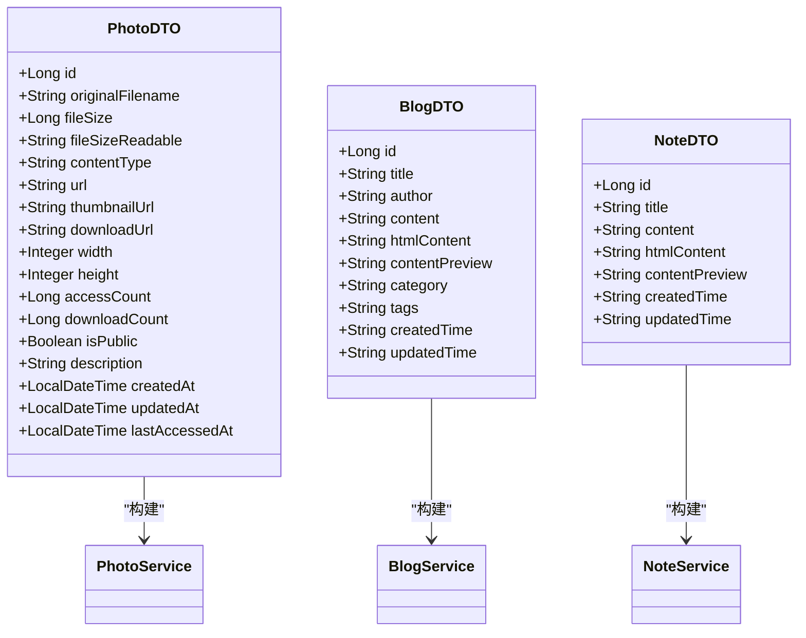
```mermaid
classDiagram
class PhotoDTO {
+Long id
+String originalFilename
+Long fileSize
+String fileSizeReadable
+String contentType
+String url
+String thumbnailUrl
+String downloadUrl
+Integer width
+Integer height
+Long accessCount
+Long downloadCount
+Boolean isPublic
+String description
+LocalDateTime createdAt
+LocalDateTime updatedAt
+LocalDateTime lastAccessedAt
}
class BlogDTO {
+Long id
+String title
+String author
+String content
+String htmlContent
+String contentPreview
+String category
+String tags
+String createdTime
+String updatedTime
}
class NoteDTO {
+Long id
+String title
+String content
+String htmlContent
+String contentPreview
+String createdTime
+String updatedTime
}
PhotoDTO --> PhotoService : "构建"
BlogDTO --> BlogService : "构建"
NoteDTO --> NoteService : "构建"
```

**图表来源**
- [PhotoDTO.java](file://src/main/java/com/photo/dto/PhotoDTO.java#L18-L103)
- [BlogDTO.java](file://src/main/java/com/photo/dto/BlogDTO.java#L16-L67)
- [NoteDTO.java](file://src/main/java/com/photo/dto/NoteDTO.java#L16-L52)

### PhotoDTO字段对比

| Photo实体字段 | PhotoDTO字段 | 转换方式 | 设计目的 |
|---------------|--------------|----------|----------|
| storedFilename | url | 构建API URL | 提供标准化访问接口 |
| storedFilename | thumbnailUrl | 构建缩略图URL | 支持缩略图功能 |
| storedFilename | downloadUrl | 构建下载URL | 支持文件下载 |
| filePath | - | 不包含 | 避免暴露服务器路径 |
| thumbnailPath | - | 不包含 | 避免暴露缩略图路径 |
| md5 | - | 不包含 | 内部去重机制 |
| deleted | - | 不包含 | 软删除不影响API响应 |
| ipAddress | - | 不包含 | 隐私保护 |

### BlogDTO字段说明

| 字段名 | 数据类型 | 含义 |
|--------|----------|------|
| id | Long | 博客ID |
| title | String | 博客标题 |
| author | String | 博客作者 |
| content | String | 博客原始内容（Markdown格式） |
| htmlContent | String | 博客HTML渲染内容 |
| contentPreview | String | 博客内容摘要（用于列表页显示） |
| category | String | 博客分类 |
| tags | String | 博客标签（多个标签用逗号分隔） |
| createdTime | String | 格式化创建时间 |
| updatedTime | String | 格式化修改时间 |

### NoteDTO字段说明

| 字段名 | 数据类型 | 含义 |
|--------|----------|------|
| id | Long | 便签ID |
| title | String | 便签标题 |
| content | String | Markdown原始内容 |
| htmlContent | String | 渲染后的HTML内容 |
| contentPreview | String | 内容摘要（前100字符） |
| createdTime | String | 格式化的创建时间 |
| updatedTime | String | 格式化的修改时间 |

**章节来源**
- [PhotoDTO.java](file://src/main/java/com/photo/dto/PhotoDTO.java#L18-L103)
- [BlogDTO.java](file://src/main/java/com/photo/dto/BlogDTO.java#L16-L67)
- [NoteDTO.java](file://src/main/java/com/photo/dto/NoteDTO.java#L16-L52)

## 数据库表结构

基于schema.sql文件，系统包含四个主要表的完整结构：

### 用户表（users）

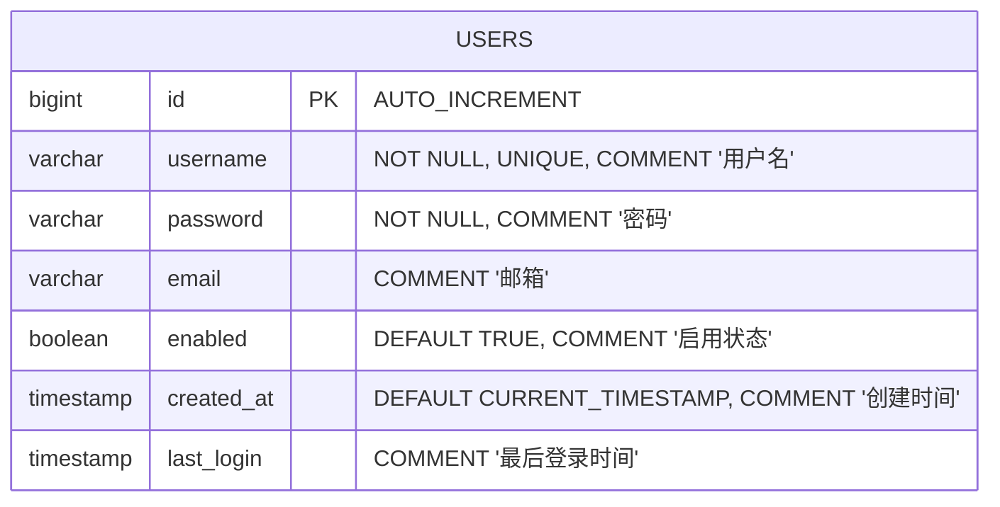
```mermaid
erDiagram
USERS {
bigint id PK "AUTO_INCREMENT"
varchar username "NOT NULL, UNIQUE, COMMENT '用户名'"
varchar password "NOT NULL, COMMENT '密码'"
varchar email "COMMENT '邮箱'"
boolean enabled "DEFAULT TRUE, COMMENT '启用状态'"
timestamp created_at "DEFAULT CURRENT_TIMESTAMP, COMMENT '创建时间'"
timestamp last_login "COMMENT '最后登录时间'"
}
```

**图表来源**
- [schema.sql](file://src/main/resources/schema.sql#L5-L13)

### 便签表（notes）

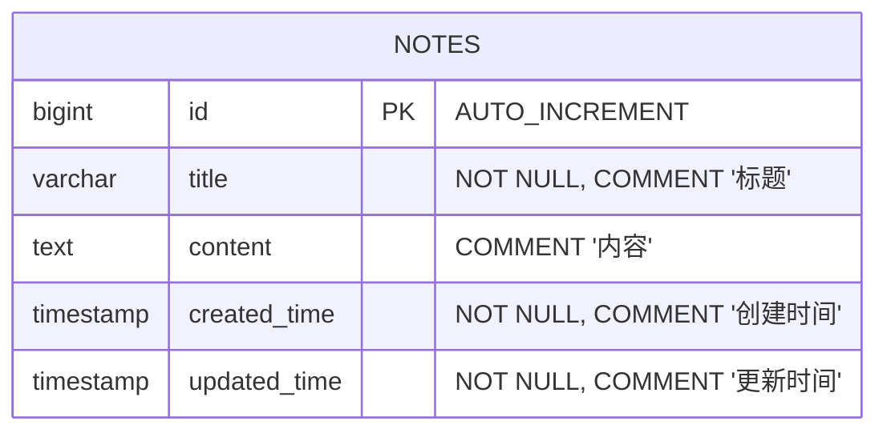
```mermaid
erDiagram
NOTES {
bigint id PK "AUTO_INCREMENT"
varchar title "NOT NULL, COMMENT '标题'"
text content "COMMENT '内容'"
timestamp created_time "NOT NULL, COMMENT '创建时间'"
timestamp updated_time "NOT NULL, COMMENT '更新时间'"
}
```

**图表来源**
- [schema.sql](file://src/main/resources/schema.sql#L22-L28)

### 博客表（blogs）

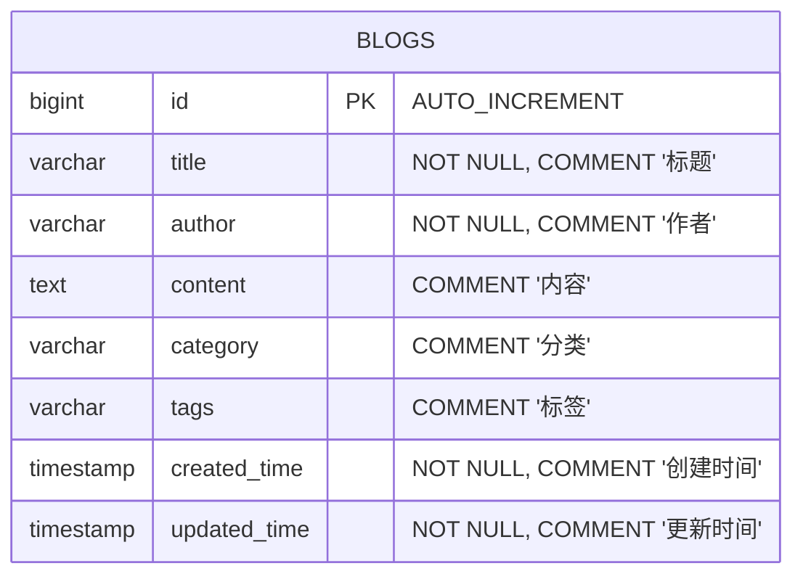
```mermaid
erDiagram
BLOGS {
bigint id PK "AUTO_INCREMENT"
varchar title "NOT NULL, COMMENT '标题'"
varchar author "NOT NULL, COMMENT '作者'"
text content "COMMENT '内容'"
varchar category "COMMENT '分类'"
varchar tags "COMMENT '标签'"
timestamp created_time "NOT NULL, COMMENT '创建时间'"
timestamp updated_time "NOT NULL, COMMENT '更新时间'"
}
```

**图表来源**
- [schema.sql](file://src/main/resources/schema.sql#L77-L86)

### 照片表（photos）

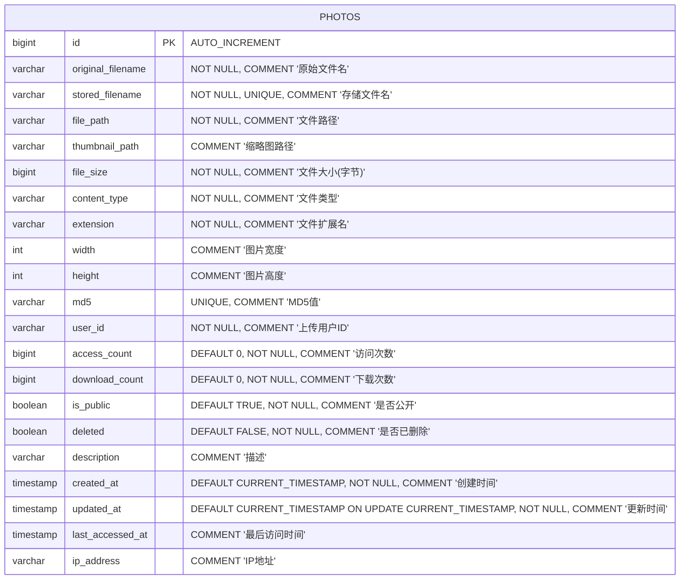
```mermaid
erDiagram
PHOTOS {
bigint id PK "AUTO_INCREMENT"
varchar original_filename "NOT NULL, COMMENT '原始文件名'"
varchar stored_filename "NOT NULL, UNIQUE, COMMENT '存储文件名'"
varchar file_path "NOT NULL, COMMENT '文件路径'"
varchar thumbnail_path "COMMENT '缩略图路径'"
bigint file_size "NOT NULL, COMMENT '文件大小(字节)'"
varchar content_type "NOT NULL, COMMENT '文件类型'"
varchar extension "NOT NULL, COMMENT '文件扩展名'"
int width "COMMENT '图片宽度'"
int height "COMMENT '图片高度'"
varchar md5 "UNIQUE, COMMENT 'MD5值'"
varchar user_id "NOT NULL, COMMENT '上传用户ID'"
bigint access_count "DEFAULT 0, NOT NULL, COMMENT '访问次数'"
bigint download_count "DEFAULT 0, NOT NULL, COMMENT '下载次数'"
boolean is_public "DEFAULT TRUE, NOT NULL, COMMENT '是否公开'"
boolean deleted "DEFAULT FALSE, NOT NULL, COMMENT '是否已删除'"
varchar description "COMMENT '描述'"
timestamp created_at "DEFAULT CURRENT_TIMESTAMP, NOT NULL, COMMENT '创建时间'"
timestamp updated_at "DEFAULT CURRENT_TIMESTAMP ON UPDATE CURRENT_TIMESTAMP, NOT NULL, COMMENT '更新时间'"
timestamp last_accessed_at "COMMENT '最后访问时间'"
varchar ip_address "COMMENT 'IP地址'"
}
```

**图表来源**
- [schema.sql](file://src/main/resources/schema.sql#L5-L32)

### 索引设计

#### 用户表索引
| 索引名称 | 列组合 | 类型 | 用途 |
|----------|--------|------|------|
| PRIMARY | id | 主键索引 | 唯一标识用户 |
| idx_username | username | 唯一索引 | 用户名快速查找 |

#### 便签表索引
| 索引名称 | 列组合 | 类型 | 用途 |
|----------|--------|------|------|
| PRIMARY | id | 主键索引 | 唯一标识便签 |
| idx_created_time | created_time | 普通索引 | 按时间排序查询 |

#### 博客表索引
| 索引名称 | 列组合 | 类型 | 用途 |
|----------|--------|------|------|
| PRIMARY | id | 主键索引 | 唯一标识博客 |
| idx_blog_created_time | created_time | 普通索引 | 按时间排序查询 |
| idx_blog_author | author | 普通索引 | 按作者查询 |

#### 照片表索引
| 索引名称 | 列组合 | 类型 | 用途 |
|----------|--------|------|------|
| PRIMARY | id | 主键索引 | 唯一标识照片 |
| idx_original_filename | original_filename | 普通索引 | 按文件名搜索 |
| idx_created_at | created_at | 普通索引 | 按时间排序查询 |
| idx_user_id | userId | 普通索引 | 按用户查询 |
| idx_md5 | md5 | 唯一索引 | 文件去重查询 |

**章节来源**
- [schema.sql](file://src/main/resources/schema.sql#L15-L16)
- [schema.sql](file://src/main/resources/schema.sql#L30-L31)
- [schema.sql](file://src/main/resources/schema.sql#L88-L90)
- [schema.sql](file://src/main/resources/schema.sql#L28-L31)

## 实体与数据库映射关系

### JPA映射策略

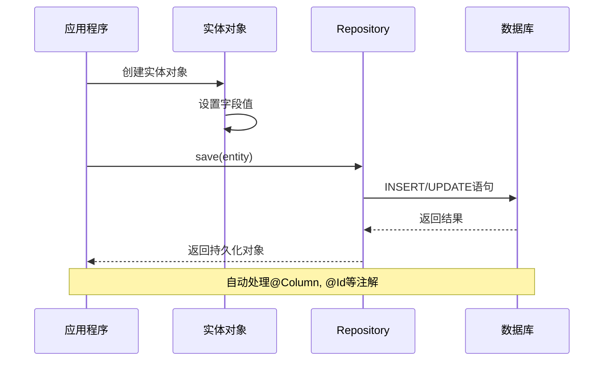
```mermaid
sequenceDiagram
participant App as 应用程序
participant Entity as 实体对象
participant Repo as Repository
participant DB as 数据库
App->>Entity : 创建实体对象
Entity->>Entity : 设置字段值
App->>Repo : save(entity)
Repo->>DB : INSERT/UPDATE语句
DB-->>Repo : 返回结果
Repo-->>App : 返回持久化对象
Note over App,DB : 自动处理@Column, @Id等注解
```

**图表来源**
- [User.java](file://src/main/java/com/photo/entity/User.java#L13-L15)
- [Note.java](file://src/main/java/com/photo/entity/Note.java#L29-L30)
- [Blog.java](file://src/main/java/com/photo/entity/Blog.java#L30-L31)
- [Photo.java](file://src/main/java/com/photo/entity/Photo.java#L17-L22)

### 关键映射特性

1. **主键生成策略**：所有实体均使用`GenerationType.IDENTITY`自增主键
2. **时间戳管理**：使用`@CreationTimestamp`和`@UpdateTimestamp`自动管理时间戳
3. **默认值处理**：通过`@PrePersist`和注解默认值设置默认值
4. **索引优化**：通过`@Index`注解优化查询性能
5. **字段映射**：使用`@Column(name="...")`处理数据库列名映射

**章节来源**
- [User.java](file://src/main/java/com/photo/entity/User.java#L35-L41)
- [Note.java](file://src/main/java/com/photo/entity/Note.java#L47-L56)
- [Blog.java](file://src/main/java/com/photo/entity/Blog.java#L66-L75)
- [Photo.java](file://src/main/java/com/photo/entity/Photo.java#L32-L146)

## 关键业务字段设计

### 文件管理字段

#### 原始文件名 vs 存储文件名
- **originalFilename**：保留用户上传时的文件名，便于识别和搜索
- **storedFilename**：系统生成的UUID文件名，确保文件唯一性和安全性

#### MD5去重机制
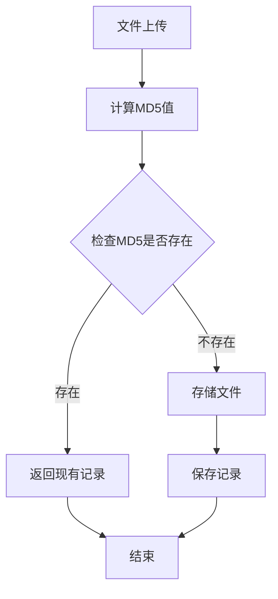
```mermaid
flowchart TD
Upload[文件上传] --> CalcMD5[计算MD5值]
CalcMD5 --> CheckExists{检查MD5是否存在}
CheckExists --> |存在| ReturnExisting[返回现有记录]
CheckExists --> |不存在| StoreFile[存储文件]
StoreFile --> SaveRecord[保存记录]
ReturnExisting --> End[结束]
SaveRecord --> End
```

**图表来源**
- [PhotoService.java](file://src/main/java/com/photo/service/PhotoService.java#L60-L67)

### 访问统计设计

#### 访问计数器
- **accessCount**：全局访问计数，支持热点内容识别
- **downloadCount**：下载专用计数，区分不同类型的用户行为
- **lastAccessedAt**：精确记录最后一次访问时间

#### 软删除机制
- **deleted**字段：逻辑删除，保留数据完整性
- **查询过滤**：所有查询自动过滤已删除记录
- **恢复可能性**：支持逻辑恢复操作

### 公开性控制

#### isPublic字段
- **默认公开**：新上传的文件默认对所有人可见
- **隐私保护**：用户可选择私有化文件
- **权限验证**：API层面进行访问权限检查

### 用户认证设计

#### 密码安全
- **密码加密**：使用BCrypt等加密算法存储密码
- **账户状态**：通过`enabled`字段控制账户启用状态
- **登录追踪**：记录`lastLogin`时间用于安全监控

### 内容管理设计

#### Markdown支持
- **内容存储**：原始Markdown内容存储在数据库中
- **实时渲染**：服务层提供Markdown到HTML的实时渲染
- **内容摘要**：自动生成内容摘要用于列表展示

**章节来源**
- [Photo.java](file://src/main/java/com/photo/entity/Photo.java#L103-L126)
- [User.java](file://src/main/java/com/photo/entity/User.java#L26-L33)
- [BlogService.java](file://src/main/java/com/photo/service/BlogService.java#L158-L170)
- [NoteService.java](file://src/main/java/com/photo/service/NoteService.java#L120-L132)

## 数据访问层分析

### Repository接口设计

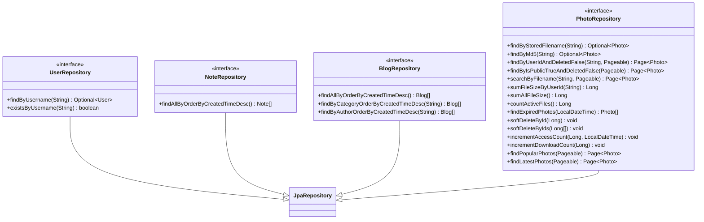
```mermaid
classDiagram
class UserRepository {
<<interface>>
+findByUsername(String) Optional~User~
+existsByUsername(String) boolean
}
class NoteRepository {
<<interface>>
+findAllByOrderByCreatedTimeDesc() Note[]
}
class BlogRepository {
<<interface>>
+findAllByOrderByCreatedTimeDesc() Blog[]
+findByCategoryOrderByCreatedTimeDesc(String) Blog[]
+findByAuthorOrderByCreatedTimeDesc(String) Blog[]
}
class PhotoRepository {
<<interface>>
+findByStoredFilename(String) Optional~Photo~
+findByMd5(String) Optional~Photo~
+findByUserIdAndDeletedFalse(String, Pageable) Page~Photo~
+findByIsPublicTrueAndDeletedFalse(Pageable) Page~Photo~
+searchByFilename(String, Pageable) Page~Photo~
+sumFileSizeByUserId(String) Long
+sumAllFileSize() Long
+countActiveFiles() Long
+findExpiredPhotos(LocalDateTime) Photo[]
+softDeleteById(Long) void
+softDeleteByIds(Long[]) void
+incrementAccessCount(Long, LocalDateTime) void
+incrementDownloadCount(Long) void
+findPopularPhotos(Pageable) Page~Photo~
+findLatestPhotos(Pageable) Page~Photo~
}
UserRepository --|> JpaRepository
NoteRepository --|> JpaRepository
BlogRepository --|> JpaRepository
PhotoRepository --|> JpaRepository
```

**图表来源**
- [UserRepository.java](file://src/main/java/com/photo/repository/UserRepository.java#L13-L24)
- [NoteRepository.java](file://src/main/java/com/photo/repository/NoteRepository.java#L14-L21)
- [BlogRepository.java](file://src/main/java/com/photo/repository/BlogRepository.java#L14-L35)
- [PhotoRepository.java](file://src/main/java/com/photo/repository/PhotoRepository.java#L20-L111)

### 查询优化策略

#### 分页查询
- **分页参数**：支持灵活的分页查询
- **排序规则**：按创建时间倒序排列
- **条件过滤**：自动过滤软删除记录

#### 性能优化
- **索引利用**：充分利用数据库索引
- **懒加载**：避免不必要的关联查询
- **缓存策略**：结合Spring Cache进行性能优化

**章节来源**
- [UserRepository.java](file://src/main/java/com/photo/repository/UserRepository.java#L15-L23)
- [NoteRepository.java](file://src/main/java/com/photo/repository/NoteRepository.java#L16-L20)
- [BlogRepository.java](file://src/main/java/com/photo/repository/BlogRepository.java#L16-L34)
- [PhotoRepository.java](file://src/main/java/com/photo/repository/PhotoRepository.java#L25-L111)

## 业务逻辑与数据流

### 文件上传流程

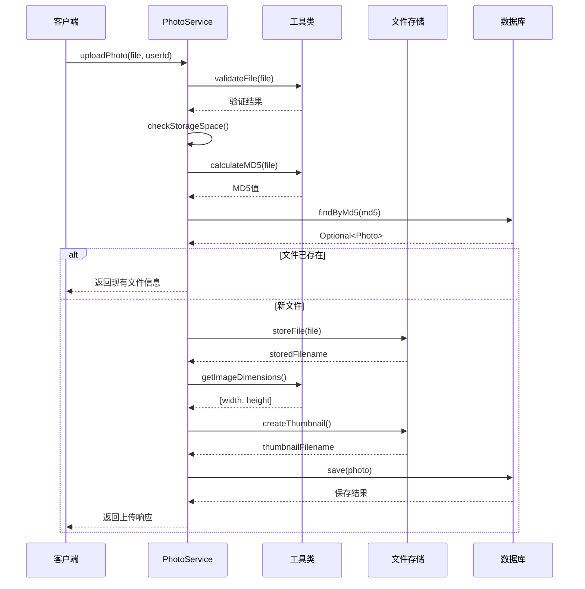
```mermaid
sequenceDiagram
participant Client as 客户端
participant Service as PhotoService
participant Utils as 工具类
participant Storage as 文件存储
participant Repo as 数据库
Client->>Service : uploadPhoto(file, userId)
Service->>Utils : validateFile(file)
Utils-->>Service : 验证结果
Service->>Service : checkStorageSpace()
Service->>Utils : calculateMD5(file)
Utils-->>Service : MD5值
Service->>Repo : findByMd5(md5)
Repo-->>Service : Optional<Photo>
alt 文件已存在
Service-->>Client : 返回现有文件信息
else 新文件
Service->>Storage : storeFile(file)
Storage-->>Service : storedFilename
Service->>Utils : getImageDimensions()
Utils-->>Service : [width, height]
Service->>Storage : createThumbnail()
Storage-->>Service : thumbnailFilename
Service->>Repo : save(photo)
Repo-->>Service : 保存结果
Service-->>Client : 返回上传响应
end
```

**图表来源**
- [PhotoService.java](file://src/main/java/com/photo/service/PhotoService.java#L51-L106)

### 内容管理流程

#### Markdown渲染流程
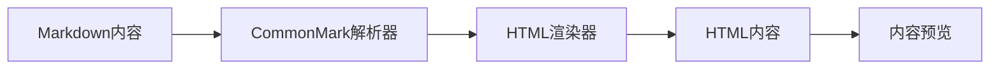
```mermaid
flowchart LR
Markdown[Markdown内容] --> Parser[CommonMark解析器]
Parser --> Renderer[HTML渲染器]
Renderer --> HTML[HTML内容]
HTML --> Preview[内容预览]
```

**图表来源**
- [BlogService.java](file://src/main/java/com/photo/service/BlogService.java#L158-L170)
- [NoteService.java](file://src/main/java/com/photo/service/NoteService.java#L120-L132)

### 用户认证流程

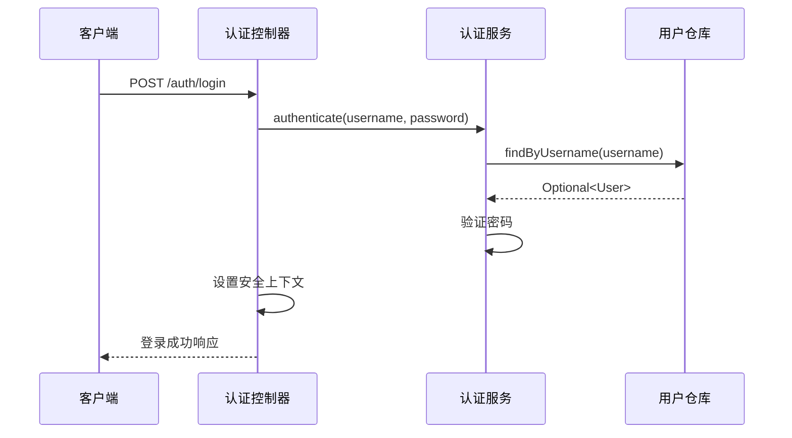
```mermaid
sequenceDiagram
participant Client as 客户端
participant AuthController as 认证控制器
participant AuthService as 认证服务
participant UserRepo as 用户仓库
Client->>AuthController : POST /auth/login
AuthController->>AuthService : authenticate(username, password)
AuthService->>UserRepo : findByUsername(username)
UserRepo-->>AuthService : Optional<User>
AuthService->>AuthService : 验证密码
AuthController->>AuthController : 设置安全上下文
AuthController-->>Client : 登录成功响应
```

**图表来源**
- [AuthController.java](file://src/main/java/com/photo/controller/AuthController.java#L47-L80)

**章节来源**
- [PhotoService.java](file://src/main/java/com/photo/service/PhotoService.java#L51-L106)
- [BlogService.java](file://src/main/java/com/photo/service/BlogService.java#L197-L210)
- [NoteService.java](file://src/main/java/com/photo/service/NoteService.java#L159-L169)
- [AuthController.java](file://src/main/java/com/photo/controller/AuthController.java#L47-L80)

## 性能优化考虑

### 数据库优化

#### 索引策略
- **复合索引**：在频繁查询的字段上建立索引
- **覆盖索引**：减少回表查询次数
- **分区策略**：对于大规模数据可考虑分区

#### 查询优化
- **分页查询**：避免全表扫描
- **条件过滤**：自动过滤软删除记录
- **连接优化**：避免不必要的JOIN操作

### 缓存策略

#### Spring Cache集成
- **方法级缓存**：对频繁查询的方法启用缓存
- **缓存失效**：及时清除更新数据的缓存
- **缓存穿透防护**：防止恶意请求导致缓存雪崩

### 内存优化

#### 对象池化
- **实体对象**：合理控制实体对象的数量
- **DTO转换**：避免重复的对象转换
- **临时对象**：及时释放不需要的临时对象

### 安全优化

#### 密码安全
- **哈希存储**：使用强哈希算法存储密码
- **盐值使用**：为每个密码生成唯一盐值
- **定期轮换**：支持密码定期更换机制

#### 权限控制
- **RBAC模型**：基于角色的访问控制
- **资源级权限**：细粒度的资源访问控制
- **审计日志**：完整的操作审计记录

## 总结

本文档全面分析了基于Spring Boot的综合内容管理系统数据模型，重点阐述了：

1. **多实体架构设计**：包含Photo、User、Note、Blog四个核心实体，涵盖照片管理、用户认证、便签管理和博客管理的完整业务场景
2. **JPA映射策略**：通过注解实现优雅的ORM映射，支持复杂的数据关系和业务逻辑
3. **DTO设计模式**：优化API接口的数据传输，提供专门的DTO对象处理不同业务场景
4. **数据库表结构**：基于schema.sql的完整表定义，包含用户表、便签表、博客表和照片表
5. **业务字段设计**：文件去重、访问统计、软删除、密码安全、Markdown渲染等关键功能
6. **性能优化**：索引、缓存、查询优化、安全优化等多维度优化策略
7. **认证授权**：完整的用户认证流程，支持登录、注销、注册等功能

该数据模型设计充分考虑了系统的可扩展性、性能和维护性，为构建稳定可靠的内容管理平台奠定了坚实的基础。通过合理的实体设计和业务逻辑分离，系统能够有效支持多种内容类型的管理需求，同时保持良好的用户体验和系统性能。